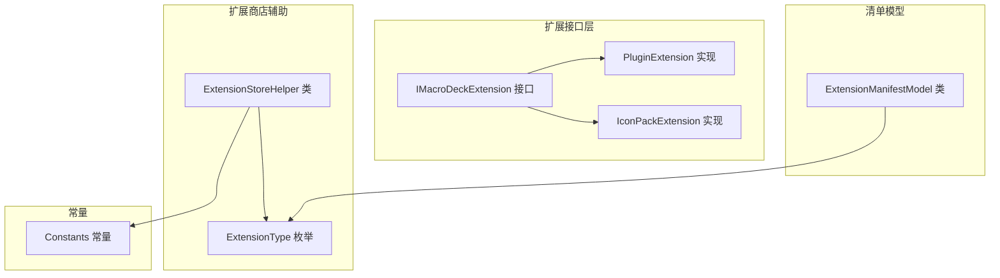
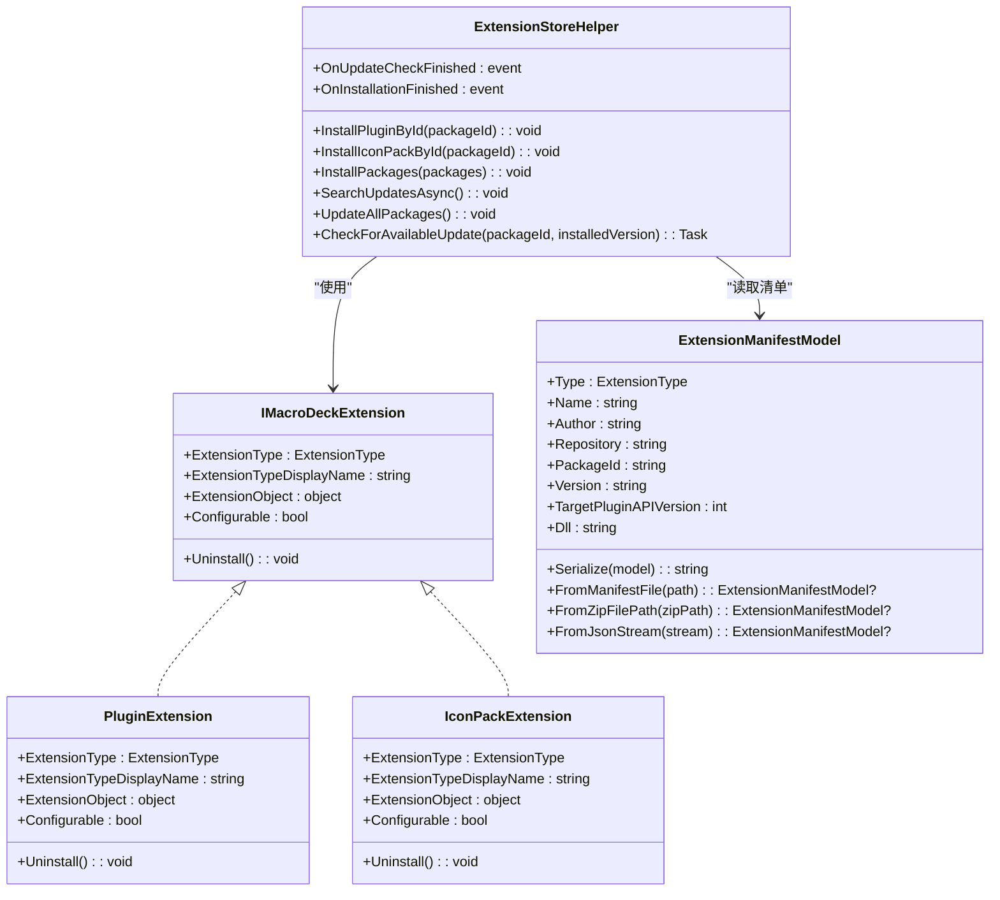
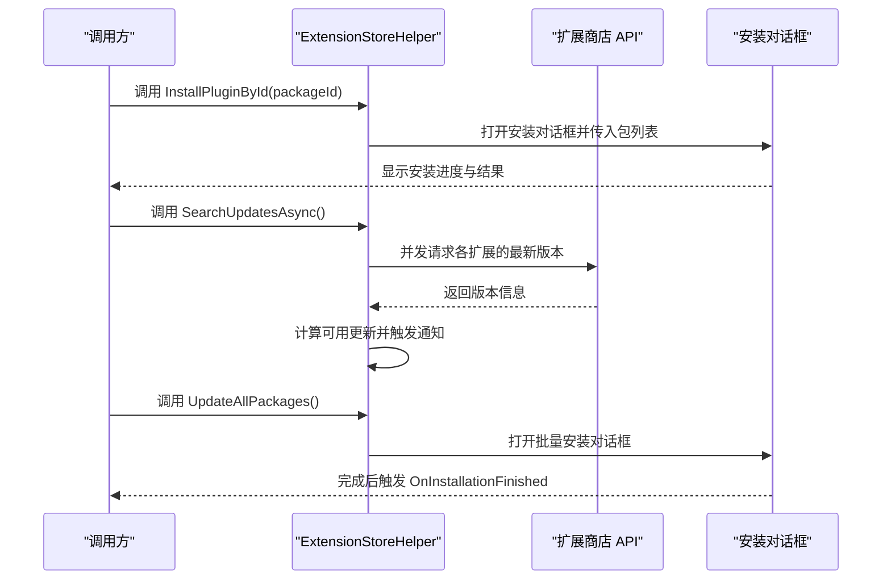
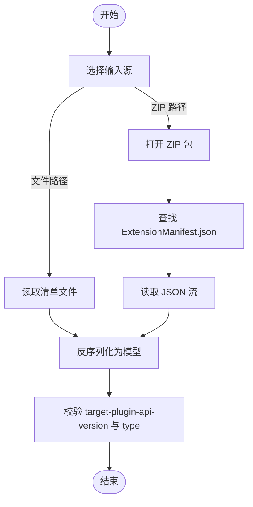
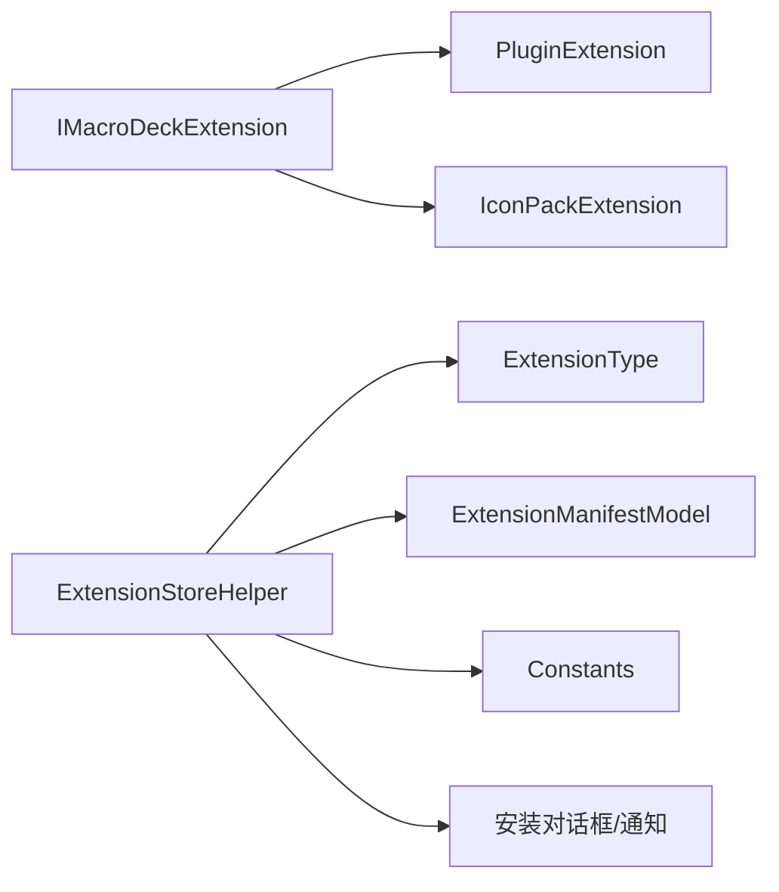

# API 参考

<cite>
**本文引用的文件**
- [IMacroDeckExtension.cs](file://src/MacroDeck/Extension/IMacroDeckExtension.cs)
- [PluginExtension.cs](file://src/MacroDeck/Extension/PluginExtension.cs)
- [IconPackExtension.cs](file://src/MacroDeck/Extension/IconPackExtension.cs)
- [ExtensionStoreHelper.cs](file://src/MacroDeck/ExtensionStore/ExtensionStoreHelper.cs)
- [ExtensionManifestModel.cs](file://src/MacroDeck/Models/ExtensionManifestModel.cs)
- [Constants.cs](file://src/MacroDeck/Constants.cs)
- [ExtensionType 枚举定义:190-194](file://src/MacroDeck/ExtensionStore/ExtensionStoreHelper.cs#L190-L194)
</cite>

## 目录
1. [简介](#简介)
2. [项目结构](#项目结构)
3. [核心组件](#核心组件)
4. [架构总览](#架构总览)
5. [详细组件分析](#详细组件分析)
6. [依赖关系分析](#依赖关系分析)
7. [性能与使用限制](#性能与使用限制)
8. [故障排查指南](#故障排查指南)
9. [结论](#结论)
10. [附录：版本兼容性与迁移指南](#附录版本兼容性与迁移指南)

## 简介
本文件为 Macro-Deck 扩展生态的 API 参考，重点覆盖以下内容：
- 公共接口设计与方法签名说明（特别是 IMacroDeckExtension）。
- 插件与图标包两类扩展的实现要点与扩展点。
- 公共类、接口与枚举的完整 API 文档与使用示例路径。
- 方法参数、返回值与异常处理策略。
- 实际使用模式与最佳实践。
- 版本兼容性与迁移建议。
- 性能特性与使用限制。

## 项目结构
与扩展 API 直接相关的关键模块包括：
- 扩展接口层：IMacroDeckExtension 及其具体实现（PluginExtension、IconPackExtension）。
- 扩展商店辅助工具：ExtensionStoreHelper 提供安装、更新检查、批量更新等能力。
- 清单模型：ExtensionManifestModel 定义扩展清单字段及序列化/反序列化逻辑。
- 常量配置：Constants 提供扩展商店 API 基础地址。

**图表来源**
- [IMacroDeckExtension.cs:5-12](file://src/MacroDeck/Extension/IMacroDeckExtension.cs#L5-L12)
- [PluginExtension.cs:7-23](file://src/MacroDeck/Extension/PluginExtension.cs#L7-L23)
- [IconPackExtension.cs:7-22](file://src/MacroDeck/Extension/IconPackExtension.cs#L7-L22)
- [ExtensionStoreHelper.cs:17-194](file://src/MacroDeck/ExtensionStore/ExtensionStoreHelper.cs#L17-L194)
- [ExtensionManifestModel.cs:8-60](file://src/MacroDeck/Models/ExtensionManifestModel.cs#L8-L60)
- [Constants.cs:3-6](file://src/MacroDeck/Constants.cs#L3-L6)

**章节来源**
- [IMacroDeckExtension.cs:1-13](file://src/MacroDeck/Extension/IMacroDeckExtension.cs#L1-L13)
- [PluginExtension.cs:1-24](file://src/MacroDeck/Extension/PluginExtension.cs#L1-L24)
- [IconPackExtension.cs:1-23](file://src/MacroDeck/Extension/IconPackExtension.cs#L1-L23)
- [ExtensionStoreHelper.cs:1-195](file://src/MacroDeck/ExtensionStore/ExtensionStoreHelper.cs#L1-L195)
- [ExtensionManifestModel.cs:1-61](file://src/MacroDeck/Models/ExtensionManifestModel.cs#L1-L61)
- [Constants.cs:1-7](file://src/MacroDeck/Constants.cs#L1-L7)

## 核心组件
本节对扩展 API 的核心类型进行逐项说明，并给出使用示例的定位路径。

- IMacroDeckExtension 接口
  - 角色：统一抽象所有扩展对象，便于系统以一致方式识别扩展类型、显示名称、可配置性以及卸载行为。
  - 关键成员与语义
    - ExtensionType：扩展类型（Plugin 或 IconPack），用于区分扩展类别。
    - ExtensionTypeDisplayName：扩展类型的本地化显示名。
    - ExtensionObject：承载具体扩展实例（如 MacroDeckPlugin 或 IconPack）。
    - Configurable：指示扩展是否可配置（由具体实现决定）。
    - Uninstall()：卸载扩展的入口方法。
  - 使用示例路径
    - [接口定义:5-12](file://src/MacroDeck/Extension/IMacroDeckExtension.cs#L5-L12)

- PluginExtension 实现
  - 角色：将插件包装为 IMacroDeckExtension，暴露插件的可配置性与类型信息。
  - 关键成员与语义
    - ExtensionType 固定为 Plugin。
    - ExtensionTypeDisplayName 来自语言资源。
    - ExtensionObject 即传入的 MacroDeckPlugin 实例。
    - Configurable 基于 MacroDeckPlugin.CanConfigure 判断。
    - Uninstall() 留空实现（由系统负责卸载流程）。
  - 使用示例路径
    - [实现类:7-23](file://src/MacroDeck/Extension/PluginExtension.cs#L7-L23)

- IconPackExtension 实现
  - 角色：将图标包包装为 IMacroDeckExtension。
  - 关键成员与语义
    - ExtensionType 固定为 IconPack。
    - ExtensionTypeDisplayName 来自语言资源。
    - ExtensionObject 即传入的 IconPack 实例。
    - Configurable 恒为 false。
    - Uninstall() 留空实现。
  - 使用示例路径
    - [实现类:7-22](file://src/MacroDeck/Extension/IconPackExtension.cs#L7-L22)

- ExtensionStoreHelper 工具类
  - 角色：扩展商店交互与安装流程的中枢，提供安装、更新检查、批量更新等能力。
  - 关键静态方法与用途
    - InstallPluginById(packageId)：按包 ID 安装插件。
    - InstallIconPackById(packageId)：按包 ID 安装图标包。
    - InstallPackages(packages)：打开安装对话框并执行安装队列。
    - SearchUpdatesAsync()：异步扫描可用更新，触发通知与事件。
    - UpdateAllPackages()：收集待更新的插件与图标包并批量安装。
    - CheckForAvailableUpdate(packageId, installedVersion)：查询指定扩展是否有新版本。
  - 事件
    - OnUpdateCheckFinished：更新检查完成时触发。
    - OnInstallationFinished：安装流程结束时触发。
  - 使用示例路径
    - [安装与更新方法:31-160](file://src/MacroDeck/ExtensionStore/ExtensionStoreHelper.cs#L31-L160)
    - [更新检查与通知:71-131](file://src/MacroDeck/ExtensionStore/ExtensionStoreHelper.cs#L71-L131)
    - [批量更新:133-160](file://src/MacroDeck/ExtensionStore/ExtensionStoreHelper.cs#L133-L160)
    - [更新检查实现:162-187](file://src/MacroDeck/ExtensionStore/ExtensionStoreHelper.cs#L162-L187)

- ExtensionManifestModel 清单模型
  - 角色：描述扩展元数据与打包信息，支持从文件或 ZIP 流中解析。
  - 关键字段
    - type：扩展类型（默认 Plugin）。
    - name、author、repository、packageId、version：扩展基本信息。
    - target-plugin-api-version：目标插件 API 版本。
    - dll：扩展程序集文件名。
  - 关键方法
    - Serialize(model)：序列化为 JSON 字符串。
    - FromManifestFile(path)：从清单文件读取。
    - FromZipFilePath(zipPath)：从 ZIP 包中提取并解析。
    - FromJsonStream(stream)：从流反序列化。
  - 使用示例路径
    - [清单模型:8-60](file://src/MacroDeck/Models/ExtensionManifestModel.cs#L8-L60)

- Constants 常量
  - 角色：集中存放扩展商店 API 基础地址。
  - 使用示例路径
    - [常量定义:3-6](file://src/MacroDeck/Constants.cs#L3-L6)

**章节来源**
- [IMacroDeckExtension.cs:5-12](file://src/MacroDeck/Extension/IMacroDeckExtension.cs#L5-L12)
- [PluginExtension.cs:7-23](file://src/MacroDeck/Extension/PluginExtension.cs#L7-L23)
- [IconPackExtension.cs:7-22](file://src/MacroDeck/Extension/IconPackExtension.cs#L7-L22)
- [ExtensionStoreHelper.cs:31-187](file://src/MacroDeck/ExtensionStore/ExtensionStoreHelper.cs#L31-L187)
- [ExtensionManifestModel.cs:8-60](file://src/MacroDeck/Models/ExtensionManifestModel.cs#L8-L60)
- [Constants.cs:3-6](file://src/MacroDeck/Constants.cs#L3-L6)

## 架构总览
下图展示了扩展接口、实现与扩展商店辅助工具之间的关系，以及扩展清单在安装与更新过程中的作用。

**图表来源**
- [IMacroDeckExtension.cs:5-12](file://src/MacroDeck/Extension/IMacroDeckExtension.cs#L5-L12)
- [PluginExtension.cs:7-23](file://src/MacroDeck/Extension/PluginExtension.cs#L7-L23)
- [IconPackExtension.cs:7-22](file://src/MacroDeck/Extension/IconPackExtension.cs#L7-L22)
- [ExtensionStoreHelper.cs:31-187](file://src/MacroDeck/ExtensionStore/ExtensionStoreHelper.cs#L31-L187)
- [ExtensionManifestModel.cs:8-60](file://src/MacroDeck/Models/ExtensionManifestModel.cs#L8-L60)

## 详细组件分析

### IMacroDeckExtension 接口
- 设计意图
  - 统一扩展对象的外部契约，使系统可以无差别地处理插件与图标包。
- 成员详解
  - ExtensionType：返回扩展类型枚举，用于 UI 分类与业务分支判断。
  - ExtensionTypeDisplayName：返回本地化后的类型名称，便于界面展示。
  - ExtensionObject：承载具体扩展实例，调用方应根据 ExtensionType 进行类型断言。
  - Configurable：指示扩展是否具备配置界面，影响 UI 可用性。
  - Uninstall()：卸载扩展的钩子，具体卸载逻辑由系统实现。
- 使用模式
  - 在扩展管理器中遍历已安装扩展，通过 ExtensionType 判断类型并分别处理。
  - 在配置界面中依据 Configurable 决定是否显示“配置”按钮。
- 示例定位
  - [接口定义:5-12](file://src/MacroDeck/Extension/IMacroDeckExtension.cs#L5-L12)

**章节来源**
- [IMacroDeckExtension.cs:5-12](file://src/MacroDeck/Extension/IMacroDeckExtension.cs#L5-L12)

### PluginExtension 实现
- 设计要点
  - 将 MacroDeckPlugin 作为 ExtensionObject，自动继承其 CanConfigure 属性以决定 Configurable。
  - Uninstall() 留空，表示卸载由系统统一处理。
- 使用模式
  - 当需要将一个插件纳入扩展管理器统一展示时，可构造该包装对象。
- 示例定位
  - [实现类:7-23](file://src/MacroDeck/Extension/PluginExtension.cs#L7-L23)

**章节来源**
- [PluginExtension.cs:7-23](file://src/MacroDeck/Extension/PluginExtension.cs#L7-L23)

### IconPackExtension 实现
- 设计要点
  - 将 IconPack 作为 ExtensionObject，Configurable 恒为 false。
  - Uninstall() 留空，表示卸载由系统统一处理。
- 使用模式
  - 当需要将图标包纳入扩展管理器统一展示时，可构造该包装对象。
- 示例定位
  - [实现类:7-22](file://src/MacroDeck/Extension/IconPackExtension.cs#L7-L22)

**章节来源**
- [IconPackExtension.cs:7-22](file://src/MacroDeck/Extension/IconPackExtension.cs#L7-L22)

### ExtensionStoreHelper 工具类
- 安装流程
  - InstallPluginById / InstallIconPackById：快速安装单一扩展。
  - InstallPackages：打开安装对话框并执行安装队列。
- 更新流程
  - SearchUpdatesAsync：并发检查插件与图标包的可用更新，触发通知与事件。
  - UpdateAllPackages：收集待更新扩展并批量安装。
  - CheckForAvailableUpdate：基于扩展商店 API 查询最新版本文件并比对当前版本。
- 异常处理
  - 更新检查过程中捕获异常并记录日志，避免中断主流程。
- 示例定位
  - [安装与更新方法:31-160](file://src/MacroDeck/ExtensionStore/ExtensionStoreHelper.cs#L31-L160)
  - [更新检查与通知:71-131](file://src/MacroDeck/ExtensionStore/ExtensionStoreHelper.cs#L71-L131)
  - [批量更新:133-160](file://src/MacroDeck/ExtensionStore/ExtensionStoreHelper.cs#L133-L160)
  - [更新检查实现:162-187](file://src/MacroDeck/ExtensionStore/ExtensionStoreHelper.cs#L162-L187)

**图表来源**
- [ExtensionStoreHelper.cs:31-160](file://src/MacroDeck/ExtensionStore/ExtensionStoreHelper.cs#L31-L160)
- [Constants.cs:5-5](file://src/MacroDeck/Constants.cs#L5-L5)

**章节来源**
- [ExtensionStoreHelper.cs:31-187](file://src/MacroDeck/ExtensionStore/ExtensionStoreHelper.cs#L31-L187)
- [Constants.cs:5-5](file://src/MacroDeck/Constants.cs#L5-L5)

### ExtensionManifestModel 清单模型
- 字段说明
  - type：扩展类型（默认 Plugin）。
  - name、author、repository、packageId、version：扩展基本信息。
  - target-plugin-api-version：目标插件 API 版本，用于兼容性校验。
  - dll：扩展程序集文件名。
- 解析流程
  - 支持从清单文件、ZIP 包内 JSON 流解析，内部使用流式反序列化。
- 使用模式
  - 在安装前读取清单以验证兼容性与元信息；在打包发布时序列化为 JSON。
- 示例定位
  - [清单模型:8-60](file://src/MacroDeck/Models/ExtensionManifestModel.cs#L8-L60)

**图表来源**
- [ExtensionManifestModel.cs:32-59](file://src/MacroDeck/Models/ExtensionManifestModel.cs#L32-L59)

**章节来源**
- [ExtensionManifestModel.cs:8-60](file://src/MacroDeck/Models/ExtensionManifestModel.cs#L8-L60)

## 依赖关系分析
- 接口与实现
  - IMacroDeckExtension 是扩展对象的统一抽象，PluginExtension 与 IconPackExtension 分别实现该接口。
- 工具类依赖
  - ExtensionStoreHelper 依赖 ExtensionType 枚举、ExtensionManifestModel、Constants 等。
  - ExtensionStoreHelper 通过扩展商店 API 获取版本信息，用于更新检查。
- 事件与 UI
  - ExtensionStoreHelper 暴露 OnUpdateCheckFinished 与 OnInstallationFinished 事件，便于 UI 同步状态。

**图表来源**
- [IMacroDeckExtension.cs:5-12](file://src/MacroDeck/Extension/IMacroDeckExtension.cs#L5-L12)
- [PluginExtension.cs:7-23](file://src/MacroDeck/Extension/PluginExtension.cs#L7-L23)
- [IconPackExtension.cs:7-22](file://src/MacroDeck/Extension/IconPackExtension.cs#L7-L22)
- [ExtensionStoreHelper.cs:17-194](file://src/MacroDeck/ExtensionStore/ExtensionStoreHelper.cs#L17-L194)
- [ExtensionManifestModel.cs:8-60](file://src/MacroDeck/Models/ExtensionManifestModel.cs#L8-L60)
- [Constants.cs:3-6](file://src/MacroDeck/Constants.cs#L3-L6)

**章节来源**
- [ExtensionStoreHelper.cs:17-194](file://src/MacroDeck/ExtensionStore/ExtensionStoreHelper.cs#L17-L194)
- [ExtensionManifestModel.cs:8-60](file://src/MacroDeck/Models/ExtensionManifestModel.cs#L8-L60)
- [Constants.cs:3-6](file://src/MacroDeck/Constants.cs#L3-L6)

## 性能与使用限制
- 并发更新检查
  - SearchUpdatesAsync 内部对插件与图标包进行并发更新检查，注意网络 I/O 与 CPU 开销。
- 安装对话框
  - InstallPackages 会阻塞 UI 线程以确保线程安全，建议在后台任务中调用。
- 版本对比
  - CheckForAvailableUpdate 通过扩展商店 API 获取最新文件信息，若网络异常将记录错误并返回未发现更新。
- 使用限制
  - 扩展商店 API 基础地址由 Constants 统一维护，变更时需同步更新客户端。
  - 清单解析仅支持 UTF-8 编码的 JSON 文件，确保打包规范一致。

[本节为通用性能讨论，不直接分析特定文件]

## 故障排查指南
- 更新检查失败
  - 现象：更新检查完成后未收到通知或未触发事件。
  - 排查：确认网络连通性与扩展商店 API 地址；查看日志中关于更新检查的错误记录。
  - 参考
    - [更新检查实现:162-187](file://src/MacroDeck/ExtensionStore/ExtensionStoreHelper.cs#L162-L187)
- 安装无响应
  - 现象：调用 InstallPackages 后 UI 无反应。
  - 排查：确认 MainWindow 是否存在且线程上下文正确；检查 OnInstallationFinished 事件是否被订阅。
  - 参考
    - [安装流程:48-64](file://src/MacroDeck/ExtensionStore/ExtensionStoreHelper.cs#L48-L64)
- 清单解析失败
  - 现象：FromZipFilePath 或 FromJsonStream 返回空。
  - 排查：确认 ZIP 包内存在 ExtensionManifest.json；确认 JSON 结构与字段完整。
  - 参考
    - [清单解析:32-59](file://src/MacroDeck/Models/ExtensionManifestModel.cs#L32-L59)

**章节来源**
- [ExtensionStoreHelper.cs:48-64](file://src/MacroDeck/ExtensionStore/ExtensionStoreHelper.cs#L48-L64)
- [ExtensionStoreHelper.cs:162-187](file://src/MacroDeck/ExtensionStore/ExtensionStoreHelper.cs#L162-L187)
- [ExtensionManifestModel.cs:32-59](file://src/MacroDeck/Models/ExtensionManifestModel.cs#L32-L59)

## 结论
Macro-Deck 的扩展 API 通过 IMacroDeckExtension 抽象了插件与图标包的共同特征，并由 ExtensionStoreHelper 提供安装、更新检查与批量更新的完整流程。ExtensionManifestModel 则保证了扩展元数据的一致性与可解析性。遵循本文档的使用模式与注意事项，可有效提升扩展开发与集成的稳定性与性能。

[本节为总结性内容，不直接分析特定文件]

## 附录：版本兼容性与迁移指南
- 目标插件 API 版本
  - 清单模型包含 target-plugin-api-version 字段，默认值为 31，用于声明扩展所兼容的插件 API 版本。
  - 建议在升级插件 API 时同步提高该值，并在安装前进行兼容性校验。
  - 参考
    - [清单模型字段:22-23](file://src/MacroDeck/Models/ExtensionManifestModel.cs#L22-L23)
- 扩展商店 API 版本
  - ExtensionStoreHelper 在查询更新时会携带 MacroDeck.PluginApiVersion 与 MacroDeck.Version 参数，确保服务端返回匹配的文件信息。
  - 参考
    - [更新检查实现:162-171](file://src/MacroDeck/ExtensionStore/ExtensionStoreHelper.cs#L162-L171)
- 迁移建议
  - 当插件 API 发生破坏性变更时，应提高 target-plugin-api-version 并提供迁移提示或降级方案。
  - 对于扩展商店 API 的变更，优先通过 Constants 统一调整基础地址与参数格式。

**章节来源**
- [ExtensionManifestModel.cs:22-23](file://src/MacroDeck/Models/ExtensionManifestModel.cs#L22-L23)
- [ExtensionStoreHelper.cs:162-171](file://src/MacroDeck/ExtensionStore/ExtensionStoreHelper.cs#L162-L171)
- [Constants.cs:5-5](file://src/MacroDeck/Constants.cs#L5-L5)