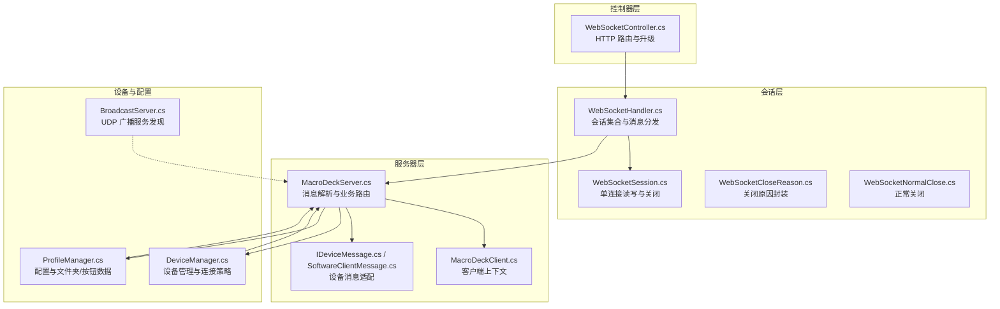
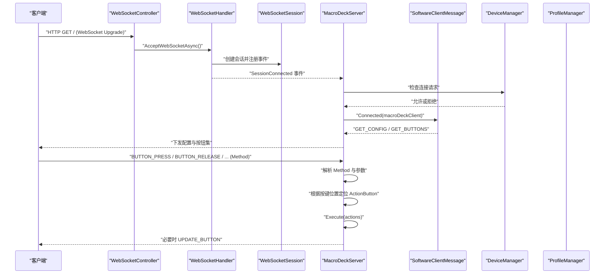
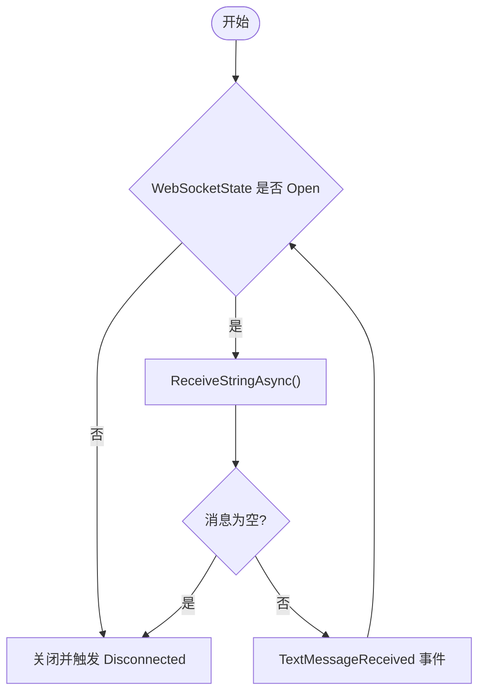
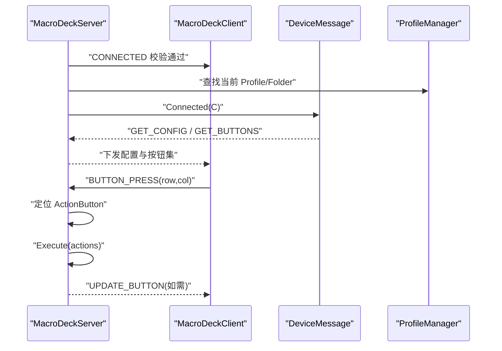
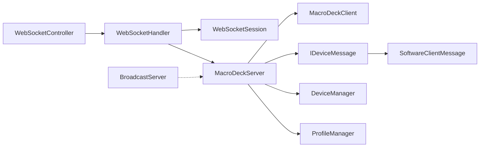
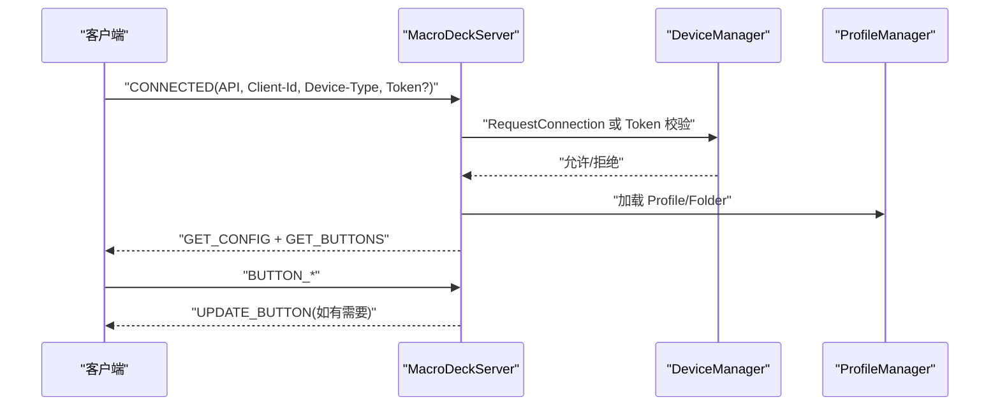

# WebSocket API

<cite>
**本文引用的文件**
- [WebSocketController.cs](file://src/MacroDeck/Controllers/WebSocketController.cs)
- [WebSocketHandler.cs](file://src/MacroDeck/WebSocketHandler.cs)
- [WebSocketSession.cs](file://src/MacroDeck/DataTypes/WebSocketSession.cs)
- [WebSocketCloseReason.cs](file://src/MacroDeck/DataTypes/WebSocketCloseReason.cs)
- [WebSocketNormalClose.cs](file://src/MacroDeck/DataTypes/WebSocketNormalClose.cs)
- [MacroDeckServer.cs](file://src/MacroDeck/Server/MacroDeckServer.cs)
- [MacroDeckClient.cs](file://src/MacroDeck/Server/MacroDeckClient.cs)
- [SoftwareClientMessage.cs](file://src/MacroDeck/Server/DeviceMessage/SoftwareClientMessage.cs)
- [IDeviceMessage.cs](file://src/MacroDeck/Server/DeviceMessage/IDeviceMessage.cs)
- [JsonMethod.cs](file://src/MacroDeck/JSON/JsonMethod.cs)
- [ButtonPressType.cs](file://src/MacroDeck/Enums/ButtonPressType.cs)
- [DeviceManager.cs](file://src/MacroDeck/Device/DeviceManager.cs)
- [ProfileManager.cs](file://src/MacroDeck/Profiles/ProfileManager.cs)
- [BroadcastServer.cs](file://src/MacroDeck/Server/BroadcastServer.cs)
- [Program.cs](file://src/MacroDeck/Program.cs)
</cite>

## 目录
1. [简介](#简介)
2. [项目结构](#项目结构)
3. [核心组件](#核心组件)
4. [架构总览](#架构总览)
5. [详细组件分析](#详细组件分析)
6. [依赖关系分析](#依赖关系分析)
7. [性能与可扩展性](#性能与可扩展性)
8. [故障排查指南](#故障排查指南)
9. [结论](#结论)
10. [附录：消息格式与事件规范](#附录消息格式与事件规范)

## 简介
本文件面向设备开发者与客户端开发者，系统化阐述 Macro-Deck 的 WebSocket API 设计与实现。内容涵盖：
- WebSocket 协议入口与会话管理
- 消息格式、事件类型与数据结构
- 设备连接、状态同步与命令传输流程
- 消息路由、错误处理与断线重连建议
- 安全与性能优化要点
- 可直接用于开发的接口与调用序列图

## 项目结构
WebSocket API 相关代码主要分布在以下模块：
- 控制器层：负责 HTTP 到 WebSocket 的升级与接入
- 会话层：封装单个 WebSocket 连接，负责收发与生命周期
- 服务器层：统一处理消息分发、设备连接状态、配置下发与按钮更新
- 设备消息适配层：针对不同设备类别的消息格式与行为差异
- 配置与设备管理：设备白名单、连接请求确认、配置持久化
- 广播服务：向局域网广播服务发现信息（UDP）

**图表来源**
- [WebSocketController.cs:1-21](file://src/MacroDeck/Controllers/WebSocketController.cs#L1-L21)
- [WebSocketHandler.cs:1-92](file://src/MacroDeck/WebSocketHandler.cs#L1-L92)
- [WebSocketSession.cs:1-119](file://src/MacroDeck/DataTypes/WebSocketSession.cs#L1-L119)
- [WebSocketCloseReason.cs:1-16](file://src/MacroDeck/DataTypes/WebSocketCloseReason.cs#L1-L16)
- [WebSocketNormalClose.cs:1-12](file://src/MacroDeck/DataTypes/WebSocketNormalClose.cs#L1-L12)
- [MacroDeckServer.cs:1-376](file://src/MacroDeck/Server/MacroDeckServer.cs#L1-L376)
- [MacroDeckClient.cs:1-52](file://src/MacroDeck/Server/MacroDeckClient.cs#L1-L52)
- [IDeviceMessage.cs:1-10](file://src/MacroDeck/Server/DeviceMessage/IDeviceMessage.cs#L1-L10)
- [SoftwareClientMessage.cs:1-194](file://src/MacroDeck/Server/DeviceMessage/SoftwareClientMessage.cs#L1-L194)
- [DeviceManager.cs:1-278](file://src/MacroDeck/Device/DeviceManager.cs#L1-L278)
- [ProfileManager.cs:1-640](file://src/MacroDeck/Profiles/ProfileManager.cs#L1-L640)
- [BroadcastServer.cs:1-79](file://src/MacroDeck/Server/BroadcastServer.cs#L1-L79)

**章节来源**
- [WebSocketController.cs:1-21](file://src/MacroDeck/Controllers/WebSocketController.cs#L1-L21)
- [WebSocketHandler.cs:1-92](file://src/MacroDeck/WebSocketHandler.cs#L1-L92)
- [WebSocketSession.cs:1-119](file://src/MacroDeck/DataTypes/WebSocketSession.cs#L1-L119)
- [MacroDeckServer.cs:1-376](file://src/MacroDeck/Server/MacroDeckServer.cs#L1-L376)
- [MacroDeckClient.cs:1-52](file://src/MacroDeck/Server/MacroDeckClient.cs#L1-L52)
- [SoftwareClientMessage.cs:1-194](file://src/MacroDeck/Server/DeviceMessage/SoftwareClientMessage.cs#L1-L194)
- [DeviceManager.cs:1-278](file://src/MacroDeck/Device/DeviceManager.cs#L1-L278)
- [ProfileManager.cs:1-640](file://src/MacroDeck/Profiles/ProfileManager.cs#L1-L640)
- [BroadcastServer.cs:1-79](file://src/MacroDeck/Server/BroadcastServer.cs#L1-L79)

## 核心组件
- WebSocketController：接收 HTTP 请求，判断是否为 WebSocket 请求；若是则接受升级并交由处理器处理
- WebSocketHandler：维护会话列表，提供广播/定向发送、会话事件（连接/断开/消息）与关闭能力
- WebSocketSession：封装单个连接的读写循环、异常捕获、关闭与释放
- MacroDeckServer：消息解析与路由中枢，负责连接校验、设备上下文建立、按钮状态同步、动作执行
- MacroDeckClient：客户端上下文，包含设备类型、当前配置/文件夹、会话 ID 与设备消息适配器
- IDeviceMessage / SoftwareClientMessage：设备消息适配层，按设备类别下发配置、按钮集与单键更新
- DeviceManager：设备白名单、连接请求确认、阻断与保存
- ProfileManager：配置加载/保存、文件夹/按钮数据管理
- BroadcastServer：UDP 广播计算机名、IP 与端口，便于客户端发现

**章节来源**
- [WebSocketController.cs:1-21](file://src/MacroDeck/Controllers/WebSocketController.cs#L1-L21)
- [WebSocketHandler.cs:1-92](file://src/MacroDeck/WebSocketHandler.cs#L1-L92)
- [WebSocketSession.cs:1-119](file://src/MacroDeck/DataTypes/WebSocketSession.cs#L1-L119)
- [MacroDeckServer.cs:1-376](file://src/MacroDeck/Server/MacroDeckServer.cs#L1-L376)
- [MacroDeckClient.cs:1-52](file://src/MacroDeck/Server/MacroDeckClient.cs#L1-L52)
- [IDeviceMessage.cs:1-10](file://src/MacroDeck/Server/DeviceMessage/IDeviceMessage.cs#L1-L10)
- [SoftwareClientMessage.cs:1-194](file://src/MacroDeck/Server/DeviceMessage/SoftwareClientMessage.cs#L1-L194)
- [DeviceManager.cs:1-278](file://src/MacroDeck/Device/DeviceManager.cs#L1-L278)
- [ProfileManager.cs:1-640](file://src/MacroDeck/Profiles/ProfileManager.cs#L1-L640)
- [BroadcastServer.cs:1-79](file://src/MacroDeck/Server/BroadcastServer.cs#L1-L79)

## 架构总览
WebSocket API 的整体交互流程如下：

**图表来源**
- [WebSocketController.cs:1-21](file://src/MacroDeck/Controllers/WebSocketController.cs#L1-L21)
- [WebSocketHandler.cs:1-92](file://src/MacroDeck/WebSocketHandler.cs#L1-L92)
- [WebSocketSession.cs:1-119](file://src/MacroDeck/DataTypes/WebSocketSession.cs#L1-L119)
- [MacroDeckServer.cs:1-376](file://src/MacroDeck/Server/MacroDeckServer.cs#L1-L376)
- [SoftwareClientMessage.cs:1-194](file://src/MacroDeck/Server/DeviceMessage/SoftwareClientMessage.cs#L1-L194)
- [DeviceManager.cs:1-278](file://src/MacroDeck/Device/DeviceManager.cs#L1-L278)
- [ProfileManager.cs:1-640](file://src/MacroDeck/Profiles/ProfileManager.cs#L1-L640)

## 详细组件分析

### WebSocketController：连接入口与升级
- 责任：判断是否为 WebSocket 请求，否则重定向到前端页面；接受升级后交由处理器处理
- 关键点：路由路径“/”，仅在 WebSocket 请求时进入处理链

**章节来源**
- [WebSocketController.cs:1-21](file://src/MacroDeck/Controllers/WebSocketController.cs#L1-L21)

### WebSocketHandler：会话管理与消息分发
- 维护全局会话列表，提供：
  - 广播消息：SendMessageToAll
  - 多客户端发送：SendMessageToMany
  - 单客户端发送：SendMessageToClient
  - 关闭指定会话：Close
  - 查询可用性：IsAvailable
- 事件：
  - SessionConnected：新会话建立
  - SessionDisconnected：会话断开
  - MessageReceived：收到文本消息

**章节来源**
- [WebSocketHandler.cs:1-92](file://src/MacroDeck/WebSocketHandler.cs#L1-L92)

### WebSocketSession：单连接读写与生命周期
- 读取循环：持续接收 UTF-8 文本消息，直到连接关闭或异常
- 发送：UTF-8 文本帧发送
- 关闭：支持自定义关闭原因（含正常关闭）
- 异常：捕获异常并通过 Error 事件上报，最终触发 Disconnected

**图表来源**
- [WebSocketSession.cs:20-76](file://src/MacroDeck/DataTypes/WebSocketSession.cs#L20-L76)

**章节来源**
- [WebSocketSession.cs:1-119](file://src/MacroDeck/DataTypes/WebSocketSession.cs#L1-L119)
- [WebSocketCloseReason.cs:1-16](file://src/MacroDeck/DataTypes/WebSocketCloseReason.cs#L1-L16)
- [WebSocketNormalClose.cs:1-12](file://src/MacroDeck/DataTypes/WebSocketNormalClose.cs#L1-L12)

### MacroDeckServer：消息解析与业务路由
- 连接阶段：
  - 解析 CONNECTED 消息，校验 API 版本、设备类型、可选 Token
  - 建立 MacroDeckClient 上下文，设置设备类型与当前配置/文件夹
  - 触发设备连接状态变更事件
- 按键事件：
  - 解析 BUTTON_PRESS / BUTTON_RELEASE / BUTTON_LONG_PRESS / BUTTON_LONG_PRESS_RELEASE
  - 将消息中的行列索引映射到 ActionButton，执行对应动作集合
- 查询与更新：
  - GET_BUTTONS：异步下发当前文件夹所有按钮
  - UPDATE_BUTTON：异步下发单个按钮更新
- 全局操作：
  - SetProfile/SetFolder：切换配置/文件夹并同步到客户端
  - UpdateFolder/UpdateState：广播文件夹或按钮状态变化

**图表来源**
- [MacroDeckServer.cs:123-244](file://src/MacroDeck/Server/MacroDeckServer.cs#L123-L244)
- [SoftwareClientMessage.cs:14-122](file://src/MacroDeck/Server/DeviceMessage/SoftwareClientMessage.cs#L14-L122)

**章节来源**
- [MacroDeckServer.cs:1-376](file://src/MacroDeck/Server/MacroDeckServer.cs#L1-L376)
- [JsonMethod.cs:1-20](file://src/MacroDeck/JSON/JsonMethod.cs#L1-L20)
- [ButtonPressType.cs:1-10](file://src/MacroDeck/Enums/ButtonPressType.cs#L1-L10)

### 设备消息适配：SoftwareClientMessage
- Connected：下发配置与按钮集，并同步设备类型
- SendAllButtons：遍历当前文件夹按钮，生成包含图标 Base64、标签 Base64、背景色等字段的对象数组
- SendConfiguration：下发布局与外观配置、设备亮度、自动连接、唤醒策略等
- UpdateButton：下发单个按钮的更新对象

**章节来源**
- [SoftwareClientMessage.cs:1-194](file://src/MacroDeck/Server/DeviceMessage/SoftwareClientMessage.cs#L1-L194)
- [IDeviceMessage.cs:1-10](file://src/MacroDeck/Server/DeviceMessage/IDeviceMessage.cs#L1-L10)

### 设备与配置管理：DeviceManager 与 ProfileManager
- DeviceManager：
  - 加载/保存已知设备，支持白名单、阻断、显示名管理
  - 连接请求策略：可弹窗确认或自动接受；未知设备自动加入
- ProfileManager：
  - 加载/保存配置与文件夹/按钮数据
  - 支持变量模板渲染与标签更新广播

**章节来源**
- [DeviceManager.cs:1-278](file://src/MacroDeck/Device/DeviceManager.cs#L1-L278)
- [ProfileManager.cs:1-640](file://src/MacroDeck/Profiles/ProfileManager.cs#L1-L640)

### 广播服务：UDP 广播
- 定期广播计算机名、IP 地址与端口，便于客户端发现服务
- 使用定时器每 5 秒一次，目标地址为广播地址

**章节来源**
- [BroadcastServer.cs:1-79](file://src/MacroDeck/Server/BroadcastServer.cs#L1-L79)

## 依赖关系分析
- 控制器依赖处理器进行会话升级与处理
- 处理器依赖会话进行读写与事件分发
- 服务器依赖设备消息适配器与设备/配置管理
- 客户端上下文贯穿消息路由与动作执行
- 广播服务独立于 WebSocket 流程，用于服务发现

**图表来源**
- [WebSocketController.cs:1-21](file://src/MacroDeck/Controllers/WebSocketController.cs#L1-L21)
- [WebSocketHandler.cs:1-92](file://src/MacroDeck/WebSocketHandler.cs#L1-L92)
- [WebSocketSession.cs:1-119](file://src/MacroDeck/DataTypes/WebSocketSession.cs#L1-L119)
- [MacroDeckServer.cs:1-376](file://src/MacroDeck/Server/MacroDeckServer.cs#L1-L376)
- [MacroDeckClient.cs:1-52](file://src/MacroDeck/Server/MacroDeckClient.cs#L1-L52)
- [IDeviceMessage.cs:1-10](file://src/MacroDeck/Server/DeviceMessage/IDeviceMessage.cs#L1-L10)
- [SoftwareClientMessage.cs:1-194](file://src/MacroDeck/Server/DeviceMessage/SoftwareClientMessage.cs#L1-L194)
- [DeviceManager.cs:1-278](file://src/MacroDeck/Device/DeviceManager.cs#L1-L278)
- [ProfileManager.cs:1-640](file://src/MacroDeck/Profiles/ProfileManager.cs#L1-L640)
- [BroadcastServer.cs:1-79](file://src/MacroDeck/Server/BroadcastServer.cs#L1-L79)

**章节来源**
- 同上

## 性能与可扩展性
- 并发发送：WebSocketHandler 对多客户端发送使用并发任务聚合，提升广播效率
- 异步处理：按钮事件与配置下发均采用异步任务，避免阻塞主流程
- 批量更新：按钮集下发采用批量对象数组，减少帧数与往返
- 可扩展点：
  - 新增设备类型：实现 IDeviceMessage 接口并注入到 MacroDeckClient
  - 自定义消息：在 JsonMethod 中新增枚举值并在 MacroDeckServer 中添加路由分支
  - 限流与背压：可在 MacroDeckServer 中增加队列与速率限制策略

[本节为通用指导，不直接分析具体文件]

## 故障排查指南
- 连接被拒绝
  - 检查 CONNECTED 消息中的 API 版本、设备类型与 Token 是否满足要求
  - 确认 DeviceManager 的连接策略与白名单/阻断状态
- 无法收到按钮更新
  - 确认客户端已正确下发 GET_CONFIG 与 GET_BUTTONS
  - 检查软件客户端消息适配器是否正确生成按钮对象
- 按键无响应
  - 检查消息中行列索引是否与 ActionButton 的位置匹配
  - 查看 MacroDeckServer 的 Execute 分支是否命中对应动作集合
- 断线与重连
  - 客户端应监听 Disconnected 事件并实现指数退避重连
  - 服务端在异常时会触发 Disconnected，随后释放资源

**章节来源**
- [MacroDeckServer.cs:141-200](file://src/MacroDeck/Server/MacroDeckServer.cs#L141-L200)
- [MacroDeckServer.cs:201-239](file://src/MacroDeck/Server/MacroDeckServer.cs#L201-L239)
- [DeviceManager.cs:185-277](file://src/MacroDeck/Device/DeviceManager.cs#L185-L277)
- [SoftwareClientMessage.cs:25-97](file://src/MacroDeck/Server/DeviceMessage/SoftwareClientMessage.cs#L25-L97)

## 结论
Macro-Deck 的 WebSocket API 以清晰的分层设计实现了设备连接、配置下发、按钮状态同步与命令执行的完整闭环。通过统一的消息方法枚举与设备消息适配层，系统具备良好的扩展性。建议在生产环境中结合服务发现（UDP 广播）、安全认证（Token/证书）与断线重连策略，进一步提升稳定性与安全性。

[本节为总结，不直接分析具体文件]

## 附录：消息格式与事件规范

### 一、消息方法与事件类型
- CONNECTED：客户端连接请求，携带 API 版本、客户端标识、设备类型与可选 Token
- BUTTON_PRESS / BUTTON_RELEASE / BUTTON_LONG_PRESS / BUTTON_LONG_PRESS_RELEASE：按键事件，消息体包含行列索引
- GET_BUTTONS：请求当前文件夹按钮集
- GET_CONFIG：请求设备配置
- UPDATE_BUTTON：更新单个按钮
- 其他：GET_ICONS、UPDATE_LABEL、ICON_BASE64、BUTTON_DONE、GET_INSTALLED_PLUGINS、GET_INSTALLED_ICON_PACKS

**章节来源**
- [JsonMethod.cs:1-20](file://src/MacroDeck/JSON/JsonMethod.cs#L1-L20)
- [MacroDeckServer.cs:139-244](file://src/MacroDeck/Server/MacroDeckServer.cs#L139-L244)

### 二、消息字段与数据结构
- CONNECTED
  - 必填：Method=CONNECTED、API、Client-Id、Device-Type
  - 可选：Token
- 按键事件
  - Message 格式：行_列（例如 “1_2”），服务端解析为 ActionButton 位置
- GET_BUTTONS / GET_CONFIG
  - 服务端返回对应配置与按钮集
- UPDATE_BUTTON
  - 包含按钮的图标 Base64、标签 Base64、背景色与坐标

**章节来源**
- [MacroDeckServer.cs:141-200](file://src/MacroDeck/Server/MacroDeckServer.cs#L141-L200)
- [MacroDeckServer.cs:201-239](file://src/MacroDeck/Server/MacroDeckServer.cs#L201-L239)
- [SoftwareClientMessage.cs:79-96](file://src/MacroDeck/Server/DeviceMessage/SoftwareClientMessage.cs#L79-L96)
- [SoftwareClientMessage.cs:124-192](file://src/MacroDeck/Server/DeviceMessage/SoftwareClientMessage.cs#L124-L192)

### 三、设备类型与消息适配
- 设备类型枚举：软件客户端、硬件设备等
- 设备消息适配器：根据设备类型选择不同的消息格式与行为（如软件客户端）

**章节来源**
- [MacroDeckClient.cs:1-52](file://src/MacroDeck/Server/MacroDeckClient.cs#L1-L52)
- [IDeviceMessage.cs:1-10](file://src/MacroDeck/Server/DeviceMessage/IDeviceMessage.cs#L1-L10)
- [SoftwareClientMessage.cs:1-194](file://src/MacroDeck/Server/DeviceMessage/SoftwareClientMessage.cs#L1-L194)

### 四、客户端连接与状态同步流程

**图表来源**
- [MacroDeckServer.cs:141-200](file://src/MacroDeck/Server/MacroDeckServer.cs#L141-L200)
- [DeviceManager.cs:185-277](file://src/MacroDeck/Device/DeviceManager.cs#L185-L277)
- [ProfileManager.cs:205-311](file://src/MacroDeck/Profiles/ProfileManager.cs#L205-L311)
- [SoftwareClientMessage.cs:14-122](file://src/MacroDeck/Server/DeviceMessage/SoftwareClientMessage.cs#L14-L122)

### 五、安全与性能建议
- 安全
  - 使用 Token 进行快速配对，或启用 SSL 证书
  - 严格校验 CONNECTED 消息字段与 API 版本
  - 白名单与阻断机制配合用户确认
- 性能
  - 批量下发按钮集，避免逐条推送
  - 异步执行动作，避免阻塞网络线程
  - 广播服务定期刷新，确保客户端及时发现

**章节来源**
- [MacroDeckServer.cs:40-55](file://src/MacroDeck/Server/MacroDeckServer.cs#L40-L55)
- [MacroDeckServer.cs:141-200](file://src/MacroDeck/Server/MacroDeckServer.cs#L141-L200)
- [BroadcastServer.cs:13-79](file://src/MacroDeck/Server/BroadcastServer.cs#L13-L79)

### 六、客户端开发参考（步骤与要点）
- 步骤
  - 通过 UDP 广播发现服务（计算机名/IP/端口）
  - 建立 WebSocket 连接并发送 CONNECTED
  - 接收 GET_CONFIG 与 GET_BUTTONS
  - 处理按键事件并执行动作
  - 监听断线并实现重连
- 代码示例（路径）
  - 连接与消息处理：[WebSocketController.cs:7-19](file://src/MacroDeck/Controllers/WebSocketController.cs#L7-L19)、[WebSocketHandler.cs:37-49](file://src/MacroDeck/WebSocketHandler.cs#L37-L49)
  - 消息路由与动作执行：[MacroDeckServer.cs:123-244](file://src/MacroDeck/Server/MacroDeckServer.cs#L123-L244)
  - 按钮下发与更新：[SoftwareClientMessage.cs:25-97](file://src/MacroDeck/Server/DeviceMessage/SoftwareClientMessage.cs#L25-L97)、[SoftwareClientMessage.cs:124-192](file://src/MacroDeck/Server/DeviceMessage/SoftwareClientMessage.cs#L124-L192)

**章节来源**
- 同上