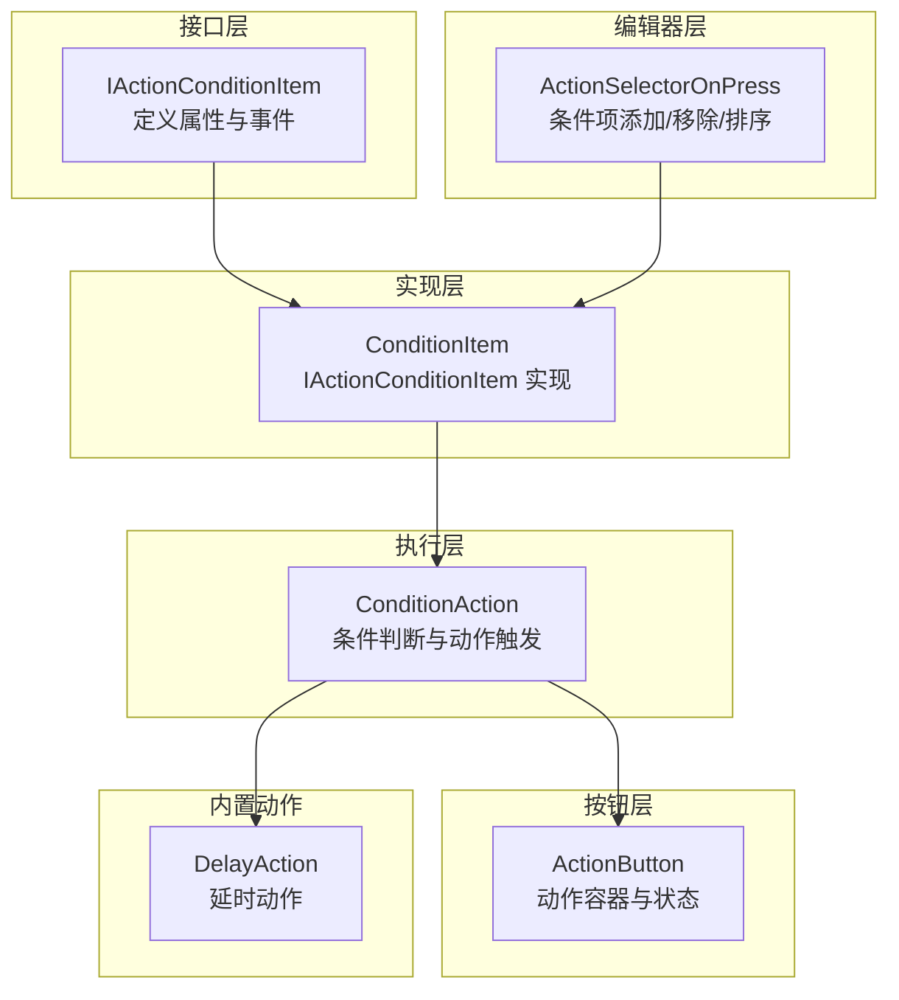
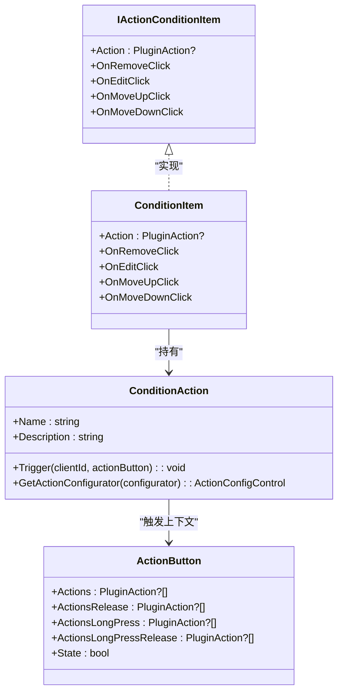
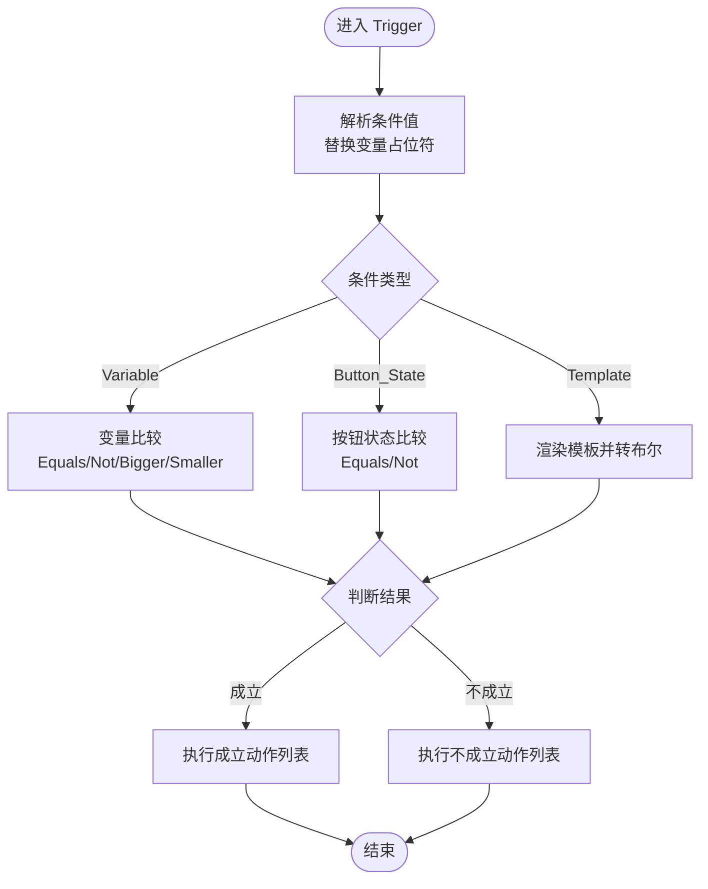
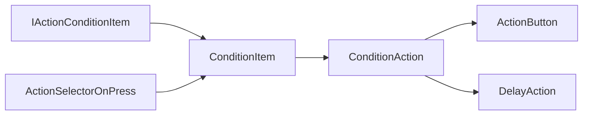

# 动作条件接口

<cite>
**本文档引用的文件**
- [IActionConditionItem.cs](file://src/MacroDeck/Interfaces/IActionConditionItem.cs)
- [ConditionAction.cs](file://src/MacroDeck/ActionButton/ConditionAction.cs)
- [ConditionItem.cs](file://src/MacroDeck/GUI/CustomControls/ButtonEditor/ConditionItem.cs)
- [ActionButton.cs](file://src/MacroDeck/ActionButton/ActionButton.cs)
- [ActionSelectorOnPress.cs](file://src/MacroDeck/GUI/CustomControls/ButtonEditor/ActionSelectorOnPress.cs)
- [DelayAction.cs](file://src/MacroDeck/InternalPlugins/ActionButtonPlugin/Actions/DelayAction.cs)
</cite>

## 更新摘要
**变更内容**
- 更新了 ConditionAction 的序列化逻辑部分，反映了配置持久化的修复
- 强调了条件系统与动作接口的完整性维护
- 补充了序列化错误处理和配置恢复机制的说明

## 目录
1. [简介](#简介)
2. [项目结构](#项目结构)
3. [核心组件](#核心组件)
4. [架构总览](#架构总览)
5. [详细组件分析](#详细组件分析)
6. [依赖关系分析](#依赖关系分析)
7. [性能考虑](#性能考虑)
8. [故障排除指南](#故障排除指南)
9. [结论](#结论)
10. [附录](#附录)

## 简介
本文件围绕 Macro-Deck 的动作条件接口进行系统化文档化，重点阐述 IActionConditionItem 接口的设计目的、实现要求与扩展方式；深入解析条件判断的触发机制与执行流程；记录条件判断的方法签名与参数定义；提供实际使用示例与配置方法；解释条件系统的整体架构与扩展点，并给出性能优化建议与完整实现指南。

**更新** 本版本特别关注了 ConditionAction 的序列化逻辑修复，确保条件动作的配置持久化正确性和条件系统与动作接口的完整性。

## 项目结构
与动作条件接口直接相关的代码分布在以下模块：
- 接口层：IActionConditionItem 定义了条件项的统一契约（属性与事件）
- 实现层：ConditionItem 是 IActionConditionItem 的具体实现，负责可视化编辑与配置
- 执行层：ConditionAction 实现条件判断逻辑并驱动后续动作链
- 按钮层：ActionButton 表示物理按钮或虚拟按键，承载动作集合与状态
- 编辑器层：ActionSelectorOnPress 负责在按钮编辑界面中添加/移除/排序条件项
- 内置动作：DelayAction 展示如何实现可配置的动作以配合条件使用

**图表来源**
- [IActionConditionItem.cs:5-12](file://src/MacroDeck/Interfaces/IActionConditionItem.cs#L5-L12)
- [ConditionItem.cs:11-18](file://src/MacroDeck/GUI/CustomControls/ButtonEditor/ConditionItem.cs#L11-L18)
- [ConditionAction.cs:11-256](file://src/MacroDeck/ActionButton/ConditionAction.cs#L11-L256)
- [ActionButton.cs:10-197](file://src/MacroDeck/ActionButton/ActionButton.cs#L10-L197)
- [ActionSelectorOnPress.cs:34-180](file://src/MacroDeck/GUI/CustomControls/ButtonEditor/ActionSelectorOnPress.cs#L34-L180)
- [DelayAction.cs:7-22](file://src/MacroDeck/InternalPlugins/ActionButtonPlugin/Actions/DelayAction.cs#L7-L22)

## 核心组件
- IActionConditionItem 接口
  - 设计目的：为条件项提供统一的属性与事件契约，便于在编辑器中进行通用操作（移除、编辑、上下移动）。
  - 关键成员：
    - Action：条件项关联的 PluginAction 实例（可读写）
    - OnRemoveClick：移除点击事件
    - OnEditClick：编辑点击事件
    - OnMoveUpClick / OnMoveDownClick：上移/下移点击事件
- ConditionItem 实现
  - 继承自 UserControl 并实现 IActionConditionItem
  - 提供条件类型选择、源变量/状态选择、比较方法与值等可视化配置
  - 通过事件桥接编辑器对条件项的增删改与排序操作
- ConditionAction 条件动作
  - 实现条件判断逻辑（变量、按钮状态、模板）
  - 支持"成立/不成立"两套动作列表，分别在满足与不满足条件时触发
  - 触发时会遍历对应动作列表并逐个执行
  - **更新**：具备完善的序列化机制，确保配置持久化正确性
- ActionButton 按钮
  - 承载多个动作集合（按下、释放、长按、长按释放），以及事件监听器
  - 作为条件动作触发的上下文对象（clientId 与自身实例）
- ActionSelectorOnPress 编辑器
  - 在按钮编辑界面中添加条件项，维护条件项集合与事件绑定
- DelayAction 延时动作
  - 展示可配置动作的典型实现，用于演示条件动作链中的组合使用

**章节来源**
- [IActionConditionItem.cs:5-12](file://src/MacroDeck/Interfaces/IActionConditionItem.cs#L5-L12)
- [ConditionItem.cs:11-18](file://src/MacroDeck/GUI/CustomControls/ButtonEditor/ConditionItem.cs#L11-L18)
- [ConditionAction.cs:11-256](file://src/MacroDeck/ActionButton/ConditionAction.cs#L11-L256)
- [ActionButton.cs:10-197](file://src/MacroDeck/ActionButton/ActionButton.cs#L10-L197)
- [ActionSelectorOnPress.cs:34-180](file://src/MacroDeck/GUI/CustomControls/ButtonEditor/ActionSelectorOnPress.cs#L34-L180)
- [DelayAction.cs:7-22](file://src/MacroDeck/InternalPlugins/ActionButtonPlugin/Actions/DelayAction.cs#L7-L22)

## 架构总览
条件系统采用"接口约束 + 可视化实现 + 条件动作执行"的分层设计：
- 接口层：IActionConditionItem 统一条件项行为
- 实现层：ConditionItem 将用户配置映射到 ConditionAction
- 执行层：ConditionAction 根据条件类型与方法进行判断，并触发相应动作集合
- 上下文层：ActionButton 提供触发上下文（clientId、状态等）

**图表来源**
- [IActionConditionItem.cs:5-12](file://src/MacroDeck/Interfaces/IActionConditionItem.cs#L5-L12)
- [ConditionItem.cs:11-18](file://src/MacroDeck/GUI/CustomControls/ButtonEditor/ConditionItem.cs#L11-L18)
- [ConditionAction.cs:11-256](file://src/MacroDeck/ActionButton/ConditionAction.cs#L11-L256)
- [ActionButton.cs:10-197](file://src/MacroDeck/ActionButton/ActionButton.cs#L10-L197)

## 详细组件分析

### IActionConditionItem 接口
- 设计目的：为条件项提供统一的属性与事件，使编辑器可以以一致的方式处理不同类型的条件项。
- 实现要求：
  - 必须暴露 Action 属性，以便编辑器读取/替换条件动作
  - 必须实现四个事件：OnRemoveClick、OnEditClick、OnMoveUpClick、OnMoveDownClick
  - 事件应遵循标准的委托签名（EventHandler），确保编辑器能正确订阅

**章节来源**
- [IActionConditionItem.cs:5-12](file://src/MacroDeck/Interfaces/IActionConditionItem.cs#L5-L12)

### ConditionItem 可视化实现
- 角色定位：IActionConditionItem 的 WinForms 实现，负责条件配置的可视化与交互
- 关键职责：
  - 绑定条件类型（变量、按钮状态、模板）、比较方法（等于、大于、小于、不等于）与目标值
  - 根据条件类型动态显示/隐藏控件（如变量列表、布尔建议、模板编辑器）
  - 通过事件通知编辑器进行移除、编辑、排序等操作
- 配置持久化：通过 ConditionAction 的配置字段保存条件设置

**章节来源**
- [ConditionItem.cs:11-18](file://src/MacroDeck/GUI/CustomControls/ButtonEditor/ConditionItem.cs#L11-L18)
- [ConditionItem.cs:90-144](file://src/MacroDeck/GUI/CustomControls/ButtonEditor/ConditionItem.cs#L90-L144)
- [ConditionItem.cs:294-316](file://src/MacroDeck/GUI/CustomControls/ButtonEditor/ConditionItem.cs#L294-L316)

### ConditionAction 条件动作
- 触发入口：Trigger(clientId, actionButton)
- 判断流程：
  1) 解析条件值：支持从变量池中替换模板占位符
  2) 分支判断：
     - 变量：支持等于、不等于、大于、小于（数值类型）
     - 按钮状态：支持等于、不等于（布尔语义）
     - 模板：渲染模板并尝试解析为布尔结果
  3) 结果分支：根据判断结果执行"成立/不成立"两套动作列表
- **更新** 配置持久化：通过 UpdateConfiguration 将内部状态序列化为字符串配置，具备完善的错误处理机制
- 关键枚举：
  - ConditionType：Variable、Button_State、Template
  - ConditionMethod：Equals、Bigger、Smaller、Not

**图表来源**
- [ConditionAction.cs:163-256](file://src/MacroDeck/ActionButton/ConditionAction.cs#L163-L256)
- [ConditionAction.cs:259-272](file://src/MacroDeck/ActionButton/ConditionAction.cs#L259-L272)

**章节来源**
- [ConditionAction.cs:11-256](file://src/MacroDeck/ActionButton/ConditionAction.cs#L11-L256)
- [ConditionAction.cs:259-272](file://src/MacroDeck/ActionButton/ConditionAction.cs#L259-L272)

### ActionButton 按钮上下文
- 承载动作集合：Actions、ActionsRelease、ActionsLongPress、ActionsLongPressRelease
- 状态管理：State 字段变化会广播状态变更事件
- 与条件动作的关系：ConditionAction 在触发时传入 ActionButton 作为上下文，以便动作访问状态信息

**章节来源**
- [ActionButton.cs:10-197](file://src/MacroDeck/ActionButton/ActionButton.cs#L10-L197)

### ActionSelectorOnPress 编辑器集成
- 添加条件项：向按钮的动作集合中加入新的 ConditionItem.Action
- 事件桥接：将 ConditionItem 的事件转发给编辑器，实现移除、编辑、排序
- 刷新机制：在动作集合变化后重新挂载事件，保证交互一致性

**章节来源**
- [ActionSelectorOnPress.cs:34-74](file://src/MacroDeck/GUI/CustomControls/ButtonEditor/ActionSelectorOnPress.cs#L34-L74)
- [ActionSelectorOnPress.cs:163-180](file://src/MacroDeck/GUI/CustomControls/ButtonEditor/ActionSelectorOnPress.cs#L163-L180)

### DelayAction 延时动作（参考实现）
- 展示可配置动作的典型模式：Configuration 字段存储配置，Trigger 中读取并执行
- 与条件动作配合：可作为条件成立/不成立分支中的一个动作节点

**章节来源**
- [DelayAction.cs:7-22](file://src/MacroDeck/InternalPlugins/ActionButtonPlugin/Actions/DelayAction.cs#L7-L22)

## 依赖关系分析
- IActionConditionItem ← ConditionItem：接口约束与实现
- ConditionItem → ConditionAction：持有并封装条件动作
- ConditionAction → ActionButton：触发时携带上下文
- ActionSelectorOnPress → ConditionItem：在编辑器中添加/移除/排序条件项
- ConditionAction ↔ DelayAction：同属动作体系，可组合使用

**图表来源**
- [IActionConditionItem.cs:5-12](file://src/MacroDeck/Interfaces/IActionConditionItem.cs#L5-L12)
- [ConditionItem.cs:11-18](file://src/MacroDeck/GUI/CustomControls/ButtonEditor/ConditionItem.cs#L11-L18)
- [ConditionAction.cs:11-256](file://src/MacroDeck/ActionButton/ConditionAction.cs#L11-L256)
- [ActionButton.cs:10-197](file://src/MacroDeck/ActionButton/ActionButton.cs#L10-L197)
- [ActionSelectorOnPress.cs:34-180](file://src/MacroDeck/GUI/CustomControls/ButtonEditor/ActionSelectorOnPress.cs#L34-L180)
- [DelayAction.cs:7-22](file://src/MacroDeck/InternalPlugins/ActionButtonPlugin/Actions/DelayAction.cs#L7-L22)

**章节来源**
- [IActionConditionItem.cs:5-12](file://src/MacroDeck/Interfaces/IActionConditionItem.cs#L5-L12)
- [ConditionItem.cs:11-18](file://src/MacroDeck/GUI/CustomControls/ButtonEditor/ConditionItem.cs#L11-L18)
- [ConditionAction.cs:11-256](file://src/MacroDeck/ActionButton/ConditionAction.cs#L11-L256)
- [ActionButton.cs:10-197](file://src/MacroDeck/ActionButton/ActionButton.cs#L10-L197)
- [ActionSelectorOnPress.cs:34-180](file://src/MacroDeck/GUI/CustomControls/ButtonEditor/ActionSelectorOnPress.cs#L34-L180)
- [DelayAction.cs:7-22](file://src/MacroDeck/InternalPlugins/ActionButtonPlugin/Actions/DelayAction.cs#L7-L22)

## 性能考虑
- 条件判断复杂度
  - 变量比较：O(n) 遍历变量池进行占位符替换；数值比较 O(1)，字符串比较 O(m)（m 为值长度）
  - 按钮状态比较：O(1)
  - 模板渲染：取决于模板复杂度与渲染引擎开销
- 动作执行复杂度
  - 成立/不成立分支各一次遍历执行，复杂度为 O(k)，k 为该分支动作数量
- 优化建议
  - 减少不必要的字符串替换：仅在包含占位符时才进行替换
  - 对数值比较进行类型校验与缓存（如变量类型枚举解析结果）
  - 合理控制动作链长度，避免过深嵌套导致延迟累积
  - 使用异步或后台线程执行耗时动作，避免阻塞 UI 或触发线程
  - 对频繁触发的条件动作进行节流/去抖（例如基于时间戳的最小间隔）
  - **更新**：利用 ConditionAction 的高效序列化机制，减少配置读写的开销

## 故障排除指南
- 条件不生效
  - 检查 ConditionType 与 ConditionMethod 是否匹配当前场景
  - 确认 ConditionValue2 的数据类型与比较方法兼容（数值比较需为数字）
  - 模板条件：确认模板语法正确且可解析为布尔值
- 动作未执行
  - 检查"成立/不成立"动作列表是否为空
  - 确认 ConditionAction 的配置已保存（UpdateConfiguration 已调用）
- **更新** 配置丢失或损坏
  - 检查 ConditionAction 构造函数中的序列化逻辑是否正常工作
  - 确认 UpdateConfiguration 方法正确处理 JSON 序列化和反序列化
  - 验证序列化设置中的 TypeNameHandling 和 NullValueHandling 配置
- 编辑器交互异常
  - 确保 ConditionItem 的事件已正确绑定到 ActionSelectorOnPress
  - 移除/编辑/排序时检查事件解绑与重绑逻辑是否一致

**章节来源**
- [ConditionAction.cs:163-256](file://src/MacroDeck/ActionButton/ConditionAction.cs#L163-L256)
- [ConditionItem.cs:246-287](file://src/MacroDeck/GUI/CustomControls/ButtonEditor/ConditionItem.cs#L246-L287)
- [ActionSelectorOnPress.cs:55-73](file://src/MacroDeck/GUI/CustomControls/ButtonEditor/ActionSelectorOnPress.cs#L55-L73)

## 结论
IActionConditionItem 为条件项提供了清晰的契约，结合 ConditionItem 的可视化实现与 ConditionAction 的判断执行，构成了完整的条件系统。通过 ActionButton 提供的上下文与 ActionSelectorOnPress 的编辑器集成，开发者可以快速构建复杂的条件动作链。**更新** ConditionAction 的序列化逻辑修复确保了配置持久化的可靠性，维护了条件系统与动作接口的完整性。遵循本文档的实现指南与性能建议，可在保证易用性的同时获得良好的运行效率。

## 附录

### 条件判断方法签名与参数定义
- Trigger(clientId: string, actionButton: ActionButton): void
  - 作用：执行条件判断并触发相应动作
  - 参数：
    - clientId：客户端标识（用于动作执行上下文）
    - actionButton：按钮上下文（包含状态与动作集合）

**章节来源**
- [ConditionAction.cs:163-163](file://src/MacroDeck/ActionButton/ConditionAction.cs#L163-L163)

### 实际使用示例与配置方法
- 示例一：变量等于某值
  - 条件类型：Variable
  - 源：选择一个变量名
  - 方法：Equals
  - 目标值：输入要比较的字符串或数字
  - 成立动作：设置按钮状态、发送消息等
  - 不成立动作：无操作或执行备用动作
- 示例二：按钮状态为 On
  - 条件类型：Button_State
  - 方法：Equals
  - 目标值：输入 "On" 或 "True"
  - 成立动作：执行一组动作
  - 不成立动作：执行另一组动作
- 示例三：模板条件为真
  - 条件类型：Template
  - 源：编写模板表达式并返回布尔值
  - 成立/不成立动作：根据模板结果切换

**章节来源**
- [ConditionItem.cs:99-128](file://src/MacroDeck/GUI/CustomControls/ButtonEditor/ConditionItem.cs#L99-L128)
- [ConditionAction.cs:178-240](file://src/MacroDeck/ActionButton/ConditionAction.cs#L178-L240)

### 架构设计与扩展点
- 扩展新条件类型
  - 在 ConditionType 中新增枚举值
  - 在 ConditionAction 的 Trigger 中增加对应分支
  - 在 ConditionItem 中添加对应的 UI 控件与事件处理
- 扩展新比较方法
  - 在 ConditionMethod 中新增枚举值
  - 在 ConditionAction 的判断逻辑中实现对应比较
  - 在 ConditionItem 中更新方法下拉框与输入控件可见性
- 自定义动作配合条件
  - 参考 DelayAction 的实现模式，为动作提供可配置字段与 Trigger 逻辑
  - 将自定义动作加入 ActionConfigurator 的动作列表，供条件动作链使用
- **更新** 配置持久化扩展
  - 利用 ConditionAction 的序列化机制扩展新的配置字段
  - 确保新字段在 UpdateConfiguration 中得到正确序列化和反序列化
  - 维护向后兼容性，避免破坏现有配置

**章节来源**
- [ConditionAction.cs:259-272](file://src/MacroDeck/ActionButton/ConditionAction.cs#L259-L272)
- [ConditionItem.cs:299-316](file://src/MacroDeck/GUI/CustomControls/ButtonEditor/ConditionItem.cs#L299-L316)
- [DelayAction.cs:7-22](file://src/MacroDeck/InternalPlugins/ActionButtonPlugin/Actions/DelayAction.cs#L7-L22)

### 序列化配置持久化机制
**更新** ConditionAction 的序列化逻辑经过修复，确保配置持久化的正确性：

- **构造函数序列化**：在初始化时自动解析 Configuration 字符串，恢复动作列表和条件设置
- **属性变更跟踪**：所有关键属性（Actions、ActionsElse、ConditionValue1Source、ConditionType、ConditionMethod、ConditionValue2）变更时自动调用 UpdateConfiguration
- **JSON 序列化设置**：使用 TypeNameHandling.Auto 确保类型信息正确保存，NullValueHandling.Ignore 避免空值污染配置
- **错误处理机制**：序列化过程中的错误会被捕获并标记为已处理，确保系统稳定性
- **配置恢复**：当 Configuration 解析失败时，自动创建新的 JObject 作为默认配置

**章节来源**
- [ConditionAction.cs:82-124](file://src/MacroDeck/ActionButton/ConditionAction.cs#L82-L124)
- [ConditionAction.cs:126-154](file://src/MacroDeck/ActionButton/ConditionAction.cs#L126-L154)