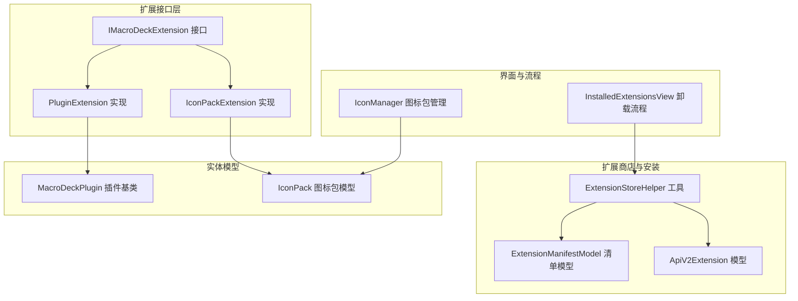
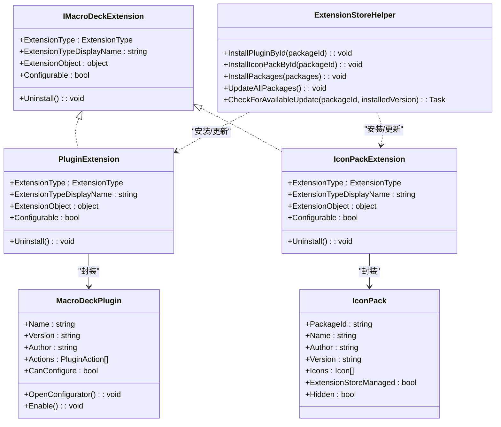
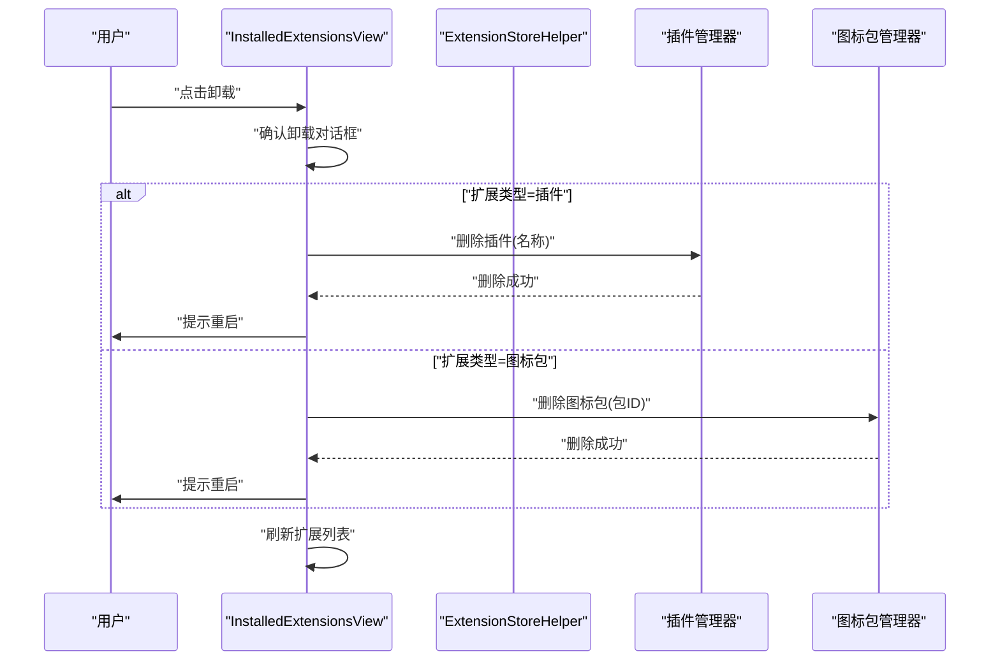
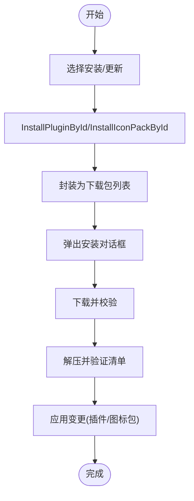
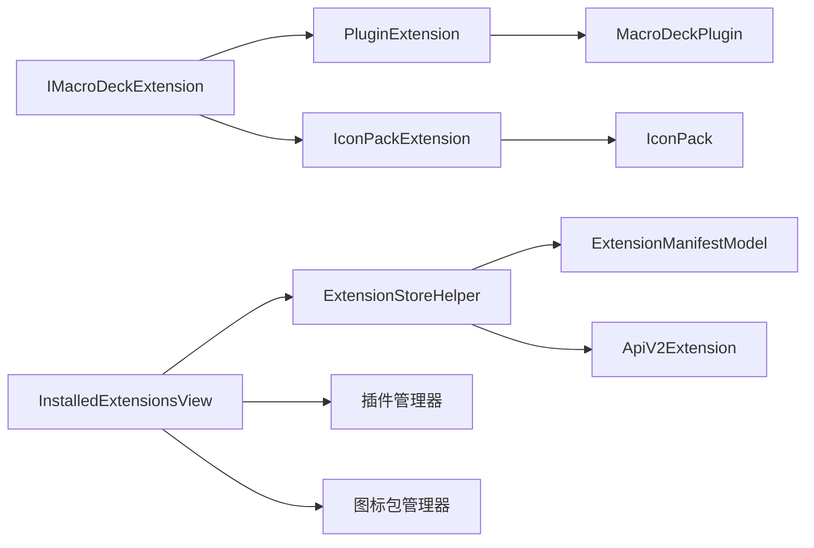

# 扩展接口 API

<cite>
**本文引用的文件**
- [IMacroDeckExtension.cs](file://src/MacroDeck/Extension/IMacroDeckExtension.cs)
- [PluginExtension.cs](file://src/MacroDeck/Extension/PluginExtension.cs)
- [IconPackExtension.cs](file://src/MacroDeck/Extension/IconPackExtension.cs)
- [ExtensionStoreHelper.cs](file://src/MacroDeck/ExtensionStore/ExtensionStoreHelper.cs)
- [ExtensionManifestModel.cs](file://src/MacroDeck/Models/ExtensionManifestModel.cs)
- [ExtensionStoreExtensionModel.cs](file://src/MacroDeck/Models/ExtensionStoreExtensionModel.cs)
- [ApiV2Extension.cs](file://src/MacroDeck/Models/ApiV2Extension.cs)
- [ApiV2ExtensionSummary.cs](file://src/MacroDeck/Models/ApiV2ExtensionSummary.cs)
- [InstalledExtensionsView.cs](file://src/MacroDeck/GUI/CustomControls/ExtensionsView/InstalledExtensionsView.cs)
- [IconManager.cs](file://src/MacroDeck/Icons/IconManager.cs)
- [MacroDeckPlugin.cs](file://src/MacroDeck/Plugins/MacroDeckPlugin.cs)
- [IconPack.cs](file://src/MacroDeck/Icons/IconPack.cs)
</cite>

## 目录
1. [简介](#简介)
2. [项目结构](#项目结构)
3. [核心组件](#核心组件)
4. [架构总览](#架构总览)
5. [详细组件分析](#详细组件分析)
6. [依赖关系分析](#依赖关系分析)
7. [性能考量](#性能考量)
8. [故障排查指南](#故障排查指南)
9. [结论](#结论)
10. [附录：扩展接口参考与最佳实践](#附录扩展接口参考与最佳实践)

## 简介
本文件面向 Macro-Deck 插件与图标包扩展的开发者，系统化阐述扩展接口 API 的设计理念、实现规范与使用方法。重点包括：
- IMacroDeckExtension 接口的设计目标与职责边界
- ExtensionType、ExtensionTypeDisplayName、ExtensionObject、Configurable 等关键属性的语义与用法
- Uninstall() 的调用时机与实现注意事项
- 插件扩展与图标包扩展的实现示例与差异
- 扩展类型的分类与区别
- 开发最佳实践与常见错误处理建议

## 项目结构
围绕扩展接口 API 的相关代码主要分布在以下模块：
- Extension 接口与适配类：IMacroDeckExtension、PluginExtension、IconPackExtension
- 扩展商店与安装流程：ExtensionStoreHelper
- 扩展清单与模型：ExtensionManifestModel、ExtensionStoreExtensionModel、ApiV2Extension、ApiV2ExtensionSummary
- 图标包与插件实体：IconPack、MacroDeckPlugin
- 安装/卸载 UI 流程：InstalledExtensionsView
- 图标包管理：IconManager

图表来源
- [IMacroDeckExtension.cs:1-13](file://src/MacroDeck/Extension/IMacroDeckExtension.cs#L1-L13)
- [PluginExtension.cs:1-24](file://src/MacroDeck/Extension/PluginExtension.cs#L1-L24)
- [IconPackExtension.cs:1-23](file://src/MacroDeck/Extension/IconPackExtension.cs#L1-L23)
- [ExtensionStoreHelper.cs:1-195](file://src/MacroDeck/ExtensionStore/ExtensionStoreHelper.cs#L1-L195)
- [ExtensionManifestModel.cs:1-61](file://src/MacroDeck/Models/ExtensionManifestModel.cs#L1-L61)
- [ApiV2Extension.cs:1-16](file://src/MacroDeck/Models/ApiV2Extension.cs#L1-L16)
- [MacroDeckPlugin.cs:1-184](file://src/MacroDeck/Plugins/MacroDeckPlugin.cs#L1-L184)
- [IconPack.cs:1-44](file://src/MacroDeck/Icons/IconPack.cs#L1-L44)
- [InstalledExtensionsView.cs:204-266](file://src/MacroDeck/GUI/CustomControls/ExtensionsView/InstalledExtensionsView.cs#L204-L266)
- [IconManager.cs:1-354](file://src/MacroDeck/Icons/IconManager.cs#L1-L354)

章节来源
- [IMacroDeckExtension.cs:1-13](file://src/MacroDeck/Extension/IMacroDeckExtension.cs#L1-L13)
- [PluginExtension.cs:1-24](file://src/MacroDeck/Extension/PluginExtension.cs#L1-L24)
- [IconPackExtension.cs:1-23](file://src/MacroDeck/Extension/IconPackExtension.cs#L1-L23)
- [ExtensionStoreHelper.cs:1-195](file://src/MacroDeck/ExtensionStore/ExtensionStoreHelper.cs#L1-L195)
- [ExtensionManifestModel.cs:1-61](file://src/MacroDeck/Models/ExtensionManifestModel.cs#L1-L61)
- [ApiV2Extension.cs:1-16](file://src/MacroDeck/Models/ApiV2Extension.cs#L1-L16)
- [MacroDeckPlugin.cs:1-184](file://src/MacroDeck/Plugins/MacroDeckPlugin.cs#L1-L184)
- [IconPack.cs:1-44](file://src/MacroDeck/Icons/IconPack.cs#L1-L44)
- [InstalledExtensionsView.cs:204-266](file://src/MacroDeck/GUI/CustomControls/ExtensionsView/InstalledExtensionsView.cs#L204-L266)
- [IconManager.cs:1-354](file://src/MacroDeck/Icons/IconManager.cs#L1-L354)

## 核心组件
- IMacroDeckExtension 接口：统一抽象所有扩展对象，定义扩展类型、显示名、承载对象、是否可配置以及卸载行为。
- PluginExtension：将 MacroDeckPlugin 封装为扩展，支持可配置性检测。
- IconPackExtension：将 IconPack 封装为扩展，不可配置。
- ExtensionStoreHelper：扩展安装、更新检查、批量更新等核心流程的协调者。
- ExtensionManifestModel：扩展清单模型，用于描述扩展元数据（类型、名称、作者、版本、目标 API 等）。
- ExtensionStoreExtensionModel：扩展商店条目模型。
- ApiV2Extension/ApiV2ExtensionSummary：扩展商店 API v2 的响应模型。
- MacroDeckPlugin：插件基类，定义插件生命周期与可配置能力。
- IconPack：图标包实体，包含包标识、名称、作者、版本、图标列表等。

章节来源
- [IMacroDeckExtension.cs:1-13](file://src/MacroDeck/Extension/IMacroDeckExtension.cs#L1-L13)
- [PluginExtension.cs:1-24](file://src/MacroDeck/Extension/PluginExtension.cs#L1-L24)
- [IconPackExtension.cs:1-23](file://src/MacroDeck/Extension/IconPackExtension.cs#L1-L23)
- [ExtensionStoreHelper.cs:1-195](file://src/MacroDeck/ExtensionStore/ExtensionStoreHelper.cs#L1-L195)
- [ExtensionManifestModel.cs:1-61](file://src/MacroDeck/Models/ExtensionManifestModel.cs#L1-L61)
- [ExtensionStoreExtensionModel.cs:1-28](file://src/MacroDeck/Models/ExtensionStoreExtensionModel.cs#L1-L28)
- [ApiV2Extension.cs:1-16](file://src/MacroDeck/Models/ApiV2Extension.cs#L1-L16)
- [ApiV2ExtensionSummary.cs:1-14](file://src/MacroDeck/Models/ApiV2ExtensionSummary.cs#L1-L14)
- [MacroDeckPlugin.cs:1-184](file://src/MacroDeck/Plugins/MacroDeckPlugin.cs#L1-L184)
- [IconPack.cs:1-44](file://src/MacroDeck/Icons/IconPack.cs#L1-L44)

## 架构总览
扩展接口 API 的核心在于通过 IMacroDeckExtension 统一承载不同类型的扩展，并由 ExtensionStoreHelper 协调安装、更新与卸载流程。插件扩展与图标包扩展分别封装到 PluginExtension 与 IconPackExtension 中，前者具备可配置能力，后者固定不可配置。

图表来源
- [IMacroDeckExtension.cs:1-13](file://src/MacroDeck/Extension/IMacroDeckExtension.cs#L1-L13)
- [PluginExtension.cs:1-24](file://src/MacroDeck/Extension/PluginExtension.cs#L1-L24)
- [IconPackExtension.cs:1-23](file://src/MacroDeck/Extension/IconPackExtension.cs#L1-L23)
- [ExtensionStoreHelper.cs:1-195](file://src/MacroDeck/ExtensionStore/ExtensionStoreHelper.cs#L1-L195)
- [MacroDeckPlugin.cs:1-184](file://src/MacroDeck/Plugins/MacroDeckPlugin.cs#L1-L184)
- [IconPack.cs:1-44](file://src/MacroDeck/Icons/IconPack.cs#L1-L44)

## 详细组件分析

### IMacroDeckExtension 接口
- 设计理念
  - 统一抽象扩展对象，屏蔽具体类型差异，便于上层以一致方式展示与操作。
  - 通过 ExtensionType 与 ExtensionTypeDisplayName 提供分类与本地化显示。
  - 通过 ExtensionObject 承载实际扩展实例，便于后续配置与卸载。
  - 通过 Configurable 控制是否允许配置入口。
  - 通过 Uninstall() 钩子，让具体扩展实现自身卸载逻辑或占位。
- 属性与方法
  - ExtensionType：扩展类型枚举，区分插件与图标包。
  - ExtensionTypeDisplayName：扩展类型显示名，用于 UI 呈现。
  - ExtensionObject：承载扩展实例（如 MacroDeckPlugin 或 IconPack）。
  - Configurable：是否可配置，决定 UI 是否显示配置按钮。
  - Uninstall()：卸载钩子，具体实现需考虑资源释放与持久化清理。

章节来源
- [IMacroDeckExtension.cs:1-13](file://src/MacroDeck/Extension/IMacroDeckExtension.cs#L1-L13)

### PluginExtension 实现
- 关键点
  - ExtensionType 固定为 Plugin。
  - ExtensionTypeDisplayName 来自语言资源，保证多语言显示。
  - ExtensionObject 为 MacroDeckPlugin 实例。
  - Configurable 基于 MacroDeckPlugin.CanConfigure 动态判断。
  - Uninstall() 当前为空实现，实际卸载由 UI 与插件管理器协作完成。
- 典型用法
  - 在扩展管理器中以统一方式呈现插件扩展，并根据 CanConfigure 决定是否显示配置入口。

章节来源
- [PluginExtension.cs:1-24](file://src/MacroDeck/Extension/PluginExtension.cs#L1-L24)
- [MacroDeckPlugin.cs:1-184](file://src/MacroDeck/Plugins/MacroDeckPlugin.cs#L1-L184)

### IconPackExtension 实现
- 关键点
  - ExtensionType 固定为 IconPack。
  - ExtensionTypeDisplayName 来自语言资源。
  - ExtensionObject 为 IconPack 实例。
  - Configurable 固定为 false，图标包不支持配置。
  - Uninstall() 当前为空实现，实际卸载由 UI 与图标包管理器协作完成。
- 典型用法
  - 在扩展管理器中以统一方式呈现图标包扩展，禁用配置入口。

章节来源
- [IconPackExtension.cs:1-23](file://src/MacroDeck/Extension/IconPackExtension.cs#L1-L23)
- [IconPack.cs:1-44](file://src/MacroDeck/Icons/IconPack.cs#L1-L44)

### 扩展类型与分类
- ExtensionType 枚举
  - Plugin：插件扩展，可包含动作、配置等。
  - IconPack：图标包扩展，仅包含图标集合。
- 分类差异
  - 可配置性：插件扩展可配置，图标包扩展不可配置。
  - 承载对象：插件扩展承载 MacroDeckPlugin，图标包扩展承载 IconPack。
  - 卸载流程：两者均通过 UI 与管理器协作完成卸载，接口层提供统一钩子。

章节来源
- [ExtensionStoreHelper.cs:190-194](file://src/MacroDeck/ExtensionStore/ExtensionStoreHelper.cs#L190-L194)
- [PluginExtension.cs:1-24](file://src/MacroDeck/Extension/PluginExtension.cs#L1-L24)
- [IconPackExtension.cs:1-23](file://src/MacroDeck/Extension/IconPackExtension.cs#L1-L23)

### 卸载流程与时机
- 调用时机
  - 用户在扩展管理器中选择卸载某扩展时触发。
  - UI 层根据扩展类型进行分支处理：插件扩展走插件管理器删除流程；图标包扩展走图标包管理器删除流程。
- 实现注意事项
  - IMacroDeckExtension.Uninstall() 当前为占位实现，实际卸载逻辑由 UI 与管理器协作完成。
  - 卸载后通常需要刷新扩展列表并提示用户重启应用以生效。
  - 对于插件扩展，卸载前应确认用户意图并清理相关状态。

图表来源
- [InstalledExtensionsView.cs:228-266](file://src/MacroDeck/GUI/CustomControls/ExtensionsView/InstalledExtensionsView.cs#L228-L266)
- [ExtensionStoreHelper.cs:1-195](file://src/MacroDeck/ExtensionStore/ExtensionStoreHelper.cs#L1-L195)

章节来源
- [InstalledExtensionsView.cs:228-266](file://src/MacroDeck/GUI/CustomControls/ExtensionsView/InstalledExtensionsView.cs#L228-L266)
- [ExtensionStoreHelper.cs:1-195](file://src/MacroDeck/ExtensionStore/ExtensionStoreHelper.cs#L1-L195)

### 安装与更新流程
- 安装
  - ExtensionStoreHelper.InstallPluginById/InstallIconPackById 将包 ID 与类型封装为下载任务并弹出安装对话框。
  - 批量安装通过 InstallPackages 统一调度。
- 更新
  - ExtensionStoreHelper.UpdateAllPackages 收集待更新的插件与图标包，统一发起安装流程。
  - CheckForAvailableUpdate 通过扩展商店 API v2 查询最新版本并判断是否需要更新。

图表来源
- [ExtensionStoreHelper.cs:31-64](file://src/MacroDeck/ExtensionStore/ExtensionStoreHelper.cs#L31-L64)
- [ExtensionStoreHelper.cs:133-160](file://src/MacroDeck/ExtensionStore/ExtensionStoreHelper.cs#L133-L160)
- [ExtensionStoreHelper.cs:162-187](file://src/MacroDeck/ExtensionStore/ExtensionStoreHelper.cs#L162-L187)
- [ExtensionManifestModel.cs:32-46](file://src/MacroDeck/Models/ExtensionManifestModel.cs#L32-L46)

章节来源
- [ExtensionStoreHelper.cs:31-64](file://src/MacroDeck/ExtensionStore/ExtensionStoreHelper.cs#L31-L64)
- [ExtensionStoreHelper.cs:133-160](file://src/MacroDeck/ExtensionStore/ExtensionStoreHelper.cs#L133-L160)
- [ExtensionStoreHelper.cs:162-187](file://src/MacroDeck/ExtensionStore/ExtensionStoreHelper.cs#L162-L187)
- [ExtensionManifestModel.cs:32-46](file://src/MacroDeck/Models/ExtensionManifestModel.cs#L32-L46)

### 图标包管理与清单
- 图标包管理
  - IconManager 负责加载、更新可用图标包、查找图标等。
  - InstallIconPackZip 从压缩包读取清单并校验类型，再进行安装。
- 清单模型
  - ExtensionManifestModel 描述扩展元数据（类型、名称、作者、版本、目标 API 等），用于安装与更新校验。
  - ExtensionStoreExtensionModel 与 ApiV2Extension/ApiV2ExtensionSummary 用于商店侧的数据结构。

章节来源
- [IconManager.cs:1-354](file://src/MacroDeck/Icons/IconManager.cs#L1-L354)
- [ExtensionManifestModel.cs:1-61](file://src/MacroDeck/Models/ExtensionManifestModel.cs#L1-L61)
- [ExtensionStoreExtensionModel.cs:1-28](file://src/MacroDeck/Models/ExtensionStoreExtensionModel.cs#L1-L28)
- [ApiV2Extension.cs:1-16](file://src/MacroDeck/Models/ApiV2Extension.cs#L1-L16)
- [ApiV2ExtensionSummary.cs:1-14](file://src/MacroDeck/Models/ApiV2ExtensionSummary.cs#L1-L14)

## 依赖关系分析
- 接口与实现
  - IMacroDeckExtension 是统一抽象，PluginExtension 与 IconPackExtension 分别实现。
- 扩展商店与安装
  - ExtensionStoreHelper 依赖扩展清单模型与商店 API，负责安装与更新。
- 实体与承载
  - PluginExtension 承载 MacroDeckPlugin，IconPackExtension 承载 IconPack。
- UI 协作
  - InstalledExtensionsView 根据扩展类型调用相应管理器执行卸载与刷新。

图表来源
- [IMacroDeckExtension.cs:1-13](file://src/MacroDeck/Extension/IMacroDeckExtension.cs#L1-L13)
- [PluginExtension.cs:1-24](file://src/MacroDeck/Extension/PluginExtension.cs#L1-L24)
- [IconPackExtension.cs:1-23](file://src/MacroDeck/Extension/IconPackExtension.cs#L1-L23)
- [ExtensionStoreHelper.cs:1-195](file://src/MacroDeck/ExtensionStore/ExtensionStoreHelper.cs#L1-L195)
- [ExtensionManifestModel.cs:1-61](file://src/MacroDeck/Models/ExtensionManifestModel.cs#L1-L61)
- [ApiV2Extension.cs:1-16](file://src/MacroDeck/Models/ApiV2Extension.cs#L1-L16)
- [InstalledExtensionsView.cs:228-266](file://src/MacroDeck/GUI/CustomControls/ExtensionsView/InstalledExtensionsView.cs#L228-L266)

章节来源
- [IMacroDeckExtension.cs:1-13](file://src/MacroDeck/Extension/IMacroDeckExtension.cs#L1-L13)
- [PluginExtension.cs:1-24](file://src/MacroDeck/Extension/PluginExtension.cs#L1-L24)
- [IconPackExtension.cs:1-23](file://src/MacroDeck/Extension/IconPackExtension.cs#L1-L23)
- [ExtensionStoreHelper.cs:1-195](file://src/MacroDeck/ExtensionStore/ExtensionStoreHelper.cs#L1-L195)
- [ExtensionManifestModel.cs:1-61](file://src/MacroDeck/Models/ExtensionManifestModel.cs#L1-L61)
- [ApiV2Extension.cs:1-16](file://src/MacroDeck/Models/ApiV2Extension.cs#L1-L16)
- [InstalledExtensionsView.cs:228-266](file://src/MacroDeck/GUI/CustomControls/ExtensionsView/InstalledExtensionsView.cs#L228-L266)

## 性能考量
- 清单解析与压缩包读取
  - 从 ZIP 中提取清单时避免重复 IO，优先使用流式读取与一次性解析。
- 图标包内存占用
  - 图标包预览图按需生成并及时释放，避免长期持有大对象导致内存压力。
- 批量安装与更新
  - 使用 InstallPackages 统一调度，减少 UI 切换与事件风暴。
- 更新检查并发
  - 异步遍历插件与图标包，避免阻塞主线程。

## 故障排查指南
- 卸载无响应
  - 检查 UI 是否正确根据扩展类型调用对应管理器；确认 Uninstall() 钩子未被覆盖为无效实现。
- 安装失败或版本不匹配
  - 校验 ExtensionManifestModel 中的类型与目标 API 版本；确认扩展商店返回的最新文件版本号。
- 图标包无法加载
  - 检查 IconManager 的加载目录与权限；确认 ZIP 包内存在有效的 ExtensionManifest.json 且类型为图标包。
- 更新通知未出现
  - 确认 ExtensionStoreHelper.UpdateAllPackages 的收集逻辑与 InstallPackages 的调用链路正常。

章节来源
- [InstalledExtensionsView.cs:228-266](file://src/MacroDeck/GUI/CustomControls/ExtensionsView/InstalledExtensionsView.cs#L228-L266)
- [ExtensionStoreHelper.cs:162-187](file://src/MacroDeck/ExtensionStore/ExtensionStoreHelper.cs#L162-L187)
- [IconManager.cs:327-354](file://src/MacroDeck/Icons/IconManager.cs#L327-L354)

## 结论
IMacroDeckExtension 为 Macro-Deck 的扩展生态提供了统一抽象，使插件与图标包能在同一 UI 与流程下被管理。通过 PluginExtension 与 IconPackExtension 的实现，结合 ExtensionStoreHelper 的安装/更新/卸载机制，开发者可以专注于扩展内容本身，而无需关心复杂的生命周期管理细节。遵循本文的最佳实践与注意事项，可有效提升扩展开发效率与稳定性。

## 附录：扩展接口参考与最佳实践

### 接口与实现参考
- IMacroDeckExtension
  - 属性：ExtensionType、ExtensionTypeDisplayName、ExtensionObject、Configurable
  - 方法：Uninstall()
  - 参考路径：[IMacroDeckExtension.cs:1-13](file://src/MacroDeck/Extension/IMacroDeckExtension.cs#L1-L13)
- PluginExtension
  - 承载 MacroDeckPlugin，动态判断 Configurable
  - 参考路径：[PluginExtension.cs:1-24](file://src/MacroDeck/Extension/PluginExtension.cs#L1-L24)
- IconPackExtension
  - 承载 IconPack，Configurable 固定为 false
  - 参考路径：[IconPackExtension.cs:1-23](file://src/MacroDeck/Extension/IconPackExtension.cs#L1-L23)

### 扩展清单与商店模型
- ExtensionManifestModel：描述扩展元数据（类型、名称、作者、版本、目标 API）
  - 参考路径：[ExtensionManifestModel.cs:1-61](file://src/MacroDeck/Models/ExtensionManifestModel.cs#L1-L61)
- ExtensionStoreExtensionModel：商店条目模型
  - 参考路径：[ExtensionStoreExtensionModel.cs:1-28](file://src/MacroDeck/Models/ExtensionStoreExtensionModel.cs#L1-L28)
- ApiV2Extension/ApiV2ExtensionSummary：商店 API v2 响应模型
  - 参考路径：[ApiV2Extension.cs:1-16](file://src/MacroDeck/Models/ApiV2Extension.cs#L1-L16)
  - 参考路径：[ApiV2ExtensionSummary.cs:1-14](file://src/MacroDeck/Models/ApiV2ExtensionSummary.cs#L1-L14)

### 卸载流程参考
- UI 卸载分支与管理器调用
  - 参考路径：[InstalledExtensionsView.cs:228-266](file://src/MacroDeck/GUI/CustomControls/ExtensionsView/InstalledExtensionsView.cs#L228-L266)

### 最佳实践
- 显示名与本地化
  - 使用语言资源设置 ExtensionTypeDisplayName，确保多语言一致性。
- 可配置性控制
  - 插件扩展依据 CanConfigure 动态暴露配置入口；图标包扩展保持不可配置。
- 卸载安全
  - 卸载前进行二次确认；卸载后刷新列表并提示重启。
- 清单校验
  - 安装前严格校验 ExtensionManifestModel 类型与目标 API 版本；避免类型不匹配导致的运行时异常。
- 性能优化
  - 按需生成图标包预览图并及时释放；异步执行更新检查与安装任务。