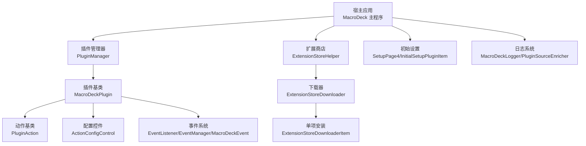
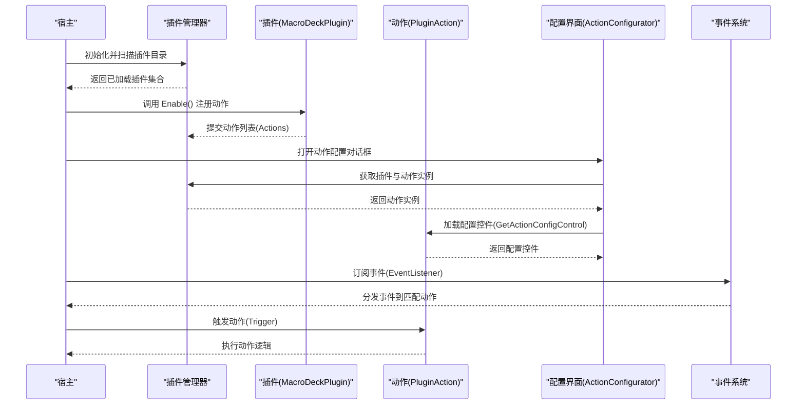
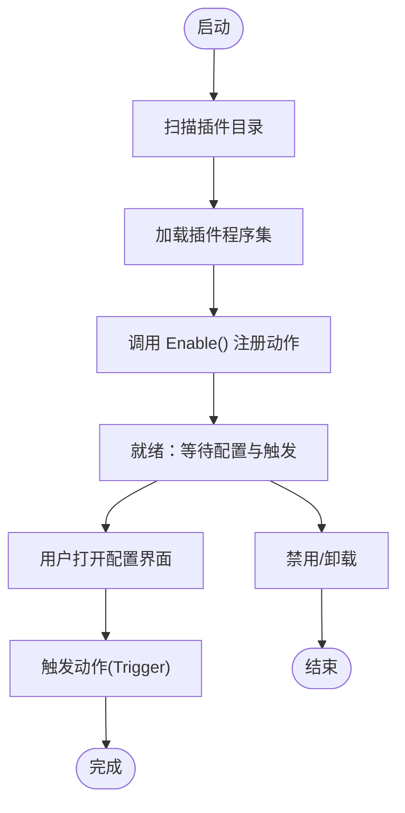
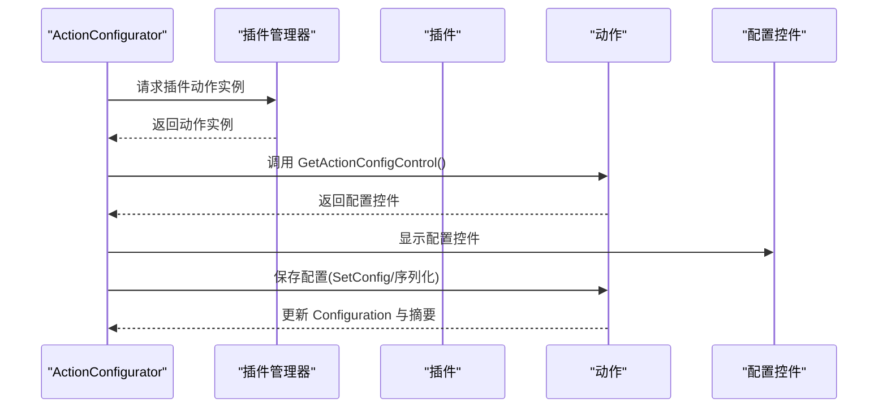
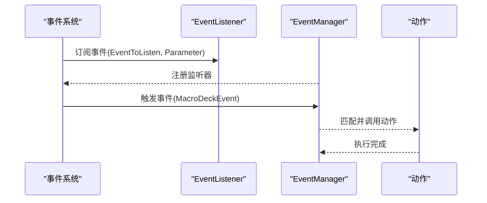
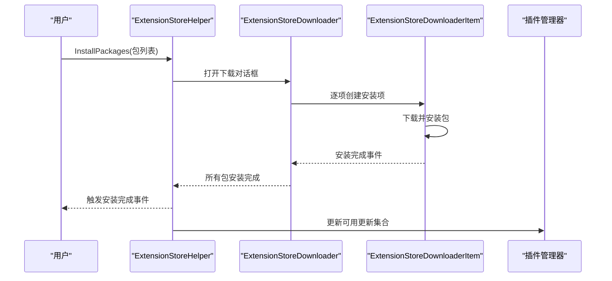
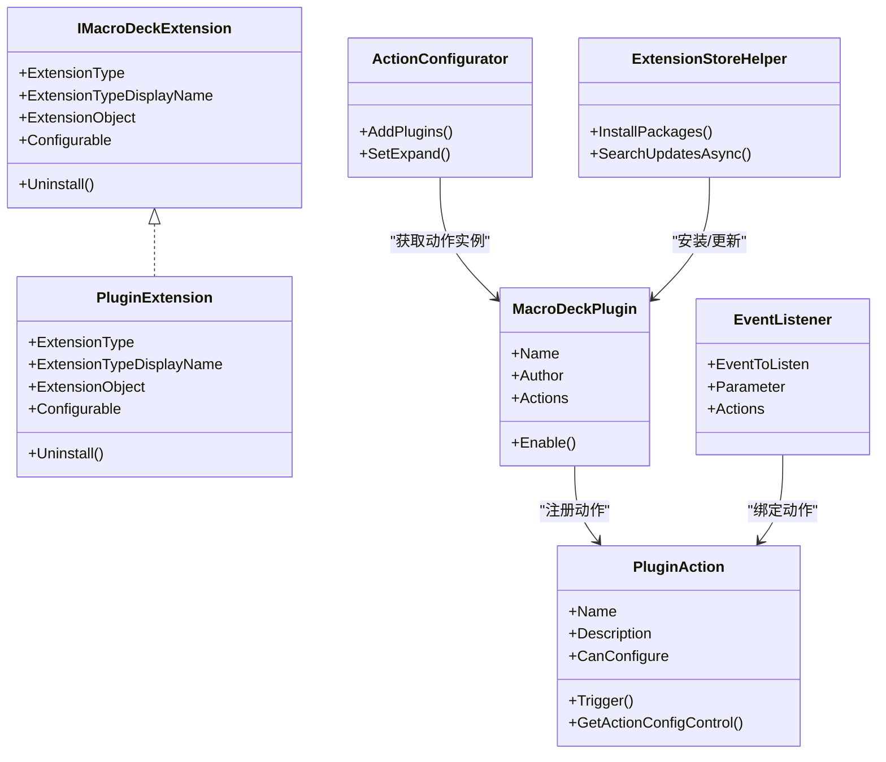

# 插件 API

<cite>
**本文引用的文件**
- [IMacroDeckExtension.cs](file://src/MacroDeck/Extension/IMacroDeckExtension.cs)
- [PluginExtension.cs](file://src/MacroDeck/Extension/PluginExtension.cs)
- [PluginManager.cs](file://src/MacroDeck/Plugins/PluginManager.cs)
- [MacroDeckPlugin.cs](file://src/MacroDeck/Plugins/MacroDeckPlugin.cs)
- [PluginAction.cs](file://src/MacroDeck/Plugins/PluginAction.cs)
- [ActionConfigControl.cs](file://src/MacroDeck/GUI/CustomControls/ActionConfigControl.cs)
- [ActionConfigurator.cs](file://src/MacroDeck/GUI/Dialogs/ActionConfigurator.cs)
- [EventListener.cs](file://src/MacroDeck/Events/EventListener.cs)
- [EventManager.cs](file://src/MacroDeck/Events/EventManager.cs)
- [MacroDeckEvent.cs](file://src/MacroDeck/Events/MacroDeckEvent.cs)
- [ExtensionStoreHelper.cs](file://src/MacroDeck/ExtensionStore/ExtensionStoreHelper.cs)
- [ExtensionStoreDownloader.cs](file://src/MacroDeck/GUI/Dialogs/ExtensionStoreDownloader.cs)
- [ExtensionStoreDownloaderItem.cs](file://src/MacroDeck/GUI/CustomControls/ExtensionStoreDownloader/ExtensionStoreDownloaderItem.cs)
- [SetupPage4.cs](file://src/MacroDeck/GUI/InitialSetupPages/SetupPage4.cs)
- [InitialSetupPluginItem.cs](file://src/MacroDeck/GUI/CustomControls/InitialSetup/InitialSetupPluginItem.cs)
- [SettingsView.Designer.cs](file://src/MacroDeck/GUI/MainWindowViews/SettingsView.Designer.cs)
- [MacroDeck.csproj](file://src/MacroDeck/MacroDeck.csproj)
- [MacroDeck.nuspec](file://src/MacroDeck/MacroDeck.nuspec)
- [Program.cs](file://src/MacroDeck/Program.cs)
- [MacroDeck.cs](file://src/MacroDeck/MacroDeck.cs)
- [WebSocketHandler.cs](file://src/MacroDeck/WebSocketHandler.cs)
- [MacroDeckServerHelper.cs](file://src/MacroDeck/MacroDeckServerHelper.cs)
- [MacroDeckLogger.cs](file://src/MacroDeck/Logging/MacroDeckLogger.cs)
- [PluginSourceEnricher.cs](file://src/MacroDeck/Logging/PluginSourceEnricher.cs)
</cite>

## 目录
1. [简介](#简介)
2. [项目结构](#项目结构)
3. [核心组件](#核心组件)
4. [架构总览](#架构总览)
5. [详细组件分析](#详细组件分析)
6. [依赖关系分析](#依赖关系分析)
7. [性能考量](#性能考量)
8. [故障排查指南](#故障排查指南)
9. [结论](#结论)
10. [附录](#附录)

## 简介
本文件面向插件开发者，系统性阐述 Macro-Deck 插件 API 的架构与扩展机制，覆盖插件生命周期、配置接口、事件处理、安装与管理流程、权限与安全边界、版本兼容与升级策略，并提供可操作的开发框架与最佳实践建议。文档中的所有技术细节均基于仓库源码进行归纳与提炼，确保与实际实现一致。

## 项目结构
Macro-Deck 的插件体系围绕“插件宿主”与“插件扩展”两大维度构建：宿主负责加载、管理与运行插件；扩展层通过统一接口抽象插件类型（如插件、图标包等），并提供安装、更新与卸载能力。

- 宿主侧关键模块
  - 插件管理：PluginManager 负责插件发现、加载、启用与禁用
  - 插件基类：MacroDeckPlugin 提供插件元数据与生命周期钩子
  - 动作模型：PluginAction 表达具体可配置的动作单元
  - 配置界面：ActionConfigControl 与 ActionConfigurator 支持动作配置
  - 事件系统：EventListener、EventManager、MacroDeckEvent 实现事件监听与分发
  - 扩展商店：ExtensionStoreHelper、ExtensionStoreDownloader、ExtensionStoreDownloaderItem 提供在线安装与更新
  - 初始设置：SetupPage4 与 InitialSetupPluginItem 支持初始安装推荐插件
  - 日志：MacroDeckLogger 与 PluginSourceEnricher 提供插件日志上下文
  - 版本信息：SettingsView 展示插件 API 版本号

- 插件侧约定
  - 插件需继承 MacroDeckPlugin 并在 Enable 中注册 PluginAction 列表
  - 可选实现配置界面（GetActionConfigControl）
  - 可选订阅事件（EventListener）

图表来源
- [PluginManager.cs](file://src/MacroDeck/Plugins/PluginManager.cs)
- [MacroDeckPlugin.cs](file://src/MacroDeck/Plugins/MacroDeckPlugin.cs)
- [PluginAction.cs](file://src/MacroDeck/Plugins/PluginAction.cs)
- [ActionConfigControl.cs](file://src/MacroDeck/GUI/CustomControls/ActionConfigControl.cs)
- [EventListener.cs](file://src/MacroDeck/Events/EventListener.cs)
- [ExtensionStoreHelper.cs](file://src/MacroDeck/ExtensionStore/ExtensionStoreHelper.cs)
- [ExtensionStoreDownloader.cs](file://src/MacroDeck/GUI/Dialogs/ExtensionStoreDownloader.cs)
- [ExtensionStoreDownloaderItem.cs](file://src/MacroDeck/GUI/CustomControls/ExtensionStoreDownloader/ExtensionStoreDownloaderItem.cs)
- [SetupPage4.cs](file://src/MacroDeck/GUI/InitialSetupPages/SetupPage4.cs)
- [InitialSetupPluginItem.cs](file://src/MacroDeck/GUI/CustomControls/InitialSetup/InitialSetupPluginItem.cs)
- [MacroDeckLogger.cs](file://src/MacroDeck/Logging/MacroDeckLogger.cs)
- [PluginSourceEnricher.cs](file://src/MacroDeck/Logging/PluginSourceEnricher.cs)

章节来源
- [MacroDeck.csproj](file://src/MacroDeck/MacroDeck.csproj)
- [SettingsView.Designer.cs](file://src/MacroDeck/GUI/MainWindowViews/SettingsView.Designer.cs)

## 核心组件
- 插件接口与扩展抽象
  - IMacroDeckExtension：统一扩展对象的类型标识、显示名、可配置性与卸载行为
  - PluginExtension：将 MacroDeckPlugin 封装为扩展对象，暴露可配置性与卸载入口
- 插件管理器
  - PluginManager：维护已安装插件集合、提供启用/禁用、更新检测、目录解析等能力
- 插件基类与动作基类
  - MacroDeckPlugin：插件元数据（名称、作者）、生命周期（Enable）、动作集合（Actions）
  - PluginAction：动作元数据（名称、描述、是否可配置）、触发入口（Trigger）、配置控件（GetActionConfigControl）
- 配置界面
  - ActionConfigControl：动作配置控件基类
  - ActionConfigurator：动作配置对话框，动态加载插件动作与配置控件
- 事件系统
  - EventListener：事件监听器（事件名、参数、动作列表）
  - EventManager：事件管理器（注册、注销、派发）
  - MacroDeckEvent：事件模型（事件名、参数、来源）
- 扩展商店与安装
  - ExtensionStoreHelper：安装/更新检查入口
  - ExtensionStoreDownloader：批量安装对话框
  - ExtensionStoreDownloaderItem：单个扩展包下载与安装项
  - SetupPage4 与 InitialSetupPluginItem：初始设置页中展示与选择插件
- 日志与版本
  - MacroDeckLogger 与 PluginSourceEnricher：为插件注入来源上下文的日志
  - SettingsView：展示当前插件 API 版本号

章节来源
- [IMacroDeckExtension.cs:1-13](file://src/MacroDeck/Extension/IMacroDeckExtension.cs#L1-L13)
- [PluginExtension.cs:1-23](file://src/MacroDeck/Extension/PluginExtension.cs#L1-L23)
- [PluginManager.cs](file://src/MacroDeck/Plugins/PluginManager.cs)
- [MacroDeckPlugin.cs](file://src/MacroDeck/Plugins/MacroDeckPlugin.cs)
- [PluginAction.cs](file://src/MacroDeck/Plugins/PluginAction.cs)
- [ActionConfigControl.cs](file://src/MacroDeck/GUI/CustomControls/ActionConfigControl.cs)
- [ActionConfigurator.cs:77-186](file://src/MacroDeck/GUI/Dialogs/ActionConfigurator.cs#L77-L186)
- [EventListener.cs:1-11](file://src/MacroDeck/Events/EventListener.cs#L1-L11)
- [EventManager.cs](file://src/MacroDeck/Events/EventManager.cs)
- [MacroDeckEvent.cs](file://src/MacroDeck/Events/MacroDeckEvent.cs)
- [ExtensionStoreHelper.cs:1-83](file://src/MacroDeck/ExtensionStore/ExtensionStoreHelper.cs#L1-L83)
- [ExtensionStoreDownloader.cs:1-73](file://src/MacroDeck/GUI/Dialogs/ExtensionStoreDownloader.cs#L1-L73)
- [ExtensionStoreDownloaderItem.cs:1-42](file://src/MacroDeck/GUI/CustomControls/ExtensionStoreDownloader/ExtensionStoreDownloaderItem.cs#L1-L42)
- [SetupPage4.cs:1-92](file://src/MacroDeck/GUI/InitialSetupPages/SetupPage4.cs#L1-L92)
- [InitialSetupPluginItem.cs:1-30](file://src/MacroDeck/GUI/CustomControls/InitialSetup/InitialSetupPluginItem.cs#L1-L30)
- [MacroDeckLogger.cs](file://src/MacroDeck/Logging/MacroDeckLogger.cs)
- [PluginSourceEnricher.cs](file://src/MacroDeck/Logging/PluginSourceEnricher.cs)
- [SettingsView.Designer.cs:728-785](file://src/MacroDeck/GUI/MainWindowViews/SettingsView.Designer.cs#L728-L785)

## 架构总览
下图展示了插件从“被发现/加载”到“被用户配置与触发”的全链路：

图表来源
- [PluginManager.cs](file://src/MacroDeck/Plugins/PluginManager.cs)
- [MacroDeckPlugin.cs](file://src/MacroDeck/Plugins/MacroDeckPlugin.cs)
- [PluginAction.cs](file://src/MacroDeck/Plugins/PluginAction.cs)
- [ActionConfigurator.cs:77-186](file://src/MacroDeck/GUI/Dialogs/ActionConfigurator.cs#L77-L186)
- [EventListener.cs:1-11](file://src/MacroDeck/Events/EventListener.cs#L1-L11)
- [MacroDeckEvent.cs](file://src/MacroDeck/Events/MacroDeckEvent.cs)

## 详细组件分析

### 插件生命周期与管理
- 生命周期阶段
  - 发现与加载：由 PluginManager 扫描插件目录并加载程序集
  - 启用：调用 MacroDeckPlugin.Enable() 注册动作集合
  - 运行：根据用户交互或事件触发 PluginAction.Trigger()
  - 禁用/卸载：通过扩展商店或管理界面执行卸载流程
- 关键点
  - 插件必须在 Enable 中初始化 Actions 列表
  - 可通过 ExtensionStoreHelper.InstallPackages 批量安装
  - 卸载流程由 ExtensionStoreDownloaderItem 内部处理

图表来源
- [PluginManager.cs](file://src/MacroDeck/Plugins/PluginManager.cs)
- [MacroDeckPlugin.cs](file://src/MacroDeck/Plugins/MacroDeckPlugin.cs)
- [ExtensionStoreHelper.cs:48-64](file://src/MacroDeck/ExtensionStore/ExtensionStoreHelper.cs#L48-L64)
- [ExtensionStoreDownloaderItem.cs:37-42](file://src/MacroDeck/GUI/CustomControls/ExtensionStoreDownloader/ExtensionStoreDownloaderItem.cs#L37-L42)

章节来源
- [PluginManager.cs](file://src/MacroDeck/Plugins/PluginManager.cs)
- [MacroDeckPlugin.cs](file://src/MacroDeck/Plugins/MacroDeckPlugin.cs)
- [ExtensionStoreHelper.cs:48-64](file://src/MacroDeck/ExtensionStore/ExtensionStoreHelper.cs#L48-L64)
- [ExtensionStoreDownloader.cs:39-73](file://src/MacroDeck/GUI/Dialogs/ExtensionStoreDownloader.cs#L39-L73)
- [ExtensionStoreDownloaderItem.cs:37-42](file://src/MacroDeck/GUI/CustomControls/ExtensionStoreDownloader/ExtensionStoreDownloaderItem.cs#L37-L42)

### 配置接口与视图
- 配置控件
  - PluginAction.GetActionConfigControl 返回配置控件实例
  - ActionConfigurator 动态加载插件与动作，将配置控件嵌入面板
- 配置保存
  - 配置控件应实现保存逻辑（例如内部序列化与摘要生成）
  - 保存成功后更新动作的 Configuration 与 ConfigurationSummary

图表来源
- [ActionConfigurator.cs:77-186](file://src/MacroDeck/GUI/Dialogs/ActionConfigurator.cs#L77-L186)
- [PluginAction.cs](file://src/MacroDeck/Plugins/PluginAction.cs)
- [ActionConfigControl.cs](file://src/MacroDeck/GUI/CustomControls/ActionConfigControl.cs)

章节来源
- [ActionConfigurator.cs:77-186](file://src/MacroDeck/GUI/Dialogs/ActionConfigurator.cs#L77-L186)
- [ActionConfigControl.cs](file://src/MacroDeck/GUI/CustomControls/ActionConfigControl.cs)

### 事件处理机制
- 事件监听
  - 通过 EventListener 指定事件名与参数，绑定动作列表
  - 事件由 EventManager 统一分发，匹配到的动作执行
- 典型场景
  - 变量变更触发按钮状态变化
  - 设备事件驱动动作执行

图表来源
- [EventListener.cs:1-11](file://src/MacroDeck/Events/EventListener.cs#L1-L11)
- [EventManager.cs](file://src/MacroDeck/Events/EventManager.cs)
- [MacroDeckEvent.cs](file://src/MacroDeck/Events/MacroDeckEvent.cs)

章节来源
- [EventListener.cs:1-11](file://src/MacroDeck/Events/EventListener.cs#L1-L11)
- [EventManager.cs](file://src/MacroDeck/Events/EventManager.cs)
- [MacroDeckEvent.cs](file://src/MacroDeck/Events/MacroDeckEvent.cs)

### 安装、注册与管理
- 在线安装
  - ExtensionStoreHelper.InstallPackages 接收包信息列表，打开 ExtensionStoreDownloader 对话框
  - ExtensionStoreDownloader 逐项创建 ExtensionStoreDownloaderItem 并执行下载与安装
- 初始设置
  - SetupPage4 从远程 API 拉取可用插件清单，InitialSetupPluginItem 渲染条目并支持自动安装标记
- 卸载与更新
  - 卸载由 ExtensionStoreDownloaderItem 内部处理
  - ExtensionStoreHelper.SearchUpdatesAsync 检测插件更新并清空可用更新集合

图表来源
- [ExtensionStoreHelper.cs:48-83](file://src/MacroDeck/ExtensionStore/ExtensionStoreHelper.cs#L48-L83)
- [ExtensionStoreDownloader.cs:39-73](file://src/MacroDeck/GUI/Dialogs/ExtensionStoreDownloader.cs#L39-L73)
- [ExtensionStoreDownloaderItem.cs:37-42](file://src/MacroDeck/GUI/CustomControls/ExtensionStoreDownloader/ExtensionStoreDownloaderItem.cs#L37-L42)
- [SetupPage4.cs:18-92](file://src/MacroDeck/GUI/InitialSetupPages/SetupPage4.cs#L18-L92)
- [InitialSetupPluginItem.cs:1-30](file://src/MacroDeck/GUI/CustomControls/InitialSetup/InitialSetupPluginItem.cs#L1-L30)

章节来源
- [ExtensionStoreHelper.cs:31-83](file://src/MacroDeck/ExtensionStore/ExtensionStoreHelper.cs#L31-L83)
- [ExtensionStoreDownloader.cs:1-73](file://src/MacroDeck/GUI/Dialogs/ExtensionStoreDownloader.cs#L1-L73)
- [ExtensionStoreDownloaderItem.cs:1-42](file://src/MacroDeck/GUI/CustomControls/ExtensionStoreDownloader/ExtensionStoreDownloaderItem.cs#L1-L42)
- [SetupPage4.cs:18-92](file://src/MacroDeck/GUI/InitialSetupPages/SetupPage4.cs#L18-L92)
- [InitialSetupPluginItem.cs:1-30](file://src/MacroDeck/GUI/CustomControls/InitialSetup/InitialSetupPluginItem.cs#L1-L30)

### 权限、安全与沙箱
- 运行时约束
  - 插件 API 作为编译时引用包提供，运行时由宿主注入，插件不直接依赖运行时实现
  - 宏观上，插件在宿主提供的上下文中运行，受限于宿主暴露的能力与安全策略
- 建议的安全实践
  - 不在插件中直接访问系统敏感资源，优先使用宿主暴露的受控接口
  - 对外部输入进行严格校验与最小化权限授予
  - 使用日志记录关键路径，便于审计与问题定位

章节来源
- [MacroDeck.nuspec:12-15](file://src/MacroDeck/MacroDeck.nuspec#L12-L15)

### 版本兼容与升级
- 版本标识
  - SettingsView 展示当前插件 API 版本号，用于向导用户了解兼容范围
- 升级策略
  - 通过 ExtensionStoreHelper.SearchUpdatesAsync 检测可用更新
  - 安装新版本包以替换旧版插件
- 兼容性建议
  - 遵循宿主 API 版本，避免使用未公开或内部实现
  - 在插件清单中标注目标 API 版本，确保安装时进行版本匹配

章节来源
- [SettingsView.Designer.cs:741-785](file://src/MacroDeck/GUI/MainWindowViews/SettingsView.Designer.cs#L741-L785)
- [ExtensionStoreHelper.cs:71-83](file://src/MacroDeck/ExtensionStore/ExtensionStoreHelper.cs#L71-L83)

## 依赖关系分析
- 组件耦合
  - 插件管理器与插件基类强耦合，插件通过基类暴露动作集合
  - 配置界面依赖插件动作返回的配置控件
  - 事件系统通过监听器与事件模型解耦动作与触发源
  - 扩展商店通过包信息模型与下载器解耦安装流程
- 外部依赖
  - 宏观上，插件依赖宿主提供的 API 与运行环境，不引入额外运行时依赖

图表来源
- [IMacroDeckExtension.cs:1-13](file://src/MacroDeck/Extension/IMacroDeckExtension.cs#L1-L13)
- [PluginExtension.cs:1-23](file://src/MacroDeck/Extension/PluginExtension.cs#L1-L23)
- [MacroDeckPlugin.cs](file://src/MacroDeck/Plugins/MacroDeckPlugin.cs)
- [PluginAction.cs](file://src/MacroDeck/Plugins/PluginAction.cs)
- [ActionConfigurator.cs:77-186](file://src/MacroDeck/GUI/Dialogs/ActionConfigurator.cs#L77-L186)
- [EventListener.cs:1-11](file://src/MacroDeck/Events/EventListener.cs#L1-L11)
- [ExtensionStoreHelper.cs:48-83](file://src/MacroDeck/ExtensionStore/ExtensionStoreHelper.cs#L48-L83)

章节来源
- [IMacroDeckExtension.cs:1-13](file://src/MacroDeck/Extension/IMacroDeckExtension.cs#L1-L13)
- [PluginExtension.cs:1-23](file://src/MacroDeck/Extension/PluginExtension.cs#L1-L23)
- [MacroDeckPlugin.cs](file://src/MacroDeck/Plugins/MacroDeckPlugin.cs)
- [PluginAction.cs](file://src/MacroDeck/Plugins/PluginAction.cs)
- [ActionConfigurator.cs:77-186](file://src/MacroDeck/GUI/Dialogs/ActionConfigurator.cs#L77-L186)
- [EventListener.cs:1-11](file://src/MacroDeck/Events/EventListener.cs#L1-L11)
- [ExtensionStoreHelper.cs:48-83](file://src/MacroDeck/ExtensionStore/ExtensionStoreHelper.cs#L48-L83)

## 性能考量
- 插件加载与初始化
  - 将耗时逻辑延迟到首次使用或后台任务中执行，避免阻塞主线程
- 配置界面渲染
  - 动态加载配置控件时，尽量减少 UI 线程阻塞，必要时使用异步加载
- 事件处理
  - 事件动作执行应保持轻量，避免长时间阻塞事件循环
- 安装与更新
  - 批量安装采用异步队列，及时反馈进度，避免 UI 卡顿

## 故障排查指南
- 插件无法加载
  - 检查插件目录与清单，确认插件程序集可被宿主加载
  - 查看日志输出，定位加载异常
- 配置界面无内容
  - 确认插件在 Enable 中正确注册动作
  - 确认动作的 CanConfigure 与 GetActionConfigControl 返回有效控件
- 事件不生效
  - 检查 EventListener 的事件名与参数是否与触发源一致
  - 确认事件已注册且未被注销
- 安装失败
  - 检查网络连通性与扩展商店可用性
  - 查看 ExtensionStoreDownloaderItem 的错误日志

章节来源
- [MacroDeckLogger.cs](file://src/MacroDeck/Logging/MacroDeckLogger.cs)
- [PluginSourceEnricher.cs](file://src/MacroDeck/Logging/PluginSourceEnricher.cs)
- [ExtensionStoreDownloaderItem.cs:37-42](file://src/MacroDeck/GUI/CustomControls/ExtensionStoreDownloader/ExtensionStoreDownloaderItem.cs#L37-L42)

## 结论
Macro-Deck 的插件 API 以清晰的生命周期、可扩展的动作模型与完善的配置/事件/安装体系为核心，既保证了插件开发的易用性，也通过宿主控制实现了安全与稳定。遵循本文档的开发框架与最佳实践，可高效构建高质量的插件生态。

## 附录
- 开发者速查
  - 插件基类：继承 MacroDeckPlugin，在 Enable 中注册动作
  - 动作基类：继承 PluginAction，实现触发与配置控件
  - 配置界面：通过 ActionConfigurator 动态加载配置控件
  - 事件：使用 EventListener 订阅事件，由宿主分发
  - 安装：通过 ExtensionStoreHelper.InstallPackages 批量安装
  - 版本：关注 SettingsView 展示的插件 API 版本，确保兼容