# 数据模型 API

<cite>
**本文引用的文件**
- [ISerializableConfiguration.cs](file://src/MacroDeck/Models/ISerializableConfiguration.cs)
- [Version.cs](file://src/MacroDeck/DataTypes/Core/Version.cs)
- [DownloadProgressInfo.cs](file://src/MacroDeck/DataTypes/FileDownloader/DownloadProgressInfo.cs)
- [PingResponse.cs](file://src/MacroDeck/DataTypes/PingResponse.cs)
- [QuickConnectQrCodeData.cs](file://src/MacroDeck/DataTypes/QrCode/QuickConnectQrCodeData.cs)
- [UpdateApiCheckResult.cs](file://src/MacroDeck/DataTypes/Updater/UpdateApiCheckResult.cs)
- [UpdateApiVersionInfo.cs](file://src/MacroDeck/DataTypes/Updater/UpdateApiVersionInfo.cs)
- [UpdateApiVersionFileInfo.cs](file://src/MacroDeck/DataTypes/Updater/UpdateApiVersionFileInfo.cs)
- [UpdateServiceProgress.cs](file://src/MacroDeck/DataTypes/Updater/UpdateServiceProgress.cs)
- [FolderJson.cs](file://src/MacroDeck/JSON/FolderJson.cs)
- [IconPackJson.cs](file://src/MacroDeck/JSON/IconPackJson.cs)
- [ProfileJson.cs](file://src/MacroDeck/JSON/ProfileJson.cs)
- [JsonMethod.cs](file://src/MacroDeck/JSON/JsonMethod.cs)
- [ConcreteConverter.cs](file://src/MacroDeck/JSON/ConcreteConverter.cs)
- [WebSocketSession.cs](file://src/MacroDeck/DataTypes/WebSocketSession.cs)
- [WebSocketCloseReason.cs](file://src/MacroDeck/DataTypes/WebSocketCloseReason.cs)
- [WebSocketNormalClose.cs](file://src/MacroDeck/DataTypes/WebSocketNormalClose.cs)
- [MacroDeckBackupInfo.cs](file://src/MacroDeck/Backup/MacroDeckBackupInfo.cs)
- [RestoreBackupInfo.cs](file://src/MacroDeck/Backup/RestoreBackupInfo.cs)
- [MainConfiguration.cs](file://src/MacroDeck/Configuration/MainConfiguration.cs)
- [Variable.cs](file://src/MacroDeck/Variables/Variable.cs)
- [VariableManager.cs](file://src/MacroDeck/Variables/VariableManager.cs)
- [VariableType.cs](file://src/MacroDeck/Variables/VariableType.cs)
- [NotificationModel.cs](file://src/MacroDeck/Models/NotificationModel.cs)
- [PagedList.cs](file://src/MacroDeck/Models/PagedList.cs)
- [VariableViewCreatorFilterModel.cs](file://src/MacroDeck/Models/VariableViewCreatorFilterModel.cs)
- [VersionModel.cs](file://src/MacroDeck/Models/VersionModel.cs)
- [ApiV2Extension.cs](file://src/MacroDeck/Models/ApiV2Extension.cs)
- [ApiV2ExtensionFile.cs](file://src/MacroDeck/Models/ApiV2ExtensionFile.cs)
- [ApiV2ExtensionSummary.cs](file://src/MacroDeck/Models/ApiV2ExtensionSummary.cs)
- [ExtensionManifestModel.cs](file://src/MacroDeck/Models/ExtensionManifestModel.cs)
- [ExtensionStoreDownloaderPackageInfoModel.cs](file://src/MacroDeck/Models/ExtensionStoreDownloaderPackageInfoModel.cs)
- [ExtensionStoreExtensionModel.cs](file://src/MacroDeck/Models/ExtensionStoreExtensionModel.cs)
- [ActionButtonSetBackgroundColorActionConfigModel.cs](file://src/MacroDeck/InternalPlugins/ActionButtonPlugin/Models/ActionButtonSetBackgroundColorActionConfigModel.cs)
- [SetBrightnessActionConfigModel.cs](file://src/MacroDeck/InternalPlugins/DevicePlugin/Models/SetBrightnessActionConfigModel.cs)
- [SetProfileActionConfigModel.cs](file://src/MacroDeck/InternalPlugins/DevicePlugin/Models/SetProfileActionConfigModel.cs)
- [ChangeVariableValueActionConfigModel.cs](file://src/MacroDeck/InternalPlugins/Variables/Models/ChangeVariableValueActionConfigModel.cs)
- [ReadVariableFromFileActionConfigModel.cs](file://src/MacroDeck/InternalPlugins/Variables/Models/ReadVariableFromFileActionConfigModel.cs)
- [SaveVariableToFileActionConfigModel.cs](file://src/MacroDeck/InternalPlugins/Variables/Models/SaveVariableToFileActionConfigModel.cs)
</cite>

## 目录
1. [简介](#简介)
2. [项目结构](#项目结构)
3. [核心组件](#核心组件)
4. [架构总览](#架构总览)
5. [详细组件分析](#详细组件分析)
6. [依赖分析](#依赖分析)
7. [性能考虑](#性能考虑)
8. [故障排除指南](#故障排除指南)
9. [结论](#结论)
10. [附录](#附录)

## 简介
本文件系统性梳理 Macro-Deck 中的数据模型 API，覆盖公共数据模型类的设计与用途、属性语义与类型、验证规则、模型间关系与依赖、序列化与反序列化示例、版本控制与兼容性处理、使用场景与最佳实践。目标是帮助开发者快速理解并正确使用这些数据模型。

## 项目结构
数据模型主要分布在以下命名空间与目录中：
- 核心数据类型：DataTypes（含 Core、Updater、QrCode、FileDownloader 等子模块）
- 配置与持久化：JSON（用于 SQLite 存储的 JSON 包装器）、Configuration
- 内置插件配置模型：InternalPlugins 下各插件的 Models 目录
- 其他通用模型：Models、Variables、Backup、GUI（部分控件模型）

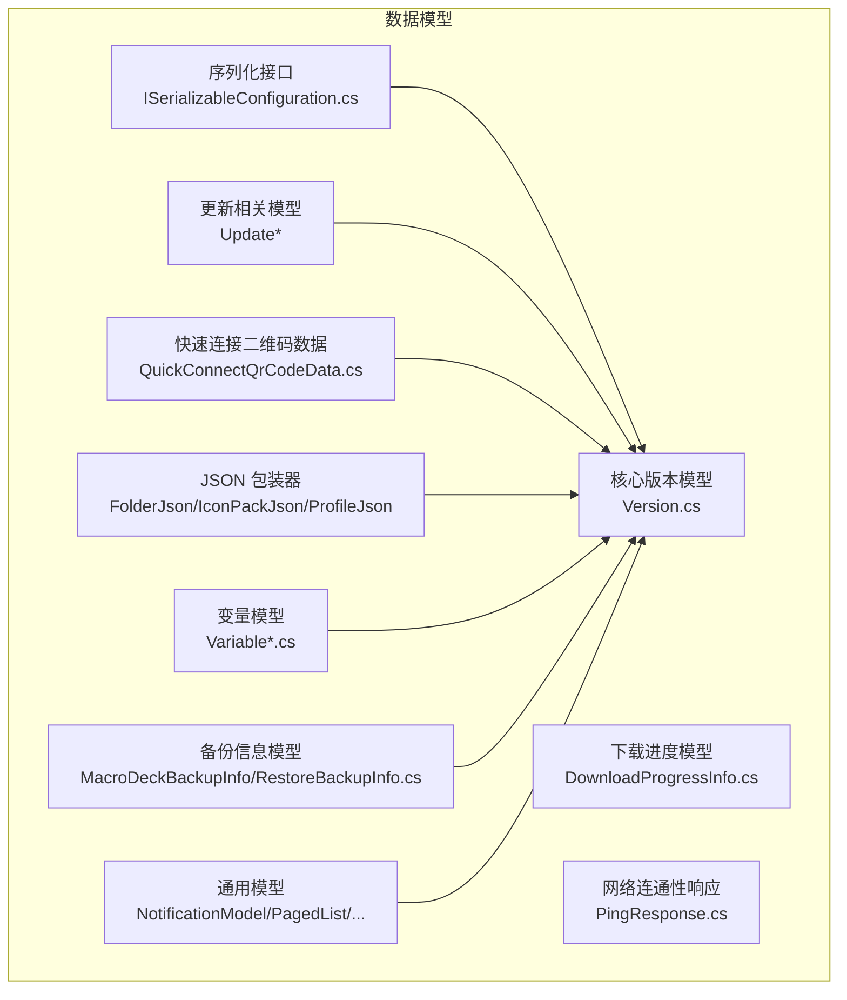

图表来源
- [Version.cs:1-74](file://src/MacroDeck/DataTypes/Core/Version.cs#L1-L74)
- [UpdateApiCheckResult.cs:1-8](file://src/MacroDeck/DataTypes/Updater/UpdateApiCheckResult.cs#L1-L8)
- [DownloadProgressInfo.cs:1-10](file://src/MacroDeck/DataTypes/FileDownloader/DownloadProgressInfo.cs#L1-L10)
- [QuickConnectQrCodeData.cs:1-24](file://src/MacroDeck/DataTypes/QrCode/QuickConnectQrCodeData.cs#L1-L24)
- [PingResponse.cs:1-12](file://src/MacroDeck/DataTypes/PingResponse.cs#L1-L12)
- [FolderJson.cs:1-10](file://src/MacroDeck/JSON/FolderJson.cs#L1-L10)
- [IconPackJson.cs:1-10](file://src/MacroDeck/JSON/IconPackJson.cs#L1-L10)
- [ProfileJson.cs:1-10](file://src/MacroDeck/JSON/ProfileJson.cs#L1-L10)
- [ISerializableConfiguration.cs:1-15](file://src/MacroDeck/Models/ISerializableConfiguration.cs#L1-L15)
- [Variable.cs:1-200](file://src/MacroDeck/Variables/Variable.cs)
- [MacroDeckBackupInfo.cs:1-100](file://src/MacroDeck/Backup/MacroDeckBackupInfo.cs)
- [RestoreBackupInfo.cs:1-100](file://src/MacroDeck/Backup/RestoreBackupInfo.cs)
- [NotificationModel.cs:1-100](file://src/MacroDeck/Models/NotificationModel.cs)
- [PagedList.cs:1-100](file://src/MacroDeck/Models/PagedList.cs)

章节来源
- [Version.cs:1-74](file://src/MacroDeck/DataTypes/Core/Version.cs#L1-L74)
- [UpdateApiCheckResult.cs:1-8](file://src/MacroDeck/DataTypes/Updater/UpdateApiCheckResult.cs#L1-L8)
- [DownloadProgressInfo.cs:1-10](file://src/MacroDeck/DataTypes/FileDownloader/DownloadProgressInfo.cs#L1-L10)
- [QuickConnectQrCodeData.cs:1-24](file://src/MacroDeck/DataTypes/QrCode/QuickConnectQrCodeData.cs#L1-L24)
- [PingResponse.cs:1-12](file://src/MacroDeck/DataTypes/PingResponse.cs#L1-L12)
- [FolderJson.cs:1-10](file://src/MacroDeck/JSON/FolderJson.cs#L1-L10)
- [IconPackJson.cs:1-10](file://src/MacroDeck/JSON/IconPackJson.cs#L1-L10)
- [ProfileJson.cs:1-10](file://src/MacroDeck/JSON/ProfileJson.cs#L1-L10)
- [ISerializableConfiguration.cs:1-15](file://src/MacroDeck/Models/ISerializableConfiguration.cs#L1-L15)

## 核心组件
本节聚焦于公共数据模型类及其职责、属性、类型与验证规则。

- 版本模型 Version
  - 设计目的：统一表示主/次/修订号及可选的 Beta 号，并提供解析与格式化能力。
  - 关键属性与类型
    - Major: 整数，主版本号
    - Minor: 整数，次版本号
    - Patch: 整数，修订号
    - BetaNo: 可空整数，Beta 编号
  - 行为与规则
    - 提供字符串化与 Beta 判定
    - 支持 TryParse 与 Parse；Parse 对空或不匹配格式抛出异常
    - 使用正则表达式校验输入格式
  - 复杂度：解析 O(n)，n 为版本串长度
  - 最佳实践：始终通过 Parse/TryParse 进行输入校验；序列化时使用 ToString 或自定义格式

- 更新相关模型
  - UpdateApiCheckResult：检查结果与版本信息
  - UpdateApiVersionInfo：版本号、是否 Beta、变更日志链接、平台文件集合
  - UpdateApiVersionFileInfo：下载地址、哈希、大小
  - UpdateServiceProgress：更新服务进度（百分比、总字节、已下载字节）
  - 规则与关系：VersionInfo 持有按平台映射的文件信息；CheckResult 可携带 Version

- 下载进度模型 DownloadProgressInfo
  - 属性：百分比、总字节、已下载字节、速度
  - 用途：文件下载过程中的实时进度反馈

- 快速连接二维码数据 QuickConnectQrCodeData
  - 属性：实例名、网络接口数组、端口、SSL 开关、令牌
  - 用途：生成二维码所需参数，便于快速连接

- 网络连通性响应 PingResponse
  - 属性：机器名，默认构造函数设置为当前环境机器名
  - 用途：健康检查与连通性测试

- JSON 包装器（SQLite）
  - FolderJson：Id 主键自增，JsonString 存储
  - IconPackJson：Id 主键自增，JsonString 存储
  - ProfileJson：Id 主键自增，JsonString 存储
  - 用途：将复杂对象序列化后存入数据库

- 序列化接口 ISerializableConfiguration
  - 方法：Serialize() 返回 JSON 字符串；Deserialize<T>() 静态方法支持从 JSON 反序列化或返回默认实例
  - 适用：实现该接口的配置模型可统一进行序列化/反序列化

章节来源
- [Version.cs:1-74](file://src/MacroDeck/DataTypes/Core/Version.cs#L1-L74)
- [UpdateApiCheckResult.cs:1-8](file://src/MacroDeck/DataTypes/Updater/UpdateApiCheckResult.cs#L1-L8)
- [UpdateApiVersionInfo.cs:1-12](file://src/MacroDeck/DataTypes/Updater/UpdateApiVersionInfo.cs#L1-L12)
- [UpdateApiVersionFileInfo.cs:1-9](file://src/MacroDeck/DataTypes/Updater/UpdateApiVersionFileInfo.cs#L1-L9)
- [UpdateServiceProgress.cs:1-9](file://src/MacroDeck/DataTypes/Updater/UpdateServiceProgress.cs#L1-L9)
- [DownloadProgressInfo.cs:1-10](file://src/MacroDeck/DataTypes/FileDownloader/DownloadProgressInfo.cs#L1-L10)
- [QuickConnectQrCodeData.cs:1-24](file://src/MacroDeck/DataTypes/QrCode/QuickConnectQrCodeData.cs#L1-L24)
- [PingResponse.cs:1-12](file://src/MacroDeck/DataTypes/PingResponse.cs#L1-L12)
- [FolderJson.cs:1-10](file://src/MacroDeck/JSON/FolderJson.cs#L1-L10)
- [IconPackJson.cs:1-10](file://src/MacroDeck/JSON/IconPackJson.cs#L1-L10)
- [ProfileJson.cs:1-10](file://src/MacroDeck/JSON/ProfileJson.cs#L1-L10)
- [ISerializableConfiguration.cs:1-15](file://src/MacroDeck/Models/ISerializableConfiguration.cs#L1-L15)

## 架构总览
下图展示数据模型在系统中的角色与交互：

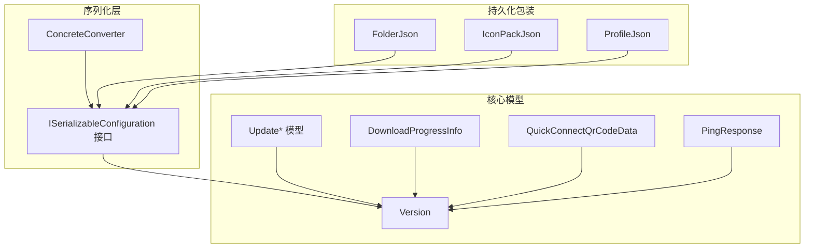

图表来源
- [ISerializableConfiguration.cs:1-15](file://src/MacroDeck/Models/ISerializableConfiguration.cs#L1-L15)
- [ConcreteConverter.cs:1-26](file://src/MacroDeck/JSON/ConcreteConverter.cs#L1-L26)
- [Version.cs:1-74](file://src/MacroDeck/DataTypes/Core/Version.cs#L1-L74)
- [UpdateApiCheckResult.cs:1-8](file://src/MacroDeck/DataTypes/Updater/UpdateApiCheckResult.cs#L1-L8)
- [DownloadProgressInfo.cs:1-10](file://src/MacroDeck/DataTypes/FileDownloader/DownloadProgressInfo.cs#L1-L10)
- [QuickConnectQrCodeData.cs:1-24](file://src/MacroDeck/DataTypes/QrCode/QuickConnectQrCodeData.cs#L1-L24)
- [PingResponse.cs:1-12](file://src/MacroDeck/DataTypes/PingResponse.cs#L1-L12)
- [FolderJson.cs:1-10](file://src/MacroDeck/JSON/FolderJson.cs#L1-L10)
- [IconPackJson.cs:1-10](file://src/MacroDeck/JSON/IconPackJson.cs#L1-L10)
- [ProfileJson.cs:1-10](file://src/MacroDeck/JSON/ProfileJson.cs#L1-L10)

## 详细组件分析

### 版本模型 Version
- 设计要点
  - 结构体，不可变派生行为由属性 setter 控制
  - 支持 Beta 版本标识与格式化输出
  - 解析采用正则，保证输入合法性
- 关系与依赖
  - 被更新模块广泛使用（版本比较、显示）
- 复杂度
  - 解析与格式化均为线性时间
- 使用建议
  - 输入必须先经 TryParse 校验
  - 输出统一使用 ToString 或 VersionName

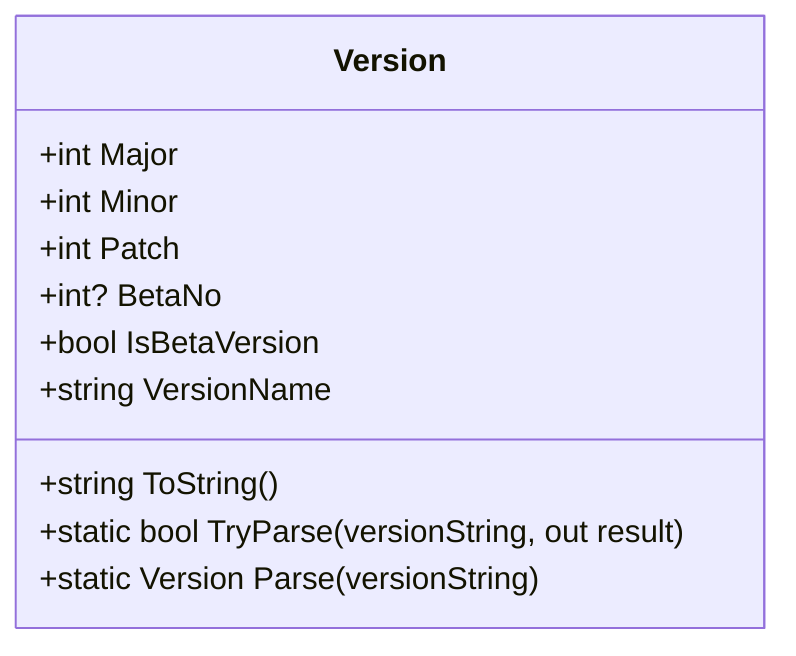

图表来源
- [Version.cs:1-74](file://src/MacroDeck/DataTypes/Core/Version.cs#L1-L74)

章节来源
- [Version.cs:1-74](file://src/MacroDeck/DataTypes/Core/Version.cs#L1-L74)

### 更新相关模型
- UpdateApiCheckResult
  - 新版本可用标记与版本详情
- UpdateApiVersionInfo
  - 版本号、Beta 标识、变更日志、平台文件映射
- UpdateApiVersionFileInfo
  - 下载地址、哈希、文件大小
- UpdateServiceProgress
  - 下载进度统计

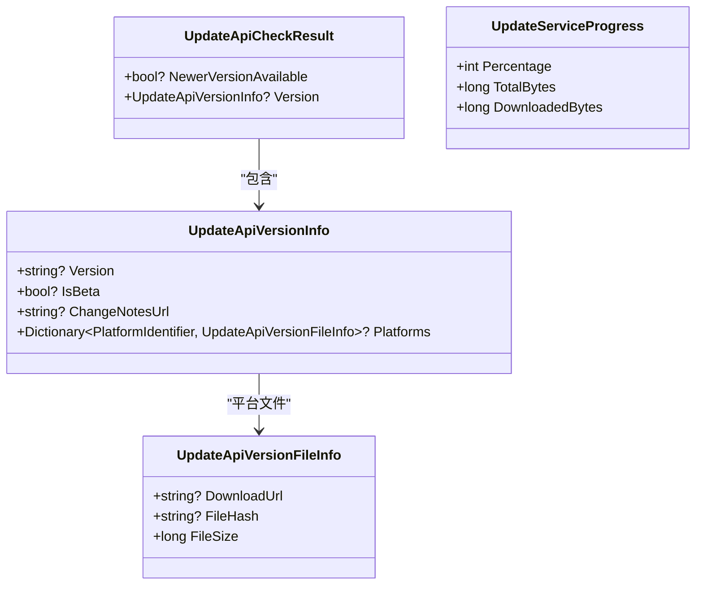

图表来源
- [UpdateApiCheckResult.cs:1-8](file://src/MacroDeck/DataTypes/Updater/UpdateApiCheckResult.cs#L1-L8)
- [UpdateApiVersionInfo.cs:1-12](file://src/MacroDeck/DataTypes/Updater/UpdateApiVersionInfo.cs#L1-L12)
- [UpdateApiVersionFileInfo.cs:1-9](file://src/MacroDeck/DataTypes/Updater/UpdateApiVersionFileInfo.cs#L1-L9)
- [UpdateServiceProgress.cs:1-9](file://src/MacroDeck/DataTypes/Updater/UpdateServiceProgress.cs#L1-L9)

章节来源
- [UpdateApiCheckResult.cs:1-8](file://src/MacroDeck/DataTypes/Updater/UpdateApiCheckResult.cs#L1-L8)
- [UpdateApiVersionInfo.cs:1-12](file://src/MacroDeck/DataTypes/Updater/UpdateApiVersionInfo.cs#L1-L12)
- [UpdateApiVersionFileInfo.cs:1-9](file://src/MacroDeck/DataTypes/Updater/UpdateApiVersionFileInfo.cs#L1-L9)
- [UpdateServiceProgress.cs:1-9](file://src/MacroDeck/DataTypes/Updater/UpdateServiceProgress.cs#L1-L9)

### 下载进度模型 DownloadProgressInfo
- 属性语义
  - 百分比：0-100
  - 总字节/已下载字节：用于计算剩余时间与速率
  - 速度：单位通常为 B/s
- 使用场景
  - 文件下载、更新下载等长耗时任务的 UI 进度反馈

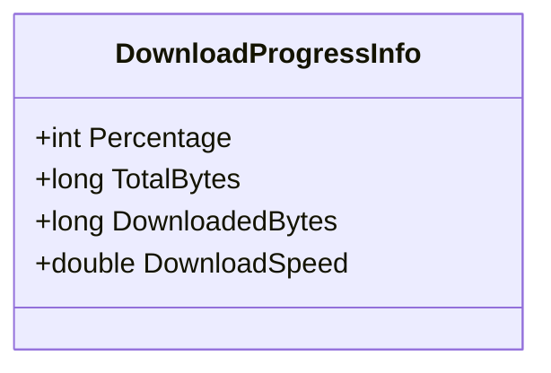

图表来源
- [DownloadProgressInfo.cs:1-10](file://src/MacroDeck/DataTypes/FileDownloader/DownloadProgressInfo.cs#L1-L10)

章节来源
- [DownloadProgressInfo.cs:1-10](file://src/MacroDeck/DataTypes/FileDownloader/DownloadProgressInfo.cs#L1-L10)

### 快速连接二维码数据 QuickConnectQrCodeData
- 属性与用途
  - 实例名、网络接口列表、端口、SSL 开关、令牌
  - 用于生成二维码参数，便于客户端快速连接
- 建议
  - 网络接口应为有效地址集合；端口需在允许范围内；令牌应安全存储

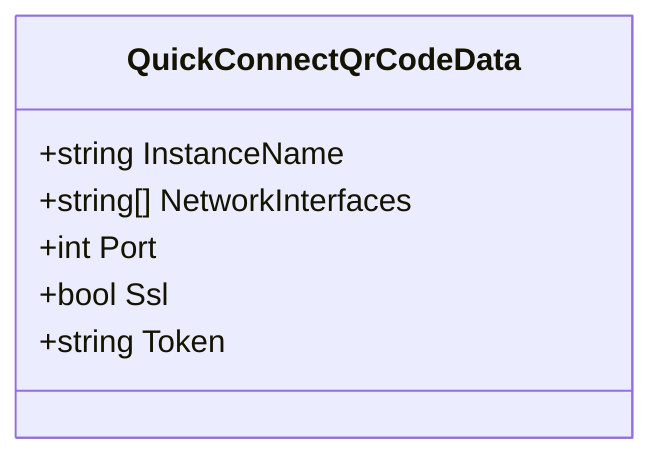

图表来源
- [QuickConnectQrCodeData.cs:1-24](file://src/MacroDeck/DataTypes/QrCode/QuickConnectQrCodeData.cs#L1-L24)

章节来源
- [QuickConnectQrCodeData.cs:1-24](file://src/MacroDeck/DataTypes/QrCode/QuickConnectQrCodeData.cs#L1-L24)

### 网络连通性响应 PingResponse
- 默认构造函数自动填充当前机器名
- 适用于健康检查与设备发现

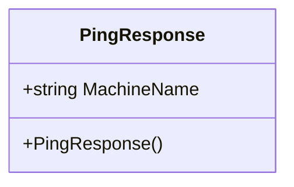

图表来源
- [PingResponse.cs:1-12](file://src/MacroDeck/DataTypes/PingResponse.cs#L1-L12)

章节来源
- [PingResponse.cs:1-12](file://src/MacroDeck/DataTypes/PingResponse.cs#L1-L12)

### JSON 包装器（SQLite）
- 作用：将复杂对象序列化为 JSON 字符串，配合 SQLite 主键自增存储
- 适用：Folder、IconPack、Profile 等对象的持久化

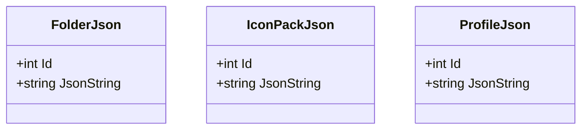

图表来源
- [FolderJson.cs:1-10](file://src/MacroDeck/JSON/FolderJson.cs#L1-L10)
- [IconPackJson.cs:1-10](file://src/MacroDeck/JSON/IconPackJson.cs#L1-L10)
- [ProfileJson.cs:1-10](file://src/MacroDeck/JSON/ProfileJson.cs#L1-L10)

章节来源
- [FolderJson.cs:1-10](file://src/MacroDeck/JSON/FolderJson.cs#L1-L10)
- [IconPackJson.cs:1-10](file://src/MacroDeck/JSON/IconPackJson.cs#L1-L10)
- [ProfileJson.cs:1-10](file://src/MacroDeck/JSON/ProfileJson.cs#L1-L10)

### 序列化接口 ISerializableConfiguration
- 设计：统一 Serialize 与静态 Deserialize<T>，简化配置模型的序列化流程
- 适用：实现该接口的配置模型可直接进行 JSON 序列化/反序列化

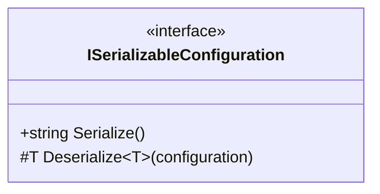

图表来源
- [ISerializableConfiguration.cs:1-15](file://src/MacroDeck/Models/ISerializableConfiguration.cs#L1-L15)

章节来源
- [ISerializableConfiguration.cs:1-15](file://src/MacroDeck/Models/ISerializableConfiguration.cs#L1-L15)

### WebSocket 相关模型
- WebSocketSession：会话信息载体
- WebSocketCloseReason：关闭原因枚举
- WebSocketNormalClose：正常关闭状态
- 用途：服务端/客户端通信状态管理

图表来源
- [WebSocketSession.cs](file://src/MacroDeck/DataTypes/WebSocketSession.cs)
- [WebSocketCloseReason.cs](file://src/MacroDeck/DataTypes/WebSocketCloseReason.cs)
- [WebSocketNormalClose.cs](file://src/MacroDeck/DataTypes/WebSocketNormalClose.cs)

章节来源
- [WebSocketSession.cs](file://src/MacroDeck/DataTypes/WebSocketSession.cs)
- [WebSocketCloseReason.cs](file://src/MacroDeck/DataTypes/WebSocketCloseReason.cs)
- [WebSocketNormalClose.cs](file://src/MacroDeck/DataTypes/WebSocketNormalClose.cs)

### 备份信息模型
- MacroDeckBackupInfo：备份元信息
- RestoreBackupInfo：恢复信息
- 用途：备份与恢复流程中的数据承载

图表来源
- [MacroDeckBackupInfo.cs](file://src/MacroDeck/Backup/MacroDeckBackupInfo.cs)
- [RestoreBackupInfo.cs](file://src/MacroDeck/Backup/RestoreBackupInfo.cs)

章节来源
- [MacroDeckBackupInfo.cs](file://src/MacroDeck/Backup/MacroDeckBackupInfo.cs)
- [RestoreBackupInfo.cs](file://src/MacroDeck/Backup/RestoreBackupInfo.cs)

### 变量系统模型
- Variable：变量实体
- VariableManager：变量管理器
- VariableType：变量类型枚举
- 用途：全局变量的创建、读写与类型约束

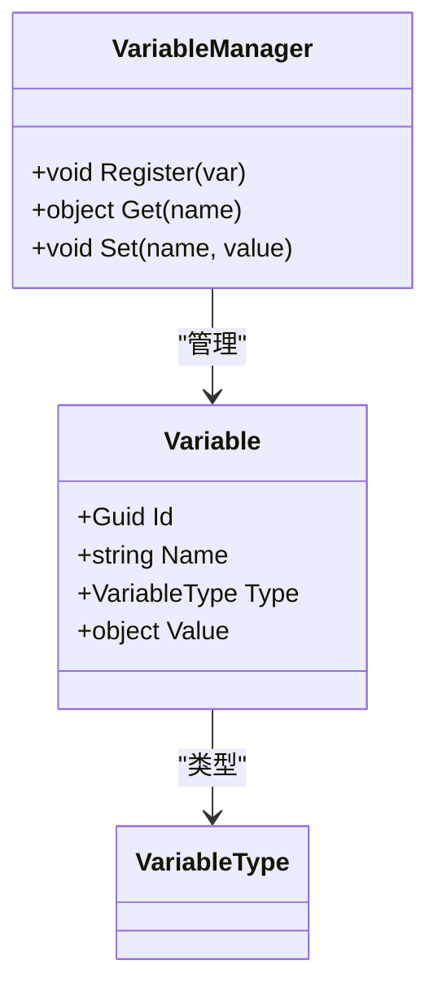

图表来源
- [Variable.cs](file://src/MacroDeck/Variables/Variable.cs)
- [VariableManager.cs](file://src/MacroDeck/Variables/VariableManager.cs)
- [VariableType.cs](file://src/MacroDeck/Variables/VariableType.cs)

章节来源
- [Variable.cs](file://src/MacroDeck/Variables/Variable.cs)
- [VariableManager.cs](file://src/MacroDeck/Variables/VariableManager.cs)
- [VariableType.cs](file://src/MacroDeck/Variables/VariableType.cs)

### 通用模型
- NotificationModel：通知模型
- PagedList<T>：分页列表
- VariableViewCreatorFilterModel：变量视图过滤器
- VersionModel：版本信息模型
- ApiV2Extension/ApiV2ExtensionFile/ApiV2ExtensionSummary：扩展模型
- ExtensionManifestModel：扩展清单
- ExtensionStoreDownloaderPackageInfoModel：扩展包信息
- ExtensionStoreExtensionModel：扩展商店扩展

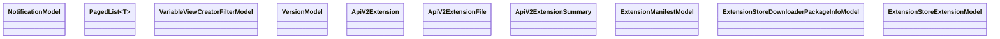

图表来源
- [NotificationModel.cs](file://src/MacroDeck/Models/NotificationModel.cs)
- [PagedList.cs](file://src/MacroDeck/Models/PagedList.cs)
- [VariableViewCreatorFilterModel.cs](file://src/MacroDeck/Models/VariableViewCreatorFilterModel.cs)
- [VersionModel.cs](file://src/MacroDeck/Models/VersionModel.cs)
- [ApiV2Extension.cs](file://src/MacroDeck/Models/ApiV2Extension.cs)
- [ApiV2ExtensionFile.cs](file://src/MacroDeck/Models/ApiV2ExtensionFile.cs)
- [ApiV2ExtensionSummary.cs](file://src/MacroDeck/Models/ApiV2ExtensionSummary.cs)
- [ExtensionManifestModel.cs](file://src/MacroDeck/Models/ExtensionManifestModel.cs)
- [ExtensionStoreDownloaderPackageInfoModel.cs](file://src/MacroDeck/Models/ExtensionStoreDownloaderPackageInfoModel.cs)
- [ExtensionStoreExtensionModel.cs](file://src/MacroDeck/Models/ExtensionStoreExtensionModel.cs)

章节来源
- [NotificationModel.cs](file://src/MacroDeck/Models/NotificationModel.cs)
- [PagedList.cs](file://src/MacroDeck/Models/PagedList.cs)
- [VariableViewCreatorFilterModel.cs](file://src/MacroDeck/Models/VariableViewCreatorFilterModel.cs)
- [VersionModel.cs](file://src/MacroDeck/Models/VersionModel.cs)
- [ApiV2Extension.cs](file://src/MacroDeck/Models/ApiV2Extension.cs)
- [ApiV2ExtensionFile.cs](file://src/MacroDeck/Models/ApiV2ExtensionFile.cs)
- [ApiV2ExtensionSummary.cs](file://src/MacroDeck/Models/ApiV2ExtensionSummary.cs)
- [ExtensionManifestModel.cs](file://src/MacroDeck/Models/ExtensionManifestModel.cs)
- [ExtensionStoreDownloaderPackageInfoModel.cs](file://src/MacroDeck/Models/ExtensionStoreDownloaderPackageInfoModel.cs)
- [ExtensionStoreExtensionModel.cs](file://src/MacroDeck/Models/ExtensionStoreExtensionModel.cs)

### 内置插件配置模型
- ActionButton 插件：背景色设置等动作配置模型
- Device 插件：亮度设置、配置切换等动作配置模型
- Variables 插件：变量值变更、读取/保存到文件等动作配置模型

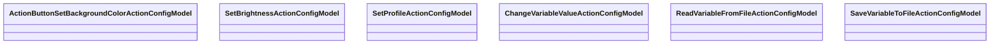

图表来源
- [ActionButtonSetBackgroundColorActionConfigModel.cs](file://src/MacroDeck/InternalPlugins/ActionButtonPlugin/Models/ActionButtonSetBackgroundColorActionConfigModel.cs)
- [SetBrightnessActionConfigModel.cs](file://src/MacroDeck/InternalPlugins/DevicePlugin/Models/SetBrightnessActionConfigModel.cs)
- [SetProfileActionConfigModel.cs](file://src/MacroDeck/InternalPlugins/DevicePlugin/Models/SetProfileActionConfigModel.cs)
- [ChangeVariableValueActionConfigModel.cs](file://src/MacroDeck/InternalPlugins/Variables/Models/ChangeVariableValueActionConfigModel.cs)
- [ReadVariableFromFileActionConfigModel.cs](file://src/MacroDeck/InternalPlugins/Variables/Models/ReadVariableFromFileActionConfigModel.cs)
- [SaveVariableToFileActionConfigModel.cs](file://src/MacroDeck/InternalPlugins/Variables/Models/SaveVariableToFileActionConfigModel.cs)

章节来源
- [ActionButtonSetBackgroundColorActionConfigModel.cs](file://src/MacroDeck/InternalPlugins/ActionButtonPlugin/Models/ActionButtonSetBackgroundColorActionConfigModel.cs)
- [SetBrightnessActionConfigModel.cs](file://src/MacroDeck/InternalPlugins/DevicePlugin/Models/SetBrightnessActionConfigModel.cs)
- [SetProfileActionConfigModel.cs](file://src/MacroDeck/InternalPlugins/DevicePlugin/Models/SetProfileActionConfigModel.cs)
- [ChangeVariableValueActionConfigModel.cs](file://src/MacroDeck/InternalPlugins/Variables/Models/ChangeVariableValueActionConfigModel.cs)
- [ReadVariableFromFileActionConfigModel.cs](file://src/MacroDeck/InternalPlugins/Variables/Models/ReadVariableFromFileActionConfigModel.cs)
- [SaveVariableToFileActionConfigModel.cs](file://src/MacroDeck/InternalPlugins/Variables/Models/SaveVariableToFileActionConfigModel.cs)

## 依赖分析
- 组件耦合
  - 更新模块强依赖 Version；下载进度与更新服务进度相互独立但常组合使用
  - JSON 包装器与序列化接口解耦，便于不同存储介质与序列化库迁移
  - 变量系统与通用模型松耦合，通过接口与枚举进行交互
- 外部依赖
  - System.Text.Json 用于 ISerializableConfiguration 的序列化
  - Newtonsoft.Json 用于 ConcreteConverter<T> 的通用转换
  - SQLite 特性用于 JSON 包装器的主键与自增

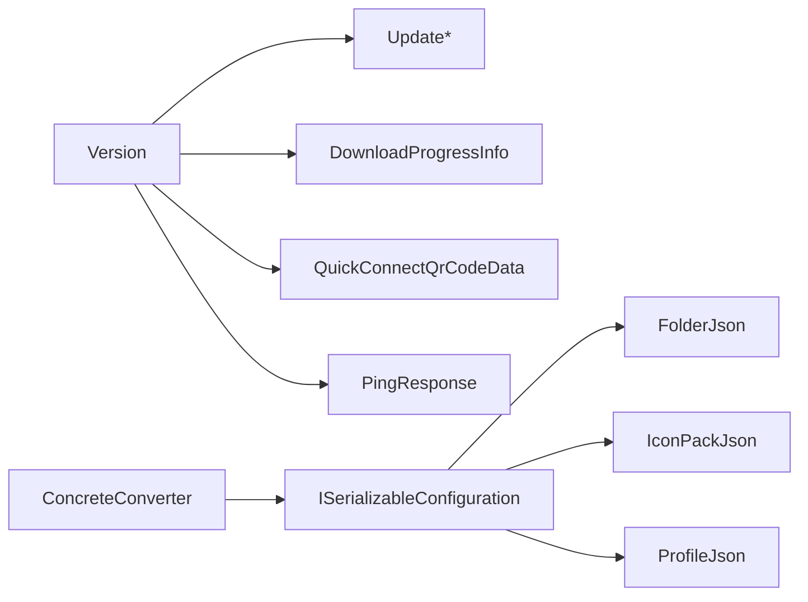

图表来源
- [Version.cs:1-74](file://src/MacroDeck/DataTypes/Core/Version.cs#L1-L74)
- [UpdateApiCheckResult.cs:1-8](file://src/MacroDeck/DataTypes/Updater/UpdateApiCheckResult.cs#L1-L8)
- [DownloadProgressInfo.cs:1-10](file://src/MacroDeck/DataTypes/FileDownloader/DownloadProgressInfo.cs#L1-L10)
- [QuickConnectQrCodeData.cs:1-24](file://src/MacroDeck/DataTypes/QrCode/QuickConnectQrCodeData.cs#L1-L24)
- [PingResponse.cs:1-12](file://src/MacroDeck/DataTypes/PingResponse.cs#L1-L12)
- [FolderJson.cs:1-10](file://src/MacroDeck/JSON/FolderJson.cs#L1-L10)
- [IconPackJson.cs:1-10](file://src/MacroDeck/JSON/IconPackJson.cs#L1-L10)
- [ProfileJson.cs:1-10](file://src/MacroDeck/JSON/ProfileJson.cs#L1-L10)
- [ISerializableConfiguration.cs:1-15](file://src/MacroDeck/Models/ISerializableConfiguration.cs#L1-L15)
- [ConcreteConverter.cs:1-26](file://src/MacroDeck/JSON/ConcreteConverter.cs#L1-L26)

章节来源
- [Version.cs:1-74](file://src/MacroDeck/DataTypes/Core/Version.cs#L1-L74)
- [ISerializableConfiguration.cs:1-15](file://src/MacroDeck/Models/ISerializableConfiguration.cs#L1-L15)
- [ConcreteConverter.cs:1-26](file://src/MacroDeck/JSON/ConcreteConverter.cs#L1-L26)

## 性能考虑
- 版本解析
  - 正则匹配线性时间；避免在高频路径重复编译正则
- JSON 序列化
  - System.Text.Json 性能优于 Newtonsoft.Json；优先使用 ISerializableConfiguration
  - 批量序列化时复用 JsonSerializerOptions
- 下载进度
  - 定期采样更新 UI，避免每字节刷新导致 UI 卡顿
- SQLite 存储
  - JSON 包装器仅做简单序列化/反序列化，IO 成本主要来自磁盘访问

## 故障排除指南
- 版本字符串解析失败
  - 现象：Parse 抛出格式异常
  - 处理：使用 TryParse 并对空或非法格式进行降级处理
- JSON 反序列化为空
  - 现象：Deserialize<T>() 返回默认实例
  - 处理：确保传入非空配置字符串；必要时提供默认配置回退
- 下载进度异常
  - 现象：百分比超过 100 或小于 0
  - 处理：在更新服务中加入边界校验与归一化逻辑
- WebSocket 会话问题
  - 现象：连接异常关闭
  - 处理：检查关闭原因枚举与正常关闭状态，记录日志并重试

章节来源
- [Version.cs:31-69](file://src/MacroDeck/DataTypes/Core/Version.cs#L31-L69)
- [ISerializableConfiguration.cs:9-13](file://src/MacroDeck/Models/ISerializableConfiguration.cs#L9-L13)
- [UpdateServiceProgress.cs:1-9](file://src/MacroDeck/DataTypes/Updater/UpdateServiceProgress.cs#L1-L9)
- [WebSocketCloseReason.cs](file://src/MacroDeck/DataTypes/WebSocketCloseReason.cs)

## 结论
本文档系统梳理了 Macro-Deck 的数据模型 API，覆盖版本、更新、下载进度、快速连接、连通性、JSON 包装器、序列化接口、WebSocket、备份、变量与通用模型，并给出类图、序列图与流程图以帮助理解。建议在实际开发中遵循输入校验、统一序列化、合理分页与错误处理的最佳实践，确保系统的稳定性与可维护性。

## 附录
- 序列化与反序列化示例（路径）
  - 统一序列化接口：[ISerializableConfiguration.cs:7-13](file://src/MacroDeck/Models/ISerializableConfiguration.cs#L7-L13)
  - JSON 包装器（Folder/IconPack/Profile）：[FolderJson.cs:5-10](file://src/MacroDeck/JSON/FolderJson.cs#L5-L10)、[IconPackJson.cs:5-10](file://src/MacroDeck/JSON/IconPackJson.cs#L5-L10)、[ProfileJson.cs:5-10](file://src/MacroDeck/JSON/ProfileJson.cs#L5-L10)
  - 通用转换器：[ConcreteConverter.cs:5-26](file://src/MacroDeck/JSON/ConcreteConverter.cs#L5-L26)
- 版本控制与兼容性
  - 版本解析与格式化：[Version.cs:31-69](file://src/MacroDeck/DataTypes/Core/Version.cs#L31-L69)
  - 更新版本信息与平台文件：[UpdateApiVersionInfo.cs:5-11](file://src/MacroDeck/DataTypes/Updater/UpdateApiVersionInfo.cs#L5-L11)、[UpdateApiVersionFileInfo.cs:3-8](file://src/MacroDeck/DataTypes/Updater/UpdateApiVersionFileInfo.cs#L3-L8)
- 使用场景与最佳实践
  - 快速连接：[QuickConnectQrCodeData.cs:3-23](file://src/MacroDeck/DataTypes/QrCode/QuickConnectQrCodeData.cs#L3-L23)
  - 健康检查：[PingResponse.cs:3-11](file://src/MacroDeck/DataTypes/PingResponse.cs#L3-L11)
  - 变量系统：[Variable.cs](file://src/MacroDeck/Variables/Variable.cs)、[VariableManager.cs](file://src/MacroDeck/Variables/VariableManager.cs)、[VariableType.cs](file://src/MacroDeck/Variables/VariableType.cs)