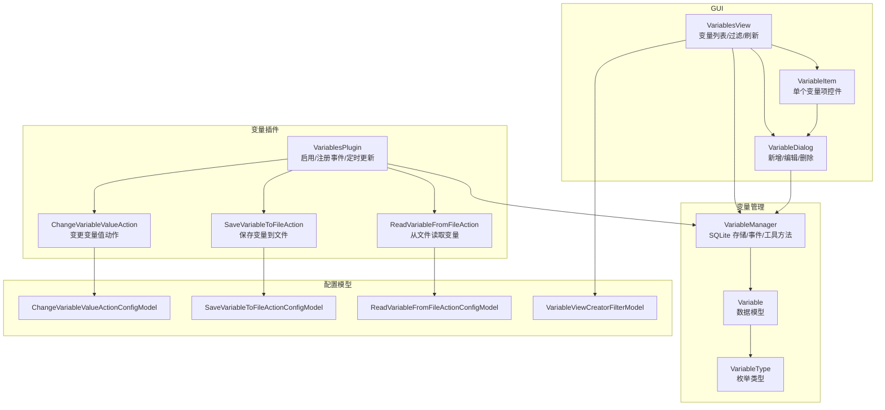
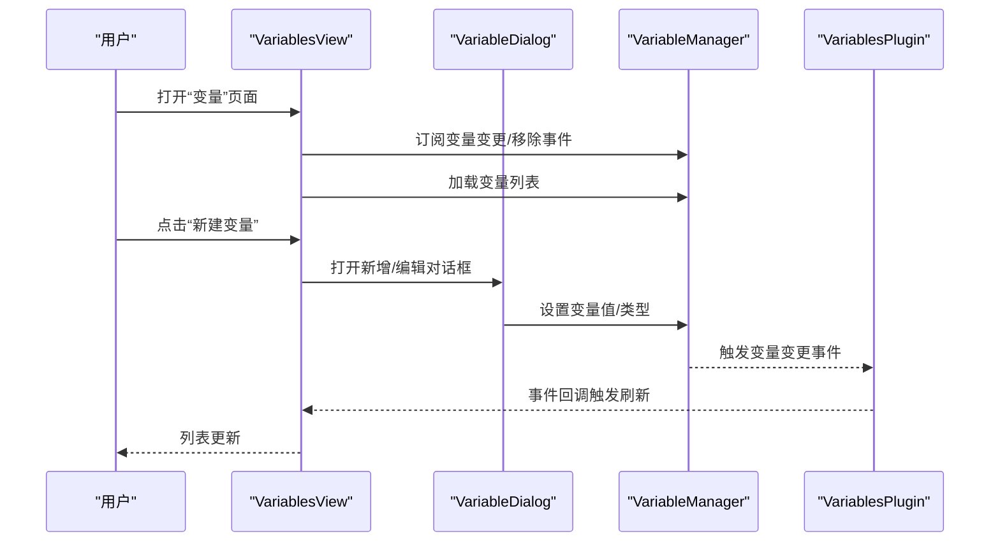
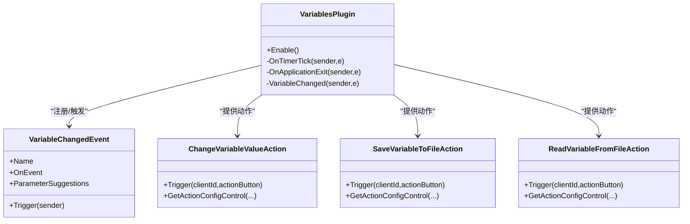
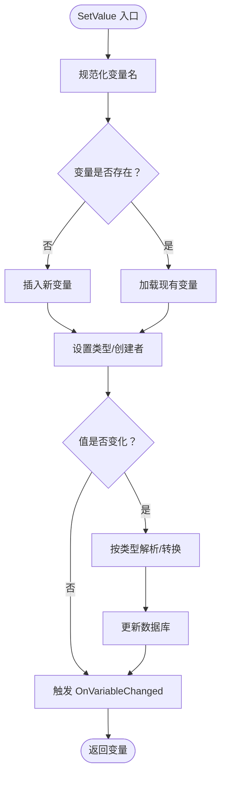
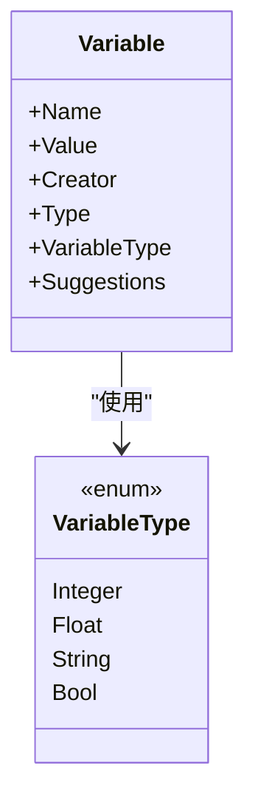
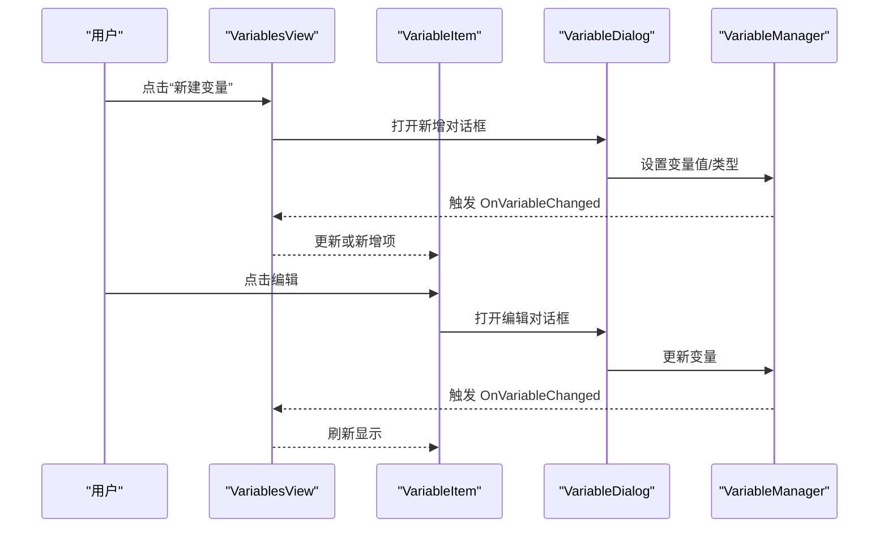
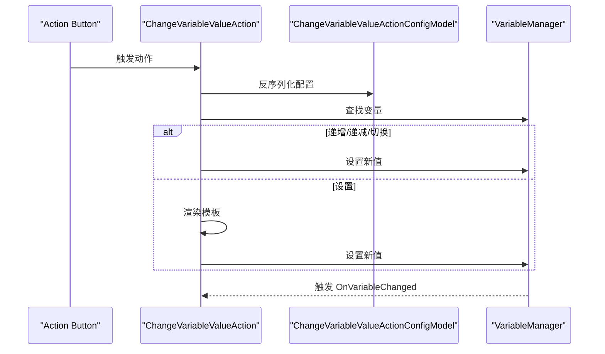
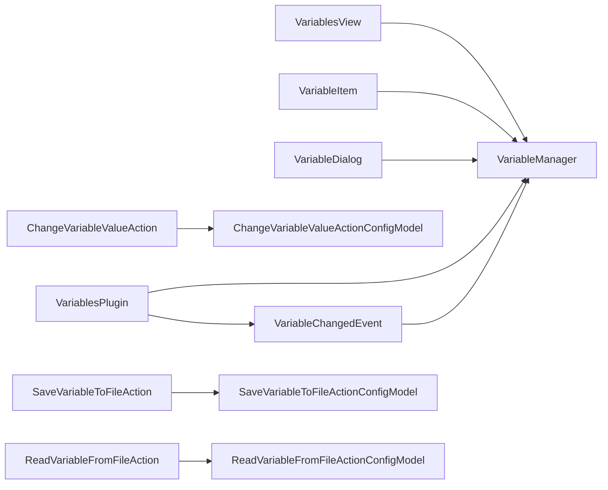

# 变量插件

<cite>
**本文引用的文件**
- [VariablesPlugin.cs](file://src/MacroDeck/InternalPlugins/Variables/VariablesPlugin.cs)
- [VariableManager.cs](file://src/MacroDeck/Variables/VariableManager.cs)
- [Variable.cs](file://src/MacroDeck/Variables/Variable.cs)
- [VariableType.cs](file://src/MacroDeck/Variables/VariableType.cs)
- [VariablesView.cs](file://src/MacroDeck/GUI/MainWindowViews/VariablesView.cs)
- [VariableItem.cs](file://src/MacroDeck/GUI/CustomControls/Variables/VariableItem.cs)
- [VariableDialog.cs](file://src/MacroDeck/GUI/Dialogs/VariableDialog.cs)
- [ChangeVariableMethod.cs](file://src/MacroDeck/InternalPlugins/Variables/Enums/ChangeVariableMethod.cs)
- [ChangeVariableValueActionConfigModel.cs](file://src/MacroDeck/InternalPlugins/Variables/Models/ChangeVariableValueActionConfigModel.cs)
- [SaveVariableToFileActionConfigModel.cs](file://src/MacroDeck/InternalPlugins/Variables/Models/SaveVariableToFileActionConfigModel.cs)
- [ReadVariableFromFileActionConfigModel.cs](file://src/MacroDeck/InternalPlugins/Variables/Models/ReadVariableFromFileActionConfigModel.cs)
- [VariableViewCreatorFilterModel.cs](file://src/MacroDeck/Models/VariableViewCreatorFilterModel.cs)
</cite>

## 目录
1. [简介](#简介)
2. [项目结构](#项目结构)
3. [核心组件](#核心组件)
4. [架构总览](#架构总览)
5. [详细组件分析](#详细组件分析)
6. [依赖关系分析](#依赖关系分析)
7. [性能考量](#性能考量)
8. [故障排查指南](#故障排查指南)
9. [结论](#结论)
10. [附录](#附录)

## 简介
本文件为内置“变量插件”的权威技术文档，面向插件开发者与高级用户。内容涵盖 VariablesPlugin 的功能架构与实现原理（初始化、配置与运行机制）、变量操作的 GUI 界面（变量列表、新增/编辑对话框、批量过滤）、变量配置模型与视图模型的设计模式（数据绑定与命令处理）、变量操作的业务逻辑（值变更检测、冲突解决、历史记录）、扩展接口与自定义选项、与其他系统组件的集成（事件订阅与状态同步）、用户体验设计原则与交互模式，以及扩展指南与定制化建议。

## 项目结构
变量插件位于内部插件目录下，围绕变量管理器（VariableManager）构建，包含以下关键模块：
- 插件入口与动作：VariablesPlugin、ChangeVariableValueAction、SaveVariableToFileAction、ReadVariableFromFileAction
- 数据模型：Variable、VariableType
- GUI 视图：VariablesView、VariableItem、VariableDialog
- 配置模型：ChangeVariableValueActionConfigModel、SaveVariableToFileActionConfigModel、ReadVariableFromFileActionConfigModel、VariableViewCreatorFilterModel
- 枚举：ChangeVariableMethod

图表来源
- [VariablesPlugin.cs:33-87](file://src/MacroDeck/InternalPlugins/Variables/VariablesPlugin.cs#L33-L87)
- [VariableManager.cs:10-248](file://src/MacroDeck/Variables/VariableManager.cs#L10-L248)
- [VariablesView.cs:10-171](file://src/MacroDeck/GUI/MainWindowViews/VariablesView.cs#L10-L171)
- [VariableItem.cs:6-38](file://src/MacroDeck/GUI/CustomControls/Variables/VariableItem.cs#L6-L38)
- [VariableDialog.cs:8-142](file://src/MacroDeck/GUI/Dialogs/VariableDialog.cs#L8-L142)
- [ChangeVariableValueActionConfigModel.cs:8-30](file://src/MacroDeck/InternalPlugins/Variables/Models/ChangeVariableValueActionConfigModel.cs#L8-L30)
- [SaveVariableToFileActionConfigModel.cs:6-23](file://src/MacroDeck/InternalPlugins/Variables/Models/SaveVariableToFileActionConfigModel.cs#L6-L23)
- [ReadVariableFromFileActionConfigModel.cs:6-23](file://src/MacroDeck/InternalPlugins/Variables/Models/ReadVariableFromFileActionConfigModel.cs#L6-L23)
- [VariableViewCreatorFilterModel.cs:5-19](file://src/MacroDeck/Models/VariableViewCreatorFilterModel.cs#L5-L19)

章节来源
- [VariablesPlugin.cs:33-87](file://src/MacroDeck/InternalPlugins/Variables/VariablesPlugin.cs#L33-L87)
- [VariableManager.cs:204-223](file://src/MacroDeck/Variables/VariableManager.cs#L204-L223)
- [VariablesView.cs:89-141](file://src/MacroDeck/GUI/MainWindowViews/VariablesView.cs#L89-L141)
- [VariableDialog.cs:15-39](file://src/MacroDeck/GUI/Dialogs/VariableDialog.cs#L15-L39)

## 核心组件
- 插件主体：VariablesPlugin 负责注册事件、订阅变量变更、启动定时器维护系统时间/日期变量，并暴露三个动作供按钮触发使用。
- 变量管理器：VariableManager 提供变量的增删改查、类型转换、事件通知、数据库初始化与关闭等能力。
- 数据模型：Variable 表示单个变量，包含名称、值、创建者、类型；VariableType 定义四种基础类型。
- GUI 层：VariablesView 负责变量列表展示与按创建者过滤；VariableItem 显示单行变量信息；VariableDialog 支持新增、编辑、删除变量。
- 动作与配置：ChangeVariableValueAction、SaveVariableToFileAction、ReadVariableFromFileAction 分别对应三种内置动作；各自配置模型负责序列化/反序列化。

章节来源
- [VariablesPlugin.cs:22-87](file://src/MacroDeck/InternalPlugins/Variables/VariablesPlugin.cs#L22-L87)
- [VariableManager.cs:10-138](file://src/MacroDeck/Variables/VariableManager.cs#L10-L138)
- [Variable.cs:5-16](file://src/MacroDeck/Variables/Variable.cs#L5-L16)
- [VariableType.cs:3-9](file://src/MacroDeck/Variables/VariableType.cs#L3-L9)
- [VariablesView.cs:10-171](file://src/MacroDeck/GUI/MainWindowViews/VariablesView.cs#L10-L171)
- [VariableItem.cs:6-38](file://src/MacroDeck/GUI/CustomControls/Variables/VariableItem.cs#L6-L38)
- [VariableDialog.cs:8-142](file://src/MacroDeck/GUI/Dialogs/VariableDialog.cs#L8-L142)

## 架构总览
变量插件采用“插件 + 管理器 + GUI + 配置模型”的分层架构。插件在启用时注册事件与动作，管理器通过 SQLite 持久化变量，GUI 基于事件驱动刷新，动作通过配置模型解析参数并调用管理器执行。

图表来源
- [VariablesView.cs:89-141](file://src/MacroDeck/GUI/MainWindowViews/VariablesView.cs#L89-L141)
- [VariableDialog.cs:46-94](file://src/MacroDeck/GUI/Dialogs/VariableDialog.cs#L46-L94)
- [VariableManager.cs:16-138](file://src/MacroDeck/Variables/VariableManager.cs#L16-L138)
- [VariablesPlugin.cs:41-87](file://src/MacroDeck/InternalPlugins/Variables/VariablesPlugin.cs#L41-L87)

## 详细组件分析

### 插件主体：VariablesPlugin
- 初始化与启用
  - 注册三个动作：变更变量值、保存变量到文件、从文件读取变量。
  - 注册变量变更事件，转发给事件系统。
  - 启动定时器每秒更新系统时间、日期、星期变量。
  - 应用退出时清理事件与定时器资源。
- 事件机制
  - 自定义事件 VariableChangedEvent，支持参数建议（变量名列表），触发后遍历所有配置了监听该事件的按钮，传递参数（变量名）。
- 动作实现要点
  - 变更变量值：根据配置方法（递增、递减、设置、切换）调用管理器设置值。
  - 保存/读取文件：解析配置模型，进行文件读写与类型转换。

图表来源
- [VariablesPlugin.cs:33-87](file://src/MacroDeck/InternalPlugins/Variables/VariablesPlugin.cs#L33-L87)
- [VariablesPlugin.cs:90-147](file://src/MacroDeck/InternalPlugins/Variables/VariablesPlugin.cs#L90-L147)
- [VariablesPlugin.cs:149-206](file://src/MacroDeck/InternalPlugins/Variables/VariablesPlugin.cs#L149-L206)
- [VariablesPlugin.cs:208-252](file://src/MacroDeck/InternalPlugins/Variables/VariablesPlugin.cs#L208-L252)
- [VariablesPlugin.cs:254-318](file://src/MacroDeck/InternalPlugins/Variables/VariablesPlugin.cs#L254-L318)

章节来源
- [VariablesPlugin.cs:33-87](file://src/MacroDeck/InternalPlugins/Variables/VariablesPlugin.cs#L33-L87)
- [VariablesPlugin.cs:90-147](file://src/MacroDeck/InternalPlugins/Variables/VariablesPlugin.cs#L90-L147)
- [VariablesPlugin.cs:149-206](file://src/MacroDeck/InternalPlugins/Variables/VariablesPlugin.cs#L149-L206)
- [VariablesPlugin.cs:208-252](file://src/MacroDeck/InternalPlugins/Variables/VariablesPlugin.cs#L208-L252)
- [VariablesPlugin.cs:254-318](file://src/MacroDeck/InternalPlugins/Variables/VariablesPlugin.cs#L254-L318)

### 变量管理器：VariableManager
- 数据持久化
  - 使用 SQLite 连接变量数据库文件，初始化表结构，提供 CRUD 能力。
- 变量操作
  - SetValue：统一类型转换与校验，避免无变化重复更新，触发 OnVariableChanged。
  - DeleteVariable：删除变量并触发 OnVariableRemoved。
  - GetVariables/GetVariable：按插件创建者筛选变量。
- 工具方法
  - ConvertNameString：规范化变量名（空格/点/斜杠/连字符转下划线，德文字母变体替换）。
  - Initialize/Close：数据库生命周期管理。

图表来源
- [VariableManager.cs:54-138](file://src/MacroDeck/Variables/VariableManager.cs#L54-L138)
- [VariableManager.cs:225-247](file://src/MacroDeck/Variables/VariableManager.cs#L225-L247)

章节来源
- [VariableManager.cs:10-138](file://src/MacroDeck/Variables/VariableManager.cs#L10-L138)
- [VariableManager.cs:204-223](file://src/MacroDeck/Variables/VariableManager.cs#L204-L223)
- [VariableManager.cs:225-247](file://src/MacroDeck/Variables/VariableManager.cs#L225-L247)

### 数据模型：Variable 与 VariableType
- Variable：主键为名称，包含值、创建者、类型；提供类型枚举转换与建议数组字段。
- VariableType：整数、浮点、字符串、布尔四种类型。

图表来源
- [Variable.cs:5-16](file://src/MacroDeck/Variables/Variable.cs#L5-L16)
- [VariableType.cs:3-9](file://src/MacroDeck/Variables/VariableType.cs#L3-L9)

章节来源
- [Variable.cs:5-16](file://src/MacroDeck/Variables/Variable.cs#L5-L16)
- [VariableType.cs:3-9](file://src/MacroDeck/Variables/VariableType.cs#L3-L9)

### GUI 组件：VariablesView、VariableItem、VariableDialog
- VariablesView
  - 加载变量列表，按创建者过滤（支持隐藏/显示），订阅变量变更与删除事件，动态刷新。
  - 提供“新建变量”入口，打开 VariableDialog。
- VariableItem
  - 单行变量展示控件，支持编辑（打开对话框）。
- VariableDialog
  - 新建/编辑变量：输入名称、类型、值；保护非“User”创建者的变量不可修改。
  - 删除确认提示。
  - 类型切换时自动填充默认值。

图表来源
- [VariablesView.cs:162-169](file://src/MacroDeck/GUI/MainWindowViews/VariablesView.cs#L162-L169)
- [VariableItem.cs:27-31](file://src/MacroDeck/GUI/CustomControls/Variables/VariableItem.cs#L27-L31)
- [VariableDialog.cs:46-94](file://src/MacroDeck/GUI/Dialogs/VariableDialog.cs#L46-L94)
- [VariableManager.cs:16-138](file://src/MacroDeck/Variables/VariableManager.cs#L16-L138)

章节来源
- [VariablesView.cs:31-87](file://src/MacroDeck/GUI/MainWindowViews/VariablesView.cs#L31-L87)
- [VariablesView.cs:89-141](file://src/MacroDeck/GUI/MainWindowViews/VariablesView.cs#L89-L141)
- [VariableItem.cs:6-38](file://src/MacroDeck/GUI/CustomControls/Variables/VariableItem.cs#L6-L38)
- [VariableDialog.cs:15-39](file://src/MacroDeck/GUI/Dialogs/VariableDialog.cs#L15-L39)
- [VariableDialog.cs:96-141](file://src/MacroDeck/GUI/Dialogs/VariableDialog.cs#L96-L141)

### 动作与配置模型
- ChangeVariableValueAction
  - 方法：countUp、countDown、set、toggle。
  - 触发流程：解析配置 -> 查找变量 -> 类型转换 -> 调用管理器设置值。
- SaveVariableToFileAction
  - 触发流程：解析配置 -> 读取变量值 -> 写入文件（带重试）。
- ReadVariableFromFileAction
  - 触发流程：解析配置 -> 读取文件 -> 按变量类型解析 -> 调用管理器设置值。
- 配置模型
  - ChangeVariableValueActionConfigModel：方法、变量名、模板值。
  - SaveVariableToFileActionConfigModel：文件路径、变量名。
  - ReadVariableFromFileActionConfigModel：文件路径、变量名。

图表来源
- [VariablesPlugin.cs:149-206](file://src/MacroDeck/InternalPlugins/Variables/VariablesPlugin.cs#L149-L206)
- [ChangeVariableValueActionConfigModel.cs:8-30](file://src/MacroDeck/InternalPlugins/Variables/Models/ChangeVariableValueActionConfigModel.cs#L8-L30)
- [VariableManager.cs:54-138](file://src/MacroDeck/Variables/VariableManager.cs#L54-L138)

章节来源
- [VariablesPlugin.cs:149-206](file://src/MacroDeck/InternalPlugins/Variables/VariablesPlugin.cs#L149-L206)
- [VariablesPlugin.cs:208-252](file://src/MacroDeck/InternalPlugins/Variables/VariablesPlugin.cs#L208-L252)
- [VariablesPlugin.cs:254-318](file://src/MacroDeck/InternalPlugins/Variables/VariablesPlugin.cs#L254-L318)
- [ChangeVariableValueActionConfigModel.cs:8-30](file://src/MacroDeck/InternalPlugins/Variables/Models/ChangeVariableValueActionConfigModel.cs#L8-L30)
- [SaveVariableToFileActionConfigModel.cs:6-23](file://src/MacroDeck/InternalPlugins/Variables/Models/SaveVariableToFileActionConfigModel.cs#L6-L23)
- [ReadVariableFromFileActionConfigModel.cs:6-23](file://src/MacroDeck/InternalPlugins/Variables/Models/ReadVariableFromFileActionConfigModel.cs#L6-L23)

## 依赖关系分析
- 插件对管理器：VariablesPlugin 依赖 VariableManager 进行变量读写与事件发布。
- GUI 对管理器：VariablesView/VariableItem/VariableDialog 依赖 VariableManager 进行数据读取与更新。
- 动作对配置模型：动作类通过配置模型解析参数，再调用管理器执行。
- 事件耦合：VariableChangedEvent 将变量变更广播至所有订阅者（按钮事件监听器）。

图表来源
- [VariablesPlugin.cs:33-87](file://src/MacroDeck/InternalPlugins/Variables/VariablesPlugin.cs#L33-L87)
- [VariableManager.cs:10-138](file://src/MacroDeck/Variables/VariableManager.cs#L10-L138)
- [VariablesView.cs:89-141](file://src/MacroDeck/GUI/MainWindowViews/VariablesView.cs#L89-L141)
- [VariableItem.cs:6-38](file://src/MacroDeck/GUI/CustomControls/Variables/VariableItem.cs#L6-L38)
- [VariableDialog.cs:46-94](file://src/MacroDeck/GUI/Dialogs/VariableDialog.cs#L46-L94)
- [ChangeVariableValueActionConfigModel.cs:8-30](file://src/MacroDeck/InternalPlugins/Variables/Models/ChangeVariableValueActionConfigModel.cs#L8-L30)
- [SaveVariableToFileActionConfigModel.cs:6-23](file://src/MacroDeck/InternalPlugins/Variables/Models/SaveVariableToFileActionConfigModel.cs#L6-L23)
- [ReadVariableFromFileActionConfigModel.cs:6-23](file://src/MacroDeck/InternalPlugins/Variables/Models/ReadVariableFromFileActionConfigModel.cs#L6-L23)

章节来源
- [VariablesPlugin.cs:33-87](file://src/MacroDeck/InternalPlugins/Variables/VariablesPlugin.cs#L33-L87)
- [VariableManager.cs:10-138](file://src/MacroDeck/Variables/VariableManager.cs#L10-L138)
- [VariablesView.cs:89-141](file://src/MacroDeck/GUI/MainWindowViews/VariablesView.cs#L89-L141)

## 性能考量
- 定时器频率：每秒更新系统时间/日期/星期变量，建议在高并发场景下评估 UI 刷新频率，避免频繁触发事件。
- 数据库访问：SetValue 在值未变化时跳过更新，减少数据库写入；批量过滤与可见性控制在 UI 线程中进行，注意控件数量增长带来的渲染压力。
- 文件 IO：保存/读取文件动作使用重试机制，建议在外部存储较慢或不稳定时增加错误提示与退避策略。
- 类型转换：SetValue 对不同类型进行解析与格式化，注意文化差异导致的小数点格式问题（已通过当前语言环境处理）。

## 故障排查指南
- 变量未更新
  - 检查 VariableManager 是否正确触发 OnVariableChanged。
  - 确认 GUI 是否订阅事件并在 UI 线程中刷新。
- 变量名冲突
  - 新增变量时会自动追加序号，确保唯一性；若仍冲突，检查 ConvertNameString 的规范化规则。
- 文件读写失败
  - 检查文件路径权限与磁盘空间；动作内部已记录异常日志。
- 类型转换异常
  - 确认配置值与目标类型匹配；管理器会尝试解析并回退到默认值。

章节来源
- [VariableManager.cs:16-138](file://src/MacroDeck/Variables/VariableManager.cs#L16-L138)
- [VariablesPlugin.cs:68-82](file://src/MacroDeck/InternalPlugins/Variables/VariablesPlugin.cs#L68-L82)
- [VariableDialog.cs:55-68](file://src/MacroDeck/GUI/Dialogs/VariableDialog.cs#L55-L68)
- [VariablesPlugin.cs:208-252](file://src/MacroDeck/InternalPlugins/Variables/VariablesPlugin.cs#L208-L252)
- [VariablesPlugin.cs:254-318](file://src/MacroDeck/InternalPlugins/Variables/VariablesPlugin.cs#L254-L318)

## 结论
变量插件通过清晰的分层设计实现了变量的持久化、可视化与动作化。其事件驱动的刷新机制保证了 UI 与数据的一致性；SQLite 的使用提供了可靠的本地存储；GUI 提供了直观的变量管理体验。对于扩展开发者而言，可基于现有动作与配置模型快速扩展新的变量操作，或通过事件系统接入更多自动化场景。

## 附录

### 设计模式与最佳实践
- MVVM 风格
  - GUI 控件作为视图，VariableManager 作为模型，动作与配置模型作为配置层；事件用于解耦状态同步。
- 命令模式
  - 动作类封装具体操作，配置模型承载参数，便于序列化与复用。
- 观察者模式
  - VariableManager 发布 OnVariableChanged/OnVariableRemoved，GUI 与事件系统订阅并响应。

### 扩展接口与自定义选项
- 新增动作
  - 继承 PluginAction，实现 Name/Description/CanConfigure/Trigger/GetActionConfigControl。
  - 定义配置模型，实现序列化接口。
- 自定义事件
  - 实现 IMacroDeckEvent 并注册到 EventManager，可在按钮上监听。
- 自定义 GUI
  - 基于 VariableItem/VariableDialog 的模式，扩展列表项与对话框以满足特定需求。

### 用户体验设计原则
- 一致性：变量列表、过滤器、对话框风格统一。
- 可发现性：变量名与类型、值、创建者清晰展示；支持按创建者快速筛选。
- 容错性：保护非“User”创建的变量；类型切换自动填充默认值；删除前二次确认。
- 反馈及时：变更立即触发事件并刷新 UI。

### 定制化建议
- 批量操作：在 VariablesView 中增加批量选择与批量删除/重命名功能。
- 历史记录：在 VariableManager 中引入历史表，记录每次变更的时间戳与旧值。
- 冲突解决：当多个插件同时修改同一变量时，引入版本号或锁机制。
- 模板渲染：利用模板引擎对变量值进行复杂计算与格式化。