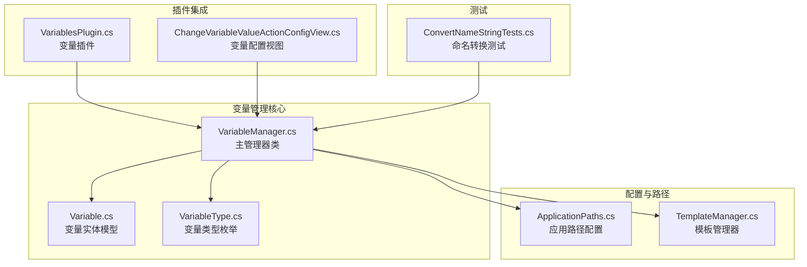
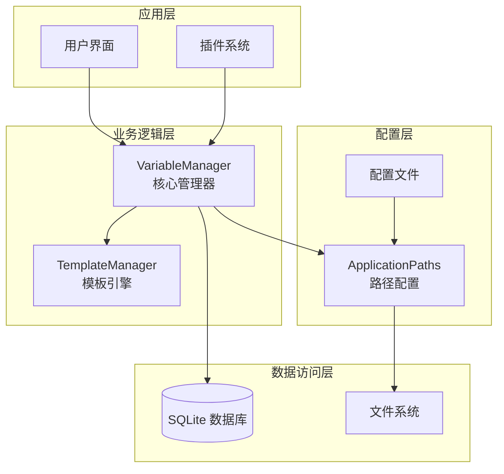
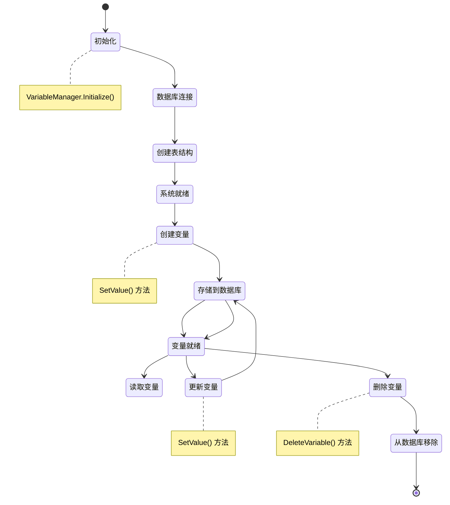
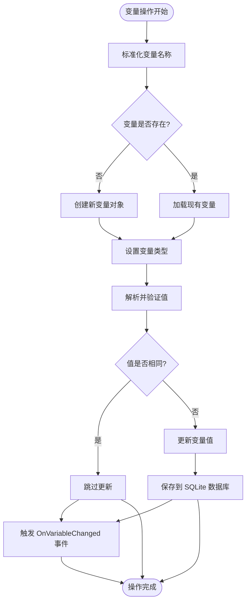
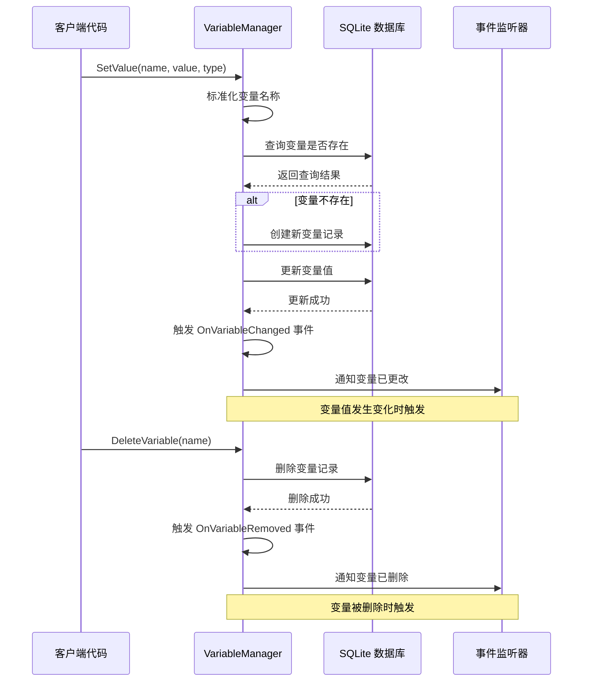
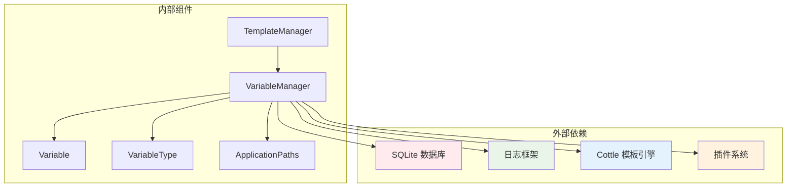

# 变量管理

<cite>
**本文档引用的文件**
- [VariableManager.cs](file://src/MacroDeck/Variables/VariableManager.cs)
- [Variable.cs](file://src/MacroDeck/Variables/Variable.cs)
- [VariableType.cs](file://src/MacroDeck/Variables/VariableType.cs)
- [ApplicationPaths.cs](file://src/MacroDeck/StartupConfig/ApplicationPaths.cs)
- [TemplateManager.cs](file://src/MacroDeck/CottleIntegration/TemplateManager.cs)
- [MacroDeck.cs](file://src/MacroDeck/MacroDeck.cs)
- [ConvertNameStringTests.cs](file://tests/MacroDeck.Tests/ConvertNameStringTests.cs)
- [VariablesPlugin.cs](file://src/MacroDeck/InternalPlugins/Variables/VariablesPlugin.cs)
- [ChangeVariableValueActionConfigView.cs](file://src/MacroDeck/InternalPlugins/Variables/Views/ChangeVariableValueActionConfigView.cs)
</cite>

## 目录
1. [简介](#简介)
2. [项目结构](#项目结构)
3. [核心组件](#核心组件)
4. [架构概览](#架构概览)
5. [详细组件分析](#详细组件分析)
6. [依赖关系分析](#依赖关系分析)
7. [性能考虑](#性能考虑)
8. [故障排除指南](#故障排除指南)
9. [结论](#结论)

## 简介

变量管理系统是 Macro Deck 平台的核心功能模块，负责管理应用程序中的动态数据变量。该系统提供了完整的变量生命周期管理，包括变量的创建、读取、更新和删除操作，支持多种数据类型，并集成了事件驱动的通知机制。

系统采用 SQLite 数据库存储所有变量数据，确保数据的持久性和可靠性。通过标准化的变量命名规则和德文字母转换机制，系统能够处理国际化输入并保持变量名称的一致性。

## 项目结构

变量管理系统主要包含以下核心文件：

**图表来源**
- [VariableManager.cs:1-249](file://src/MacroDeck/Variables/VariableManager.cs#L1-L249)
- [Variable.cs:1-16](file://src/MacroDeck/Variables/Variable.cs#L1-L16)
- [ApplicationPaths.cs:1-143](file://src/MacroDeck/StartupConfig/ApplicationPaths.cs#L1-L143)

**章节来源**
- [VariableManager.cs:1-249](file://src/MacroDeck/Variables/VariableManager.cs#L1-L249)
- [Variable.cs:1-16](file://src/MacroDeck/Variables/Variable.cs#L1-L16)
- [VariableType.cs:1-10](file://src/MacroDeck/Variables/VariableType.cs#L1-L10)

## 核心组件

### VariableManager 主管理器

VariableManager 是变量系统的核心静态类，提供所有变量操作的入口点。它负责：

- **数据库连接管理**：维护 SQLite 连接和表结构
- **变量 CRUD 操作**：创建、读取、更新、删除变量
- **命名规范化**：处理变量名称的标准化转换
- **事件通知**：在变量变更时触发相应的事件
- **类型转换**：根据指定类型安全地转换变量值

### Variable 实体模型

Variable 类定义了变量的数据结构，包含：

- **Name**：变量的唯一标识符（主键）
- **Value**：变量的实际存储值
- **Creator**：创建者标识（用户或插件名称）
- **Type**：变量类型（Integer、Float、String、Bool）
- **Suggestions**：可选的值建议列表

### VariableType 枚举

系统支持四种基本数据类型：
- **Integer**：整数值
- **Float**：浮点数值  
- **String**：字符串值
- **Bool**：布尔值

**章节来源**
- [VariableManager.cs:10-249](file://src/MacroDeck/Variables/VariableManager.cs#L10-L249)
- [Variable.cs:5-16](file://src/MacroDeck/Variables/Variable.cs#L5-L16)
- [VariableType.cs:3-9](file://src/MacroDeck/Variables/VariableType.cs#L3-L9)

## 架构概览

变量管理系统采用分层架构设计，确保了良好的模块分离和可扩展性：

**图表来源**
- [MacroDeck.cs:107](file://src/MacroDeck/MacroDeck.cs#L107)
- [VariableManager.cs:204-212](file://src/MacroDeck/Variables/VariableManager.cs#L204-L212)
- [ApplicationPaths.cs:58](file://src/MacroDeck/StartupConfig/ApplicationPaths.cs#L58)

系统启动流程中，VariableManager 在插件加载之前完成初始化，确保所有后续操作都有可用的变量存储。

**章节来源**
- [MacroDeck.cs:68-120](file://src/MacroDeck/MacroDeck.cs#L68-L120)
- [VariableManager.cs:204-212](file://src/MacroDeck/Variables/VariableManager.cs#L204-L212)

## 详细组件分析

### 变量生命周期管理

变量的完整生命周期从初始化开始，经过创建、使用、更新，最终可能被删除：

**图表来源**
- [VariableManager.cs:204-212](file://src/MacroDeck/Variables/VariableManager.cs#L204-L212)
- [VariableManager.cs:54-138](file://src/MacroDeck/Variables/VariableManager.cs#L54-L138)
- [VariableManager.cs:191-196](file://src/MacroDeck/Variables/VariableManager.cs#L191-L196)

### 变量存储机制

系统采用 SQLite 作为主要存储后端，结合文件系统进行数据持久化：

**图表来源**
- [VariableManager.cs:54-138](file://src/MacroDeck/Variables/VariableManager.cs#L54-L138)
- [VariableManager.cs:225-247](file://src/MacroDeck/Variables/VariableManager.cs#L225-L247)

**章节来源**
- [VariableManager.cs:204-212](file://src/MacroDeck/Variables/VariableManager.cs#L204-L212)
- [ApplicationPaths.cs:58](file://src/MacroDeck/StartupConfig/ApplicationPaths.cs#L58)

### 变量命名规则和名称转换

系统实现了智能的变量命名规范化机制，确保变量名称的一致性和兼容性：

**图表来源**
- [VariableManager.cs:225-247](file://src/MacroDeck/Variables/VariableManager.cs#L225-L247)
- [ConvertNameStringTests.cs:28-37](file://tests/MacroDeck.Tests/ConvertNameStringTests.cs#L28-L37)

**章节来源**
- [VariableManager.cs:225-247](file://src/MacroDeck/Variables/VariableManager.cs#L225-L247)
- [ConvertNameStringTests.cs:10-38](file://tests/MacroDeck.Tests/ConvertNameStringTests.cs#L10-L38)

### 变量操作 API 接口详解

#### SetValue 方法族

系统提供了多个重载的 SetValue 方法，满足不同的使用场景：

| 方法签名 | 参数 | 返回值 | 描述 |
|---------|------|--------|------|
| `SetValue(name, value, type, creator)` | 名称、值、类型、创建者 | 变量对象 | 基础设置方法 |
| `SetValue(name, value, type, suggestions, creator)` | 名称、值、类型、建议、创建者 | 变量对象 | 支持值建议 |
| `SetValue(name, value, type, plugin, suggestions)` | 名称、值、类型、插件实例、建议 | void | 插件专用方法 |

**章节来源**
- [VariableManager.cs:54-185](file://src/MacroDeck/Variables/VariableManager.cs#L54-L185)

#### GetValue 方法族

系统提供了灵活的变量获取方法：

| 方法签名 | 参数 | 返回值 | 描述 |
|---------|------|--------|------|
| `GetVariables(macroDeckPlugin)` | 插件实例 | 变量列表 | 获取特定插件的所有变量 |
| `GetVariable(macroDeckPlugin, variableName)` | 插件实例、变量名 | 变量对象 | 获取特定变量 |

**章节来源**
- [VariableManager.cs:29-42](file://src/MacroDeck/Variables/VariableManager.cs#L29-L42)

#### DeleteVariable 方法

删除变量的单一方法：
- **参数**：变量名称
- **行为**：从数据库中删除对应记录并触发删除事件
- **返回值**：无

**章节来源**
- [VariableManager.cs:191-196](file://src/MacroDeck/Variables/VariableManager.cs#L191-L196)

### 变量事件系统

系统实现了基于事件驱动的通知机制，支持实时响应变量变化：

**图表来源**
- [VariableManager.cs:16](file://src/MacroDeck/Variables/VariableManager.cs#L16)
- [VariableManager.cs:54-138](file://src/MacroDeck/Variables/VariableManager.cs#L54-L138)
- [VariableManager.cs:191-196](file://src/MacroDeck/Variables/VariableManager.cs#L191-L196)

**章节来源**
- [VariableManager.cs:16](file://src/MacroDeck/Variables/VariableManager.cs#L16)
- [VariableManager.cs:54-138](file://src/MacroDeck/Variables/VariableManager.cs#L54-L138)
- [VariableManager.cs:191-196](file://src/MacroDeck/Variables/VariableManager.cs#L191-L196)

### 变量作用域和权限控制

系统通过 Creator 字段实现基本的作用域控制：

- **用户变量**：Creator = "User"，仅用户可见
- **插件变量**：Creator = 插件名称，仅对应插件可见
- **查询过滤**：GetVariables 方法按 Creator 进行过滤

这种设计确保了不同来源的变量不会相互干扰，同时允许插件安全地管理自己的变量。

**章节来源**
- [VariableManager.cs:29-42](file://src/MacroDeck/Variables/VariableManager.cs#L29-L42)
- [Variable.cs:8-10](file://src/MacroDeck/Variables/Variable.cs#L8-L10)

## 依赖关系分析

变量管理系统与其他组件的依赖关系如下：

**图表来源**
- [VariableManager.cs:1-6](file://src/MacroDeck/Variables/VariableManager.cs#L1-L6)
- [TemplateManager.cs:111-123](file://src/MacroDeck/CottleIntegration/TemplateManager.cs#L111-L123)

**章节来源**
- [VariableManager.cs:1-6](file://src/MacroDeck/Variables/VariableManager.cs#L1-L6)
- [TemplateManager.cs:111-123](file://src/MacroDeck/CottleIntegration/TemplateManager.cs#L111-L123)

## 性能考虑

### 数据库优化策略

1. **索引优化**：Name 字段作为主键，提供 O(log n) 的查找性能
2. **批量操作**：使用 TableQuery 进行高效的数据库查询
3. **连接池**：单例模式确保数据库连接的复用

### 内存管理

1. **延迟加载**：Suggestions 属性标记为 Ignore，避免不必要的序列化开销
2. **类型转换缓存**：避免重复的类型转换操作
3. **事件订阅管理**：合理管理事件监听器的注册和注销

### 最佳实践建议

1. **命名规范**：始终使用 ConvertNameString 方法标准化变量名称
2. **类型安全**：明确指定 VariableType，避免隐式类型转换
3. **错误处理**：捕获并记录数据库操作异常
4. **资源清理**：在应用关闭时调用 Close 方法释放数据库连接

## 故障排除指南

### 常见问题及解决方案

#### 变量名称冲突

**问题**：多个变量名称在标准化后相同
**解决方案**：使用 ConvertNameString 方法确保名称唯一性

#### 类型转换失败

**问题**：SetValue 无法将字符串转换为指定类型
**解决方案**：检查输入格式，系统会自动回退到默认值

#### 数据库连接问题

**问题**：SQLite 数据库文件损坏
**解决方案**：重新初始化变量数据库或检查文件权限

**章节来源**
- [VariableManager.cs:126-133](file://src/MacroDeck/Variables/VariableManager.cs#L126-L133)
- [VariableManager.cs:204-212](file://src/MacroDeck/Variables/VariableManager.cs#L204-L212)

## 结论

变量管理系统为 Macro Deck 提供了强大而灵活的数据管理能力。通过 SQLite 持久化存储、智能的命名规范化、完善的事件驱动机制，以及清晰的 API 设计，系统能够满足各种复杂的变量管理需求。

系统的主要优势包括：
- **可靠性**：基于 SQLite 的持久化存储确保数据安全
- **易用性**：简洁的 API 设计降低使用复杂度
- **扩展性**：插件友好的架构支持第三方扩展
- **国际化**：德文字母转换支持多语言环境

开发者可以基于此系统构建丰富的自动化功能，同时享受系统提供的完整生命周期管理和事件通知机制。