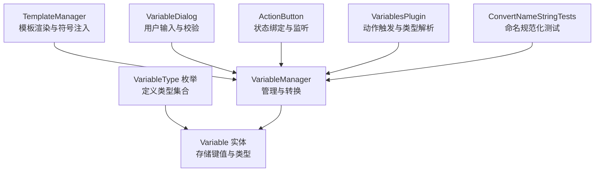
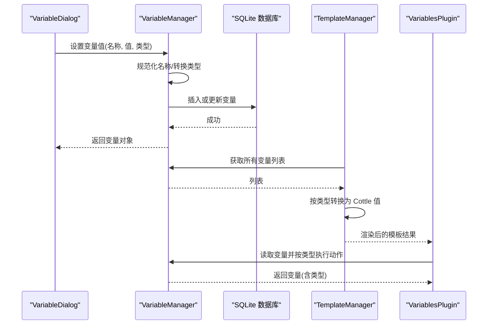
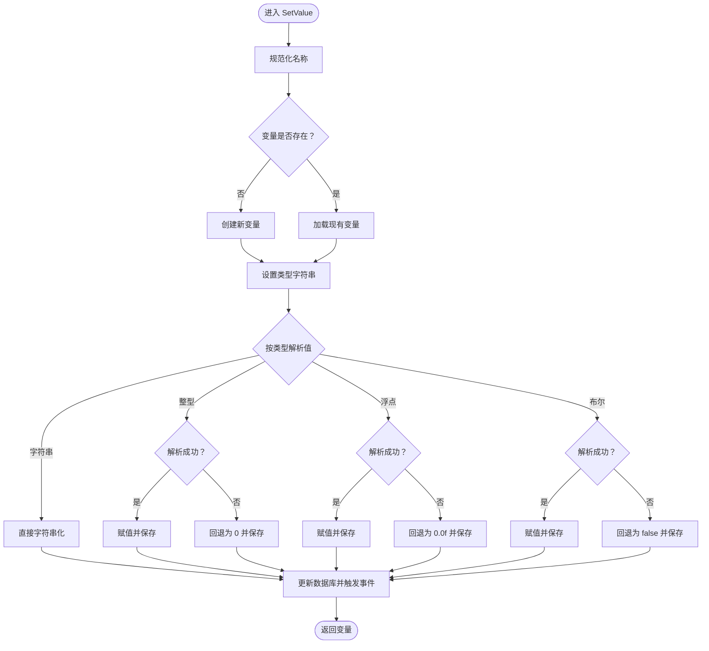
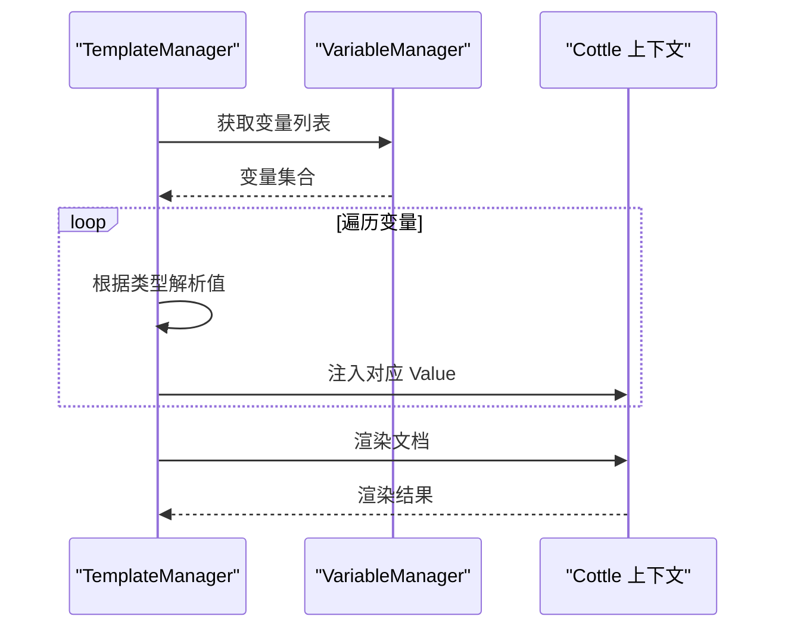
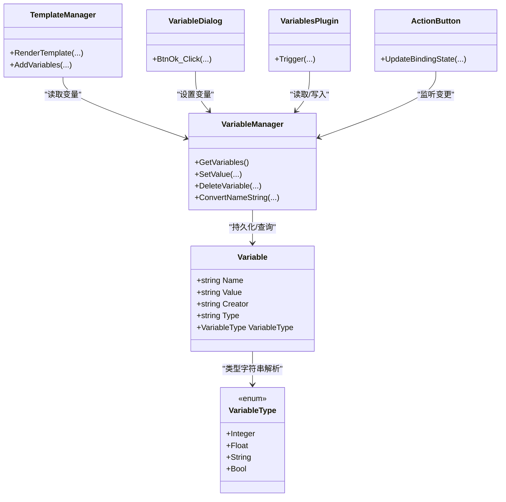

# 变量类型系统

<cite>
**本文引用的文件**
- [VariableType.cs](file://src/MacroDeck/Variables/VariableType.cs)
- [Variable.cs](file://src/MacroDeck/Variables/Variable.cs)
- [VariableManager.cs](file://src/MacroDeck/Variables/VariableManager.cs)
- [TemplateManager.cs](file://src/MacroDeck/CottleIntegration/TemplateManager.cs)
- [VariableDialog.cs](file://src/MacroDeck/GUI/Dialogs/VariableDialog.cs)
- [ActionButton.cs](file://src/MacroDeck/ActionButton/ActionButton.cs)
- [VariablesPlugin.cs](file://src/MacroDeck/InternalPlugins/Variables/VariablesPlugin.cs)
- [ConvertNameStringTests.cs](file://tests/MacroDeck.Tests/ConvertNameStringTests.cs)
</cite>

## 目录
1. [引言](#引言)
2. [项目结构](#项目结构)
3. [核心组件](#核心组件)
4. [架构总览](#架构总览)
5. [详细组件分析](#详细组件分析)
6. [依赖关系分析](#依赖关系分析)
7. [性能考虑](#性能考虑)
8. [故障排除指南](#故障排除指南)
9. [结论](#结论)
10. [附录](#附录)

## 引言
本文件系统性地阐述 Macro Deck 的变量类型系统，围绕 VariableType 枚举所定义的数据类型（整型、浮点、字符串、布尔），解释其存储格式、数据验证规则、类型转换机制（含自动类型推断与手动类型指定）、文化敏感性（小数点分隔符）处理、类型安全实践、复合类型设计思路与扩展方向，以及与模板系统的集成方式与上下文差异。同时提供类型选择指南与使用建议，帮助开发者在不同场景下正确、安全地使用变量类型。

## 项目结构
变量类型系统主要由以下模块构成：
- 变量类型定义：VariableType 枚举
- 变量实体模型：Variable 类
- 变量管理与持久化：VariableManager 静态类
- 模板系统集成：TemplateManager
- 用户界面交互：VariableDialog
- 使用示例与事件绑定：ActionButton、VariablesPlugin
- 单元测试：ConvertNameStringTests

图表来源
- [VariableType.cs:1-10](file://src/MacroDeck/Variables/VariableType.cs#L1-L10)
- [Variable.cs:1-16](file://src/MacroDeck/Variables/Variable.cs#L1-L16)
- [VariableManager.cs:1-249](file://src/MacroDeck/Variables/VariableManager.cs#L1-L249)
- [TemplateManager.cs:1-181](file://src/MacroDeck/CottleIntegration/TemplateManager.cs#L1-L181)
- [VariableDialog.cs:1-142](file://src/MacroDeck/GUI/Dialogs/VariableDialog.cs#L1-L142)
- [ActionButton.cs:1-198](file://src/MacroDeck/ActionButton/ActionButton.cs#L1-L198)
- [VariablesPlugin.cs:156-220](file://src/MacroDeck/InternalPlugins/Variables/VariablesPlugin.cs#L156-L220)
- [ConvertNameStringTests.cs:1-38](file://tests/MacroDeck.Tests/ConvertNameStringTests.cs#L1-L38)

章节来源
- [VariableType.cs:1-10](file://src/MacroDeck/Variables/VariableType.cs#L1-L10)
- [Variable.cs:1-16](file://src/MacroDeck/Variables/Variable.cs#L1-L16)
- [VariableManager.cs:1-249](file://src/MacroDeck/Variables/VariableManager.cs#L1-L249)
- [TemplateManager.cs:1-181](file://src/MacroDeck/CottleIntegration/TemplateManager.cs#L1-L181)
- [VariableDialog.cs:1-142](file://src/MacroDeck/GUI/Dialogs/VariableDialog.cs#L1-L142)
- [ActionButton.cs:1-198](file://src/MacroDeck/ActionButton/ActionButton.cs#L1-L198)
- [VariablesPlugin.cs:156-220](file://src/MacroDeck/InternalPlugins/Variables/VariablesPlugin.cs#L156-L220)
- [ConvertNameStringTests.cs:1-38](file://tests/MacroDeck.Tests/ConvertNameStringTests.cs#L1-L38)

## 核心组件
- VariableType：定义了四种基础类型枚举值，作为变量的静态类型标识。
- Variable：SQLite 映射实体，包含名称、字符串值、创建者、类型字符串及运行时类型解析属性。
- VariableManager：负责变量的创建、更新、删除、命名规范化、类型转换与持久化；提供事件通知。
- TemplateManager：将变量注入到模板符号表，按类型转换为 Cottle Value，并参与模板渲染。
- VariableDialog：图形界面用于创建/编辑变量，进行基础类型与值的校验。
- ActionButton：监听变量变化并基于布尔值更新按钮状态。
- VariablesPlugin：具体动作插件，演示如何读取变量类型并执行相应操作。

章节来源
- [VariableType.cs:1-10](file://src/MacroDeck/Variables/VariableType.cs#L1-L10)
- [Variable.cs:1-16](file://src/MacroDeck/Variables/Variable.cs#L1-L16)
- [VariableManager.cs:1-249](file://src/MacroDeck/Variables/VariableManager.cs#L1-L249)
- [TemplateManager.cs:1-181](file://src/MacroDeck/CottleIntegration/TemplateManager.cs#L1-L181)
- [VariableDialog.cs:1-142](file://src/MacroDeck/GUI/Dialogs/VariableDialog.cs#L1-L142)
- [ActionButton.cs:1-198](file://src/MacroDeck/ActionButton/ActionButton.cs#L1-L198)
- [VariablesPlugin.cs:156-220](file://src/MacroDeck/InternalPlugins/Variables/VariablesPlugin.cs#L156-L220)

## 架构总览
变量类型系统通过“类型枚举 + 字符串存储 + 运行时解析”的模式实现类型安全与灵活性的平衡。VariableManager 负责类型转换与持久化，TemplateManager 将变量注入模板引擎，UI 层负责输入校验与默认值提示，插件层负责业务逻辑与触发。

图表来源
- [VariableDialog.cs:46-94](file://src/MacroDeck/GUI/Dialogs/VariableDialog.cs#L46-L94)
- [VariableManager.cs:54-138](file://src/MacroDeck/Variables/VariableManager.cs#L54-L138)
- [TemplateManager.cs:90-124](file://src/MacroDeck/CottleIntegration/TemplateManager.cs#L90-L124)
- [VariablesPlugin.cs:162-205](file://src/MacroDeck/InternalPlugins/Variables/VariablesPlugin.cs#L162-L205)

## 详细组件分析

### VariableType 枚举与类型特性
- Integer：整型，适合计数、索引等离散数值。
- Float：浮点型，适合度量、百分比、科学计算等连续数值。
- String：字符串，适合文本、路径、标识符等非数值数据。
- Bool：布尔型，适合开关、状态标志等二值逻辑。

这些类型作为静态标识，配合 VariableManager 的转换逻辑与 TemplateManager 的符号注入，形成统一的类型体系。

章节来源
- [VariableType.cs:1-10](file://src/MacroDeck/Variables/VariableType.cs#L1-L10)

### Variable 实体与存储格式
- 存储字段：名称、字符串值、创建者、类型字符串。
- 运行时解析：通过类型字符串反向解析为枚举值，便于 UI 与业务逻辑识别。
- 建议：值统一以字符串形式持久化，避免跨平台/文化差异导致的序列化问题。

章节来源
- [Variable.cs:1-16](file://src/MacroDeck/Variables/Variable.cs#L1-L16)

### VariableManager：类型转换与文化敏感性
- 名称规范化：统一转小写、替换空格与特殊字符为下划线、德文字母转写。
- 类型转换：
  - Integer：使用整型解析，失败回退为 0。
  - Float：使用当前文化的小数点分隔符进行解析，失败回退为 0.0f。
  - Bool：尝试布尔解析，兼容“On/Off”到“True/False”的映射，失败回退为 false。
  - String：直接字符串化。
- 错误处理：更新数据库失败时记录日志并继续流程。
- 事件：变量变更与删除事件，供 UI 与业务监听。

图表来源
- [VariableManager.cs:54-138](file://src/MacroDeck/Variables/VariableManager.cs#L54-L138)
- [VariableManager.cs:94-124](file://src/MacroDeck/Variables/VariableManager.cs#L94-L124)

章节来源
- [VariableManager.cs:54-138](file://src/MacroDeck/Variables/VariableManager.cs#L54-L138)
- [VariableManager.cs:225-249](file://src/MacroDeck/Variables/VariableManager.cs#L225-L249)

### TemplateManager：模板集成与类型注入
- 符号注入：遍历变量列表，按类型转换为 Cottle Value。
- 类型映射：
  - Bool：布尔解析，兼容“On/Off”，否则为 false。
  - Float/Integer：数值解析，失败为 0。
  - String：直接字符串。
- 渲染：捕获异常并返回错误信息，保证模板渲染健壮性。

图表来源
- [TemplateManager.cs:90-124](file://src/MacroDeck/CottleIntegration/TemplateManager.cs#L90-L124)
- [VariableManager.cs:26-42](file://src/MacroDeck/Variables/VariableManager.cs#L26-L42)

章节来源
- [TemplateManager.cs:90-124](file://src/MacroDeck/CottleIntegration/TemplateManager.cs#L90-L124)

### UI 与输入校验：VariableDialog
- 类型选择：根据选中类型预置默认值（布尔/整数/浮点/字符串）。
- 输入校验：在确认时按类型进行基本解析与赋值，保护受保护变量（非用户创建）不可编辑。
- 与管理器协作：调用 VariableManager.SetValue 完成持久化。

章节来源
- [VariableDialog.cs:71-94](file://src/MacroDeck/GUI/Dialogs/VariableDialog.cs#L71-L94)
- [VariableDialog.cs:123-140](file://src/MacroDeck/GUI/Dialogs/VariableDialog.cs#L123-L140)

### 使用示例：ActionButton 与 VariablesPlugin
- ActionButton：监听变量变更事件，基于布尔值更新按钮状态；兼容“On/Off”字符串。
- VariablesPlugin：根据配置读取变量，按变量类型执行自增、自减、设置、切换等动作；在模板渲染后写回变量。

章节来源
- [ActionButton.cs:80-107](file://src/MacroDeck/ActionButton/ActionButton.cs#L80-L107)
- [VariablesPlugin.cs:162-205](file://src/MacroDeck/InternalPlugins/Variables/VariablesPlugin.cs#L162-L205)

### 命名规范化与文化敏感性
- 命名规范化：小写化、空格与特殊字符替换为下划线、德文字母转写。
- 文化敏感性：浮点解析使用当前文化的小数点分隔符，确保多语言环境下的正确解析。

章节来源
- [VariableManager.cs:225-249](file://src/MacroDeck/Variables/VariableManager.cs#L225-L249)
- [VariableManager.cs:94-107](file://src/MacroDeck/Variables/VariableManager.cs#L94-L107)
- [ConvertNameStringTests.cs:1-38](file://tests/MacroDeck.Tests/ConvertNameStringTests.cs#L1-L38)

## 依赖关系分析
- VariableType → Variable：类型标识
- Variable → VariableManager：运行时类型解析
- VariableManager → SQLite：持久化
- TemplateManager → VariableManager：读取变量并注入符号
- UI（VariableDialog）→ VariableManager：设置变量
- 插件（VariablesPlugin）→ VariableManager：读取/写入变量
- ActionButton → VariableManager：监听变量变更

图表来源
- [VariableType.cs:1-10](file://src/MacroDeck/Variables/VariableType.cs#L1-L10)
- [Variable.cs:1-16](file://src/MacroDeck/Variables/Variable.cs#L1-L16)
- [VariableManager.cs:1-249](file://src/MacroDeck/Variables/VariableManager.cs#L1-L249)
- [TemplateManager.cs:1-181](file://src/MacroDeck/CottleIntegration/TemplateManager.cs#L1-L181)
- [VariableDialog.cs:1-142](file://src/MacroDeck/GUI/Dialogs/VariableDialog.cs#L1-L142)
- [ActionButton.cs:1-198](file://src/MacroDeck/ActionButton/ActionButton.cs#L1-L198)
- [VariablesPlugin.cs:156-220](file://src/MacroDeck/InternalPlugins/Variables/VariablesPlugin.cs#L156-L220)

章节来源
- [VariableType.cs:1-10](file://src/MacroDeck/Variables/VariableType.cs#L1-L10)
- [Variable.cs:1-16](file://src/MacroDeck/Variables/Variable.cs#L1-L16)
- [VariableManager.cs:1-249](file://src/MacroDeck/Variables/VariableManager.cs#L1-L249)
- [TemplateManager.cs:1-181](file://src/MacroDeck/CottleIntegration/TemplateManager.cs#L1-L181)
- [VariableDialog.cs:1-142](file://src/MacroDeck/GUI/Dialogs/VariableDialog.cs#L1-L142)
- [ActionButton.cs:1-198](file://src/MacroDeck/ActionButton/ActionButton.cs#L1-L198)
- [VariablesPlugin.cs:156-220](file://src/MacroDeck/InternalPlugins/Variables/VariablesPlugin.cs#L156-L220)

## 性能考虑
- 解析与回退：整型/浮点/布尔解析失败均快速回退为默认值，避免异常开销。
- 文化解析：浮点解析使用当前文化的小数点分隔符，减少字符串替换成本。
- 模板渲染：捕获异常并返回错误信息，避免模板渲染阻塞。
- 建议：批量操作时合并数据库更新，减少 IO 次数；对高频变量访问可引入内存缓存（需注意与持久化的同步）。

## 故障排除指南
- 浮点解析失败：检查输入是否符合当前文化的小数点分隔符；必要时显式指定类型为 Float。
- 布尔解析失败：确认输入是否为“On/Off”或“True/False”；系统会进行大小写不敏感映射。
- 名称冲突：使用命名规范化函数；避免特殊字符与保留字。
- 模板渲染报错：检查变量名与类型一致性；查看异常信息定位具体变量。
- 权限问题：受保护变量（非用户创建）无法在 UI 中编辑，需通过插件或 API 修改。

章节来源
- [VariableManager.cs:126-133](file://src/MacroDeck/Variables/VariableManager.cs#L126-L133)
- [TemplateManager.cs:76-87](file://src/MacroDeck/CottleIntegration/TemplateManager.cs#L76-L87)
- [VariableDialog.cs:36-39](file://src/MacroDeck/GUI/Dialogs/VariableDialog.cs#L36-L39)

## 结论
该变量类型系统以简洁的枚举与字符串存储为基础，结合运行时解析与模板注入，实现了跨上下文的一致性与可扩展性。通过严格的输入校验、文化敏感性处理与错误恢复策略，系统在易用性与稳定性之间取得良好平衡。未来可在复合类型、数组/对象支持与更丰富的类型转换函数方面进一步扩展。

## 附录

### 类型选择指南
- 整型（Integer）：计数、索引、状态码等离散数值。
- 浮点（Float）：比例、温度、百分比等连续数值；注意文化分隔符。
- 字符串（String）：文本、路径、标识符；无需解析。
- 布尔（Bool）：开关、状态标志；支持“On/Off”与“True/False”。

### 使用示例要点
- UI 创建：通过 VariableDialog 选择类型并设置默认值，再调用 VariableManager.SetValue。
- 模板使用：TemplateManager 自动注入变量，按类型转换为 Cottle 值。
- 动作触发：VariablesPlugin 读取变量类型并执行相应逻辑，必要时先渲染模板再写回。