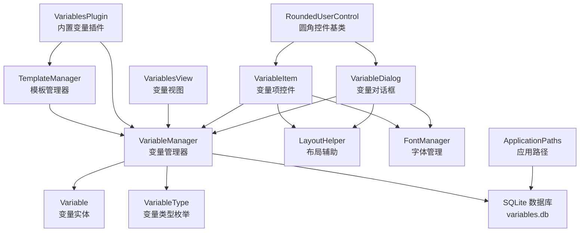
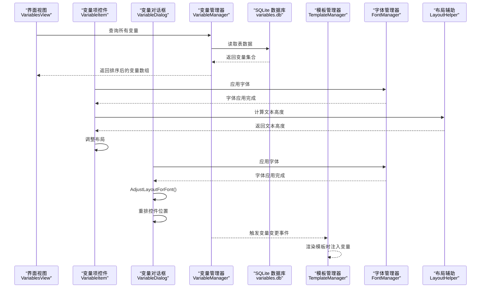
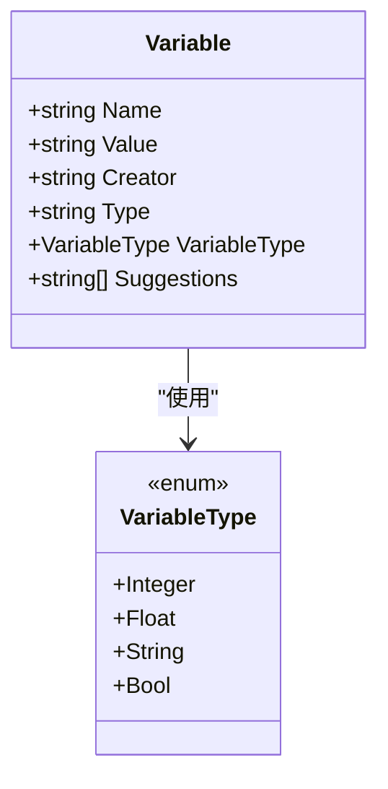
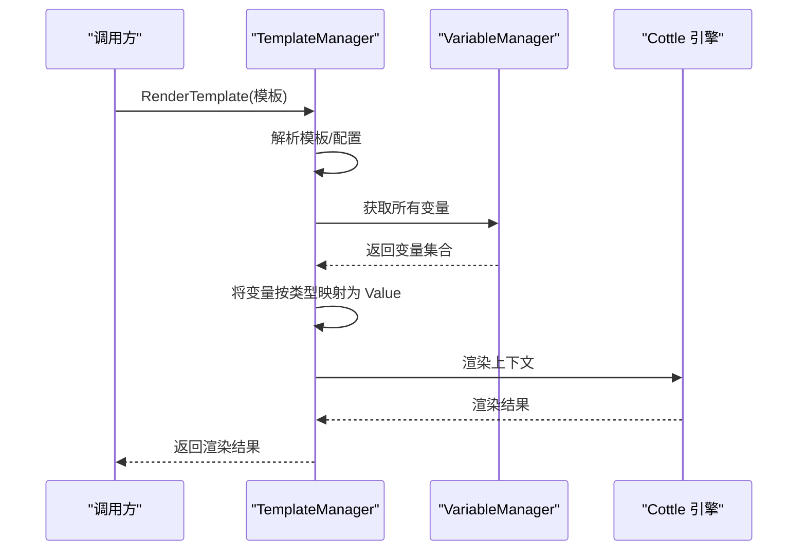
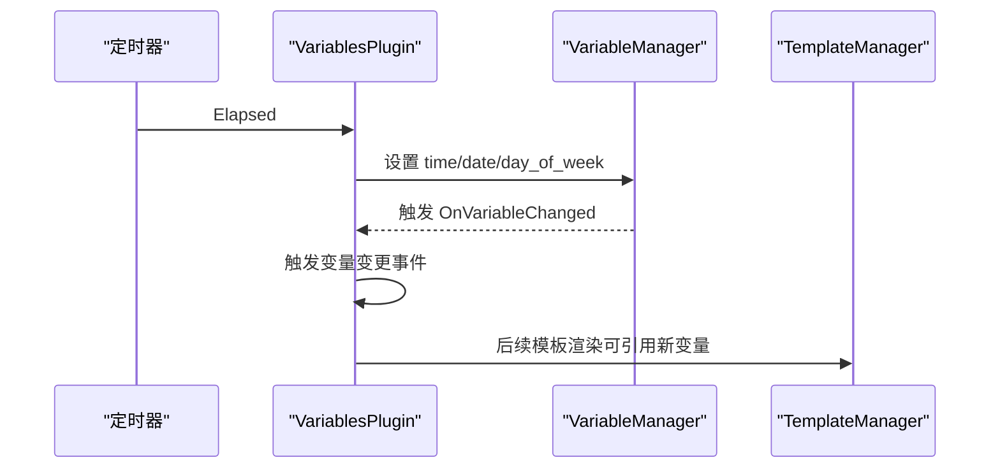
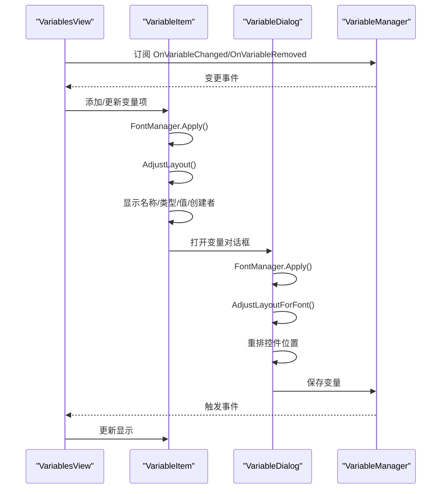
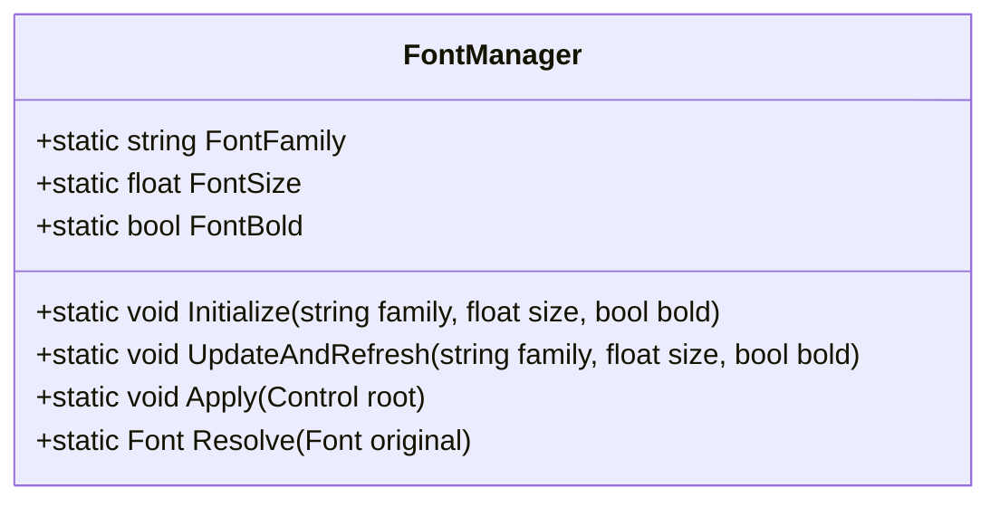
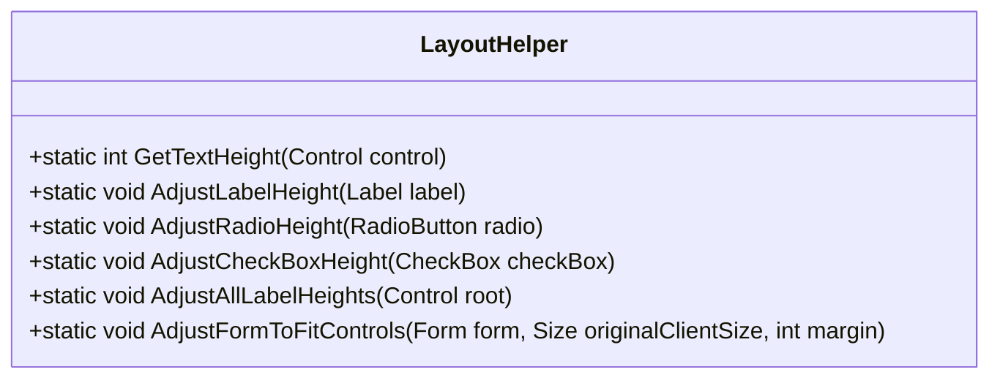
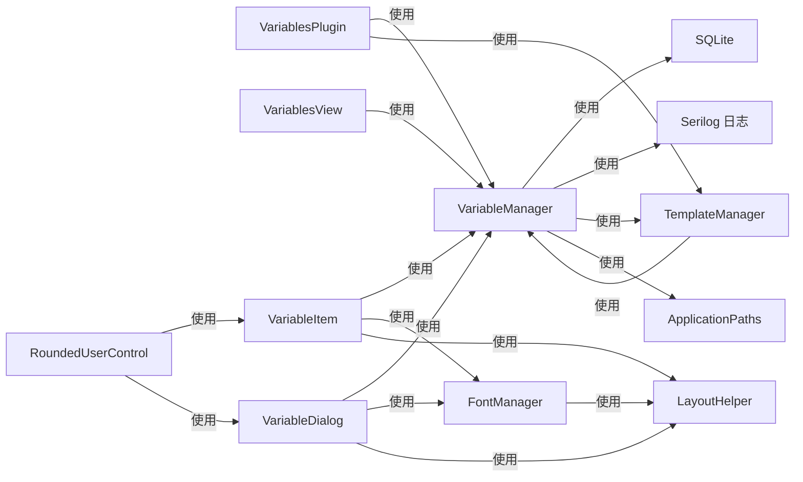

# 变量系统

<cite>
**本文引用的文件**
- [Variable.cs](file://src/MacroDeck/Variables/Variable.cs)
- [VariableManager.cs](file://src/MacroDeck/Variables/VariableManager.cs)
- [VariableType.cs](file://src/MacroDeck/Variables/VariableType.cs)
- [VariablesPlugin.cs](file://src/MacroDeck/InternalPlugins/Variables/VariablesPlugin.cs)
- [TemplateManager.cs](file://src/MacroDeck/CottleIntegration/TemplateManager.cs)
- [ChangeVariableMethod.cs](file://src/MacroDeck/InternalPlugins/Variables/Enums/ChangeVariableMethod.cs)
- [ChangeVariableValueActionConfigModel.cs](file://src/MacroDeck/InternalPlugins/Variables/Models/ChangeVariableValueActionConfigModel.cs)
- [SaveVariableToFileActionConfigModel.cs](file://src/MacroDeck/InternalPlugins/Variables/Models/SaveVariableToFileActionConfigModel.cs)
- [ReadVariableFromFileActionConfigModel.cs](file://src/MacroDeck/InternalPlugins/Variables/Models/ReadVariableFromFileActionConfigModel.cs)
- [VariableItem.cs](file://src/MacroDeck/GUI/CustomControls/Variables/VariableItem.cs)
- [VariableItem.Designer.cs](file://src/MacroDeck/GUI/CustomControls/Variables/VariableItem.Designer.cs)
- [VariableDialog.cs](file://src/MacroDeck/GUI/Dialogs/VariableDialog.cs)
- [VariableDialog.Designer.cs](file://src/MacroDeck/GUI/Dialogs/VariableDialog.Designer.cs)
- [VariablesView.cs](file://src/MacroDeck/GUI/MainWindowViews/VariablesView.cs)
- [ApplicationPaths.cs](file://src/MacroDeck/StartupConfig/ApplicationPaths.cs)
- [LayoutHelper.cs](file://src/MacroDeck/Utils/LayoutHelper.cs)
- [FontManager.cs](file://src/MacroDeck/Utils/FontManager.cs)
- [RoundedUserControl.cs](file://src/MacroDeck/GUI/CustomControls/RoundedUserControl.cs)
</cite>

## 更新摘要
**变更内容**
- 新增 VariableItem 控件的动态布局调整功能，支持根据当前字体和父容器宽度自适应布局
- 新增 VariableDialog 对话框的字体自适应布局计算，支持根据当前字体动态调整控件高度和间距
- 增强字体管理系统，通过 FontManager 和 LayoutHelper 提供统一的字体自适应能力
- 优化变量列表显示效果，确保在不同字体设置下保持良好的视觉一致性

## 目录
1. [简介](#简介)
2. [项目结构](#项目结构)
3. [核心组件](#核心组件)
4. [架构总览](#架构总览)
5. [详细组件分析](#详细组件分析)
6. [字体自适应系统](#字体自适应系统)
7. [依赖关系分析](#依赖关系分析)
8. [性能考量](#性能考量)
9. [故障排查指南](#故障排查指南)
10. [结论](#结论)
11. [附录](#附录)

## 简介
本文件系统性地阐述 Macro-Deck 的变量系统：变量的创建与管理、变量类型体系、模板渲染机制、生命周期与作用域、持久化策略，以及与内部插件、模板引擎、界面视图的集成方式。特别关注最新的字体自适应功能，包括 VariableItem 控件的动态布局调整和 VariableDialog 对话框的字体自适应布局计算。同时给出面向使用者的操作指南与面向开发者的扩展接口说明。

## 项目结构
变量系统主要由以下模块构成：
- 数据模型层：Variable（变量实体）、VariableType（变量类型枚举）
- 管理层：VariableManager（变量的增删改查、事件、命名规范化、数据库初始化）
- 模板层：TemplateManager（Cottle 模板解析与变量注入）
- 插件层：VariablesPlugin（内置变量插件，提供时间日期变量、变更事件、文件读写动作）
- 视图层：VariablesView、VariableItem（变量列表与条目控件）、VariableDialog（变量编辑对话框）
- 字体自适应层：FontManager（字体管理）、LayoutHelper（布局辅助）、RoundedUserControl（圆角控件基类）
- 配置与路径：ApplicationPaths（变量数据库文件路径等）

**图表来源**
- [VariableManager.cs:10-248](file://src/MacroDeck/Variables/VariableManager.cs#L10-L248)
- [Variable.cs:5-15](file://src/MacroDeck/Variables/Variable.cs#L5-L15)
- [VariableType.cs:3-9](file://src/MacroDeck/Variables/VariableType.cs#L3-L9)
- [TemplateManager.cs:8-180](file://src/MacroDeck/CottleIntegration/TemplateManager.cs#L8-L180)
- [VariablesPlugin.cs:22-318](file://src/MacroDeck/InternalPlugins/Variables/VariablesPlugin.cs#L22-L318)
- [VariablesView.cs:10-171](file://src/MacroDeck/GUI/MainWindowViews/VariablesView.cs#L10-L171)
- [VariableItem.cs:6-37](file://src/MacroDeck/GUI/CustomControls/Variables/VariableItem.cs#L6-L37)
- [VariableDialog.cs:9-201](file://src/MacroDeck/GUI/Dialogs/VariableDialog.cs#L9-L201)
- [LayoutHelper.cs:13-105](file://src/MacroDeck/Utils/LayoutHelper.cs#L13-L105)
- [FontManager.cs:16-227](file://src/MacroDeck/Utils/FontManager.cs#L16-227)
- [RoundedUserControl.cs:9-87](file://src/MacroDeck/GUI/CustomControls/RoundedUserControl.cs#L9-L87)
- [ApplicationPaths.cs:25](file://src/MacroDeck/StartupConfig/ApplicationPaths.cs#L25)

**章节来源**
- [VariableManager.cs:10-248](file://src/MacroDeck/Variables/VariableManager.cs#L10-L248)
- [ApplicationPaths.cs:25](file://src/MacroDeck/StartupConfig/ApplicationPaths.cs#L25)

## 核心组件
- Variable（变量实体）：包含名称、值、创建者、类型字段，并暴露可序列化的类型枚举与建议值数组。
- VariableType（变量类型）：整数、浮点、字符串、布尔四类。
- VariableManager（变量管理器）：负责变量的查询、插入、设置值、删除、事件通知、数据库初始化与命名规范化。
- TemplateManager（模板管理器）：将变量注入到 Cottle 上下文，支持模板渲染与关键字提示。
- VariablesPlugin（内置变量插件）：提供时间/日期变量、变量变更事件、变量与文件互转的动作。
- 视图组件：VariablesView、VariableItem、VariableDialog 提供变量列表、编辑入口和字体自适应布局。
- 字体自适应系统：FontManager（字体管理）、LayoutHelper（布局辅助）、RoundedUserControl（圆角控件基类）。

**章节来源**
- [Variable.cs:5-15](file://src/MacroDeck/Variables/Variable.cs#L5-L15)
- [VariableType.cs:3-9](file://src/MacroDeck/Variables/VariableType.cs#L3-L9)
- [VariableManager.cs:10-248](file://src/MacroDeck/Variables/VariableManager.cs#L10-L248)
- [TemplateManager.cs:8-180](file://src/MacroDeck/CottleIntegration/TemplateManager.cs#L8-L180)
- [VariablesPlugin.cs:22-318](file://src/MacroDeck/InternalPlugins/Variables/VariablesPlugin.cs#L22-L318)
- [VariablesView.cs:10-171](file://src/MacroDeck/GUI/MainWindowViews/VariablesView.cs#L10-L171)
- [VariableItem.cs:6-37](file://src/MacroDeck/GUI/CustomControls/Variables/VariableItem.cs#L6-L37)
- [VariableDialog.cs:9-201](file://src/MacroDeck/GUI/Dialogs/VariableDialog.cs#L9-L201)
- [LayoutHelper.cs:13-105](file://src/MacroDeck/Utils/LayoutHelper.cs#L13-L105)
- [FontManager.cs:16-227](file://src/MacroDeck/Utils/FontManager.cs#L16-227)
- [RoundedUserControl.cs:9-87](file://src/MacroDeck/GUI/CustomControls/RoundedUserControl.cs#L9-L87)

## 架构总览
变量系统采用"内存中以字典形式访问变量"的思路，底层通过 SQLite 存储；模板系统在渲染时将变量注入上下文，实现动态内容生成。插件通过管理器进行变量读写与事件订阅，界面负责展示与交互。最新版本增强了字体自适应能力，确保在不同字体设置下保持良好的用户体验。

**图表来源**
- [VariableManager.cs:23-138](file://src/MacroDeck/Variables/VariableManager.cs#L23-L138)
- [TemplateManager.cs:59-88](file://src/MacroDeck/CottleIntegration/TemplateManager.cs#L59-L88)
- [VariablesView.cs:143-160](file://src/MacroDeck/GUI/MainWindowViews/VariablesView.cs#L143-L160)
- [VariableItem.cs:27-31](file://src/MacroDeck/GUI/CustomControls/Variables/VariableItem.cs#L27-L31)
- [VariableItem.cs:42-79](file://src/MacroDeck/GUI/CustomControls/Variables/VariableItem.cs#L42-L79)
- [VariableDialog.cs:50-55](file://src/MacroDeck/GUI/Dialogs/VariableDialog.cs#L50-L55)
- [VariableDialog.cs:63-98](file://src/MacroDeck/GUI/Dialogs/VariableDialog.cs#L63-L98)
- [FontManager.cs:152-186](file://src/MacroDeck/Utils/FontManager.cs#L152-186)
- [LayoutHelper.cs:18-20](file://src/MacroDeck/Utils/LayoutHelper.cs#L18-20)

## 详细组件分析

### Variable 类（变量实体）
- 字段与行为
  - 名称：主键，唯一标识变量
  - 值：字符串存储，实际类型由类型字段决定
  - 创建者：标识变量来源（用户或插件）
  - 类型：字符串表示类型枚举，运行时转换为枚举
  - 建议值：用于 UI 自动补全
- 设计要点
  - 使用 SQLite 特定属性标注主键与忽略字段
  - 类型转换在运行时完成，便于统一存储与模板注入

**图表来源**
- [Variable.cs:5-15](file://src/MacroDeck/Variables/Variable.cs#L5-L15)
- [VariableType.cs:3-9](file://src/MacroDeck/Variables/VariableType.cs#L3-L9)

**章节来源**
- [Variable.cs:5-15](file://src/MacroDeck/Variables/Variable.cs#L5-L15)
- [VariableType.cs:3-9](file://src/MacroDeck/Variables/VariableType.cs#L3-L9)

### VariableManager（变量管理器）
- 职责
  - 列出变量、按插件过滤变量、按名称获取变量
  - 设置变量值（含类型转换、去重、更新、事件触发）
  - 插入新变量（避免同名冲突）
  - 删除变量（触发移除事件）
  - 初始化数据库（创建表、清理异常数据）
  - 命名规范化（小写、替换特殊字符、德语变体替换）
- 关键流程
  - 设置值流程：规范化名称 → 查找或新建 → 写入类型与创建者 → 类型安全转换 → 更新数据库 → 触发变更事件
  - 删除流程：删除记录 → 触发移除事件

**图表来源**
- [VariableManager.cs:54-138](file://src/MacroDeck/Variables/VariableManager.cs#L54-L138)

**章节来源**
- [VariableManager.cs:10-248](file://src/MacroDeck/Variables/VariableManager.cs#L10-L248)

### TemplateManager（模板管理器）
- 职责
  - 解析模板、构建文档、渲染上下文
  - 将变量注入符号表（根据类型映射为布尔/数值/字符串）
  - 提供自定义函数（时间戳、定时器等）
- 与变量系统的关系
  - 在渲染前将所有变量加入上下文，使模板可直接引用变量名
  - 支持模板关键字提示与命令集

**图表来源**
- [TemplateManager.cs:69-88](file://src/MacroDeck/CottleIntegration/TemplateManager.cs#L69-L88)
- [TemplateManager.cs:90-124](file://src/MacroDeck/CottleIntegration/TemplateManager.cs#L90-L124)
- [VariableManager.cs:23-27](file://src/MacroDeck/Variables/VariableManager.cs#L23-L27)

**章节来源**
- [TemplateManager.cs:8-180](file://src/MacroDeck/CottleIntegration/TemplateManager.cs#L8-L180)

### VariablesPlugin（内置变量插件）
- 功能
  - 定时更新时间/日期/星期变量
  - 发布变量变更事件，驱动界面与动作响应
  - 提供变量变更事件参数建议（变量名列表）
  - 提供变量与文件互转的动作（保存/读取）
- 与模板系统的集成
  - 变量变更事件触发后，相关按钮可基于模板引用变量进行刷新

**图表来源**
- [VariablesPlugin.cs:68-87](file://src/MacroDeck/InternalPlugins/Variables/VariablesPlugin.cs#L68-L87)
- [VariablesPlugin.cs:89-147](file://src/MacroDeck/InternalPlugins/Variables/VariablesPlugin.cs#L89-L147)
- [VariableManager.cs:16-17](file://src/MacroDeck/Variables/VariableManager.cs#L16-L17)

**章节来源**
- [VariablesPlugin.cs:22-318](file://src/MacroDeck/InternalPlugins/Variables/VariablesPlugin.cs#L22-L318)

### 视图与交互（VariablesView、VariableItem、VariableDialog）
- VariablesView
  - 加载变量列表，支持按创建者筛选
  - 订阅变量变更/移除事件，动态更新界面
- VariableItem
  - 展示变量基本信息（名称/类型/值/创建者）
  - 打开变量编辑对话框
  - **新增**：动态布局调整功能，支持字体自适应
- VariableDialog
  - 变量编辑对话框，支持字体自适应布局
  - **新增**：根据当前字体动态调整控件高度和间距

**图表来源**
- [VariablesView.cs:89-141](file://src/MacroDeck/GUI/MainWindowViews/VariablesView.cs#L89-L141)
- [VariableItem.cs:16-31](file://src/MacroDeck/GUI/CustomControls/Variables/VariableItem.cs#L16-L31)
- [VariableItem.cs:42-79](file://src/MacroDeck/GUI/CustomControls/Variables/VariableItem.cs#L42-L79)
- [VariableDialog.cs:50-55](file://src/MacroDeck/GUI/Dialogs/VariableDialog.cs#L50-L55)
- [VariableDialog.cs:63-98](file://src/MacroDeck/GUI/Dialogs/VariableDialog.cs#L63-L98)

**章节来源**
- [VariablesView.cs:10-171](file://src/MacroDeck/GUI/MainWindowViews/VariablesView.cs#L10-L171)
- [VariableItem.cs:6-37](file://src/MacroDeck/GUI/CustomControls/Variables/VariableItem.cs#L6-L37)
- [VariableItem.cs:42-79](file://src/MacroDeck/GUI/CustomControls/Variables/VariableItem.cs#L42-L79)
- [VariableDialog.cs:9-201](file://src/MacroDeck/GUI/Dialogs/VariableDialog.cs#L9-L201)
- [VariableDialog.cs:63-98](file://src/MacroDeck/GUI/Dialogs/VariableDialog.cs#L63-L98)

### 变量类型系统与模板渲染
- 类型特性
  - 整数/浮点：按文化区格式解析，失败回退为 0
  - 布尔：接受多种表示，最终统一为布尔值
  - 字符串：直接存储
- 模板渲染
  - 变量注入：按类型映射为 Cottle Value
  - 渲染：上下文包含所有变量，模板可直接引用变量名

**章节来源**
- [VariableManager.cs:80-124](file://src/MacroDeck/Variables/VariableManager.cs#L80-L124)
- [TemplateManager.cs:101-123](file://src/MacroDeck/CottleIntegration/TemplateManager.cs#L101-L123)

### 生命周期、作用域与持久化
- 生命周期
  - 初始化：应用启动时创建数据库与表，清理异常数据
  - 运行期：通过管理器进行增删改查，事件驱动界面与动作
  - 关闭：关闭数据库连接
- 作用域
  - 全局：所有插件共享同一变量空间
  - 插件作用域：可通过创建者区分变量归属
- 持久化
  - SQLite 文件：variables.db，位于用户目录下的应用数据路径

**章节来源**
- [VariableManager.cs:204-223](file://src/MacroDeck/Variables/VariableManager.cs#L204-L223)
- [ApplicationPaths.cs:58](file://src/MacroDeck/StartupConfig/ApplicationPaths.cs#L58)

## 字体自适应系统

### FontManager（字体管理器）
- 职责
  - 全局字体管理，支持运行时字体配置更新
  - 递归替换控件树字体，保持字体族、字号和样式的层次关系
  - 支持实时刷新所有已打开窗体的字体
- 核心功能
  - 字体初始化：根据配置设置字体族、字号和粗体状态
  - 字体应用：递归遍历控件树，基于原始字体重算目标字体
  - 实时刷新：更新字体配置并立即刷新所有已打开窗体

**图表来源**
- [FontManager.cs:16-227](file://src/MacroDeck/Utils/FontManager.cs#L16-L227)

**章节来源**
- [FontManager.cs:16-227](file://src/MacroDeck/Utils/FontManager.cs#L16-L227)

### LayoutHelper（布局辅助）
- 职责
  - 为 Designer 硬编码 Size 的 WinForms 对话框提供字体自适应能力
  - 计算当前字体下文字的最小高度，自动调整控件高度
  - 根据控件实际边界调整窗体大小
- 核心功能
  - 文本高度计算：`GetTextHeight()` 方法计算字体高度
  - 控件高度调整：自动调整 Label、RadioButton、CheckBox 的高度
  - 窗体大小调整：根据控件边界自动调整 ClientSize

**图表来源**
- [LayoutHelper.cs:13-105](file://src/MacroDeck/Utils/LayoutHelper.cs#L13-L105)

**章节来源**
- [LayoutHelper.cs:13-105](file://src/MacroDeck/Utils/LayoutHelper.cs#L13-L105)

### VariableItem 动态布局调整
- 设计特点
  - 固定设计宽度：840px，用于布局重算的基准
  - 名称列宽度：223px，占主导地位
  - 按比例分配额外空间：名称列获得大部分额外宽度
  - 字体自适应：使用 `LayoutHelper.GetTextHeight()` 计算行高
- 布局算法
  - 容器填充：扩展自身宽度以填满父容器
  - 比例分配：额外宽度按比例分配给名称列和其他列
  - 行高调整：按当前字体高度调整行高，确保文字不被截断
  - 垂直居中：各子控件在行内垂直居中对齐

**章节来源**
- [VariableItem.cs:42-79](file://src/MacroDeck/GUI/CustomControls/Variables/VariableItem.cs#L42-L79)
- [VariableItem.Designer.cs:31-127](file://src/MacroDeck/GUI/CustomControls/Variables/VariableItem.Designer.cs#L31-L127)
- [LayoutHelper.cs:18-20](file://src/MacroDeck/Utils/LayoutHelper.cs#L18-20)

### VariableDialog 字体自适应布局
- 设计特点
  - 固定行间距：10px
  - 起始位置：距离顶部 10px
  - 每行最大高度：取 Label 与输入控件的较高者
  - 底部按钮行：独立的垂直布局
- 布局算法
  - 行高计算：每行使用该行 Label 与输入控件的最大高度
  - 位置计算：根据上一行高度和固定间距计算 Y 位置
  - 垂直居中：Label 与输入控件在行内垂直居中
  - 窗体调整：根据控件实际边界自动调整 ClientSize

**章节来源**
- [VariableDialog.cs:63-98](file://src/MacroDeck/GUI/Dialogs/VariableDialog.cs#L63-L98)
- [VariableDialog.Designer.cs:34-196](file://src/MacroDeck/GUI/Dialogs/VariableDialog.Designer.cs#L34-L196)

### RoundedUserControl 圆角控件基类
- 职责
  - 提供圆角边框绘制功能
  - 通过重写 OnPaint 方法实现抗锯齿圆角效果
  - 启用双缓冲减少重绘闪烁
- 核心功能
  - 圆角路径构建：使用 GraphicsPath 构建圆角矩形路径
  - 抗锯齿绘制：启用 SmoothingMode.AntiAlias
  - 区域裁剪：将控件区域裁剪为圆角矩形

**章节来源**
- [RoundedUserControl.cs:9-87](file://src/MacroDeck/GUI/CustomControls/RoundedUserControl.cs#L9-L87)

## 依赖关系分析
- 组件耦合
  - VariableManager 依赖 SQLite、日志、模板管理器、插件基类、应用路径
  - TemplateManager 依赖 VariableManager 与 Cottle 引擎
  - VariablesPlugin 依赖事件系统、语言资源、工具类、定时器
  - 视图组件依赖变量管理器、对话框、字体管理器、布局辅助
  - 字体自适应系统相互协作，提供统一的字体管理能力
- 外部依赖
  - SQLite：本地持久化
  - Cottle：模板引擎
  - Serilog：日志

**图表来源**
- [VariableManager.cs:1-6](file://src/MacroDeck/Variables/VariableManager.cs#L1-L6)
- [TemplateManager.cs:1-5](file://src/MacroDeck/CottleIntegration/TemplateManager.cs#L1-L5)
- [VariablesPlugin.cs:1-16](file://src/MacroDeck/InternalPlugins/Variables/VariablesPlugin.cs#L1-L16)
- [VariablesView.cs:1-7](file://src/MacroDeck/GUI/MainWindowViews/VariablesView.cs#L1-L7)
- [VariableItem.cs:1-3](file://src/MacroDeck/GUI/CustomControls/Variables/VariableItem.cs#L1-L3)
- [VariableDialog.cs:1-6](file://src/MacroDeck/GUI/Dialogs/VariableDialog.cs#L1-L6)
- [FontManager.cs:16-227](file://src/MacroDeck/Utils/FontManager.cs#L16-L227)
- [LayoutHelper.cs:13-105](file://src/MacroDeck/Utils/LayoutHelper.cs#L13-L105)
- [RoundedUserControl.cs:9-87](file://src/MacroDeck/GUI/CustomControls/RoundedUserControl.cs#L9-L87)

**章节来源**
- [VariableManager.cs:1-6](file://src/MacroDeck/Variables/VariableManager.cs#L1-L6)
- [TemplateManager.cs:1-5](file://src/MacroDeck/CottleIntegration/TemplateManager.cs#L1-L5)
- [VariablesPlugin.cs:1-16](file://src/MacroDeck/InternalPlugins/Variables/VariablesPlugin.cs#L1-L16)
- [VariablesView.cs:1-7](file://src/MacroDeck/GUI/MainWindowViews/VariablesView.cs#L1-L7)
- [VariableItem.cs:1-3](file://src/MacroDeck/GUI/CustomControls/Variables/VariableItem.cs#L1-L3)
- [VariableDialog.cs:1-6](file://src/MacroDeck/GUI/Dialogs/VariableDialog.cs#L1-L6)
- [FontManager.cs:16-227](file://src/MacroDeck/Utils/FontManager.cs#L16-L227)
- [LayoutHelper.cs:13-105](file://src/MacroDeck/Utils/LayoutHelper.cs#L13-L105)
- [RoundedUserControl.cs:9-87](file://src/MacroDeck/GUI/CustomControls/RoundedUserControl.cs#L9-L87)

## 性能考量
- 数据库访问
  - 使用单例连接与批量查询，避免频繁打开/关闭
  - 列表查询默认排序，减少 UI 侧排序成本
- 类型转换
  - 在设置值时进行一次性转换，避免重复解析
- 模板渲染
  - 变量注入仅在渲染时执行，避免常驻内存负担
- I/O 操作
  - 文件读写使用重试机制，降低偶发错误影响
- **新增**：字体自适应性能
  - FontManager 使用缓存机制，避免重复字体计算
  - LayoutHelper 提供内联方法，减少方法调用开销
  - 字体应用采用递归遍历，支持幂等操作

## 故障排查指南
- 变量无法保存
  - 检查变量名称是否为空或已被占用
  - 确认数据库文件可写（用户目录权限）
- 类型不匹配
  - 设置值时会尝试解析为指定类型，失败则回退默认值
  - 模板中引用变量时注意类型映射（布尔/数值/字符串）
- 模板渲染报错
  - 检查模板语法与关键字拼写
  - 确认变量已正确注入上下文
- 插件事件无效
  - 确认插件启用且事件注册成功
  - 检查相关按钮是否订阅了变量变更事件
- **新增**：字体显示问题
  - 检查字体配置是否正确
  - 确认 FontManager.Initialize 已正确调用
  - 验证 LayoutHelper.GetTextHeight 返回合理的高度值
- **新增**：布局错乱问题
  - 检查 VariableItem 的 AdjustLayout 是否正确执行
  - 确认 VariableDialog 的 AdjustLayoutForFont 是否在 OnLoad 后调用
  - 验证控件的字体设置是否一致

**章节来源**
- [VariableManager.cs:54-138](file://src/MacroDeck/Variables/VariableManager.cs#L54-L138)
- [TemplateManager.cs:76-87](file://src/MacroDeck/CottleIntegration/TemplateManager.cs#L76-L87)
- [VariablesPlugin.cs:33-87](file://src/MacroDeck/InternalPlugins/Variables/VariablesPlugin.cs#L33-L87)
- [VariableItem.cs:42-79](file://src/MacroDeck/GUI/CustomControls/Variables/VariableItem.cs#L42-L79)
- [VariableDialog.cs:63-98](file://src/MacroDeck/GUI/Dialogs/VariableDialog.cs#L63-L98)

## 结论
Macro-Deck 的变量系统以 SQLite 为持久化基础，结合 Cottle 模板引擎实现动态内容生成。通过清晰的类型体系、完善的事件机制与简洁的 API，既满足使用者的日常操作需求，也为插件开发者提供了稳定的扩展点。最新版本增强了字体自适应能力，通过 FontManager 和 LayoutHelper 提供统一的字体管理与布局调整功能，确保在不同字体设置下保持良好的用户体验。建议在生产环境中关注命名规范、类型转换、模板健壮性和字体自适应配置，确保跨平台与多语言环境下的稳定性。

## 附录
- 开发者扩展建议
  - 使用 VariableManager.SetValue 设置变量值，传入正确的 VariableType
  - 通过 TemplateManager.RenderTemplate 在需要时渲染模板
  - 如需持久化，确保变量名称符合命名规范（自动规范化）
  - 如需文件同步，参考内置动作模型设计配置结构
  - **新增**：在自定义控件中使用 FontManager.Apply() 应用字体
  - **新增**：使用 LayoutHelper.GetTextHeight() 计算字体高度
  - **新增**：在控件加载时调用 AdjustLayout() 实现动态布局调整
  - **新增**：在对话框 OnLoad 中调用 AdjustLayoutForFont() 实现字体自适应布局