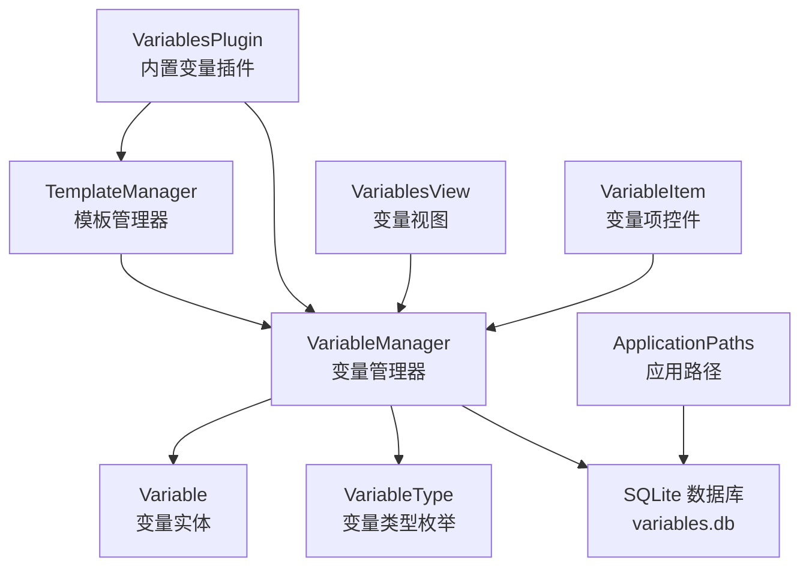
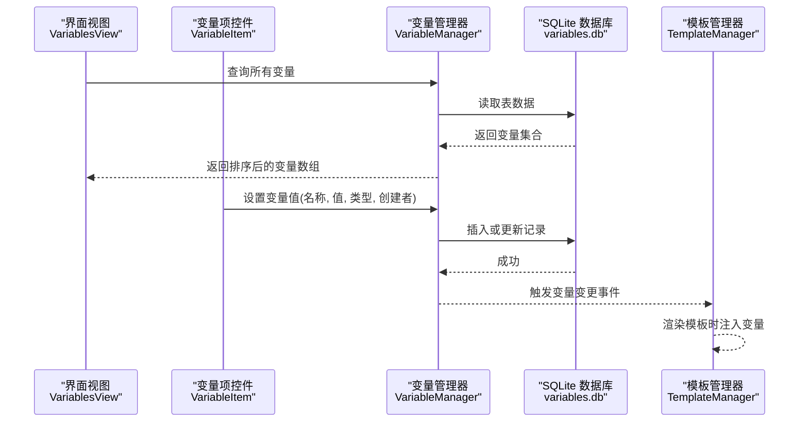
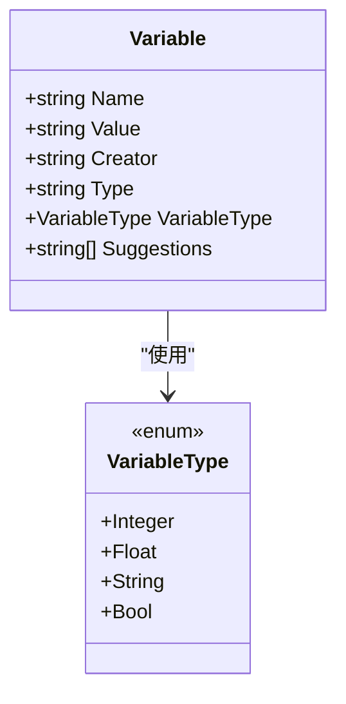
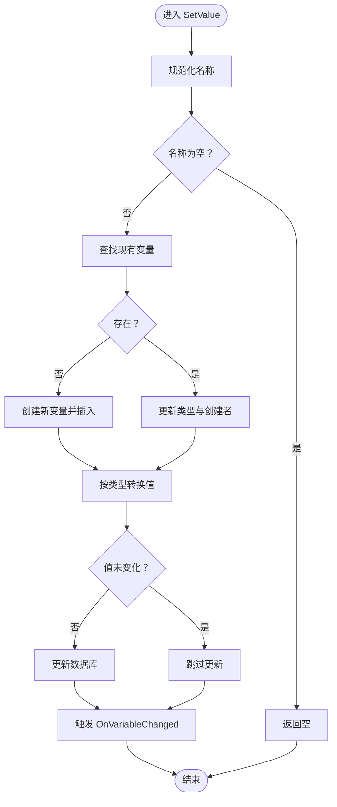
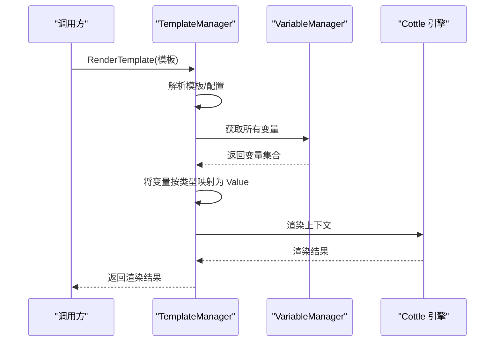
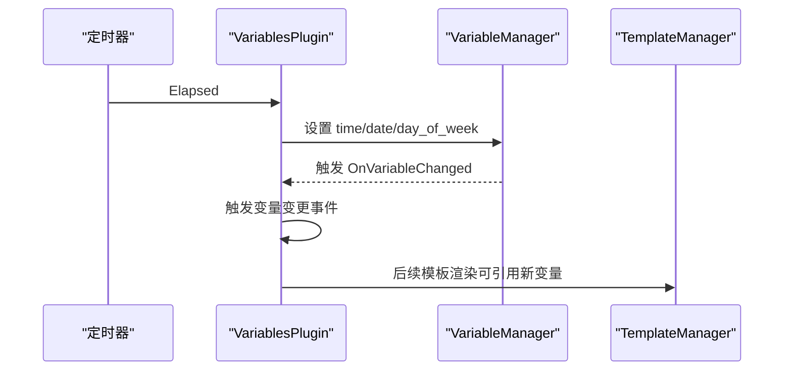
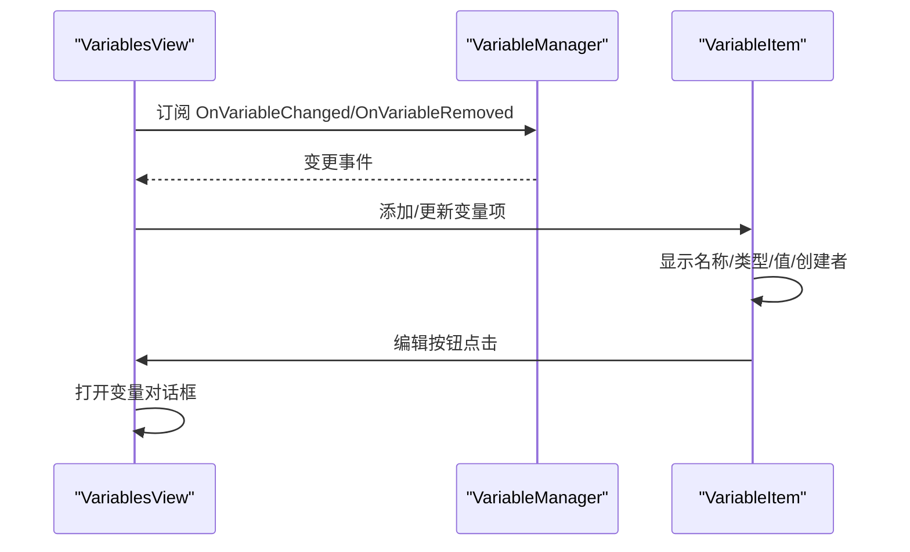
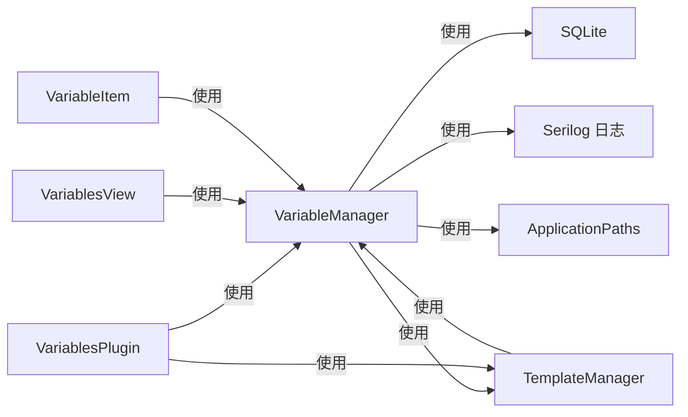

# 变量系统

<cite>
**本文引用的文件**
- [Variable.cs](file://src/MacroDeck/Variables/Variable.cs)
- [VariableManager.cs](file://src/MacroDeck/Variables/VariableManager.cs)
- [VariableType.cs](file://src/MacroDeck/Variables/VariableType.cs)
- [VariablesPlugin.cs](file://src/MacroDeck/InternalPlugins/Variables/VariablesPlugin.cs)
- [TemplateManager.cs](file://src/MacroDeck/CottleIntegration/TemplateManager.cs)
- [ChangeVariableMethod.cs](file://src/MacroDeck/InternalPlugins/Variables/Enums/ChangeVariableMethod.cs)
- [ChangeVariableValueActionConfigModel.cs](file://src/MacroDeck/InternalPlugins/Variables/Models/ChangeVariableValueActionConfigModel.cs)
- [SaveVariableToFileActionConfigModel.cs](file://src/MacroDeck/InternalPlugins/Variables/Models/SaveVariableToFileActionConfigModel.cs)
- [ReadVariableFromFileActionConfigModel.cs](file://src/MacroDeck/InternalPlugins/Variables/Models/ReadVariableFromFileActionConfigModel.cs)
- [VariableItem.cs](file://src/MacroDeck/GUI/CustomControls/Variables/VariableItem.cs)
- [VariablesView.cs](file://src/MacroDeck/GUI/MainWindowViews/VariablesView.cs)
- [ApplicationPaths.cs](file://src/MacroDeck/StartupConfig/ApplicationPaths.cs)
</cite>

## 目录
1. [简介](#简介)
2. [项目结构](#项目结构)
3. [核心组件](#核心组件)
4. [架构总览](#架构总览)
5. [详细组件分析](#详细组件分析)
6. [依赖关系分析](#依赖关系分析)
7. [性能考量](#性能考量)
8. [故障排查指南](#故障排查指南)
9. [结论](#结论)
10. [附录](#附录)

## 简介
本文件系统性地阐述 Macro-Deck 的变量系统：变量的创建与管理、变量类型体系、模板渲染机制、生命周期与作用域、持久化策略，以及与内部插件、模板引擎、界面视图的集成方式。同时给出面向使用者的操作指南与面向开发者的扩展接口说明。

## 项目结构
变量系统主要由以下模块构成：
- 数据模型层：Variable（变量实体）、VariableType（变量类型枚举）
- 管理层：VariableManager（变量的增删改查、事件、命名规范化、数据库初始化）
- 模板层：TemplateManager（Cottle 模板解析与变量注入）
- 插件层：VariablesPlugin（内置变量插件，提供时间日期变量、变更事件、文件读写动作）
- 视图层：VariablesView、VariableItem（变量列表与条目控件）
- 配置与路径：ApplicationPaths（变量数据库文件路径等）

图表来源
- [VariableManager.cs:10-248](file://src/MacroDeck/Variables/VariableManager.cs#L10-L248)
- [Variable.cs:5-15](file://src/MacroDeck/Variables/Variable.cs#L5-L15)
- [VariableType.cs:3-9](file://src/MacroDeck/Variables/VariableType.cs#L3-L9)
- [TemplateManager.cs:8-180](file://src/MacroDeck/CottleIntegration/TemplateManager.cs#L8-L180)
- [VariablesPlugin.cs:22-318](file://src/MacroDeck/InternalPlugins/Variables/VariablesPlugin.cs#L22-L318)
- [VariablesView.cs:10-171](file://src/MacroDeck/GUI/MainWindowViews/VariablesView.cs#L10-L171)
- [VariableItem.cs:6-37](file://src/MacroDeck/GUI/CustomControls/Variables/VariableItem.cs#L6-L37)
- [ApplicationPaths.cs:25](file://src/MacroDeck/StartupConfig/ApplicationPaths.cs#L25)

章节来源
- [VariableManager.cs:10-248](file://src/MacroDeck/Variables/VariableManager.cs#L10-L248)
- [ApplicationPaths.cs:25](file://src/MacroDeck/StartupConfig/ApplicationPaths.cs#L25)

## 核心组件
- Variable（变量实体）：包含名称、值、创建者、类型字段，并暴露可序列化的类型枚举与建议值数组。
- VariableType（变量类型）：整数、浮点、字符串、布尔四类。
- VariableManager（变量管理器）：负责变量的查询、插入、设置值、删除、事件通知、数据库初始化与命名规范化。
- TemplateManager（模板管理器）：将变量注入到 Cottle 上下文，支持模板渲染与关键字提示。
- VariablesPlugin（内置变量插件）：提供时间/日期变量、变量变更事件、变量与文件互转的动作。
- 视图组件：VariablesView、VariableItem 提供变量列表与编辑入口。

章节来源
- [Variable.cs:5-15](file://src/MacroDeck/Variables/Variable.cs#L5-L15)
- [VariableType.cs:3-9](file://src/MacroDeck/Variables/VariableType.cs#L3-L9)
- [VariableManager.cs:10-248](file://src/MacroDeck/Variables/VariableManager.cs#L10-L248)
- [TemplateManager.cs:8-180](file://src/MacroDeck/CottleIntegration/TemplateManager.cs#L8-L180)
- [VariablesPlugin.cs:22-318](file://src/MacroDeck/InternalPlugins/Variables/VariablesPlugin.cs#L22-L318)
- [VariablesView.cs:10-171](file://src/MacroDeck/GUI/MainWindowViews/VariablesView.cs#L10-L171)
- [VariableItem.cs:6-37](file://src/MacroDeck/GUI/CustomControls/Variables/VariableItem.cs#L6-L37)

## 架构总览
变量系统采用“内存中以字典形式访问变量”的思路，底层通过 SQLite 存储；模板系统在渲染时将变量注入上下文，实现动态内容生成。插件通过管理器进行变量读写与事件订阅，界面负责展示与交互。

图表来源
- [VariableManager.cs:23-138](file://src/MacroDeck/Variables/VariableManager.cs#L23-L138)
- [TemplateManager.cs:59-88](file://src/MacroDeck/CottleIntegration/TemplateManager.cs#L59-L88)
- [VariablesView.cs:143-160](file://src/MacroDeck/GUI/MainWindowViews/VariablesView.cs#L143-L160)
- [VariableItem.cs:27-31](file://src/MacroDeck/GUI/CustomControls/Variables/VariableItem.cs#L27-L31)

## 详细组件分析

### Variable 类（变量实体）
- 字段与行为
  - 名称：主键，唯一标识变量
  - 值：字符串存储，实际类型由类型字段决定
  - 创建者：标识变量来源（用户或插件）
  - 类型：字符串表示类型枚举，运行时转换为枚举
  - 建议值：用于 UI 自动补全
- 设计要点
  - 使用 SQLite 特定属性标注主键与忽略字段
  - 类型转换在运行时完成，便于统一存储与模板注入

图表来源
- [Variable.cs:5-15](file://src/MacroDeck/Variables/Variable.cs#L5-L15)
- [VariableType.cs:3-9](file://src/MacroDeck/Variables/VariableType.cs#L3-L9)

章节来源
- [Variable.cs:5-15](file://src/MacroDeck/Variables/Variable.cs#L5-L15)
- [VariableType.cs:3-9](file://src/MacroDeck/Variables/VariableType.cs#L3-L9)

### VariableManager（变量管理器）
- 职责
  - 列出变量、按插件过滤变量、按名称获取变量
  - 设置变量值（含类型转换、去重、更新、事件触发）
  - 插入新变量（避免同名冲突）
  - 删除变量（触发移除事件）
  - 初始化数据库（创建表、清理异常数据）
  - 命名规范化（小写、替换特殊字符、德语变体替换）
- 关键流程
  - 设置值流程：规范化名称 → 查找或新建 → 写入类型与创建者 → 类型安全转换 → 更新数据库 → 触发变更事件
  - 删除流程：删除记录 → 触发移除事件

图表来源
- [VariableManager.cs:54-138](file://src/MacroDeck/Variables/VariableManager.cs#L54-L138)

章节来源
- [VariableManager.cs:10-248](file://src/MacroDeck/Variables/VariableManager.cs#L10-L248)

### TemplateManager（模板管理器）
- 职责
  - 解析模板、构建文档、渲染上下文
  - 将变量注入符号表（根据类型映射为布尔/数值/字符串）
  - 提供自定义函数（时间戳、定时器等）
- 与变量系统的关系
  - 在渲染前将所有变量加入上下文，使模板可直接引用变量名
  - 支持模板关键字提示与命令集

图表来源
- [TemplateManager.cs:69-88](file://src/MacroDeck/CottleIntegration/TemplateManager.cs#L69-L88)
- [TemplateManager.cs:90-124](file://src/MacroDeck/CottleIntegration/TemplateManager.cs#L90-L124)
- [VariableManager.cs:23-27](file://src/MacroDeck/Variables/VariableManager.cs#L23-L27)

章节来源
- [TemplateManager.cs:8-180](file://src/MacroDeck/CottleIntegration/TemplateManager.cs#L8-L180)

### VariablesPlugin（内置变量插件）
- 功能
  - 定时更新时间/日期/星期变量
  - 发布变量变更事件，驱动界面与动作响应
  - 提供变量变更事件参数建议（变量名列表）
  - 提供变量与文件互转的动作（保存/读取）
- 与模板系统的集成
  - 变量变更事件触发后，相关按钮可基于模板引用变量进行刷新

图表来源
- [VariablesPlugin.cs:68-87](file://src/MacroDeck/InternalPlugins/Variables/VariablesPlugin.cs#L68-L87)
- [VariablesPlugin.cs:89-147](file://src/MacroDeck/InternalPlugins/Variables/VariablesPlugin.cs#L89-L147)
- [VariableManager.cs:16-17](file://src/MacroDeck/Variables/VariableManager.cs#L16-L17)

章节来源
- [VariablesPlugin.cs:22-318](file://src/MacroDeck/InternalPlugins/Variables/VariablesPlugin.cs#L22-L318)

### 视图与交互（VariablesView、VariableItem）
- VariablesView
  - 加载变量列表，支持按创建者筛选
  - 订阅变量变更/移除事件，动态更新界面
- VariableItem
  - 展示变量基本信息（名称/类型/值/创建者）
  - 打开变量编辑对话框

图表来源
- [VariablesView.cs:89-141](file://src/MacroDeck/GUI/MainWindowViews/VariablesView.cs#L89-L141)
- [VariableItem.cs:16-31](file://src/MacroDeck/GUI/CustomControls/Variables/VariableItem.cs#L16-L31)

章节来源
- [VariablesView.cs:10-171](file://src/MacroDeck/GUI/MainWindowViews/VariablesView.cs#L10-L171)
- [VariableItem.cs:6-37](file://src/MacroDeck/GUI/CustomControls/Variables/VariableItem.cs#L6-L37)

### 变量类型系统与模板渲染
- 类型特性
  - 整数/浮点：按文化区格式解析，失败回退为 0
  - 布尔：接受多种表示，最终统一为布尔值
  - 字符串：直接存储
- 模板渲染
  - 变量注入：按类型映射为 Cottle Value
  - 渲染：上下文包含所有变量，模板可直接引用变量名

章节来源
- [VariableManager.cs:80-124](file://src/MacroDeck/Variables/VariableManager.cs#L80-L124)
- [TemplateManager.cs:101-123](file://src/MacroDeck/CottleIntegration/TemplateManager.cs#L101-L123)

### 生命周期、作用域与持久化
- 生命周期
  - 初始化：应用启动时创建数据库与表，清理异常数据
  - 运行期：通过管理器进行增删改查，事件驱动界面与动作
  - 关闭：关闭数据库连接
- 作用域
  - 全局：所有插件共享同一变量空间
  - 插件作用域：可通过创建者区分变量归属
- 持久化
  - SQLite 文件：variables.db，位于用户目录下的应用数据路径

章节来源
- [VariableManager.cs:204-223](file://src/MacroDeck/Variables/VariableManager.cs#L204-L223)
- [ApplicationPaths.cs:58](file://src/MacroDeck/StartupConfig/ApplicationPaths.cs#L58)

### API 接口与操作指南
- 读取
  - 获取全部变量：VariableManager.Variables 或 VariableManager.ListVariables
  - 按插件过滤：VariableManager.GetVariables(plugin)
  - 按名称获取：VariableManager.GetVariable(plugin, name)
- 修改
  - 设置值：VariableManager.SetValue(name, value, type, plugin[, suggestions])
  - 插入新变量：VariableManager.InsertVariable(variable)
- 删除
  - 删除变量：VariableManager.DeleteVariable(name)
- 模板渲染
  - 渲染模板：TemplateManager.RenderTemplate(template)
- 内置动作（插件）
  - 变量值变更：加减/设置/切换
  - 变量与文件互转：保存到文件、从文件读取

章节来源
- [VariableManager.cs:26-42](file://src/MacroDeck/Variables/VariableManager.cs#L26-L42)
- [VariableManager.cs:160-185](file://src/MacroDeck/Variables/VariableManager.cs#L160-L185)
- [VariablesPlugin.cs:149-206](file://src/MacroDeck/InternalPlugins/Variables/VariablesPlugin.cs#L149-L206)
- [VariablesPlugin.cs:208-252](file://src/MacroDeck/InternalPlugins/Variables/VariablesPlugin.cs#L208-L252)
- [VariablesPlugin.cs:254-318](file://src/MacroDeck/InternalPlugins/Variables/VariablesPlugin.cs#L254-L318)
- [TemplateManager.cs:69-88](file://src/MacroDeck/CottleIntegration/TemplateManager.cs#L69-L88)

### 变量与模板系统的集成
- 变量注入：渲染前将变量加入上下文，模板可直接引用变量名
- 事件联动：变量变更触发事件，相关按钮可重新渲染模板
- 实践场景：在按钮标签、描述、条件判断中使用变量，实现动态内容

章节来源
- [TemplateManager.cs:90-124](file://src/MacroDeck/CottleIntegration/TemplateManager.cs#L90-L124)
- [VariablesPlugin.cs:84-147](file://src/MacroDeck/InternalPlugins/Variables/VariablesPlugin.cs#L84-L147)

### 变量插件的功能与配置
- 时间/日期变量：每秒更新 time/date/day_of_week
- 变量变更事件：提供参数建议与事件触发
- 文件读写动作：保存变量到文件、从文件读取变量值并按类型设置

章节来源
- [VariablesPlugin.cs:33-87](file://src/MacroDeck/InternalPlugins/Variables/VariablesPlugin.cs#L33-L87)
- [VariablesPlugin.cs:89-147](file://src/MacroDeck/InternalPlugins/Variables/VariablesPlugin.cs#L89-L147)
- [VariablesPlugin.cs:208-318](file://src/MacroDeck/InternalPlugins/Variables/VariablesPlugin.cs#L208-L318)

### 与外部数据源的集成
- 文件系统：提供保存/读取变量到文件的动作，支持类型自动识别
- 模板系统：通过模板渲染实现动态内容生成
- 插件扩展：其他插件可通过管理器读写变量，参与事件与模板渲染

章节来源
- [VariablesPlugin.cs:208-318](file://src/MacroDeck/InternalPlugins/Variables/VariablesPlugin.cs#L208-L318)
- [TemplateManager.cs:69-88](file://src/MacroDeck/CottleIntegration/TemplateManager.cs#L69-L88)

## 依赖关系分析
- 组件耦合
  - VariableManager 依赖 SQLite、日志、模板管理器、插件基类、应用路径
  - TemplateManager 依赖 VariableManager 与 Cottle 引擎
  - VariablesPlugin 依赖事件系统、语言资源、工具类、定时器
  - 视图组件依赖变量管理器与对话框
- 外部依赖
  - SQLite：本地持久化
  - Cottle：模板引擎
  - Serilog：日志

图表来源
- [VariableManager.cs:1-6](file://src/MacroDeck/Variables/VariableManager.cs#L1-L6)
- [TemplateManager.cs:1-5](file://src/MacroDeck/CottleIntegration/TemplateManager.cs#L1-L5)
- [VariablesPlugin.cs:1-16](file://src/MacroDeck/InternalPlugins/Variables/VariablesPlugin.cs#L1-L16)
- [VariablesView.cs:1-7](file://src/MacroDeck/GUI/MainWindowViews/VariablesView.cs#L1-L7)
- [VariableItem.cs:1-3](file://src/MacroDeck/GUI/CustomControls/Variables/VariableItem.cs#L1-L3)

章节来源
- [VariableManager.cs:1-6](file://src/MacroDeck/Variables/VariableManager.cs#L1-L6)
- [TemplateManager.cs:1-5](file://src/MacroDeck/CottleIntegration/TemplateManager.cs#L1-L5)
- [VariablesPlugin.cs:1-16](file://src/MacroDeck/InternalPlugins/Variables/VariablesPlugin.cs#L1-L16)
- [VariablesView.cs:1-7](file://src/MacroDeck/GUI/MainWindowViews/VariablesView.cs#L1-L7)
- [VariableItem.cs:1-3](file://src/MacroDeck/GUI/CustomControls/Variables/VariableItem.cs#L1-L3)

## 性能考量
- 数据库访问
  - 使用单例连接与批量查询，避免频繁打开/关闭
  - 列表查询默认排序，减少 UI 侧排序成本
- 类型转换
  - 在设置值时进行一次性转换，避免重复解析
- 模板渲染
  - 变量注入仅在渲染时执行，避免常驻内存负担
- I/O 操作
  - 文件读写使用重试机制，降低偶发错误影响

## 故障排查指南
- 变量无法保存
  - 检查变量名称是否为空或已被占用
  - 确认数据库文件可写（用户目录权限）
- 类型不匹配
  - 设置值时会尝试解析为指定类型，失败则回退默认值
  - 模板中引用变量时注意类型映射（布尔/数值/字符串）
- 模板渲染报错
  - 检查模板语法与关键字拼写
  - 确认变量已正确注入上下文
- 插件事件无效
  - 确认插件启用且事件注册成功
  - 检查相关按钮是否订阅了变量变更事件

章节来源
- [VariableManager.cs:54-138](file://src/MacroDeck/Variables/VariableManager.cs#L54-L138)
- [TemplateManager.cs:76-87](file://src/MacroDeck/CottleIntegration/TemplateManager.cs#L76-L87)
- [VariablesPlugin.cs:33-87](file://src/MacroDeck/InternalPlugins/Variables/VariablesPlugin.cs#L33-L87)

## 结论
Macro-Deck 的变量系统以 SQLite 为持久化基础，结合 Cottle 模板引擎实现动态内容生成。通过清晰的类型体系、完善的事件机制与简洁的 API，既满足使用者的日常操作需求，也为插件开发者提供了稳定的扩展点。建议在生产环境中关注命名规范、类型转换与模板健壮性，确保跨平台与多语言环境下的稳定性。

## 附录
- 开发者扩展建议
  - 使用 VariableManager.SetValue 设置变量值，传入正确的 VariableType
  - 通过 TemplateManager.RenderTemplate 在需要时渲染模板
  - 如需持久化，确保变量名称符合命名规范（自动规范化）
  - 如需文件同步，参考内置动作模型设计配置结构