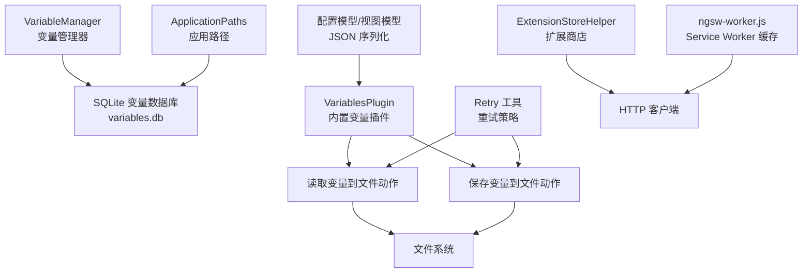
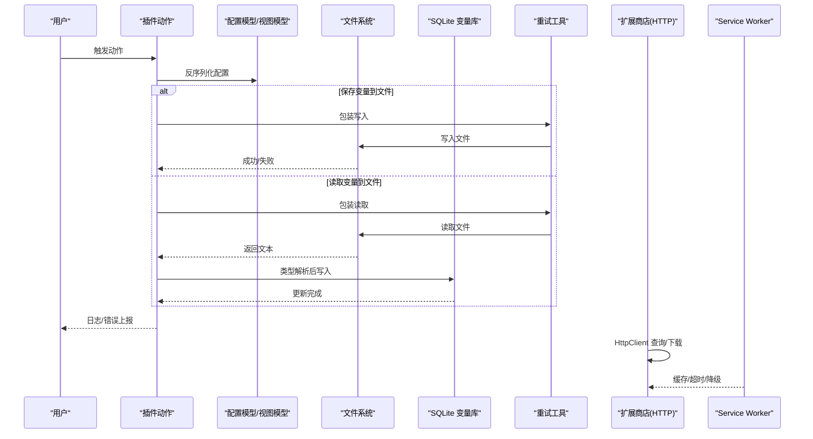
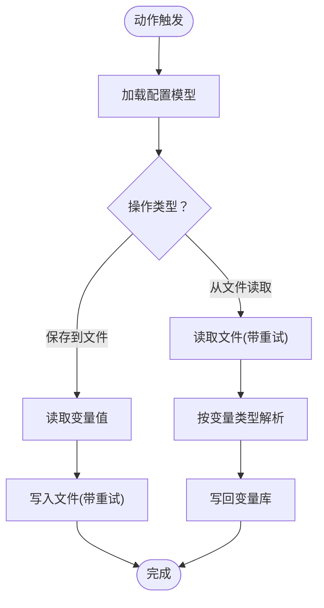
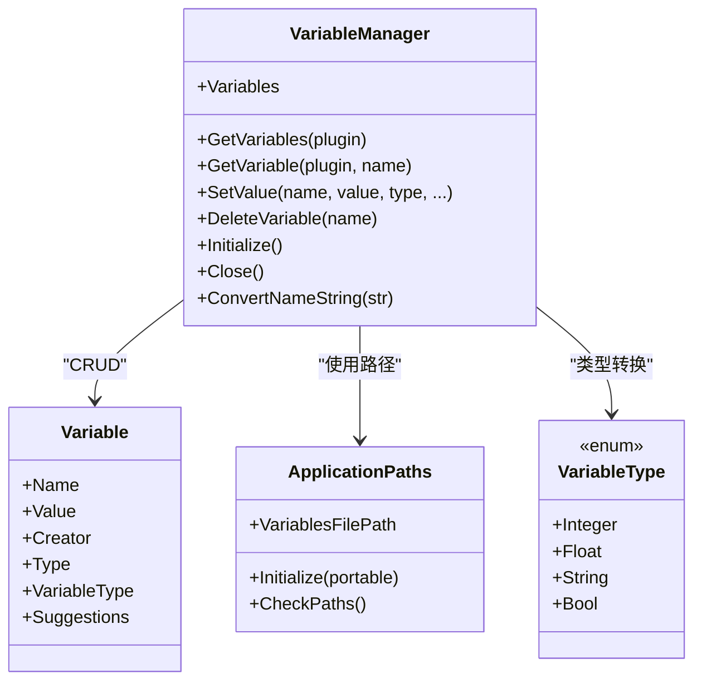
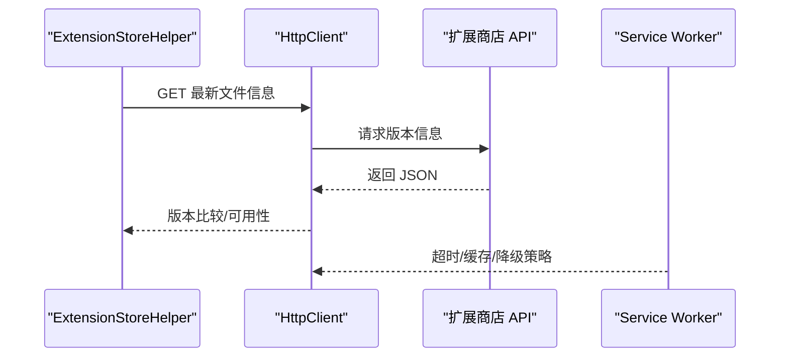
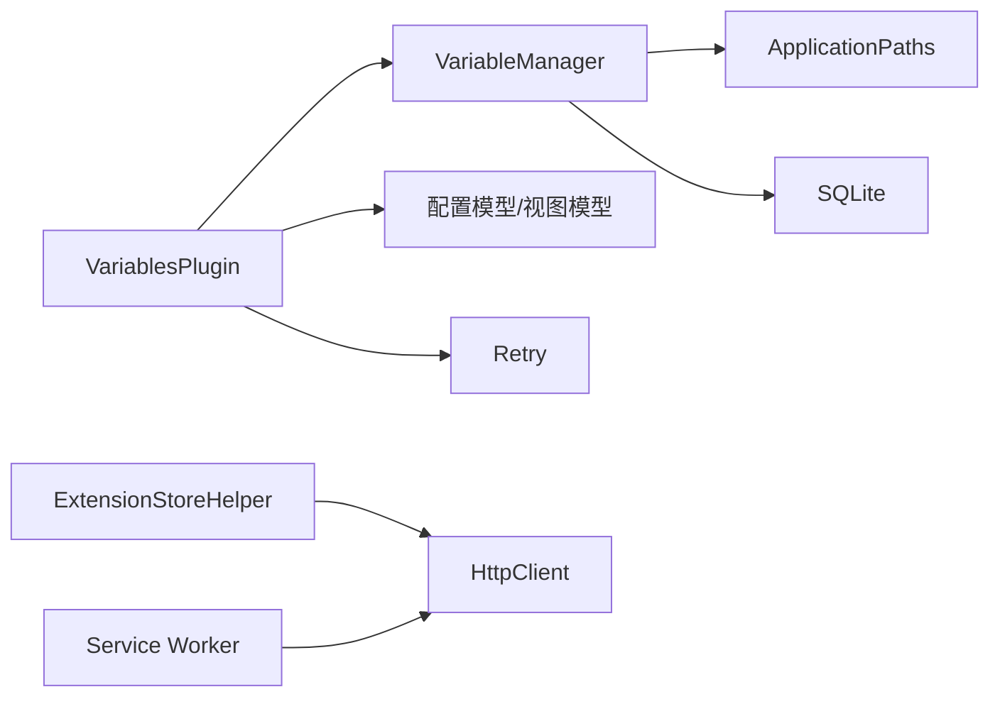

# 外部数据集成

<cite>
**本文引用的文件**
- [VariableManager.cs](file://src/MacroDeck/Variables/VariableManager.cs)
- [Variable.cs](file://src/MacroDeck/Variables/Variable.cs)
- [VariableType.cs](file://src/MacroDeck/Variables/VariableType.cs)
- [VariablesPlugin.cs](file://src/MacroDeck/InternalPlugins/Variables/VariablesPlugin.cs)
- [ReadVariableFromFileActionConfigModel.cs](file://src/MacroDeck/InternalPlugins/Variables/Models/ReadVariableFromFileActionConfigModel.cs)
- [SaveVariableToFileActionConfigModel.cs](file://src/MacroDeck/InternalPlugins/Variables/Models/SaveVariableToFileActionConfigModel.cs)
- [ReadVariableFromFileActionConfigViewModel.cs](file://src/MacroDeck/InternalPlugins/Variables/ViewModels/ReadVariableFromFileActionConfigViewModel.cs)
- [SaveVariableToFileActionConfigViewModel.cs](file://src/MacroDeck/InternalPlugins/Variables/ViewModels/SaveVariableToFileActionConfigViewModel.cs)
- [ApplicationPaths.cs](file://src/MacroDeck/StartupConfig/ApplicationPaths.cs)
- [Retry.cs](file://src/MacroDeck/Utils/Retry.cs)
- [MacroDeckPlugin.cs](file://src/MacroDeck/Plugins/MacroDeckPlugin.cs)
- [ExtensionStoreHelper.cs](file://src/MacroDeck/ExtensionStore/ExtensionStoreHelper.cs)
- [ngsw-worker.js](file://src/MacroDeck/wwwroot/client/ngsw-worker.js)
</cite>

## 目录
1. [简介](#简介)
2. [项目结构](#项目结构)
3. [核心组件](#核心组件)
4. [架构总览](#架构总览)
5. [详细组件分析](#详细组件分析)
6. [依赖关系分析](#依赖关系分析)
7. [性能考量](#性能考量)
8. [故障排查指南](#故障排查指南)
9. [结论](#结论)
10. [附录](#附录)

## 简介
本文件面向“变量系统与外部数据源的集成”，聚焦以下目标：
- 文件系统集成：从文件读取变量值、将变量保存到文件，并给出路径校验、权限与异常处理建议。
- 网络数据源：HTTP 请求、API 调用与实时数据同步的集成思路与最佳实践。
- 数据库：SQLite 变量存储的初始化、类型转换与更新流程。
- 配置管理：连接字符串、认证信息、超时等参数的组织与安全存放。
- 数据格式与验证：类型解析、边界值与空值处理。
- 缓存与离线：基于浏览器 Service Worker 的离线缓存策略与降级策略。
- 扩展指南与安全最佳实践：如何在不破坏现有安全模型的前提下扩展外部数据集成。

## 项目结构
围绕变量系统的外部数据集成，主要涉及如下模块：
- 变量内核：SQLite 存储、类型转换、事件通知与初始化。
- 内置变量插件：提供“读取变量到文件”“保存变量到文件”等动作。
- 配置与序列化：动作配置模型与视图模型负责序列化与摘要生成。
- 应用路径：集中管理用户目录、变量数据库路径与日志路径。
- 工具与重试：统一的重试策略用于文件 IO。
- 插件基类：定义插件与动作的生命周期与配置接口。
- 扩展商店：远程下载与安装流程，体现网络集成与安全校验。
- 前端缓存：Service Worker 提供离线缓存与超时控制。

**图表来源**
- [VariableManager.cs:10-249](file://src/MacroDeck/Variables/VariableManager.cs#L10-L249)
- [VariablesPlugin.cs:22-319](file://src/MacroDeck/InternalPlugins/Variables/VariablesPlugin.cs#L22-L319)
- [ApplicationPaths.cs:6-143](file://src/MacroDeck/StartupConfig/ApplicationPaths.cs#L6-L143)
- [Retry.cs:3-64](file://src/MacroDeck/Utils/Retry.cs#L3-L64)
- [ExtensionStoreHelper.cs:17-195](file://src/MacroDeck/ExtensionStore/ExtensionStoreHelper.cs#L17-L195)
- [ngsw-worker.js:107-822](file://src/MacroDeck/wwwroot/client/ngsw-worker.js#L107-L822)

**章节来源**
- [VariableManager.cs:10-249](file://src/MacroDeck/Variables/VariableManager.cs#L10-L249)
- [VariablesPlugin.cs:22-319](file://src/MacroDeck/InternalPlugins/Variables/VariablesPlugin.cs#L22-L319)
- [ApplicationPaths.cs:6-143](file://src/MacroDeck/StartupConfig/ApplicationPaths.cs#L6-L143)
- [Retry.cs:3-64](file://src/MacroDeck/Utils/Retry.cs#L3-L64)
- [ExtensionStoreHelper.cs:17-195](file://src/MacroDeck/ExtensionStore/ExtensionStoreHelper.cs#L17-L195)
- [ngsw-worker.js:107-822](file://src/MacroDeck/wwwroot/client/ngsw-worker.js#L107-L822)

## 核心组件
- 变量管理器（VariableManager）
  - 负责变量的增删改查、类型转换、事件通知与数据库初始化。
  - 使用 SQLite 连接至 variables.db；提供 ConvertNameString 规范化名称。
- 变量实体（Variable）与类型（VariableType）
  - 实体包含名称、值、创建者与类型；类型枚举支持整型、浮点、字符串、布尔。
- 内置变量插件（VariablesPlugin）
  - 提供“读取变量到文件”“保存变量到文件”两个动作，绑定配置模型与视图模型。
- 配置模型与视图模型
  - 采用 JSON 序列化，视图模型负责摘要生成与保存逻辑。
- 应用路径（ApplicationPaths）
  - 统一管理用户目录、变量数据库路径、日志路径等。
- 重试工具（Retry）
  - 对文件 IO 操作进行最多三次、间隔一秒的重试。
- 插件基类（MacroDeckPlugin）
  - 定义插件生命周期、动作触发与配置接口。
- 扩展商店（ExtensionStoreHelper）
  - 使用 HttpClient 进行远程 API 查询与下载。
- 前端缓存（ngsw-worker.js）
  - 提供缓存、超时与降级策略，支持离线场景。

**章节来源**
- [VariableManager.cs:10-249](file://src/MacroDeck/Variables/VariableManager.cs#L10-L249)
- [Variable.cs:5-16](file://src/MacroDeck/Variables/Variable.cs#L5-L16)
- [VariableType.cs:3-10](file://src/MacroDeck/Variables/VariableType.cs#L3-L10)
- [VariablesPlugin.cs:22-319](file://src/MacroDeck/InternalPlugins/Variables/VariablesPlugin.cs#L22-L319)
- [ReadVariableFromFileActionConfigModel.cs:6-22](file://src/MacroDeck/InternalPlugins/Variables/Models/ReadVariableFromFileActionConfigModel.cs#L6-L22)
- [SaveVariableToFileActionConfigModel.cs:6-23](file://src/MacroDeck/InternalPlugins/Variables/Models/SaveVariableToFileActionConfigModel.cs#L6-L23)
- [ReadVariableFromFileActionConfigViewModel.cs:9-63](file://src/MacroDeck/InternalPlugins/Variables/ViewModels/ReadVariableFromFileActionConfigViewModel.cs#L9-L63)
- [SaveVariableToFileActionConfigViewModel.cs:9-63](file://src/MacroDeck/InternalPlugins/Variables/ViewModels/SaveVariableToFileActionConfigViewModel.cs#L9-L63)
- [ApplicationPaths.cs:6-143](file://src/MacroDeck/StartupConfig/ApplicationPaths.cs#L6-L143)
- [Retry.cs:3-64](file://src/MacroDeck/Utils/Retry.cs#L3-L64)
- [MacroDeckPlugin.cs:9-184](file://src/MacroDeck/Plugins/MacroDeckPlugin.cs#L9-L184)
- [ExtensionStoreHelper.cs:17-195](file://src/MacroDeck/ExtensionStore/ExtensionStoreHelper.cs#L17-L195)
- [ngsw-worker.js:107-822](file://src/MacroDeck/wwwroot/client/ngsw-worker.js#L107-L822)

## 架构总览
变量系统与外部数据源的集成由“本地存储 + 动作插件 + 配置序列化 + 网络/文件访问 + 缓存/离线”构成。下图展示从动作触发到数据落盘或网络请求的关键路径。

**图表来源**
- [VariablesPlugin.cs:208-319](file://src/MacroDeck/InternalPlugins/Variables/VariablesPlugin.cs#L208-L319)
- [Retry.cs:9-62](file://src/MacroDeck/Utils/Retry.cs#L9-L62)
- [ExtensionStoreHelper.cs:162-187](file://src/MacroDeck/ExtensionStore/ExtensionStoreHelper.cs#L162-L187)
- [ngsw-worker.js:785-798](file://src/MacroDeck/wwwroot/client/ngsw-worker.js#L785-L798)

## 详细组件分析

### 文件系统集成：读取/保存变量到文件
- 动作实现
  - 保存变量到文件：根据配置中的文件路径与变量名，读取当前变量值并写入文件；使用重试工具进行容错。
  - 从文件读取变量：按配置读取文件内容，按变量类型进行解析并写回变量库。
- 配置模型
  - 保存/读取动作分别使用对应的配置模型与视图模型，均通过 JSON 序列化持久化。
- 路径与安全
  - 当前未见显式的路径白名单或沙箱限制；建议在扩展新动作时增加：
    - 路径合法性校验（仅允许特定目录或相对路径）。
    - 权限检查（写入前检查可写）。
    - 异常捕获与日志记录，避免泄露敏感路径。
- 错误处理
  - 使用重试策略减少瞬时 IO 失败影响；对异常进行日志记录以便诊断。

**图表来源**
- [VariablesPlugin.cs:208-319](file://src/MacroDeck/InternalPlugins/Variables/VariablesPlugin.cs#L208-L319)
- [Retry.cs:9-62](file://src/MacroDeck/Utils/Retry.cs#L9-L62)

**章节来源**
- [VariablesPlugin.cs:208-319](file://src/MacroDeck/InternalPlugins/Variables/VariablesPlugin.cs#L208-L319)
- [ReadVariableFromFileActionConfigModel.cs:6-22](file://src/MacroDeck/InternalPlugins/Variables/Models/ReadVariableFromFileActionConfigModel.cs#L6-L22)
- [SaveVariableToFileActionConfigModel.cs:6-23](file://src/MacroDeck/InternalPlugins/Variables/Models/SaveVariableToFileActionConfigModel.cs#L6-L23)
- [ReadVariableFromFileActionConfigViewModel.cs:9-63](file://src/MacroDeck/InternalPlugins/Variables/ViewModels/ReadVariableFromFileActionConfigViewModel.cs#L9-L63)
- [SaveVariableToFileActionConfigViewModel.cs:9-63](file://src/MacroDeck/InternalPlugins/Variables/ViewModels/SaveVariableToFileActionConfigViewModel.cs#L9-L63)
- [Retry.cs:9-62](file://src/MacroDeck/Utils/Retry.cs#L9-L62)

### 数据库集成：SQLite 初始化与类型转换
- 初始化
  - 在应用启动时，通过 ApplicationPaths 获取变量数据库路径，创建连接并建表。
- 类型转换
  - SetValue 根据 VariableType 对输入进行解析与规范化，避免类型不一致导致的异常。
- 事件与并发
  - OnVariableChanged 事件用于通知上层状态变更；更新失败会记录错误日志。

**图表来源**
- [VariableManager.cs:10-249](file://src/MacroDeck/Variables/VariableManager.cs#L10-L249)
- [Variable.cs:5-16](file://src/MacroDeck/Variables/Variable.cs#L5-L16)
- [VariableType.cs:3-10](file://src/MacroDeck/Variables/VariableType.cs#L3-L10)
- [ApplicationPaths.cs:6-143](file://src/MacroDeck/StartupConfig/ApplicationPaths.cs#L6-L143)

**章节来源**
- [VariableManager.cs:204-249](file://src/MacroDeck/Variables/VariableManager.cs#L204-L249)
- [ApplicationPaths.cs:43-102](file://src/MacroDeck/StartupConfig/ApplicationPaths.cs#L43-L102)

### 网络数据源集成：HTTP 请求与 API 调用
- 扩展商店 API
  - 使用 HttpClient 访问扩展商店 REST 接口，查询最新版本文件信息，判断是否可更新。
- 超时与降级
  - 前端 Service Worker 支持超时与安全网络请求组合，若网络失败返回 undefined 并记录调试日志。
- 安全建议
  - 对外请求应：
    - 使用 HTTPS 与证书校验。
    - 设置合理超时与重试上限。
    - 对响应进行严格校验（版本号、哈希、签名）。
    - 将认证令牌与密钥通过安全通道传递，避免明文存储。

**图表来源**
- [ExtensionStoreHelper.cs:162-187](file://src/MacroDeck/ExtensionStore/ExtensionStoreHelper.cs#L162-L187)
- [ngsw-worker.js:785-798](file://src/MacroDeck/wwwroot/client/ngsw-worker.js#L785-L798)

**章节来源**
- [ExtensionStoreHelper.cs:162-187](file://src/MacroDeck/ExtensionStore/ExtensionStoreHelper.cs#L162-L187)
- [ngsw-worker.js:785-798](file://src/MacroDeck/wwwroot/client/ngsw-worker.js#L785-L798)

### 配置管理：连接字符串、认证与超时
- 配置模型
  - 读取/保存动作的配置模型均实现 ISerializableConfiguration，采用 JSON 序列化。
- 认证与敏感信息
  - 建议将认证令牌、密钥等放入受保护的凭据存储（如 ApplicationPaths.PluginCredentialsPath），并通过插件配置界面安全输入与持久化。
- 超时设置
  - 网络请求建议在调用层设置超时与最大重试次数；前端 Service Worker 提供超时封装，可在调用侧结合使用。

**章节来源**
- [ReadVariableFromFileActionConfigModel.cs:6-22](file://src/MacroDeck/InternalPlugins/Variables/Models/ReadVariableFromFileActionConfigModel.cs#L6-L22)
- [SaveVariableToFileActionConfigModel.cs:6-23](file://src/MacroDeck/InternalPlugins/Variables/Models/SaveVariableToFileActionConfigModel.cs#L6-L23)
- [ApplicationPaths.cs:52-58](file://src/MacroDeck/StartupConfig/ApplicationPaths.cs#L52-L58)

### 数据格式转换与验证
- 类型转换
  - 整数、浮点、布尔均通过 TryParse 解析；字符串直接赋值。
  - 浮点解析会替换小数点为当前区域的小数分隔符，提升跨语言环境兼容性。
- 边界与空值
  - 空字符串或无效输入将被归一化为默认值（布尔 false、数值 0）。
- 建议
  - 对外部输入增加显式长度与字符集限制；对模板渲染结果进行二次校验。

**章节来源**
- [VariableManager.cs:80-124](file://src/MacroDeck/Variables/VariableManager.cs#L80-L124)

### 缓存策略与离线处理
- 前端缓存
  - Service Worker 提供缓存组、LRU 访问、年龄表与超时控制；当网络失败时返回 undefined 并记录调试日志。
- 离线策略
  - 结合前端缓存与本地变量库，可在无网络时维持基本功能；网络恢复后进行增量同步。

**章节来源**
- [ngsw-worker.js:107-822](file://src/MacroDeck/wwwroot/client/ngsw-worker.js#L107-L822)

## 依赖关系分析
- 组件耦合
  - VariablesPlugin 依赖 VariableManager 与配置模型；文件 IO 依赖 Retry 工具。
  - VariableManager 依赖 ApplicationPaths 与 SQLite；对外部网络依赖 ExtensionStoreHelper。
- 循环依赖
  - 未发现循环依赖；各模块职责清晰。
- 外部依赖
  - Serilog 日志、SQLite.NET、System.Text.Json、System.Net.Http。

**图表来源**
- [VariablesPlugin.cs:22-319](file://src/MacroDeck/InternalPlugins/Variables/VariablesPlugin.cs#L22-L319)
- [VariableManager.cs:10-249](file://src/MacroDeck/Variables/VariableManager.cs#L10-L249)
- [ApplicationPaths.cs:6-143](file://src/MacroDeck/StartupConfig/ApplicationPaths.cs#L6-L143)
- [Retry.cs:3-64](file://src/MacroDeck/Utils/Retry.cs#L3-L64)
- [ExtensionStoreHelper.cs:17-195](file://src/MacroDeck/ExtensionStore/ExtensionStoreHelper.cs#L17-L195)
- [ngsw-worker.js:107-822](file://src/MacroDeck/wwwroot/client/ngsw-worker.js#L107-L822)

**章节来源**
- [VariablesPlugin.cs:22-319](file://src/MacroDeck/InternalPlugins/Variables/VariablesPlugin.cs#L22-L319)
- [VariableManager.cs:10-249](file://src/MacroDeck/Variables/VariableManager.cs#L10-L249)
- [ApplicationPaths.cs:6-143](file://src/MacroDeck/StartupConfig/ApplicationPaths.cs#L6-L143)
- [Retry.cs:3-64](file://src/MacroDeck/Utils/Retry.cs#L3-L64)
- [ExtensionStoreHelper.cs:17-195](file://src/MacroDeck/ExtensionStore/ExtensionStoreHelper.cs#L17-L195)
- [ngsw-worker.js:107-822](file://src/MacroDeck/wwwroot/client/ngsw-worker.js#L107-L822)

## 性能考量
- 文件 IO
  - 使用重试策略降低瞬时失败概率；建议批量写入与去抖动合并写入。
- 数据库
  - 合理使用索引与事务；避免频繁更新同一变量导致锁竞争。
- 网络
  - 合理设置超时与并发上限；对大文件下载使用流式处理与进度回调。
- 前端缓存
  - 利用 Service Worker 缓存静态资源与 API 响应，减少重复请求。

## 故障排查指南
- 文件读写失败
  - 检查路径是否存在、是否有写权限；查看日志中错误堆栈；确认重试是否生效。
- 变量类型解析异常
  - 确认配置的 VariableType 与实际值匹配；检查区域化小数点设置。
- 网络请求失败
  - 查看扩展商店 API 返回状态；确认超时与重试策略；检查证书与代理设置。
- 缓存命中问题
  - 检查 Service Worker 的缓存组配置与 maxAge；确认请求头与缓存键。

**章节来源**
- [VariablesPlugin.cs:208-319](file://src/MacroDeck/InternalPlugins/Variables/VariablesPlugin.cs#L208-L319)
- [VariableManager.cs:126-135](file://src/MacroDeck/Variables/VariableManager.cs#L126-L135)
- [ExtensionStoreHelper.cs:162-187](file://src/MacroDeck/ExtensionStore/ExtensionStoreHelper.cs#L162-L187)
- [ngsw-worker.js:785-822](file://src/MacroDeck/wwwroot/client/ngsw-worker.js#L785-L822)

## 结论
变量系统通过 SQLite 提供稳定的数据持久化，配合内置动作与配置模型实现与文件系统的无缝集成；通过 Retry 工具与 Service Worker 提升了可靠性与离线体验。在网络集成方面，扩展商店 API 展示了标准的 HTTP 调用模式。建议在扩展新的外部数据源时，遵循本文的安全与性能最佳实践，确保路径校验、权限控制、超时与重试策略、以及缓存与离线能力得到充分保障。

## 附录
- 开发者扩展指南
  - 新增动作：继承 PluginAction，实现 Trigger 与配置控件；在 VariablesPlugin 中注册。
  - 新增配置：新增 ISerializableConfiguration 模型与视图模型，实现序列化与摘要。
  - 新增网络集成：使用 HttpClient，设置超时与重试；必要时结合 Service Worker。
  - 新增文件集成：使用 Retry 工具包装 IO；增加路径校验与权限检查。
- 安全最佳实践
  - 不在日志中输出敏感信息；使用 HTTPS；对输入进行白名单与长度限制；最小权限原则；定期轮换凭据。