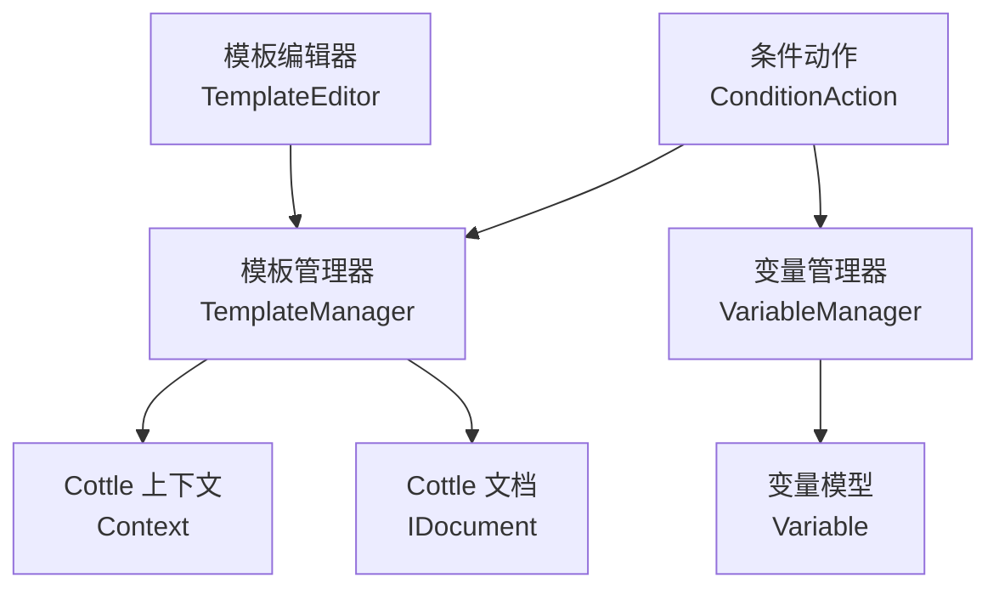
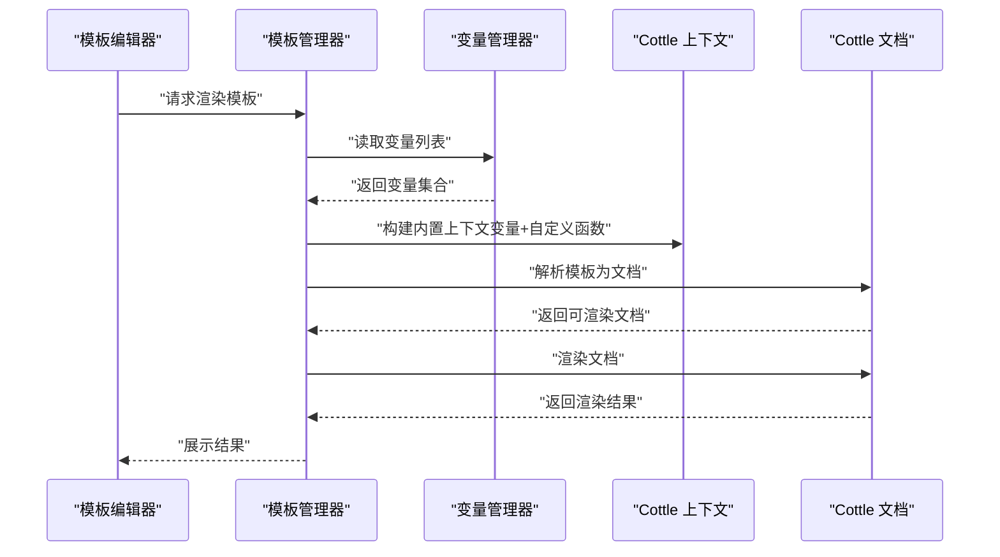
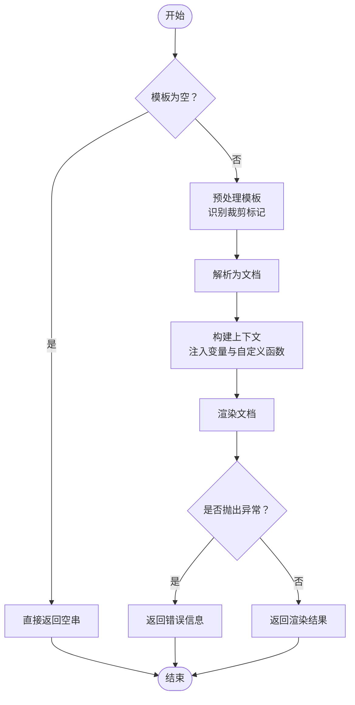
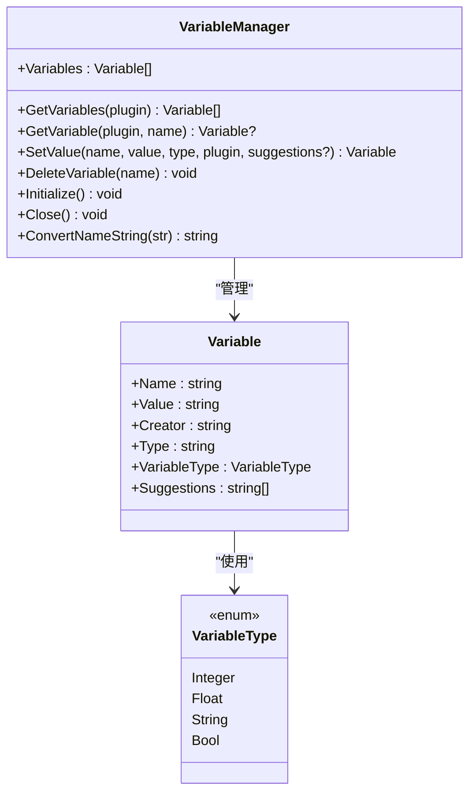
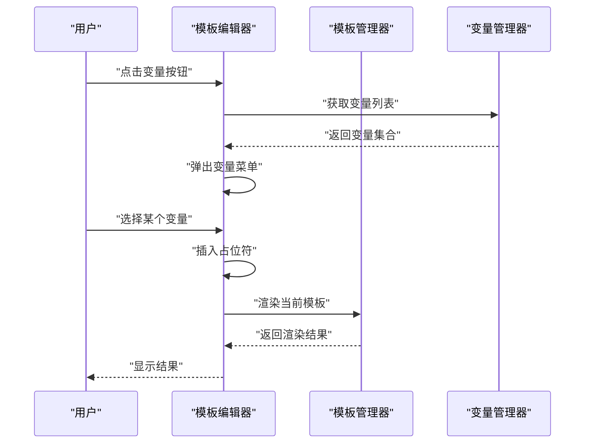
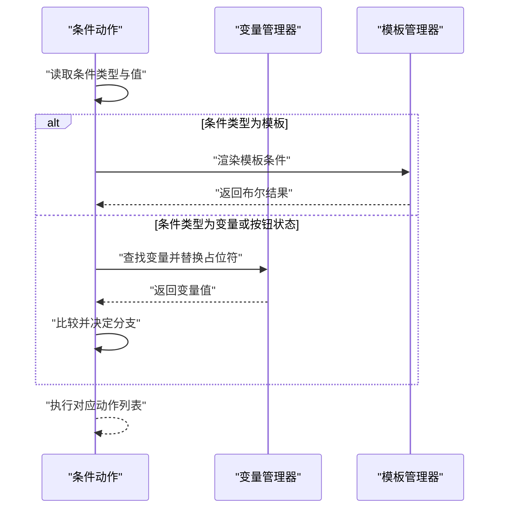
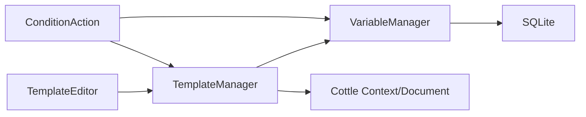

# 模板系统集成

<cite>
**本文档引用的文件**
- [TemplateManager.cs](file://src/MacroDeck/CottleIntegration/TemplateManager.cs)
- [VariableManager.cs](file://src/MacroDeck/Variables/VariableManager.cs)
- [Variable.cs](file://src/MacroDeck/Variables/Variable.cs)
- [VariableType.cs](file://src/MacroDeck/Variables/VariableType.cs)
- [TemplateEditor.cs](file://src/MacroDeck/GUI/Dialogs/TemplateEditor.cs)
- [TemplateEditor.Designer.cs](file://src/MacroDeck/GUI/Dialogs/TemplateEditor.Designer.cs)
- [ConditionAction.cs](file://src/MacroDeck/ActionButton/ConditionAction.cs)
- [TemplateManagerTests.cs](file://tests/MacroDeck.Tests/TemplateManagerTests.cs)
</cite>

## 目录
1. [简介](#简介)
2. [项目结构](#项目结构)
3. [核心组件](#核心组件)
4. [架构总览](#架构总览)
5. [详细组件分析](#详细组件分析)
6. [依赖关系分析](#依赖关系分析)
7. [性能考量](#性能考量)
8. [故障排查指南](#故障排查指南)
9. [结论](#结论)
10. [附录](#附录)

## 简介
本文件面向模板系统与变量系统的集成，围绕 Cottle 模板引擎在项目中的使用进行系统化说明。内容涵盖变量在模板中的引用语法、从解析到渲染的完整执行流程、变量作用域与优先级、模板缓存与性能优化策略、复杂模板的最佳实践、调试技巧与常见问题解决，以及变量与自定义函数的结合使用与扩展方法。目标是帮助模板开发者高效、稳定地构建可维护的模板逻辑。

## 项目结构
模板与变量系统主要由以下模块构成：
- 变量层：变量存储、类型转换、事件通知与数据库持久化
- 模板层：模板解析、上下文构建、渲染与错误处理
- UI 层：模板编辑器与变量选择器，提供可视化编辑与自动补全
- 执行层：条件动作等业务场景中对模板与变量的调用

图表来源
- [TemplateManager.cs:53-88](file://src/MacroDeck/CottleIntegration/TemplateManager.cs#L53-L88)
- [VariableManager.cs:204-223](file://src/MacroDeck/Variables/VariableManager.cs#L204-L223)
- [TemplateEditor.cs:26-35](file://src/MacroDeck/GUI/Dialogs/TemplateEditor.cs#L26-L35)
- [ConditionAction.cs:233-239](file://src/MacroDeck/ActionButton/ConditionAction.cs#L233-L239)

章节来源
- [TemplateManager.cs:1-181](file://src/MacroDeck/CottleIntegration/TemplateManager.cs#L1-L181)
- [VariableManager.cs:1-249](file://src/MacroDeck/Variables/VariableManager.cs#L1-L249)
- [TemplateEditor.cs:26-173](file://src/MacroDeck/GUI/Dialogs/TemplateEditor.cs#L26-L173)
- [ConditionAction.cs:163-256](file://src/MacroDeck/ActionButton/ConditionAction.cs#L163-L256)

## 核心组件
- 模板管理器（TemplateManager）
  - 提供模板解析、渲染入口与关键字集合
  - 负责将变量与自定义函数注入 Cottle 上下文
  - 支持首尾空白行裁剪标记
- 变量管理器（VariableManager）
  - 负责变量的增删改查、类型转换与持久化
  - 提供变量变更与移除事件
  - 维护变量名称规范化与本地化字符替换
- 变量模型（Variable）与类型（VariableType）
  - 定义变量的字段、类型枚举与序列化忽略属性
- 模板编辑器（TemplateEditor）
  - 提供模板高亮、自动补全与变量插入
  - 支持首尾空白行裁剪开关
- 条件动作（ConditionAction）
  - 在触发时对模板条件进行渲染并判断结果
  - 对变量值进行二次替换以支持模板内变量占位

章节来源
- [TemplateManager.cs:8-181](file://src/MacroDeck/CottleIntegration/TemplateManager.cs#L8-L181)
- [VariableManager.cs:10-249](file://src/MacroDeck/Variables/VariableManager.cs#L10-L249)
- [Variable.cs:5-16](file://src/MacroDeck/Variables/Variable.cs#L5-L16)
- [VariableType.cs:3-10](file://src/MacroDeck/Variables/VariableType.cs#L3-L10)
- [TemplateEditor.cs:26-173](file://src/MacroDeck/GUI/Dialogs/TemplateEditor.cs#L26-L173)
- [ConditionAction.cs:163-256](file://src/MacroDeck/ActionButton/ConditionAction.cs#L163-L256)

## 架构总览
模板系统采用“变量注入 + 自定义函数 + Cottle 渲染”的分层设计。变量通过 VariableManager 列表化后注入到 Cottle 的内置上下文；模板编辑器负责语法高亮与关键字提示；条件动作在运行期对模板进行最终渲染并根据布尔结果分支执行。

图表来源
- [TemplateManager.cs:53-88](file://src/MacroDeck/CottleIntegration/TemplateManager.cs#L53-L88)
- [VariableManager.cs:204-223](file://src/MacroDeck/Variables/VariableManager.cs#L204-L223)

## 详细组件分析

### 模板管理器（TemplateManager）
- 关键字与语法支持
  - 运算符、函数、命令与特殊标记均集中定义，便于统一校验与自动补全
  - 特殊标记用于控制首尾空白行裁剪
- 解析与渲染流程
  - 模板预处理：识别并应用裁剪标记，生成渲染模板与配置
  - 文档创建：基于默认配置与渲染模板创建可执行文档
  - 上下文构建：将变量与自定义函数注入内置上下文
  - 渲染执行：返回最终字符串结果
- 错误处理
  - 渲染异常捕获并返回带前缀的错误信息，避免崩溃传播

图表来源
- [TemplateManager.cs:69-88](file://src/MacroDeck/CottleIntegration/TemplateManager.cs#L69-L88)
- [TemplateManager.cs:36-57](file://src/MacroDeck/CottleIntegration/TemplateManager.cs#L36-L57)
- [TemplateManager.cs:59-67](file://src/MacroDeck/CottleIntegration/TemplateManager.cs#L59-L67)

章节来源
- [TemplateManager.cs:8-181](file://src/MacroDeck/CottleIntegration/TemplateManager.cs#L8-L181)

### 变量管理器（VariableManager）
- 数据访问与生命周期
  - 初始化时打开 SQLite 数据库并建表，清理无效数据
  - 提供变量查询、设置、删除与事件通知
- 类型转换与持久化
  - 根据 VariableType 对输入值进行解析与格式化
  - 更新成功后触发变量变更事件
- 名称规范化
  - 将空格、点号、斜杠、短横线等替换为下划线
  - 将德语变体字符映射为 ASCII 近似形式

图表来源
- [VariableManager.cs:10-249](file://src/MacroDeck/Variables/VariableManager.cs#L10-L249)
- [Variable.cs:5-16](file://src/MacroDeck/Variables/Variable.cs#L5-L16)
- [VariableType.cs:3-10](file://src/MacroDeck/Variables/VariableType.cs#L3-L10)

章节来源
- [VariableManager.cs:10-249](file://src/MacroDeck/Variables/VariableManager.cs#L10-L249)
- [Variable.cs:5-16](file://src/MacroDeck/Variables/Variable.cs#L5-L16)
- [VariableType.cs:3-10](file://src/MacroDeck/Variables/VariableType.cs#L3-L10)

### 模板编辑器（TemplateEditor）
- 语法高亮与自动补全
  - 基于模板管理器提供的关键字数组构建正则表达式
  - 支持变量、函数、命令与特殊标记的高亮与提示
- 变量插入与预览
  - 点击变量按钮弹出菜单，支持一键插入变量名占位符
  - 实时预览渲染结果，便于调试
- 首尾空白行裁剪
  - 开关切换时自动在模板头部添加或移除裁剪标记

图表来源
- [TemplateEditor.cs:26-35](file://src/MacroDeck/GUI/Dialogs/TemplateEditor.cs#L26-L35)
- [TemplateEditor.cs:139-143](file://src/MacroDeck/GUI/Dialogs/TemplateEditor.cs#L139-L143)
- [TemplateEditor.cs:154-158](file://src/MacroDeck/GUI/Dialogs/TemplateEditor.cs#L154-L158)

章节来源
- [TemplateEditor.cs:26-173](file://src/MacroDeck/GUI/Dialogs/TemplateEditor.cs#L26-L173)
- [TemplateEditor.Designer.cs:35-200](file://src/MacroDeck/GUI/Dialogs/TemplateEditor.Designer.cs#L35-L200)

### 条件动作（ConditionAction）
- 模板条件渲染
  - 当条件类型为模板时，调用模板管理器对条件源进行渲染，并尝试解析为布尔值
- 变量占位符替换
  - 在模板外部对条件值中的变量占位符进行一次性替换，确保模板内部变量引用生效
- 分支执行
  - 根据比较结果选择执行“满足”或“不满足”的动作列表

图表来源
- [ConditionAction.cs:163-256](file://src/MacroDeck/ActionButton/ConditionAction.cs#L163-L256)
- [ConditionAction.cs:233-239](file://src/MacroDeck/ActionButton/ConditionAction.cs#L233-L239)
- [ConditionAction.cs:167-176](file://src/MacroDeck/ActionButton/ConditionAction.cs#L167-L176)

章节来源
- [ConditionAction.cs:163-256](file://src/MacroDeck/ActionButton/ConditionAction.cs#L163-L256)

## 依赖关系分析
- 组件耦合
  - TemplateManager 依赖 VariableManager 获取变量集合，并依赖 Cottle 的 Context/Document API
  - TemplateEditor 依赖 TemplateManager 的关键字集合与渲染能力
  - ConditionAction 同时依赖 TemplateManager 与 VariableManager
- 外部依赖
  - Cottle：模板解析与渲染
  - SQLite：变量持久化
  - UI 控件：FastColoredTextBox 与 WinForms 组件

图表来源
- [TemplateManager.cs:3,4:3-4](file://src/MacroDeck/CottleIntegration/TemplateManager.cs#L3-L4)
- [VariableManager.cs:1,2,3:1-3](file://src/MacroDeck/Variables/VariableManager.cs#L1-L3)
- [TemplateEditor.cs:26-35](file://src/MacroDeck/GUI/Dialogs/TemplateEditor.cs#L26-L35)
- [ConditionAction.cs:3,7:3-7](file://src/MacroDeck/ActionButton/ConditionAction.cs#L3-L7)

章节来源
- [TemplateManager.cs:1-181](file://src/MacroDeck/CottleIntegration/TemplateManager.cs#L1-L181)
- [VariableManager.cs:1-249](file://src/MacroDeck/Variables/VariableManager.cs#L1-L249)
- [TemplateEditor.cs:26-173](file://src/MacroDeck/GUI/Dialogs/TemplateEditor.cs#L26-L173)
- [ConditionAction.cs:163-256](file://src/MacroDeck/ActionButton/ConditionAction.cs#L163-L256)

## 性能考量
- 变量注入成本
  - 每次渲染都会遍历变量列表并进行类型转换，变量数量较多时应避免频繁重复创建上下文
- 模板解析与缓存
  - 当前实现未显式缓存已解析的文档对象；对于高频重复模板，可在上层引入文档级缓存以减少解析开销
- 渲染路径优化
  - 对空模板直接返回，避免不必要的解析与上下文构建
- UI 交互
  - 编辑器实时预览渲染结果时，建议节流或延迟渲染，防止高频输入导致卡顿

章节来源
- [TemplateManager.cs:71-88](file://src/MacroDeck/CottleIntegration/TemplateManager.cs#L71-L88)
- [TemplateManager.cs:53-57](file://src/MacroDeck/CottleIntegration/TemplateManager.cs#L53-L57)

## 故障排查指南
- 渲染报错
  - 模板管理器会捕获异常并返回带前缀的错误信息，检查模板语法与变量名拼写
- 变量未生效
  - 确认变量已在变量管理器中存在且类型匹配；注意名称规范化规则
  - 检查变量作用域：模板中变量优先级高于同名自定义函数名
- 条件判断异常
  - 模板条件需返回可解析为布尔值的结果；若模板包含多行文本，考虑使用裁剪标记
- UI 自动补全缺失
  - 确保模板编辑器正确加载关键字数组；检查正则表达式构建逻辑

章节来源
- [TemplateManager.cs:82-85](file://src/MacroDeck/CottleIntegration/TemplateManager.cs#L82-L85)
- [TemplateEditor.cs:26-35](file://src/MacroDeck/GUI/Dialogs/TemplateEditor.cs#L26-L35)
- [TemplateManagerTests.cs:34-39](file://tests/MacroDeck.Tests/TemplateManagerTests.cs#L34-L39)

## 结论
该模板系统通过清晰的分层设计实现了变量与模板的无缝集成：变量管理器提供稳定的变量数据与事件，模板管理器负责解析与渲染，UI 层提供良好的开发体验，业务动作在运行期安全地使用模板与变量。遵循本文的最佳实践与性能建议，可在保证稳定性的同时提升模板开发效率与运行性能。

## 附录

### 变量引用语法与作用域
- 引用语法
  - 使用花括号包裹变量名作为占位符，模板渲染时会被变量值替换
- 作用域与优先级
  - 变量名优先于自定义函数名；当两者同名时，变量优先
  - 模板内部变量引用遵循 Cottle 的上下文查找规则

章节来源
- [TemplateManager.cs:90-124](file://src/MacroDeck/CottleIntegration/TemplateManager.cs#L90-L124)
- [TemplateManager.cs:126-132](file://src/MacroDeck/CottleIntegration/TemplateManager.cs#L126-L132)

### 模板缓存机制与性能优化策略
- 当前实现
  - 未发现显式的文档缓存；每次渲染均重新解析模板
- 建议
  - 引入基于模板内容的文档缓存，命中时复用已解析文档
  - 对高频模板采用懒加载与 LRU 淘汰策略
  - 在 UI 预览中增加防抖与延迟渲染

章节来源
- [TemplateManager.cs:53-57](file://src/MacroDeck/CottleIntegration/TemplateManager.cs#L53-L57)
- [TemplateManager.cs:69-88](file://src/MacroDeck/CottleIntegration/TemplateManager.cs#L69-L88)

### 复杂模板最佳实践
- 嵌套变量与条件表达式
  - 使用 if/elif/else 命令组织逻辑；在模板外部对条件值进行变量占位符替换
- 循环结构
  - 使用 for 命令迭代集合；确保集合元素类型一致
- 首尾空白行处理
  - 使用裁剪标记去除多余换行与缩进，保持输出整洁

章节来源
- [TemplateManager.cs:28-29](file://src/MacroDeck/CottleIntegration/TemplateManager.cs#L28-L29)
- [TemplateManager.cs:31-51](file://src/MacroDeck/CottleIntegration/TemplateManager.cs#L31-L51)
- [TemplateEditor.cs:160-172](file://src/MacroDeck/GUI/Dialogs/TemplateEditor.cs#L160-L172)

### 模板调试技巧
- 使用模板编辑器的实时预览功能快速验证
- 逐步简化模板，定位语法或变量问题
- 利用测试用例覆盖不同模板组合，确保回归稳定

章节来源
- [TemplateEditor.cs:154-158](file://src/MacroDeck/GUI/Dialogs/TemplateEditor.cs#L154-L158)
- [TemplateManagerTests.cs:34-39](file://tests/MacroDeck.Tests/TemplateManagerTests.cs#L34-L39)

### 变量与自定义函数的结合使用
- 注入方式
  - 变量与自定义函数统一注入到 Cottle 内置上下文中
- 函数示例
  - 提供时间戳、定时器结束计算等常用函数，便于模板侧进行时间相关处理

章节来源
- [TemplateManager.cs:126-153](file://src/MacroDeck/CottleIntegration/TemplateManager.cs#L126-L153)