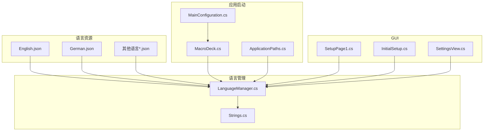
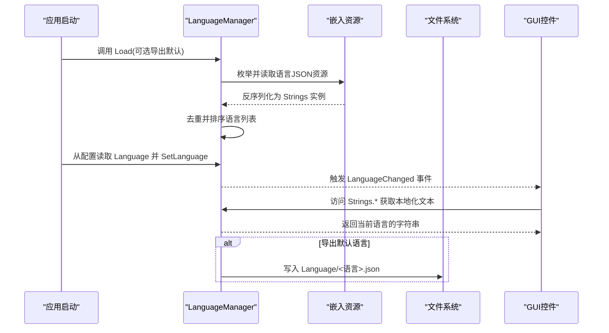
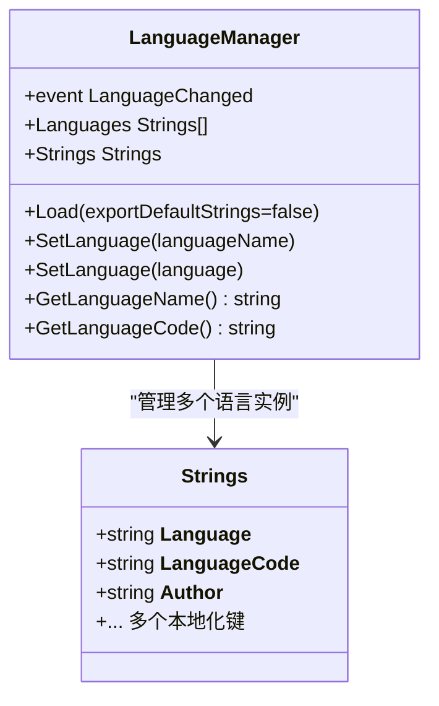
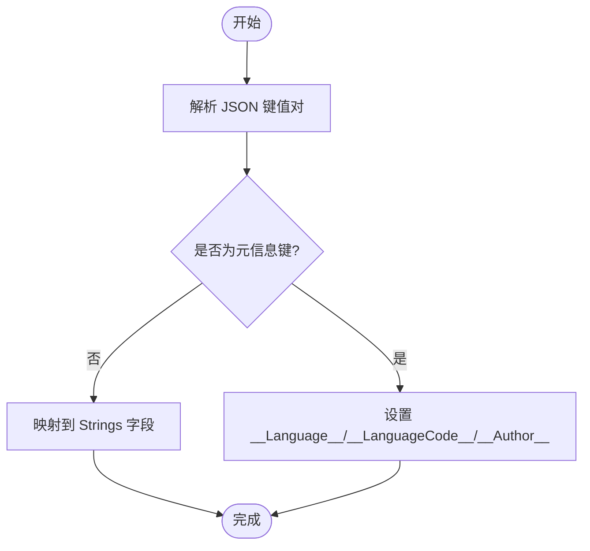
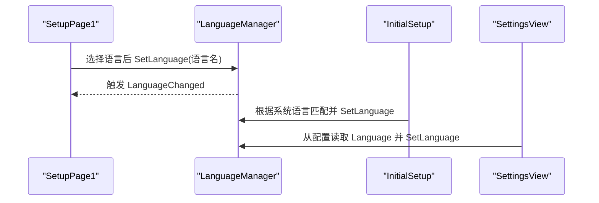
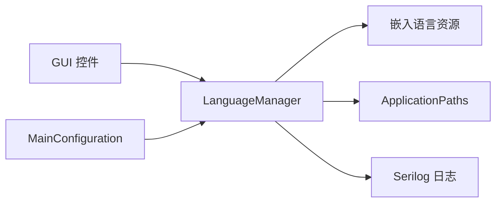

# 国际化系统

<cite>
**本文引用的文件**
- [LanguageManager.cs](file://src/MacroDeck/Language/LanguageManager.cs)
- [Strings.cs](file://src/MacroDeck/Language/Strings.cs)
- [English.json](file://src/MacroDeck/Resources/Languages/English.json)
- [German.json](file://src/MacroDeck/Resources/Languages/German.json)
- [MacroDeck.cs](file://src/MacroDeck/MacroDeck.cs)
- [MainConfiguration.cs](file://src/MacroDeck/Configuration/MainConfiguration.cs)
- [ApplicationPaths.cs](file://src/MacroDeck/StartupConfig/ApplicationPaths.cs)
- [SetupPage1.cs](file://src/MacroDeck/GUI/InitialSetupPages/SetupPage1.cs)
- [InitialSetup.cs](file://src/MacroDeck/GUI/InitialSetup.cs)
- [SettingsView.cs](file://src/MacroDeck/GUI/MainWindowViews/SettingsView.cs)
- [MacroDeck.csproj](file://src/MacroDeck/MacroDeck.csproj)
</cite>

## 目录
1. [简介](#简介)
2. [项目结构](#项目结构)
3. [核心组件](#核心组件)
4. [架构总览](#架构总览)
5. [组件详解](#组件详解)
6. [依赖关系分析](#依赖关系分析)
7. [性能考量](#性能考量)
8. [故障排查指南](#故障排查指南)
9. [结论](#结论)
10. [附录](#附录)

## 简介
本文件系统性阐述 Macro-Deck 的国际化（i18n）体系，覆盖语言包管理、字符串资源组织、本地化加载与切换机制、GUI 集成方式、以及面向翻译人员与开发者的操作指南。重点包括：
- LanguageManager 的实现与事件驱动的语言切换
- 字符串资源的 JSON 结构与命名约定
- 语言文件的嵌入与加载策略
- 默认语言导出与回退逻辑
- GUI 控件如何通过 LanguageManager.Strings 获取本地化文本
- 文本占位符与复数/数量变体的使用建议
- 新语言添加流程与最佳实践

## 项目结构
国际化相关的核心位置如下：
- 语言资源：src/MacroDeck/Resources/Languages/*.json（嵌入为程序集资源）
- 语言管理器：src/MacroDeck/Language/LanguageManager.cs
- 字符串模型：src/MacroDeck/Language/Strings.cs
- 应用启动与语言初始化：src/MacroDeck/MacroDeck.cs
- 用户配置（保存当前语言）：src/MacroDeck/Configuration/MainConfiguration.cs
- 路径与默认语言导出路径：src/MacroDeck/StartupConfig/ApplicationPaths.cs
- GUI 初始设置与设置页的语言选择：src/MacroDeck/GUI/InitialSetupPages/SetupPage1.cs、src/MacroDeck/GUI/InitialSetup.cs、src/MacroDeck/GUI/MainWindowViews/SettingsView.cs
- 项目文件对语言资源的嵌入声明：src/MacroDeck/MacroDeck.csproj

**图表来源**
- [LanguageManager.cs:20-70](file://src/MacroDeck/Language/LanguageManager.cs#L20-L70)
- [Strings.cs:3-17](file://src/MacroDeck/Language/Strings.cs#L3-L17)
- [English.json:1-10](file://src/MacroDeck/Resources/Languages/English.json#L1-L10)
- [German.json:1-10](file://src/MacroDeck/Resources/Languages/German.json#L1-L10)
- [MacroDeck.cs:94-105](file://src/MacroDeck/MacroDeck.cs#L94-L105)
- [MainConfiguration.cs:72-72](file://src/MacroDeck/Configuration/MainConfiguration.cs#L72-L72)
- [ApplicationPaths.cs:74-74](file://src/MacroDeck/StartupConfig/ApplicationPaths.cs#L74-L74)
- [SetupPage1.cs:12-22](file://src/MacroDeck/GUI/InitialSetupPages/SetupPage1.cs#L12-L22)
- [InitialSetup.cs:157-174](file://src/MacroDeck/GUI/InitialSetup.cs#L157-L174)
- [SettingsView.cs:273-273](file://src/MacroDeck/GUI/MainWindowViews/SettingsView.cs#L273-L273)

**章节来源**
- [MacroDeck.csproj:331-360](file://src/MacroDeck/MacroDeck.csproj#L331-L360)

## 核心组件
- LanguageManager：静态类，负责加载语言资源、维护可用语言列表、当前语言实例、触发语言变更事件、导出默认语言文件。
- Strings：强类型字符串模型，包含所有本地化键值，以及语言元信息（名称、语言码、作者）。
- 语言资源 JSON：每个语言一个 JSON 文件，键名与 Strings 类字段一一对应。
- 应用启动流程：在应用启动时加载语言资源，从配置读取当前语言并设置，随后在 GUI 中呈现。

**章节来源**
- [LanguageManager.cs:8-17](file://src/MacroDeck/Language/LanguageManager.cs#L8-L17)
- [Strings.cs:3-17](file://src/MacroDeck/Language/Strings.cs#L3-L17)
- [English.json:1-10](file://src/MacroDeck/Resources/Languages/English.json#L1-L10)
- [MacroDeck.cs:94-105](file://src/MacroDeck/MacroDeck.cs#L94-L105)

## 架构总览
语言系统采用“资源嵌入 + 运行时反序列化”的模式，通过 LanguageManager 统一管理语言集合与当前语言实例，并向 GUI 和业务层提供统一的本地化文本访问入口。

**图表来源**
- [LanguageManager.cs:20-93](file://src/MacroDeck/Language/LanguageManager.cs#L20-L93)
- [MacroDeck.cs:94-105](file://src/MacroDeck/MacroDeck.cs#L94-L105)
- [ApplicationPaths.cs:74-74](file://src/MacroDeck/StartupConfig/ApplicationPaths.cs#L74-L74)
- [SetupPage1.cs:12-22](file://src/MacroDeck/GUI/InitialSetupPages/SetupPage1.cs#L12-L22)

## 组件详解

### LanguageManager 实现与多语言切换
- 加载流程
  - 清空语言列表，预置默认 Strings 实例
  - 可选导出默认语言到用户数据目录
  - 遍历程序集清单资源，筛选以特定前缀结尾的 JSON 资源
  - 使用 JSON 反序列化生成 Strings 实例，去重后按语言名排序
- 当前语言与事件
  - 提供 SetLanguage(Strings) 与 SetLanguage(string) 两种入口
  - 设置当前语言后触发 LanguageChanged 事件，通知订阅者刷新界面
- 查询接口
  - GetLanguageName()/GetLanguageCode() 返回当前语言元信息

**图表来源**
- [LanguageManager.cs:8-120](file://src/MacroDeck/Language/LanguageManager.cs#L8-L120)
- [Strings.cs:3-17](file://src/MacroDeck/Language/Strings.cs#L3-L17)

**章节来源**
- [LanguageManager.cs:20-120](file://src/MacroDeck/Language/LanguageManager.cs#L20-L120)

### 字符串资源与语言文件
- 结构
  - JSON 根对象包含三个元信息字段：__Language__、__LanguageCode__、__Author__
  - 其余键名与 Strings 类字段同名，值为该语言的本地化文本
- 编码与换行
  - JSON 使用 UTF-8 编码
  - 源 JSON 中保留了跨平台换行符（如 \r\n），便于在不同平台正确显示
- 占位符与复数
  - 支持 .NET 格式化占位符（如 {0}、{1}），用于动态替换
  - 复数或数量变体需在调用侧根据语言规则进行分支处理（例如根据数值选择单复数形式）

**图表来源**
- [English.json:1-10](file://src/MacroDeck/Resources/Languages/English.json#L1-L10)
- [Strings.cs:5-7](file://src/MacroDeck/Language/Strings.cs#L5-L7)

**章节来源**
- [English.json:1-330](file://src/MacroDeck/Resources/Languages/English.json#L1-L330)
- [German.json:1-330](file://src/MacroDeck/Resources/Languages/German.json#L1-L330)
- [Strings.cs:5-7](file://src/MacroDeck/Language/Strings.cs#L5-L7)

### 语言文件命名与嵌入
- 命名约定
  - 文件名即语言名称（如 English.json、German.json）
  - 语言码用于系统语言自动匹配（TwoLetterISOLanguageName）
- 嵌入策略
  - 在项目文件中以 EmbeddedResource 方式嵌入
  - LanguageManager 通过枚举清单资源名进行筛选加载
- 默认语言导出
  - SaveDefault 将当前默认语言写入用户数据目录下的 Language 子目录

**章节来源**
- [MacroDeck.csproj:331-360](file://src/MacroDeck/MacroDeck.csproj#L331-L360)
- [LanguageManager.cs:32-40](file://src/MacroDeck/Language/LanguageManager.cs#L32-L40)
- [LanguageManager.cs:72-93](file://src/MacroDeck/Language/LanguageManager.cs#L72-L93)
- [ApplicationPaths.cs:74-74](file://src/MacroDeck/StartupConfig/ApplicationPaths.cs#L74-L74)

### 语言回退与默认语言处理
- 启动阶段
  - 从配置读取 Language 字段，若存在则直接设置为当前语言
  - 若无配置或无法匹配，则尝试根据系统区域设置（TwoLetterISOLanguageName）自动匹配可用语言
- 回退策略
  - 未找到匹配语言时，保持默认语言（通常为内置 English）
  - 语言变更事件触发后，所有订阅者应立即刷新本地化文本

**章节来源**
- [MacroDeck.cs:94-105](file://src/MacroDeck/MacroDeck.cs#L94-L105)
- [InitialSetup.cs:157-174](file://src/MacroDeck/GUI/InitialSetup.cs#L157-L174)
- [MainConfiguration.cs:72-72](file://src/MacroDeck/Configuration/MainConfiguration.cs#L72-L72)

### GUI 界面集成
- 初始设置页面
  - SetupPage1 构造时绑定 LanguageManager.Strings 的初始设置文案
  - 下拉框选择语言后调用 LanguageManager.SetLanguage 并触发 LanguageChanged
- 设置页
  - SettingsView 从配置读取当前语言并设置到下拉框，允许用户切换
- 系统语言自动检测
  - InitialSetup 根据系统区域设置尝试匹配可用语言

**图表来源**
- [SetupPage1.cs:12-22](file://src/MacroDeck/GUI/InitialSetupPages/SetupPage1.cs#L12-L22)
- [InitialSetup.cs:157-174](file://src/MacroDeck/GUI/InitialSetup.cs#L157-L174)
- [SettingsView.cs:273-273](file://src/MacroDeck/GUI/MainWindowViews/SettingsView.cs#L273-L273)

**章节来源**
- [SetupPage1.cs:12-35](file://src/MacroDeck/GUI/InitialSetupPages/SetupPage1.cs#L12-L35)
- [InitialSetup.cs:157-174](file://src/MacroDeck/GUI/InitialSetup.cs#L157-L174)
- [SettingsView.cs:273-273](file://src/MacroDeck/GUI/MainWindowViews/SettingsView.cs#L273-L273)

### 文本方向、日期与数字格式
- 文本方向
  - 代码中未发现针对 RTL（从右到左）语言的特殊处理；当前实现默认 LTR
- 日期与数字格式
  - 代码中未发现显式的区域性格式化逻辑；占位符文本通常由调用方使用标准格式化方法填充
- 建议
  - 对于需要本地化日期/数字格式的场景，应在调用侧使用 CultureInfo 或相关 API 进行格式化

[本节为通用指导，不直接分析具体文件]

## 依赖关系分析
- LanguageManager 依赖
  - 程序集资源枚举（用于加载语言 JSON）
  - ApplicationPaths（用于默认语言导出路径）
  - Serilog（日志记录）
- GUI 依赖
  - LanguageManager.Strings 提供本地化文本
  - LanguageManager.LanguageChanged 作为刷新信号
- 配置依赖
  - MainConfiguration.Language 保存当前语言

**图表来源**
- [LanguageManager.cs:31-40](file://src/MacroDeck/Language/LanguageManager.cs#L31-L40)
- [ApplicationPaths.cs:74-74](file://src/MacroDeck/StartupConfig/ApplicationPaths.cs#L74-L74)
- [MainConfiguration.cs:72-72](file://src/MacroDeck/Configuration/MainConfiguration.cs#L72-L72)

**章节来源**
- [LanguageManager.cs:31-40](file://src/MacroDeck/Language/LanguageManager.cs#L31-L40)
- [MainConfiguration.cs:72-72](file://src/MacroDeck/Configuration/MainConfiguration.cs#L72-L72)

## 性能考量
- 资源加载
  - 语言 JSON 以嵌入资源形式存在，运行时一次性反序列化，避免磁盘 IO 开销
- 去重与排序
  - 加载完成后对语言列表进行去重与排序，确保 UI 显示稳定
- 事件触发
  - 语言切换仅在必要时触发 LanguageChanged，避免不必要的界面重建

[本节提供一般性建议，不直接分析具体文件]

## 故障排查指南
- 语言资源未加载
  - 检查项目文件中语言 JSON 是否标记为 EmbeddedResource
  - 确认资源名前缀与 LanguageManager 的筛选条件一致
- 语言切换无效
  - 确认调用 SetLanguage 并监听 LanguageChanged 事件
  - 检查配置文件中的 Language 字段是否被正确读取
- 默认语言导出失败
  - 检查 ApplicationPaths.UserDirectoryPath 是否可写
  - 查看日志输出定位异常

**章节来源**
- [MacroDeck.csproj:331-360](file://src/MacroDeck/MacroDeck.csproj#L331-L360)
- [LanguageManager.cs:32-40](file://src/MacroDeck/Language/LanguageManager.cs#L32-L40)
- [LanguageManager.cs:72-93](file://src/MacroDeck/Language/LanguageManager.cs#L72-L93)
- [ApplicationPaths.cs:64-102](file://src/MacroDeck/StartupConfig/ApplicationPaths.cs#L64-L102)

## 结论
Macro-Deck 的国际化系统以简洁高效的嵌入资源 + 运行时反序列化为核心，通过 LanguageManager 提供统一的语言管理与事件通知，配合 GUI 控件在运行时即时反映语言变化。系统具备良好的扩展性，新增语言只需提供对应 JSON 文件并嵌入项目即可。对于日期/数字等更复杂的本地化需求，可在调用侧结合区域性 API 实现。

[本节为总结性内容，不直接分析具体文件]

## 附录

### 新语言添加开发指导与最佳实践
- 准备工作
  - 在 src/MacroDeck/Resources/Languages 下新增 <新语言>.json，键名与 Strings.cs 字段保持一致
  - 在项目文件中将新语言 JSON 添加为 EmbeddedResource
- 代码检查
  - 确保 JSON 使用 UTF-8 编码，保留必要的换行符
  - 为每个占位符键提供完整翻译，避免空字符串
- 验证步骤
  - 重新构建项目，确认资源已嵌入
  - 启动应用，在初始设置或设置页中验证新语言出现在列表并可切换
- 发布注意事项
  - 如需导出默认语言，可使用 LanguageManager.Load(true) 触发 SaveDefault 流程

**章节来源**
- [MacroDeck.csproj:331-360](file://src/MacroDeck/MacroDeck.csproj#L331-L360)
- [LanguageManager.cs:20-27](file://src/MacroDeck/Language/LanguageManager.cs#L20-L27)
- [LanguageManager.cs:72-93](file://src/MacroDeck/Language/LanguageManager.cs#L72-L93)

### 翻译人员使用指导
- 翻译范围
  - 仅翻译 JSON 中的值，不要修改键名或元信息字段
- 占位符处理
  - 严格保留 {0}、{1} 等占位符，确保运行时替换正确
- 特殊字符
  - 注意转义与换行符，确保在不同平台显示一致
- 质量控制
  - 对比英文原文，确保语义准确且符合目标语言表达习惯

[本节为通用指导，不直接分析具体文件]