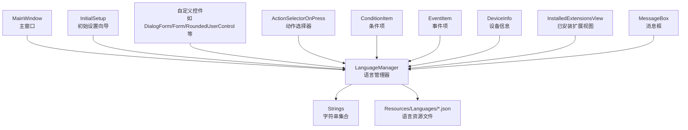
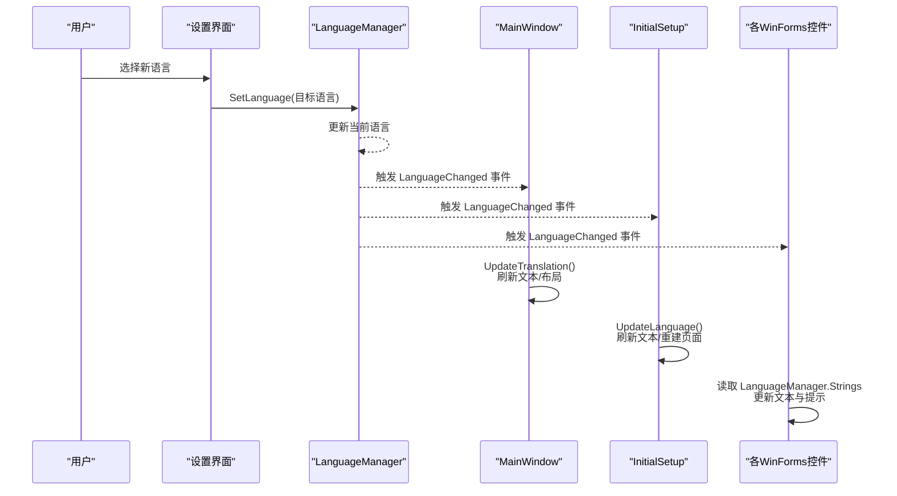
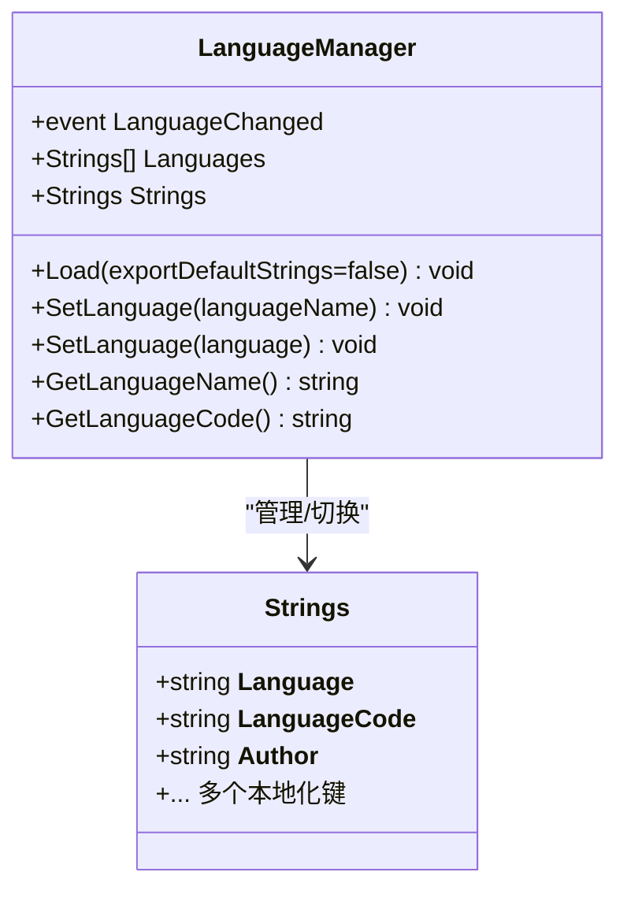
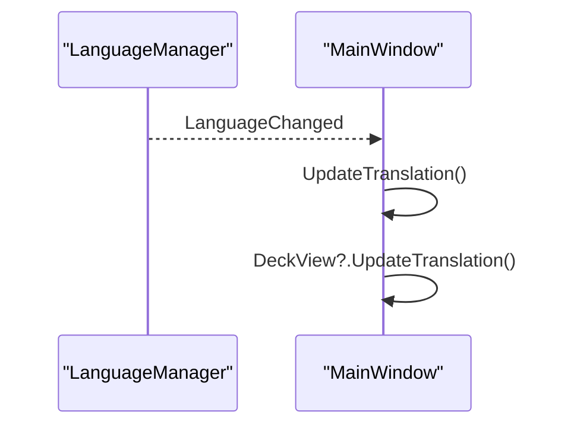
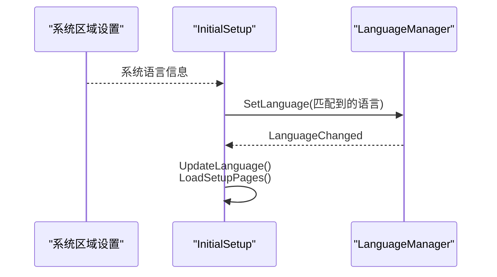
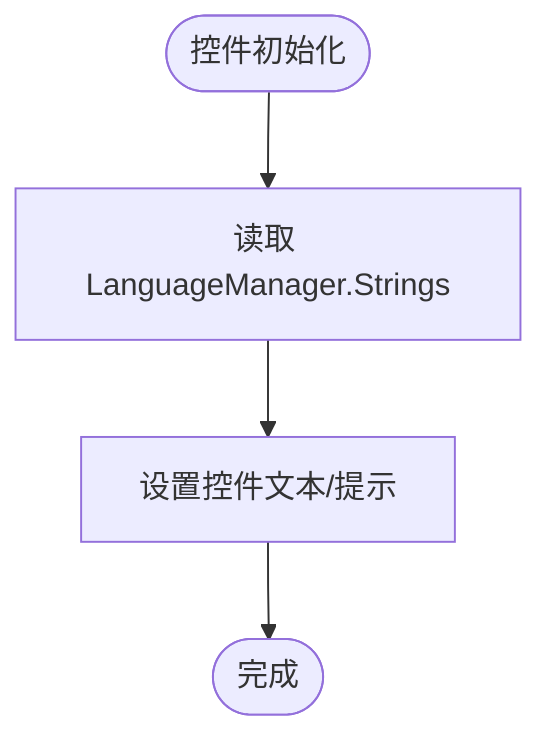
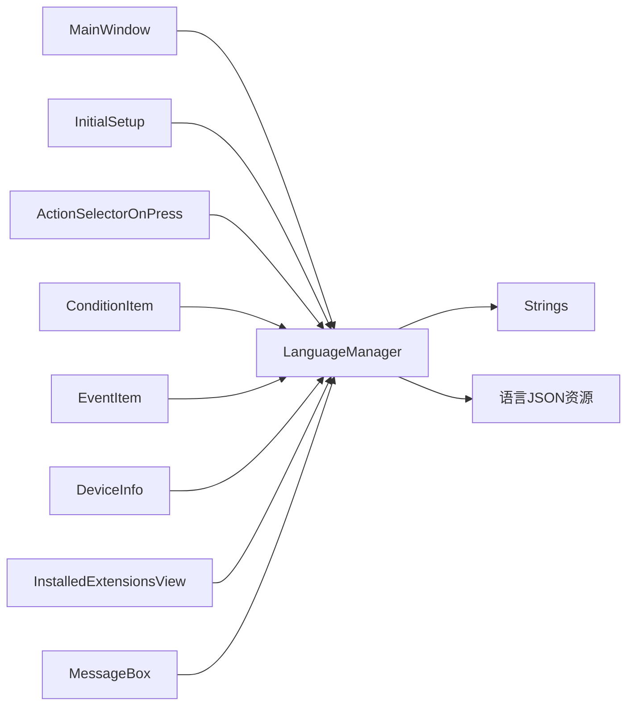

# 本地化集成

<cite>
**本文引用的文件**
- [LanguageManager.cs](file://src/MacroDeck/Language/LanguageManager.cs)
- [Strings.cs](file://src/MacroDeck/Language/Strings.cs)
- [English.json](file://src/MacroDeck/Resources/Languages/English.json)
- [MainWindow.cs](file://src/MacroDeck/GUI/MainWindow.cs)
- [InitialSetup.cs](file://src/MacroDeck/GUI/InitialSetup.cs)
- [DialogForm.cs](file://src/MacroDeck/GUI/CustomControls/DialogForm.cs)
- [Form.cs](file://src/MacroDeck/GUI/CustomControls/Form.cs)
- [RoundedUserControl.cs](file://src/MacroDeck/GUI/CustomControls/RoundedUserControl.cs)
- [ActionSelectorOnPress.cs](file://src/MacroDeck/GUI/CustomControls/ButtonEditor/ActionSelectorOnPress.cs)
- [ConditionItem.cs](file://src/MacroDeck/GUI/CustomControls/ButtonEditor/ConditionItem.cs)
- [EventItem.cs](file://src/MacroDeck/GUI/CustomControls/ButtonEditor/EventItem.cs)
- [DeviceInfo.cs](file://src/MacroDeck/GUI/CustomControls/DeviceInfo.cs)
- [InstalledExtensionsView.cs](file://src/MacroDeck/GUI/CustomControls/ExtensionsView/InstalledExtensionsView.cs)
- [MessageBox.cs](file://src/MacroDeck/GUI/CustomControls/MessageBox.cs)
</cite>

## 目录
1. [简介](#简介)
2. [项目结构](#项目结构)
3. [核心组件](#核心组件)
4. [架构总览](#架构总览)
5. [组件详解](#组件详解)
6. [依赖关系分析](#依赖关系分析)
7. [性能考量](#性能考量)
8. [故障排查指南](#故障排查指南)
9. [结论](#结论)
10. [附录](#附录)

## 简介
本文件系统性阐述 Macro-Deck 的本地化集成机制，重点覆盖以下方面：
- 国际化系统与 WinForms GUI 的集成方式
- 在 WinForms 控件中应用本地化文本的方法
- 语言变更事件的订阅与响应流程
- 动态文本更新与界面重新布局的实现策略
- 本地化控件的开发模式与最佳实践
- 多语言界面的布局适配与字体选择策略
- 日期、时间、数字格式的本地化处理建议
- 文本方向（LTR/RTL）支持与切换机制
- 自定义控件本地化的实现指导

## 项目结构
本地化相关代码主要分布在如下位置：
- 语言资源与管理：Language/LanguageManager.cs、Language/Strings.cs、Resources/Languages/*.json
- 主窗口与初始化设置：GUI/MainWindow.cs、GUI/InitialSetup.cs
- 自定义 WinForms 控件：GUI/CustomControls/* 及其对应的 .resx 资源
- 典型使用点：按钮编辑器、设备信息、扩展视图、消息框等控件

图表来源
- [LanguageManager.cs:1-121](file://src/MacroDeck/Language/LanguageManager.cs#L1-L121)
- [Strings.cs:1-409](file://src/MacroDeck/Language/Strings.cs#L1-L409)
- [English.json:1-330](file://src/MacroDeck/Resources/Languages/English.json#L1-L330)
- [MainWindow.cs:1-290](file://src/MacroDeck/GUI/MainWindow.cs#L1-L290)
- [InitialSetup.cs:1-180](file://src/MacroDeck/GUI/InitialSetup.cs#L1-L180)
- [DialogForm.cs:1-34](file://src/MacroDeck/GUI/CustomControls/DialogForm.cs#L1-L34)
- [Form.cs:1-36](file://src/MacroDeck/GUI/CustomControls/Form.cs#L1-L36)
- [RoundedUserControl.cs:1-51](file://src/MacroDeck/GUI/CustomControls/RoundedUserControl.cs#L1-L51)
- [ActionSelectorOnPress.cs:1-40](file://src/MacroDeck/GUI/CustomControls/ButtonEditor/ActionSelectorOnPress.cs#L1-L40)
- [ConditionItem.cs:1-60](file://src/MacroDeck/GUI/CustomControls/ButtonEditor/ConditionItem.cs#L1-L60)
- [EventItem.cs:1-60](file://src/MacroDeck/GUI/CustomControls/ButtonEditor/EventItem.cs#L1-L60)
- [DeviceInfo.cs:1-40](file://src/MacroDeck/GUI/CustomControls/DeviceInfo.cs#L1-L40)
- [InstalledExtensionsView.cs:1-40](file://src/MacroDeck/GUI/CustomControls/ExtensionsView/InstalledExtensionsView.cs#L1-L40)
- [MessageBox.cs:1-60](file://src/MacroDeck/GUI/CustomControls/MessageBox.cs#L1-L60)

章节来源
- [LanguageManager.cs:1-121](file://src/MacroDeck/Language/LanguageManager.cs#L1-L121)
- [Strings.cs:1-409](file://src/MacroDeck/Language/Strings.cs#L1-L409)
- [English.json:1-330](file://src/MacroDeck/Resources/Languages/English.json#L1-L330)
- [MainWindow.cs:1-290](file://src/MacroDeck/GUI/MainWindow.cs#L1-L290)
- [InitialSetup.cs:1-180](file://src/MacroDeck/GUI/InitialSetup.cs#L1-L180)

## 核心组件
- 语言管理器（LanguageManager）
  - 提供语言加载、切换、事件通知能力
  - 暴露当前语言字符串集（LanguageManager.Strings）
  - 订阅 LanguageChanged 事件以响应语言变更
- 字符串集合（Strings）
  - 定义所有可本地化的键值对
  - 包含语言元数据（名称、代码、作者）
- 语言资源文件（Resources/Languages/*.json）
  - 以 JSON 形式存储各语言的键值映射
  - LanguageManager 通过程序集资源加载这些文件
- 主窗口与初始化设置
  - MainWindow 和 InitialSetup 订阅 LanguageChanged 并触发 UI 更新
- 自定义 WinForms 控件
  - DialogForm、Form、RoundedUserControl 等作为基础控件族
  - 各具体控件在构造或页面切换时读取 LanguageManager.Strings 进行文本填充

章节来源
- [LanguageManager.cs:11-120](file://src/MacroDeck/Language/LanguageManager.cs#L11-L120)
- [Strings.cs:3-8](file://src/MacroDeck/Language/Strings.cs#L3-L8)
- [English.json:1-330](file://src/MacroDeck/Resources/Languages/English.json#L1-L330)
- [MainWindow.cs:43-65](file://src/MacroDeck/GUI/MainWindow.cs#L43-L65)
- [InitialSetup.cs:36-62](file://src/MacroDeck/GUI/InitialSetup.cs#L36-L62)

## 架构总览
本地化系统采用“集中式语言管理 + 分发式文本应用”的架构：
- 集中式：LanguageManager 统一加载语言资源、维护当前语言、广播语言变更事件
- 分发式：各 UI 组件订阅 LanguageChanged，在回调中刷新自身文本与布局
- 数据源：Strings 类与 JSON 资源文件共同构成键值库

图表来源
- [LanguageManager.cs:104-109](file://src/MacroDeck/Language/LanguageManager.cs#L104-L109)
- [MainWindow.cs:61-65](file://src/MacroDeck/GUI/MainWindow.cs#L61-L65)
- [InitialSetup.cs:57-62](file://src/MacroDeck/GUI/InitialSetup.cs#L57-L62)

## 组件详解

### 语言管理器（LanguageManager）
- 加载策略
  - 扫描程序集中的语言资源文件（以特定前缀与后缀命名）
  - 使用 JSON 反序列化生成多个 Strings 实例并去重排序
- 切换机制
  - SetLanguage(Strings) 更新当前语言并触发 LanguageChanged
  - 提供按语言名切换的便捷方法
- 事件模型
  - 暴露 LanguageChanged 事件，供 UI 订阅

图表来源
- [LanguageManager.cs:8-121](file://src/MacroDeck/Language/LanguageManager.cs#L8-L121)
- [Strings.cs:3-409](file://src/MacroDeck/Language/Strings.cs#L3-L409)

章节来源
- [LanguageManager.cs:20-70](file://src/MacroDeck/Language/LanguageManager.cs#L20-L70)
- [LanguageManager.cs:95-120](file://src/MacroDeck/Language/LanguageManager.cs#L95-L120)

### 主窗口（MainWindow）与语言变更响应
- 订阅 LanguageChanged
- 在回调中调用 UpdateTranslation 与子视图 UpdateTranslation
- 对部分动态文本（如连接数）直接从 LanguageManager.Strings 获取并格式化

图表来源
- [MainWindow.cs:43-65](file://src/MacroDeck/GUI/MainWindow.cs#L43-L65)

章节来源
- [MainWindow.cs:43-65](file://src/MacroDeck/GUI/MainWindow.cs#L43-L65)
- [MainWindow.cs:199-204](file://src/MacroDeck/GUI/MainWindow.cs#L199-L204)

### 初始化设置（InitialSetup）与语言变更
- 订阅 LanguageChanged
- 在回调中更新配置语言、刷新按钮文本、重建页面控件
- 启动时根据系统区域设置尝试匹配可用语言

图表来源
- [InitialSetup.cs:36-62](file://src/MacroDeck/GUI/InitialSetup.cs#L36-L62)
- [InitialSetup.cs:157-174](file://src/MacroDeck/GUI/InitialSetup.cs#L157-L174)

章节来源
- [InitialSetup.cs:36-62](file://src/MacroDeck/GUI/InitialSetup.cs#L36-L62)
- [InitialSetup.cs:157-174](file://src/MacroDeck/GUI/InitialSetup.cs#L157-L174)

### 自定义控件中的本地化应用
- 基类控件
  - DialogForm、Form 提供通用行为（如 ESC 关闭），不直接参与文本本地化
  - RoundedUserControl 专注绘制与布局，不涉及文本
- 具体控件
  - ActionSelectorOnPress、ConditionItem、EventItem：在构造或初始化时读取 LanguageManager.Strings 并设置菜单项与标签文本
  - DeviceInfo：设置按钮与标签文本
  - InstalledExtensionsView：设置按钮文本
  - MessageBox：设置按钮文本

图表来源
- [ActionSelectorOnPress.cs:18-23](file://src/MacroDeck/GUI/CustomControls/ButtonEditor/ActionSelectorOnPress.cs#L18-L23)
- [ConditionItem.cs:34-37](file://src/MacroDeck/GUI/CustomControls/ButtonEditor/ConditionItem.cs#L34-L37)
- [EventItem.cs:33-36](file://src/MacroDeck/GUI/CustomControls/ButtonEditor/EventItem.cs#L33-L36)
- [DeviceInfo.cs:17-22](file://src/MacroDeck/GUI/CustomControls/DeviceInfo.cs#L17-L22)
- [InstalledExtensionsView.cs:22-23](file://src/MacroDeck/GUI/CustomControls/ExtensionsView/InstalledExtensionsView.cs#L22-L23)
- [MessageBox.cs:26](file://src/MacroDeck/GUI/CustomControls/MessageBox.cs#L26)

章节来源
- [ActionSelectorOnPress.cs:18-23](file://src/MacroDeck/GUI/CustomControls/ButtonEditor/ActionSelectorOnPress.cs#L18-L23)
- [ConditionItem.cs:34-37](file://src/MacroDeck/GUI/CustomControls/ButtonEditor/ConditionItem.cs#L34-L37)
- [EventItem.cs:33-36](file://src/MacroDeck/GUI/CustomControls/ButtonEditor/EventItem.cs#L33-L36)
- [DeviceInfo.cs:17-22](file://src/MacroDeck/GUI/CustomControls/DeviceInfo.cs#L17-L22)
- [InstalledExtensionsView.cs:22-23](file://src/MacroDeck/GUI/CustomControls/ExtensionsView/InstalledExtensionsView.cs#L22-L23)
- [MessageBox.cs:26](file://src/MacroDeck/GUI/CustomControls/MessageBox.cs#L26)

### 动态文本更新与界面重新布局
- 语言变更时，UI 通过 LanguageChanged 事件获知
- MainWindow 与 InitialSetup 在回调中调用各自的 UpdateTranslation 方法
- 具体控件在构造或页面切换时读取最新 LanguageManager.Strings
- 对于动态显示的数据（如连接数），直接使用当前语言字符串进行格式化

章节来源
- [MainWindow.cs:61-65](file://src/MacroDeck/GUI/MainWindow.cs#L61-L65)
- [MainWindow.cs:199-204](file://src/MacroDeck/GUI/MainWindow.cs#L199-L204)
- [InitialSetup.cs:57-62](file://src/MacroDeck/GUI/InitialSetup.cs#L57-L62)

### 多语言界面的布局适配与字体选择策略
- 布局适配
  - 不同语言的文本长度差异较大，建议控件使用自动换行、弹性布局或最小宽度约束
  - 对于按钮与输入框，优先使用百分比宽度与相对定位，避免固定像素导致溢出
- 字体选择
  - 推荐使用系统默认字体，确保对各种字符集的兼容性
  - 对于特殊字符集（如阿拉伯语、希伯来语），需验证字体是否包含相应字形
- RTL 支持
  - 当前代码未体现显式的 RTL 切换逻辑；若需要支持 RTL，应在语言切换时同步设置 RightToLeft 属性与镜像布局

（本节为通用指导，不直接分析具体文件）

### 日期、时间、数字格式的本地化处理
- 建议使用 .NET 的区域性（CultureInfo）进行格式化
  - 日期/时间：使用 DateTime.ToString(format, culture)
  - 数字：使用 NumberFormatInfo 或 ToString("N", culture)
- 在 UI 中，对于需要展示的数值（如进度、版本号），统一通过区域性格式化输出

（本节为通用指导，不直接分析具体文件）

### 文本方向（LTR/RTL）的支持与切换机制
- 当前仓库未发现显式的 RTL 切换实现
- 若需支持 RTL，可在 LanguageChanged 回调中：
  - 设置窗体与容器的 RightToLeft 属性
  - 切换 FlowDirection 或 Margin/Anchor 策略
  - 重新计算控件布局（尤其是按钮组与表单）

（本节为通用指导，不直接分析具体文件）

### 自定义控件本地化的实现指导
- 设计原则
  - 将文本读取集中在控件构造或专用刷新方法中
  - 避免硬编码字符串，统一通过 LanguageManager.Strings 访问
- 开发步骤
  - 在控件构造函数或 Load 事件中读取所需键值并设置 Text/ToolTip
  - 如控件包含子元素（菜单、列表项），在构造时批量设置
  - 对动态文本（如状态栏计数）在 LanguageChanged 回调中刷新
- 最佳实践
  - 使用占位符（如 {0}）时，统一通过 string.Format 与当前语言字符串组合
  - 对于复杂 UI（如表格、树形控件），考虑分层刷新策略，避免全量重建

章节来源
- [ActionSelectorOnPress.cs:18-23](file://src/MacroDeck/GUI/CustomControls/ButtonEditor/ActionSelectorOnPress.cs#L18-L23)
- [ConditionItem.cs:34-37](file://src/MacroDeck/GUI/CustomControls/ButtonEditor/ConditionItem.cs#L34-L37)
- [EventItem.cs:33-36](file://src/MacroDeck/GUI/CustomControls/ButtonEditor/EventItem.cs#L33-L36)
- [DeviceInfo.cs:17-22](file://src/MacroDeck/GUI/CustomControls/DeviceInfo.cs#L17-L22)
- [InstalledExtensionsView.cs:22-23](file://src/MacroDeck/GUI/CustomControls/ExtensionsView/InstalledExtensionsView.cs#L22-L23)
- [MessageBox.cs:26](file://src/MacroDeck/GUI/CustomControls/MessageBox.cs#L26)

## 依赖关系分析
- LanguageManager 是核心枢纽，被 MainWindow、InitialSetup 以及大量自定义控件间接依赖
- Strings 与 JSON 资源文件是语言数据的双入口：代码中通过类访问，运行时通过资源文件加载
- 自定义控件之间无直接依赖，均通过 LanguageManager 解耦

图表来源
- [LanguageManager.cs:104-109](file://src/MacroDeck/Language/LanguageManager.cs#L104-L109)
- [MainWindow.cs:43-65](file://src/MacroDeck/GUI/MainWindow.cs#L43-L65)
- [InitialSetup.cs:36-62](file://src/MacroDeck/GUI/InitialSetup.cs#L36-L62)
- [ActionSelectorOnPress.cs:18-23](file://src/MacroDeck/GUI/CustomControls/ButtonEditor/ActionSelectorOnPress.cs#L18-L23)
- [ConditionItem.cs:34-37](file://src/MacroDeck/GUI/CustomControls/ButtonEditor/ConditionItem.cs#L34-L37)
- [EventItem.cs:33-36](file://src/MacroDeck/GUI/CustomControls/ButtonEditor/EventItem.cs#L33-L36)
- [DeviceInfo.cs:17-22](file://src/MacroDeck/GUI/CustomControls/DeviceInfo.cs#L17-L22)
- [InstalledExtensionsView.cs:22-23](file://src/MacroDeck/GUI/CustomControls/ExtensionsView/InstalledExtensionsView.cs#L22-L23)
- [MessageBox.cs:26](file://src/MacroDeck/GUI/CustomControls/MessageBox.cs#L26)

章节来源
- [LanguageManager.cs:104-109](file://src/MacroDeck/Language/LanguageManager.cs#L104-L109)
- [MainWindow.cs:43-65](file://src/MacroDeck/GUI/MainWindow.cs#L43-L65)
- [InitialSetup.cs:36-62](file://src/MacroDeck/GUI/InitialSetup.cs#L36-L62)

## 性能考量
- 语言资源加载
  - 仅在启动或首次加载时扫描并反序列化 JSON，避免频繁 IO
- 事件广播
  - LanguageChanged 为轻量事件，建议 UI 在回调中做增量刷新，避免全量重建
- 文本格式化
  - 对动态文本（如连接数）使用一次性格式化，减少重复计算

（本节提供一般性建议，不直接分析具体文件）

## 故障排查指南
- 语言资源未加载
  - 检查 JSON 文件命名与路径是否符合 LanguageManager 的资源扫描规则
  - 查看日志中关于资源加载的警告信息
- 语言切换无效
  - 确认控件是否正确订阅 LanguageChanged
  - 检查控件是否在回调中刷新了文本
- 文本截断或布局错乱
  - 调整控件宽度、启用自动换行、使用弹性布局
  - 对长文本提供 Tooltip 或省略号策略

章节来源
- [LanguageManager.cs:30-70](file://src/MacroDeck/Language/LanguageManager.cs#L30-L70)
- [MainWindow.cs:61-65](file://src/MacroDeck/GUI/MainWindow.cs#L61-L65)
- [InitialSetup.cs:57-62](file://src/MacroDeck/GUI/InitialSetup.cs#L57-L62)

## 结论
Macro-Deck 的本地化体系以 LanguageManager 为核心，结合 Strings 与 JSON 资源，实现了从资源加载到 UI 应用的完整链路。通过 LanguageChanged 事件，主窗口与各类控件能够及时响应语言变更并刷新文本。建议在后续迭代中补充：
- 显式的 RTL 支持与切换
- 区域性格式化（日期/时间/数字）
- 更完善的布局适配与字体策略

## 附录
- 语言资源文件示例：English.json
- 常用本地化键示例：在 Strings.cs 中定义，如“网络适配器”、“端口”、“错误”等

章节来源
- [English.json:1-330](file://src/MacroDeck/Resources/Languages/English.json#L1-L330)
- [Strings.cs:9-408](file://src/MacroDeck/Language/Strings.cs#L9-L408)