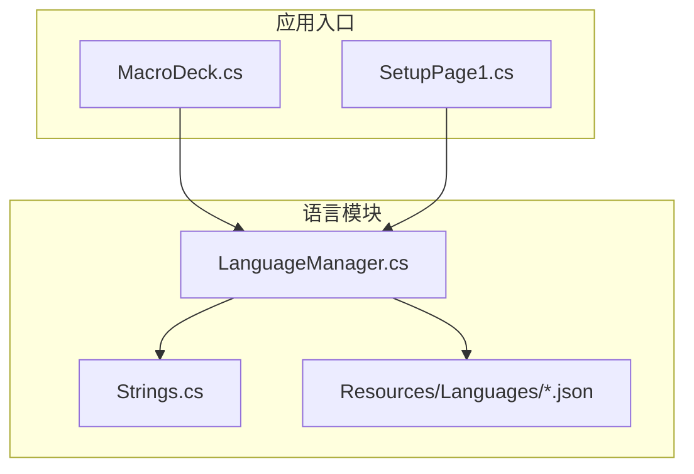
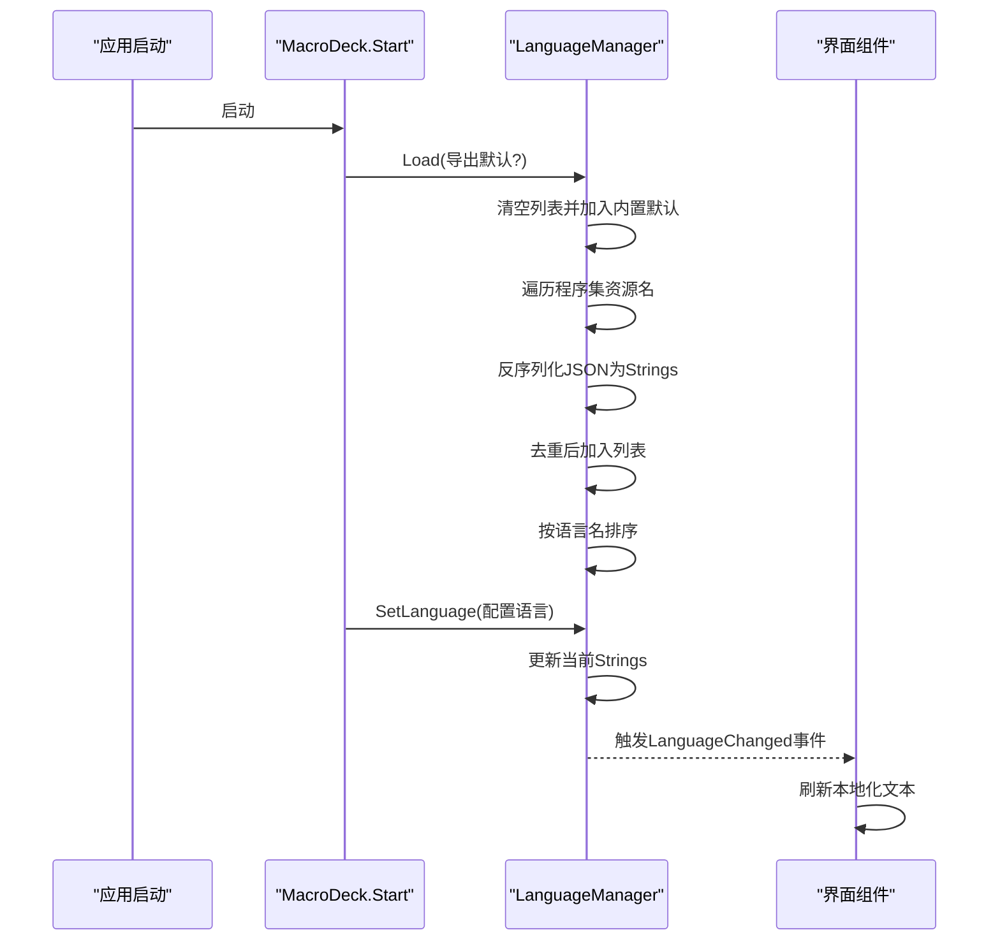
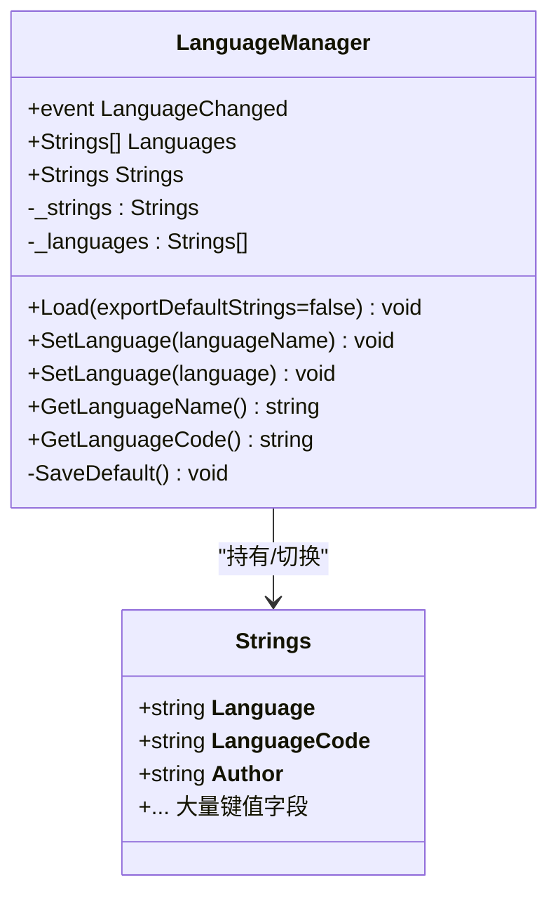
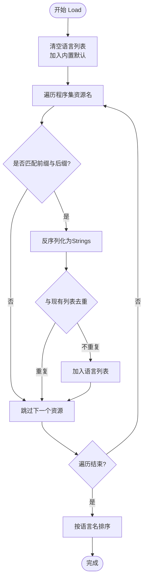
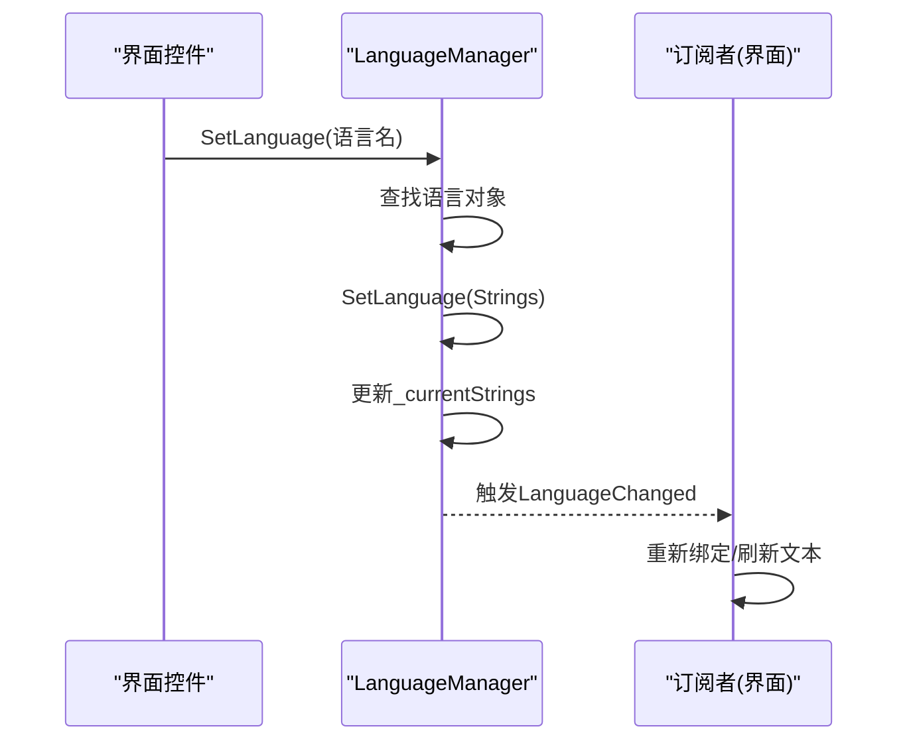
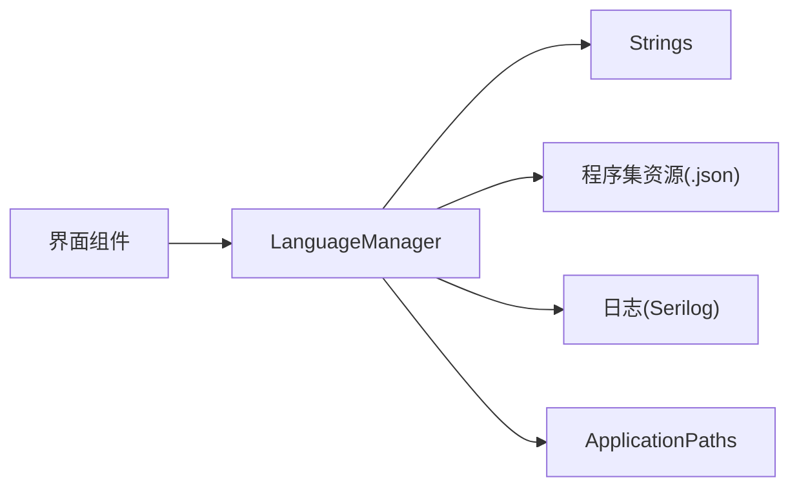

# 语言管理

<cite>
**本文引用的文件**
- [LanguageManager.cs](file://src/MacroDeck/Language/LanguageManager.cs)
- [Strings.cs](file://src/MacroDeck/Language/Strings.cs)
- [English.json](file://src/MacroDeck/Resources/Languages/English.json)
- [German.json](file://src/MacroDeck/Resources/Languages/German.json)
- [MacroDeck.cs](file://src/MacroDeck/MacroDeck.cs)
- [SetupPage1.cs](file://src/MacroDeck/GUI/InitialSetupPages/SetupPage1.cs)
</cite>

## 目录
1. [简介](#简介)
2. [项目结构](#项目结构)
3. [核心组件](#核心组件)
4. [架构总览](#架构总览)
5. [详细组件分析](#详细组件分析)
6. [依赖关系分析](#依赖关系分析)
7. [性能考量](#性能考量)
8. [故障排查指南](#故障排查指南)
9. [结论](#结论)
10. [附录：最佳实践与扩展接口](#附录最佳实践与扩展接口)

## 简介
本文件系统性阐述 Macro-Deck 的语言管理系统，重点围绕 LanguageManager 类的功能与实现，包括：
- 语言文件的发现与加载（含程序集资源自动加载）
- 语言切换与事件通知机制
- 语言列表的排序与去重策略
- 错误处理与日志记录
- 使用方式与扩展接口建议
- 性能优化与最佳实践

## 项目结构
语言管理相关代码位于 src/MacroDeck/Language 目录，配套的语言资源位于 src/MacroDeck/Resources/Languages 下的多个 JSON 文件。应用启动时由主程序调用 LanguageManager 完成语言加载与初始化。

图表来源
- [LanguageManager.cs:1-121](file://src/MacroDeck/Language/LanguageManager.cs#L1-L121)
- [Strings.cs:1-409](file://src/MacroDeck/Language/Strings.cs#L1-L409)
- [MacroDeck.cs:68-105](file://src/MacroDeck/MacroDeck.cs#L68-L105)
- [SetupPage1.cs:1-36](file://src/MacroDeck/GUI/InitialSetupPages/SetupPage1.cs#L1-L36)

章节来源
- [LanguageManager.cs:1-121](file://src/MacroDeck/Language/LanguageManager.cs#L1-L121)
- [Strings.cs:1-409](file://src/MacroDeck/Language/Strings.cs#L1-L409)
- [MacroDeck.cs:68-105](file://src/MacroDeck/MacroDeck.cs#L68-L105)
- [SetupPage1.cs:1-36](file://src/MacroDeck/GUI/InitialSetupPages/SetupPage1.cs#L1-L36)

## 核心组件
- LanguageManager：静态类，负责语言加载、切换、事件通知与当前语言查询。
- Strings：语言字符串模型，包含语言元信息（名称、代码、作者）与大量键值对翻译文本。
- 资源文件：每个语言对应一个 JSON 文件，包含相同键集合，用于运行时动态加载。

章节来源
- [LanguageManager.cs:8-121](file://src/MacroDeck/Language/LanguageManager.cs#L8-L121)
- [Strings.cs:3-409](file://src/MacroDeck/Language/Strings.cs#L3-L409)

## 架构总览
应用启动流程中，主程序在合适时机调用 LanguageManager.Load 加载所有可用语言，并根据配置选择初始语言；随后各 UI 组件通过 LanguageManager.Strings 获取当前语言文本；当用户切换语言时，LanguageManager 触发 LanguageChanged 事件，UI 可订阅该事件以刷新界面。

图表来源
- [MacroDeck.cs:94-105](file://src/MacroDeck/MacroDeck.cs#L94-L105)
- [LanguageManager.cs:20-70](file://src/MacroDeck/Language/LanguageManager.cs#L20-L70)
- [LanguageManager.cs:95-109](file://src/MacroDeck/Language/LanguageManager.cs#L95-L109)

## 详细组件分析

### LanguageManager 类
- 单例式静态设计，内部维护当前语言实例与可用语言列表。
- 提供 Load、SetLanguage、GetLanguageName、GetLanguageCode 等方法。
- 暴露 LanguageChanged 事件，供 UI 订阅以响应语言切换。

图表来源
- [LanguageManager.cs:8-121](file://src/MacroDeck/Language/LanguageManager.cs#L8-L121)
- [Strings.cs:3-409](file://src/MacroDeck/Language/Strings.cs#L3-L409)

章节来源
- [LanguageManager.cs:8-121](file://src/MacroDeck/Language/LanguageManager.cs#L8-L121)
- [Strings.cs:3-409](file://src/MacroDeck/Language/Strings.cs#L3-L409)

### 语言加载与发现机制
- 清空并加入内置默认语言条目。
- 遍历程序集清单资源名，筛选以指定前缀且以 .json 结尾的资源。
- 使用 JSON 反序列化生成 Strings 实例。
- 去重策略：基于 __Language__、__LanguageCode__、__Author__ 三元组判断重复，避免重复添加。
- 排序策略：按 __Language__ 字段进行升序排序。

图表来源
- [LanguageManager.cs:20-70](file://src/MacroDeck/Language/LanguageManager.cs#L20-L70)

章节来源
- [LanguageManager.cs:20-70](file://src/MacroDeck/Language/LanguageManager.cs#L20-L70)

### 语言文件格式与验证
- JSON 格式：包含三个元信息字段与若干键值对。
- 元信息字段：__Language__、__LanguageCode__、__Author__。
- 键集合：与内置 Strings 类定义保持一致（键名相同）。
- 验证要点：
  - 必须包含元信息字段。
  - 键集合应与内置定义兼容，否则运行时访问可能缺失。
  - 建议在开发阶段对 JSON 进行 Schema 校验或单元测试覆盖。

章节来源
- [English.json:1-330](file://src/MacroDeck/Resources/Languages/English.json#L1-L330)
- [German.json:1-330](file://src/MacroDeck/Resources/Languages/German.json#L1-L330)
- [Strings.cs:5-7](file://src/MacroDeck/Language/Strings.cs#L5-L7)

### 语言切换与事件机制
- SetLanguage(string)：按语言名查找并切换。
- SetLanguage(Strings)：直接切换到指定语言对象。
- 切换后更新当前 _strings 并触发 LanguageChanged 事件，订阅者可刷新界面文本。

图表来源
- [LanguageManager.cs:95-109](file://src/MacroDeck/Language/LanguageManager.cs#L95-L109)

章节来源
- [LanguageManager.cs:95-109](file://src/MacroDeck/Language/LanguageManager.cs#L95-L109)

### 语言列表排序与去重逻辑
- 去重：比较 __Language__、__LanguageCode__、__Author__ 三元组，若已存在则跳过。
- 排序：按 __Language__ 升序排列，保证 UI 语言列表稳定有序。

章节来源
- [LanguageManager.cs:51-69](file://src/MacroDeck/Language/LanguageManager.cs#L51-L69)

### 应用启动中的语言初始化
- 主程序在启动早期调用 LanguageManager.Load，并根据配置决定是否导出默认语言文件。
- 若无配置文件，则进入初始设置向导；否则加载配置并调用 LanguageManager.SetLanguage 设置当前语言。

章节来源
- [MacroDeck.cs:94-105](file://src/MacroDeck/MacroDeck.cs#L94-L105)

### 初始设置页面的语言联动
- 初始设置页在加载时填充语言下拉框，选中当前语言，并在用户选择后调用 LanguageManager.SetLanguage 切换语言，同时触发 LanguageChanged 事件。

章节来源
- [SetupPage1.cs:18-34](file://src/MacroDeck/GUI/InitialSetupPages/SetupPage1.cs#L18-L34)

## 依赖关系分析
- LanguageManager 依赖：
  - 程序集资源枚举与 JSON 反序列化能力。
  - 日志组件记录加载与保存过程。
  - ApplicationPaths 获取文件路径（保存默认语言时使用）。
- Strings 作为数据模型，被 LanguageManager 管理与切换。
- UI 组件通过 LanguageManager.Strings 获取文本，订阅 LanguageChanged 事件以刷新显示。

图表来源
- [LanguageManager.cs:1-121](file://src/MacroDeck/Language/LanguageManager.cs#L1-L121)
- [MacroDeck.cs:94-105](file://src/MacroDeck/MacroDeck.cs#L94-L105)

章节来源
- [LanguageManager.cs:1-121](file://src/MacroDeck/Language/LanguageManager.cs#L1-L121)
- [MacroDeck.cs:94-105](file://src/MacroDeck/MacroDeck.cs#L94-L105)

## 性能考量
- 资源加载：仅在启动阶段一次性扫描程序集资源并反序列化，后续切换仅更新内存中的当前语言对象，开销极低。
- 去重与排序：列表规模通常较小（语言数量有限），去重与排序复杂度可忽略。
- I/O：保存默认语言文件仅在显式请求时发生，且为一次性写入。
- 建议：
  - 将语言 JSON 设为“嵌入式资源”，确保打包后可直接通过清单资源名访问。
  - 控制语言文件体积，避免不必要的大字段。
  - 如需热插拔语言包，建议采用外部文件加载并在应用重启后生效，避免频繁磁盘 IO。

[本节为通用性能建议，无需特定文件引用]

## 故障排查指南
- 无法加载语言文件
  - 检查资源名前缀与后缀是否符合约定（前缀为指定命名空间，后缀为 .json）。
  - 确认 JSON 格式正确，包含元信息字段。
  - 查看日志输出，定位异常堆栈。
- 语言切换无效
  - 确认 UI 是否订阅了 LanguageChanged 事件并执行刷新。
  - 检查 SetLanguage 参数是否与语言名一致。
- 默认语言导出失败
  - 检查目标目录权限与路径有效性。
  - 查看日志中的错误信息。

章节来源
- [LanguageManager.cs:34-67](file://src/MacroDeck/Language/LanguageManager.cs#L34-L67)
- [LanguageManager.cs:81-92](file://src/MacroDeck/Language/LanguageManager.cs#L81-L92)

## 结论
LanguageManager 以简洁高效的模式实现了语言资源的自动发现、加载、去重与排序，并通过事件驱动的方式支持 UI 动态刷新。其设计遵循“静态单例 + 内存缓存”的思路，适合桌面应用的本地化场景。配合规范化的语言 JSON 文件与严格的元信息校验，可确保多语言体验的稳定性与一致性。

[本节为总结性内容，无需特定文件引用]

## 附录：最佳实践与扩展接口

### 最佳实践
- 语言文件命名与组织
  - 保持资源名前缀与后缀规范，便于自动发现。
  - JSON 文件结构与键集合与内置 Strings 保持一致。
- 错误处理与日志
  - 对资源加载与 JSON 反序列化进行异常捕获与日志记录。
  - 在 UI 中提供降级显示（如回退到英文）。
- 性能优化
  - 避免在 UI 线程中执行 I/O 或复杂计算。
  - 语言切换尽量在后台线程完成，再通过主线程刷新 UI。
- 版本兼容
  - 新增键时需同步更新默认语言文件与所有已发布语言文件。
  - 通过 __Author__ 字段标识来源，便于区分官方与第三方语言包。

### 扩展接口建议
- 外部语言包支持
  - 增加从外部目录加载语言文件的能力，优先级低于内置资源。
  - 支持语言包安装/卸载与版本管理。
- 动态热更新
  - 提供语言包热加载接口，在应用运行时替换当前语言对象并触发事件。
- 语言文件校验
  - 增加 JSON Schema 校验与键集合完整性检查。
  - 提供语言文件导入/导出工具，便于翻译协作。

[本节为概念性建议，无需特定文件引用]