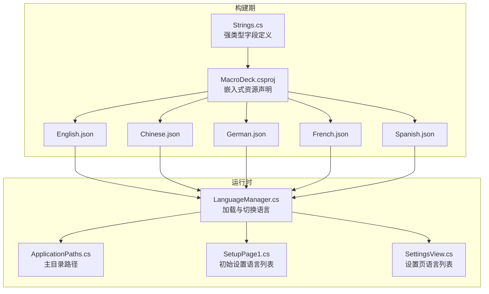
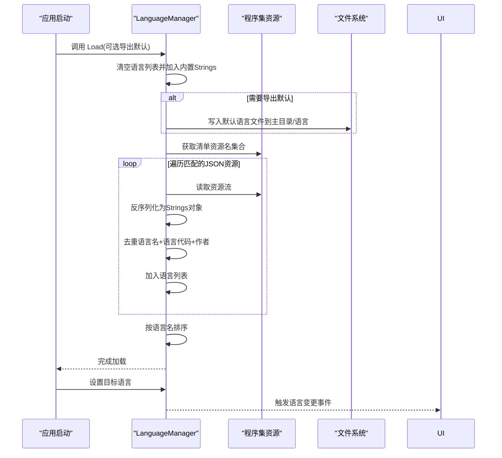
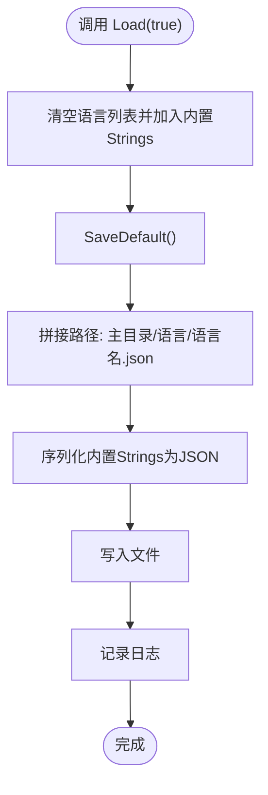
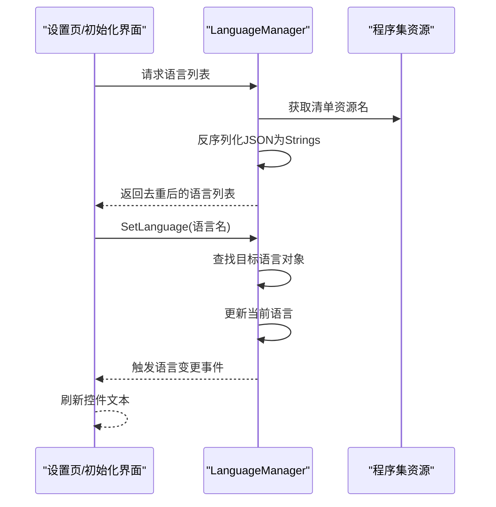
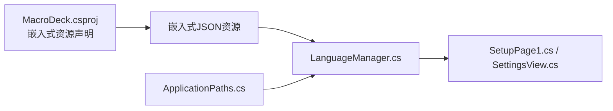

# 资源文件管理

<cite>
**本文引用的文件**
- [Strings.cs](file://src/MacroDeck/Language/Strings.cs)
- [LanguageManager.cs](file://src/MacroDeck/Language/LanguageManager.cs)
- [English.json](file://src/MacroDeck/Resources/Languages/English.json)
- [Chinese.json](file://src/MacroDeck/Resources/Languages/Chinese.json)
- [German.json](file://src/MacroDeck/Resources/Languages/German.json)
- [French.json](file://src/MacroDeck/Resources/Languages/French.json)
- [Spanish.json](file://src/MacroDeck/Resources/Languages/Spanish.json)
- [MacroDeck.csproj](file://src/MacroDeck/MacroDeck.csproj)
- [ApplicationPaths.cs](file://src/MacroDeck/StartupConfig/ApplicationPaths.cs)
- [SetupPage1.cs](file://src/MacroDeck/GUI/InitialSetupPages/SetupPage1.cs)
- [SettingsView.cs](file://src/MacroDeck/GUI/MainWindowViews/SettingsView.cs)
</cite>

## 目录
1. [简介](#简介)
2. [项目结构](#项目结构)
3. [核心组件](#核心组件)
4. [架构总览](#架构总览)
5. [详细组件分析](#详细组件分析)
6. [依赖关系分析](#依赖关系分析)
7. [性能考量](#性能考量)
8. [故障排查指南](#故障排查指南)
9. [结论](#结论)
10. [附录](#附录)

## 简介
本文件面向翻译人员与维护者，系统性阐述 Macro-Deck 的语言资源文件管理机制。内容涵盖语言 JSON 文件的结构与命名约定、Strings 类的字段定义与语言元数据、语言文件的标准格式与校验规则、默认语言文件的导出流程与保存位置、以及语言文件的创建、编辑与维护最佳实践。

## 项目结构
语言资源采用“代码类 + 嵌入式 JSON 资源”的双轨设计：
- 运行时通过 C# 类（Strings）提供强类型访问；
- 构建期将多语言 JSON 文件作为嵌入式资源打包；
- 运行时由语言管理器加载嵌入式资源并实例化为 Strings 对象，供界面与逻辑使用。

**图表来源**
- [Strings.cs](file://src/MacroDeck/Language/Strings.cs)
- [LanguageManager.cs](file://src/MacroDeck/Language/LanguageManager.cs)
- [MacroDeck.csproj](file://src/MacroDeck/MacroDeck.csproj)
- [ApplicationPaths.cs](file://src/MacroDeck/StartupConfig/ApplicationPaths.cs)
- [SetupPage1.cs](file://src/MacroDeck/GUI/InitialSetupPages/SetupPage1.cs)
- [SettingsView.cs](file://src/MacroDeck/GUI/MainWindowViews/SettingsView.cs)

**章节来源**
- [Strings.cs:1-409](file://src/MacroDeck/Language/Strings.cs#L1-L409)
- [LanguageManager.cs:1-121](file://src/MacroDeck/Language/LanguageManager.cs#L1-L121)
- [MacroDeck.csproj:331-362](file://src/MacroDeck/MacroDeck.csproj#L331-L362)
- [ApplicationPaths.cs:1-143](file://src/MacroDeck/StartupConfig/ApplicationPaths.cs#L1-L143)
- [SetupPage1.cs:25-36](file://src/MacroDeck/GUI/InitialSetupPages/SetupPage1.cs#L25-L36)
- [SettingsView.cs:60-259](file://src/MacroDeck/GUI/MainWindowViews/SettingsView.cs#L60-L259)

## 核心组件
- Strings 类：定义所有可本地化的键（字段），并包含语言元数据字段（语言名、语言代码、作者）。该类在运行时被反序列化为具体语言对象。
- LanguageManager：负责加载嵌入式语言资源、去重排序、保存默认语言文件、切换当前语言并广播变更事件。
- 语言 JSON 文件：遵循固定元数据键与键值对集合的结构，作为嵌入式资源参与构建与运行时加载。

**章节来源**
- [Strings.cs:3-6](file://src/MacroDeck/Language/Strings.cs#L3-L6)
- [LanguageManager.cs:8-17](file://src/MacroDeck/Language/LanguageManager.cs#L8-L17)
- [English.json:1-5](file://src/MacroDeck/Resources/Languages/English.json#L1-L5)

## 架构总览
语言资源的加载与使用流程如下：

**图表来源**
- [LanguageManager.cs:20-70](file://src/MacroDeck/Language/LanguageManager.cs#L20-L70)
- [LanguageManager.cs:72-93](file://src/MacroDeck/Language/LanguageManager.cs#L72-L93)

**章节来源**
- [LanguageManager.cs:20-120](file://src/MacroDeck/Language/LanguageManager.cs#L20-L120)

## 详细组件分析

### 语言 JSON 文件结构与命名约定
- 元数据键
  - __Language__：语言显示名称（例如 "English"）
  - __LanguageCode__：语言代码（例如 "en"）
  - __Author__：该语言文件的作者或翻译贡献者（例如 "Macro Deck" 或第三方译者）
- 键值对集合：其余均为字符串键与其对应的本地化文本；键名通常与 Strings 类中的字段一致。
- 文件命名：Resources/Languages/<语言名>.json（例如 English.json、Chinese.json、German.json 等）。
- 嵌入方式：通过项目文件将各语言 JSON 声明为嵌入式资源，随应用一起分发。

**章节来源**
- [English.json:1-5](file://src/MacroDeck/Resources/Languages/English.json#L1-L5)
- [Chinese.json:1-5](file://src/MacroDeck/Resources/Languages/Chinese.json#L1-L5)
- [German.json:1-5](file://src/MacroDeck/Resources/Languages/German.json#L1-L5)
- [MacroDeck.csproj:331-362](file://src/MacroDeck/MacroDeck.csproj#L331-L362)

### Strings 类字段定义与语言元数据
- 字段类型：public string
- 语言元数据字段
  - __Language__：用于 UI 显示的语言名称
  - __LanguageCode__：ISO 风格的语言代码
  - __Author__：作者或翻译者
- 业务键：大量 UI 文本、提示、菜单项、对话框标题与内容等，均以字段形式提供，便于强类型访问与重构安全。

**章节来源**
- [Strings.cs:3-6](file://src/MacroDeck/Language/Strings.cs#L3-L6)
- [Strings.cs:9-408](file://src/MacroDeck/Language/Strings.cs#L9-L408)

### 语言文件的标准格式与校验规则
- 必须包含元数据键：__Language__、__LanguageCode__、__Author__
- 键名必须为字符串，值必须为字符串（支持换行符与转义）
- 建议保持键名与 Strings 类字段一致，避免运行时缺失导致回退或异常
- 建议统一缩进与格式化，便于版本控制对比
- 建议保留未翻译键（空字符串或占位符），以便后续完善

**章节来源**
- [English.json:1-330](file://src/MacroDeck/Resources/Languages/English.json#L1-L330)
- [Chinese.json:1-323](file://src/MacroDeck/Resources/Languages/Chinese.json#L1-L323)
- [German.json:1-330](file://src/MacroDeck/Resources/Languages/German.json#L1-L330)

### 语言文件的组织方式与嵌套结构
- 顶层为键值对对象
- 无显式嵌套结构；所有键均为一维映射
- 建议按功能模块分组键名（如网络、设置、备份、插件等），提升可读性与维护效率

**章节来源**
- [English.json:1-330](file://src/MacroDeck/Resources/Languages/English.json#L1-L330)
- [French.json:1-200](file://src/MacroDeck/Resources/Languages/French.json#L1-L200)
- [Spanish.json:1-200](file://src/MacroDeck/Resources/Languages/Spanish.json#L1-L200)

### 默认语言文件的导出机制与保存位置
- 导出触发：调用 Load(true) 时，若需要导出默认语言文件
- 导出实现：将内置 Strings 实例序列化为 JSON，写入主目录下的 Language 子目录
- 保存位置：主目录/语言/<语言名>.json（例如 主目录/语言/English.json）

**图表来源**
- [LanguageManager.cs:20-27](file://src/MacroDeck/Language/LanguageManager.cs#L20-L27)
- [LanguageManager.cs:72-93](file://src/MacroDeck/Language/LanguageManager.cs#L72-L93)
- [ApplicationPaths.cs:29-34](file://src/MacroDeck/StartupConfig/ApplicationPaths.cs#L29-L34)

**章节来源**
- [LanguageManager.cs:20-93](file://src/MacroDeck/Language/LanguageManager.cs#L20-L93)
- [ApplicationPaths.cs:29-34](file://src/MacroDeck/StartupConfig/ApplicationPaths.cs#L29-L34)

### 语言文件的创建、编辑与维护指南
- 创建步骤
  - 复制一个现有语言 JSON 文件作为模板
  - 修改元数据键：__Language__、__LanguageCode__、__Author__
  - 逐项对照 Strings.cs 字段，补充缺失键值
  - 将新文件加入项目并声明为嵌入式资源
- 编辑建议
  - 使用支持 JSON 校验的编辑器（如 VS Code、Rider）
  - 保持键名与 Strings.cs 一致，避免遗漏
  - 统一处理换行与转义字符，确保跨平台显示一致
- 维护策略
  - 定期同步 Strings.cs 新增字段
  - 通过 UI 验证关键界面文本显示
  - 提供“未翻译”占位，逐步完善

**章节来源**
- [Strings.cs:1-409](file://src/MacroDeck/Language/Strings.cs#L1-L409)
- [MacroDeck.csproj:331-362](file://src/MacroDeck/MacroDeck.csproj#L331-L362)

### 语言文件的编码规范与格式验证
- 编码：UTF-8（推荐）
- 结构：严格 JSON 格式，键名与字符串值必须使用双引号
- 校验要点
  - 元数据键齐全且类型正确
  - 所有键值为字符串
  - 无语法错误（逗号、括号、转义）
- 自动化建议
  - 在 CI 中增加 JSON 语法校验
  - 对比 Strings.cs 与 JSON 键集合，检测缺失或冗余

**章节来源**
- [English.json:1-330](file://src/MacroDeck/Resources/Languages/English.json#L1-L330)
- [Chinese.json:1-323](file://src/MacroDeck/Resources/Languages/Chinese.json#L1-L323)
- [German.json:1-330](file://src/MacroDeck/Resources/Languages/German.json#L1-L330)

### 语言文件的加载与切换流程
- 加载流程
  - 清空语言列表并加入内置 Strings
  - 遍历程序集清单资源，筛选以 SuchByte.MacroDeck.Resources.Languages. 开头且以 .json 结尾的资源
  - 反序列化为 Strings 对象，按语言名、语言代码、作者去重后加入列表
  - 按语言名排序
- 切换流程
  - 通过语言名查找目标语言对象
  - 更新当前语言并触发语言变更事件
  - UI 组件响应事件刷新显示

**图表来源**
- [LanguageManager.cs:20-70](file://src/MacroDeck/Language/LanguageManager.cs#L20-L70)
- [LanguageManager.cs:95-109](file://src/MacroDeck/Language/LanguageManager.cs#L95-L109)
- [SetupPage1.cs:25-36](file://src/MacroDeck/GUI/InitialSetupPages/SetupPage1.cs#L25-L36)
- [SettingsView.cs:91-102](file://src/MacroDeck/GUI/MainWindowViews/SettingsView.cs#L91-L102)

**章节来源**
- [LanguageManager.cs:20-120](file://src/MacroDeck/Language/LanguageManager.cs#L20-L120)
- [SetupPage1.cs:25-36](file://src/MacroDeck/GUI/InitialSetupPages/SetupPage1.cs#L25-L36)
- [SettingsView.cs:91-102](file://src/MacroDeck/GUI/MainWindowViews/SettingsView.cs#L91-L102)

## 依赖关系分析
- 语言 JSON 文件依赖于项目文件中的嵌入式资源声明
- LanguageManager 依赖 ApplicationPaths 提供的主目录路径
- UI 组件依赖 LanguageManager 的语言列表与当前语言对象

**图表来源**
- [MacroDeck.csproj:331-362](file://src/MacroDeck/MacroDeck.csproj#L331-L362)
- [LanguageManager.cs:30-70](file://src/MacroDeck/Language/LanguageManager.cs#L30-L70)
- [ApplicationPaths.cs:29-34](file://src/MacroDeck/StartupConfig/ApplicationPaths.cs#L29-L34)
- [SetupPage1.cs:25-36](file://src/MacroDeck/GUI/InitialSetupPages/SetupPage1.cs#L25-L36)
- [SettingsView.cs:91-102](file://src/MacroDeck/GUI/MainWindowViews/SettingsView.cs#L91-L102)

**章节来源**
- [MacroDeck.csproj:331-362](file://src/MacroDeck/MacroDeck.csproj#L331-L362)
- [LanguageManager.cs:30-70](file://src/MacroDeck/Language/LanguageManager.cs#L30-L70)
- [ApplicationPaths.cs:29-34](file://src/MacroDeck/StartupConfig/ApplicationPaths.cs#L29-L34)
- [SetupPage1.cs:25-36](file://src/MacroDeck/GUI/InitialSetupPages/SetupPage1.cs#L25-L36)
- [SettingsView.cs:91-102](file://src/MacroDeck/GUI/MainWindowViews/SettingsView.cs#L91-L102)

## 性能考量
- 嵌入式资源加载：首次启动时一次性遍历清单资源并反序列化，建议保持 JSON 文件数量与体积合理，避免启动时长显著增加
- 去重与排序：按语言名、语言代码、作者三元组去重并排序，保证 UI 列表稳定有序
- 序列化配置：默认忽略空值并格式化输出，兼顾体积与可读性

**章节来源**
- [LanguageManager.cs:30-70](file://src/MacroDeck/Language/LanguageManager.cs#L30-L70)
- [LanguageManager.cs:72-93](file://src/MacroDeck/Language/LanguageManager.cs#L72-L93)

## 故障排查指南
- 语言资源未加载
  - 检查项目文件是否正确声明嵌入式资源
  - 确认资源名前缀与后缀符合约定
  - 查看日志中“Failed to load language resource”相关条目
- 语言切换无效
  - 确认目标语言对象存在于语言列表
  - 检查语言变更事件是否被 UI 订阅
- 默认语言导出失败
  - 检查主目录权限与路径拼接
  - 关注序列化异常日志

**章节来源**
- [LanguageManager.cs:30-70](file://src/MacroDeck/Language/LanguageManager.cs#L30-L70)
- [LanguageManager.cs:72-93](file://src/MacroDeck/Language/LanguageManager.cs#L72-L93)

## 结论
Macro-Deck 的语言资源体系通过“强类型类 + 嵌入式 JSON 资源”的组合，实现了稳定的多语言支持与灵活的扩展能力。遵循本文档的结构约定、编码规范与维护流程，可确保翻译质量与用户体验的一致性。

## 附录
- 示例语言文件参考
  - [English.json](file://src/MacroDeck/Resources/Languages/English.json)
  - [Chinese.json](file://src/MacroDeck/Resources/Languages/Chinese.json)
  - [German.json](file://src/MacroDeck/Resources/Languages/German.json)
  - [French.json](file://src/MacroDeck/Resources/Languages/French.json)
  - [Spanish.json](file://src/MacroDeck/Resources/Languages/Spanish.json)