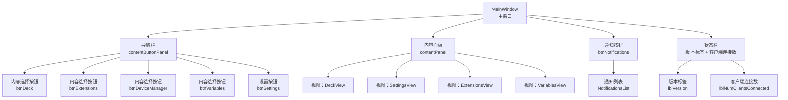
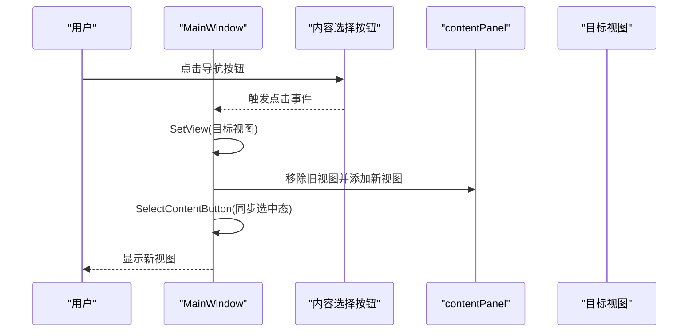
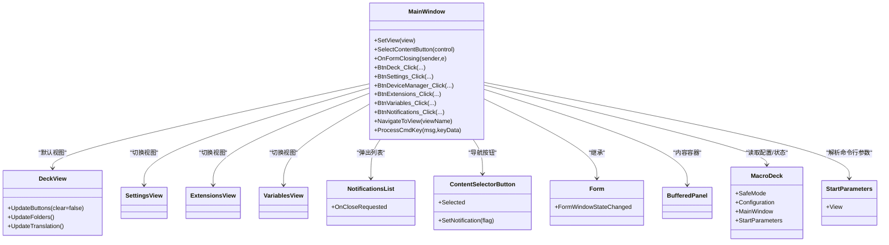

# 主窗口设计

<cite>
**本文档引用的文件**
- [MainWindow.cs](file://src/MacroDeck/GUI/MainWindow.cs)
- [MainWindow.Designer.cs](file://src/MacroDeck/GUI/MainWindow.Designer.cs)
- [MainWindow.resx](file://src/MacroDeck/GUI/MainWindow.resx)
- [DeckView.cs](file://src/MacroDeck/GUI/MainWindowViews/DeckView.cs)
- [ContentSelectorButton.cs](file://src/MacroDeck/GUI/CustomControls/ContentSelectorButton.cs)
- [NotificationsList.cs](file://src/MacroDeck/GUI/CustomControls/Notifications/NotificationsList.cs)
- [Form.cs](file://src/MacroDeck/GUI/CustomControls/Form.cs)
- [BufferedPanel.cs](file://src/MacroDeck/GUI/CustomControls/BufferedPanel.cs)
- [SettingsView.cs](file://src/MacroDeck/GUI/MainWindowViews/SettingsView.cs)
- [ExtensionsView.cs](file://src/MacroDeck/GUI/MainWindowViews/ExtensionsView.cs)
- [VariablesView.cs](file://src/MacroDeck/GUI/MainWindowViews/VariablesView.cs)
- [MacroDeck.cs](file://src/MacroDeck/MacroDeck.cs)
- [Program.cs](file://src/MacroDeck/Program.cs)
- [StartParameters.cs](file://src/MacroDeck/StartupConfig/StartParameters.cs)
</cite>

## 更新摘要
**所做更改**
- 更新了主窗口尺寸规格，从 1200x635 增加到 1440x762 像素
- 重新定位和扩展了状态栏区域，包含版本标签和客户端连接数
- 移除了 Discord 和捐赠按钮的界面元素
- 新增了调试便利功能：--view 命令行参数和 Ctrl+1~5 快捷键
- 更新了导航栏布局和控件排列方式

## 目录
1. [简介](#简介)
2. [项目结构](#项目结构)
3. [核心组件](#核心组件)
4. [架构总览](#架构总览)
5. [详细组件分析](#详细组件分析)
6. [依赖关系分析](#依赖关系分析)
7. [性能考量](#性能考量)
8. [故障排查指南](#故障排查指南)
9. [结论](#结论)

## 简介
本文档面向 Macro-Deck 主窗口（MainWindow）的实现与使用，围绕以下目标展开：窗口初始化、布局设计与事件处理；导航系统（内容选择按钮、视图切换逻辑与状态管理）；窗口生命周期（加载、显示、关闭）；通知系统集成（通知计数与弹出列表管理）；窗口尺寸与位置管理及多显示器支持；安全模式下的特殊处理与用户体验优化；以及与各子组件（视图、控件、服务）的交互与数据绑定。

**更新** 主窗口布局已进行重大调整，包括尺寸扩大、状态栏重新定位、Discord和捐赠按钮移除，以及新增调试便利功能。

## 项目结构
MainWindow 位于 GUI 层，采用 WinForms 设计，配合自定义控件与视图模块完成界面组织与交互。其核心职责是承载导航栏、内容面板与通知入口，并在运行时动态切换视图、响应语言与更新事件、维护安全模式下的行为。

**图表来源**
- [MainWindow.Designer.cs:266-288](file://src/MacroDeck/GUI/MainWindow.Designer.cs#L266-L288)
- [MainWindow.cs:39-49](file://src/MacroDeck/GUI/MainWindow.cs#L39-L49)

**章节来源**
- [MainWindow.Designer.cs:266-288](file://src/MacroDeck/GUI/MainWindow.Designer.cs#L266-L288)
- [MainWindow.cs:39-49](file://src/MacroDeck/GUI/MainWindow.cs#L39-L49)

## 核心组件
- 主窗口类：负责窗口初始化、事件订阅、视图切换、通知集成、安全模式提示等。
- 内容选择按钮：用于导航，具备选中态与通知指示。
- 视图集合：DeckView（仪表板）、SettingsView（设置）、ExtensionsView（扩展商店/已安装）、VariablesView（变量）。
- 通知系统：通知计数与弹出列表，支持动态增删。
- 调试便利功能：--view 命令行参数和 Ctrl+1~5 快捷键，支持快速视图导航。
- 自定义控件：Form（扩展窗口消息处理）、BufferedPanel（双缓冲渲染）、ContentSelectorButton（导航按钮）。

**更新** 新增了调试便利功能，移除了 Discord 和捐赠按钮的界面元素。

**章节来源**
- [MainWindow.cs:39-49](file://src/MacroDeck/GUI/MainWindow.cs#L39-L49)
- [MainWindow.Designer.cs:266-288](file://src/MacroDeck/GUI/MainWindow.Designer.cs#L266-L288)
- [ContentSelectorButton.cs:1-69](file://src/MacroDeck/GUI/CustomControls/ContentSelectorButton.cs#L1-L69)
- [NotificationsList.cs:1-52](file://src/MacroDeck/GUI/CustomControls/Notifications/NotificationsList.cs#L1-L52)
- [Form.cs:1-35](file://src/MacroDeck/GUI/CustomControls/Form.cs#L1-L35)
- [BufferedPanel.cs:1-18](file://src/MacroDeck/GUI/CustomControls/BufferedPanel.cs#L1-L18)

## 架构总览
MainWindow 通过事件驱动的方式与多个服务和视图协作：语言变更、更新可用、设备连接状态、插件与图标包更新检查、通知管理、扩展安装完成等。视图切换采用"内容面板仅保留当前视图"的策略，确保资源回收与状态隔离。

**图表来源**
- [MainWindow.cs:123-168](file://src/MacroDeck/GUI/MainWindow.cs#L123-L168)
- [MainWindow.Designer.cs:308-318](file://src/MacroDeck/GUI/MainWindow.Designer.cs#L308-L318)

## 详细组件分析

### 主窗口类（MainWindow）
- 初始化与事件绑定
  - 在构造函数中初始化组件、设置通知按钮透明背景、注册语言变更与更新可用事件、订阅窗口显示事件，并创建初始的 DeckView。
  - 加载阶段订阅插件与图标包变更、设备连接状态变化、通知新增/移除、扩展安装完成等事件。
- 导航与视图切换
  - SetView 负责清理非目标视图并添加新视图；SelectContentButton 同步导航按钮选中态。
  - 每个视图对应一个内容选择按钮，切换时自动更新选中状态。
- 生命周期事件
  - Shown 阶段执行：刷新插件标签、进入安全模式时高亮背景并弹窗提示、默认打开 DeckView、检查 --view 参数进行视图导航、显示通知计数、触发更新对话框（如有）。
  - FormClosing 清理 contentPanel 中所有控件。
- 通知系统
  - 通知按钮计数由 NotificationManager 统一维护；点击弹出 NotificationsList，位置基于通知按钮坐标计算，随窗口关闭自动移除。
- 安全模式与用户体验
  - SafeMode 下背景色变红并弹出提示，避免误操作导致动作按钮配置被保存。
- 调试便利功能
  - --view 命令行参数：启动时直接跳转到指定视图（deck/1, extensions/2, settings/3, devices/4, variables/5）。
  - Ctrl+1~5 快捷键：在运行时快速切换到对应视图。
- 多组件交互
  - 与 MacroDeck、UpdateService、NotificationManager、PluginManager、IconManager、MacroDeckServer 等进行事件联动。

**更新** 新增了 --view 命令行参数和 Ctrl+1~5 快捷键的调试功能，移除了 Discord 和捐赠按钮的界面元素。

**章节来源**
- [MainWindow.cs:39-49](file://src/MacroDeck/GUI/MainWindow.cs#L39-L49)
- [MainWindow.cs:177-214](file://src/MacroDeck/GUI/MainWindow.cs#L177-L214)
- [MainWindow.cs:223-239](file://src/MacroDeck/GUI/MainWindow.cs#L223-L239)
- [MainWindow.cs:246-249](file://src/MacroDeck/GUI/MainWindow.cs#L246-L249)
- [MainWindow.cs:256-259](file://src/MacroDeck/GUI/MainWindow.cs#L256-L259)
- [MainWindow.cs:421-431](file://src/MacroDeck/GUI/MainWindow.cs#L421-L431)
- [MainWindow.cs:434-450](file://src/MacroDeck/GUI/MainWindow.cs#L434-L450)
- [MainWindow.Designer.cs:308-318](file://src/MacroDeck/GUI/MainWindow.Designer.cs#L308-L318)

### 内容选择按钮（ContentSelectorButton）
- 功能要点
  - 支持 Selected 属性控制选中态与绘制；支持 SetNotification 控制右上角红点提示。
  - 鼠标悬停时绘制高亮竖条，选中态绘制强调色竖条。
- 使用场景
  - MainWindow 的导航栏内每个按钮均继承该类型，用于 Deck/Extensions/DeviceManager/Variables/Settings 的切换。

**章节来源**
- [ContentSelectorButton.cs:1-69](file://src/MacroDeck/GUI/CustomControls/ContentSelectorButton.cs#L1-L69)

### 通知系统（NotificationsList）
- 功能要点
  - 订阅 NotificationManager 的新增与移除事件，动态添加或移除通知项。
  - 当通知列表为空时，触发 OnCloseRequested 以关闭弹出层。
- 与主窗口集成
  - MainWindow 在点击通知按钮时创建/显示/隐藏通知列表，并根据按钮位置定位。

**章节来源**
- [NotificationsList.cs:1-52](file://src/MacroDeck/GUI/CustomControls/Notifications/NotificationsList.cs#L1-L52)
- [MainWindow.cs:389-415](file://src/MacroDeck/GUI/MainWindow.cs#L389-L415)

### 视图组件

#### 仪表板视图（DeckView）
- 职责
  - 呈现动作按钮网格、文件夹树、网络信息与端口信息；支持翻译更新。
  - 监听主窗口 ResizeEnd 与 FormWindowStateChanged 事件以重新布局按钮。
- 关键行为
  - UpdateButtons 根据面板尺寸与行列/间距参数计算按钮尺寸，避免最小化时负尺寸导致布局异常。
  - HandleCreated/HandleDestroyed 注册/注销主窗口事件，保证窗口状态变化时刷新布局。
- 与主窗口交互
  - 通过 MainWindow 的事件回调触发按钮刷新。
- **更新** 移除了 Discord 和捐赠按钮，简化了界面布局。

**章节来源**
- [DeckView.cs:36-52](file://src/MacroDeck/GUI/MainWindowViews/DeckView.cs#L36-L52)
- [DeckView.cs:72-86](file://src/MacroDeck/GUI/MainWindowViews/DeckView.cs#L72-L86)
- [DeckView.cs:143-200](file://src/MacroDeck/GUI/MainWindowViews/DeckView.cs#L143-L200)

#### 设置视图（SettingsView）
- 职责
  - 提供通用设置、连接配置、更新通道、备份管理、语言与错误报告等选项。
  - 通过垂直标签页组织内容，支持通知标记（如更新可用时在特定页显示）。
- 数据绑定与持久化
  - 读取/写入配置项，保存到主配置路径；部分设置即时生效并同步到服务。

**章节来源**
- [SettingsView.cs:21-35](file://src/MacroDeck/GUI/MainWindowViews/SettingsView.cs#L21-L35)
- [SettingsView.cs:73-89](file://src/MacroDeck/GUI/MainWindowViews/SettingsView.cs#L73-L89)
- [SettingsView.cs:104-135](file://src/MacroDeck/GUI/MainWindowViews/SettingsView.cs#L104-L135)

#### 扩展视图（ExtensionsView）
- 职责
  - 切换在线商店与已安装扩展两种模式，支持本地 ZIP 安装流程。
- 视图切换
  - 通过内部方法在 ExtensionStoreView、InstalledExtensionsView、ExtensionZipInstallerView 之间切换。

**章节来源**
- [ExtensionsView.cs:12-19](file://src/MacroDeck/GUI/MainWindowViews/ExtensionsView.cs#L12-L19)
- [ExtensionsView.cs:22-80](file://src/MacroDeck/GUI/MainWindowViews/ExtensionsView.cs#L22-L80)

#### 变量视图（VariablesView）
- 职责
  - 展示与管理变量，支持按创建者过滤、增删改查。
- 交互
  - 订阅 VariableManager 的变量变更/移除事件，动态更新列表与过滤器。

**章节来源**
- [VariablesView.cs:12-29](file://src/MacroDeck/GUI/MainWindowViews/VariablesView.cs#L12-L29)
- [VariablesView.cs:89-141](file://src/MacroDeck/GUI/MainWindowViews/VariablesView.cs#L89-L141)

### 自定义控件

#### Form（窗口基类）
- 职责
  - 拦截窗口状态变化消息，向外部广播 FormWindowStateChanged 事件；支持 ESC 关闭窗口。
- 与 DeckView 的交互
  - DeckView 在 HandleCreated/HandleDestroyed 中订阅/取消订阅该事件，以便在窗口状态变化时刷新按钮布局。

**章节来源**
- [Form.cs:12-22](file://src/MacroDeck/GUI/CustomControls/Form.cs#L12-L22)
- [DeckView.cs:72-76](file://src/MacroDeck/GUI/MainWindowViews/DeckView.cs#L72-L76)

#### BufferedPanel（内容面板）
- 职责
  - 开启双缓冲与优化重绘属性，提升复杂内容渲染性能。

**章节来源**
- [BufferedPanel.cs:1-18](file://src/MacroDeck/GUI/CustomControls/BufferedPanel.cs#L1-L18)

### 窗口布局与尺寸管理
- 布局结构
  - 左侧导航栏（contentButtonPanel）包含通知按钮与内容选择按钮；右侧内容面板（contentPanel）承载视图。
  - 底部版本号与客户端连接数标签；右下角社交按钮区。
- 尺寸与 DPI
  - 窗口设置 DPI 缩放与最小尺寸，确保在高 DPI 下保持可读性与可用性。
  - 主窗口尺寸从 1200x635 增加到 1440x762 像素。
- 多显示器支持
  - 通过 CenterToScreen 在首次加载时居中显示，适配多屏环境。
- **更新** 状态栏区域重新定位和扩展，包含版本标签和客户端连接数显示。

**章节来源**
- [MainWindow.Designer.cs:266-288](file://src/MacroDeck/GUI/MainWindow.Designer.cs#L266-L288)
- [MainWindow.Designer.cs:282-290](file://src/MacroDeck/GUI/MainWindow.Designer.cs#L282-L290)
- [MainWindow.Designer.cs:275-276](file://src/MacroDeck/GUI/MainWindow.Designer.cs#L275-L276)

### 安全模式与用户体验优化
- 安全模式
  - SafeMode 为真时，主窗口背景变为红色并弹窗提示，防止误操作导致动作按钮配置被保存。
- 用户体验
  - 插件与图标包更新检测后在扩展按钮显示通知标记；更新可用时弹出更新对话框；通知列表自动跟随按钮位置显示/隐藏。
- **更新** 新增调试便利功能，支持命令行参数和快捷键快速导航。

**章节来源**
- [MainWindow.cs:182-190](file://src/MacroDeck/GUI/MainWindow.cs#L182-L190)
- [MainWindow.cs:195-197](file://src/MacroDeck/GUI/MainWindow.cs#L195-L197)
- [MainWindow.cs:208-213](file://src/MacroDeck/GUI/MainWindow.cs#L208-L213)
- [MainWindow.cs:421-431](file://src/MacroDeck/GUI/MainWindow.cs#L421-L431)

### 调试便利功能
- --view 命令行参数
  - 支持的视图名称：deck/1, extensions/2, settings/3, devices/4, variables/5
  - 在主窗口显示时自动导航到指定视图
- Ctrl+1~5 快捷键
  - Control+1：导航到 DeckView
  - Control+2：导航到 ExtensionsView
  - Control+3：导航到 SettingsView
  - Control+4：导航到 DeviceManagerView
  - Control+5：导航到 VariablesView
- 实现机制
  - NavigateToView 方法统一处理视图导航逻辑
  - ProcessCmdKey 方法拦截快捷键事件

**新增** 调试便利功能显著提升了开发和测试效率。

**章节来源**
- [StartParameters.cs:36-37](file://src/MacroDeck/StartupConfig/StartParameters.cs#L36-L37)
- [MainWindow.cs:421-431](file://src/MacroDeck/GUI/MainWindow.cs#L421-L431)
- [MainWindow.cs:434-450](file://src/MacroDeck/GUI/MainWindow.cs#L434-L450)

### 与其他组件的交互与数据绑定
- 语言与更新
  - 语言变更事件触发翻译更新；更新可用事件触发更新对话框。
- 设备与插件
  - 设备连接状态变化更新连接数标签；插件/图标包更新检查完成后刷新扩展按钮通知。
- 通知
  - 通知新增/移除事件驱动通知按钮计数与通知列表项增删。
- 扩展安装
  - 扩展安装完成后刷新插件标签。
- **更新** 移除了 Discord 和捐赠按钮的交互逻辑。

**章节来源**
- [MainWindow.cs:94-98](file://src/MacroDeck/GUI/MainWindow.cs#L94-L98)
- [MainWindow.cs:227-236](file://src/MacroDeck/GUI/MainWindow.cs#L227-L236)
- [MainWindow.cs:276-279](file://src/MacroDeck/GUI/MainWindow.cs#L276-L279)
- [MainWindow.cs:307-312](file://src/MacroDeck/GUI/MainWindow.cs#L307-L312)

## 依赖关系分析

**图表来源**
- [MainWindow.cs:123-168](file://src/MacroDeck/GUI/MainWindow.cs#L123-L168)
- [MainWindow.Designer.cs:308-318](file://src/MacroDeck/GUI/MainWindow.Designer.cs#L308-L318)
- [DeckView.cs:36-52](file://src/MacroDeck/GUI/MainWindowViews/DeckView.cs#L36-L52)
- [Form.cs:1-35](file://src/MacroDeck/GUI/CustomControls/Form.cs#L1-L35)
- [BufferedPanel.cs:1-18](file://src/MacroDeck/GUI/CustomControls/BufferedPanel.cs#L1-L18)
- [MacroDeck.cs:42-43](file://src/MacroDeck/MacroDeck.cs#L42-L43)
- [StartParameters.cs:36-37](file://src/MacroDeck/StartupConfig/StartParameters.cs#L36-L37)

## 性能考量
- 双缓冲渲染
  - BufferedPanel 与自绘按钮（ContentSelectorButton）减少闪烁与重绘开销。
- 视图切换与资源回收
  - SetView 在替换视图前先释放旧控件，避免内存泄漏与句柄占用。
- 布局计算优化
  - DeckView 在窗口最小化或面板尺寸为零时跳过布局计算，避免负尺寸引发异常。
- 事件驱动与异步
  - 插件/图标包更新检查与扩展安装采用异步方式，避免阻塞 UI。
- **更新** 简化的界面布局减少了渲染负担，调试便利功能通过命令行参数实现，避免了额外的 UI 元素。

**章节来源**
- [BufferedPanel.cs:1-18](file://src/MacroDeck/GUI/CustomControls/BufferedPanel.cs#L1-L18)
- [MainWindow.cs:131-141](file://src/MacroDeck/GUI/MainWindow.cs#L131-L141)
- [DeckView.cs:150-156](file://src/MacroDeck/GUI/MainWindowViews/DeckView.cs#L150-L156)

## 故障排查指南
- 窗口无法显示或布局异常
  - 检查 MainWindow_Load 是否正确订阅事件；确认 contentPanel 与导航栏控件初始化顺序。
  - 验证新的 1440x762 尺寸设置是否正确应用。
- 视图切换无效
  - 确认 SetView 是否被调用且未提前返回（已包含目标视图）；检查 SelectContentButton 是否同步更新。
- 通知不显示或计数不更新
  - 确认 NotificationManager 事件是否正常触发；检查 NotificationsChanged 是否更新按钮计数。
- 安全模式提示未出现
  - 检查 MacroDeck.SafeMode 状态与 MainWindowShown 中的安全模式分支。
- 窗口状态变化未刷新按钮
  - 确认 Form 的 WndProc 是否转发 FormWindowStateChanged 事件；DeckView 是否正确订阅。
- **新增** 调试功能问题
  - --view 参数未生效：检查 StartParameters 解析是否正确；确认 NavigateToView 方法的视图名称匹配。
  - Ctrl+1~5 快捷键无效：检查 ProcessCmdKey 方法是否正确拦截快捷键事件。

**章节来源**
- [MainWindow.Designer.cs:223-239](file://src/MacroDeck/GUI/MainWindow.Designer.cs#L223-L239)
- [MainWindow.cs:177-214](file://src/MacroDeck/GUI/MainWindow.cs#L177-L214)
- [MainWindow.cs:246-249](file://src/MacroDeck/GUI/MainWindow.cs#L246-L249)
- [MainWindow.cs:421-450](file://src/MacroDeck/GUI/MainWindow.cs#L421-L450)

## 结论
MainWindow 作为 Macro-Deck 的核心界面，通过清晰的导航与视图切换机制、完善的事件驱动模型、以及与通知、更新、设备、插件等系统的紧密集成，提供了稳定且可扩展的主界面体验。其在安全模式下的保护措施、多显示器适配与性能优化，进一步提升了可靠性与可用性。

**更新后的改进** 包括：主窗口尺寸扩大至 1440x762 像素，提供更好的高分辨率显示效果；状态栏重新定位和扩展，增强信息展示能力；移除 Discord 和捐赠按钮，简化界面布局；新增调试便利功能（--view 参数和 Ctrl+1~5 快捷键），显著提升开发和测试效率。这些改进在保持原有架构稳定性的基础上，进一步优化了用户体验和开发效率。

后续可在以下方面持续改进：更细粒度的状态持久化、更丰富的主题与可访问性支持、以及对更高 DPI 与多屏场景的进一步优化。