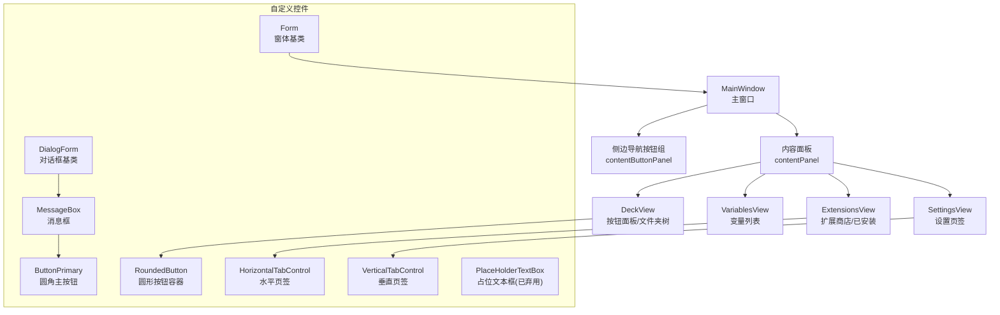
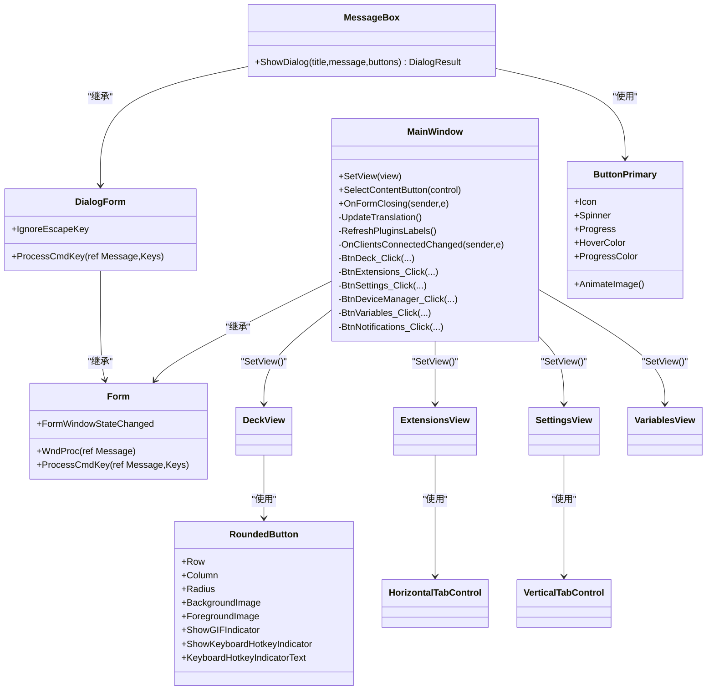
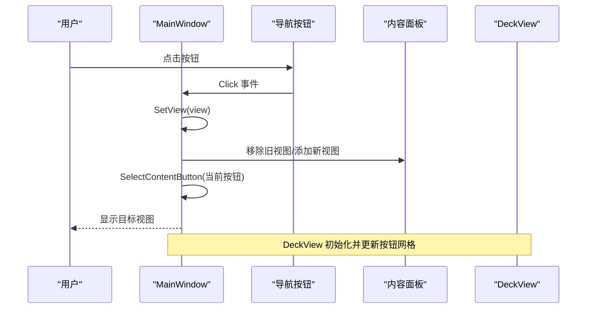
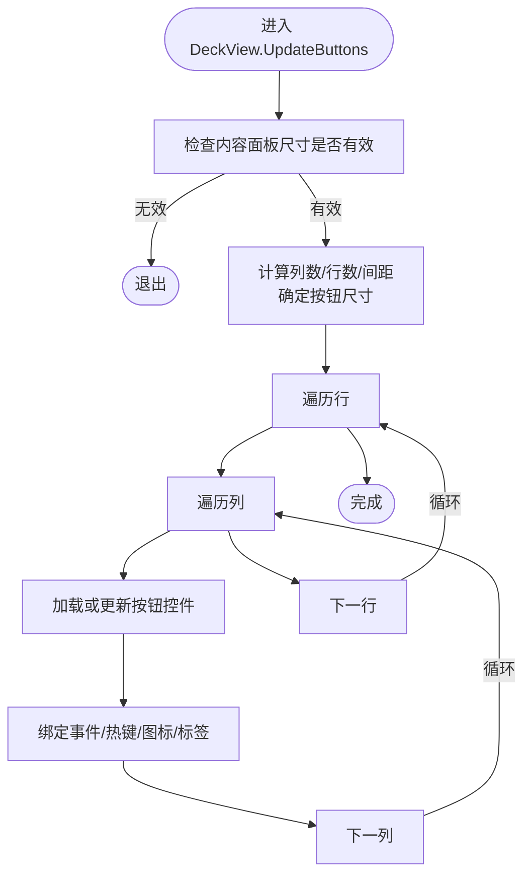
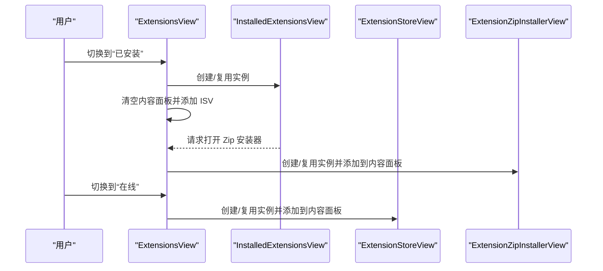
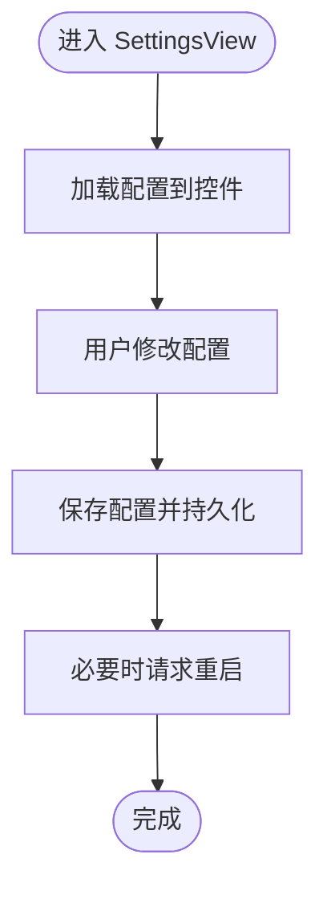
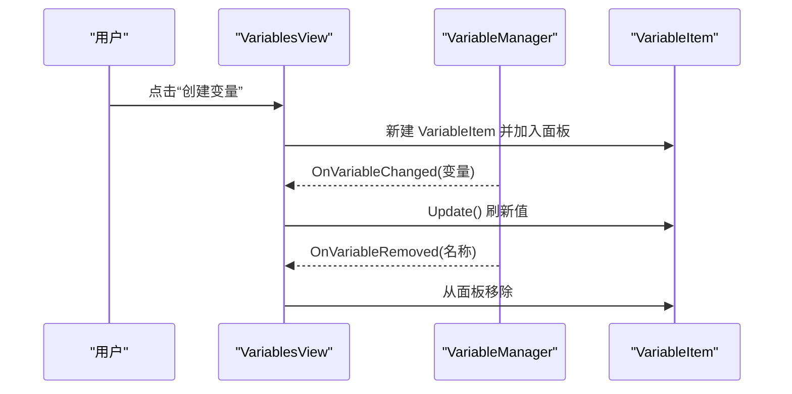
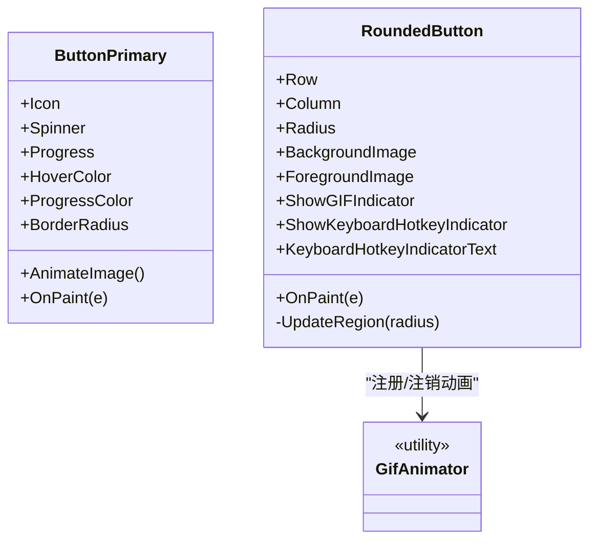
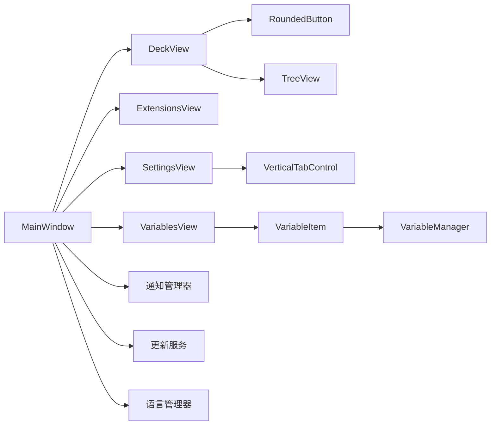

# 图形用户界面

<cite>
**本文引用的文件**
- [MainWindow.cs](file://src/MacroDeck/GUI/MainWindow.cs)
- [Colors.cs](file://src/MacroDeck/GUI/Colors.cs)
- [ButtonPrimary.cs](file://src/MacroDeck/GUI/CustomControls/ButtonPrimary.cs)
- [RoundedButton.cs](file://src/MacroDeck/GUI/CustomControls/RoundedButton.cs)
- [HorizontalTabControl.cs](file://src/MacroDeck/GUI/CustomControls/HorizontalTabControl.cs)
- [VerticalTabControl.cs](file://src/MacroDeck/GUI/CustomControls/VerticalTabControl.cs)
- [DialogForm.cs](file://src/MacroDeck/GUI/CustomControls/DialogForm.cs)
- [Form.cs](file://src/MacroDeck/GUI/CustomControls/Form.cs)
- [MessageBox.cs](file://src/MacroDeck/GUI/CustomControls/MessageBox.cs)
- [PlaceHolderTextBox.cs](file://src/MacroDeck/GUI/CustomControls/PlaceHolderTextBox.cs)
- [DeckView.cs](file://src/MacroDeck/GUI/MainWindowViews/DeckView.cs)
- [ExtensionsView.cs](file://src/MacroDeck/GUI/MainWindowViews/ExtensionsView.cs)
- [SettingsView.cs](file://src/MacroDeck/GUI/MainWindowViews/SettingsView.cs)
- [VariablesView.cs](file://src/MacroDeck/GUI/MainWindowViews/VariablesView.cs)
- [VariableItem.cs](file://src/MacroDeck/GUI/CustomControls/Variables/VariableItem.cs)
</cite>

## 目录
1. [简介](#简介)
2. [项目结构](#项目结构)
3. [核心组件](#核心组件)
4. [架构总览](#架构总览)
5. [详细组件分析](#详细组件分析)
6. [依赖关系分析](#依赖关系分析)
7. [性能考虑](#性能考虑)
8. [故障排查指南](#故障排查指南)
9. [结论](#结论)
10. [附录](#附录)

## 简介
本文件面向 Macro-Deck 的图形用户界面（GUI），聚焦于主窗口设计、自定义控件与视图管理系统的实现。内容覆盖 WinForms 框架使用、控件层次结构、事件处理机制、视图切换与数据绑定、颜色主题系统与视觉设计规范、响应式布局与可访问性建议、组件状态与交互模式，并提供样式定制与主题支持的实践路径。

## 项目结构
GUI 相关代码主要位于 src/MacroDeck/GUI 目录下，采用“分层+功能域”组织方式：
- GUI 主入口：MainWindow（主窗口）
- 自定义控件：位于 CustomControls 下，按功能域进一步细分（如 Variables、ExtensionsView、InitialSetup 等）
- 视图管理：MainWindowViews 下的各视图（DeckView、ExtensionsView、SettingsView、VariablesView 等）
- 颜色系统：Colors 提供统一配色常量
- 对话框：Dialogs 下的各类对话框（如 ButtonEditor、VariableDialog 等）

图表来源
- [MainWindow.cs:19-290](file://src/MacroDeck/GUI/MainWindow.cs#L19-L290)
- [DeckView.cs:24-1013](file://src/MacroDeck/GUI/MainWindowViews/DeckView.cs#L24-L1013)
- [ExtensionsView.cs:6-98](file://src/MacroDeck/GUI/MainWindowViews/ExtensionsView.cs#L6-L98)
- [SettingsView.cs:17-388](file://src/MacroDeck/GUI/MainWindowViews/SettingsView.cs#L17-L388)
- [VariablesView.cs:10-171](file://src/MacroDeck/GUI/MainWindowViews/VariablesView.cs#L10-L171)
- [ButtonPrimary.cs:6-234](file://src/MacroDeck/GUI/CustomControls/ButtonPrimary.cs#L6-L234)
- [RoundedButton.cs:7-263](file://src/MacroDeck/GUI/CustomControls/RoundedButton.cs#L7-L263)
- [HorizontalTabControl.cs:5-101](file://src/MacroDeck/GUI/CustomControls/HorizontalTabControl.cs#L5-L101)
- [VerticalTabControl.cs:5-157](file://src/MacroDeck/GUI/CustomControls/VerticalTabControl.cs#L5-L157)
- [MessageBox.cs:5-70](file://src/MacroDeck/GUI/CustomControls/MessageBox.cs#L5-L70)
- [DialogForm.cs:3-34](file://src/MacroDeck/GUI/CustomControls/DialogForm.cs#L3-L34)
- [Form.cs:3-36](file://src/MacroDeck/GUI/CustomControls/Form.cs#L3-L36)
- [PlaceHolderTextBox.cs:3-81](file://src/MacroDeck/GUI/CustomControls/PlaceHolderTextBox.cs#L3-L81)

章节来源
- [MainWindow.cs:19-290](file://src/MacroDeck/GUI/MainWindow.cs#L19-L290)
- [Colors.cs:3-15](file://src/MacroDeck/GUI/Colors.cs#L3-L15)

## 核心组件
- 主窗口 MainWindow
  - 负责视图切换、通知栏集成、语言更新传播、安全模式提示、插件/图标包更新提醒等
  - 使用自定义 Form 基类以统一窗口行为（如 Esc 关闭、窗口状态变更事件）
- 内容视图
  - DeckView：按钮网格、文件夹树、拖拽重排、热键指示、QR 快速连接
  - ExtensionsView：在线扩展商店与本地已安装扩展的双视图切换
  - SettingsView：多页签设置（通用、连接、更新、备份、关于）
  - VariablesView：变量列表、过滤器、增删改查
- 自定义控件
  - ButtonPrimary：带进度、旋转动画、悬停态的圆角按钮
  - RoundedButton：圆形背景/前景叠加、GIF 动图播放、键盘热键指示
  - HorizontalTabControl / VerticalTabControl：自绘页签，支持选中态与通知红点
  - MessageBox / DialogForm / Form：统一对话框与窗体行为
  - PlaceHolderTextBox：占位文本（已标记过时，推荐使用 RoundedTextBox）
- 颜色系统 Colors：集中定义强调色、背景、表面、边框等

章节来源
- [MainWindow.cs:19-290](file://src/MacroDeck/GUI/MainWindow.cs#L19-L290)
- [DeckView.cs:24-1013](file://src/MacroDeck/GUI/MainWindowViews/DeckView.cs#L24-L1013)
- [ExtensionsView.cs:6-98](file://src/MacroDeck/GUI/MainWindowViews/ExtensionsView.cs#L6-L98)
- [SettingsView.cs:17-388](file://src/MacroDeck/GUI/MainWindowViews/SettingsView.cs#L17-L388)
- [VariablesView.cs:10-171](file://src/MacroDeck/GUI/MainWindowViews/VariablesView.cs#L10-L171)
- [ButtonPrimary.cs:6-234](file://src/MacroDeck/GUI/CustomControls/ButtonPrimary.cs#L6-L234)
- [RoundedButton.cs:7-263](file://src/MacroDeck/GUI/CustomControls/RoundedButton.cs#L7-L263)
- [HorizontalTabControl.cs:5-101](file://src/MacroDeck/GUI/CustomControls/HorizontalTabControl.cs#L5-L101)
- [VerticalTabControl.cs:5-157](file://src/MacroDeck/GUI/CustomControls/VerticalTabControl.cs#L5-L157)
- [MessageBox.cs:5-70](file://src/MacroDeck/GUI/CustomControls/MessageBox.cs#L5-L70)
- [DialogForm.cs:3-34](file://src/MacroDeck/GUI/CustomControls/DialogForm.cs#L3-L34)
- [Form.cs:3-36](file://src/MacroDeck/GUI/CustomControls/Form.cs#L3-L36)
- [PlaceHolderTextBox.cs:3-81](file://src/MacroDeck/GUI/CustomControls/PlaceHolderTextBox.cs#L3-L81)
- [Colors.cs:3-15](file://src/MacroDeck/GUI/Colors.cs#L3-L15)

## 架构总览
Macro-Deck 的 GUI 采用“主窗口 + 多视图 + 自定义控件”的分层架构：
- 主窗口负责导航与视图容器，通过 SetView 切换内容视图
- 各视图内部封装自身业务逻辑与数据绑定（如 DeckView 的按钮网格、VariablesView 的变量列表）
- 自定义控件提供一致的视觉与交互体验，并通过事件与外部模块解耦
- 颜色系统集中化，便于主题扩展与一致性维护

图表来源
- [MainWindow.cs:19-290](file://src/MacroDeck/GUI/MainWindow.cs#L19-L290)
- [Form.cs:3-36](file://src/MacroDeck/GUI/CustomControls/Form.cs#L3-L36)
- [DialogForm.cs:3-34](file://src/MacroDeck/GUI/CustomControls/DialogForm.cs#L3-L34)
- [MessageBox.cs:5-70](file://src/MacroDeck/GUI/CustomControls/MessageBox.cs#L5-L70)
- [DeckView.cs:24-1013](file://src/MacroDeck/GUI/MainWindowViews/DeckView.cs#L24-L1013)
- [ExtensionsView.cs:6-98](file://src/MacroDeck/GUI/MainWindowViews/ExtensionsView.cs#L6-L98)
- [SettingsView.cs:17-388](file://src/MacroDeck/GUI/MainWindowViews/SettingsView.cs#L17-L388)
- [VariablesView.cs:10-171](file://src/MacroDeck/GUI/MainWindowViews/VariablesView.cs#L10-L171)
- [ButtonPrimary.cs:6-234](file://src/MacroDeck/GUI/CustomControls/ButtonPrimary.cs#L6-L234)
- [RoundedButton.cs:7-263](file://src/MacroDeck/GUI/CustomControls/RoundedButton.cs#L7-L263)
- [HorizontalTabControl.cs:5-101](file://src/MacroDeck/GUI/CustomControls/HorizontalTabControl.cs#L5-L101)
- [VerticalTabControl.cs:5-157](file://src/MacroDeck/GUI/CustomControls/VerticalTabControl.cs#L5-L157)

## 详细组件分析

### 主窗口 MainWindow
- 视图管理
  - SetView 负责清理旧视图、添加新视图，并同步侧边导航按钮选中状态
  - 通过按钮点击事件切换到对应视图（DeckView、ExtensionsView、SettingsView、DeviceManagerView、VariablesView）
- 通知与更新
  - 集成通知列表 NotificationsList 的弹出/收起
  - 监听更新服务事件，必要时弹出更新对话框
- 语言与主题
  - 绑定语言变更事件，触发视图翻译更新
  - 使用 Colors 定义统一配色
- 生命周期
  - 在窗口显示后初始化视图、检查更新、刷新插件标签

图表来源
- [MainWindow.cs:67-116](file://src/MacroDeck/GUI/MainWindow.cs#L67-L116)
- [MainWindow.cs:206-238](file://src/MacroDeck/GUI/MainWindow.cs#L206-L238)
- [DeckView.cs:143-200](file://src/MacroDeck/GUI/MainWindowViews/DeckView.cs#L143-L200)

章节来源
- [MainWindow.cs:19-290](file://src/MacroDeck/GUI/MainWindow.cs#L19-L290)

### DeckView：按钮网格与文件夹树
- 按钮网格
  - 根据配置计算按钮尺寸与间距，动态生成 RoundedButton 并绑定事件
  - 支持状态变化、标签/图标更新、键盘热键指示
  - 支持拖拽交换位置、复制粘贴动作按钮
- 文件夹树
  - 递归构建树节点，支持右键菜单（新建/编辑/删除）、展开折叠三角
  - 自绘节点，提升在深色主题下的可读性
- QR 与网络信息
  - 显示快速连接二维码与网络接口信息

图表来源
- [DeckView.cs:143-200](file://src/MacroDeck/GUI/MainWindowViews/DeckView.cs#L143-L200)
- [DeckView.cs:279-360](file://src/MacroDeck/GUI/MainWindowViews/DeckView.cs#L279-L360)
- [DeckView.cs:374-447](file://src/MacroDeck/GUI/MainWindowViews/DeckView.cs#L374-L447)
- [DeckView.cs:547-578](file://src/MacroDeck/GUI/MainWindowViews/DeckView.cs#L547-L578)
- [DeckView.cs:580-643](file://src/MacroDeck/GUI/MainWindowViews/DeckView.cs#L580-L643)

章节来源
- [DeckView.cs:24-1013](file://src/MacroDeck/GUI/MainWindowViews/DeckView.cs#L24-L1013)

### ExtensionsView：扩展商店与已安装视图
- 双视图切换
  - 在“在线”和“已安装”之间切换，分别承载 ExtensionStoreView 与 InstalledExtensionsView
  - 支持从已安装视图跳转到 Zip 安装器视图
- 事件驱动
  - 通过事件回调在视图间进行请求关闭与切换

图表来源
- [ExtensionsView.cs:22-75](file://src/MacroDeck/GUI/MainWindowViews/ExtensionsView.cs#L22-L75)

章节来源
- [ExtensionsView.cs:6-98](file://src/MacroDeck/GUI/MainWindowViews/ExtensionsView.cs#L6-L98)

### SettingsView：设置页签与配置项
- 页签与通知
  - 使用 VerticalTabControl，支持在指定页签上显示通知红点
- 配置项
  - 自启动、错误上报、语言、端口、自动更新、SSL 证书、ADB 设置、备份等
  - 通过事件驱动保存配置并触发应用重启（如端口变更）
- 更新流程
  - 手动检查更新，失败/成功通过消息框反馈

图表来源
- [SettingsView.cs:73-89](file://src/MacroDeck/GUI/MainWindowViews/SettingsView.cs#L73-L89)
- [SettingsView.cs:104-135](file://src/MacroDeck/GUI/MainWindowViews/SettingsView.cs#L104-L135)
- [SettingsView.cs:200-210](file://src/MacroDeck/GUI/MainWindowViews/SettingsView.cs#L200-L210)
- [SettingsView.cs:224-262](file://src/MacroDeck/GUI/MainWindowViews/SettingsView.cs#L224-L262)

章节来源
- [SettingsView.cs:17-388](file://src/MacroDeck/GUI/MainWindowViews/SettingsView.cs#L17-L388)

### VariablesView：变量管理
- 列表与过滤
  - 基于 VariableManager 实时监听变量变更/移除，动态更新 UI
  - 支持按 Creator 过滤，过滤状态持久化到设置
- 编辑与新增
  - 通过 VariableDialog 进行新增/编辑，完成后刷新列表

图表来源
- [VariablesView.cs:89-141](file://src/MacroDeck/GUI/MainWindowViews/VariablesView.cs#L89-L141)
- [VariableItem.cs:6-38](file://src/MacroDeck/GUI/CustomControls/Variables/VariableItem.cs#L6-L38)

章节来源
- [VariablesView.cs:10-171](file://src/MacroDeck/GUI/MainWindowViews/VariablesView.cs#L10-L171)
- [VariableItem.cs:6-38](file://src/MacroDeck/GUI/CustomControls/Variables/VariableItem.cs#L6-L38)

### 自定义控件：ButtonPrimary 与 RoundedButton
- ButtonPrimary
  - 支持悬停态、进度条、旋转动画、圆角绘制、图标覆盖
  - 通过双缓冲与高质量插值提升渲染质量
- RoundedButton
  - 圆角裁剪区域缓存避免 GDI 泄漏
  - 支持背景/前景图像分离、GIF 动图播放、键盘热键指示

图表来源
- [ButtonPrimary.cs:6-234](file://src/MacroDeck/GUI/CustomControls/ButtonPrimary.cs#L6-L234)
- [RoundedButton.cs:7-263](file://src/MacroDeck/GUI/CustomControls/RoundedButton.cs#L7-L263)

章节来源
- [ButtonPrimary.cs:6-234](file://src/MacroDeck/GUI/CustomControls/ButtonPrimary.cs#L6-L234)
- [RoundedButton.cs:7-263](file://src/MacroDeck/GUI/CustomControls/RoundedButton.cs#L7-L263)

### 页签控件：HorizontalTabControl 与 VerticalTabControl
- 自绘页签，支持选中态高亮、图标与文字居中对齐
- VerticalTabControl 支持在页签上显示通知红点

章节来源
- [HorizontalTabControl.cs:5-101](file://src/MacroDeck/GUI/CustomControls/HorizontalTabControl.cs#L5-L101)
- [VerticalTabControl.cs:5-157](file://src/MacroDeck/GUI/CustomControls/VerticalTabControl.cs#L5-L157)

### 对话框体系：Form、DialogForm、MessageBox
- Form：统一处理 Esc 关闭、窗口状态变更事件
- DialogForm：支持忽略 Esc 键，作为对话框基类
- MessageBox：根据按钮类型动态生成按钮，返回结果并关闭

章节来源
- [Form.cs:3-36](file://src/MacroDeck/GUI/CustomControls/Form.cs#L3-L36)
- [DialogForm.cs:3-34](file://src/MacroDeck/GUI/CustomControls/DialogForm.cs#L3-L34)
- [MessageBox.cs:5-70](file://src/MacroDeck/GUI/CustomControls/MessageBox.cs#L5-L70)

### 占位文本框：PlaceHolderTextBox（已弃用）
- 已标记为过时，建议使用 RoundedTextBox
- 提供占位文本与焦点切换逻辑

章节来源
- [PlaceHolderTextBox.cs:3-81](file://src/MacroDeck/GUI/CustomControls/PlaceHolderTextBox.cs#L3-L81)

## 依赖关系分析
- 控件依赖
  - DeckView 依赖 RoundedButton、TreeView、上下文菜单、剪贴板工具
  - SettingsView 依赖 VerticalTabControl、备份管理器、更新服务、SSL 证书服务
  - VariablesView 依赖 VariableManager、VariableItem
- 主窗口依赖
  - MainWindow 依赖各视图、通知管理器、更新服务、语言管理器
- 颜色依赖
  - 多个控件共享 Colors 中的颜色常量，确保主题一致性

图表来源
- [MainWindow.cs:19-290](file://src/MacroDeck/GUI/MainWindow.cs#L19-L290)
- [DeckView.cs:24-1013](file://src/MacroDeck/GUI/MainWindowViews/DeckView.cs#L24-L1013)
- [ExtensionsView.cs:6-98](file://src/MacroDeck/GUI/MainWindowViews/ExtensionsView.cs#L6-L98)
- [SettingsView.cs:17-388](file://src/MacroDeck/GUI/MainWindowViews/SettingsView.cs#L17-L388)
- [VariablesView.cs:10-171](file://src/MacroDeck/GUI/MainWindowViews/VariablesView.cs#L10-L171)
- [VariableItem.cs:6-38](file://src/MacroDeck/GUI/CustomControls/Variables/VariableItem.cs#L6-L38)

章节来源
- [MainWindow.cs:19-290](file://src/MacroDeck/GUI/MainWindow.cs#L19-L290)
- [DeckView.cs:24-1013](file://src/MacroDeck/GUI/MainWindowViews/DeckView.cs#L24-L1013)
- [ExtensionsView.cs:6-98](file://src/MacroDeck/GUI/MainWindowViews/ExtensionsView.cs#L6-L98)
- [SettingsView.cs:17-388](file://src/MacroDeck/GUI/MainWindowViews/SettingsView.cs#L17-L388)
- [VariablesView.cs:10-171](file://src/MacroDeck/GUI/MainWindowViews/VariablesView.cs#L10-L171)
- [VariableItem.cs:6-38](file://src/MacroDeck/GUI/CustomControls/Variables/VariableItem.cs#L6-L38)

## 性能考虑
- 双缓冲与高质量渲染
  - ButtonPrimary、RoundedButton、HorizontalTabControl、VerticalTabControl 均启用双缓冲与高质量插值，减少闪烁并提升绘制质量
- GDI 资源管理
  - RoundedButton 在背景图像为动画 GIF 时仅注册一次动画，避免重复注册；Dispose 时释放前景图像与区域资源，防止泄漏
- 响应式布局
  - DeckView 在窗口最小化或尺寸为零时跳过布局计算，避免负尺寸导致的异常
- 异步与并发
  - 设置页签中的更新检查与证书生成采用异步任务，避免阻塞 UI 线程
- 事件去重与清理
  - DeckView 在重建按钮前移除旧事件处理器，避免重复订阅导致的性能与内存问题

章节来源
- [ButtonPrimary.cs:126-128](file://src/MacroDeck/GUI/CustomControls/ButtonPrimary.cs#L126-L128)
- [RoundedButton.cs:96-115](file://src/MacroDeck/GUI/CustomControls/RoundedButton.cs#L96-L115)
- [HorizontalTabControl.cs:8-18](file://src/MacroDeck/GUI/CustomControls/HorizontalTabControl.cs#L8-L18)
- [VerticalTabControl.cs:12-23](file://src/MacroDeck/GUI/CustomControls/VerticalTabControl.cs#L12-L23)
- [DeckView.cs:150-156](file://src/MacroDeck/GUI/MainWindowViews/DeckView.cs#L150-L156)
- [SettingsView.cs:224-262](file://src/MacroDeck/GUI/MainWindowViews/SettingsView.cs#L224-L262)
- [DeckView.cs:332-341](file://src/MacroDeck/GUI/MainWindowViews/DeckView.cs#L332-L341)

## 故障排查指南
- 更新检查失败
  - 现象：手动检查更新弹出失败提示
  - 排查：确认网络连通性；查看日志输出；重试或稍后再试
- SSL 证书配置无效
  - 现象：启用 SSL 后无法验证证书或证书与密钥不匹配
  - 排查：确认 PEM 格式正确；验证证书与私钥匹配；重新生成或替换
- 端口变更未生效
  - 现象：修改端口后未重启或保存失败
  - 排查：确认保存成功并触发重启；检查防火墙放行新端口
- 按钮网格空白或按钮异常
  - 现象：按钮尺寸为负或布局异常
  - 排查：避免窗口最小化期间频繁刷新；等待窗口恢复尺寸后自动更新

章节来源
- [SettingsView.cs:245-253](file://src/MacroDeck/GUI/MainWindowViews/SettingsView.cs#L245-L253)
- [SettingsView.cs:329-369](file://src/MacroDeck/GUI/MainWindowViews/SettingsView.cs#L329-L369)
- [DeckView.cs:150-156](file://src/MacroDeck/GUI/MainWindowViews/DeckView.cs#L150-L156)

## 结论
Macro-Deck 的 GUI 以 MainWindow 为中心，通过自定义控件与视图模块化实现清晰的职责划分。颜色系统与自绘控件保证了统一的视觉风格；事件驱动的数据绑定提升了交互响应性；性能优化策略（双缓冲、GDI 资源管理、异步任务）保障了流畅体验。建议在后续版本中逐步替换已弃用控件（如 PlaceHolderTextBox），并完善可访问性与响应式设计规范。

## 附录
- 颜色主题系统
  - Colors 提供强调色、背景、表面、边框等基础色值，建议扩展为浅色/深色两套主题并支持动态切换
- 视觉设计规范
  - 字体与字号：建议统一使用 Tahoma 或系统默认字体，字号分级明确
  - 圆角与间距：ButtonPrimary 与 RoundedButton 的圆角半径与边距应遵循设计系统
  - 状态反馈：按钮悬停、按下、禁用态应有明确的视觉差异
- 响应式与可访问性
  - 建议增加 DPI 缩放适配与高对比度主题支持
  - 为关键控件提供可读的辅助文本与键盘导航支持
- 样式定制与主题支持
  - 将 Colors 中的色值抽象为主题接口，允许外部注入新主题
  - 为常用控件（按钮、输入框、页签）提供样式属性以便统一定制