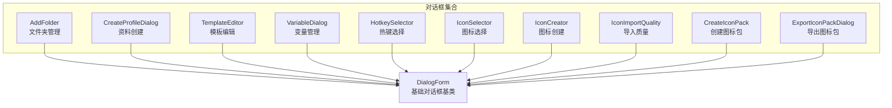
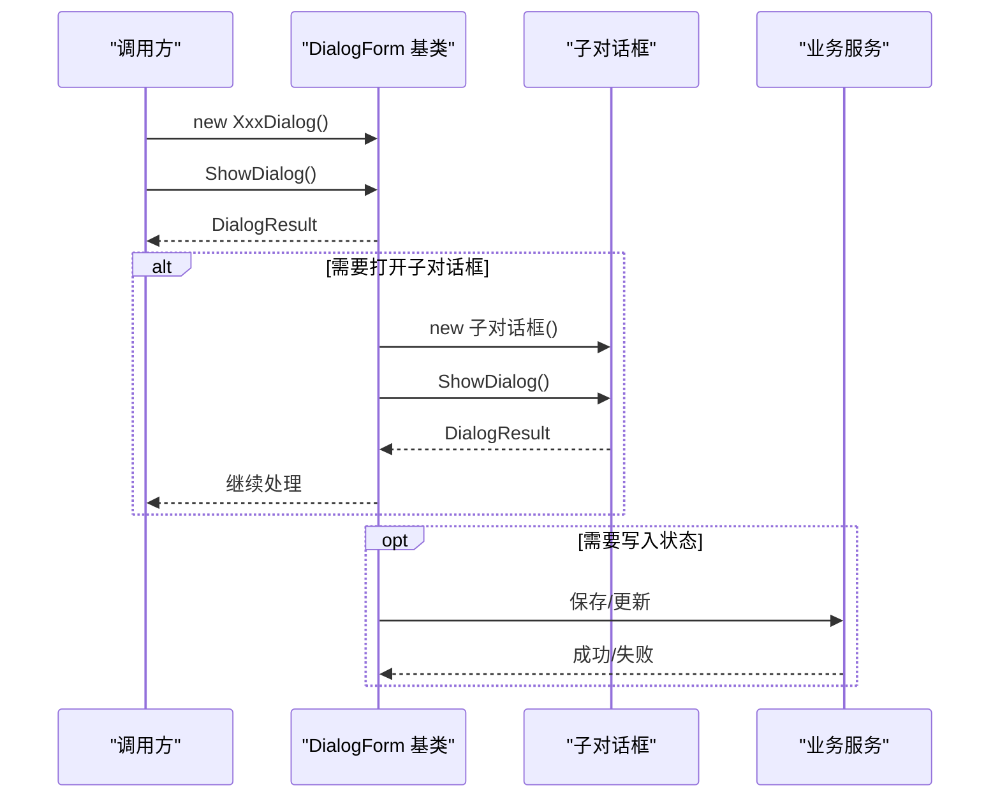
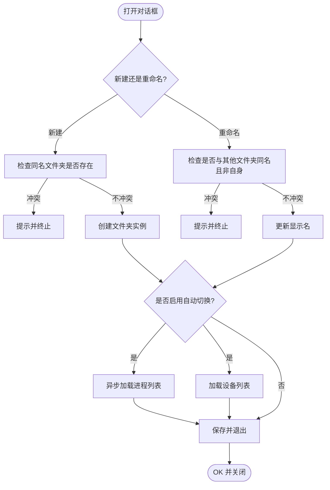
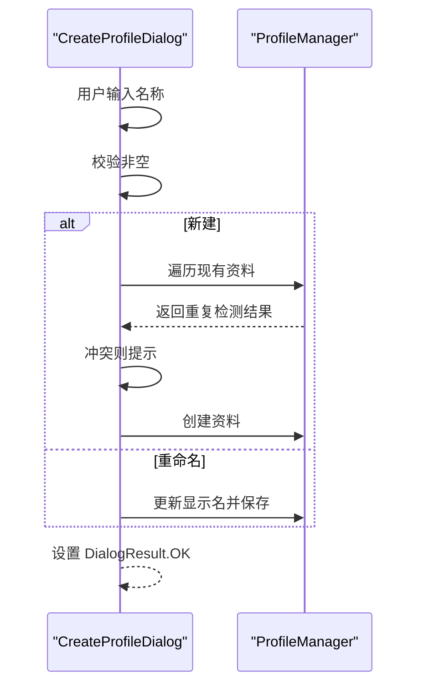
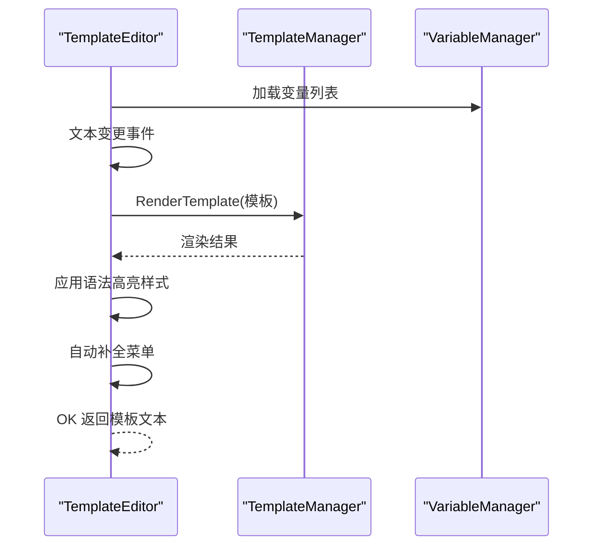
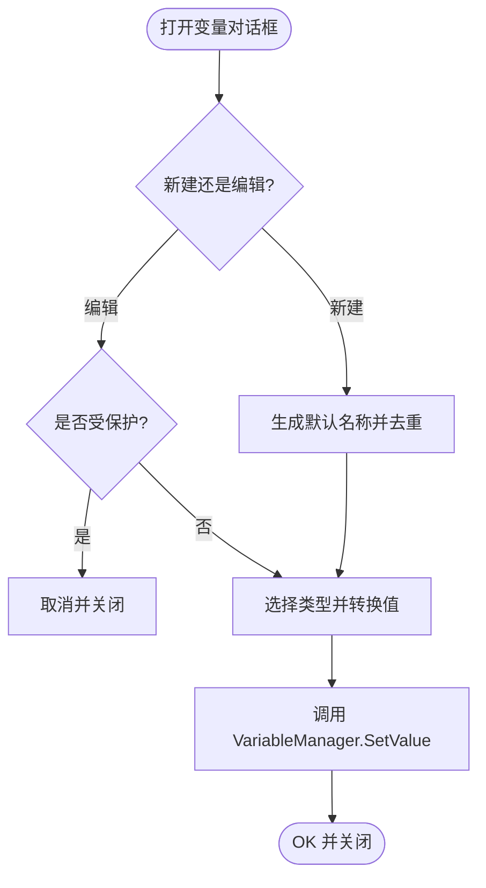
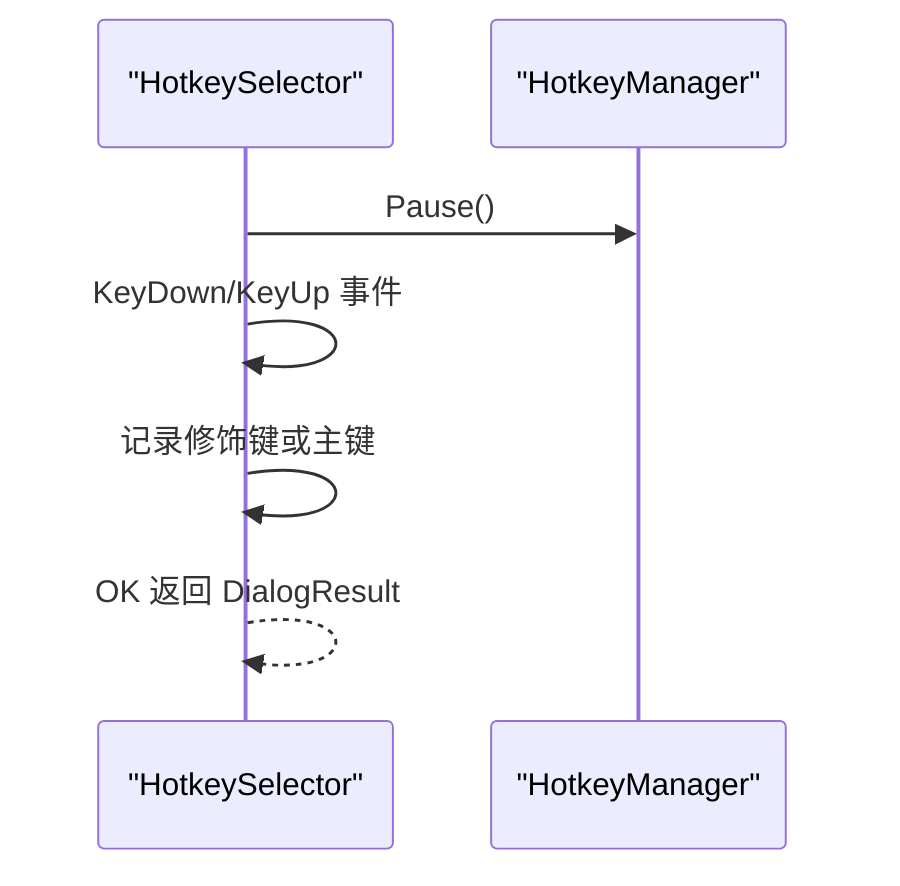
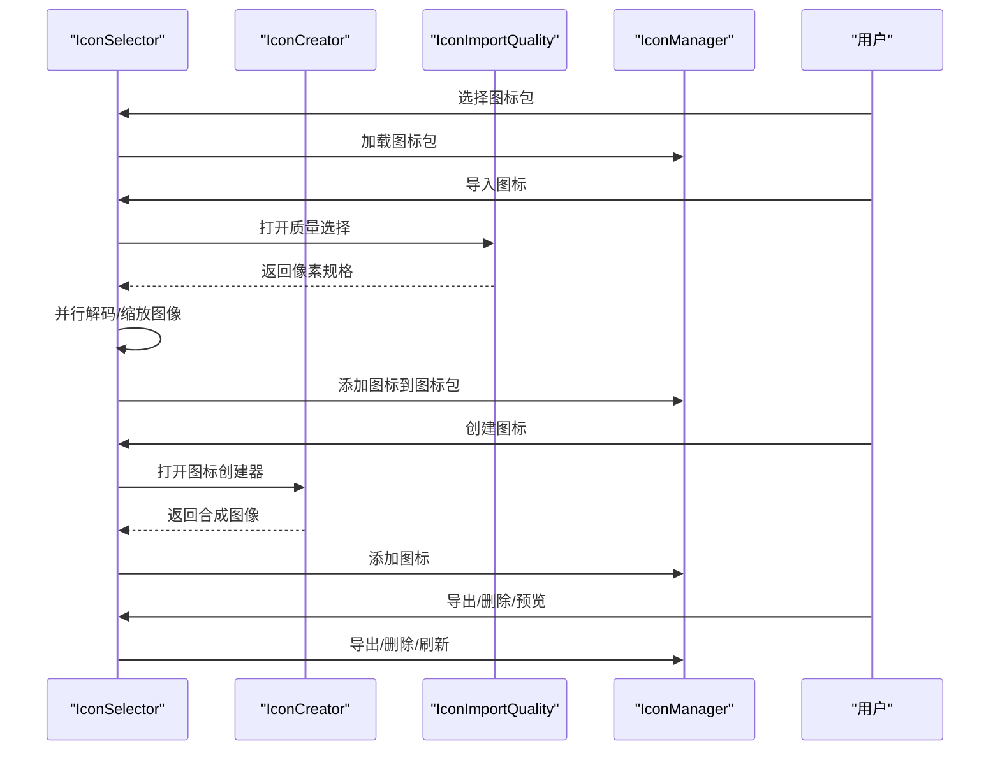
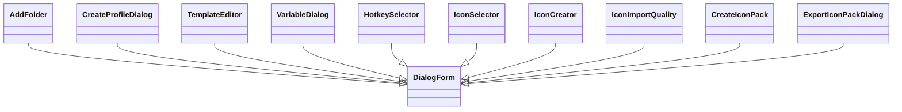

# 其他对话框

<cite>
**本文档引用的文件**
- [AddFolder.cs](file://src/MacroDeck/GUI/Dialogs/AddFolder.cs)
- [CreateProfileDialog.cs](file://src/MacroDeck/GUI/Dialogs/CreateProfileDialog.cs)
- [TemplateEditor.cs](file://src/MacroDeck/GUI/Dialogs/TemplateEditor.cs)
- [VariableDialog.cs](file://src/MacroDeck/GUI/Dialogs/VariableDialog.cs)
- [HotkeySelector.cs](file://src/MacroDeck/GUI/Dialogs/HotkeySelector.cs)
- [IconSelector.cs](file://src/MacroDeck/GUI/Dialogs/IconSelector.cs)
- [IconCreator.cs](file://src/MacroDeck/GUI/Dialogs/IconCreator.cs)
- [IconImportQuality.cs](file://src/MacroDeck/GUI/Dialogs/IconImportQuality.cs)
- [CreateIconPack.cs](file://src/MacroDeck/GUI/Dialogs/CreateIconPack.cs)
- [ExportIconPackDialog.cs](file://src/MacroDeck/GUI/Dialogs/ExportIconPackDialog.cs)
- [DialogForm.cs](file://src/MacroDeck/GUI/CustomControls/DialogForm.cs)
- [LanguageManager.cs](file://src/MacroDeck/Language/LanguageManager.cs)
</cite>

## 目录
1. [简介](#简介)
2. [项目结构](#项目结构)
3. [核心组件](#核心组件)
4. [架构总览](#架构总览)
5. [详细组件分析](#详细组件分析)
6. [依赖关系分析](#依赖关系分析)
7. [性能考量](#性能考量)
8. [故障排查指南](#故障排查指南)
9. [结论](#结论)
10. [附录](#附录)

## 简介
本文件系统性梳理 Macro-Deck 中“其他对话框”的实现与使用，覆盖以下类型：
- 文件夹管理：新建/重命名文件夹、自动切换触发设置
- 配置文件（资料）管理：创建/重命名资料
- 模板编辑：基于 Cottle 引擎的可视化模板编辑器
- 变量管理：变量创建/修改/删除与类型转换
- 图标选择与管理：图标包导入/导出、图标创建、质量控制、静态图生成
- 热键选择：捕获用户按键组合

文档重点阐述各对话框的功能边界、交互流程、数据传递、错误处理、国际化支持与可维护性设计。

## 项目结构
这些对话框集中位于 GUI/Dialogs 目录，统一继承自 DialogForm，以确保一致的关闭行为与可访问性。图标相关对话框在 GUI 根命名空间下，便于跨模块调用。

图表来源
- [AddFolder.cs:11-22](file://src/MacroDeck/GUI/Dialogs/AddFolder.cs#L11-L22)
- [CreateProfileDialog.cs:8-18](file://src/MacroDeck/GUI/Dialogs/CreateProfileDialog.cs#L8-L18)
- [TemplateEditor.cs:12-67](file://src/MacroDeck/GUI/Dialogs/TemplateEditor.cs#L12-L67)
- [VariableDialog.cs:8-39](file://src/MacroDeck/GUI/Dialogs/VariableDialog.cs#L8-L39)
- [HotkeySelector.cs:7-14](file://src/MacroDeck/GUI/Dialogs/HotkeySelector.cs#L7-L14)
- [IconSelector.cs:18-42](file://src/MacroDeck/GUI/Dialogs/IconSelector.cs#L18-L42)
- [IconCreator.cs:8-25](file://src/MacroDeck/GUI/Dialogs/IconCreator.cs#L8-L25)
- [IconImportQuality.cs:6-27](file://src/MacroDeck/GUI/Dialogs/IconImportQuality.cs#L6-L27)
- [CreateIconPack.cs:8-18](file://src/MacroDeck/GUI/Dialogs/CreateIconPack.cs#L8-L18)
- [ExportIconPackDialog.cs:7-17](file://src/MacroDeck/GUI/Dialogs/ExportIconPackDialog.cs#L7-L17)
- [DialogForm.cs:3-33](file://src/MacroDeck/GUI/CustomControls/DialogForm.cs#L3-L33)

章节来源
- [DialogForm.cs:3-33](file://src/MacroDeck/GUI/CustomControls/DialogForm.cs#L3-L33)

## 核心组件
- 对话框基类 DialogForm：统一 Escape 键处理、可选隐藏关闭按钮、命令键分发拦截
- 语言管理 LanguageManager：加载多语言资源、事件通知、当前语言/代码查询
- 各具体对话框：围绕各自业务域提供输入校验、数据持久化、外部服务集成（如图标解码、模板渲染）

章节来源
- [DialogForm.cs:17-32](file://src/MacroDeck/GUI/CustomControls/DialogForm.cs#L17-L32)
- [LanguageManager.cs:95-120](file://src/MacroDeck/Language/LanguageManager.cs#L95-L120)

## 架构总览
所有对话框均通过 ShowDialog 打开，返回 DialogResult 决定是否保存或关闭；部分对话框会打开子对话框（如图标选择器打开图标创建器、导入质量选择器），形成轻量级对话框链路。

图表来源
- [DialogForm.cs:17-32](file://src/MacroDeck/GUI/CustomControls/DialogForm.cs#L17-L32)
- [IconSelector.cs:100-177](file://src/MacroDeck/GUI/Dialogs/IconSelector.cs#L100-L177)
- [IconCreator.cs:121-129](file://src/MacroDeck/GUI/Dialogs/IconCreator.cs#L121-L129)

## 详细组件分析

### 文件夹管理对话框 AddFolder
- 功能要点
  - 新建文件夹：校验同名冲突、默认父节点回退、保存到当前资料
  - 重命名文件夹：禁用根目录重命名、避免与现有名称冲突
  - 自动切换设置：应用聚焦触发 + 设备列表勾选，支持动态加载进程与设备
- 关键流程
  - 创建/保存时对名称重复进行检查，必要时弹窗提示
  - 触发条件启用时，异步加载进程列表与设备列表
  - 保存后调用资料管理器持久化
- 数据传递
  - 输入：显示名、应用名、设备列表
  - 输出：DialogResult.OK 表示成功
- 国际化
  - 使用 LanguageManager.Strings 获取界面文案

图表来源
- [AddFolder.cs:43-112](file://src/MacroDeck/GUI/Dialogs/AddFolder.cs#L43-L112)
- [AddFolder.cs:114-189](file://src/MacroDeck/GUI/Dialogs/AddFolder.cs#L114-L189)

章节来源
- [AddFolder.cs:11-22](file://src/MacroDeck/GUI/Dialogs/AddFolder.cs#L11-L22)
- [AddFolder.cs:43-112](file://src/MacroDeck/GUI/Dialogs/AddFolder.cs#L43-L112)
- [AddFolder.cs:114-189](file://src/MacroDeck/GUI/Dialogs/AddFolder.cs#L114-L189)

### 配置文件（资料）创建对话框 CreateProfileDialog
- 功能要点
  - 创建新资料或重命名现有资料
  - 名称唯一性校验，冲突时提示
- 流程
  - 初始化时根据传入资料设置默认值
  - 确认时检查空名，若新建则遍历现有资料判断重复
  - 成功后设置 DialogResult.OK 并关闭

图表来源
- [CreateProfileDialog.cs:20-52](file://src/MacroDeck/GUI/Dialogs/CreateProfileDialog.cs#L20-L52)

章节来源
- [CreateProfileDialog.cs:8-18](file://src/MacroDeck/GUI/Dialogs/CreateProfileDialog.cs#L8-L18)
- [CreateProfileDialog.cs:20-52](file://src/MacroDeck/GUI/Dialogs/CreateProfileDialog.cs#L20-L52)

### 模板编辑对话框 TemplateEditor
- 功能要点
  - 基于 Cottle 模板引擎的可视化编辑器
  - 语法高亮：函数、注释、操作符、命令、变量、特殊标记
  - 实时预览：输入变化即渲染模板
  - 自动补全菜单：关键字 + 变量名
  - 空行裁剪：可插入/移除模板前缀以控制空白行
- 关键实现
  - 使用正则表达式匹配关键字与变量，应用不同样式
  - 通过 AutocompleteMenu 提供智能补全
  - 渲染由 TemplateManager.RenderTemplate 完成
- 数据传递
  - 输入：模板文本
  - 输出：模板文本（可能包含空行裁剪前缀）
- 国际化
  - 使用 LanguageManager.Strings 显示引擎信息、结果标签、按钮文案

图表来源
- [TemplateEditor.cs:69-91](file://src/MacroDeck/GUI/Dialogs/TemplateEditor.cs#L69-L91)
- [TemplateEditor.cs:154-158](file://src/MacroDeck/GUI/Dialogs/TemplateEditor.cs#L154-L158)

章节来源
- [TemplateEditor.cs:12-67](file://src/MacroDeck/GUI/Dialogs/TemplateEditor.cs#L12-L67)
- [TemplateEditor.cs:69-91](file://src/MacroDeck/GUI/Dialogs/TemplateEditor.cs#L69-L91)
- [TemplateEditor.cs:154-158](file://src/MacroDeck/GUI/Dialogs/TemplateEditor.cs#L154-L158)

### 变量管理对话框 VariableDialog
- 功能要点
  - 创建变量：自动去重命名、默认值按类型初始化
  - 编辑变量：受保护变量不可修改（仅用户创建）
  - 删除变量：二次确认
  - 类型转换：Bool/Integer/Float/String 的安全解析
- 流程
  - 初始化时填充类型枚举、设置默认值
  - 确认时根据编辑/新建分支执行不同逻辑
  - 调用 VariableManager.SetValue 持久化

图表来源
- [VariableDialog.cs:46-94](file://src/MacroDeck/GUI/Dialogs/VariableDialog.cs#L46-L94)
- [VariableDialog.cs:109-121](file://src/MacroDeck/GUI/Dialogs/VariableDialog.cs#L109-L121)

章节来源
- [VariableDialog.cs:8-39](file://src/MacroDeck/GUI/Dialogs/VariableDialog.cs#L8-L39)
- [VariableDialog.cs:46-94](file://src/MacroDeck/GUI/Dialogs/VariableDialog.cs#L46-L94)
- [VariableDialog.cs:109-121](file://src/MacroDeck/GUI/Dialogs/VariableDialog.cs#L109-L121)

### 热键选择对话框 HotkeySelector
- 功能要点
  - 暂停全局热键监听，捕获用户按键
  - 区分修饰键与普通键，分别记录修饰键与主键
  - 支持按键抬起清空显示
- 数据传递
  - 输出：ModifierKeys、Key（公共字段）
  - 结果：DialogResult.OK 表示已捕获有效键

图表来源
- [HotkeySelector.cs:19-46](file://src/MacroDeck/GUI/Dialogs/HotkeySelector.cs#L19-L46)

章节来源
- [HotkeySelector.cs:7-14](file://src/MacroDeck/GUI/Dialogs/HotkeySelector.cs#L7-L14)
- [HotkeySelector.cs:19-46](file://src/MacroDeck/GUI/Dialogs/HotkeySelector.cs#L19-L46)

### 图标选择与管理对话框 IconSelector
- 功能要点
  - 切换图标包：读取本地图标包列表，记录上次选择
  - 导入图标：多文件、格式解码（含 GIF）、并行处理、质量选择
  - 创建图标：调用 IconCreator，支持背景色与图层叠加
  - 导出图标包：版本号确认、保存并导出至指定目录
  - 删除图标/图标包：二次确认
  - 预览与尺寸/格式展示：GIF 静态图生成按钮可见性控制
- 性能与并发
  - 图像解码与缩放采用并行处理，线程安全收集结果
  - 大图处理时显示等待指示
- 资源释放
  - 对话框关闭时释放预览位图与网格图标缓存

图表来源
- [IconSelector.cs:100-177](file://src/MacroDeck/GUI/Dialogs/IconSelector.cs#L100-L177)
- [IconSelector.cs:410-460](file://src/MacroDeck/GUI/Dialogs/IconSelector.cs#L410-L460)
- [IconCreator.cs:121-129](file://src/MacroDeck/GUI/Dialogs/IconCreator.cs#L121-L129)
- [IconImportQuality.cs:29-53](file://src/MacroDeck/GUI/Dialogs/IconImportQuality.cs#L29-L53)

章节来源
- [IconSelector.cs:18-51](file://src/MacroDeck/GUI/Dialogs/IconSelector.cs#L18-L51)
- [IconSelector.cs:100-177](file://src/MacroDeck/GUI/Dialogs/IconSelector.cs#L100-L177)
- [IconSelector.cs:246-312](file://src/MacroDeck/GUI/Dialogs/IconSelector.cs#L246-L312)
- [IconSelector.cs:333-384](file://src/MacroDeck/GUI/Dialogs/IconSelector.cs#L333-L384)
- [IconCreator.cs:8-25](file://src/MacroDeck/GUI/Dialogs/IconCreator.cs#L8-L25)
- [IconImportQuality.cs:6-27](file://src/MacroDeck/GUI/Dialogs/IconImportQuality.cs#L6-L27)

### 图标创建器 IconCreator
- 功能要点
  - 多图层合成：添加/移除图层、背景色填充、导入图片
  - 实时预览：图层变化即时合并预览
- 数据传递
  - 输出：Image 属性（最终合成图像）

章节来源
- [IconCreator.cs:8-25](file://src/MacroDeck/GUI/Dialogs/IconCreator.cs#L8-L25)
- [IconCreator.cs:66-79](file://src/MacroDeck/GUI/Dialogs/IconCreator.cs#L66-L79)
- [IconCreator.cs:121-129](file://src/MacroDeck/GUI/Dialogs/IconCreator.cs#L121-L129)

### 图标导入质量选择 IconImportQuality
- 功能要点
  - 原图/高质量/正常/低质量/最低质量 五档像素规格
  - GIF 默认选择最低质量
- 数据传递
  - 输出：Pixels（-1 表示原图）

章节来源
- [IconImportQuality.cs:6-27](file://src/MacroDeck/GUI/Dialogs/IconImportQuality.cs#L6-L27)
- [IconImportQuality.cs:29-53](file://src/MacroDeck/GUI/Dialogs/IconImportQuality.cs#L29-L53)

### 创建图标包 CreateIconPack
- 功能要点
  - 名称、作者、版本输入，名称唯一性校验
- 数据传递
  - 输出：IconPackName/Author/Version（用于后续创建）

章节来源
- [CreateIconPack.cs:8-18](file://src/MacroDeck/GUI/Dialogs/CreateIconPack.cs#L8-L18)
- [CreateIconPack.cs:35-58](file://src/MacroDeck/GUI/Dialogs/CreateIconPack.cs#L35-L58)

### 导出图标包 ExportIconPackDialog
- 功能要点
  - 版本号确认，更新图标包版本
- 数据传递
  - 输出：DialogResult.OK（表示确认导出）

章节来源
- [ExportIconPackDialog.cs:7-17](file://src/MacroDeck/GUI/Dialogs/ExportIconPackDialog.cs#L7-L17)
- [ExportIconPackDialog.cs:24-34](file://src/MacroDeck/GUI/Dialogs/ExportIconPackDialog.cs#L24-L34)

## 依赖关系分析
- 继承关系
  - 所有对话框均继承自 DialogForm，共享 Escape 键处理与关闭控制
- 语言依赖
  - 多数对话框通过 LanguageManager.Strings 注入本地化文案
- 业务依赖
  - 文件夹：ProfileManager、DeviceManager
  - 资料：ProfileManager
  - 模板：TemplateManager、VariableManager
  - 变量：VariableManager
  - 图标：IconManager、ImageMagick、CombineBitmaps
  - 热键：HotkeyManager

图表来源
- [DialogForm.cs:3-33](file://src/MacroDeck/GUI/CustomControls/DialogForm.cs#L3-L33)
- [AddFolder.cs:11-22](file://src/MacroDeck/GUI/Dialogs/AddFolder.cs#L11-L22)
- [CreateProfileDialog.cs:8-18](file://src/MacroDeck/GUI/Dialogs/CreateProfileDialog.cs#L8-L18)
- [TemplateEditor.cs:12-67](file://src/MacroDeck/GUI/Dialogs/TemplateEditor.cs#L12-L67)
- [VariableDialog.cs:8-39](file://src/MacroDeck/GUI/Dialogs/VariableDialog.cs#L8-L39)
- [HotkeySelector.cs:7-14](file://src/MacroDeck/GUI/Dialogs/HotkeySelector.cs#L7-L14)
- [IconSelector.cs:18-42](file://src/MacroDeck/GUI/Dialogs/IconSelector.cs#L18-L42)
- [IconCreator.cs:8-25](file://src/MacroDeck/GUI/Dialogs/IconCreator.cs#L8-L25)
- [IconImportQuality.cs:6-27](file://src/MacroDeck/GUI/Dialogs/IconImportQuality.cs#L6-L27)
- [CreateIconPack.cs:8-18](file://src/MacroDeck/GUI/Dialogs/CreateIconPack.cs#L8-L18)
- [ExportIconPackDialog.cs:7-17](file://src/MacroDeck/GUI/Dialogs/ExportIconPackDialog.cs#L7-L17)

## 性能考量
- 图像处理
  - 并行解码与缩放：使用 Parallel.ForEach 与 ConcurrentBag 收集结果，减少 I/O 阻塞
  - GIF 处理：支持动画帧合并与可选转静态图
- UI 响应
  - 异步加载进程与设备列表，避免阻塞主线程
  - 模板实时渲染与高亮，建议在大模板时限制刷新频率
- 资源释放
  - 对话框关闭时释放位图与网格缓存，防止内存泄漏

章节来源
- [IconSelector.cs:113-130](file://src/MacroDeck/GUI/Dialogs/IconSelector.cs#L113-L130)
- [IconSelector.cs:44-51](file://src/MacroDeck/GUI/Dialogs/IconSelector.cs#L44-L51)

## 故障排查指南
- 名称冲突
  - 文件夹/资料/图标包创建时若名称重复，将弹窗提示并阻止创建
- 权限与保护
  - 受保护变量禁止编辑/删除
- 热键捕获
  - 若未捕获有效键，检查修饰键识别逻辑与全局热键暂停状态
- 图像导入
  - 不支持的格式将尝试通过 ImageMagick 解码；若仍失败，查看日志异常
- 模板渲染
  - 语法高亮依赖关键字与变量列表；若未高亮，检查关键字集合与变量管理器

章节来源
- [AddFolder.cs:56-86](file://src/MacroDeck/GUI/Dialogs/AddFolder.cs#L56-L86)
- [CreateProfileDialog.cs:33-38](file://src/MacroDeck/GUI/Dialogs/CreateProfileDialog.cs#L33-L38)
- [VariableDialog.cs:48-53](file://src/MacroDeck/GUI/Dialogs/VariableDialog.cs#L48-L53)
- [HotkeySelector.cs:33-46](file://src/MacroDeck/GUI/Dialogs/HotkeySelector.cs#L33-L46)
- [IconSelector.cs:124-128](file://src/MacroDeck/GUI/Dialogs/IconSelector.cs#L124-L128)
- [TemplateEditor.cs:69-91](file://src/MacroDeck/GUI/Dialogs/TemplateEditor.cs#L69-L91)

## 结论
上述对话框围绕“输入校验—业务处理—持久化—反馈”形成清晰闭环，统一继承 DialogForm 确保一致的用户体验与可维护性。图标相关对话框在图像处理上采用并行策略，兼顾性能与稳定性。模板编辑器提供良好的开发体验，变量管理器保障数据一致性。建议在扩展新对话框时遵循现有模式：统一基类、明确数据流、完善国际化与错误提示。

## 附录
- 国际化与本地化
  - 通过 LanguageManager.Load 加载资源，LanguageManager.Strings 提供当前语言字典
  - 各对话框在构造与加载事件中注入本地化文案
- 最佳实践
  - 对话框尽量无副作用，通过 DialogResult 与属性输出结果
  - 大量 I/O 或 CPU 密集任务使用异步与并行
  - 资源及时释放，避免内存泄漏
  - 对外服务调用（如图标解码）需捕获异常并记录日志

章节来源
- [LanguageManager.cs:20-70](file://src/MacroDeck/Language/LanguageManager.cs#L20-L70)
- [LanguageManager.cs:95-120](file://src/MacroDeck/Language/LanguageManager.cs#L95-L120)
- [DialogForm.cs:17-32](file://src/MacroDeck/GUI/CustomControls/DialogForm.cs#L17-L32)