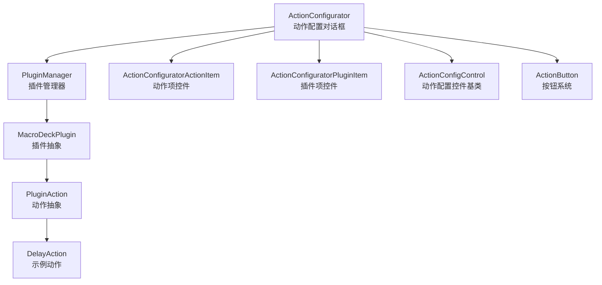
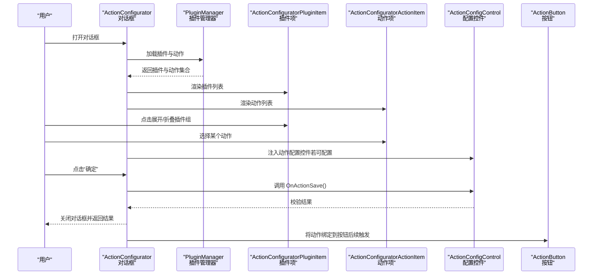
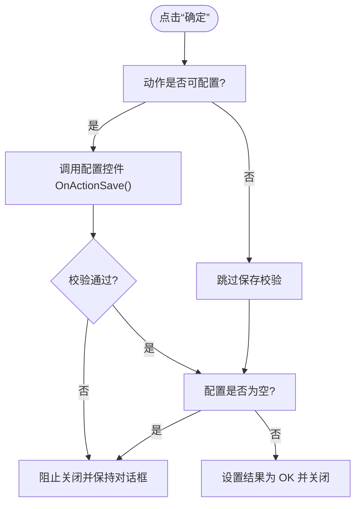
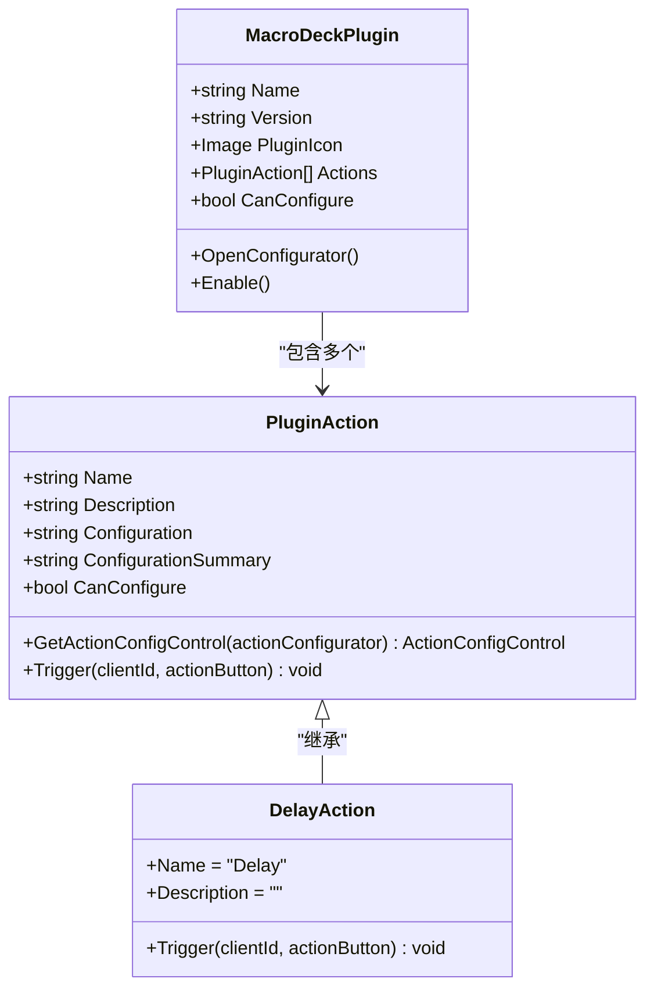
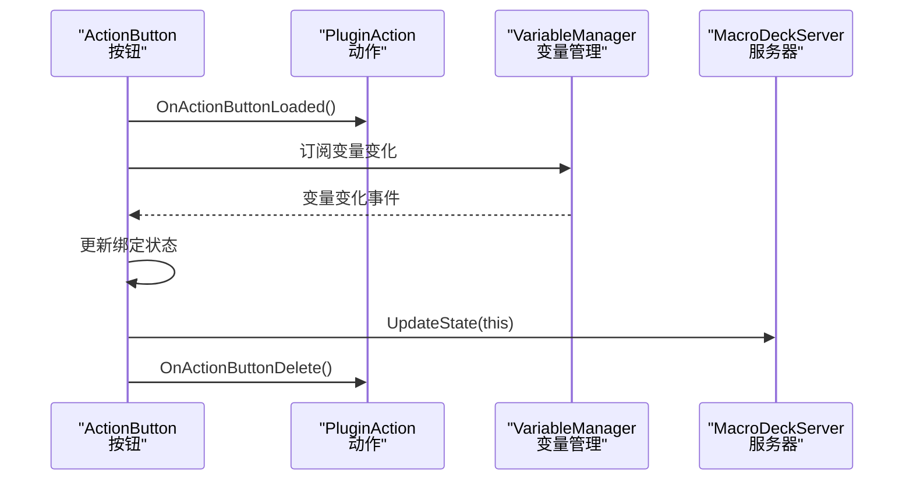
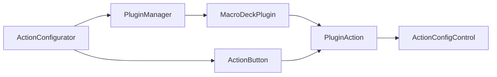

# 动作配置对话框

<cite>
**本文引用的文件**
- [ActionConfigurator.cs](file://src/MacroDeck/GUI/Dialogs/ActionConfigurator.cs)
- [ActionConfigControl.cs](file://src/MacroDeck/GUI/CustomControls/ActionConfigControl.cs)
- [ActionConfiguratorActionItem.cs](file://src/MacroDeck/GUI/CustomControls/ActionConfiguratorActionItem.cs)
- [ActionConfiguratorPluginItem.cs](file://src/MacroDeck/GUI/CustomControls/ActionConfiguratorPluginItem.cs)
- [MacroDeckPlugin.cs](file://src/MacroDeck/Plugins/MacroDeckPlugin.cs)
- [PluginManager.cs](file://src/MacroDeck/Plugins/PluginManager.cs)
- [ActionButton.cs](file://src/MacroDeck/ActionButton/ActionButton.cs)
- [DelayAction.cs](file://src/MacroDeck/InternalPlugins/ActionButtonPlugin/Actions/DelayAction.cs)
</cite>

## 目录
1. [简介](#简介)
2. [项目结构](#项目结构)
3. [核心组件](#核心组件)
4. [架构总览](#架构总览)
5. [详细组件分析](#详细组件分析)
6. [依赖关系分析](#依赖关系分析)
7. [性能考量](#性能考量)
8. [故障排查指南](#故障排查指南)
9. [结论](#结论)
10. [附录](#附录)

## 简介
本文件面向 Macro-Deck 的“动作配置对话框”，系统化阐述其架构设计与实现细节，覆盖以下主题：
- 对话框初始化流程与插件加载机制
- 动作配置界面的生成与交互
- 不同类型动作配置的参数输入、验证规则与配置保存
- 与按钮系统的集成：数据绑定、事件处理与状态同步
- 用户体验设计原则与可访问性支持建议
- 最佳实践与常见问题解决方案

## 项目结构
动作配置对话框位于 GUI 层，围绕插件系统与动作模型构建，主要涉及如下模块：
- 对话框主体：负责插件与动作的展示、筛选、配置控件注入与保存校验
- 自定义控件：用于承载具体动作的配置界面
- 插件与动作模型：描述插件、动作及其可配置能力
- 按钮系统：承载动作并驱动触发与状态更新

图表来源
- [ActionConfigurator.cs:1-251](file://src/MacroDeck/GUI/Dialogs/ActionConfigurator.cs#L1-L251)
- [PluginManager.cs:1-479](file://src/MacroDeck/Plugins/PluginManager.cs#L1-L479)
- [MacroDeckPlugin.cs:1-184](file://src/MacroDeck/Plugins/MacroDeckPlugin.cs#L1-L184)
- [ActionButton.cs:1-198](file://src/MacroDeck/ActionButton/ActionButton.cs#L1-L198)
- [DelayAction.cs:1-23](file://src/MacroDeck/InternalPlugins/ActionButtonPlugin/Actions/DelayAction.cs#L1-L23)

章节来源
- [ActionConfigurator.cs:1-251](file://src/MacroDeck/GUI/Dialogs/ActionConfigurator.cs#L1-L251)
- [PluginManager.cs:1-479](file://src/MacroDeck/Plugins/PluginManager.cs#L1-L479)
- [MacroDeckPlugin.cs:1-184](file://src/MacroDeck/Plugins/MacroDeckPlugin.cs#L1-L184)
- [ActionButton.cs:1-198](file://src/MacroDeck/ActionButton/ActionButton.cs#L1-L198)
- [DelayAction.cs:1-23](file://src/MacroDeck/InternalPlugins/ActionButtonPlugin/Actions/DelayAction.cs#L1-L23)

## 核心组件
- 动作配置对话框（ActionConfigurator）
  - 负责加载插件列表、筛选、展开/折叠插件组、选择动作、注入配置控件、执行保存校验与关闭对话框
- 动作配置控件基类（ActionConfigControl）
  - 提供统一的保存回调接口 OnActionSave，由具体动作配置界面实现
- 动作项控件（ActionConfiguratorActionItem）与插件项控件（ActionConfiguratorPluginItem）
  - 承载动作与插件的 UI 表现与点击事件转发
- 插件与动作模型（MacroDeckPlugin、PluginAction）
  - 定义插件与动作的元信息、可配置能力、配置控件生成与触发逻辑
- 按钮系统（ActionButton）
  - 承载动作集合、热键、变量绑定、状态变更与图标更新等

章节来源
- [ActionConfigurator.cs:1-251](file://src/MacroDeck/GUI/Dialogs/ActionConfigurator.cs#L1-L251)
- [ActionConfigControl.cs:1-20](file://src/MacroDeck/GUI/CustomControls/ActionConfigControl.cs#L1-L20)
- [ActionConfiguratorActionItem.cs:1-31](file://src/MacroDeck/GUI/CustomControls/ActionConfiguratorActionItem.cs#L1-L31)
- [ActionConfiguratorPluginItem.cs:1-57](file://src/MacroDeck/GUI/CustomControls/ActionConfiguratorPluginItem.cs#L1-L57)
- [MacroDeckPlugin.cs:1-184](file://src/MacroDeck/Plugins/MacroDeckPlugin.cs#L1-L184)
- [ActionButton.cs:1-198](file://src/MacroDeck/ActionButton/ActionButton.cs#L1-L198)

## 架构总览
动作配置对话框采用“插件-动作-配置控件”的分层架构：
- 插件层：通过 PluginManager 加载本地与内置插件，收集可用动作
- 动作层：每个动作具备名称、描述、可配置能力与配置控件工厂方法
- 配置层：根据动作是否可配置动态注入对应配置控件；保存时调用控件的 OnActionSave 进行校验
- 集成层：与按钮系统联动，动作被绑定到按钮后在触发时执行

图表来源
- [ActionConfigurator.cs:1-251](file://src/MacroDeck/GUI/Dialogs/ActionConfigurator.cs#L1-L251)
- [PluginManager.cs:1-479](file://src/MacroDeck/Plugins/PluginManager.cs#L1-L479)
- [ActionConfigControl.cs:1-20](file://src/MacroDeck/GUI/CustomControls/ActionConfigControl.cs#L1-L20)
- [ActionButton.cs:1-198](file://src/MacroDeck/ActionButton/ActionButton.cs#L1-L198)

## 详细组件分析

### 对话框初始化与插件加载
- 初始化阶段
  - 设置语言文本、占位符、显示事件中加载插件
  - 若传入已有动作实例，则自动定位到对应插件并展开
- 插件加载
  - 清理旧事件与控件，遍历已安装插件，为每个插件创建插件项控件
  - 为插件中的每个动作创建动作项控件并设置不可见，等待插件展开时再显示
- 搜索过滤
  - 当输入长度大于阈值时，按插件名或动作名进行模糊匹配并控制可见性
  - 匹配到动作时自动展开其所属插件组

章节来源
- [ActionConfigurator.cs:23-52](file://src/MacroDeck/GUI/Dialogs/ActionConfigurator.cs#L23-L52)
- [ActionConfigurator.cs:98-133](file://src/MacroDeck/GUI/Dialogs/ActionConfigurator.cs#L98-L133)
- [ActionConfigurator.cs:54-96](file://src/MacroDeck/GUI/Dialogs/ActionConfigurator.cs#L54-L96)

### 动作选择与配置控件注入
- 动作选择
  - 记录当前选中动作，更新顶部图标与标题描述
  - 清空配置面板，根据动作的可配置能力决定注入配置控件或提示无需配置
- 配置控件注入
  - 可配置动作通过动作对象提供的工厂方法生成配置控件并添加到配置面板
  - 不可配置动作直接显示提示标签

章节来源
- [ActionConfigurator.cs:135-172](file://src/MacroDeck/GUI/Dialogs/ActionConfigurator.cs#L135-L172)
- [MacroDeckPlugin.cs:160-163](file://src/MacroDeck/Plugins/MacroDeckPlugin.cs#L160-L163)

### 保存流程与验证规则
- 保存入口
  - 点击“确定”时，若动作可配置则调用配置控件的 OnActionSave 进行校验
  - 校验失败则阻止关闭；校验成功则检查配置内容是否为空（字符串或空对象），空则阻止关闭
- 结果返回
  - 通过对话框结果标志位指示保存成功并关闭窗口

图表来源
- [ActionConfigurator.cs:222-244](file://src/MacroDeck/GUI/Dialogs/ActionConfigurator.cs#L222-L244)
- [ActionConfigControl.cs:10-13](file://src/MacroDeck/GUI/CustomControls/ActionConfigControl.cs#L10-L13)

章节来源
- [ActionConfigurator.cs:222-244](file://src/MacroDeck/GUI/Dialogs/ActionConfigurator.cs#L222-L244)
- [ActionConfigControl.cs:10-13](file://src/MacroDeck/GUI/CustomControls/ActionConfigControl.cs#L10-L13)

### 插件与动作模型
- 插件（MacroDeckPlugin）
  - 维护插件元信息与动作集合
  - 可配置能力与配置控件工厂方法
- 动作（PluginAction）
  - 具备名称、描述、配置摘要、可配置能力与触发逻辑
  - 支持序列化复制以避免共享状态问题
- 示例动作（DelayAction）
  - 简单示例：解析配置字符串作为延迟时间并休眠

图表来源
- [MacroDeckPlugin.cs:9-184](file://src/MacroDeck/Plugins/MacroDeckPlugin.cs#L9-L184)
- [DelayAction.cs:1-23](file://src/MacroDeck/InternalPlugins/ActionButtonPlugin/Actions/DelayAction.cs#L1-L23)

章节来源
- [MacroDeckPlugin.cs:9-184](file://src/MacroDeck/Plugins/MacroDeckPlugin.cs#L9-L184)
- [DelayAction.cs:1-23](file://src/MacroDeck/InternalPlugins/ActionButtonPlugin/Actions/DelayAction.cs#L1-L23)

### 与按钮系统的集成
- 数据绑定
  - 动作可声明可绑定变量，用于与按钮状态联动
- 事件处理
  - 按钮在加载/删除动作时会回调动作的生命周期方法
- 状态同步
  - 按钮状态变化会通知服务器与 UI 更新；变量变化也会驱动按钮状态刷新

图表来源
- [ActionButton.cs:10-78](file://src/MacroDeck/ActionButton/ActionButton.cs#L10-L78)
- [MacroDeckPlugin.cs:67-114](file://src/MacroDeck/Plugins/MacroDeckPlugin.cs#L67-L114)

章节来源
- [ActionButton.cs:10-78](file://src/MacroDeck/ActionButton/ActionButton.cs#L10-L78)
- [MacroDeckPlugin.cs:67-114](file://src/MacroDeck/Plugins/MacroDeckPlugin.cs#L67-L114)

## 依赖关系分析
- 对话框依赖插件管理器加载插件与动作
- 动作依赖插件容器，配置控件由动作提供
- 按钮系统依赖动作集合与变量系统进行状态联动

图表来源
- [ActionConfigurator.cs:1-251](file://src/MacroDeck/GUI/Dialogs/ActionConfigurator.cs#L1-L251)
- [PluginManager.cs:1-479](file://src/MacroDeck/Plugins/PluginManager.cs#L1-L479)
- [MacroDeckPlugin.cs:1-184](file://src/MacroDeck/Plugins/MacroDeckPlugin.cs#L1-L184)
- [ActionButton.cs:1-198](file://src/MacroDeck/ActionButton/ActionButton.cs#L1-L198)

章节来源
- [ActionConfigurator.cs:1-251](file://src/MacroDeck/GUI/Dialogs/ActionConfigurator.cs#L1-L251)
- [PluginManager.cs:1-479](file://src/MacroDeck/Plugins/PluginManager.cs#L1-L479)
- [MacroDeckPlugin.cs:1-184](file://src/MacroDeck/Plugins/MacroDeckPlugin.cs#L1-L184)
- [ActionButton.cs:1-198](file://src/MacroDeck/ActionButton/ActionButton.cs#L1-L198)

## 性能考量
- 控件渲染优化
  - 使用双缓冲减少闪烁
  - 懒加载与可见性控制降低布局压力
- 插件加载
  - 延迟启用与异步更新，避免阻塞 UI
- 配置保存
  - 在保存前进行轻量级校验，避免昂贵操作

## 故障排查指南
- 无法看到任何动作
  - 检查插件是否正确加载与 Enable 是否被调用
  - 确认插件 Actions 列表非空
- 选择动作后无配置控件
  - 确认动作的 CanConfigure 为真且 GetActionConfigControl 返回有效控件
- 保存失败
  - 检查配置控件 OnActionSave 的返回值与配置内容是否为空
- 搜索无效
  - 输入长度需超过阈值才会触发过滤
- 按钮状态不更新
  - 检查变量绑定名称与变量值格式，确认变量变化事件是否触发

章节来源
- [ActionConfigurator.cs:54-96](file://src/MacroDeck/GUI/Dialogs/ActionConfigurator.cs#L54-L96)
- [ActionConfigurator.cs:222-244](file://src/MacroDeck/GUI/Dialogs/ActionConfigurator.cs#L222-L244)
- [MacroDeckPlugin.cs:150-163](file://src/MacroDeck/Plugins/MacroDeckPlugin.cs#L150-L163)
- [ActionButton.cs:80-107](file://src/MacroDeck/ActionButton/ActionButton.cs#L80-L107)

## 结论
动作配置对话框通过清晰的插件-动作-配置控件分层，实现了灵活的动作选择与可扩展的配置界面。结合按钮系统的状态绑定与事件机制，能够稳定地支撑复杂场景下的动作编排与运行时行为。

## 附录

### 用户体验设计原则与可访问性建议
- 明确反馈
  - 选择动作后即时更新图标与描述，提供即时视觉反馈
- 搜索与组织
  - 提供搜索框与插件分组折叠，便于快速定位
- 一致性
  - 配置控件遵循统一的保存与校验流程，避免歧义
- 可访问性
  - 确保键盘导航与高对比度显示；为关键控件提供可读性标签

### 最佳实践
- 动作配置控件
  - 在 OnActionSave 中进行必要校验并返回布尔值
  - 合理使用配置摘要，提升按钮编辑器中的可读性
- 插件开发
  - 为可配置动作提供直观的 UI 与默认值
  - 在 Enable 中完成动作集合初始化
- 按钮集成
  - 正确设置绑定变量，确保状态同步可靠
  - 在动作生命周期中清理资源，避免内存泄漏