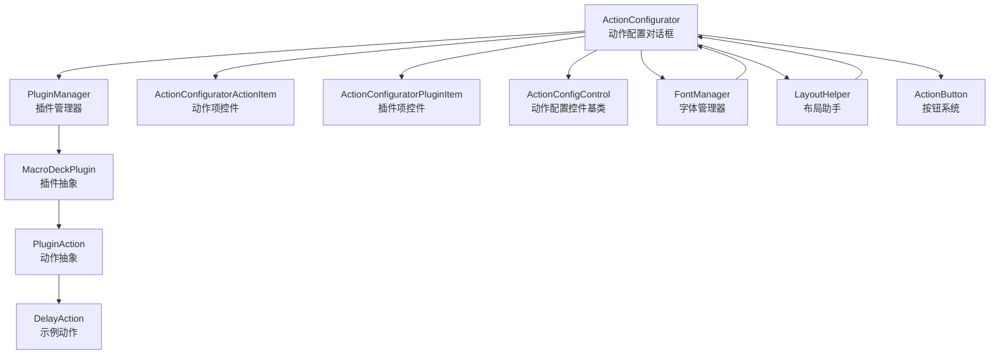
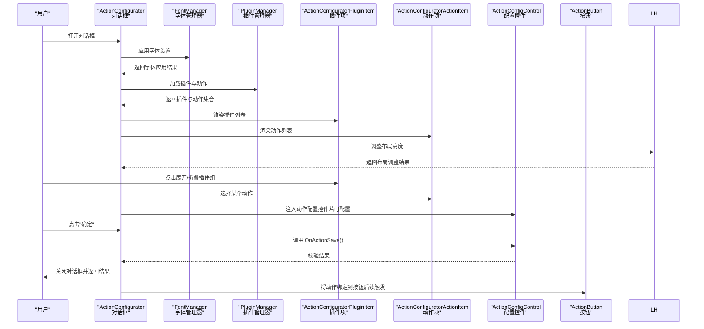
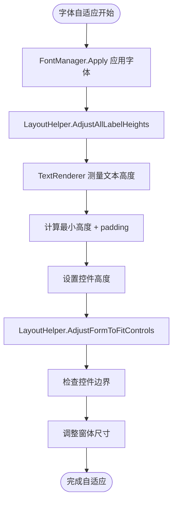
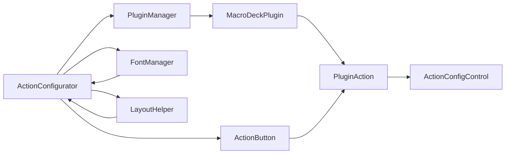

# 动作配置对话框

<cite>
**本文引用的文件**
- [ActionConfigurator.cs](file://src/MacroDeck/GUI/Dialogs/ActionConfigurator.cs)
- [ActionConfigurator.Designer.cs](file://src/MacroDeck/GUI/Dialogs/ActionConfigurator.Designer.cs)
- [ActionConfigControl.cs](file://src/MacroDeck/GUI/CustomControls/ActionConfigControl.cs)
- [ActionConfiguratorActionItem.cs](file://src/MacroDeck/GUI/CustomControls/ActionConfiguratorActionItem.cs)
- [ActionConfiguratorActionItem.Designer.cs](file://src/MacroDeck/GUI/CustomControls/ActionConfiguratorActionItem.Designer.cs)
- [ActionConfiguratorPluginItem.cs](file://src/MacroDeck/GUI/CustomControls/ActionConfiguratorPluginItem.cs)
- [ActionConfiguratorPluginItem.Designer.cs](file://src/MacroDeck/GUI/CustomControls/ActionConfiguratorPluginItem.Designer.cs)
- [FontManager.cs](file://src/MacroDeck/Utils/FontManager.cs)
- [LayoutHelper.cs](file://src/MacroDeck/Utils/LayoutHelper.cs)
- [MacroDeckPlugin.cs](file://src/MacroDeck/Plugins/MacroDeckPlugin.cs)
- [PluginManager.cs](file://src/MacroDeck/Plugins/PluginManager.cs)
- [ActionButton.cs](file://src/MacroDeck/ActionButton/ActionButton.cs)
- [DelayAction.cs](file://src/MacroDeck/InternalPlugins/ActionButtonPlugin/Actions/DelayAction.cs)
</cite>

## 更新摘要
**所做更改**
- 新增完整的动作配置对话框系统架构分析
- 添加字体自适应布局功能的详细说明
- 更新插件项控件和动作项控件的实现细节
- 增强对话框初始化和布局适配流程说明
- 完善字体管理器和布局助手的工作原理

## 目录
1. [简介](#简介)
2. [项目结构](#项目结构)
3. [核心组件](#核心组件)
4. [架构总览](#架构总览)
5. [详细组件分析](#详细组件分析)
6. [字体自适应布局系统](#字体自适应布局系统)
7. [依赖关系分析](#依赖关系分析)
8. [性能考量](#性能考量)
9. [故障排查指南](#故障排查指南)
10. [结论](#结论)
11. [附录](#附录)

## 简介
本文档全面阐述 Macro-Deck 新增的完整动作配置对话框系统，包括 ActionConfigurator 主对话框、ActionConfiguratorPluginItem 插件项控件、ActionConfiguratorActionItem 动作项控件，以及先进的字体自适应布局功能。系统采用现代化的 WinForms 架构，提供流畅的用户体验和强大的可扩展性。

## 项目结构
动作配置对话框系统位于 GUI 层的核心位置，围绕插件系统与动作模型构建，主要涉及以下模块：

- **主对话框**：ActionConfigurator - 负责插件与动作的展示、筛选、配置控件注入与保存校验
- **自定义控件**：ActionConfiguratorPluginItem 和 ActionConfiguratorActionItem - 用于承载具体动作的配置界面
- **字体管理系统**：FontManager 和 LayoutHelper - 提供全局字体管理和自适应布局功能
- **插件与动作模型**：MacroDeckPlugin 和 PluginAction - 描述插件、动作及其可配置能力
- **按钮系统**：ActionButton - 承载动作并驱动触发与状态更新

**图表来源**
- [ActionConfigurator.cs:1-288](file://src/MacroDeck/GUI/Dialogs/ActionConfigurator.cs#L1-L288)
- [ActionConfiguratorPluginItem.cs:1-114](file://src/MacroDeck/GUI/CustomControls/ActionConfiguratorPluginItem.cs#L1-L114)
- [ActionConfiguratorActionItem.cs:1-46](file://src/MacroDeck/GUI/CustomControls/ActionConfiguratorActionItem.cs#L1-L46)
- [FontManager.cs:1-227](file://src/MacroDeck/Utils/FontManager.cs#L1-L227)
- [LayoutHelper.cs:1-105](file://src/MacroDeck/Utils/LayoutHelper.cs#L1-L105)

**章节来源**
- [ActionConfigurator.cs:1-288](file://src/MacroDeck/GUI/Dialogs/ActionConfigurator.cs#L1-L288)
- [ActionConfiguratorPluginItem.cs:1-114](file://src/MacroDeck/GUI/CustomControls/ActionConfiguratorPluginItem.cs#L1-L114)
- [ActionConfiguratorActionItem.cs:1-46](file://src/MacroDeck/GUI/CustomControls/ActionConfiguratorActionItem.cs#L1-L46)
- [FontManager.cs:1-227](file://src/MacroDeck/Utils/FontManager.cs#L1-L227)
- [LayoutHelper.cs:1-105](file://src/MacroDeck/Utils/LayoutHelper.cs#L1-L105)

## 核心组件

### ActionConfigurator 主对话框
- **职责**：负责加载插件列表、筛选、展开/折叠插件组、选择动作、注入配置控件、执行保存校验与关闭对话框
- **特性**：支持多语言界面、搜索过滤、字体自适应、双缓冲渲染
- **初始化**：设置语言文本、占位符、显示事件中加载插件

### ActionConfiguratorPluginItem 插件项控件
- **职责**：承载插件的 UI 表现，包含插件图标、名称、动作数量标签以及展开/折叠箭头
- **特性**：支持整行点击效果、动态布局调整、双缓冲渲染
- **交互**：通过 Chevron 图标显示展开/折叠状态

### ActionConfiguratorActionItem 动作项控件
- **职责**：承载动作的 UI 表现，显示动作名称
- **特性**：支持整行点击效果、动态布局调整、双缓冲渲染
- **集成**：与插件项控件配合实现层级结构

### 字体自适应系统
- **FontManager**：全局字体管理器，支持运行时字体更新、缓存原始字体、幂等重算
- **LayoutHelper**：布局助手，提供标签高度调整、窗体尺寸适配功能
- **自适应机制**：基于文本测量计算控件尺寸，确保字体变化时界面完整性

**章节来源**
- [ActionConfigurator.cs:13-97](file://src/MacroDeck/GUI/Dialogs/ActionConfigurator.cs#L13-L97)
- [ActionConfiguratorPluginItem.cs:13-114](file://src/MacroDeck/GUI/CustomControls/ActionConfiguratorPluginItem.cs#L13-L114)
- [ActionConfiguratorActionItem.cs:6-46](file://src/MacroDeck/GUI/CustomControls/ActionConfiguratorActionItem.cs#L6-L46)
- [FontManager.cs:16-227](file://src/MacroDeck/Utils/FontManager.cs#L16-L227)
- [LayoutHelper.cs:13-105](file://src/MacroDeck/Utils/LayoutHelper.cs#L13-L105)

## 架构总览
动作配置对话框采用"插件-动作-配置控件"的分层架构，结合字体自适应系统：

- **插件层**：通过 PluginManager 加载本地与内置插件，收集可用动作
- **动作层**：每个动作具备名称、描述、可配置能力与配置控件工厂方法
- **配置层**：根据动作是否可配置动态注入对应配置控件；保存时调用控件的 OnActionSave 进行校验
- **布局层**：FontManager 和 LayoutHelper 提供全局字体管理和自适应布局
- **集成层**：与按钮系统联动，动作被绑定到按钮后在触发时执行

**图表来源**
- [ActionConfigurator.cs:56-97](file://src/MacroDeck/GUI/Dialogs/ActionConfigurator.cs#L56-L97)
- [FontManager.cs:152-186](file://src/MacroDeck/Utils/FontManager.cs#L152-L186)
- [LayoutHelper.cs:54-78](file://src/MacroDeck/Utils/LayoutHelper.cs#L54-L78)

**章节来源**
- [ActionConfigurator.cs:56-97](file://src/MacroDeck/GUI/Dialogs/ActionConfigurator.cs#L56-L97)
- [FontManager.cs:152-186](file://src/MacroDeck/Utils/FontManager.cs#L152-L186)
- [LayoutHelper.cs:54-78](file://src/MacroDeck/Utils/LayoutHelper.cs#L54-L78)

## 详细组件分析

### 对话框初始化与插件加载
- **初始化阶段**
  - 设置语言文本、占位符、显示事件中加载插件
  - 若传入已有动作实例，则自动定位到对应插件并展开
- **插件加载**
  - 清理旧事件与控件，遍历已安装插件，为每个插件创建插件项控件
  - 为插件中的每个动作创建动作项控件并设置不可见，等待插件展开时再显示
- **字体应用**
  - 在 OnLoad 事件中应用 FontManager.Apply 进行字体设置
  - 使用 LayoutHelper.AdjustAllLabelHeights 调整标签高度
  - 通过 LayoutHelper.AdjustFormToFitControls 适配窗体尺寸

**章节来源**
- [ActionConfigurator.cs:29-97](file://src/MacroDeck/GUI/Dialogs/ActionConfigurator.cs#L29-L97)
- [ActionConfigurator.cs:44-50](file://src/MacroDeck/GUI/Dialogs/ActionConfigurator.cs#L44-L50)

### 动作选择与配置控件注入
- **动作选择**
  - 记录当前选中动作，更新顶部图标与标题描述
  - 清空配置面板，根据动作的可配置能力决定注入配置控件或提示无需配置
- **配置控件注入**
  - 可配置动作通过动作对象提供的工厂方法生成配置控件并添加到配置面板
  - 不可配置动作直接显示提示标签

**章节来源**
- [ActionConfigurator.cs:177-208](file://src/MacroDeck/GUI/Dialogs/ActionConfigurator.cs#L177-L208)

### 保存流程与验证规则
- **保存入口**
  - 点击"确定"时，若动作可配置则调用配置控件的 OnActionSave 进行校验
  - 校验失败则阻止关闭；校验成功则检查配置内容是否为空（字符串或空对象），空则阻止关闭
- **结果返回**
  - 通过对话框结果标志位指示保存成功并关闭窗口

**章节来源**
- [ActionConfigurator.cs:263-278](file://src/MacroDeck/GUI/Dialogs/ActionConfigurator.cs#L263-L278)

### 插件与动作模型
- **插件（MacroDeckPlugin）**
  - 维护插件元信息与动作集合
  - 可配置能力与配置控件工厂方法
- **动作（PluginAction）**
  - 具备名称、描述、配置摘要、可配置能力与触发逻辑
  - 支持序列化复制以避免共享状态问题
- **示例动作（DelayAction）**
  - 简单示例：解析配置字符串作为延迟时间并休眠

**章节来源**
- [MacroDeckPlugin.cs:13-188](file://src/MacroDeck/Plugins/MacroDeckPlugin.cs#L13-L188)
- [DelayAction.cs:11-35](file://src/MacroDeck/InternalPlugins/ActionButtonPlugin/Actions/DelayAction.cs#L11-L35)

### 与按钮系统的集成
- **数据绑定**
  - 动作可声明可绑定变量，用于与按钮状态联动
- **事件处理**
  - 按钮在加载/删除动作时会回调动作的生命周期方法
- **状态同步**
  - 按钮状态变化会通知服务器与 UI 更新；变量变化也会驱动按钮状态刷新

**章节来源**
- [ActionButton.cs:10-107](file://src/MacroDeck/ActionButton/ActionButton.cs#L10-L107)
- [MacroDeckPlugin.cs:74-126](file://src/MacroDeck/Plugins/MacroDeckPlugin.cs#L74-L126)

## 字体自适应布局系统

### FontManager 字体管理器
- **全局字体管理**：在启动时根据配置初始化界面字体族，提供递归替换控件树字体的能力
- **运行时更新**：支持实时刷新所有已打开窗体的字体设置
- **幂等性保证**：缓存每个控件的原始字体，重复 Apply 始终基于原始字体重算
- **智能回退**：当配置字体未安装时自动回退到默认字体并记录日志

### LayoutHelper 布局助手
- **标签高度调整**：自动计算当前字体下标签的最小高度，确保文本完整显示
- **窗体尺寸适配**：根据所有控件的实际位置调整窗体 ClientSize，确保没有控件超出边界
- **递归处理**：遍历控件树，自动调整 Label、RadioButton、CheckBox 的高度
- **原始尺寸保护**：不会缩小到小于设计时的原始尺寸

### 自适应布局实现
- **字体应用时机**：在对话框 OnLoad 事件中调用 FontManager.Apply 进行字体设置
- **标签高度计算**：使用 TextRenderer.MeasureText("Ay", control.Font).Height + 1 计算最小高度
- **控件宽度自适应**：插件项控件根据容器宽度动态调整，扣除控件自身的水平边距
- **布局调整流程**：在 OnShown 事件中调用 AdjustLayout 方法进行精确布局重算

**图表来源**
- [FontManager.cs:152-186](file://src/MacroDeck/Utils/FontManager.cs#L152-L186)
- [LayoutHelper.cs:54-103](file://src/MacroDeck/Utils/LayoutHelper.cs#L54-L103)

**章节来源**
- [FontManager.cs:16-227](file://src/MacroDeck/Utils/FontManager.cs#L16-L227)
- [LayoutHelper.cs:13-105](file://src/MacroDeck/Utils/LayoutHelper.cs#L13-L105)
- [ActionConfigurator.cs:44-50](file://src/MacroDeck/GUI/Dialogs/ActionConfigurator.cs#L44-L50)

## 依赖关系分析
- 对话框依赖插件管理器加载插件与动作
- 动作依赖插件容器，配置控件由动作提供
- 按钮系统依赖动作集合与变量系统进行状态联动
- 字体自适应系统独立工作，为所有控件提供统一的字体管理

**图表来源**
- [ActionConfigurator.cs:1-288](file://src/MacroDeck/GUI/Dialogs/ActionConfigurator.cs#L1-L288)
- [FontManager.cs:1-227](file://src/MacroDeck/Utils/FontManager.cs#L1-L227)
- [LayoutHelper.cs:1-105](file://src/MacroDeck/Utils/LayoutHelper.cs#L1-L105)

**章节来源**
- [ActionConfigurator.cs:1-288](file://src/MacroDeck/GUI/Dialogs/ActionConfigurator.cs#L1-L288)
- [FontManager.cs:1-227](file://src/MacroDeck/Utils/FontManager.cs#L1-L227)
- [LayoutHelper.cs:1-105](file://src/MacroDeck/Utils/LayoutHelper.cs#L1-L105)

## 性能考量
- **控件渲染优化**
  - 使用双缓冲减少闪烁，提升视觉效果
  - 懒加载与可见性控制降低布局压力
- **字体管理优化**
  - FontManager 使用 ConditionalWeakTable 缓存原始字体，避免内存泄漏
  - 幂等性设计允许重复调用而无需重新计算
- **布局优化**
  - LayoutHelper 仅在需要时调整控件尺寸，避免不必要的重绘
  - 递归处理采用静态方法，减少对象创建开销
- **插件加载**
  - 延迟启用与异步更新，避免阻塞 UI
- **配置保存**
  - 在保存前进行轻量级校验，避免昂贵操作

## 故障排查指南
- **无法看到任何动作**
  - 检查插件是否正确加载与 Enable 是否被调用
  - 确认插件 Actions 列表非空
- **选择动作后无配置控件**
  - 确认动作的 CanConfigure 为真且 GetActionConfigControl 返回有效控件
- **保存失败**
  - 检查配置控件 OnActionSave 的返回值与配置内容是否为空
- **搜索无效**
  - 输入长度需超过阈值才会触发过滤
- **按钮状态不更新**
  - 检查变量绑定名称与变量值格式，确认变量变化事件是否触发
- **字体显示异常**
  - 检查 FontManager.Initialize 是否正确调用
  - 确认字体文件是否正确安装
- **布局错乱**
  - 检查 LayoutHelper.AdjustAllLabelHeights 是否在 OnLoad 后调用
  - 确认控件的 AutoSize 属性设置是否正确

**章节来源**
- [ActionConfigurator.cs:104-134](file://src/MacroDeck/GUI/Dialogs/ActionConfigurator.cs#L104-L134)
- [ActionConfigurator.cs:263-278](file://src/MacroDeck/GUI/Dialogs/ActionConfigurator.cs#L263-L278)
- [FontManager.cs:50-64](file://src/MacroDeck/Utils/FontManager.cs#L50-L64)
- [LayoutHelper.cs:54-78](file://src/MacroDeck/Utils/LayoutHelper.cs#L54-L78)

## 结论
新增的动作配置对话框系统通过清晰的插件-动作-配置控件分层架构，结合先进的字体自适应布局功能，实现了灵活的动作选择与可扩展的配置界面。系统不仅提供了流畅的用户体验，还确保了在不同字体设置下的界面完整性。FontManager 和 LayoutHelper 的深度集成使得整个界面能够在运行时动态适配用户的字体偏好，同时保持良好的性能表现。

## 附录

### 用户体验设计原则与可访问性建议
- **明确反馈**
  - 选择动作后即时更新图标与描述，提供即时视觉反馈
- **搜索与组织**
  - 提供搜索框与插件分组折叠，便于快速定位
- **一致性**
  - 配置控件遵循统一的保存与校验流程，避免歧义
- **可访问性**
  - 确保键盘导航与高对比度显示；为关键控件提供可读性标签
- **字体适应性**
  - 支持用户自定义字体、字号和粗体设置
  - 确保在不同字体下界面元素的完整性和可读性

### 最佳实践
- **动作配置控件**
  - 在 OnActionSave 中进行必要校验并返回布尔值
  - 合理使用配置摘要，提升按钮编辑器中的可读性
- **插件开发**
  - 为可配置动作提供直观的 UI 与默认值
  - 在 Enable 中完成动作集合初始化
- **字体管理**
  - 使用 FontManager.Apply 统一管理字体设置
  - 在控件加载时调用 AdjustLayout 进行布局调整
- **按钮集成**
  - 正确设置绑定变量，确保状态同步可靠
  - 在动作生命周期中清理资源，避免内存泄漏
- **性能优化**
  - 使用双缓冲渲染减少闪烁
  - 合理使用懒加载和可见性控制
  - 避免在 UI 线程中执行耗时操作