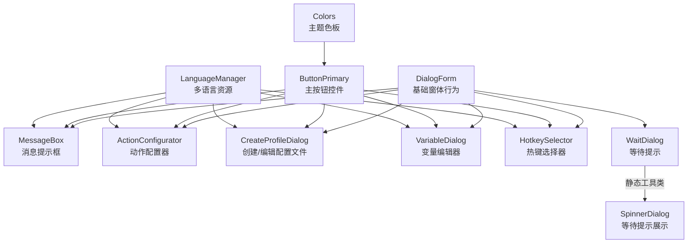
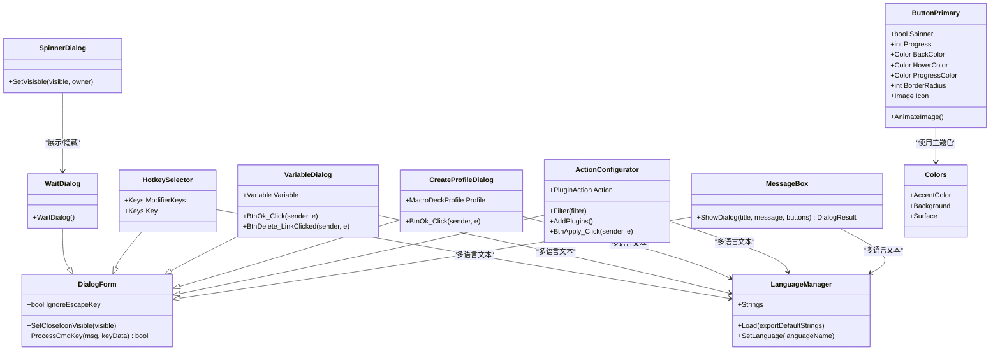
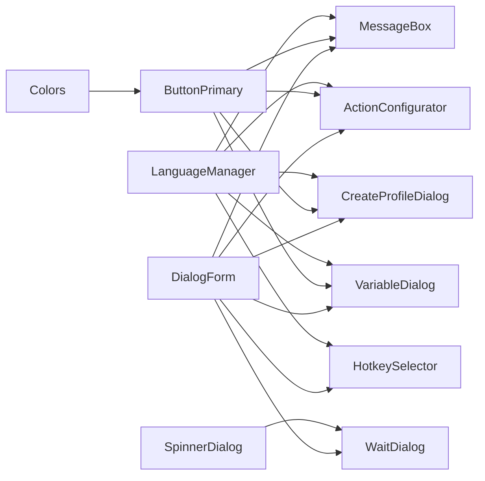
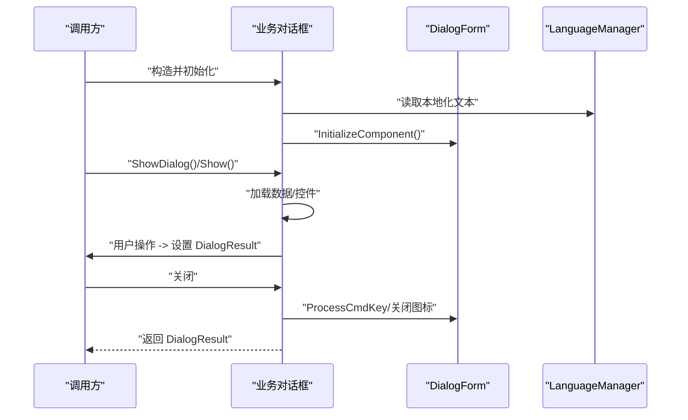
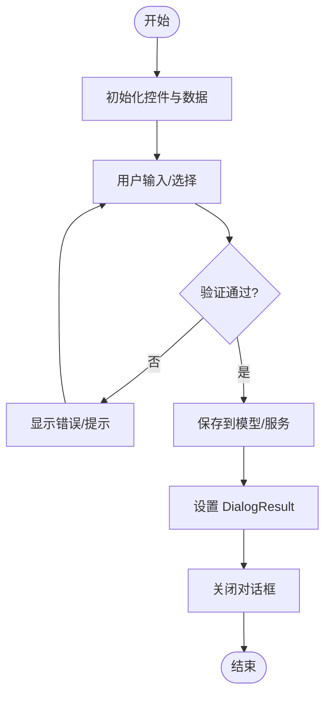

# 对话框系统

<cite>
**本文引用的文件**
- [DialogForm.cs](file://src/MacroDeck/GUI/CustomControls/DialogForm.cs)
- [DialogForm.Designer.cs](file://src/MacroDeck/GUI/CustomControls/DialogForm.Designer.cs)
- [MessageBox.cs](file://src/MacroDeck/GUI/CustomControls/MessageBox.cs)
- [ButtonPrimary.cs](file://src/MacroDeck/GUI/CustomControls/ButtonPrimary.cs)
- [ActionConfigurator.cs](file://src/MacroDeck/GUI/Dialogs/ActionConfigurator.cs)
- [CreateProfileDialog.cs](file://src/MacroDeck/GUI/Dialogs/CreateProfileDialog.cs)
- [WaitDialog.cs](file://src/MacroDeck/GUI/Dialogs/WaitDialog.cs)
- [VariableDialog.cs](file://src/MacroDeck/GUI/Dialogs/VariableDialog.cs)
- [HotkeySelector.cs](file://src/MacroDeck/GUI/Dialogs/HotkeySelector.cs)
- [LanguageManager.cs](file://src/MacroDeck/Language/LanguageManager.cs)
- [Colors.cs](file://src/MacroDeck/GUI/Colors.cs)
</cite>

## 目录
1. [简介](#简介)
2. [项目结构](#项目结构)
3. [核心组件](#核心组件)
4. [架构总览](#架构总览)
5. [详细组件分析](#详细组件分析)
6. [依赖关系分析](#依赖关系分析)
7. [性能考量](#性能考量)
8. [故障排查指南](#故障排查指南)
9. [结论](#结论)
10. [附录](#附录)

## 简介
本文件系统化梳理 Macro-Deck 的对话框体系，覆盖基础框架、常用对话框、生命周期与数据流、布局与多语言支持、样式与主题、可访问性与键盘导航，以及常见使用模式与最佳实践。目标是帮助开发者快速理解并正确扩展或维护对话框功能。

## 项目结构
对话框系统主要由三层构成：
- 基础层：DialogForm 提供通用行为（如 Escape 关闭、关闭按钮可见性控制）。
- 控件层：MessageBox、ButtonPrimary 等自定义控件，统一风格与交互。
- 功能层：各类业务对话框（如 ActionConfigurator、CreateProfileDialog、VariableDialog、HotkeySelector、WaitDialog），负责具体业务流程与数据绑定。

图表来源
- [DialogForm.cs:1-34](file://src/MacroDeck/GUI/CustomControls/DialogForm.cs#L1-L34)
- [MessageBox.cs:1-70](file://src/MacroDeck/GUI/CustomControls/MessageBox.cs#L1-L70)
- [ButtonPrimary.cs:1-234](file://src/MacroDeck/GUI/CustomControls/ButtonPrimary.cs#L1-L234)
- [ActionConfigurator.cs:1-251](file://src/MacroDeck/GUI/Dialogs/ActionConfigurator.cs#L1-L251)
- [CreateProfileDialog.cs:1-62](file://src/MacroDeck/GUI/Dialogs/CreateProfileDialog.cs#L1-L62)
- [VariableDialog.cs:1-142](file://src/MacroDeck/GUI/Dialogs/VariableDialog.cs#L1-L142)
- [HotkeySelector.cs:1-71](file://src/MacroDeck/GUI/Dialogs/HotkeySelector.cs#L1-L71)
- [WaitDialog.cs:1-41](file://src/MacroDeck/GUI/Dialogs/WaitDialog.cs#L1-L41)
- [LanguageManager.cs:1-121](file://src/MacroDeck/Language/LanguageManager.cs#L1-L121)
- [Colors.cs:1-15](file://src/MacroDeck/GUI/Colors.cs#L1-L15)

章节来源
- [DialogForm.cs:1-34](file://src/MacroDeck/GUI/CustomControls/DialogForm.cs#L1-L34)
- [MessageBox.cs:1-70](file://src/MacroDeck/GUI/CustomControls/MessageBox.cs#L1-L70)
- [ButtonPrimary.cs:1-234](file://src/MacroDeck/GUI/CustomControls/ButtonPrimary.cs#L1-L234)
- [ActionConfigurator.cs:1-251](file://src/MacroDeck/GUI/Dialogs/ActionConfigurator.cs#L1-L251)
- [CreateProfileDialog.cs:1-62](file://src/MacroDeck/GUI/Dialogs/CreateProfileDialog.cs#L1-L62)
- [VariableDialog.cs:1-142](file://src/MacroDeck/GUI/Dialogs/VariableDialog.cs#L1-L142)
- [HotkeySelector.cs:1-71](file://src/MacroDeck/GUI/Dialogs/HotkeySelector.cs#L1-L71)
- [WaitDialog.cs:1-41](file://src/MacroDeck/GUI/Dialogs/WaitDialog.cs#L1-L41)
- [LanguageManager.cs:1-121](file://src/MacroDeck/Language/LanguageManager.cs#L1-L121)
- [Colors.cs:1-15](file://src/MacroDeck/GUI/Colors.cs#L1-L15)

## 核心组件
- DialogForm：所有对话框的基础窗体，提供 Escape 键处理、关闭图标可见性控制等通用能力。
- MessageBox：基于 DialogForm 的消息提示框，支持 OK/Yes/No 按钮组合，自动居中显示，无关闭图标。
- ButtonPrimary：圆角、悬停高亮、进度/旋转动画的主按钮控件，用于对话框确认与操作。
- ActionConfigurator：插件动作选择与配置对话框，动态加载插件与动作项，支持搜索过滤与展开折叠。
- CreateProfileDialog：创建或编辑配置文件对话框，包含输入校验与冲突检测。
- VariableDialog：变量增删改查对话框，支持类型转换与值校验。
- HotkeySelector：热键采集对话框，捕获修饰键与普通键组合。
- WaitDialog + SpinnerDialog：等待提示对话框及其静态展示工具，避免阻塞 UI 线程。

章节来源
- [DialogForm.cs:1-34](file://src/MacroDeck/GUI/CustomControls/DialogForm.cs#L1-L34)
- [MessageBox.cs:1-70](file://src/MacroDeck/GUI/CustomControls/MessageBox.cs#L1-L70)
- [ButtonPrimary.cs:1-234](file://src/MacroDeck/GUI/CustomControls/ButtonPrimary.cs#L1-L234)
- [ActionConfigurator.cs:1-251](file://src/MacroDeck/GUI/Dialogs/ActionConfigurator.cs#L1-L251)
- [CreateProfileDialog.cs:1-62](file://src/MacroDeck/GUI/Dialogs/CreateProfileDialog.cs#L1-L62)
- [VariableDialog.cs:1-142](file://src/MacroDeck/GUI/Dialogs/VariableDialog.cs#L1-L142)
- [HotkeySelector.cs:1-71](file://src/MacroDeck/GUI/Dialogs/HotkeySelector.cs#L1-L71)
- [WaitDialog.cs:1-41](file://src/MacroDeck/GUI/Dialogs/WaitDialog.cs#L1-L41)

## 架构总览
对话框系统采用“基础窗体 + 自定义控件 + 业务对话框”的分层架构。基础窗体统一处理键盘与关闭行为；自定义控件统一视觉与交互；业务对话框承载具体业务逻辑与数据绑定。

图表来源
- [DialogForm.cs:1-34](file://src/MacroDeck/GUI/CustomControls/DialogForm.cs#L1-L34)
- [MessageBox.cs:1-70](file://src/MacroDeck/GUI/CustomControls/MessageBox.cs#L1-L70)
- [ButtonPrimary.cs:1-234](file://src/MacroDeck/GUI/CustomControls/ButtonPrimary.cs#L1-L234)
- [ActionConfigurator.cs:1-251](file://src/MacroDeck/GUI/Dialogs/ActionConfigurator.cs#L1-L251)
- [CreateProfileDialog.cs:1-62](file://src/MacroDeck/GUI/Dialogs/CreateProfileDialog.cs#L1-L62)
- [VariableDialog.cs:1-142](file://src/MacroDeck/GUI/Dialogs/VariableDialog.cs#L1-L142)
- [HotkeySelector.cs:1-71](file://src/MacroDeck/GUI/Dialogs/HotkeySelector.cs#L1-L71)
- [WaitDialog.cs:1-41](file://src/MacroDeck/GUI/Dialogs/WaitDialog.cs#L1-L41)
- [LanguageManager.cs:1-121](file://src/MacroDeck/Language/LanguageManager.cs#L1-L121)
- [Colors.cs:1-15](file://src/MacroDeck/GUI/Colors.cs#L1-L15)

## 详细组件分析

### DialogForm 基础窗体
- 职责：提供统一的键盘与关闭行为，支持忽略 Escape 键、控制关闭按钮可见性。
- 关键点：
  - Escape 处理：默认按 Escape 关闭窗体；可通过 IgnoreEscapeKey 屏蔽。
  - 关闭图标：通过 SetCloseIconVisible 控制是否显示标题栏关闭按钮。
- 生命周期：构造初始化后，由派生对话框决定显示方式（模态/非模态）。

章节来源
- [DialogForm.cs:1-34](file://src/MacroDeck/GUI/CustomControls/DialogForm.cs#L1-L34)
- [DialogForm.Designer.cs](file://src/MacroDeck/GUI/CustomControls/DialogForm.Designer.cs)

### MessageBox 消息提示框
- 类型：非模态（无关闭图标）、居中显示。
- 行为：根据传入按钮类型动态生成按钮集合，设置默认选中按钮，返回用户选择。
- 数据绑定：标题、消息、按钮文本均来自多语言资源；按钮点击设置 DialogResult 并关闭。

章节来源
- [MessageBox.cs:1-70](file://src/MacroDeck/GUI/CustomControls/MessageBox.cs#L1-L70)

### ButtonPrimary 主按钮控件
- 视觉：圆角边框、悬停高亮、可选进度条与旋转动画。
- 主题：使用 Colors 中的主题色；支持自定义背景色、悬停色、进度色。
- 交互：鼠标进入/离开切换高亮状态；支持图标绘制与文本渲染。

章节来源
- [ButtonPrimary.cs:1-234](file://src/MacroDeck/GUI/CustomControls/ButtonPrimary.cs#L1-L234)
- [Colors.cs:1-15](file://src/MacroDeck/GUI/Colors.cs#L1-L15)

### ActionConfigurator 动作配置器
- 目标：选择插件与动作，并加载其配置控件。
- 流程要点：
  - 初始化时设置本地化文本与事件订阅。
  - OnShown 阶段加载插件列表，若传入已有动作则自动展开对应插件并触发选择。
  - 支持搜索过滤，动态显示/隐藏动作项并展开父插件。
  - Apply 保存时调用配置控件的保存方法，进行必要校验后再设置 DialogResult。
- 数据绑定：配置面板动态注入 Action.GetActionConfigControl(this)，实现配置界面与业务模型解耦。

章节来源
- [ActionConfigurator.cs:1-251](file://src/MacroDeck/GUI/Dialogs/ActionConfigurator.cs#L1-L251)

### CreateProfileDialog 配置文件创建/编辑
- 输入校验：名称长度检查；新建时检测重名并弹出消息提示。
- 结果返回：成功后设置 DialogResult.OK 并关闭。
- 多语言：标签与按钮文本来自 LanguageManager.Strings。

章节来源
- [CreateProfileDialog.cs:1-62](file://src/MacroDeck/GUI/Dialogs/CreateProfileDialog.cs#L1-L62)
- [LanguageManager.cs:1-121](file://src/MacroDeck/Language/LanguageManager.cs#L1-L121)

### VariableDialog 变量编辑器
- 权限与保护：受 Creator 非“User”限制的变量不可编辑；新建时允许修改类型与值。
- 类型转换：根据类型对字符串进行解析或默认值填充。
- 删除流程：二次确认后删除变量并取消对话框。
- 多语言：标签与按钮文本来自 LanguageManager.Strings。

章节来源
- [VariableDialog.cs:1-142](file://src/MacroDeck/GUI/Dialogs/VariableDialog.cs#L1-L142)
- [LanguageManager.cs:1-121](file://src/MacroDeck/Language/LanguageManager.cs#L1-L121)

### HotkeySelector 热键选择器
- 采集逻辑：加载时暂停全局热键监听；KeyDown 捕获普通键，KeyUp 清空提示。
- 修饰键识别：区分并记录修饰键状态与组合。
- 结果返回：按键释放时记录 Key，设置 DialogResult.OK 并关闭。

章节来源
- [HotkeySelector.cs:1-71](file://src/MacroDeck/GUI/Dialogs/HotkeySelector.cs#L1-L71)

### WaitDialog + SpinnerDialog 等待提示
- WaitDialog：无关闭图标、显示“请稍候”文本。
- SpinnerDialog：静态工具类，提供 SetVisisble(visible, owner) 在主线程安全地显示/隐藏等待对话框，避免阻塞 UI。

章节来源
- [WaitDialog.cs:1-41](file://src/MacroDeck/GUI/Dialogs/WaitDialog.cs#L1-L41)

## 依赖关系分析
- 继承关系：各业务对话框均继承自 DialogForm，复用键盘与关闭行为。
- 控件依赖：MessageBox、ActionConfigurator、CreateProfileDialog、VariableDialog 使用 ButtonPrimary。
- 多语言：所有对话框依赖 LanguageManager.Strings 进行本地化。
- 主题：ButtonPrimary 使用 Colors 定义的颜色；Colors 作为全局主题色板。
- 工具类：SpinnerDialog 依赖 WaitDialog 实现等待提示。

图表来源
- [DialogForm.cs:1-34](file://src/MacroDeck/GUI/CustomControls/DialogForm.cs#L1-L34)
- [MessageBox.cs:1-70](file://src/MacroDeck/GUI/CustomControls/MessageBox.cs#L1-L70)
- [ButtonPrimary.cs:1-234](file://src/MacroDeck/GUI/CustomControls/ButtonPrimary.cs#L1-L234)
- [ActionConfigurator.cs:1-251](file://src/MacroDeck/GUI/Dialogs/ActionConfigurator.cs#L1-L251)
- [CreateProfileDialog.cs:1-62](file://src/MacroDeck/GUI/Dialogs/CreateProfileDialog.cs#L1-L62)
- [VariableDialog.cs:1-142](file://src/MacroDeck/GUI/Dialogs/VariableDialog.cs#L1-L142)
- [HotkeySelector.cs:1-71](file://src/MacroDeck/GUI/Dialogs/HotkeySelector.cs#L1-L71)
- [WaitDialog.cs:1-41](file://src/MacroDeck/GUI/Dialogs/WaitDialog.cs#L1-L41)
- [LanguageManager.cs:1-121](file://src/MacroDeck/Language/LanguageManager.cs#L1-L121)
- [Colors.cs:1-15](file://src/MacroDeck/GUI/Colors.cs#L1-L15)

## 性能考量
- 避免阻塞 UI：使用 SpinnerDialog 在子线程执行耗时任务时显示等待提示，不直接调用 ShowDialog 阻塞主线程。
- 控件重绘优化：ButtonPrimary 使用双缓冲与路径裁剪，减少闪烁与提升绘制性能。
- 动画帧更新：ButtonPrimary 的旋转动画通过 ImageAnimator 更新帧，避免每帧重复创建对象。
- 列表渲染：ActionConfigurator 在 OnShown 后一次性加载插件与动作项，减少频繁 UI 刷新。

[本节为通用建议，无需列出章节来源]

## 故障排查指南
- Escape 无法关闭对话框
  - 检查是否设置了 IgnoreEscapeKey=true；如需屏蔽 Escape，请确保仅在特定场景启用。
- 按钮未响应或焦点异常
  - 确认按钮已设置 Select() 或默认选中；MessageBox 会在不同按钮组合下设置默认焦点。
- 多语言文本未生效
  - 确保 LanguageManager.Load 已调用且 SetLanguage 已设置；检查资源文件是否正确嵌入。
- 等待提示不显示
  - 确认通过 SpinnerDialog.SetVisisble(true, owner) 以主线程上下文调用；避免跨线程直接操作 UI。
- 热键采集异常
  - 确认加载时已暂停全局热键监听；KeyDown/KeyUp 事件顺序正确，修饰键与普通键分别处理。

章节来源
- [DialogForm.cs:1-34](file://src/MacroDeck/GUI/CustomControls/DialogForm.cs#L1-L34)
- [MessageBox.cs:1-70](file://src/MacroDeck/GUI/CustomControls/MessageBox.cs#L1-L70)
- [LanguageManager.cs:1-121](file://src/MacroDeck/Language/LanguageManager.cs#L1-L121)
- [WaitDialog.cs:1-41](file://src/MacroDeck/GUI/Dialogs/WaitDialog.cs#L1-L41)
- [HotkeySelector.cs:1-71](file://src/MacroDeck/GUI/Dialogs/HotkeySelector.cs#L1-L71)

## 结论
Macro-Deck 的对话框系统以 DialogForm 为基础，结合自定义控件与业务对话框，实现了统一的交互体验与良好的扩展性。通过多语言与主题系统，对话框具备一致的外观与国际化能力；通过 SpinnerDialog 等工具，兼顾了性能与用户体验。遵循本文档的最佳实践，可高效构建新的对话框类型并保持整体一致性。

[本节为总结，无需列出章节来源]

## 附录

### 对话框生命周期与数据流（序列图）

图表来源
- [DialogForm.cs:1-34](file://src/MacroDeck/GUI/CustomControls/DialogForm.cs#L1-L34)
- [LanguageManager.cs:1-121](file://src/MacroDeck/Language/LanguageManager.cs#L1-L121)

### 数据绑定与验证流程（流程图）

图表来源
- [CreateProfileDialog.cs:1-62](file://src/MacroDeck/GUI/Dialogs/CreateProfileDialog.cs#L1-L62)
- [VariableDialog.cs:1-142](file://src/MacroDeck/GUI/Dialogs/VariableDialog.cs#L1-L142)
- [ActionConfigurator.cs:1-251](file://src/MacroDeck/GUI/Dialogs/ActionConfigurator.cs#L1-L251)

### 常见对话框使用模式与最佳实践
- 模态对话框
  - 适用于需要阻断用户操作的场景（如确认删除、输入敏感信息）。
  - 使用 ShowDialog() 显示；完成后读取 DialogResult 判断用户选择。
- 非模态对话框
  - 适用于信息提示或可随时关闭的窗口（如 MessageBox）。
  - 注意避免与父窗体交互冲突，必要时设置 Owner。
- 自定义对话框
  - 继承 DialogForm，统一键盘与关闭行为；使用 ButtonPrimary 保证一致风格。
  - 将业务逻辑与 UI 解耦，通过配置控件实现数据绑定。
- 多语言与主题
  - 所有文本从 LanguageManager.Strings 获取；颜色使用 Colors。
- 可访问性与键盘导航
  - 为按钮设置 Select() 默认焦点；避免依赖鼠标交互。
  - 提供键盘快捷键（如 Enter/ESC）明确的行为反馈。
- 性能与体验
  - 耗时操作使用 SpinnerDialog 显示等待；避免阻塞 UI 线程。
  - 控件重绘与动画尽量使用双缓冲与轻量级实现。

[本节为通用建议，无需列出章节来源]