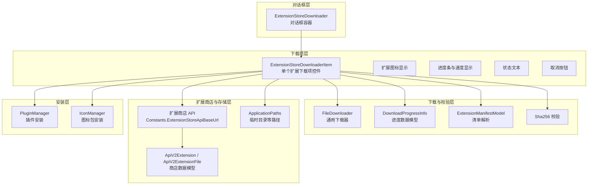
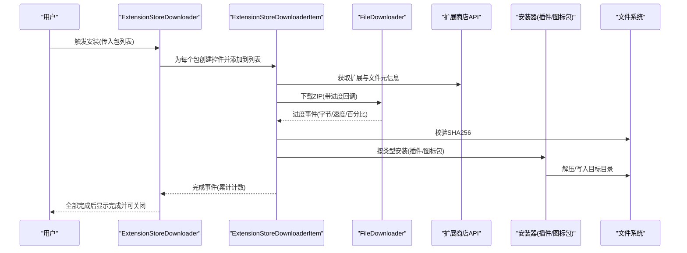
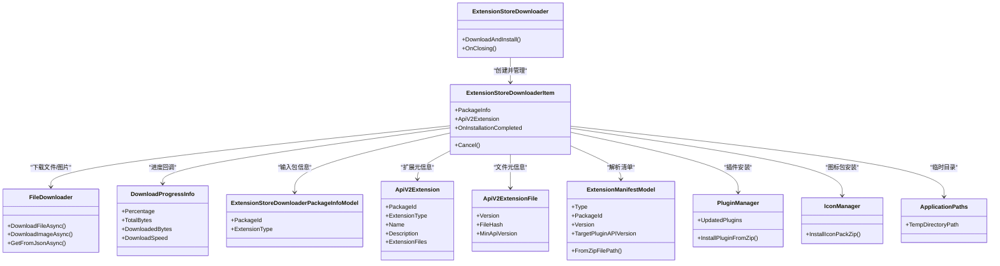

# 扩展商店下载器对话框

<cite>
**本文档引用的文件**
- [ExtensionStoreDownloader.cs](file://src/MacroDeck/GUI/Dialogs/ExtensionStoreDownloader.cs)
- [ExtensionStoreDownloaderItem.cs](file://src/MacroDeck/GUI/CustomControls/ExtensionStoreDownloader/ExtensionStoreDownloaderItem.cs)
- [FileDownloader.cs](file://src/MacroDeck/Utils/FileDownloader.cs)
- [DownloadProgressInfo.cs](file://src/MacroDeck/DataTypes/FileDownloader/DownloadProgressInfo.cs)
- [ExtensionStoreDownloaderPackageInfoModel.cs](file://src/MacroDeck/Models/ExtensionStoreDownloaderPackageInfoModel.cs)
- [ApiV2Extension.cs](file://src/MacroDeck/Models/ApiV2Extension.cs)
- [ApiV2ExtensionFile.cs](file://src/MacroDeck/Models/ApiV2ExtensionFile.cs)
- [ExtensionStoreHelper.cs](file://src/MacroDeck/ExtensionStore/ExtensionStoreHelper.cs)
- [Constants.cs](file://src/MacroDeck/Constants.cs)
- [ApplicationPaths.cs](file://src/MacroDeck/StartupConfig/ApplicationPaths.cs)
- [ExtensionManifestModel.cs](file://src/MacroDeck/Models/ExtensionManifestModel.cs)
- [PluginManager.cs](file://src/MacroDeck/Plugins/PluginManager.cs)
- [IconManager.cs](file://src/MacroDeck/Icons/IconManager.cs)
</cite>

## 目录
1. [简介](#简介)
2. [项目结构](#项目结构)
3. [核心组件](#核心组件)
4. [架构总览](#架构总览)
5. [详细组件分析](#详细组件分析)
6. [依赖关系分析](#依赖关系分析)
7. [性能考虑](#性能考虑)
8. [故障排除指南](#故障排除指南)
9. [结论](#结论)

## 简介
本文件面向 Macro-Deck 扩展商店下载器对话框，系统性阐述其架构设计与下载流程管理，覆盖下载进度跟踪、状态显示、错误处理、并发控制与队列管理、UI 设计与交互体验优化，以及与扩展商店系统的集成方式与数据传输协议。读者可据此理解从触发安装到完成安装的完整链路，并掌握在复杂场景下的排障与优化方法。

## 项目结构
扩展商店下载器由“对话框容器 + 多个下载项控件”构成，配合通用文件下载器、应用路径配置、插件与图标包管理器共同完成安装与校验。

图示来源
- [ExtensionStoreDownloader.cs:11-83](file://src/MacroDeck/GUI/Dialogs/ExtensionStoreDownloader.cs#L11-L83)
- [ExtensionStoreDownloaderItem.cs:16-241](file://src/MacroDeck/GUI/CustomControls/ExtensionStoreDownloader/ExtensionStoreDownloaderItem.cs#L16-L241)
- [FileDownloader.cs:9-84](file://src/MacroDeck/Utils/FileDownloader.cs#L9-L84)
- [DownloadProgressInfo.cs:3-9](file://src/MacroDeck/DataTypes/FileDownloader/DownloadProgressInfo.cs#L3-L9)
- [ExtensionManifestModel.cs:8-61](file://src/MacroDeck/Models/ExtensionManifestModel.cs#L8-L61)
- [Constants.cs:4-6](file://src/MacroDeck/Constants.cs#L4-L6)
- [ApplicationPaths.cs:6-143](file://src/MacroDeck/StartupConfig/ApplicationPaths.cs#L6-L143)
- [PluginManager.cs:20-200](file://src/MacroDeck/Plugins/PluginManager.cs#L20-L200)
- [IconManager.cs:14-200](file://src/MacroDeck/Icons/IconManager.cs#L14-L200)

章节来源
- [ExtensionStoreDownloader.cs:11-83](file://src/MacroDeck/GUI/Dialogs/ExtensionStoreDownloader.cs#L11-L83)
- [ExtensionStoreDownloaderItem.cs:16-241](file://src/MacroDeck/GUI/CustomControls/ExtensionStoreDownloader/ExtensionStoreDownloaderItem.cs#L16-L241)
- [FileDownloader.cs:9-84](file://src/MacroDeck/Utils/FileDownloader.cs#L9-L84)
- [ApplicationPaths.cs:6-143](file://src/MacroDeck/StartupConfig/ApplicationPaths.cs#L6-L143)

## 核心组件
- 对话框容器：负责接收待安装包列表、创建并管理多个下载项控件、汇总完成状态并在全部完成后提示“完成”。
- 下载项控件：对单个扩展执行准备、下载、校验与安装，支持取消、进度上报与状态更新。
- 通用下载器：基于共享 HttpClient 的流式下载，支持进度回调与取消令牌。
- 数据模型：扩展商店 API 返回的数据模型（扩展与文件元信息）、下载进度数据模型、扩展清单模型。
- 安装器：根据扩展类型调用插件或图标包安装逻辑，并清理临时资源。
- 路径与常量：统一管理临时目录、扩展商店 API 基础地址等。

章节来源
- [ExtensionStoreDownloader.cs:15-83](file://src/MacroDeck/GUI/Dialogs/ExtensionStoreDownloader.cs#L15-L83)
- [ExtensionStoreDownloaderItem.cs:20-241](file://src/MacroDeck/GUI/CustomControls/ExtensionStoreDownloader/ExtensionStoreDownloaderItem.cs#L20-L241)
- [FileDownloader.cs:9-84](file://src/MacroDeck/Utils/FileDownloader.cs#L9-L84)
- [ExtensionStoreDownloaderPackageInfoModel.cs:5-9](file://src/MacroDeck/Models/ExtensionStoreDownloaderPackageInfoModel.cs#L5-L9)
- [ApiV2Extension.cs:5-16](file://src/MacroDeck/Models/ApiV2Extension.cs#L5-L16)
- [ApiV2ExtensionFile.cs:3-14](file://src/MacroDeck/Models/ApiV2ExtensionFile.cs#L3-L14)
- [ExtensionManifestModel.cs:8-61](file://src/MacroDeck/Models/ExtensionManifestModel.cs#L8-L61)
- [Constants.cs:4-6](file://src/MacroDeck/Constants.cs#L4-L6)
- [ApplicationPaths.cs:6-143](file://src/MacroDeck/StartupConfig/ApplicationPaths.cs#L6-L143)

## 架构总览
下载器采用“对话框 + 多控件”的并行模式：对话框启动后为每个包创建一个下载项控件，各控件独立发起网络请求、下载文件、校验哈希并安装。进度通过回调实时更新 UI，错误时统一设置状态并允许取消。全部完成时对话框显示完成提示并按需请求重启。

图示来源
- [ExtensionStoreDownloader.cs:39-82](file://src/MacroDeck/GUI/Dialogs/ExtensionStoreDownloader.cs#L39-L82)
- [ExtensionStoreDownloaderItem.cs:64-225](file://src/MacroDeck/GUI/CustomControls/ExtensionStoreDownloader/ExtensionStoreDownloaderItem.cs#L64-L225)
- [FileDownloader.cs:15-65](file://src/MacroDeck/Utils/FileDownloader.cs#L15-L65)
- [PluginManager.cs:20-200](file://src/MacroDeck/Plugins/PluginManager.cs#L20-L200)
- [IconManager.cs:14-200](file://src/MacroDeck/Icons/IconManager.cs#L14-L200)

## 详细组件分析

### 对话框容器：ExtensionStoreDownloader
职责
- 接收包列表，初始化 UI 并禁用父窗口。
- 为每个包创建下载项控件，订阅完成事件以统计完成数量。
- 全部完成后更新状态并显示“完成”按钮。

并发与队列
- 通过循环创建多个下载项控件并行执行，无显式串行队列；控件内部各自管理异步流程与取消令牌。
- 使用线程池任务启动整体流程，避免阻塞 UI。

UI 与交互
- 动态更新“正在下载/安装 X 个包”的提示。
- 全部完成后显示“完成”按钮，点击后如存在已更新插件则请求重启。

章节来源
- [ExtensionStoreDownloader.cs:15-83](file://src/MacroDeck/GUI/Dialogs/ExtensionStoreDownloader.cs#L15-L83)

### 下载项控件：ExtensionStoreDownloaderItem
职责
- 单个扩展的完整生命周期：准备、获取元信息、下载、校验、安装、清理。
- 支持取消、进度展示、状态文本更新。

关键流程
- 准备阶段：构造商店 API 请求参数（包 ID、插件 API 版本、Macro Deck 版本）。
- 获取元信息：分别请求扩展详情与文件信息，确定下载地址与期望哈希。
- 下载：使用通用下载器进行流式下载，进度通过回调更新 UI。
- 校验：计算本地文件 SHA256，与服务器期望值对比。
- 安装：根据扩展类型调用插件或图标包安装器。
- 清理：删除临时目录与 ZIP 文件，触发完成事件。

错误处理
- 任意阶段异常均记录日志、设置状态为“错误”，并尝试取消后续流程。
- 取消时更新 UI 并触发完成事件，确保对话框能继续推进。

章节来源
- [ExtensionStoreDownloaderItem.cs:20-241](file://src/MacroDeck/GUI/CustomControls/ExtensionStoreDownloader/ExtensionStoreDownloaderItem.cs#L20-L241)

### 通用下载器：FileDownloader
职责
- 提供共享 HttpClient，复用连接以降低开销。
- 流式下载文件，支持进度上报与取消。
- 提供图片下载与 JSON 获取的便捷方法。

实现要点
- 使用 HttpCompletionOption.ResponseHeadersRead 以尽早拿到内容长度，便于进度计算。
- 读取缓冲区大小与异步写入，边读边写，降低内存占用。
- 进度计算基于时间戳的下载速度，百分比基于已下载字节与总字节。

章节来源
- [FileDownloader.cs:9-84](file://src/MacroDeck/Utils/FileDownloader.cs#L9-L84)
- [DownloadProgressInfo.cs:3-9](file://src/MacroDeck/DataTypes/FileDownloader/DownloadProgressInfo.cs#L3-L9)

### 数据模型与商店集成
- 包信息模型：包含包 ID 与扩展类型，作为下载入口。
- 商店数据模型：扩展与文件元信息，包含版本、哈希、最小 API 版本等。
- 常量：扩展商店 API 基础地址。
- 安装器：根据扩展类型选择插件或图标包安装路径与流程。

章节来源
- [ExtensionStoreDownloaderPackageInfoModel.cs:5-9](file://src/MacroDeck/Models/ExtensionStoreDownloaderPackageInfoModel.cs#L5-L9)
- [ApiV2Extension.cs:5-16](file://src/MacroDeck/Models/ApiV2Extension.cs#L5-L16)
- [ApiV2ExtensionFile.cs:3-14](file://src/MacroDeck/Models/ApiV2ExtensionFile.cs#L3-L14)
- [Constants.cs:4-6](file://src/MacroDeck/Constants.cs#L4-L6)
- [ExtensionManifestModel.cs:8-61](file://src/MacroDeck/Models/ExtensionManifestModel.cs#L8-L61)

### 安装与清理
- 插件安装：通过插件管理器从 ZIP 安装，支持更新目录与启用流程。
- 图标包安装：通过图标管理器从 ZIP 安装，生成预览与索引。
- 清理：删除临时目录与 ZIP 文件，避免磁盘累积。

章节来源
- [PluginManager.cs:20-200](file://src/MacroDeck/Plugins/PluginManager.cs#L20-L200)
- [IconManager.cs:14-200](file://src/MacroDeck/Icons/IconManager.cs#L14-L200)
- [ApplicationPaths.cs:6-143](file://src/MacroDeck/StartupConfig/ApplicationPaths.cs#L6-L143)

## 依赖关系分析

图示来源
- [ExtensionStoreDownloader.cs:11-83](file://src/MacroDeck/GUI/Dialogs/ExtensionStoreDownloader.cs#L11-L83)
- [ExtensionStoreDownloaderItem.cs:16-241](file://src/MacroDeck/GUI/CustomControls/ExtensionStoreDownloader/ExtensionStoreDownloaderItem.cs#L16-L241)
- [FileDownloader.cs:9-84](file://src/MacroDeck/Utils/FileDownloader.cs#L9-L84)
- [DownloadProgressInfo.cs:3-9](file://src/MacroDeck/DataTypes/FileDownloader/DownloadProgressInfo.cs#L3-L9)
- [ExtensionStoreDownloaderPackageInfoModel.cs:5-9](file://src/MacroDeck/Models/ExtensionStoreDownloaderPackageInfoModel.cs#L5-L9)
- [ApiV2Extension.cs:5-16](file://src/MacroDeck/Models/ApiV2Extension.cs#L5-L16)
- [ApiV2ExtensionFile.cs:3-14](file://src/MacroDeck/Models/ApiV2ExtensionFile.cs#L3-L14)
- [ExtensionManifestModel.cs:8-61](file://src/MacroDeck/Models/ExtensionManifestModel.cs#L8-L61)
- [PluginManager.cs:20-200](file://src/MacroDeck/Plugins/PluginManager.cs#L20-L200)
- [IconManager.cs:14-200](file://src/MacroDeck/Icons/IconManager.cs#L14-L200)
- [ApplicationPaths.cs:6-143](file://src/MacroDeck/StartupConfig/ApplicationPaths.cs#L6-L143)

## 性能考虑
- 连接复用：共享 HttpClient 避免重复 DNS 与 TLS 握手，降低延迟与资源消耗。
- 流式下载：响应头读取后即开始流式写入，减少内存峰值；缓冲区大小适中，兼顾吞吐与延迟。
- 进度计算：基于时间戳计算瞬时速度，百分比基于总字节，保证 UI 实时反馈。
- 并发策略：多控件并行下载，充分利用带宽；若需限制并发可在对话框层引入信号量或队列。
- 临时文件管理：下载完成后立即清理，避免磁盘膨胀；失败时也应确保异常路径的清理。

## 故障排除指南
常见问题与定位建议
- 下载进度不更新
  - 检查进度回调是否被正确传递至 UI 线程。
  - 确认服务端 Content-Length 是否可用，否则无法计算百分比。
- 校验失败
  - 对比服务器返回的哈希与本地计算结果，确认网络完整性。
  - 检查临时文件是否存在且未被外部程序占用。
- 安装失败
  - 查看扩展清单是否有效，类型与目标 API 版本是否匹配。
  - 检查目标目录权限与磁盘空间。
- 取消无效
  - 确保取消令牌在下载与安装阶段均被检查。
  - UI 线程更新取消后的状态与控件可见性。

章节来源
- [ExtensionStoreDownloaderItem.cs:116-130](file://src/MacroDeck/GUI/CustomControls/ExtensionStoreDownloader/ExtensionStoreDownloaderItem.cs#L116-L130)
- [ExtensionStoreDownloaderItem.cs:132-225](file://src/MacroDeck/GUI/CustomControls/ExtensionStoreDownloader/ExtensionStoreDownloaderItem.cs#L132-L225)
- [FileDownloader.cs:15-65](file://src/MacroDeck/Utils/FileDownloader.cs#L15-L65)

## 结论
扩展商店下载器对话框通过“对话框容器 + 多下载项控件”的并行架构，实现了高效、可观测、可取消的扩展安装流程。通用下载器提供稳定的网络与进度能力，安装器与校验逻辑保障了安全性与可靠性。结合路径管理与日志记录，系统在复杂环境下仍能保持良好的用户体验与可维护性。未来可在对话框层增加并发上限与重试策略，进一步提升稳定性与吞吐。