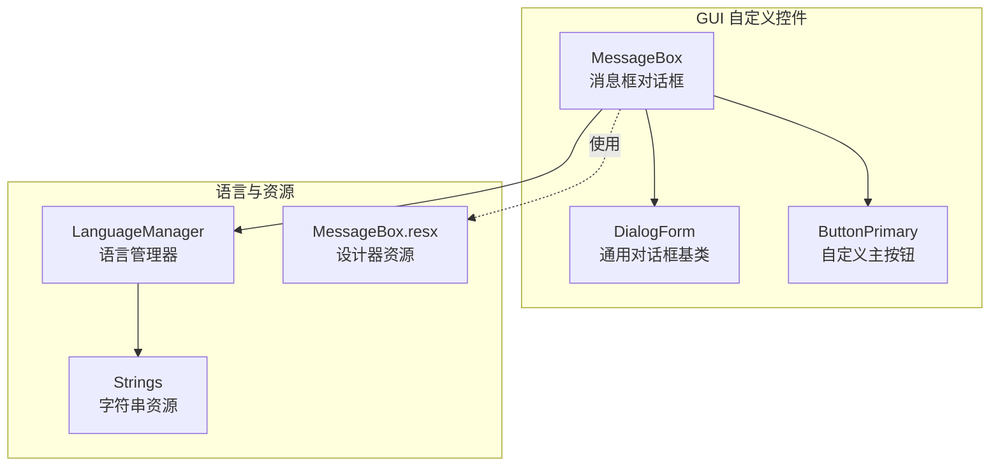
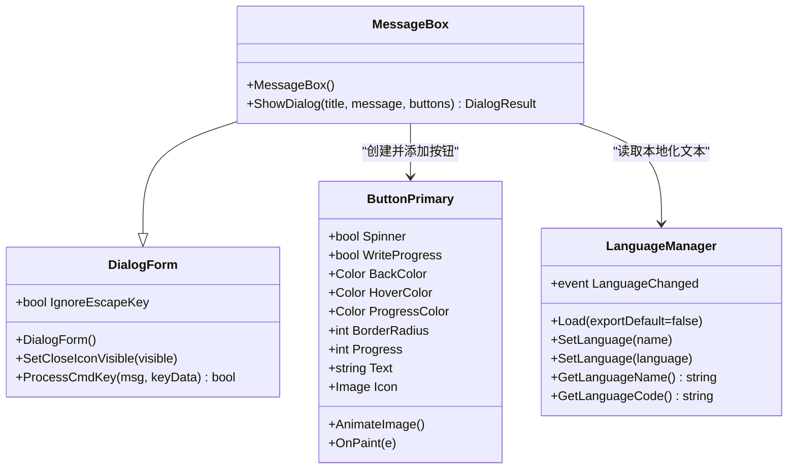
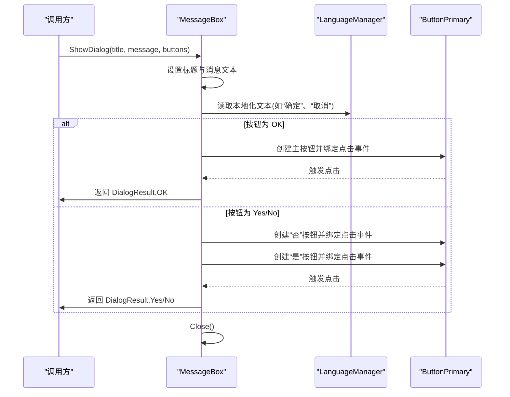
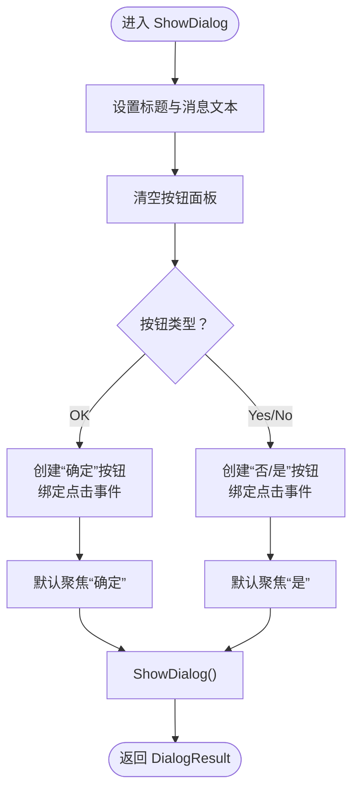
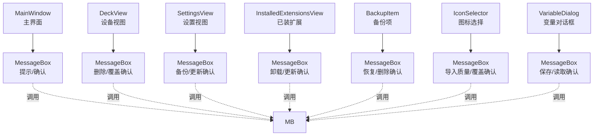
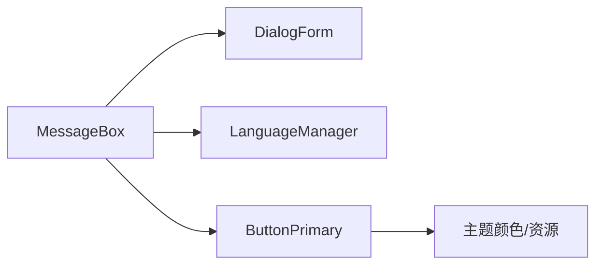

# 消息框对话框

<cite>
**本文引用的文件**
- [MessageBox.cs](file://src/MacroDeck/GUI/CustomControls/MessageBox.cs)
- [MessageBox.Designer.cs](file://src/MacroDeck/GUI/CustomControls/MessageBox.Designer.cs)
- [MessageBox.resx](file://src/MacroDeck/GUI/CustomControls/MessageBox.resx)
- [DialogForm.cs](file://src/MacroDeck/GUI/CustomControls/DialogForm.cs)
- [ButtonPrimary.cs](file://src/MacroDeck/GUI/CustomControls/ButtonPrimary.cs)
- [LanguageManager.cs](file://src/MacroDeck/Language/LanguageManager.cs)
- [Strings.cs](file://src/MacroDeck/Language/Strings.cs)
- [MainWindow.cs](file://src/MacroDeck/GUI/MainWindow.cs)
- [DeckView.cs](file://src/MacroDeck/GUI/MainWindowViews/DeckView.cs)
- [SettingsView.cs](file://src/MacroDeck/GUI/MainWindowViews/SettingsView.cs)
- [InstalledExtensionsView.cs](file://src/MacroDeck/GUI/CustomControls/ExtensionsView/InstalledExtensionsView.cs)
- [BackupItem.cs](file://src/MacroDeck/GUI/CustomControls/Settings/BackupItem.cs)
- [IconSelector.cs](file://src/MacroDeck/GUI/Dialogs/IconSelector.cs)
- [VariableDialog.cs](file://src/MacroDeck/GUI/Dialogs/VariableDialog.cs)
</cite>

## 目录
1. [简介](#简介)
2. [项目结构](#项目结构)
3. [核心组件](#核心组件)
4. [架构总览](#架构总览)
5. [详细组件分析](#详细组件分析)
6. [依赖关系分析](#依赖关系分析)
7. [性能考量](#性能考量)
8. [故障排查指南](#故障排查指南)
9. [结论](#结论)
10. [附录](#附录)

## 简介
本文件针对 Macro-Deck 的消息框对话框（MessageBox）进行系统化技术文档整理，覆盖设计模式与实现架构、消息类型分类、按钮配置与交互处理、国际化与多语言文本管理、样式定制与主题集成，以及在系统中的使用场景与调用模式。目标是帮助开发者与维护者快速理解与扩展消息框功能。

## 项目结构
消息框位于 GUI 自定义控件层，采用 WinForms 设计，继承通用对话框基类，结合自定义按钮控件与语言资源实现统一的提示与确认体验。

图示来源
- [MessageBox.cs:1-69](file://src/MacroDeck/GUI/CustomControls/MessageBox.cs#L1-L69)
- [DialogForm.cs:1-34](file://src/MacroDeck/GUI/CustomControls/DialogForm.cs#L1-L34)
- [ButtonPrimary.cs:1-234](file://src/MacroDeck/GUI/CustomControls/ButtonPrimary.cs#L1-L234)
- [LanguageManager.cs:1-121](file://src/MacroDeck/Language/LanguageManager.cs#L1-L121)
- [Strings.cs](file://src/MacroDeck/Language/Strings.cs)
- [MessageBox.resx:1-120](file://src/MacroDeck/GUI/CustomControls/MessageBox.resx#L1-L120)

章节来源
- [MessageBox.cs:1-69](file://src/MacroDeck/GUI/CustomControls/MessageBox.cs#L1-L69)
- [DialogForm.cs:1-34](file://src/MacroDeck/GUI/CustomControls/DialogForm.cs#L1-L34)
- [ButtonPrimary.cs:1-234](file://src/MacroDeck/GUI/CustomControls/ButtonPrimary.cs#L1-L234)
- [LanguageManager.cs:1-121](file://src/MacroDeck/Language/LanguageManager.cs#L1-L121)
- [MessageBox.resx:1-120](file://src/MacroDeck/GUI/CustomControls/MessageBox.resx#L1-L120)

## 核心组件
- 消息框主体：MessageBox 继承自 DialogForm，负责标题、消息内容与按钮面板的布局与交互。
- 通用对话框基类：DialogForm 提供关闭图标可见性控制与 Esc 键处理等通用行为。
- 主按钮控件：ButtonPrimary 提供圆角、悬停、进度与旋转动画等视觉特性，用于消息框按钮。
- 语言管理：LanguageManager 负责加载与切换语言资源，Strings 提供键值映射。
- 资源文件：MessageBox.resx 作为设计器资源容器，承载控件布局与本地化资源。

章节来源
- [MessageBox.cs:5-69](file://src/MacroDeck/GUI/CustomControls/MessageBox.cs#L5-L69)
- [DialogForm.cs:3-34](file://src/MacroDeck/GUI/CustomControls/DialogForm.cs#L3-L34)
- [ButtonPrimary.cs:6-234](file://src/MacroDeck/GUI/CustomControls/ButtonPrimary.cs#L6-L234)
- [LanguageManager.cs:8-121](file://src/MacroDeck/Language/LanguageManager.cs#L8-L121)
- [MessageBox.resx:1-120](file://src/MacroDeck/GUI/CustomControls/MessageBox.resx#L1-L120)

## 架构总览
消息框采用“控件组合 + 基类复用 + 语言资源”的分层架构：
- 控件层：MessageBox 负责 UI 布局与事件绑定；ButtonPrimary 提供可定制外观。
- 基类层：DialogForm 提供通用对话框行为（如关闭图标与键盘处理）。
- 资源层：LanguageManager 动态加载语言包，Strings 提供键值访问，MessageBox.resx 承载设计器资源。

图示来源
- [DialogForm.cs:3-34](file://src/MacroDeck/GUI/CustomControls/DialogForm.cs#L3-L34)
- [MessageBox.cs:5-69](file://src/MacroDeck/GUI/CustomControls/MessageBox.cs#L5-L69)
- [ButtonPrimary.cs:6-234](file://src/MacroDeck/GUI/CustomControls/ButtonPrimary.cs#L6-L234)
- [LanguageManager.cs:8-121](file://src/MacroDeck/Language/LanguageManager.cs#L8-L121)

## 详细组件分析

### 消息框设计模式与实现
- 继承关系：MessageBox 继承 DialogForm，获得通用对话框行为（如关闭图标隐藏、Esc 键处理）。
- 按钮策略：根据传入的按钮枚举动态构建按钮集合，当前支持 OK 与 Yes/No 两种布局。
- 选择焦点：默认按钮自动聚焦，提升键盘可用性。
- 关闭流程：按钮点击后设置 DialogResult 并关闭窗口，返回给调用方。

图示来源
- [MessageBox.cs:17-68](file://src/MacroDeck/GUI/CustomControls/MessageBox.cs#L17-L68)
- [LanguageManager.cs:16-18](file://src/MacroDeck/Language/LanguageManager.cs#L16-L18)
- [ButtonPrimary.cs:116-132](file://src/MacroDeck/GUI/CustomControls/ButtonPrimary.cs#L116-L132)

章节来源
- [MessageBox.cs:7-15](file://src/MacroDeck/GUI/CustomControls/MessageBox.cs#L7-L15)
- [MessageBox.cs:17-68](file://src/MacroDeck/GUI/CustomControls/MessageBox.cs#L17-L68)
- [DialogForm.cs:12-32](file://src/MacroDeck/GUI/CustomControls/DialogForm.cs#L12-L32)

### 消息类型分类与创建逻辑
- 信息提示：通过传入 MessageBoxButtons.OK 显示单按钮确认。
- 确认对话框：通过传入 MessageBoxButtons.YesNo 显示双按钮确认。
- 错误与警告：当前实现未直接暴露专用枚举，但可通过组合按钮与文本达到类似效果（例如在调用处自行决定文案与按钮布局）。

图示来源
- [MessageBox.cs:17-68](file://src/MacroDeck/GUI/CustomControls/MessageBox.cs#L17-L68)

章节来源
- [MessageBox.cs:22-64](file://src/MacroDeck/GUI/CustomControls/MessageBox.cs#L22-L64)

### 按钮配置与用户交互处理
- 按钮尺寸与自适应：按钮启用自适应大小与最小宽度约束，保证在不同 DPI 下的可读性。
- 点击事件：每个按钮绑定点击事件，设置对应的 DialogResult 并关闭窗口。
- 焦点策略：默认按钮自动获得焦点，提升键盘操作效率。
- 右到左布局：按钮面板采用右到左流式布局，符合常见确认对话框的视觉习惯。

章节来源
- [MessageBox.cs:26-37](file://src/MacroDeck/GUI/CustomControls/MessageBox.cs#L26-L37)
- [MessageBox.cs:40-63](file://src/MacroDeck/GUI/CustomControls/MessageBox.cs#L40-L63)
- [MessageBox.Designer.cs:52-58](file://src/MacroDeck/GUI/CustomControls/MessageBox.Designer.cs#L52-L58)

### 国际化支持与多语言文本管理
- 语言加载：LanguageManager.Load 从程序集资源中扫描并加载所有语言 JSON 文件，排序后维护列表。
- 当前语言：LanguageManager.Strings 提供当前语言的键值访问。
- 文本来源：消息框按钮文本来自 LanguageManager.Strings（如 Ok、Yes、No），确保与系统语言一致。
- 资源容器：MessageBox.resx 作为设计器资源文件，承载控件布局与本地化资源条目。

章节来源
- [LanguageManager.cs:20-70](file://src/MacroDeck/Language/LanguageManager.cs#L20-L70)
- [LanguageManager.cs:95-109](file://src/MacroDeck/Language/LanguageManager.cs#L95-L109)
- [MessageBox.cs:27](file://src/MacroDeck/GUI/CustomControls/MessageBox.cs#L27)
- [MessageBox.cs:41](file://src/MacroDeck/GUI/CustomControls/MessageBox.cs#L41)
- [MessageBox.cs:51](file://src/MacroDeck/GUI/CustomControls/MessageBox.cs#L51)
- [MessageBox.resx:1-120](file://src/MacroDeck/GUI/CustomControls/MessageBox.resx#L1-L120)

### 样式定制与主题集成
- 主题色：ButtonPrimary 默认背景色与悬停色可由主题颜色驱动，支持进度色与圆角半径配置。
- 进度与动画：ButtonPrimary 支持进度百分比绘制与旋转动画，适用于长耗时操作反馈。
- 圆角与抗锯齿：ButtonPrimary 通过路径绘制与抗锯齿渲染提升视觉品质。
- 集成方式：MessageBox 中的按钮实例化即继承上述样式能力，无需额外适配。

章节来源
- [ButtonPrimary.cs:8-234](file://src/MacroDeck/GUI/CustomControls/ButtonPrimary.cs#L8-L234)
- [MessageBox.cs:26-37](file://src/MacroDeck/GUI/CustomControls/MessageBox.cs#L26-L37)
- [MessageBox.cs:40-63](file://src/MacroDeck/GUI/CustomControls/MessageBox.cs#L40-L63)

### 系统使用场景与调用模式
消息框在多个视图与对话框中被广泛使用，典型场景如下：
- 主界面：用于关键提示与确认。
- 设备与设置：用于备份、变量、扩展安装等操作的确认。
- 图标选择：用于导入质量与覆盖确认。
- 文件夹与配置：用于新增与修改操作的确认。

图示来源
- [MainWindow.cs:125](file://src/MacroDeck/GUI/MainWindow.cs#L125)
- [DeckView.cs:711](file://src/MacroDeck/GUI/MainWindowViews/DeckView.cs#L711)
- [DeckView.cs:897](file://src/MacroDeck/GUI/MainWindowViews/DeckView.cs#L897)
- [SettingsView.cs:178](file://src/MacroDeck/GUI/MainWindowViews/SettingsView.cs#L178)
- [SettingsView.cs:233](file://src/MacroDeck/GUI/MainWindowViews/SettingsView.cs#L233)
- [SettingsView.cs:246](file://src/MacroDeck/GUI/MainWindowViews/SettingsView.cs#L246)
- [SettingsView.cs:282](file://src/MacroDeck/GUI/MainWindowViews/SettingsView.cs#L282)
- [SettingsView.cs:294](file://src/MacroDeck/GUI/MainWindowViews/SettingsView.cs#L294)
- [SettingsView.cs:338](file://src/MacroDeck/GUI/MainWindowViews/SettingsView.cs#L338)
- [InstalledExtensionsView.cs:233](file://src/MacroDeck/GUI/CustomControls/ExtensionsView/InstalledExtensionsView.cs#L233)
- [InstalledExtensionsView.cs:267](file://src/MacroDeck/GUI/CustomControls/ExtensionsView/InstalledExtensionsView.cs#L267)
- [BackupItem.cs:33](file://src/MacroDeck/GUI/CustomControls/Settings/BackupItem.cs#L33)
- [BackupItem.cs:51](file://src/MacroDeck/GUI/CustomControls/Settings/BackupItem.cs#L51)
- [IconSelector.cs:149](file://src/MacroDeck/GUI/Dialogs/IconSelector.cs#L149)
- [IconSelector.cs:315](file://src/MacroDeck/GUI/Dialogs/IconSelector.cs#L315)
- [IconSelector.cs:375](file://src/MacroDeck/GUI/Dialogs/IconSelector.cs#L375)
- [IconSelector.cs:392](file://src/MacroDeck/GUI/Dialogs/IconSelector.cs#L392)
- [VariableDialog.cs:110](file://src/MacroDeck/GUI/Dialogs/VariableDialog.cs#L110)

章节来源
- [MainWindow.cs:125](file://src/MacroDeck/GUI/MainWindow.cs#L125)
- [DeckView.cs:711](file://src/MacroDeck/GUI/MainWindowViews/DeckView.cs#L711)
- [DeckView.cs:897](file://src/MacroDeck/GUI/MainWindowViews/DeckView.cs#L897)
- [SettingsView.cs:178](file://src/MacroDeck/GUI/MainWindowViews/SettingsView.cs#L178)
- [SettingsView.cs:233](file://src/MacroDeck/GUI/MainWindowViews/SettingsView.cs#L233)
- [SettingsView.cs:246](file://src/MacroDeck/GUI/MainWindowViews/SettingsView.cs#L246)
- [SettingsView.cs:282](file://src/MacroDeck/GUI/MainWindowViews/SettingsView.cs#L282)
- [SettingsView.cs:294](file://src/MacroDeck/GUI/MainWindowViews/SettingsView.cs#L294)
- [SettingsView.cs:338](file://src/MacroDeck/GUI/MainWindowViews/SettingsView.cs#L338)
- [InstalledExtensionsView.cs:233](file://src/MacroDeck/GUI/CustomControls/ExtensionsView/InstalledExtensionsView.cs#L233)
- [InstalledExtensionsView.cs:267](file://src/MacroDeck/GUI/CustomControls/ExtensionsView/InstalledExtensionsView.cs#L267)
- [BackupItem.cs:33](file://src/MacroDeck/GUI/CustomControls/Settings/BackupItem.cs#L33)
- [BackupItem.cs:51](file://src/MacroDeck/GUI/CustomControls/Settings/BackupItem.cs#L51)
- [IconSelector.cs:149](file://src/MacroDeck/GUI/Dialogs/IconSelector.cs#L149)
- [IconSelector.cs:315](file://src/MacroDeck/GUI/Dialogs/IconSelector.cs#L315)
- [IconSelector.cs:375](file://src/MacroDeck/GUI/Dialogs/IconSelector.cs#L375)
- [IconSelector.cs:392](file://src/MacroDeck/GUI/Dialogs/IconSelector.cs#L392)
- [VariableDialog.cs:110](file://src/MacroDeck/GUI/Dialogs/VariableDialog.cs#L110)

## 依赖关系分析
- MessageBox 依赖 DialogForm 提供通用对话框行为。
- MessageBox 依赖 LanguageManager 获取本地化文本。
- MessageBox 依赖 ButtonPrimary 提供统一按钮样式与交互。
- ButtonPrimary 依赖主题颜色与资源（如旋转动画资源）。

图示来源
- [MessageBox.cs:1-1](file://src/MacroDeck/GUI/CustomControls/MessageBox.cs#L1-L1)
- [DialogForm.cs:1-1](file://src/MacroDeck/GUI/CustomControls/DialogForm.cs#L1-L1)
- [ButtonPrimary.cs:1-1](file://src/MacroDeck/GUI/CustomControls/ButtonPrimary.cs#L1-L1)
- [LanguageManager.cs:1-1](file://src/MacroDeck/Language/LanguageManager.cs#L1-L1)

章节来源
- [MessageBox.cs:1-1](file://src/MacroDeck/GUI/CustomControls/MessageBox.cs#L1-L1)
- [DialogForm.cs:1-1](file://src/MacroDeck/GUI/CustomControls/DialogForm.cs#L1-L1)
- [ButtonPrimary.cs:1-1](file://src/MacroDeck/GUI/CustomControls/ButtonPrimary.cs#L1-L1)
- [LanguageManager.cs:1-1](file://src/MacroDeck/Language/LanguageManager.cs#L1-L1)

## 性能考量
- 按钮创建与事件绑定：每次显示时动态创建按钮并绑定事件，避免重复实例化开销。
- 布局与绘制：ButtonPrimary 使用路径绘制与双缓冲，减少闪烁并提升渲染效率。
- 资源加载：语言资源在启动阶段集中加载，运行期仅做键值访问，避免频繁 IO。
- DPI 适配：AutoScaleMode 与自适应按钮尺寸，降低因分辨率变化导致的重绘成本。

## 故障排查指南
- Esc 键无法关闭：检查 DialogForm 的 ProcessCmdKey 与 IgnoreEscapeKey 属性是否被意外设置。
- 按钮不响应：确认按钮点击事件是否正确绑定，以及 MessageBox 是否处于 ShowDialog 状态。
- 文本未本地化：确认 LanguageManager 已完成语言加载且当前语言已设置。
- 布局异常：检查 FlowLayoutPanel 的方向与锚定设置，确保在不同 DPI 下正常显示。

章节来源
- [DialogForm.cs:17-32](file://src/MacroDeck/GUI/CustomControls/DialogForm.cs#L17-L32)
- [MessageBox.cs:32-36](file://src/MacroDeck/GUI/CustomControls/MessageBox.cs#L32-L36)
- [MessageBox.cs:45-49](file://src/MacroDeck/GUI/CustomControls/MessageBox.cs#L45-L49)
- [MessageBox.cs:56-60](file://src/MacroDeck/GUI/CustomControls/MessageBox.cs#L56-L60)
- [LanguageManager.cs:20-70](file://src/MacroDeck/Language/LanguageManager.cs#L20-L70)

## 结论
消息框模块以简洁的控件组合与清晰的职责划分实现了统一的提示与确认体验。通过 DialogForm 的通用行为、ButtonPrimary 的可定制样式以及 LanguageManager 的本地化支持，消息框在易用性、可维护性与国际化方面均具备良好表现。建议在后续扩展中：
- 引入更多预设按钮类型（如 OK/Cancel、AbortRetryIgnore）。
- 提供统一的静态工厂方法或服务注入，便于跨模块一致调用。
- 增加主题与样式配置接口，进一步解耦 UI 与业务逻辑。

## 附录
- 设计器资源：MessageBox.resx 用于承载控件布局与本地化资源条目。
- 字符串键：语言资源键（如 Ok、Yes、No）由 Strings 提供，需与 LanguageManager 协同使用。

章节来源
- [MessageBox.resx:1-120](file://src/MacroDeck/GUI/CustomControls/MessageBox.resx#L1-L120)
- [Strings.cs](file://src/MacroDeck/Language/Strings.cs)