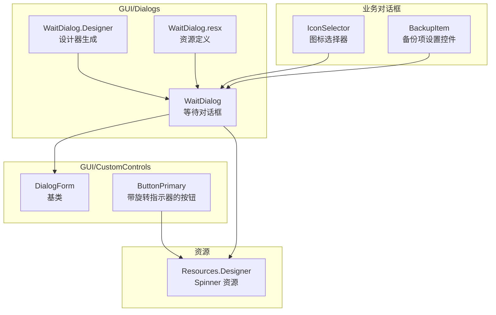
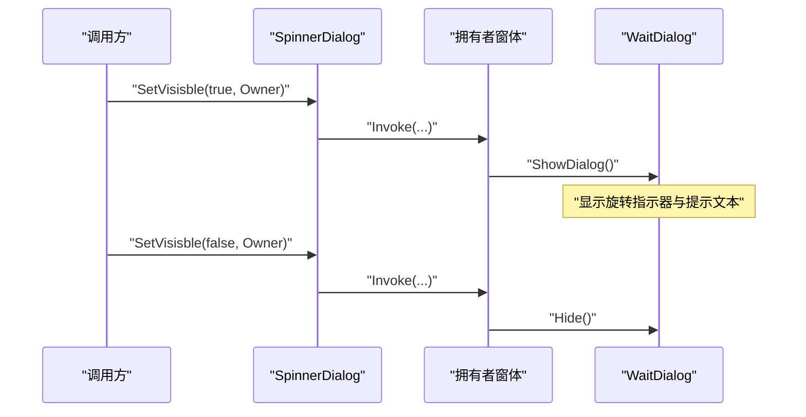
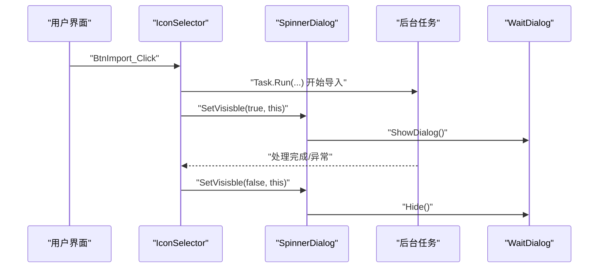
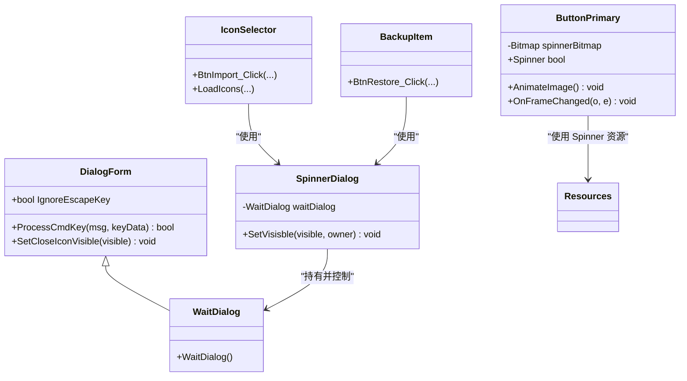

# 等待对话框

<cite>
**本文引用的文件**
- [WaitDialog.cs](file://src/MacroDeck/GUI/Dialogs/WaitDialog.cs)
- [WaitDialog.Designer.cs](file://src/MacroDeck/GUI/Dialogs/WaitDialog.Designer.cs)
- [WaitDialog.resx](file://src/MacroDeck/GUI/Dialogs/WaitDialog.resx)
- [DialogForm.cs](file://src/MacroDeck/GUI/CustomControls/DialogForm.cs)
- [IconSelector.cs](file://src/MacroDeck/GUI/Dialogs/IconSelector.cs)
- [BackupItem.cs](file://src/MacroDeck/GUI/CustomControls/Settings/BackupItem.cs)
- [ButtonPrimary.cs](file://src/MacroDeck/GUI/CustomControls/ButtonPrimary.cs)
- [Resources.Designer.cs](file://src/MacroDeck/Properties/Resources.Designer.cs)
- [UpdateServiceProgress.cs](file://src/MacroDeck/DataTypes/Updater/UpdateServiceProgress.cs)
</cite>

## 目录
1. [简介](#简介)
2. [项目结构](#项目结构)
3. [核心组件](#核心组件)
4. [架构总览](#架构总览)
5. [组件详解](#组件详解)
6. [依赖关系分析](#依赖关系分析)
7. [性能与内存优化](#性能与内存优化)
8. [故障排查指南](#故障排查指南)
9. [结论](#结论)
10. [附录](#附录)

## 简介
本文件系统化梳理 Macro-Deck 中“等待对话框”的实现架构与使用方式，覆盖以下主题：
- 实现架构：基于 WinForms 的轻量级等待对话框与全局可见性控制类
- 使用场景：长时间导入/导出、备份恢复等异步操作的用户反馈
- 动画与视觉：旋转指示器（GIF）、状态文本、无关闭按钮设计
- 取消与中断：Esc 键行为、隐藏逻辑
- 性能与内存：线程调度、控件释放、资源管理
- 异步集成：任务并行、跨线程调用、UI 更新
- 可访问性与键盘操作：Esc 关闭、焦点与可用性

## 项目结构
等待对话框位于 GUI/Dialogs 命名空间下，采用标准 WinForms 设计器生成的窗体，并通过一个静态类统一控制其显示/隐藏。

图示来源
- [WaitDialog.cs:7-14](file://src/MacroDeck/GUI/Dialogs/WaitDialog.cs#L7-L14)
- [WaitDialog.Designer.cs:33-75](file://src/MacroDeck/GUI/Dialogs/WaitDialog.Designer.cs#L33-L75)
- [DialogForm.cs:3-33](file://src/MacroDeck/GUI/CustomControls/DialogForm.cs#L3-L33)
- [IconSelector.cs:105-176](file://src/MacroDeck/GUI/Dialogs/IconSelector.cs#L105-L176)
- [BackupItem.cs:40-48](file://src/MacroDeck/GUI/CustomControls/Settings/BackupItem.cs#L40-L48)
- [ButtonPrimary.cs:20-48](file://src/MacroDeck/GUI/CustomControls/ButtonPrimary.cs#L20-L48)
- [Resources.Designer.cs:535-541](file://src/MacroDeck/Properties/Resources.Designer.cs#L535-L541)

章节来源
- [WaitDialog.cs:1-41](file://src/MacroDeck/GUI/Dialogs/WaitDialog.cs#L1-L41)
- [WaitDialog.Designer.cs:1-82](file://src/MacroDeck/GUI/Dialogs/WaitDialog.Designer.cs#L1-L82)
- [DialogForm.cs:1-34](file://src/MacroDeck/GUI/CustomControls/DialogForm.cs#L1-L34)

## 核心组件
- WaitDialog：等待对话框窗体，包含旋转指示器与提示文本
- SpinnerDialog：全局静态类，负责在指定 Form 上显示/隐藏等待对话框
- DialogForm：所有对话框的基类，提供 Esc 关闭行为控制
- ButtonPrimary：按钮控件，内置旋转指示器绘制逻辑，用于按钮级等待反馈
- 资源：Resources.Designer 中的 Spinner 图像资源

章节来源
- [WaitDialog.cs:7-14](file://src/MacroDeck/GUI/Dialogs/WaitDialog.cs#L7-L14)
- [WaitDialog.Designer.cs:33-75](file://src/MacroDeck/GUI/Dialogs/WaitDialog.Designer.cs#L33-L75)
- [DialogForm.cs:5-32](file://src/MacroDeck/GUI/CustomControls/DialogForm.cs#L5-L32)
- [ButtonPrimary.cs:20-48](file://src/MacroDeck/GUI/CustomControls/ButtonPrimary.cs#L20-L48)
- [Resources.Designer.cs:535-541](file://src/MacroDeck/Properties/Resources.Designer.cs#L535-L541)

## 架构总览
等待对话框采用“单实例 + 静态控制”的模式，避免重复创建窗口对象；通过 Invoke 将 UI 操作切换到拥有者窗体的 UI 线程，确保线程安全。

图示来源
- [WaitDialog.cs:17-40](file://src/MacroDeck/GUI/Dialogs/WaitDialog.cs#L17-L40)
- [WaitDialog.Designer.cs:40-62](file://src/MacroDeck/GUI/Dialogs/WaitDialog.Designer.cs#L40-L62)
- [DialogForm.cs:17-32](file://src/MacroDeck/GUI/CustomControls/DialogForm.cs#L17-L32)

## 组件详解

### WaitDialog 窗体
- 角色：承载旋转指示器与提示文本，作为模态等待界面
- 设计要点：
  - 无关闭按钮（ControlBox=false），防止误关
  - 文本居中显示，颜色与字体适配整体风格
  - 旋转指示器来自资源文件，尺寸与位置固定
- 初始化流程：构造函数中完成控件初始化与本地化文本设置

章节来源
- [WaitDialog.cs:9-14](file://src/MacroDeck/GUI/Dialogs/WaitDialog.cs#L9-L14)
- [WaitDialog.Designer.cs:40-75](file://src/MacroDeck/GUI/Dialogs/WaitDialog.Designer.cs#L40-L75)

### SpinnerDialog 控制类
- 单实例：内部持有 WaitDialog 实例，避免重复创建
- 显示逻辑：若当前未显示则以模态方式打开
- 隐藏逻辑：直接 Hide，不释放资源
- 线程安全：通过 owner.Invoke 将 UI 操作切换到 UI 线程

章节来源
- [WaitDialog.cs:17-40](file://src/MacroDeck/GUI/Dialogs/WaitDialog.cs#L17-L40)

### DialogForm 基类与 Esc 行为
- 提供 IgnoreEscapeKey 属性，可禁用 Esc 关闭
- 默认处理：Esc 触发 Close，避免误关等待对话框

章节来源
- [DialogForm.cs:5-32](file://src/MacroDeck/GUI/CustomControls/DialogForm.cs#L5-L32)

### ButtonPrimary 旋转指示器（对比参考）
- 内置旋转指示器绘制逻辑，演示了如何在控件内嵌入动画帧更新
- 与等待对话框的区别：前者是独立窗体，后者是全局等待提示

章节来源
- [ButtonPrimary.cs:20-48](file://src/MacroDeck/GUI/CustomControls/ButtonPrimary.cs#L20-L48)
- [ButtonPrimary.cs:224-230](file://src/MacroDeck/GUI/CustomControls/ButtonPrimary.cs#L224-L230)

### 资源与图像
- Spinner 资源由 Resources.Designer 暴露，WaitDialog 在设计器中绑定该资源
- ButtonPrimary 同样引用同一资源进行按钮级动画

章节来源
- [Resources.Designer.cs:535-541](file://src/MacroDeck/Properties/Resources.Designer.cs#L535-L541)
- [WaitDialog.Designer.cs:40-48](file://src/MacroDeck/GUI/Dialogs/WaitDialog.Designer.cs#L40-L48)
- [ButtonPrimary.cs:20-21](file://src/MacroDeck/GUI/CustomControls/ButtonPrimary.cs#L20-L21)

### 使用场景与集成模式

#### 图标导入流程（异步集成）
- 典型流程：点击导入 -> 启动后台任务 -> 显示等待对话框 -> 并行处理多张图片 -> 完成后隐藏等待对话框
- 关键点：
  - 使用 Task.Run 触发 SpinnerDialog.SetVisisble(true, this)
  - 后台任务完成后调用 SpinnerDialog.SetVisisble(false, this)
  - 处理异常时同样隐藏等待对话框，避免卡死

图示来源
- [IconSelector.cs:105-106](file://src/MacroDeck/GUI/Dialogs/IconSelector.cs#L105-L106)
- [IconSelector.cs:109-176](file://src/MacroDeck/GUI/Dialogs/IconSelector.cs#L109-L176)
- [WaitDialog.cs:17-40](file://src/MacroDeck/GUI/Dialogs/WaitDialog.cs#L17-L40)

章节来源
- [IconSelector.cs:79-177](file://src/MacroDeck/GUI/Dialogs/IconSelector.cs#L79-L177)

#### 备份恢复流程（异步集成）
- 典型流程：确认恢复 -> 后台执行恢复 -> 显示等待 -> 完成后隐藏
- 关键点：在后台任务中统一隐藏等待对话框，避免遗漏

章节来源
- [BackupItem.cs:30-48](file://src/MacroDeck/GUI/CustomControls/Settings/BackupItem.cs#L30-L48)

### 动画效果与视觉设计
- 旋转指示器：使用 GIF 资源，居中显示，尺寸适配对话框
- 状态文本：本地化字符串“请稍候”，居中对齐，浅色显示
- 对话框样式：无边框关闭按钮，模态显示，避免打断用户操作

章节来源
- [WaitDialog.Designer.cs:40-62](file://src/MacroDeck/GUI/Dialogs/WaitDialog.Designer.cs#L40-L62)
- [WaitDialog.cs](file://src/MacroDeck/GUI/Dialogs/WaitDialog.cs#L13)

### 取消与中断处理
- Esc 关闭：默认情况下按 Esc 会关闭对话框；由于等待对话框通常以模态显示且无关闭按钮，建议通过业务逻辑主动隐藏而非依赖 Esc
- 主动隐藏：在后台任务完成或异常时，务必调用 SetVisisble(false, owner) 隐藏等待对话框
- 线程安全：始终通过 owner.Invoke 切换到 UI 线程执行显示/隐藏

章节来源
- [DialogForm.cs:17-32](file://src/MacroDeck/GUI/CustomControls/DialogForm.cs#L17-L32)
- [WaitDialog.cs:21-39](file://src/MacroDeck/GUI/Dialogs/WaitDialog.cs#L21-L39)

### 进度显示与状态文本更新（扩展建议）
- 当前 WaitDialog 仅包含旋转指示器与固定提示文本
- 若需展示具体进度，可参考 UpdateServiceProgress 的数据模型，扩展 WaitDialog 的状态文本或添加进度条控件
- 扩展方案：
  - 新增 Label 或 ProgressBar 控件
  - 通过 Invoke 更新文本/进度值
  - 在后台任务中周期性回调 UI 更新

章节来源
- [UpdateServiceProgress.cs:3-8](file://src/MacroDeck/DataTypes/Updater/UpdateServiceProgress.cs#L3-L8)

## 依赖关系分析

图示来源
- [DialogForm.cs:3-33](file://src/MacroDeck/GUI/CustomControls/DialogForm.cs#L3-L33)
- [WaitDialog.cs:7-14](file://src/MacroDeck/GUI/Dialogs/WaitDialog.cs#L7-L14)
- [WaitDialog.cs:17-40](file://src/MacroDeck/GUI/Dialogs/WaitDialog.cs#L17-L40)
- [IconSelector.cs:79-177](file://src/MacroDeck/GUI/Dialogs/IconSelector.cs#L79-L177)
- [BackupItem.cs:29-48](file://src/MacroDeck/GUI/CustomControls/Settings/BackupItem.cs#L29-L48)
- [ButtonPrimary.cs:20-48](file://src/MacroDeck/GUI/CustomControls/ButtonPrimary.cs#L20-L48)

## 性能与内存优化
- 单实例复用：SpinnerDialog 内部持有一个 WaitDialog 实例，避免频繁创建销毁带来的开销
- 模态显示：ShowDialog 保证阻塞期间不会重复触发显示，减少 UI 抖动
- 线程调度：使用 Task.Run 执行耗时任务，UI 线程只负责显示/隐藏，降低阻塞风险
- 资源管理：
  - WaitDialog 在 Dispose 中释放组件资源
  - 图片资源由设计器绑定，生命周期随窗体管理
  - 图标导入流程中及时释放位图资源，避免内存泄漏
- 建议：
  - 避免在高频事件中反复 ShowDialog/Hide，可通过 Visible 快速判断
  - 对于长耗时任务，考虑分段处理并在 UI 线程更新状态文本，提升感知性能

章节来源
- [WaitDialog.cs:17-40](file://src/MacroDeck/GUI/Dialogs/WaitDialog.cs#L17-L40)
- [WaitDialog.Designer.cs:18-25](file://src/MacroDeck/GUI/Dialogs/WaitDialog.Designer.cs#L18-L25)
- [IconSelector.cs:44-51](file://src/MacroDeck/GUI/Dialogs/IconSelector.cs#L44-L51)

## 故障排查指南
- 症状：等待对话框无法关闭
  - 可能原因：Esc 被禁用或 UI 线程被阻塞
  - 排查步骤：检查 DialogForm.IgnoreEscapeKey 设置；确认后台任务是否完成并调用 SetVisisble(false, owner)
- 症状：界面卡死或响应迟缓
  - 可能原因：耗时操作未在后台线程执行
  - 排查步骤：确认使用 Task.Run 包裹耗时逻辑；确保 UI 更新通过 Invoke
- 症状：内存占用持续上升
  - 可能原因：未释放位图或资源
  - 排查步骤：检查图标导入流程中位图的 Dispose 调用；确认 WaitDialog 的 Dispose 调用时机

章节来源
- [DialogForm.cs:5-32](file://src/MacroDeck/GUI/CustomControls/DialogForm.cs#L5-L32)
- [IconSelector.cs:44-51](file://src/MacroDeck/GUI/Dialogs/IconSelector.cs#L44-L51)

## 结论
Macro-Deck 的等待对话框通过“单实例 + 静态控制”的简洁架构，实现了对长时间操作的友好反馈。结合 Invoke 的线程安全与 DialogForm 的 Esc 控制，既保证了用户体验，也兼顾了可维护性。对于更复杂的进度需求，可在现有基础上扩展状态文本或进度条，同时遵循本文的性能与内存优化建议。

## 附录

### 最佳实践清单
- 使用 SpinnerDialog.SetVisisble(true, owner) 显示等待
- 在后台任务完成或异常时，务必调用 SpinnerDialog.SetVisisble(false, owner) 隐藏
- 避免在 UI 线程执行耗时操作，使用 Task.Run 包裹
- 对需要频繁显示/隐藏的场景，先检查 Visible 状态再决定是否显示
- 长耗时任务中适时更新状态文本，提升用户感知

### 可访问性与键盘操作
- Esc 关闭：默认启用，如需禁用可设置 DialogForm.IgnoreEscapeKey=true
- 焦点管理：等待对话框为模态，自动获取焦点；完成后应将焦点返回到拥有者窗体
- 键盘导航：保持与其他对话框一致的键盘交互习惯

章节来源
- [DialogForm.cs:5-32](file://src/MacroDeck/GUI/CustomControls/DialogForm.cs#L5-L32)