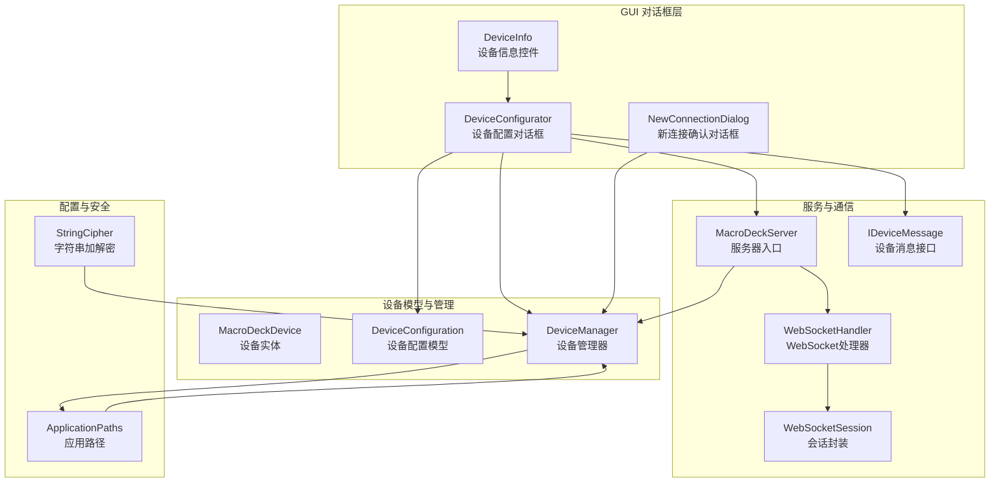
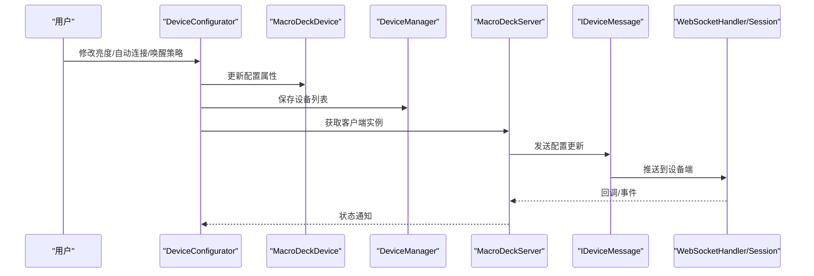
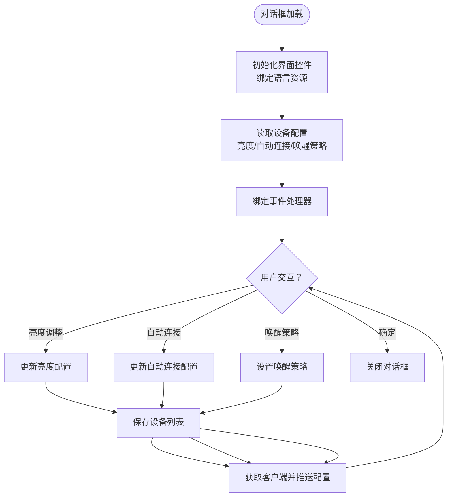
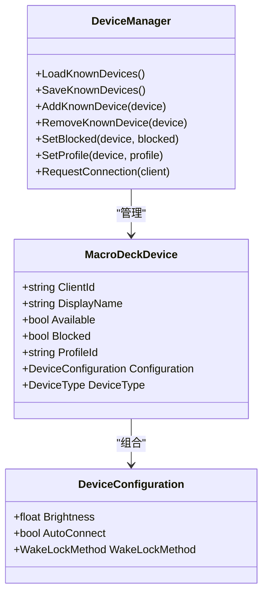
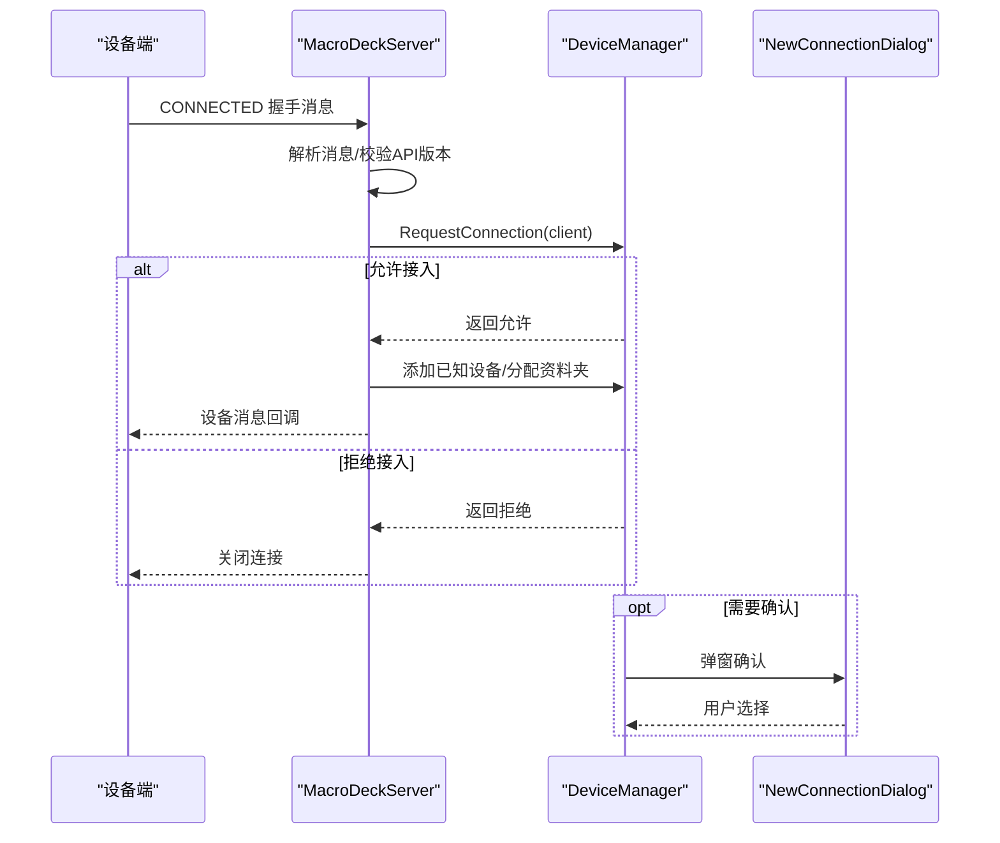
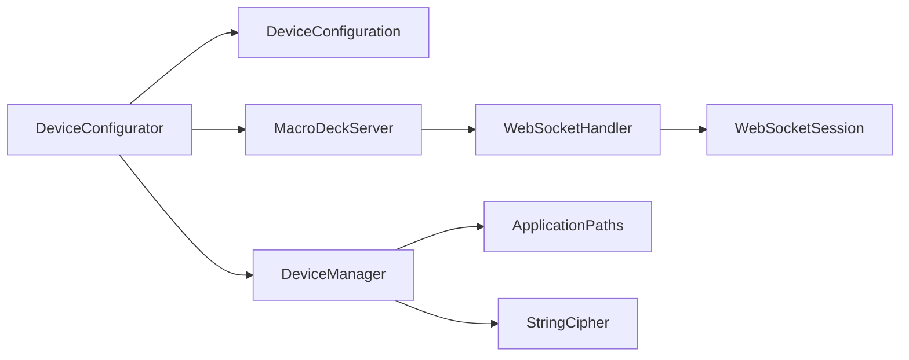

# 设备配置对话框

<cite>
**本文档引用的文件**
- [DeviceConfigurator.cs](file://src/MacroDeck/GUI/Dialogs/DeviceConfigurator.cs)
- [DeviceConfigurator.Designer.cs](file://src/MacroDeck/GUI/Dialogs/DeviceConfigurator.Designer.cs)
- [DeviceConfiguration.cs](file://src/MacroDeck/Device/DeviceConfiguration.cs)
- [DeviceManager.cs](file://src/MacroDeck/Device/DeviceManager.cs)
- [MacroDeckDevice.cs](file://src/MacroDeck/Device/MacroDeckDevice.cs)
- [NewConnectionDialog.cs](file://src/MacroDeck/GUI/Dialogs/NewConnectionDialog.cs)
- [DeviceInfo.cs](file://src/MacroDeck/GUI/CustomControls/DeviceInfo.cs)
- [ApplicationPaths.cs](file://src/MacroDeck/StartupConfig/ApplicationPaths.cs)
- [IDeviceMessage.cs](file://src/MacroDeck/Server/DeviceMessage/IDeviceMessage.cs)
- [MacroDeckServer.cs](file://src/MacroDeck/Server/MacroDeckServer.cs)
- [WebSocketHandler.cs](file://src/MacroDeck/WebSocketHandler.cs)
- [WebSocketSession.cs](file://src/MacroDeck/DataTypes/WebSocketSession.cs)
- [StringCipher.cs](file://src/MacroDeck/Utils/StringCipher.cs)
</cite>

## 目录
1. [简介](#简介)
2. [项目结构](#项目结构)
3. [核心组件](#核心组件)
4. [架构总览](#架构总览)
5. [详细组件分析](#详细组件分析)
6. [依赖关系分析](#依赖关系分析)
7. [性能考量](#性能考量)
8. [故障排除指南](#故障排除指南)
9. [结论](#结论)

## 简介
本文件针对 Macro-Deck 的“设备配置对话框”进行系统化技术文档编写，覆盖对话框的架构设计、实现细节、设备连接配置、参数设置与验证处理、用户交互体验、安全与敏感信息保护，以及与设备管理系统的集成与数据同步机制。目标读者既包括开发者也包括需要理解设备配置流程的非技术用户。

## 项目结构
设备配置对话框位于 GUI 层的对话框模块中，围绕设备配置模型与设备管理器协作，通过 WebSocket 与设备端实时同步配置变更。关键文件分布如下：
- 对话框界面与逻辑：DeviceConfigurator.cs、DeviceConfigurator.Designer.cs
- 配置模型：DeviceConfiguration.cs
- 设备实体与管理：MacroDeckDevice.cs、DeviceManager.cs
- 连接请求与新设备接入：NewConnectionDialog.cs、MacroDeckServer.cs
- 数据持久化路径：ApplicationPaths.cs
- 消息接口与会话：IDeviceMessage.cs、WebSocketHandler.cs、WebSocketSession.cs
- 安全工具：StringCipher.cs（用于敏感信息加密）

图表来源
- [DeviceConfigurator.cs:1-136](file://src/MacroDeck/GUI/Dialogs/DeviceConfigurator.cs#L1-L136)
- [DeviceConfiguration.cs:1-16](file://src/MacroDeck/Device/DeviceConfiguration.cs#L1-L16)
- [DeviceManager.cs:1-278](file://src/MacroDeck/Device/DeviceManager.cs#L1-L278)
- [MacroDeckDevice.cs:1-34](file://src/MacroDeck/Device/MacroDeckDevice.cs#L1-L34)
- [NewConnectionDialog.cs:1-71](file://src/MacroDeck/GUI/Dialogs/NewConnectionDialog.cs#L1-L71)
- [MacroDeckServer.cs:1-200](file://src/MacroDeck/Server/MacroDeckServer.cs#L1-L200)
- [WebSocketHandler.cs:1-43](file://src/MacroDeck/WebSocketHandler.cs#L1-L43)
- [WebSocketSession.cs:1-118](file://src/MacroDeck/DataTypes/WebSocketSession.cs#L1-L118)
- [ApplicationPaths.cs:1-143](file://src/MacroDeck/StartupConfig/ApplicationPaths.cs#L1-L143)
- [IDeviceMessage.cs:1-10](file://src/MacroDeck/Server/DeviceMessage/IDeviceMessage.cs#L1-L10)
- [StringCipher.cs:1-50](file://src/MacroDeck/Utils/StringCipher.cs#L1-L50)

章节来源
- [DeviceConfigurator.cs:1-136](file://src/MacroDeck/GUI/Dialogs/DeviceConfigurator.cs#L1-L136)
- [DeviceConfigurator.Designer.cs:1-210](file://src/MacroDeck/GUI/Dialogs/DeviceConfigurator.Designer.cs#L1-L210)
- [DeviceConfiguration.cs:1-16](file://src/MacroDeck/Device/DeviceConfiguration.cs#L1-L16)
- [DeviceManager.cs:1-278](file://src/MacroDeck/Device/DeviceManager.cs#L1-L278)
- [MacroDeckDevice.cs:1-34](file://src/MacroDeck/Device/MacroDeckDevice.cs#L1-L34)
- [NewConnectionDialog.cs:1-71](file://src/MacroDeck/GUI/Dialogs/NewConnectionDialog.cs#L1-L71)
- [MacroDeckServer.cs:1-200](file://src/MacroDeck/Server/MacroDeckServer.cs#L1-L200)
- [WebSocketHandler.cs:1-43](file://src/MacroDeck/WebSocketHandler.cs#L1-L43)
- [WebSocketSession.cs:1-118](file://src/MacroDeck/DataTypes/WebSocketSession.cs#L1-L118)
- [ApplicationPaths.cs:1-143](file://src/MacroDeck/StartupConfig/ApplicationPaths.cs#L1-L143)
- [IDeviceMessage.cs:1-10](file://src/MacroDeck/Server/DeviceMessage/IDeviceMessage.cs#L1-L10)
- [StringCipher.cs:1-50](file://src/MacroDeck/Utils/StringCipher.cs#L1-L50)

## 核心组件
- 设备配置对话框（DeviceConfigurator）
  - 负责亮度调节、自动连接开关、保持唤醒策略等设备本地配置的读取与写入。
  - 实时将配置变更通过设备消息接口发送到已连接的设备端。
- 设备配置模型（DeviceConfiguration）
  - 包含亮度、自动连接、唤醒策略三项核心配置。
- 设备实体与管理（MacroDeckDevice、DeviceManager）
  - 设备实体承载配置对象与可用性状态；管理器负责设备列表的加载、保存、添加、移除、阻塞等操作。
- 新连接确认对话框（NewConnectionDialog）
  - 在新设备接入时弹窗确认或拒绝，并支持一键阻断该设备后续连接。
- 服务器与通信（MacroDeckServer、WebSocketHandler、WebSocketSession、IDeviceMessage）
  - 服务器接收设备连接、解析握手消息、触发设备管理器处理，并通过设备消息接口向设备推送配置。
- 配置与安全（ApplicationPaths、StringCipher）
  - 应用路径统一管理 devices.json 等配置文件位置；字符串加解密工具用于敏感信息保护。

章节来源
- [DeviceConfigurator.cs:1-136](file://src/MacroDeck/GUI/Dialogs/DeviceConfigurator.cs#L1-L136)
- [DeviceConfiguration.cs:1-16](file://src/MacroDeck/Device/DeviceConfiguration.cs#L1-L16)
- [MacroDeckDevice.cs:1-34](file://src/MacroDeck/Device/MacroDeckDevice.cs#L1-L34)
- [DeviceManager.cs:1-278](file://src/MacroDeck/Device/DeviceManager.cs#L1-L278)
- [NewConnectionDialog.cs:1-71](file://src/MacroDeck/GUI/Dialogs/NewConnectionDialog.cs#L1-L71)
- [MacroDeckServer.cs:1-200](file://src/MacroDeck/Server/MacroDeckServer.cs#L1-L200)
- [WebSocketHandler.cs:1-43](file://src/MacroDeck/WebSocketHandler.cs#L1-L43)
- [WebSocketSession.cs:1-118](file://src/MacroDeck/DataTypes/WebSocketSession.cs#L1-L118)
- [IDeviceMessage.cs:1-10](file://src/MacroDeck/Server/DeviceMessage/IDeviceMessage.cs#L1-L10)
- [ApplicationPaths.cs:1-143](file://src/MacroDeck/StartupConfig/ApplicationPaths.cs#L1-L143)
- [StringCipher.cs:1-50](file://src/MacroDeck/Utils/StringCipher.cs#L1-L50)

## 架构总览
设备配置对话框与设备管理器、服务器、WebSocket 通道协同工作，形成“本地配置修改—持久化—设备消息推送—设备端生效”的闭环。

图表来源
- [DeviceConfigurator.cs:53-134](file://src/MacroDeck/GUI/Dialogs/DeviceConfigurator.cs#L53-L134)
- [DeviceManager.cs:53-81](file://src/MacroDeck/Device/DeviceManager.cs#L53-L81)
- [MacroDeckServer.cs:195-199](file://src/MacroDeck/Server/MacroDeckServer.cs#L195-L199)
- [IDeviceMessage.cs:5-8](file://src/MacroDeck/Server/DeviceMessage/IDeviceMessage.cs#L5-L8)
- [WebSocketHandler.cs:14-35](file://src/MacroDeck/WebSocketHandler.cs#L14-L35)
- [WebSocketSession.cs:100-111](file://src/MacroDeck/DataTypes/WebSocketSession.cs#L100-L111)

## 详细组件分析

### 设备配置对话框（DeviceConfigurator）
- 初始化与语言资源绑定：在构造函数中注入设备对象，并将界面标签文本绑定到语言管理器。
- 加载阶段（Load）：
  - 将设备配置的亮度映射到滑块控件，避免滚动事件与初始化冲突，采用事件解除/恢复绑定策略。
  - 自动连接复选框与唤醒策略单选组按配置值初始化。
- 交互处理：
  - 亮度滚动：更新配置后立即保存设备列表，并通过服务器获取对应客户端，调用设备消息接口发送配置。
  - 自动连接切换：同上，保存并推送。
  - 唤醒策略切换：根据选中项设置对应枚举值，保存并推送。
- 关闭行为：点击确定按钮关闭对话框。

图表来源
- [DeviceConfigurator.cs:24-51](file://src/MacroDeck/GUI/Dialogs/DeviceConfigurator.cs#L24-L51)
- [DeviceConfigurator.cs:53-134](file://src/MacroDeck/GUI/Dialogs/DeviceConfigurator.cs#L53-L134)

章节来源
- [DeviceConfigurator.cs:1-136](file://src/MacroDeck/GUI/Dialogs/DeviceConfigurator.cs#L1-L136)
- [DeviceConfigurator.Designer.cs:1-210](file://src/MacroDeck/GUI/Dialogs/DeviceConfigurator.Designer.cs#L1-L210)

### 设备配置模型（DeviceConfiguration）
- 字段定义：
  - 亮度：浮点数，默认值为较小数值，范围由滑块映射。
  - 自动连接：布尔值，默认关闭。
  - 唤醒策略：枚举，包含“从不/连接时/总是”三种策略。
- 作用：作为设备实体的子对象，承载设备端可配置的本地参数。

章节来源
- [DeviceConfiguration.cs:1-16](file://src/MacroDeck/Device/DeviceConfiguration.cs#L1-L16)

### 设备实体与管理（MacroDeckDevice、DeviceManager）
- 设备实体：
  - 暴露可用性属性，基于服务器侧会话状态判断是否在线。
  - 包含配置对象、显示名、类型、阻断标记、当前资料夹等。
- 设备管理器：
  - 负责设备列表的加载与保存（devices.json），提供增删改查、阻断控制、资料夹关联等。
  - 在配置变更后统一保存设备列表，并触发变更事件。
  - 处理新连接请求：根据全局配置决定是否弹窗确认或直接加入已知设备。

图表来源
- [MacroDeckDevice.cs:6-33](file://src/MacroDeck/Device/MacroDeckDevice.cs#L6-L33)
- [DeviceManager.cs:12-278](file://src/MacroDeck/Device/DeviceManager.cs#L12-L278)
- [DeviceConfiguration.cs:3-16](file://src/MacroDeck/Device/DeviceConfiguration.cs#L3-L16)

章节来源
- [MacroDeckDevice.cs:1-34](file://src/MacroDeck/Device/MacroDeckDevice.cs#L1-L34)
- [DeviceManager.cs:1-278](file://src/MacroDeck/Device/DeviceManager.cs#L1-L278)

### 新连接确认与接入流程（NewConnectionDialog、MacroDeckServer）
- 新连接确认对话框：
  - 显示设备标识与类型，提供接受/拒绝按钮，拒绝时可设置倒计时。
  - 支持勾选“阻断此设备”，以便阻止其后续连接。
- 服务器接入流程：
  - 解析设备握手消息，识别设备类型与客户端标识。
  - 若使用快速设置令牌则直接加入已知设备；否则调用设备管理器的请求处理。
  - 请求处理可能弹出新连接确认对话框，依据用户选择决定是否允许接入并保存设备。

图表来源
- [MacroDeckServer.cs:141-200](file://src/MacroDeck/Server/MacroDeckServer.cs#L141-L200)
- [DeviceManager.cs:185-276](file://src/MacroDeck/Device/DeviceManager.cs#L185-L276)
- [NewConnectionDialog.cs:19-70](file://src/MacroDeck/GUI/Dialogs/NewConnectionDialog.cs#L19-L70)

章节来源
- [NewConnectionDialog.cs:1-71](file://src/MacroDeck/GUI/Dialogs/NewConnectionDialog.cs#L1-L71)
- [MacroDeckServer.cs:1-200](file://src/MacroDeck/Server/MacroDeckServer.cs#L1-L200)
- [DeviceManager.cs:1-278](file://src/MacroDeck/Device/DeviceManager.cs#L1-L278)

### 设备消息接口与通信链路（IDeviceMessage、WebSocketHandler、WebSocketSession）
- 设备消息接口：
  - 提供连接建立、发送配置、下发按钮集、更新单个按钮等方法。
- WebSocket 通道：
  - 统一维护会话列表，支持向所有/指定客户端广播消息。
  - 会话封装了消息收发与异常处理，确保连接稳定与断开清理。
- 对话框与消息链路：
  - 对话框在配置变更后通过服务器获取客户端，再调用设备消息接口推送配置，最终由 WebSocketHandler 将消息发送至设备端。

章节来源
- [IDeviceMessage.cs:1-10](file://src/MacroDeck/Server/DeviceMessage/IDeviceMessage.cs#L1-L10)
- [WebSocketHandler.cs:1-43](file://src/MacroDeck/WebSocketHandler.cs#L1-L43)
- [WebSocketSession.cs:1-118](file://src/MacroDeck/DataTypes/WebSocketSession.cs#L1-L118)
- [DeviceConfigurator.cs:62-63](file://src/MacroDeck/GUI/Dialogs/DeviceConfigurator.cs#L62-L63)

### 用户体验与交互模式
- 即时反馈：亮度调整与配置切换均即时保存并推送，减少延迟感知。
- 可逆操作：未连接设备时，对话框不执行推送，避免无效操作。
- 清晰状态：设备信息控件展示连接状态与可用功能，仅在 Android 设备可用时显示配置按钮。
- 语言本地化：界面文本通过语言管理器动态绑定，适配多语言环境。

章节来源
- [DeviceConfigurator.cs:53-134](file://src/MacroDeck/GUI/Dialogs/DeviceConfigurator.cs#L53-L134)
- [DeviceInfo.cs:61-71](file://src/MacroDeck/GUI/CustomControls/DeviceInfo.cs#L61-L71)

### 安全考虑与敏感信息保护
- 配置文件路径：应用路径统一管理，devices.json 存放于用户目录，便于权限控制与便携模式支持。
- 敏感信息加密：提供字符串加解密工具，可用于存储或传输敏感字段（如令牌、凭据）。
- 连接控制：新连接接入前可弹窗确认，支持一键阻断特定设备，降低未授权访问风险。
- SSL/TLS：服务器启动时可生成/校验证书，启用 HTTPS 以保护通信安全。

章节来源
- [ApplicationPaths.cs:1-143](file://src/MacroDeck/StartupConfig/ApplicationPaths.cs#L1-L143)
- [StringCipher.cs:1-50](file://src/MacroDeck/Utils/StringCipher.cs#L1-L50)
- [MacroDeckServer.cs:40-54](file://src/MacroDeck/Server/MacroDeckServer.cs#L40-L54)
- [DeviceManager.cs:253-276](file://src/MacroDeck/Device/DeviceManager.cs#L253-L276)

## 依赖关系分析
- 对话框依赖设备配置模型与设备管理器，间接依赖服务器与消息接口。
- 设备管理器依赖应用路径与配置序列化，同时与服务器事件耦合。
- 服务器依赖 WebSocket 处理器与会话封装，负责消息路由与设备状态管理。
- 安全工具与路径工具为各层提供基础能力支撑。

图表来源
- [DeviceConfigurator.cs:1-136](file://src/MacroDeck/GUI/Dialogs/DeviceConfigurator.cs#L1-L136)
- [DeviceManager.cs:1-278](file://src/MacroDeck/Device/DeviceManager.cs#L1-L278)
- [MacroDeckServer.cs:1-200](file://src/MacroDeck/Server/MacroDeckServer.cs#L1-L200)
- [WebSocketHandler.cs:1-43](file://src/MacroDeck/WebSocketHandler.cs#L1-L43)
- [WebSocketSession.cs:1-118](file://src/MacroDeck/DataTypes/WebSocketSession.cs#L1-L118)
- [ApplicationPaths.cs:1-143](file://src/MacroDeck/StartupConfig/ApplicationPaths.cs#L1-L143)
- [StringCipher.cs:1-50](file://src/MacroDeck/Utils/StringCipher.cs#L1-L50)

章节来源
- [DeviceConfigurator.cs:1-136](file://src/MacroDeck/GUI/Dialogs/DeviceConfigurator.cs#L1-L136)
- [DeviceManager.cs:1-278](file://src/MacroDeck/Device/DeviceManager.cs#L1-L278)
- [MacroDeckServer.cs:1-200](file://src/MacroDeck/Server/MacroDeckServer.cs#L1-L200)
- [WebSocketHandler.cs:1-43](file://src/MacroDeck/WebSocketHandler.cs#L1-L43)
- [WebSocketSession.cs:1-118](file://src/MacroDeck/DataTypes/WebSocketSession.cs#L1-L118)
- [ApplicationPaths.cs:1-143](file://src/MacroDeck/StartupConfig/ApplicationPaths.cs#L1-L143)
- [StringCipher.cs:1-50](file://src/MacroDeck/Utils/StringCipher.cs#L1-L50)

## 性能考量
- 配置推送频率：对话框在用户交互时即时推送，建议避免高频连续操作导致的重复推送。
- 文件写入优化：设备列表保存采用临时文件+原子替换策略，减少并发写入冲突。
- 会话并发：WebSocket 广播使用并行任务聚合，注意在高并发场景下的内存与 CPU 开销。
- 事件订阅：对话框与管理器的事件订阅需在合适时机解除，防止内存泄漏。

## 故障排除指南
- 对话框无响应或不生效：
  - 检查设备是否处于可用状态（在线），不可用时不会推送配置。
  - 确认服务器已正确建立会话并返回客户端实例。
- 配置未持久化：
  - 查看设备列表保存是否成功，关注异常日志输出。
  - 确认 devices.json 文件存在且可写。
- 新连接被拒绝：
  - 检查全局连接策略与新连接确认对话框的选择结果。
  - 如勾选“阻断此设备”，后续连接会被直接拒绝。
- 通信失败：
  - 检查服务器证书与 SSL 设置，确保设备端信任链有效。
  - 观察 WebSocket 会话状态与断开原因，定位网络或防火墙问题。

章节来源
- [DeviceConfigurator.cs:55-58](file://src/MacroDeck/GUI/Dialogs/DeviceConfigurator.cs#L55-L58)
- [DeviceManager.cs:53-81](file://src/MacroDeck/Device/DeviceManager.cs#L53-L81)
- [MacroDeckServer.cs:164-169](file://src/MacroDeck/Server/MacroDeckServer.cs#L164-L169)
- [WebSocketHandler.cs:14-35](file://src/MacroDeck/WebSocketHandler.cs#L14-L35)

## 结论
设备配置对话框通过简洁直观的界面与即时反馈机制，实现了对设备本地参数的高效管理。其与设备管理器、服务器及 WebSocket 通道的紧密协作，确保了配置变更的可靠持久化与设备端实时同步。结合新连接确认与阻断机制、路径与加密工具，系统在易用性与安全性之间取得了良好平衡。建议在高并发场景下进一步优化推送频率与文件写入策略，并持续监控事件订阅生命周期，以提升整体稳定性与性能。