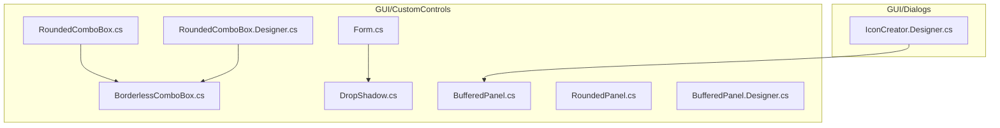
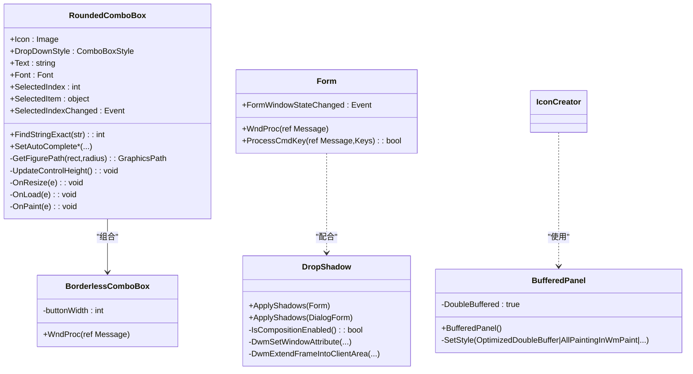
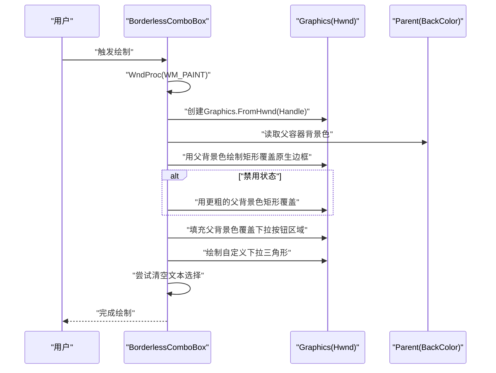
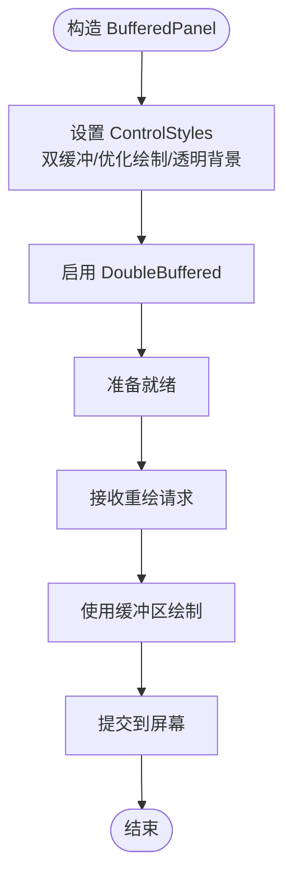
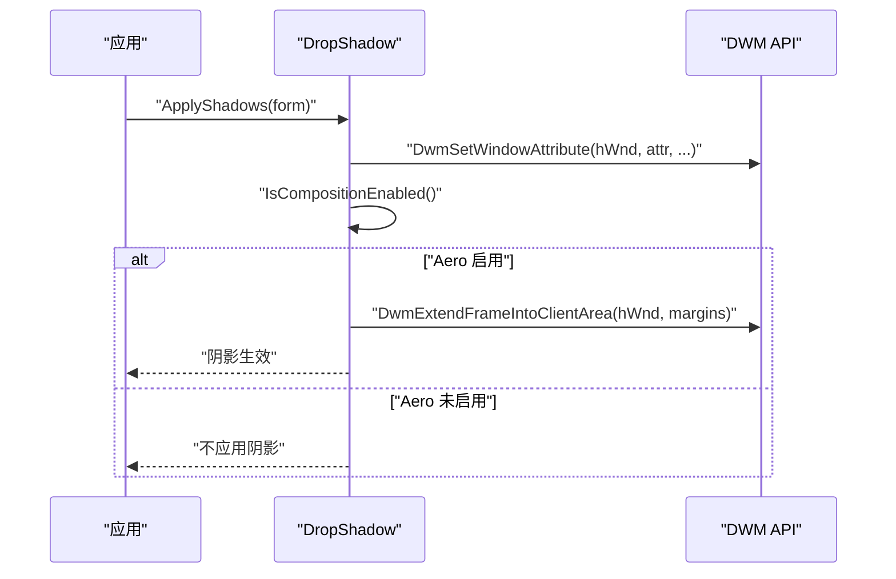
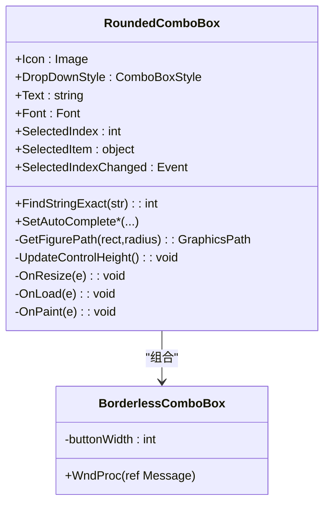
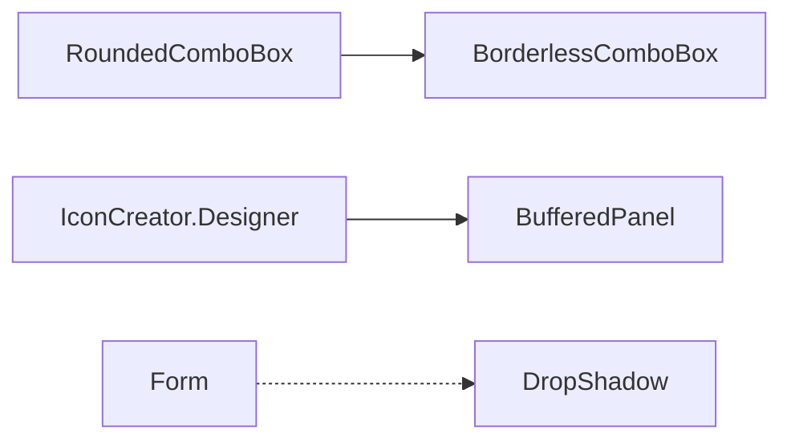

# 专用控件

<cite>
**本文引用的文件**
- [BorderlessComboBox.cs](file://src/MacroDeck/GUI/CustomControls/BorderlessComboBox.cs)
- [BufferedPanel.cs](file://src/MacroDeck/GUI/CustomControls/BufferedPanel.cs)
- [BufferedPanel.Designer.cs](file://src/MacroDeck/GUI/CustomControls/BufferedPanel.Designer.cs)
- [DropShadow.cs](file://src/MacroDeck/GUI/CustomControls/DropShadow.cs)
- [RoundedComboBox.cs](file://src/MacroDeck/GUI/CustomControls/RoundedComboBox.cs)
- [RoundedComboBox.Designer.cs](file://src/MacroDeck/GUI/CustomControls/RoundedComboBox.Designer.cs)
- [RoundedPanel.cs](file://src/MacroDeck/GUI/CustomControls/RoundedPanel.cs)
- [IconCreator.Designer.cs](file://src/MacroDeck/GUI/Dialogs/IconCreator.Designer.cs)
- [Form.cs](file://src/MacroDeck/GUI/CustomControls/Form.cs)
</cite>

## 目录
1. [引言](#引言)
2. [项目结构](#项目结构)
3. [核心组件](#核心组件)
4. [架构总览](#架构总览)
5. [详细组件分析](#详细组件分析)
6. [依赖关系分析](#依赖关系分析)
7. [性能考量](#性能考量)
8. [故障排查指南](#故障排查指南)
9. [结论](#结论)
10. [附录](#附录)

## 引言
本文件聚焦 Macro-Deck 的三类专用控件：边框无框组合框（BorderlessComboBox）、缓冲面板（BufferedPanel）与阴影效果（DropShadow）。我们将从设计理念、实现细节、性能优化、使用场景与最佳实践等方面进行系统化说明，并给出扩展与自定义建议。

## 项目结构
这些控件位于 GUI 自定义控件目录下，采用分层组织方式：
- 控件源码：GUI/CustomControls 下的独立类文件
- 设计器文件：用于可视化布局与事件绑定
- 使用示例：在对话框（如图标创建器）中直接实例化与配置

图表来源
- [BorderlessComboBox.cs:1-56](file://src/MacroDeck/GUI/CustomControls/BorderlessComboBox.cs#L1-L56)
- [BufferedPanel.cs:1-18](file://src/MacroDeck/GUI/CustomControls/BufferedPanel.cs#L1-L18)
- [DropShadow.cs:1-148](file://src/MacroDeck/GUI/CustomControls/DropShadow.cs#L1-L148)
- [RoundedComboBox.cs:1-233](file://src/MacroDeck/GUI/CustomControls/RoundedComboBox.cs#L1-L233)
- [RoundedComboBox.Designer.cs:1-82](file://src/MacroDeck/GUI/CustomControls/RoundedComboBox.Designer.cs#L1-L82)
- [BufferedPanel.Designer.cs:1-18](file://src/MacroDeck/GUI/CustomControls/BufferedPanel.Designer.cs#L1-L18)
- [IconCreator.Designer.cs:1-215](file://src/MacroDeck/GUI/Dialogs/IconCreator.Designer.cs#L1-L215)
- [Form.cs:1-36](file://src/MacroDeck/GUI/CustomControls/Form.cs#L1-L36)

章节来源
- [BorderlessComboBox.cs:1-56](file://src/MacroDeck/GUI/CustomControls/BorderlessComboBox.cs#L1-L56)
- [BufferedPanel.cs:1-18](file://src/MacroDeck/GUI/CustomControls/BufferedPanel.cs#L1-L18)
- [DropShadow.cs:1-148](file://src/MacroDeck/GUI/CustomControls/DropShadow.cs#L1-L148)
- [RoundedComboBox.cs:1-233](file://src/MacroDeck/GUI/CustomControls/RoundedComboBox.cs#L1-L233)
- [RoundedComboBox.Designer.cs:1-82](file://src/MacroDeck/GUI/CustomControls/RoundedComboBox.Designer.cs#L1-L82)
- [BufferedPanel.Designer.cs:1-18](file://src/MacroDeck/GUI/CustomControls/BufferedPanel.Designer.cs#L1-L18)
- [IconCreator.Designer.cs:1-215](file://src/MacroDeck/GUI/Dialogs/IconCreator.Designer.cs#L1-L215)
- [Form.cs:1-36](file://src/MacroDeck/GUI/CustomControls/Form.cs#L1-L36)

## 核心组件
- 边框无框组合框（BorderlessComboBox）
  - 基于系统 ComboBox，通过消息钩子与自绘移除默认边框与按钮区域，绘制自定义下拉三角形，支持禁用态的覆盖填充。
- 缓冲面板（BufferedPanel）
  - 基于 Panel，启用双缓冲与多项优化绘制风格，支持透明背景色，减少闪烁与重绘开销。
- 阴影效果（DropShadow）
  - 通过调用 DWM API 扩展客户区到非客户区以产生阴影，适配 Aero 组合是否可用，提供对窗体与对话框的阴影应用方法。

章节来源
- [BorderlessComboBox.cs:1-56](file://src/MacroDeck/GUI/CustomControls/BorderlessComboBox.cs#L1-L56)
- [BufferedPanel.cs:1-18](file://src/MacroDeck/GUI/CustomControls/BufferedPanel.cs#L1-L18)
- [DropShadow.cs:1-148](file://src/MacroDeck/GUI/CustomControls/DropShadow.cs#L1-L148)

## 架构总览
专用控件与上层界面的交互关系如下：

图表来源
- [BorderlessComboBox.cs:1-56](file://src/MacroDeck/GUI/CustomControls/BorderlessComboBox.cs#L1-L56)
- [RoundedComboBox.cs:1-233](file://src/MacroDeck/GUI/CustomControls/RoundedComboBox.cs#L1-L233)
- [BufferedPanel.cs:1-18](file://src/MacroDeck/GUI/CustomControls/BufferedPanel.cs#L1-L18)
- [DropShadow.cs:1-148](file://src/MacroDeck/GUI/CustomControls/DropShadow.cs#L1-L148)
- [Form.cs:1-36](file://src/MacroDeck/GUI/CustomControls/Form.cs#L1-L36)
- [IconCreator.Designer.cs:1-215](file://src/MacroDeck/GUI/Dialogs/IconCreator.Designer.cs#L1-L215)

## 详细组件分析

### 边框无框组合框（BorderlessComboBox）
- 设计理念
  - 消除系统默认边框与下拉按钮的白色矩形，使其与父容器背景融合；在禁用态时以父背景加粗矩形覆盖，避免视觉割裂。
  - 自绘下拉三角形，保证在不同 Enabled 状态下的统一外观。
- 关键实现点
  - 消息处理：拦截绘制消息，在句柄上下文中进行自绘。
  - 边框覆盖：使用父容器背景画笔绘制矩形，覆盖原生边框。
  - 下拉按钮覆盖与重绘：先填充父背景，再绘制自定义三角形。
  - 文本选择控制：尝试清空选择，避免文本被选中影响交互。
- 复杂度与性能
  - 绘制逻辑在每次 WM_PAINT 触发时执行，属于轻量级自绘，成本低。
  - 通过父背景色匹配，减少额外资源加载。
- 可扩展性
  - 可通过属性或派生类扩展颜色主题、三角形样式与尺寸。
  - 可增加 hover/focus 状态的差异化绘制。

图表来源
- [BorderlessComboBox.cs:8-54](file://src/MacroDeck/GUI/CustomControls/BorderlessComboBox.cs#L8-L54)

章节来源
- [BorderlessComboBox.cs:1-56](file://src/MacroDeck/GUI/CustomControls/BorderlessComboBox.cs#L1-L56)

### 缓冲面板（BufferedPanel）
- 设计理念
  - 通过双缓冲与优化绘制风格，降低重绘时的闪烁与撕裂，提升复杂界面的流畅度。
  - 支持透明背景色，便于嵌入深色主题界面。
- 关键实现点
  - 构造函数中设置 DoubleBuffered 与多项 ControlStyles，包括：
    - UserPaint、AllPaintingInWmPaint、ResizeRedraw、ContainerControl、OptimizedDoubleBuffer、SupportsTransparentBackColor。
  - 该策略使 Panel 在重绘时优先使用缓冲，减少闪烁。
- 性能特性
  - 双缓冲显著降低闪烁；优化绘制风格减少不必要的重绘。
  - 透明背景支持需谨慎使用，避免过度合成导致性能下降。
- 使用场景
  - 图标预览区、复杂自绘区域、需要平滑滚动或频繁刷新的面板。

图表来源
- [BufferedPanel.cs:5-16](file://src/MacroDeck/GUI/CustomControls/BufferedPanel.cs#L5-L16)

章节来源
- [BufferedPanel.cs:1-18](file://src/MacroDeck/GUI/CustomControls/BufferedPanel.cs#L1-L18)
- [BufferedPanel.Designer.cs:1-18](file://src/MacroDeck/GUI/CustomControls/BufferedPanel.Designer.cs#L1-L18)

### 阴影效果（DropShadow）
- 设计理念
  - 通过 DWM API 将窗口客户区扩展至非客户区，结合系统主题（Aero）实现自然阴影。
  - 提供对 Form 与 DialogForm 的阴影应用接口，自动检测系统组合是否可用。
- 关键实现点
  - DWM 属性设置：通过 DwmSetWindowAttribute 设置阴影属性。
  - 客户区扩展：DwmExtendFrameIntoClientArea 将边缘扩展为阴影区域。
  - Aero 检测：根据系统版本与 DwmIsCompositionEnabled 判断是否启用阴影。
- 平台兼容性
  - 仅在支持 DWM 的系统上生效；低版本系统会自动回退。
- 使用场景
  - 无边框窗体、对话框、设置页等需要悬浮感与层次感的界面。

图表来源
- [DropShadow.cs:108-140](file://src/MacroDeck/GUI/CustomControls/DropShadow.cs#L108-L140)
- [DropShadow.cs:61-72](file://src/MacroDeck/GUI/CustomControls/DropShadow.cs#L61-L72)

章节来源
- [DropShadow.cs:1-148](file://src/MacroDeck/GUI/CustomControls/DropShadow.cs#L1-L148)

### 圆角组合框（RoundedComboBox）与圆角面板（RoundedPanel）
- 圆角组合框（RoundedComboBox）
  - 设计理念：在 UserControl 中封装 BorderlessComboBox，提供圆角边框、图标、自动完成与事件转发。
  - 关键实现点：
    - 圆角路径：使用 GraphicsPath 四角圆弧拼接形成路径，设置 Region 实现裁剪。
    - 图标支持：根据是否存在图标动态调整内边距与绘制位置。
    - 事件桥接：将内部 ComboBox 的事件向上抛出。
    - 字体与高度：根据字体变化更新自身高度，保证视觉一致。
  - 复杂度：圆角绘制为 O(1)，事件转发为 O(1)，整体开销可控。
- 圆角面板（RoundedPanel）
  - 设计理念：在 Panel 上实现圆角裁剪与抗锯齿绘制，适合作为容器承载其他控件。
  - 关键实现点：
    - 圆角路径与 Region 裁剪，抗锯齿绘制边框。
    - 与父背景色对齐，确保无缝融合。
- 使用场景
  - 设置页、配置项容器、卡片式布局等需要柔和边角与层次感的区域。

图表来源
- [RoundedComboBox.cs:1-233](file://src/MacroDeck/GUI/CustomControls/RoundedComboBox.cs#L1-L233)
- [BorderlessComboBox.cs:1-56](file://src/MacroDeck/GUI/CustomControls/BorderlessComboBox.cs#L1-L56)

章节来源
- [RoundedComboBox.cs:1-233](file://src/MacroDeck/GUI/CustomControls/RoundedComboBox.cs#L1-L233)
- [RoundedComboBox.Designer.cs:1-82](file://src/MacroDeck/GUI/CustomControls/RoundedComboBox.Designer.cs#L1-L82)
- [RoundedPanel.cs:1-50](file://src/MacroDeck/GUI/CustomControls/RoundedPanel.cs#L1-L50)

## 依赖关系分析
- 组件耦合
  - RoundedComboBox 依赖 BorderlessComboBox，二者通过组合关系协作，职责清晰。
  - BufferedPanel 与具体界面元素（如图标创建器）通过设计器绑定，形成弱耦合的使用关系。
  - DropShadow 与 Form 存在运行时交互，但通过静态方法应用，避免强依赖。
- 外部依赖
  - DWM API：阴影功能依赖系统 DWM，存在平台差异。
  - GDI+：自绘与图形路径依赖 .NET GDI+，注意资源释放与抗锯齿设置。

图表来源
- [RoundedComboBox.cs:1-233](file://src/MacroDeck/GUI/CustomControls/RoundedComboBox.cs#L1-L233)
- [BorderlessComboBox.cs:1-56](file://src/MacroDeck/GUI/CustomControls/BorderlessComboBox.cs#L1-L56)
- [BufferedPanel.cs:1-18](file://src/MacroDeck/GUI/CustomControls/BufferedPanel.cs#L1-L18)
- [IconCreator.Designer.cs:1-215](file://src/MacroDeck/GUI/Dialogs/IconCreator.Designer.cs#L1-L215)
- [Form.cs:1-36](file://src/MacroDeck/GUI/CustomControls/Form.cs#L1-L36)
- [DropShadow.cs:1-148](file://src/MacroDeck/GUI/CustomControls/DropShadow.cs#L1-L148)

章节来源
- [IconCreator.Designer.cs:1-215](file://src/MacroDeck/GUI/Dialogs/IconCreator.Designer.cs#L1-L215)
- [Form.cs:1-36](file://src/MacroDeck/GUI/CustomControls/Form.cs#L1-L36)
- [DropShadow.cs:1-148](file://src/MacroDeck/GUI/CustomControls/DropShadow.cs#L1-L148)

## 性能考量
- 边框无框组合框
  - 自绘成本低，仅在 WM_PAINT 时执行；建议避免在 OnPaint 中进行重型计算。
- 缓冲面板
  - 双缓冲显著降低闪烁；在高分辨率或高 DPI 下，注意图像缩放与缓存策略。
  - 透明背景可能增加合成开销，建议按需启用。
- 阴影效果
  - DWM 调用为系统级操作，开销较小；但在低端设备上仍需避免过度使用。
  - Aero 不可用时不会应用阴影，无需额外分支逻辑。

## 故障排查指南
- 边框无框组合框
  - 现象：绘制后仍有轻微白边或按钮区域未覆盖
    - 排查：确认父容器背景色是否正确传递；检查 Enabled 状态与禁用覆盖逻辑。
  - 现象：下拉三角形颜色异常
    - 排查：检查 Enabled 状态对应的绘制颜色分支。
- 缓冲面板
  - 现象：重绘时出现闪烁
    - 排查：确认已启用 DoubleBuffered 与 OptimizedDoubleBuffer；避免在 OnPaint 中进行耗时操作。
  - 现象：透明背景无效
    - 排查：确认 SupportsTransparentBackColor 已设置；检查父容器背景色一致性。
- 阴影效果
  - 现象：无阴影
    - 排查：确认系统支持 DWM 且 Aero 启用；检查 ApplyShadows 是否被调用。
  - 现象：阴影区域异常
    - 排查：检查 DwmExtendFrameIntoClientArea 的 margins 参数与窗体尺寸。

章节来源
- [BorderlessComboBox.cs:1-56](file://src/MacroDeck/GUI/CustomControls/BorderlessComboBox.cs#L1-L56)
- [BufferedPanel.cs:1-18](file://src/MacroDeck/GUI/CustomControls/BufferedPanel.cs#L1-L18)
- [DropShadow.cs:1-148](file://src/MacroDeck/GUI/CustomControls/DropShadow.cs#L1-L148)

## 结论
- 边框无框组合框通过消息钩子与自绘实现了与主题一致的外观，适合深色界面与一体化设计。
- 缓冲面板以双缓冲与优化绘制风格提升了重绘性能与视觉质量，是复杂界面的首选容器。
- 阴影效果利用 DWM API 实现系统级阴影，具备良好的跨平台兼容性与可维护性。
- 这些控件在图标创建器等复杂界面中提供了良好的扩展性与自定义能力，建议在保持简洁的前提下按需增强主题与交互细节。

## 附录
- 最佳实践
  - 主题一致性：确保控件颜色与父容器背景一致，避免视觉割裂。
  - 性能优先：在 OnPaint 中避免重型计算；必要时使用缓存与延迟更新。
  - 兼容性：阴影功能需检测系统能力；透明背景需考虑合成开销。
- 扩展建议
  - 边框无框组合框：支持多主题颜色、hover/focus 状态、动画过渡。
  - 缓冲面板：支持渐变背景、圆角半径参数化、内容缩放策略。
  - 阴影效果：支持自定义阴影偏移与强度、动态开关与淡入淡出。