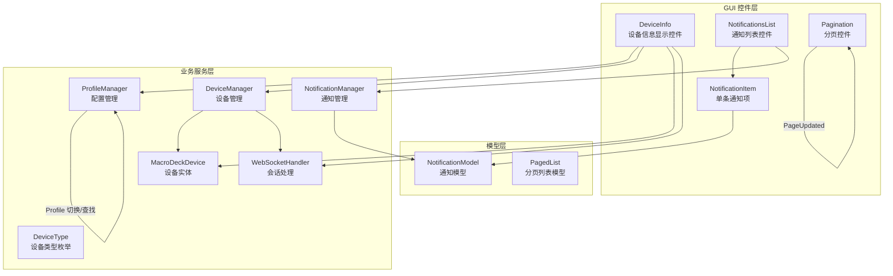
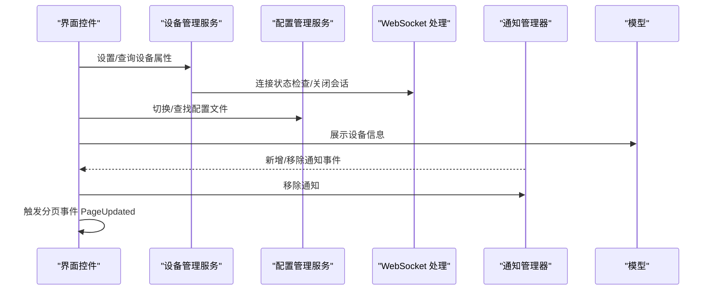
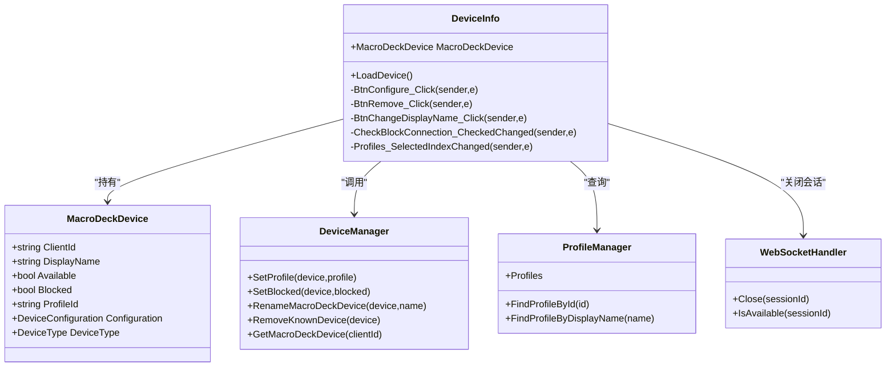
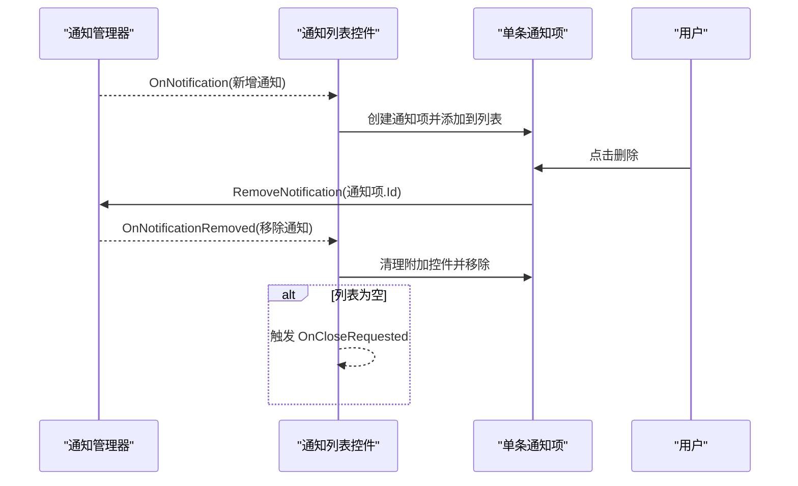
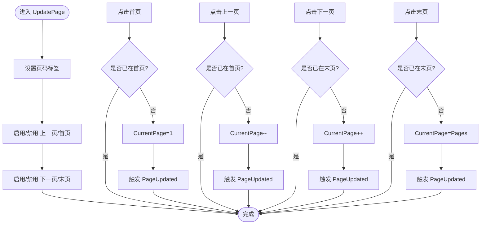
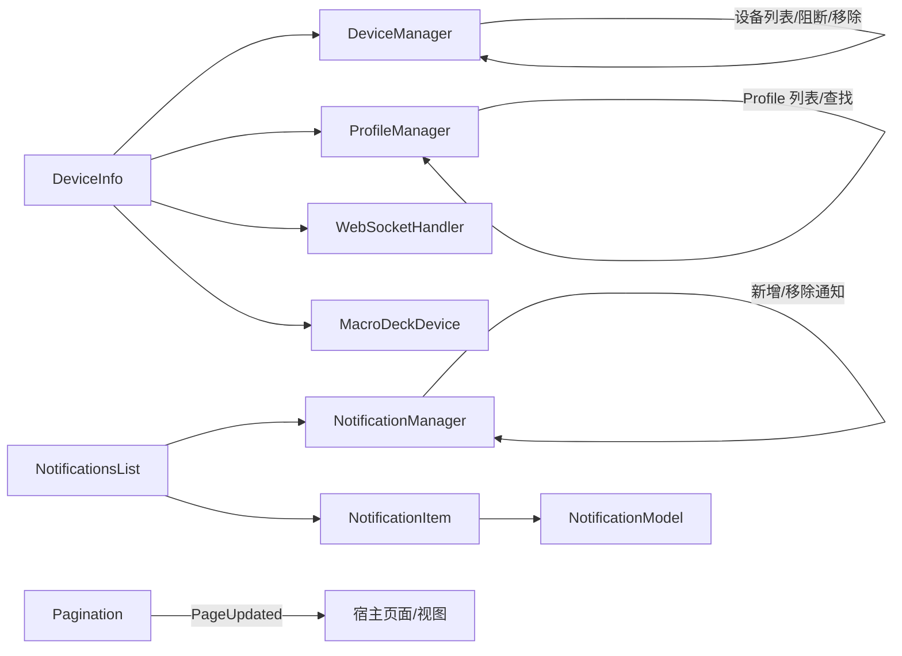

# 实用工具控件

<cite>
**本文引用的文件**
- [DeviceInfo.cs](file://src/MacroDeck/GUI/CustomControls/DeviceInfo.cs)
- [NotificationsList.cs](file://src/MacroDeck/GUI/CustomControls/Notifications/NotificationsList.cs)
- [NotificationItem.cs](file://src/MacroDeck/GUI/CustomControls/Notifications/NotificationItem.cs)
- [Pagination.cs](file://src/MacroDeck/GUI/CustomControls/Pagination.cs)
- [NotificationModel.cs](file://src/MacroDeck/Models/NotificationModel.cs)
- [PagedList.cs](file://src/MacroDeck/Models/PagedList.cs)
- [NotificationManager.cs](file://src/MacroDeck/Notifications/NotificationManager.cs)
- [MacroDeckDevice.cs](file://src/MacroDeck/Device/MacroDeckDevice.cs)
- [DeviceManager.cs](file://src/MacroDeck/Device/DeviceManager.cs)
- [ProfileManager.cs](file://src/MacroDeck/Profiles/ProfileManager.cs)
- [DeviceType.cs](file://src/MacroDeck/Device/DeviceType.cs)
- [WebSocketHandler.cs](file://src/MacroDeck/WebSocketHandler.cs)
</cite>

## 目录
1. [简介](#简介)
2. [项目结构](#项目结构)
3. [核心组件](#核心组件)
4. [架构总览](#架构总览)
5. [详细组件分析](#详细组件分析)
6. [依赖关系分析](#依赖关系分析)
7. [性能考量](#性能考量)
8. [故障排查指南](#故障排查指南)
9. [结论](#结论)
10. [附录：使用示例与最佳实践](#附录使用示例与最佳实践)

## 简介
本文件聚焦于 Macro-Deck 的三类实用工具控件：设备信息显示控件、通知列表控件、分页控件。我们将从系统架构、组件职责、数据流、事件驱动机制、可配置性与扩展性等方面进行深入解析，并给出实际应用场景下的使用建议与性能优化要点。

## 项目结构
实用工具控件主要位于 GUI 自定义控件目录下，配合模型层（如通知模型、分页模型）以及业务服务（设备管理、通知管理、配置管理）协同工作。

图表来源
- [DeviceInfo.cs:1-123](file://src/MacroDeck/GUI/CustomControls/DeviceInfo.cs#L1-L123)
- [NotificationsList.cs:1-52](file://src/MacroDeck/GUI/CustomControls/Notifications/NotificationsList.cs#L1-L52)
- [NotificationItem.cs:1-60](file://src/MacroDeck/GUI/CustomControls/Notifications/NotificationItem.cs#L1-L60)
- [Pagination.cs:1-98](file://src/MacroDeck/GUI/CustomControls/Pagination.cs#L1-L98)
- [NotificationModel.cs:1-19](file://src/MacroDeck/Models/NotificationModel.cs#L1-L19)
- [PagedList.cs:1-10](file://src/MacroDeck/Models/PagedList.cs#L1-L10)
- [NotificationManager.cs:1-129](file://src/MacroDeck/Notifications/NotificationManager.cs#L1-L129)
- [MacroDeckDevice.cs:1-34](file://src/MacroDeck/Device/MacroDeckDevice.cs#L1-L34)
- [DeviceManager.cs:1-278](file://src/MacroDeck/Device/DeviceManager.cs#L1-L278)
- [ProfileManager.cs:1-640](file://src/MacroDeck/Profiles/ProfileManager.cs#L1-L640)
- [DeviceType.cs:1-11](file://src/MacroDeck/Device/DeviceType.cs#L1-L11)
- [WebSocketHandler.cs:1-92](file://src/MacroDeck/WebSocketHandler.cs#L1-L92)

章节来源
- [DeviceInfo.cs:1-123](file://src/MacroDeck/GUI/CustomControls/DeviceInfo.cs#L1-L123)
- [NotificationsList.cs:1-52](file://src/MacroDeck/GUI/CustomControls/Notifications/NotificationsList.cs#L1-L52)
- [Pagination.cs:1-98](file://src/MacroDeck/GUI/CustomControls/Pagination.cs#L1-L98)

## 核心组件
- 设备信息显示控件：用于展示与管理已知设备的基本信息、连接状态、当前配置文件、阻断连接开关，并支持配置按钮与名称修改。
- 通知列表控件：集中展示系统或插件产生的通知，支持动态增删、时间戳显示、图标与附加控件渲染，并在无通知时触发关闭请求。
- 分页控件：提供页码导航、边界控制与事件回调，便于在大量数据中进行分页浏览。

章节来源
- [DeviceInfo.cs:14-122](file://src/MacroDeck/GUI/CustomControls/DeviceInfo.cs#L14-L122)
- [NotificationsList.cs:9-51](file://src/MacroDeck/GUI/CustomControls/Notifications/NotificationsList.cs#L9-L51)
- [Pagination.cs:8-96](file://src/MacroDeck/GUI/CustomControls/Pagination.cs#L8-L96)

## 架构总览
实用工具控件通过事件与模型解耦，遵循“控件负责界面与交互，服务负责状态与业务”的分层原则。设备信息控件与设备/配置管理服务交互；通知控件与通知管理器交互；分页控件通过事件向宿主传递页码变更。

图表来源
- [DeviceInfo.cs:31-122](file://src/MacroDeck/GUI/CustomControls/DeviceInfo.cs#L31-L122)
- [DeviceManager.cs:117-149](file://src/MacroDeck/Device/DeviceManager.cs#L117-L149)
- [ProfileManager.cs:630-638](file://src/MacroDeck/Profiles/ProfileManager.cs#L630-L638)
- [WebSocketHandler.cs:76-90](file://src/MacroDeck/WebSocketHandler.cs#L76-L90)
- [NotificationManager.cs:19-127](file://src/MacroDeck/Notifications/NotificationManager.cs#L19-L127)
- [Pagination.cs:38-96](file://src/MacroDeck/GUI/CustomControls/Pagination.cs#L38-L96)

## 详细组件分析

### 设备信息显示控件（DeviceInfo）
- 职责与功能
  - 展示设备标识、显示名称、连接状态、当前配置文件、阻断连接开关。
  - 支持配置按钮（Android 设备可用）、重命名设备、阻断连接、移除设备。
  - 动态绑定配置文件列表，根据设备类型决定控件可见性。
- 数据展示与状态
  - 连接状态由设备实体的可用性属性决定，可用时显示为“已连接”，否则为“未连接”。
  - 配置文件选择基于配置管理器提供的所有配置文件集合。
  - 阻断连接通过设备管理器设置并持久化。
- 交互流程
  - 用户点击配置按钮打开设备配置对话框。
  - 修改显示名称时进行唯一性校验，冲突则提示错误。
  - 移除设备时先尝试关闭对应会话，再从已知设备列表中移除。

图表来源
- [DeviceInfo.cs:9-122](file://src/MacroDeck/GUI/CustomControls/DeviceInfo.cs#L9-L122)
- [MacroDeckDevice.cs:6-34](file://src/MacroDeck/Device/MacroDeckDevice.cs#L6-L34)
- [DeviceManager.cs:117-160](file://src/MacroDeck/Device/DeviceManager.cs#L117-L160)
- [ProfileManager.cs:29-29](file://src/MacroDeck/Profiles/ProfileManager.cs#L29-L29)
- [WebSocketHandler.cs:76-90](file://src/MacroDeck/WebSocketHandler.cs#L76-L90)

章节来源
- [DeviceInfo.cs:31-122](file://src/MacroDeck/GUI/CustomControls/DeviceInfo.cs#L31-L122)
- [MacroDeckDevice.cs:11-24](file://src/MacroDeck/Device/MacroDeckDevice.cs#L11-L24)
- [DeviceManager.cs:117-160](file://src/MacroDeck/Device/DeviceManager.cs#L117-L160)
- [ProfileManager.cs:630-638](file://src/MacroDeck/Profiles/ProfileManager.cs#L630-L638)
- [DeviceType.cs:3-10](file://src/MacroDeck/Device/DeviceType.cs#L3-L10)

### 通知列表控件（NotificationsList）与单条通知项（NotificationItem）
- 职责与功能
  - 列表控件订阅通知管理器的新增/移除事件，动态添加/移除通知项。
  - 当列表为空时触发关闭请求，便于上层容器回收资源。
  - 单条通知项负责渲染发送者、标题、消息、时间戳、图标及附加控件。
- 消息管理机制
  - 通知模型包含发送者名称、标题、消息、唯一 ID、时间戳、图标与附加控件集合。
  - 通知管理器限制同一发送者的最大通知数量，避免刷屏。
  - 通知移除通过 ID 或对象两种方式，内部统一处理并广播移除事件。
- 用户交互
  - 单条通知项提供删除按钮，删除时清理附加控件并调用通知管理器移除。
  - 列表控件在 UI 线程安全地更新控件集合。

图表来源
- [NotificationManager.cs:19-127](file://src/MacroDeck/Notifications/NotificationManager.cs#L19-L127)
- [NotificationsList.cs:15-50](file://src/MacroDeck/GUI/CustomControls/Notifications/NotificationsList.cs#L15-L50)
- [NotificationItem.cs:30-58](file://src/MacroDeck/GUI/CustomControls/Notifications/NotificationItem.cs#L30-L58)
- [NotificationModel.cs:3-18](file://src/MacroDeck/Models/NotificationModel.cs#L3-L18)

章节来源
- [NotificationsList.cs:9-51](file://src/MacroDeck/GUI/CustomControls/Notifications/NotificationsList.cs#L9-L51)
- [NotificationItem.cs:15-58](file://src/MacroDeck/GUI/CustomControls/Notifications/NotificationItem.cs#L15-L58)
- [NotificationManager.cs:38-127](file://src/MacroDeck/Notifications/NotificationManager.cs#L38-L127)
- [NotificationModel.cs:3-18](file://src/MacroDeck/Models/NotificationModel.cs#L3-L18)

### 分页控件（Pagination）
- 职责与功能
  - 维护当前页与总页数，提供首页、上一页、下一页、末页导航按钮。
  - 在页码变化时更新按钮启用状态与标签文本。
  - 通过 PageUpdated 事件向宿主传递当前页码，便于触发数据加载。
- 导航逻辑
  - 边界保护：当前页小于等于 1 时禁用首页与上一页；当前页大于等于总页数时禁用下一页与末页。
  - 点击事件直接更新当前页并触发 PageUpdated 回调。
- 可配置性
  - 通过属性 CurrentPage 与 Pages 设置初始值与上限。
  - 宿主可通过订阅 PageUpdated 事件实现懒加载或异步刷新。

图表来源
- [Pagination.cs:45-96](file://src/MacroDeck/GUI/CustomControls/Pagination.cs#L45-L96)

章节来源
- [Pagination.cs:8-96](file://src/MacroDeck/GUI/CustomControls/Pagination.cs#L8-L96)

## 依赖关系分析
- 设备信息控件依赖设备实体、设备管理器、配置管理器与 WebSocket 处理器，形成“显示—变更—同步”的闭环。
- 通知控件依赖通知管理器与通知模型，采用事件驱动的动态渲染与回收。
- 分页控件为纯 UI 组件，仅依赖宿主提供的数据源与事件回调。

图表来源
- [DeviceInfo.cs:1-123](file://src/MacroDeck/GUI/CustomControls/DeviceInfo.cs#L1-L123)
- [NotificationsList.cs:1-52](file://src/MacroDeck/GUI/CustomControls/Notifications/NotificationsList.cs#L1-L52)
- [NotificationItem.cs:1-60](file://src/MacroDeck/GUI/CustomControls/Notifications/NotificationItem.cs#L1-L60)
- [Pagination.cs:1-98](file://src/MacroDeck/GUI/CustomControls/Pagination.cs#L1-L98)
- [NotificationManager.cs:1-129](file://src/MacroDeck/Notifications/NotificationManager.cs#L1-L129)
- [MacroDeckDevice.cs:1-34](file://src/MacroDeck/Device/MacroDeckDevice.cs#L1-L34)
- [DeviceManager.cs:1-278](file://src/MacroDeck/Device/DeviceManager.cs#L1-L278)
- [ProfileManager.cs:1-640](file://src/MacroDeck/Profiles/ProfileManager.cs#L1-L640)
- [WebSocketHandler.cs:1-92](file://src/MacroDeck/WebSocketHandler.cs#L1-L92)

章节来源
- [DeviceInfo.cs:1-123](file://src/MacroDeck/GUI/CustomControls/DeviceInfo.cs#L1-L123)
- [NotificationsList.cs:1-52](file://src/MacroDeck/GUI/CustomControls/Notifications/NotificationsList.cs#L1-L52)
- [Pagination.cs:1-98](file://src/MacroDeck/GUI/CustomControls/Pagination.cs#L1-L98)

## 性能考量
- 设备信息控件
  - 连接状态检查依赖 WebSocket 会话可用性判断，应避免频繁轮询，可在设备管理器或会话事件中按需更新。
  - 配置文件列表加载一次性完成，减少 UI 线程压力。
- 通知控件
  - 通知管理器对同一发送者的通知数量进行限制，防止 UI 堆积。
  - 使用 Invoke 在 UI 线程安全地添加/移除控件，避免跨线程异常。
- 分页控件
  - 事件回调仅做 UI 更新与边界判定，不执行耗时操作，保证交互流畅。
  - 宿主侧应结合懒加载策略，仅在 PageUpdated 时请求当前页数据。

[本节为通用性能建议，无需特定文件引用]

## 故障排查指南
- 设备信息控件
  - 若连接状态不更新：检查设备实体的可用性属性与 WebSocket 会话状态。
  - 无法移除设备：确认设备处于可用状态且会话存在，必要时手动关闭会话后再移除。
- 通知控件
  - 通知不消失：确认通知管理器的移除逻辑是否被调用，以及 UI 线程上的控件移除是否成功。
  - 通知过多导致 UI 卡顿：检查通知数量限制与 UI 刷新频率。
- 分页控件
  - 导航按钮不可用：确认 Pages 与 CurrentPage 的赋值顺序与边界条件。
  - 事件未触发：确保订阅了 PageUpdated 事件并在回调中执行数据加载。

章节来源
- [DeviceInfo.cs:74-122](file://src/MacroDeck/GUI/CustomControls/DeviceInfo.cs#L74-L122)
- [NotificationManager.cs:61-127](file://src/MacroDeck/Notifications/NotificationManager.cs#L61-L127)
- [Pagination.cs:54-96](file://src/MacroDeck/GUI/CustomControls/Pagination.cs#L54-L96)

## 结论
实用工具控件以简洁的职责划分与事件驱动模式实现了高内聚低耦合的 UI 组件体系。设备信息控件提供了设备状态与配置的可视化管理；通知列表控件实现了消息的集中展示与生命周期管理；分页控件为大数据场景提供了稳定的导航体验。通过合理的事件与模型解耦，这些控件具备良好的可配置性与扩展性，适合在复杂业务场景中复用与定制。

[本节为总结性内容，无需特定文件引用]

## 附录：使用示例与最佳实践
- 设备信息控件
  - 场景：在设备管理视图中展示已知设备列表，允许用户切换配置文件、阻断连接或移除设备。
  - 最佳实践：在控件加载时一次性绑定配置文件列表；对显示名称修改进行唯一性校验；在移除前主动关闭会话。
- 通知列表控件
  - 场景：在主窗口右下角弹出通知面板，集中展示来自插件或系统的消息。
  - 最佳实践：限制同一发送者的通知数量；为通知项提供可选的附加控件；在列表清空时自动隐藏面板。
- 分页控件
  - 场景：在日志、备份列表或扩展商店中实现分页浏览。
  - 最佳实践：将分页控件与数据加载逻辑解耦；在 PageUpdated 中触发异步加载；合理设置每页大小与总页数。

[本节为概念性指导，无需特定文件引用]