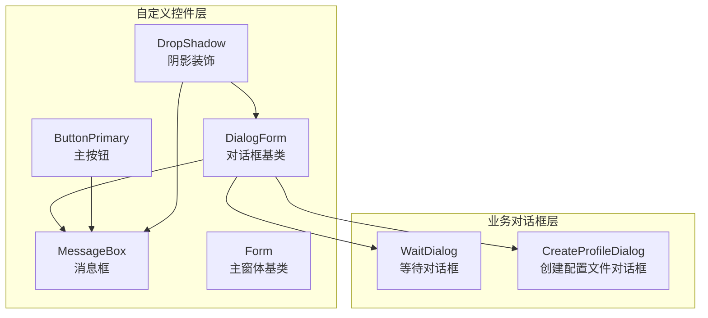
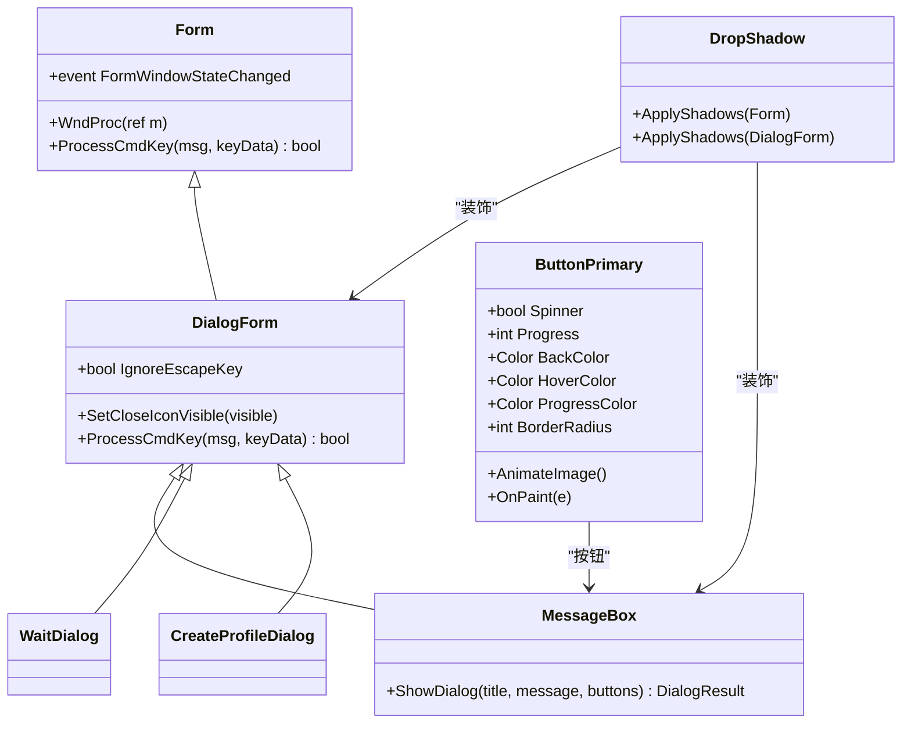
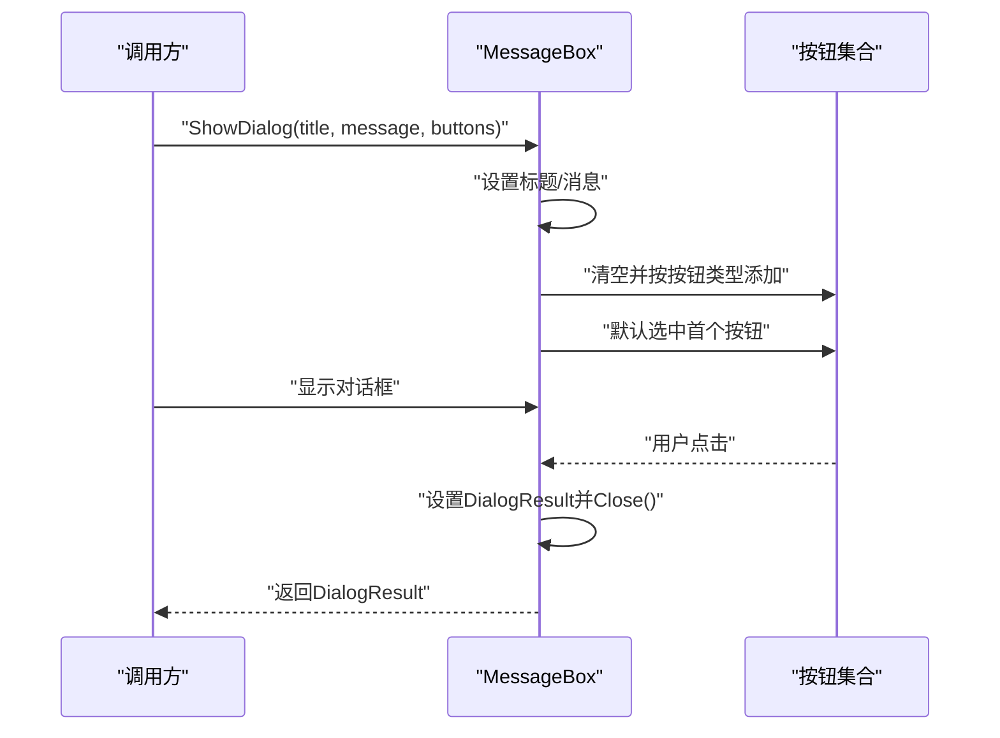
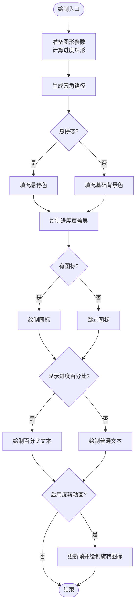
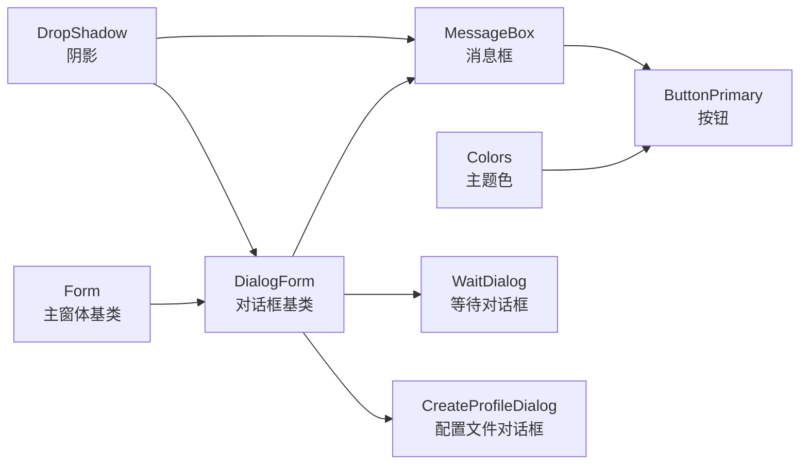

# 对话框表单控件

<cite>
**本文档引用的文件**
- [DialogForm.cs](file://src/MacroDeck/GUI/CustomControls/DialogForm.cs)
- [DialogForm.Designer.cs](file://src/MacroDeck/GUI/CustomControls/DialogForm.Designer.cs)
- [MessageBox.cs](file://src/MacroDeck/GUI/CustomControls/MessageBox.cs)
- [MessageBox.Designer.cs](file://src/MacroDeck/GUI/CustomControls/MessageBox.Designer.cs)
- [Form.cs](file://src/MacroDeck/GUI/CustomControls/Form.cs)
- [Form.Designer.cs](file://src/MacroDeck/GUI/CustomControls/Form.Designer.cs)
- [ButtonPrimary.cs](file://src/MacroDeck/GUI/CustomControls/ButtonPrimary.cs)
- [DropShadow.cs](file://src/MacroDeck/GUI/CustomControls/DropShadow.cs)
- [WaitDialog.cs](file://src/MacroDeck/GUI/Dialogs/WaitDialog.cs)
- [CreateProfileDialog.cs](file://src/MacroDeck/GUI/Dialogs/CreateProfileDialog.cs)
- [Colors.cs](file://src/MacroDeck/GUI/Colors.cs)
</cite>

## 目录
1. [简介](#简介)
2. [项目结构](#项目结构)
3. [核心组件](#核心组件)
4. [架构总览](#架构总览)
5. [详细组件分析](#详细组件分析)
6. [依赖关系分析](#依赖关系分析)
7. [性能考虑](#性能考虑)
8. [故障排除指南](#故障排除指南)
9. [结论](#结论)

## 简介
本文件聚焦于 Macro-Deck 的对话框与表单控件体系，系统性梳理窗体基类、消息框、通用按钮以及阴影装饰等组件的设计与实现，覆盖布局管理（尺寸、位置、响应式）、模态行为（焦点、事件拦截、交互控制）、主题适配与样式定制、生命周期与内存清理等关键方面。目标是帮助开发者快速理解并正确使用这些窗口级控件。

## 项目结构
围绕对话框与表单控件的相关代码主要位于以下路径：
- GUI/CustomControls：自定义窗体与控件（DialogForm、MessageBox、Form、ButtonPrimary、DropShadow）
- GUI/Dialogs：具体业务对话框（如 WaitDialog、CreateProfileDialog）

图表来源
- [DialogForm.cs:1-34](file://src/MacroDeck/GUI/CustomControls/DialogForm.cs#L1-L34)
- [MessageBox.cs:1-70](file://src/MacroDeck/GUI/CustomControls/MessageBox.cs#L1-L70)
- [Form.cs:1-36](file://src/MacroDeck/GUI/CustomControls/Form.cs#L1-L36)
- [ButtonPrimary.cs:1-234](file://src/MacroDeck/GUI/CustomControls/ButtonPrimary.cs#L1-L234)
- [DropShadow.cs:1-148](file://src/MacroDeck/GUI/CustomControls/DropShadow.cs#L1-L148)
- [WaitDialog.cs:1-41](file://src/MacroDeck/GUI/Dialogs/WaitDialog.cs#L1-L41)
- [CreateProfileDialog.cs:1-62](file://src/MacroDeck/GUI/Dialogs/CreateProfileDialog.cs#L1-L62)

章节来源
- [DialogForm.Designer.cs:1-62](file://src/MacroDeck/GUI/CustomControls/DialogForm.Designer.cs#L1-L62)
- [MessageBox.Designer.cs:1-90](file://src/MacroDeck/GUI/CustomControls/MessageBox.Designer.cs#L1-L90)
- [Form.Designer.cs:1-64](file://src/MacroDeck/GUI/CustomControls/Form.Designer.cs#L1-L64)

## 核心组件
- DialogForm：所有对话框的基类，统一处理 Esc 键关闭、可选隐藏关闭按钮、键盘命令分发。
- MessageBox：标准化消息框，支持 OK、Yes/No 等按钮集，自动居中显示、语言资源化文本、按钮焦点管理。
- Form：主窗体基类，提供窗口状态变更事件、Esc 关闭、窗口过程消息处理。
- ButtonPrimary：圆角、进度、旋转加载动画、悬停态等外观可定制的主按钮。
- DropShadow：通过 DWM API 为无边框窗体添加阴影效果。
- WaitDialog：轻量等待提示对话框，配合 SpinnerDialog 静态工具进行显示/隐藏。
- CreateProfileDialog：业务对话框示例，展示输入校验、消息框调用、结果返回。

章节来源
- [DialogForm.cs:1-34](file://src/MacroDeck/GUI/CustomControls/DialogForm.cs#L1-L34)
- [MessageBox.cs:1-70](file://src/MacroDeck/GUI/CustomControls/MessageBox.cs#L1-L70)
- [Form.cs:1-36](file://src/MacroDeck/GUI/CustomControls/Form.cs#L1-L36)
- [ButtonPrimary.cs:1-234](file://src/MacroDeck/GUI/CustomControls/ButtonPrimary.cs#L1-L234)
- [DropShadow.cs:1-148](file://src/MacroDeck/GUI/CustomControls/DropShadow.cs#L1-L148)
- [WaitDialog.cs:1-41](file://src/MacroDeck/GUI/Dialogs/WaitDialog.cs#L1-L41)
- [CreateProfileDialog.cs:1-62](file://src/MacroDeck/GUI/Dialogs/CreateProfileDialog.cs#L1-L62)

## 架构总览
下图展示了从窗体基类到具体对话框与控件的继承与组合关系，以及消息框按钮的动态生成流程。

图表来源
- [DialogForm.cs:1-34](file://src/MacroDeck/GUI/CustomControls/DialogForm.cs#L1-L34)
- [MessageBox.cs:1-70](file://src/MacroDeck/GUI/CustomControls/MessageBox.cs#L1-L70)
- [Form.cs:1-36](file://src/MacroDeck/GUI/CustomControls/Form.cs#L1-L36)
- [ButtonPrimary.cs:1-234](file://src/MacroDeck/GUI/CustomControls/ButtonPrimary.cs#L1-L234)
- [DropShadow.cs:1-148](file://src/MacroDeck/GUI/CustomControls/DropShadow.cs#L1-L148)
- [WaitDialog.cs:1-41](file://src/MacroDeck/GUI/Dialogs/WaitDialog.cs#L1-L41)
- [CreateProfileDialog.cs:1-62](file://src/MacroDeck/GUI/Dialogs/CreateProfileDialog.cs#L1-L62)

## 详细组件分析

### DialogForm：对话框基类
- 设计要点
  - 提供 IgnoreEscapeKey 属性以允许某些对话框禁用 Esc 关闭。
  - SetCloseIconVisible 控制是否显示系统关闭按钮，便于实现纯自定义标题栏。
  - 重写 ProcessCmdKey 拦截 Esc 并关闭窗体，避免误触。
- 布局与行为
  - 设计器初始化包含 DPI 缩放、固定对话框边框、禁止最大化、任务栏隐藏等，确保对话框风格一致。
  - StartPosition 默认 CenterParent，保证相对父窗体居中。
- 生命周期
  - 继承自 System.Windows.Forms.Form，Dispose 流程遵循 WinForms 标准。

章节来源
- [DialogForm.cs:1-34](file://src/MacroDeck/GUI/CustomControls/DialogForm.cs#L1-L34)
- [DialogForm.Designer.cs:1-62](file://src/MacroDeck/GUI/CustomControls/DialogForm.Designer.cs#L1-L62)

### MessageBox：标准化消息框
- 功能特性
  - 支持 OK、Yes/No 两种常用按钮集，按钮文本来自语言资源，自动本地化。
  - 动态清空并重建按钮面板，根据按钮类型添加对应按钮；默认按钮获得焦点。
  - 当 Parent 为空时，采用屏幕居中启动位置；否则继承父窗体。
- 交互控制
  - 按钮点击设置 DialogResult 并关闭对话框，形成标准模态返回值。
- 布局管理
  - 使用 FlowLayoutPanel 右到左排列按钮，自适应宽度；消息与标题区域居中对齐。

图表来源
- [MessageBox.cs:17-68](file://src/MacroDeck/GUI/CustomControls/MessageBox.cs#L17-L68)
- [MessageBox.Designer.cs:33-82](file://src/MacroDeck/GUI/CustomControls/MessageBox.Designer.cs#L33-L82)

章节来源
- [MessageBox.cs:1-70](file://src/MacroDeck/GUI/CustomControls/MessageBox.cs#L1-L70)
- [MessageBox.Designer.cs:1-90](file://src/MacroDeck/GUI/CustomControls/MessageBox.Designer.cs#L1-L90)

### Form：主窗体基类
- 窗口状态事件
  - 重写 WndProc 捕获窗口状态变化，触发 FormWindowStateChanged 事件，便于外部监听。
- 交互控制
  - Esc 关闭窗体，统一快捷键处理。
- 布局与外观
  - 设计器设置 DPI 缩放、双缓冲、起始位置等，保证渲染质量与一致性。

章节来源
- [Form.cs:1-36](file://src/MacroDeck/GUI/CustomControls/Form.cs#L1-L36)
- [Form.Designer.cs:1-64](file://src/MacroDeck/GUI/CustomControls/Form.Designer.cs#L1-L64)

### ButtonPrimary：主按钮控件
- 外观与动画
  - 支持圆角半径、背景色、悬停色、进度色、文本进度显示、旋转加载动画等。
  - 通过 ImageAnimator 实现 GIF 动画帧更新，绘制进度条覆盖层。
- 响应式与渲染
  - 抗锯齿、路径裁剪、文字居中渲染，支持图标叠加。
  - 自动根据控件尺寸调整圆角上限，避免溢出。
- 事件与状态
  - 鼠标进入/离开/抬起切换悬停态，invalidate 触发布局重绘。

图表来源
- [ButtonPrimary.cs:173-232](file://src/MacroDeck/GUI/CustomControls/ButtonPrimary.cs#L173-L232)

章节来源
- [ButtonPrimary.cs:1-234](file://src/MacroDeck/GUI/CustomControls/ButtonPrimary.cs#L1-L234)

### DropShadow：阴影装饰
- 技术实现
  - 通过 DWM API 设置窗口属性与扩展帧到客户区，实现 Aero 风格阴影。
  - 同时提供对 Form 与 DialogForm 的阴影应用方法。
- 兼容性
  - 在较新 Windows 版本上启用，旧版本环境安全降级。

章节来源
- [DropShadow.cs:1-148](file://src/MacroDeck/GUI/CustomControls/DropShadow.cs#L1-L148)

### WaitDialog 与 SpinnerDialog：等待提示
- WaitDialog
  - 继承 DialogForm，隐藏关闭按钮，显示“请稍候”文本。
- SpinnerDialog
  - 静态封装 ShowDialog 调用，通过 owner.Invoke 确保线程安全地显示/隐藏。
  - 重复显示时直接返回，避免重复实例化。

章节来源
- [WaitDialog.cs:1-41](file://src/MacroDeck/GUI/Dialogs/WaitDialog.cs#L1-L41)

### CreateProfileDialog：业务对话框示例
- 输入校验与错误提示
  - 名称长度检查；若新建且名称已存在，弹出 MessageBox 提示。
- 结果返回
  - 成功后设置 DialogResult 并关闭，便于调用方判断操作结果。

章节来源
- [CreateProfileDialog.cs:1-62](file://src/MacroDeck/GUI/Dialogs/CreateProfileDialog.cs#L1-L62)

## 依赖关系分析
- 继承关系
  - DialogForm 是 MessageBox、WaitDialog、CreateProfileDialog 的共同基类。
  - Form 为 DialogForm 的上层基类，提供窗口状态事件。
- 组合关系
  - MessageBox 内部组合 ButtonPrimary 按钮；DropShadow 作为装饰器作用于 DialogForm/MessageBox。
- 主题与颜色
  - Colors 提供全局主题色常量，ButtonPrimary 默认使用强调色，可被主题覆盖。

图表来源
- [Colors.cs:1-15](file://src/MacroDeck/GUI/Colors.cs#L1-L15)
- [DialogForm.cs:1-34](file://src/MacroDeck/GUI/CustomControls/DialogForm.cs#L1-L34)
- [MessageBox.cs:1-70](file://src/MacroDeck/GUI/CustomControls/MessageBox.cs#L1-L70)
- [Form.cs:1-36](file://src/MacroDeck/GUI/CustomControls/Form.cs#L1-L36)
- [ButtonPrimary.cs:1-234](file://src/MacroDeck/GUI/CustomControls/ButtonPrimary.cs#L1-L234)
- [DropShadow.cs:1-148](file://src/MacroDeck/GUI/CustomControls/DropShadow.cs#L1-L148)
- [WaitDialog.cs:1-41](file://src/MacroDeck/GUI/Dialogs/WaitDialog.cs#L1-L41)
- [CreateProfileDialog.cs:1-62](file://src/MacroDeck/GUI/Dialogs/CreateProfileDialog.cs#L1-L62)

## 性能考虑
- 双缓冲与重绘
  - Form 与 ButtonPrimary 均启用双缓冲，减少闪烁，提升复杂绘制场景下的流畅度。
- 图像动画
  - ButtonPrimary 的旋转动画使用 ImageAnimator，建议在不需要时停止动画以节省资源。
- 布局与测量
  - FlowLayoutPanel 自适应按钮宽度，建议在大量按钮场景下限制数量或使用更高效的布局容器。
- 窗口阴影
  - DropShadow 依赖 DWM，仅在系统支持时启用，避免在不支持的平台上产生额外开销。

## 故障排除指南
- Esc 键意外关闭对话框
  - 若需要禁用 Esc，请在构造后设置 DialogForm.IgnoreEscapeKey 为 true。
- 按钮未获得焦点
  - MessageBox 会默认选中首个按钮；若自定义按钮，请确保调用 Select() 或类似逻辑。
- 线程安全显示等待对话框
  - 使用 SpinnerDialog.SetVisisble 时，确保传入的 owner 已正确绑定 UI 线程上下文。
- 阴影无效
  - 确认系统启用了桌面窗口管理器（DWM），并在合适时机调用 DropShadow.ApplyShadows。
- 内存泄漏排查
  - 所有控件均遵循 WinForms Dispose 模式；若自定义控件，请确保在 Dispose 中释放非托管资源。

章节来源
- [DialogForm.cs:17-32](file://src/MacroDeck/GUI/CustomControls/DialogForm.cs#L17-L32)
- [MessageBox.cs:31-36](file://src/MacroDeck/GUI/CustomControls/MessageBox.cs#L31-L36)
- [WaitDialog.cs:21-38](file://src/MacroDeck/GUI/Dialogs/WaitDialog.cs#L21-L38)
- [DropShadow.cs:61-72](file://src/MacroDeck/GUI/CustomControls/DropShadow.cs#L61-L72)
- [DialogForm.Designer.cs:17-24](file://src/MacroDeck/GUI/CustomControls/DialogForm.Designer.cs#L17-L24)

## 结论
Macro-Deck 的对话框与表单控件体系以 DialogForm 为核心，结合 MessageBox 的标准化交互、ButtonPrimary 的丰富外观与 DropShadow 的阴影装饰，形成了统一、可扩展且易维护的窗口级控件框架。通过合理的布局策略、事件拦截与生命周期管理，既保证了良好的用户体验，也兼顾了性能与可维护性。建议在新增业务对话框时优先继承 DialogForm，并复用 MessageBox 与 ButtonPrimary，以保持整体风格一致与开发效率。