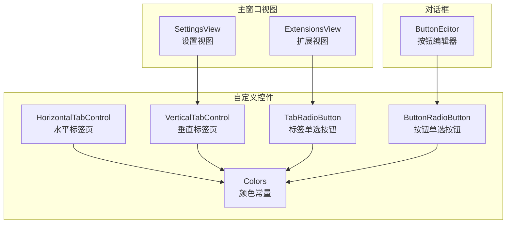
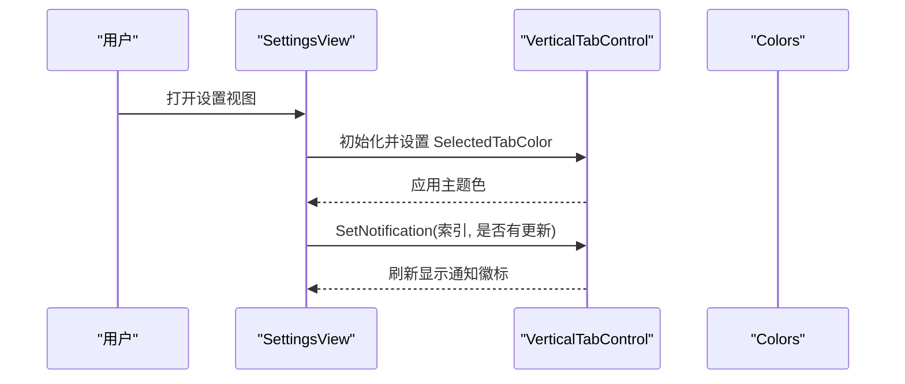
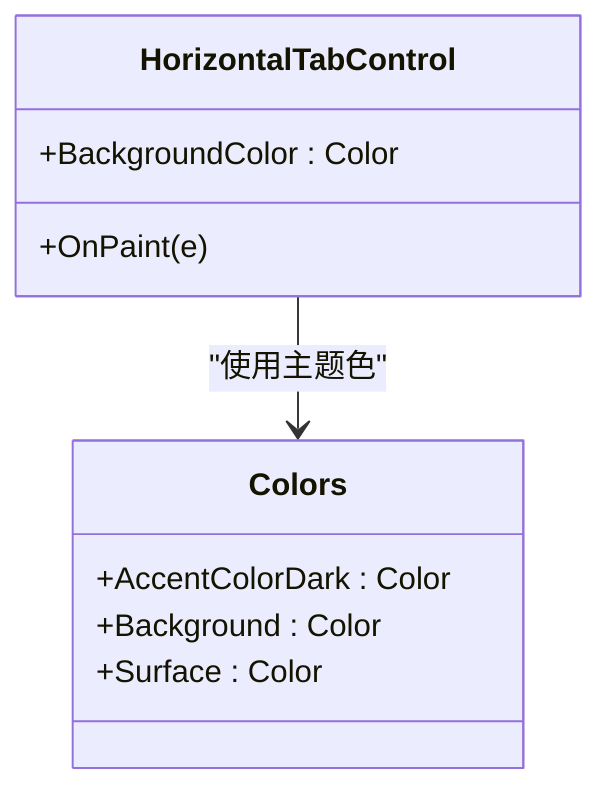
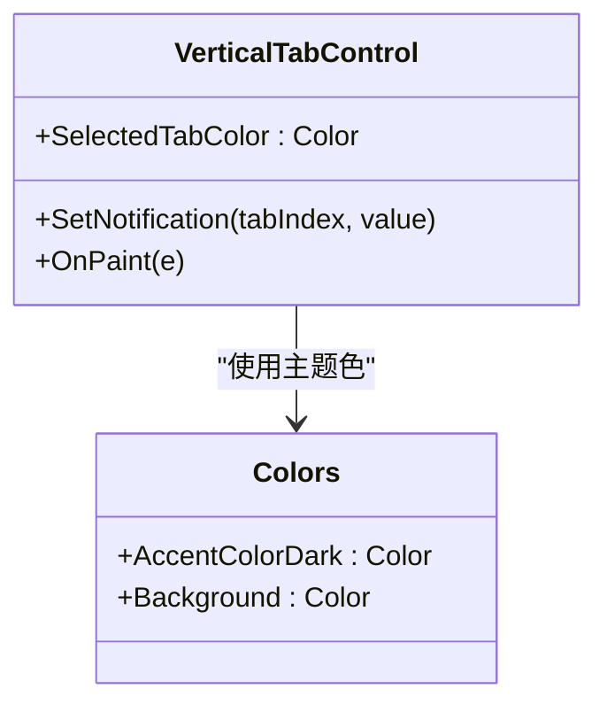
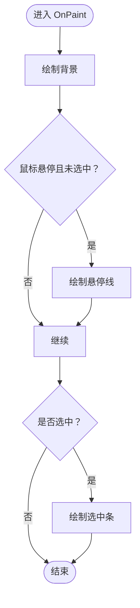
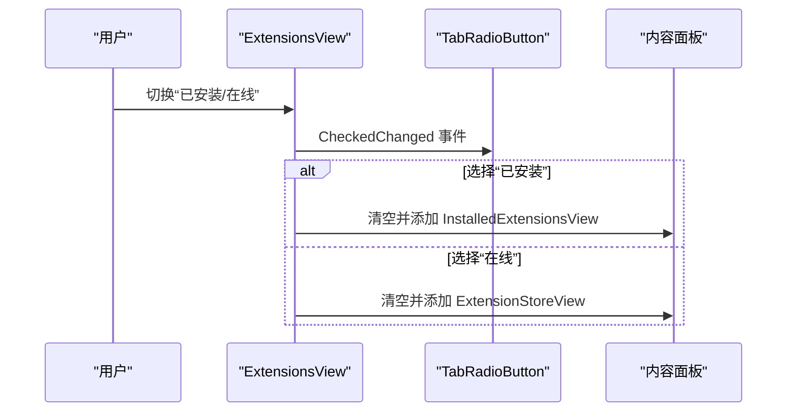
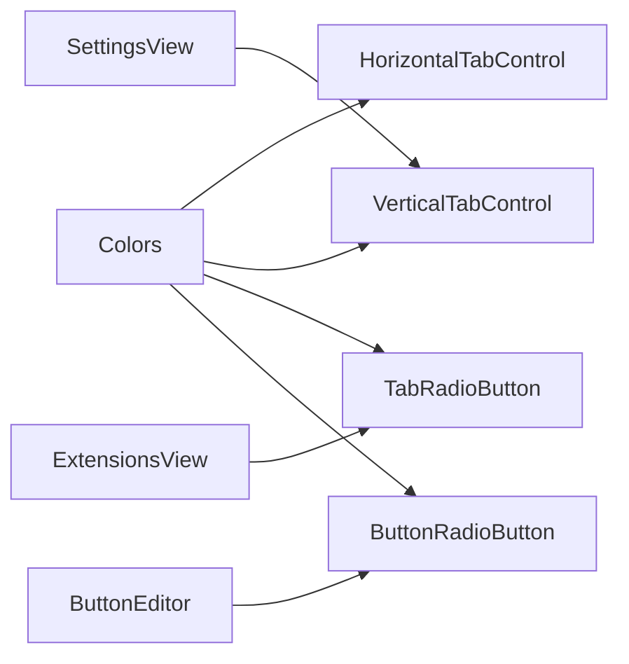

# 导航控件

<cite>
**本文引用的文件**
- [HorizontalTabControl.cs](file://src/MacroDeck/GUI/CustomControls/HorizontalTabControl.cs)
- [VerticalTabControl.cs](file://src/MacroDeck/GUI/CustomControls/VerticalTabControl.cs)
- [TabRadioButton.cs](file://src/MacroDeck/GUI/CustomControls/TabRadioButton.cs)
- [ButtonRadioButton.cs](file://src/MacroDeck/GUI/CustomControls/ButtonRadioButton.cs)
- [Colors.cs](file://src/MacroDeck/GUI/Colors.cs)
- [SettingsView.cs](file://src/MacroDeck/GUI/MainWindowViews/SettingsView.cs)
- [ExtensionsView.cs](file://src/MacroDeck/GUI/MainWindowViews/ExtensionsView.cs)
- [ButtonEditor.Designer.cs](file://src/MacroDeck/GUI/Dialogs/ButtonEditor.Designer.cs)
</cite>

## 目录
1. [简介](#简介)
2. [项目结构](#项目结构)
3. [核心组件](#核心组件)
4. [架构总览](#架构总览)
5. [详细组件分析](#详细组件分析)
6. [依赖关系分析](#依赖关系分析)
7. [性能考虑](#性能考虑)
8. [故障排查指南](#故障排查指南)
9. [结论](#结论)
10. [附录](#附录)

## 简介
本文件聚焦 Macro-Deck 的导航控件体系，系统性梳理水平标签页控件、垂直标签页控件与标签单选按钮的设计与实现，覆盖以下主题：
- 标签页控件的页面管理机制：标签切换、内容加载与状态保持
- 布局算法：标签宽度计算、滚动处理与响应式布局
- 标签单选按钮的互斥选择逻辑与视觉反馈
- 动画与过渡处理（基于现有实现的可扩展建议）
- 多页面应用中的使用模式与最佳实践

## 项目结构
导航控件主要位于 GUI 自定义控件目录中，并在主窗口视图与对话框中被广泛使用：
- 水平标签页控件：用于顶部横向导航
- 垂直标签页控件：用于左侧纵向导航，支持通知徽标
- 标签单选按钮：用于标签页内或设置页内的互斥选择
- 颜色常量：统一主题色，确保视觉一致性

**图表来源**
- [HorizontalTabControl.cs:1-101](file://src/MacroDeck/GUI/CustomControls/HorizontalTabControl.cs#L1-L101)
- [VerticalTabControl.cs:1-157](file://src/MacroDeck/GUI/CustomControls/VerticalTabControl.cs#L1-L157)
- [TabRadioButton.cs:1-65](file://src/MacroDeck/GUI/CustomControls/TabRadioButton.cs#L1-L65)
- [ButtonRadioButton.cs:1-144](file://src/MacroDeck/GUI/CustomControls/ButtonRadioButton.cs#L1-L144)
- [Colors.cs:1-15](file://src/MacroDeck/GUI/Colors.cs#L1-L15)
- [SettingsView.cs:1-200](file://src/MacroDeck/GUI/MainWindowViews/SettingsView.cs#L1-L200)
- [ExtensionsView.cs:1-98](file://src/MacroDeck/GUI/MainWindowViews/ExtensionsView.cs#L1-L98)
- [ButtonEditor.Designer.cs:40-239](file://src/MacroDeck/GUI/Dialogs/ButtonEditor.Designer.cs#L40-L239)

**章节来源**
- [HorizontalTabControl.cs:1-101](file://src/MacroDeck/GUI/CustomControls/HorizontalTabControl.cs#L1-L101)
- [VerticalTabControl.cs:1-157](file://src/MacroDeck/GUI/CustomControls/VerticalTabControl.cs#L1-L157)
- [TabRadioButton.cs:1-65](file://src/MacroDeck/GUI/CustomControls/TabRadioButton.cs#L1-L65)
- [ButtonRadioButton.cs:1-144](file://src/MacroDeck/GUI/CustomControls/ButtonRadioButton.cs#L1-L144)
- [Colors.cs:1-15](file://src/MacroDeck/GUI/Colors.cs#L1-L15)
- [SettingsView.cs:1-200](file://src/MacroDeck/GUI/MainWindowViews/SettingsView.cs#L1-L200)
- [ExtensionsView.cs:1-98](file://src/MacroDeck/GUI/MainWindowViews/ExtensionsView.cs#L1-L98)
- [ButtonEditor.Designer.cs:40-239](file://src/MacroDeck/GUI/Dialogs/ButtonEditor.Designer.cs#L40-L239)

## 核心组件
- 水平标签页控件（HorizontalTabControl）
  - 双缓冲绘制，固定大小模式，顶部对齐，统一 ItemSize 与背景色
  - 自绘每个标签项的背景、图标与文本，居中显示
- 垂直标签页控件（VerticalTabControl）
  - 固定大小模式，左侧对齐，统一 ItemSize 与圆角路径绘制
  - 支持通知徽标（SetNotification），在标签右上角显示红点
- 标签单选按钮（TabRadioButton）
  - 继承 RadioButton，自绘底部选中条与悬停指示线
  - 在 Checked 或鼠标悬停时呈现不同视觉状态
- 按钮单选按钮（ButtonRadioButton）
  - 继承 RadioButton，支持图标、边框半径与对齐方式
  - 提供圆角路径绘制与悬停高亮效果
- 颜色常量（Colors）
  - 统一的强调色、浅/深强调色与表面色，保证主题一致

**章节来源**
- [HorizontalTabControl.cs:5-18](file://src/MacroDeck/GUI/CustomControls/HorizontalTabControl.cs#L5-L18)
- [VerticalTabControl.cs:5-23](file://src/MacroDeck/GUI/CustomControls/VerticalTabControl.cs#L5-L23)
- [TabRadioButton.cs:3-12](file://src/MacroDeck/GUI/CustomControls/TabRadioButton.cs#L3-L12)
- [ButtonRadioButton.cs:5-51](file://src/MacroDeck/GUI/CustomControls/ButtonRadioButton.cs#L5-L51)
- [Colors.cs:3-14](file://src/MacroDeck/GUI/Colors.cs#L3-L14)

## 架构总览
导航控件在主窗口视图与对话框中协同工作：
- 设置视图通过垂直标签页组织多个设置分组，并在更新可用时对特定标签页显示通知徽标
- 扩展视图使用标签单选按钮在“已安装”与“在线”之间切换内容区域
- 按钮编辑器使用按钮单选按钮进行多种交互模式的选择

**图表来源**
- [SettingsView.cs:21-40](file://src/MacroDeck/GUI/MainWindowViews/SettingsView.cs#L21-L40)
- [VerticalTabControl.cs:25-43](file://src/MacroDeck/GUI/CustomControls/VerticalTabControl.cs#L25-L43)
- [Colors.cs:5-7](file://src/MacroDeck/GUI/Colors.cs#L5-L7)

## 详细组件分析

### 水平标签页控件（HorizontalTabControl）
- 设计要点
  - 使用双缓冲减少闪烁，固定 ItemSize 与顶部对齐，适合顶部导航
  - 自绘每个标签项的背景色与文本，支持图标与文字居中
- 页面管理机制
  - 通过 TabPages 添加/移除标签；SelectedIndex 控制当前激活页
  - 内容加载与状态保持：通常由父容器根据 SelectedIndex 动态切换内容面板
- 布局算法
  - ItemSize 固定，标签宽度由 ItemSize.Width 决定
  - 当标签过多时，可通过滚动或换行策略优化（当前实现未包含自动换行）
- 视觉与交互
  - 选中项使用强调色背景，非选中项使用父容器背景
  - 图标与文本居中对齐，异常时回退到纯文本显示

**图表来源**
- [HorizontalTabControl.cs:21-99](file://src/MacroDeck/GUI/CustomControls/HorizontalTabControl.cs#L21-L99)
- [Colors.cs:5-7](file://src/MacroDeck/GUI/Colors.cs#L5-L7)

**章节来源**
- [HorizontalTabControl.cs:5-18](file://src/MacroDeck/GUI/CustomControls/HorizontalTabControl.cs#L5-L18)
- [HorizontalTabControl.cs:23-99](file://src/MacroDeck/GUI/CustomControls/HorizontalTabControl.cs#L23-L99)

### 垂直标签页控件（VerticalTabControl）
- 设计要点
  - 左侧对齐，固定 ItemSize，支持圆角路径绘制与线条分隔
  - 提供通知徽标接口，便于在标签项右上角显示提示
- 页面管理机制
  - 通过 TabPages 管理标签；SelectedIndex 控制当前页
  - 通知状态通过 SetNotification 动态刷新
- 布局算法
  - ItemSize.Width 决定标签宽度，高度由 ItemSize.Height 决定
  - 未见自动换行或滚动处理，适合标签数量可控的场景
- 视觉与交互
  - 选中项填充圆角路径，非选中项使用父容器背景
  - 通知徽标以红色椭圆显示在右侧

**图表来源**
- [VerticalTabControl.cs:9-43](file://src/MacroDeck/GUI/CustomControls/VerticalTabControl.cs#L9-L43)
- [VerticalTabControl.cs:59-155](file://src/MacroDeck/GUI/CustomControls/VerticalTabControl.cs#L59-L155)
- [Colors.cs:5-7](file://src/MacroDeck/GUI/Colors.cs#L5-L7)

**章节来源**
- [VerticalTabControl.cs:5-23](file://src/MacroDeck/GUI/CustomControls/VerticalTabControl.cs#L5-L23)
- [VerticalTabControl.cs:25-43](file://src/MacroDeck/GUI/CustomControls/VerticalTabControl.cs#L25-L43)
- [VerticalTabControl.cs:59-155](file://src/MacroDeck/GUI/CustomControls/VerticalTabControl.cs#L59-L155)

### 标签单选按钮（TabRadioButton）
- 设计要点
  - 继承 RadioButton，自绘底部选中条与悬停指示线
  - Checked 时显示选中条，鼠标悬停且未选中时显示悬停线
- 互斥选择逻辑
  - 通过共同的 GroupBox 或同一 RadioGroup 实现互斥
  - CheckedChanged 事件用于触发页面切换或配置更新
- 视觉反馈
  - 选中条与悬停线使用强调色，文本居中显示

**图表来源**
- [TabRadioButton.cs:26-63](file://src/MacroDeck/GUI/CustomControls/TabRadioButton.cs#L26-L63)

**章节来源**
- [TabRadioButton.cs:3-12](file://src/MacroDeck/GUI/CustomControls/TabRadioButton.cs#L3-L12)
- [TabRadioButton.cs:26-63](file://src/MacroDeck/GUI/CustomControls/TabRadioButton.cs#L26-L63)

### 按钮单选按钮（ButtonRadioButton）
- 设计要点
  - 支持图标、边框半径与对齐方式动态调整
  - 圆角路径绘制，悬停时使用浅强调色，选中时使用深强调色
- 适用场景
  - 配置界面中的模式选择、对齐方式选择等

**章节来源**
- [ButtonRadioButton.cs:5-51](file://src/MacroDeck/GUI/CustomControls/ButtonRadioButton.cs#L5-L51)
- [ButtonRadioButton.cs:79-142](file://src/MacroDeck/GUI/CustomControls/ButtonRadioButton.cs#L79-L142)

### 使用模式与最佳实践
- 设置视图（SettingsView）
  - 使用垂直标签页组织设置分组，初始化时设置选中颜色
  - 更新可用时对相应标签页调用 SetNotification 显示通知徽标
- 扩展视图（ExtensionsView）
  - 使用标签单选按钮在“已安装”与“在线”之间切换内容面板
  - 内容面板按需创建与清理，避免重复实例化
- 按钮编辑器（ButtonEditor）
  - 使用按钮单选按钮进行多种交互模式的选择，提升可发现性与易用性

**图表来源**
- [ExtensionsView.cs:82-96](file://src/MacroDeck/GUI/MainWindowViews/ExtensionsView.cs#L82-L96)
- [ExtensionsView.cs:22-75](file://src/MacroDeck/GUI/MainWindowViews/ExtensionsView.cs#L22-L75)

**章节来源**
- [SettingsView.cs:21-40](file://src/MacroDeck/GUI/MainWindowViews/SettingsView.cs#L21-L40)
- [ExtensionsView.cs:1-98](file://src/MacroDeck/GUI/MainWindowViews/ExtensionsView.cs#L1-L98)
- [ButtonEditor.Designer.cs:40-239](file://src/MacroDeck/GUI/Dialogs/ButtonEditor.Designer.cs#L40-L239)

## 依赖关系分析
- 颜色依赖
  - 水平/垂直标签页与标签单选按钮均依赖 Colors 提供的主题色
- 视图依赖
  - 设置视图依赖垂直标签页进行页面组织与通知提示
  - 扩展视图依赖标签单选按钮进行内容切换
  - 按钮编辑器依赖按钮单选按钮进行交互模式选择

**图表来源**
- [Colors.cs:3-14](file://src/MacroDeck/GUI/Colors.cs#L3-L14)
- [HorizontalTabControl.cs:21-21](file://src/MacroDeck/GUI/CustomControls/HorizontalTabControl.cs#L21-L21)
- [VerticalTabControl.cs:9-9](file://src/MacroDeck/GUI/CustomControls/VerticalTabControl.cs#L9-L9)
- [TabRadioButton.cs:46-47](file://src/MacroDeck/GUI/CustomControls/TabRadioButton.cs#L46-L47)
- [ButtonRadioButton.cs:118-128](file://src/MacroDeck/GUI/CustomControls/ButtonRadioButton.cs#L118-L128)
- [SettingsView.cs:24-28](file://src/MacroDeck/GUI/MainWindowViews/SettingsView.cs#L24-L28)
- [ExtensionsView.cs:16-18](file://src/MacroDeck/GUI/MainWindowViews/ExtensionsView.cs#L16-L18)
- [ButtonEditor.Designer.cs:48-77](file://src/MacroDeck/GUI/Dialogs/ButtonEditor.Designer.cs#L48-L77)

**章节来源**
- [Colors.cs:1-15](file://src/MacroDeck/GUI/Colors.cs#L1-L15)
- [HorizontalTabControl.cs:1-101](file://src/MacroDeck/GUI/CustomControls/HorizontalTabControl.cs#L1-L101)
- [VerticalTabControl.cs:1-157](file://src/MacroDeck/GUI/CustomControls/VerticalTabControl.cs#L1-L157)
- [TabRadioButton.cs:1-65](file://src/MacroDeck/GUI/CustomControls/TabRadioButton.cs#L1-L65)
- [ButtonRadioButton.cs:1-144](file://src/MacroDeck/GUI/CustomControls/ButtonRadioButton.cs#L1-L144)
- [SettingsView.cs:1-200](file://src/MacroDeck/GUI/MainWindowViews/SettingsView.cs#L1-L200)
- [ExtensionsView.cs:1-98](file://src/MacroDeck/GUI/MainWindowViews/ExtensionsView.cs#L1-L98)
- [ButtonEditor.Designer.cs:40-239](file://src/MacroDeck/GUI/Dialogs/ButtonEditor.Designer.cs#L40-L239)

## 性能考虑
- 双缓冲绘制
  - 水平与垂直标签页均启用双缓冲，有效降低重绘闪烁
- 自绘优化
  - 仅在必要时调用 Invalidate，避免频繁重绘
- 响应式布局
  - 固定 ItemSize 简化布局计算，但可能需要额外的滚动或换行策略以适配大量标签
- 主题一致性
  - 通过 Colors 统一颜色，减少样式分散带来的维护成本

[本节为通用指导，不直接分析具体文件]

## 故障排查指南
- 标签页未显示通知徽标
  - 检查是否正确调用 SetNotification 并传入正确的索引
  - 确认垂直标签页控件的 OnPaint 是否被触发（调用 Invalidate）
- 文本或图标显示异常
  - 确保 ImageList 与 TabPages 的 ImageIndex 对应
  - 异常时会回退到纯文本显示，检查异常捕获逻辑
- 单选按钮互斥无效
  - 确认按钮在同一 GroupBox 或同一 RadioGroup 中
  - 检查 CheckedChanged 事件绑定与处理逻辑

**章节来源**
- [VerticalTabControl.cs:25-43](file://src/MacroDeck/GUI/CustomControls/VerticalTabControl.cs#L25-L43)
- [VerticalTabControl.cs:59-155](file://src/MacroDeck/GUI/CustomControls/VerticalTabControl.cs#L59-L155)
- [HorizontalTabControl.cs:53-94](file://src/MacroDeck/GUI/CustomControls/HorizontalTabControl.cs#L53-L94)
- [TabRadioButton.cs:15-23](file://src/MacroDeck/GUI/CustomControls/TabRadioButton.cs#L15-L23)

## 结论
Macro-Deck 的导航控件通过自绘与统一主题色实现了清晰、一致的用户体验。水平与垂直标签页分别适用于顶部与左侧导航场景，标签单选按钮提供了直观的互斥选择能力。结合视图层的页面管理与通知机制，可在多页面应用中高效组织内容。未来可进一步引入响应式布局与过渡动画以增强交互体验。

[本节为总结性内容，不直接分析具体文件]

## 附录
- 多页面应用使用建议
  - 将页面内容封装为独立 UserControl，按需创建与释放
  - 使用标签页控件作为路由入口，通过 SelectedIndex 或 CheckedChanged 切换内容
  - 对于长列表或大量标签，考虑滚动容器或分组折叠策略

[本节为通用指导，不直接分析具体文件]