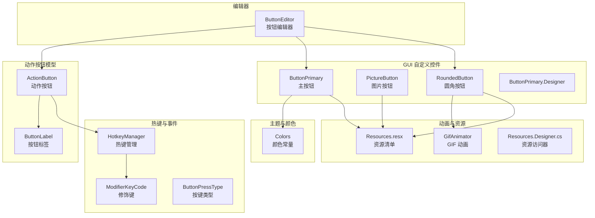
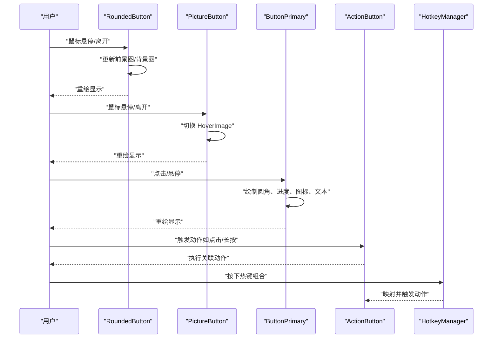
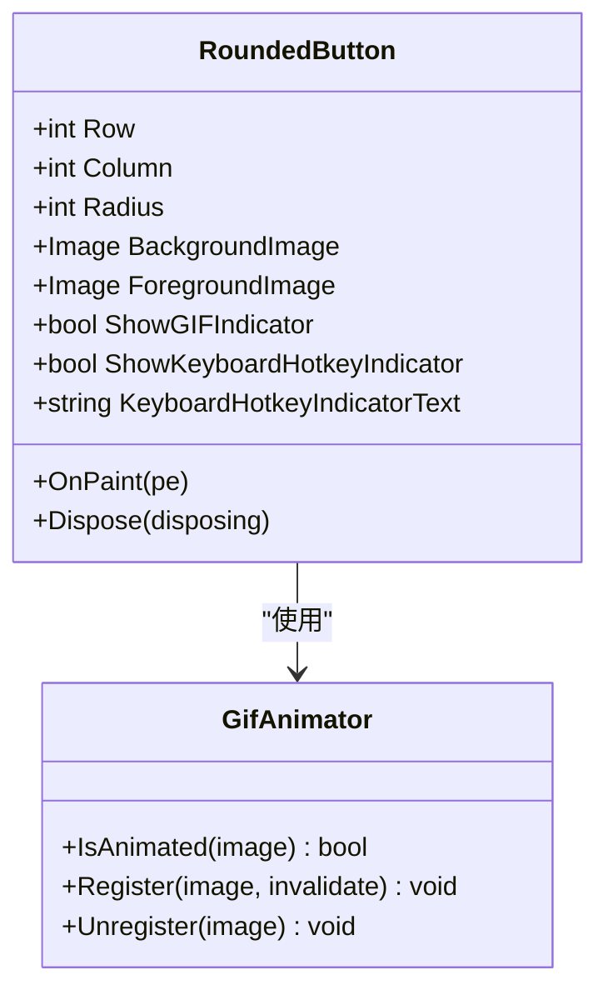
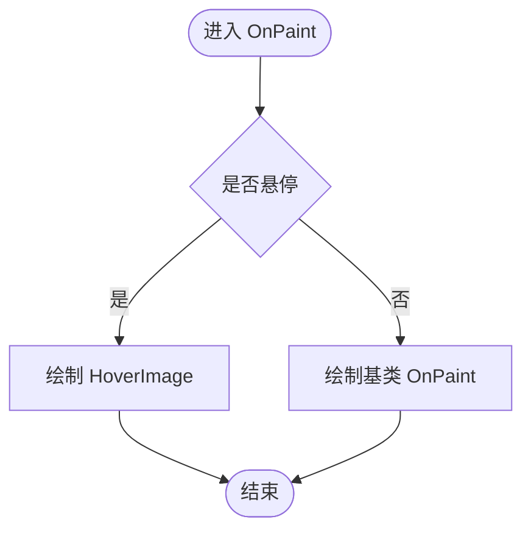
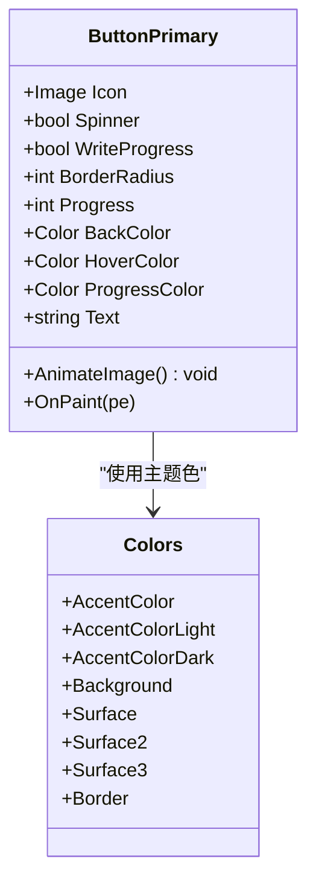
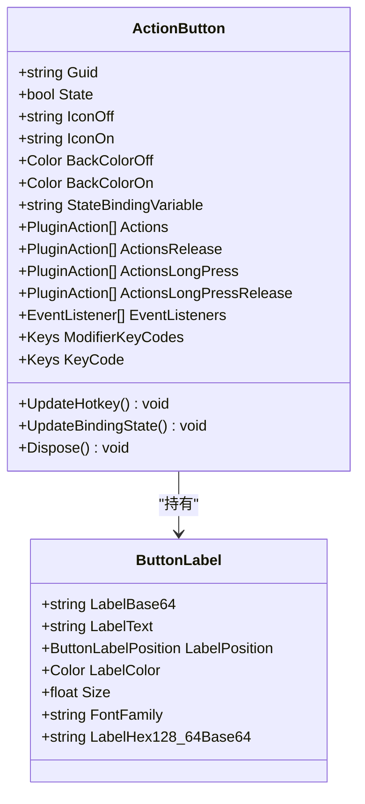
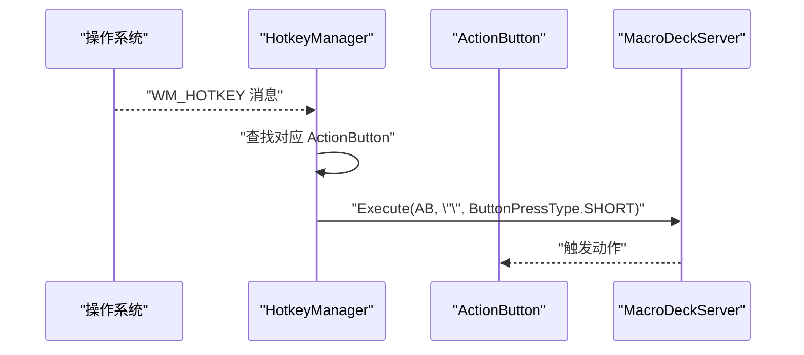
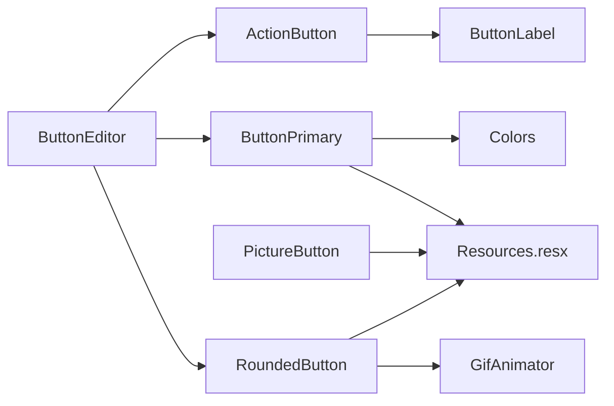

# 按钮控件

<cite>
**本文引用的文件**
- [RoundedButton.cs](file://src/MacroDeck/GUI/CustomControls/RoundedButton.cs)
- [PictureButton.cs](file://src/MacroDeck/GUI/CustomControls/PictureButton.cs)
- [ButtonPrimary.cs](file://src/MacroDeck/GUI/CustomControls/ButtonPrimary.cs)
- [ButtonPrimary.Designer.cs](file://src/MacroDeck/GUI/CustomControls/ButtonPrimary.Designer.cs)
- [ActionButton.cs](file://src/MacroDeck/ActionButton/ActionButton.cs)
- [ButtonLabel.cs](file://src/MacroDeck/ActionButton/ButtonLabel.cs)
- [Colors.cs](file://src/MacroDeck/GUI/Colors.cs)
- [HotkeyManager.cs](file://src/MacroDeck/Hotkeys/HotkeyManager.cs)
- [ModifierKeyCode.cs](file://src/MacroDeck/Hotkeys/ModifierKeyCode.cs)
- [ButtonPressType.cs](file://src/MacroDeck/Enums/ButtonPressType.cs)
- [GifAnimator.cs](file://src/MacroDeck/Utils/GifAnimator.cs)
- [Resources.resx](file://src/MacroDeck/Properties/Resources.resx)
- [Resources.Designer.cs](file://src/MacroDeck/Properties/Resources.Designer.cs)
- [ButtonEditor.cs](file://src/MacroDeck/GUI/Dialogs/ButtonEditor.cs)
</cite>

## 目录
1. [简介](#简介)
2. [项目结构](#项目结构)
3. [核心组件](#核心组件)
4. [架构总览](#架构总览)
5. [详细组件分析](#详细组件分析)
6. [依赖关系分析](#依赖关系分析)
7. [性能考量](#性能考量)
8. [故障排查指南](#故障排查指南)
9. [结论](#结论)
10. [附录](#附录)

## 简介
本文件面向 Macro-Deck 的按钮控件体系，系统化梳理圆角按钮、主按钮、图片按钮等控件的实现细节与使用场景；详解外观定制（颜色主题、尺寸规格、边框样式、阴影效果）、状态管理（正常、悬停、按下、禁用等）以及事件处理（点击、长按、热键等）；并提供可访问性与键盘导航建议、多主题表现与自定义样式方法。

## 项目结构
按钮控件主要分布在 GUI 自定义控件目录与动作按钮模型中，并通过工具类与资源进行动画与图标支持：
- GUI 自定义控件：RoundedButton、PictureButton、ButtonPrimary 及其设计器
- 动作按钮模型：ActionButton、ButtonLabel
- 主题与颜色：Colors
- 热键与事件：HotkeyManager、ModifierKeyCode、ButtonPressType
- 动画支持：GifAnimator
- 资源与图标：Resources.resx、Resources.Designer.cs
- 按钮编辑器：ButtonEditor（用于配置按钮外观与行为）

**图表来源**
- [RoundedButton.cs:1-263](file://src/MacroDeck/GUI/CustomControls/RoundedButton.cs#L1-L263)
- [PictureButton.cs:1-62](file://src/MacroDeck/GUI/CustomControls/PictureButton.cs#L1-L62)
- [ButtonPrimary.cs:1-234](file://src/MacroDeck/GUI/CustomControls/ButtonPrimary.cs#L1-L234)
- [ButtonPrimary.Designer.cs:1-40](file://src/MacroDeck/GUI/CustomControls/ButtonPrimary.Designer.cs#L1-L40)
- [ActionButton.cs:1-198](file://src/MacroDeck/ActionButton/ActionButton.cs#L1-L198)
- [ButtonLabel.cs:1-69](file://src/MacroDeck/ActionButton/ButtonLabel.cs#L1-L69)
- [Colors.cs:1-15](file://src/MacroDeck/GUI/Colors.cs#L1-L15)
- [HotkeyManager.cs:1-121](file://src/MacroDeck/Hotkeys/HotkeyManager.cs#L1-L121)
- [ModifierKeyCode.cs:1-10](file://src/MacroDeck/Hotkeys/ModifierKeyCode.cs#L1-L10)
- [ButtonPressType.cs:1-10](file://src/MacroDeck/Enums/ButtonPressType.cs#L1-L10)
- [GifAnimator.cs:1-191](file://src/MacroDeck/Utils/GifAnimator.cs#L1-L191)
- [Resources.resx:126-142](file://src/MacroDeck/Properties/Resources.resx#L126-L142)
- [Resources.Designer.cs:152-525](file://src/MacroDeck/Properties/Resources.Designer.cs#L152-L525)
- [ButtonEditor.cs:425-474](file://src/MacroDeck/GUI/Dialogs/ButtonEditor.cs#L425-L474)

**章节来源**
- [RoundedButton.cs:1-263](file://src/MacroDeck/GUI/CustomControls/RoundedButton.cs#L1-L263)
- [PictureButton.cs:1-62](file://src/MacroDeck/GUI/CustomControls/PictureButton.cs#L1-L62)
- [ButtonPrimary.cs:1-234](file://src/MacroDeck/GUI/CustomControls/ButtonPrimary.cs#L1-L234)
- [ActionButton.cs:1-198](file://src/MacroDeck/ActionButton/ActionButton.cs#L1-L198)
- [ButtonLabel.cs:1-69](file://src/MacroDeck/ActionButton/ButtonLabel.cs#L1-L69)
- [Colors.cs:1-15](file://src/MacroDeck/GUI/Colors.cs#L1-L15)
- [HotkeyManager.cs:1-121](file://src/MacroDeck/Hotkeys/HotkeyManager.cs#L1-L121)
- [ModifierKeyCode.cs:1-10](file://src/MacroDeck/Hotkeys/ModifierKeyCode.cs#L1-L10)
- [ButtonPressType.cs:1-10](file://src/MacroDeck/Enums/ButtonPressType.cs#L1-L10)
- [GifAnimator.cs:1-191](file://src/MacroDeck/Utils/GifAnimator.cs#L1-L191)
- [Resources.resx:126-142](file://src/MacroDeck/Properties/Resources.resx#L126-L142)
- [Resources.Designer.cs:152-525](file://src/MacroDeck/Properties/Resources.Designer.cs#L152-L525)
- [ButtonEditor.cs:425-474](file://src/MacroDeck/GUI/Dialogs/ButtonEditor.cs#L425-L474)

## 核心组件
- 圆角按钮（RoundedButton）
  - 基于 PictureBox，支持背景图、前景图（标签位图）、GIF 指示、热键指示绘制
  - 支持半径参数控制圆角程度，动态更新裁剪区域以避免 GDI 泄漏
  - 鼠标进入/离开时切换显示模式，支持动画 GIF 的播放与帧更新
- 图片按钮（PictureButton）
  - 基于 PictureBox，支持悬停态替换图像
  - 提供 HoverImage 属性与悬停状态切换
- 主按钮（ButtonPrimary）
  - 基于 Button，支持圆角、进度条、图标、旋转加载动画
  - 支持悬停色、进度色、边框半径、文本绘制与百分比显示
  - 使用双缓冲与优化渲染提升流畅度
- 动作按钮（ActionButton）
  - 表示一个可执行的动作按钮，支持状态绑定变量、图标切换、颜色切换
  - 维护多种事件监听列表（按下/释放/长按/长按释放）
  - 支持热键注册与触发
- 按钮标签（ButtonLabel）
  - 定义标签文本、颜色、字体、大小及位置
  - 将标签内容转换为 128x64 的十六进制 Base64 字符串，便于设备端渲染
- 颜色系统（Colors）
  - 提供强调色、背景色、表面色、边框色等主题色常量
- 热键管理（HotkeyManager）
  - 注册/注销全局热键，处理消息循环中的热键消息
  - 将热键映射到动作按钮并触发对应事件
- 动画支持（GifAnimator）
  - 统一驱动多个图像的 GIF 动画，按帧延迟精确播放
  - 避免重复注册与泄漏，提供注册/注销与帧更新接口

**章节来源**
- [RoundedButton.cs:1-263](file://src/MacroDeck/GUI/CustomControls/RoundedButton.cs#L1-L263)
- [PictureButton.cs:1-62](file://src/MacroDeck/GUI/CustomControls/PictureButton.cs#L1-L62)
- [ButtonPrimary.cs:1-234](file://src/MacroDeck/GUI/CustomControls/ButtonPrimary.cs#L1-L234)
- [ActionButton.cs:1-198](file://src/MacroDeck/ActionButton/ActionButton.cs#L1-L198)
- [ButtonLabel.cs:1-69](file://src/MacroDeck/ActionButton/ButtonLabel.cs#L1-L69)
- [Colors.cs:1-15](file://src/MacroDeck/GUI/Colors.cs#L1-L15)
- [HotkeyManager.cs:1-121](file://src/MacroDeck/Hotkeys/HotkeyManager.cs#L1-L121)
- [GifAnimator.cs:1-191](file://src/MacroDeck/Utils/GifAnimator.cs#L1-L191)

## 架构总览
按钮控件的运行时交互链路如下：
- 用户交互（鼠标/键盘）触发控件事件
- 控件根据当前状态绘制（圆角、边框、前景图、GIF、热键指示）
- 动作按钮模型接收事件并执行关联动作
- 热键管理器统一捕获系统热键并映射到动作按钮

**图表来源**
- [RoundedButton.cs:117-138](file://src/MacroDeck/GUI/CustomControls/RoundedButton.cs#L117-L138)
- [PictureButton.cs:29-45](file://src/MacroDeck/GUI/CustomControls/PictureButton.cs#L29-L45)
- [ButtonPrimary.cs:134-150](file://src/MacroDeck/GUI/CustomControls/ButtonPrimary.cs#L134-L150)
- [ActionButton.cs:109-128](file://src/MacroDeck/ActionButton/ActionButton.cs#L109-L128)
- [HotkeyManager.cs:92-119](file://src/MacroDeck/Hotkeys/HotkeyManager.cs#L92-L119)

## 详细组件分析

### 圆角按钮（RoundedButton）
- 外观与尺寸
  - 支持 Radius 参数控制圆角半径，基于高度比例计算实际半径
  - 使用 GraphicsPath 绘制圆角路径，启用抗锯齿；无圆角时绘制矩形边框
  - 通过 Region 动态裁剪控件显示区域，避免重绘时泄漏 GDI 资源
- 边框与阴影
  - 内描边使用父容器背景色，外描边使用深色边框
  - 通过平滑尺寸与抗锯齿提升边缘质量
- 前景与背景
  - BackgroundImage 支持静态图与动画 GIF；动画 GIF 由 GifAnimator 统一驱动
  - ForegroundImage 用于绘制标签位图，每次更新前释放旧位图避免内存泄漏
- 视觉反馈
  - 鼠标进入时复制背景图为前景图以获得高亮效果；离开时清除前景图
  - 可选显示 GIF 指示与键盘热键指示（背景遮罩+图标+文字）
- 性能与资源
  - 仅在尺寸或半径变化时重建 Region
  - Dispose 中释放前景图、背景图与 Region，防止资源泄露

**图表来源**
- [RoundedButton.cs:7-263](file://src/MacroDeck/GUI/CustomControls/RoundedButton.cs#L7-L263)
- [GifAnimator.cs:12-191](file://src/MacroDeck/Utils/GifAnimator.cs#L12-L191)

**章节来源**
- [RoundedButton.cs:17-39](file://src/MacroDeck/GUI/CustomControls/RoundedButton.cs#L17-L39)
- [RoundedButton.cs:41-84](file://src/MacroDeck/GUI/CustomControls/RoundedButton.cs#L41-L84)
- [RoundedButton.cs:117-138](file://src/MacroDeck/GUI/CustomControls/RoundedButton.cs#L117-L138)
- [RoundedButton.cs:150-173](file://src/MacroDeck/GUI/CustomControls/RoundedButton.cs#L150-L173)
- [RoundedButton.cs:175-186](file://src/MacroDeck/GUI/CustomControls/RoundedButton.cs#L175-L186)
- [RoundedButton.cs:188-261](file://src/MacroDeck/GUI/CustomControls/RoundedButton.cs#L188-L261)
- [GifAnimator.cs:58-101](file://src/MacroDeck/Utils/GifAnimator.cs#L58-L101)

### 图片按钮（PictureButton）
- 外观与交互
  - 默认透明背景、拉伸填充、手型光标
  - 鼠标进入时切换到 HoverImage，离开恢复原样
- 事件处理
  - 记录悬停状态并在鼠标抬起时复位
- 适用场景
  - 需要简单图片切换反馈的按钮，如图标按钮、开关指示等

**图表来源**
- [PictureButton.cs:47-60](file://src/MacroDeck/GUI/CustomControls/PictureButton.cs#L47-L60)

**章节来源**
- [PictureButton.cs:5-15](file://src/MacroDeck/GUI/CustomControls/PictureButton.cs#L5-L15)
- [PictureButton.cs:19-45](file://src/MacroDeck/GUI/CustomControls/PictureButton.cs#L19-L45)
- [PictureButton.cs:47-60](file://src/MacroDeck/GUI/CustomControls/PictureButton.cs#L47-L60)

### 主按钮（ButtonPrimary）
- 外观与尺寸
  - 固定默认尺寸与字体；支持 BorderRadius 控制圆角
  - 抗锯齿绘制，双缓冲优化
- 进度与加载
  - Progress 百分比进度条叠加；WriteProgress 控制是否显示百分比文本
  - Spinner 开启时播放旋转动画（ImageAnimator 驱动）
- 颜色主题
  - BackColor、HoverColor、ProgressColor 可配置
  - UseWindowsAccentColor 控制是否使用强调色
- 文本与图标
  - Text 支持多行与居中绘制；Icon 支持叠加绘制
- 事件与状态
  - 鼠标进入/离开切换悬停状态；Resize 时保护圆角不超过高度

**图表来源**
- [ButtonPrimary.cs:24-114](file://src/MacroDeck/GUI/CustomControls/ButtonPrimary.cs#L24-L114)
- [ButtonPrimary.cs:116-150](file://src/MacroDeck/GUI/CustomControls/ButtonPrimary.cs#L116-L150)
- [ButtonPrimary.cs:173-232](file://src/MacroDeck/GUI/CustomControls/ButtonPrimary.cs#L173-L232)
- [Colors.cs:3-14](file://src/MacroDeck/GUI/Colors.cs#L3-L14)

**章节来源**
- [ButtonPrimary.cs:24-114](file://src/MacroDeck/GUI/CustomControls/ButtonPrimary.cs#L24-L114)
- [ButtonPrimary.cs:116-150](file://src/MacroDeck/GUI/CustomControls/ButtonPrimary.cs#L116-L150)
- [ButtonPrimary.cs:173-232](file://src/MacroDeck/GUI/CustomControls/ButtonPrimary.cs#L173-L232)
- [ButtonPrimary.Designer.cs:26-39](file://src/MacroDeck/GUI/CustomControls/ButtonPrimary.Designer.cs#L26-L39)

### 动作按钮（ActionButton）与按钮标签（ButtonLabel）
- 动作按钮
  - 状态管理：State、IconOff/IconOn、BackColorOff/BackColorOn
  - 事件：StateChanged、IconChanged；支持状态绑定变量自动同步
  - 热键：UpdateHotkey 与 HotkeyManager 协同注册/移除
  - 生命周期：实现 IDisposable，清理热键与事件订阅
- 按钮标签
  - LabelText、LabelColor、FontFamily、Size、LabelPosition
  - LabelBase64 与 LabelHex128_64Base64：将标签内容转为设备端可用的 128x64 Base64

**图表来源**
- [ActionButton.cs:109-197](file://src/MacroDeck/ActionButton/ActionButton.cs#L109-L197)
- [ButtonLabel.cs:13-46](file://src/MacroDeck/ActionButton/ButtonLabel.cs#L13-L46)

**章节来源**
- [ActionButton.cs:109-197](file://src/MacroDeck/ActionButton/ActionButton.cs#L109-L197)
- [ButtonLabel.cs:13-46](file://src/MacroDeck/ActionButton/ButtonLabel.cs#L13-L46)

### 热键与事件处理
- 热键管理
  - 注册/注销全局热键，支持 Ctrl/Shift/Alt/WIN 组合
  - 消息循环中捕获热键消息并映射到 ActionButton，触发短按事件
- 按键类型
  - ButtonPressType 提供短按、短按释放、长按、长按释放四种类型
- 修饰键
  - ModifierKeyCode 定义 ALT/CTRL/SHIFT/WIN 对应数值

**图表来源**
- [HotkeyManager.cs:34-66](file://src/MacroDeck/Hotkeys/HotkeyManager.cs#L34-L66)
- [HotkeyManager.cs:102-113](file://src/MacroDeck/Hotkeys/HotkeyManager.cs#L102-L113)
- [ButtonPressType.cs:3-9](file://src/MacroDeck/Enums/ButtonPressType.cs#L3-L9)
- [ModifierKeyCode.cs:3-9](file://src/MacroDeck/Hotkeys/ModifierKeyCode.cs#L3-L9)

**章节来源**
- [HotkeyManager.cs:34-66](file://src/MacroDeck/Hotkeys/HotkeyManager.cs#L34-L66)
- [HotkeyManager.cs:102-113](file://src/MacroDeck/Hotkeys/HotkeyManager.cs#L102-L113)
- [ButtonPressType.cs:3-9](file://src/MacroDeck/Enums/ButtonPressType.cs#L3-L9)
- [ModifierKeyCode.cs:3-9](file://src/MacroDeck/Hotkeys/ModifierKeyCode.cs#L3-L9)

## 依赖关系分析
- 控件与工具
  - RoundedButton 依赖 GifAnimator 管理 GIF 动画
  - ButtonPrimary 依赖 Colors 提供主题色
- 控件与模型
  - ActionButton 作为业务模型被 ButtonEditor 编辑与配置
- 控件与资源
  - 所有控件共享 Resources.resx 中的图标与位图资源

**图表来源**
- [RoundedButton.cs:17-39](file://src/MacroDeck/GUI/CustomControls/RoundedButton.cs#L17-L39)
- [ButtonPrimary.cs:55-63](file://src/MacroDeck/GUI/CustomControls/ButtonPrimary.cs#L55-L63)
- [ButtonEditor.cs:425-474](file://src/MacroDeck/GUI/Dialogs/ButtonEditor.cs#L425-L474)
- [Resources.resx:126-142](file://src/MacroDeck/Properties/Resources.resx#L126-L142)

**章节来源**
- [RoundedButton.cs:17-39](file://src/MacroDeck/GUI/CustomControls/RoundedButton.cs#L17-L39)
- [ButtonPrimary.cs:55-63](file://src/MacroDeck/GUI/CustomControls/ButtonPrimary.cs#L55-L63)
- [ButtonEditor.cs:425-474](file://src/MacroDeck/GUI/Dialogs/ButtonEditor.cs#L425-L474)
- [Resources.resx:126-142](file://src/MacroDeck/Properties/Resources.resx#L126-L142)

## 性能考量
- 圆角按钮
  - 仅在半径或尺寸变化时重建 Region，避免频繁 GDI 分配
  - 前景位图及时释放，防止 GDI 泄漏
- 主按钮
  - 启用双缓冲与高质量插值，减少闪烁
  - 进度绘制与文本绘制分离，避免重复布局
- GIF 动画
  - 共享定时器统一驱动，按帧延迟精确播放，避免多计时器开销

**章节来源**
- [RoundedButton.cs:150-173](file://src/MacroDeck/GUI/CustomControls/RoundedButton.cs#L150-L173)
- [RoundedButton.cs:48-55](file://src/MacroDeck/GUI/CustomControls/RoundedButton.cs#L48-L55)
- [ButtonPrimary.cs:126-128](file://src/MacroDeck/GUI/CustomControls/ButtonPrimary.cs#L126-L128)
- [GifAnimator.cs:103-151](file://src/MacroDeck/Utils/GifAnimator.cs#L103-L151)

## 故障排查指南
- GIF 不播放或闪烁
  - 确认 BackgroundImage 是否为动画 GIF；确保在属性设置时正确注册到 GifAnimator
  - 在控件 Dispose 时检查是否已注销 GIF
- 圆角显示异常
  - 检查 Radius 设置是否过大导致 Region 异常；确认控件尺寸变化后 Region 已更新
- 悬停态不生效
  - PictureButton 需确保鼠标进入/离开事件正常触发；检查 HoverImage 是否设置
- 热键无效
  - 确认热键未与其他应用冲突；检查 HotkeyManager 是否已注册并处于非暂停状态
- 标签不显示或模糊
  - 检查 ButtonLabel 的 LabelBase64 是否正确生成；确认 LabelHex128_64Base64 已缓存

**章节来源**
- [RoundedButton.cs:34-38](file://src/MacroDeck/GUI/CustomControls/RoundedButton.cs#L34-L38)
- [RoundedButton.cs:96-115](file://src/MacroDeck/GUI/CustomControls/RoundedButton.cs#L96-L115)
- [PictureButton.cs:35-45](file://src/MacroDeck/GUI/CustomControls/PictureButton.cs#L35-L45)
- [HotkeyManager.cs:68-89](file://src/MacroDeck/Hotkeys/HotkeyManager.cs#L68-L89)
- [ButtonLabel.cs:48-60](file://src/MacroDeck/ActionButton/ButtonLabel.cs#L48-L60)

## 结论
Macro-Deck 的按钮控件体系通过自绘圆角、前景图叠加与 GIF 动画实现了丰富的视觉表达；ActionButton 与 ButtonLabel 提供了灵活的状态与标签配置；HotkeyManager 则将系统级热键无缝接入按钮动作。整体设计注重性能与资源管理，适合在高刷新率的设备界面中稳定运行。

## 附录

### 外观定制选项速查
- 颜色主题
  - 主按钮：BackColor、HoverColor、ProgressColor；可结合 Colors 获取主题色
  - 动作按钮：BackColorOff/BackColorOn、IconOff/IconOn
- 尺寸规格
  - 主按钮：默认尺寸与 Font；可通过 Size 与 Font 调整
  - 圆角按钮：Radius 控制圆角半径
- 边框样式
  - 圆角按钮：内部平滑边框与外部描边；主按钮：圆角路径与描边
- 阴影效果
  - 通过前景图与背景图叠加实现视觉阴影；圆角按钮使用父容器背景色作为内描边

**章节来源**
- [ButtonPrimary.cs:55-83](file://src/MacroDeck/GUI/CustomControls/ButtonPrimary.cs#L55-L83)
- [ButtonPrimary.cs:160-171](file://src/MacroDeck/GUI/CustomControls/ButtonPrimary.cs#L160-L171)
- [RoundedButton.cs:196-223](file://src/MacroDeck/GUI/CustomControls/RoundedButton.cs#L196-L223)
- [Colors.cs:5-13](file://src/MacroDeck/GUI/Colors.cs#L5-L13)

### 状态管理机制
- 正常/悬停/按下/禁用
  - 圆角按钮：鼠标进入/离开切换前景图
  - 图片按钮：悬停态切换 HoverImage
  - 主按钮：悬停态切换 HoverColor；按下态由系统 Button 处理
  - 动作按钮：State 状态变化触发事件与服务器同步

**章节来源**
- [RoundedButton.cs:117-138](file://src/MacroDeck/GUI/CustomControls/RoundedButton.cs#L117-L138)
- [PictureButton.cs:35-45](file://src/MacroDeck/GUI/CustomControls/PictureButton.cs#L35-L45)
- [ButtonPrimary.cs:140-150](file://src/MacroDeck/GUI/CustomControls/ButtonPrimary.cs#L140-L150)
- [ActionButton.cs:114-128](file://src/MacroDeck/ActionButton/ActionButton.cs#L114-L128)

### 事件处理系统
- 点击/双击/长按
  - 主按钮：由系统 Button 处理点击；长按/双击需在上层逻辑中扩展
  - 动作按钮：Actions、ActionsRelease、ActionsLongPress、ActionsLongPressRelease 分别对应不同事件
- 鼠标交互
  - 圆角按钮与图片按钮均通过鼠标事件切换状态
- 键盘与热键
  - HotkeyManager 统一注册与处理热键，映射到动作按钮的短按事件

**章节来源**
- [ActionButton.cs:190-194](file://src/MacroDeck/ActionButton/ActionButton.cs#L190-L194)
- [HotkeyManager.cs:92-119](file://src/MacroDeck/Hotkeys/HotkeyManager.cs#L92-L119)

### 可访问性与键盘导航
- 建议
  - 为主按钮设置 TabStop 与 AccessibleName，提供键盘聚焦与屏幕阅读器支持
  - 为热键提供可读提示（如键盘热键指示），增强可发现性
  - 保持颜色对比度符合无障碍标准

**章节来源**
- [ButtonPrimary.cs:128-132](file://src/MacroDeck/GUI/CustomControls/ButtonPrimary.cs#L128-L132)
- [RoundedButton.cs:238-260](file://src/MacroDeck/GUI/CustomControls/RoundedButton.cs#L238-L260)

### 主题表现与自定义样式
- 主题色
  - 使用 Colors 中的主题色作为默认 BackColor/HoverColor/ProgressColor
- 自定义样式
  - 通过 ButtonEditor 配置动作按钮的图标、颜色与标签
  - 圆角按钮可叠加前景图与 GIF 指示，实现更丰富的视觉层次

**章节来源**
- [Colors.cs:5-13](file://src/MacroDeck/GUI/Colors.cs#L5-L13)
- [ButtonEditor.cs:425-474](file://src/MacroDeck/GUI/Dialogs/ButtonEditor.cs#L425-L474)
- [RoundedButton.cs:232-260](file://src/MacroDeck/GUI/CustomControls/RoundedButton.cs#L232-L260)