# 自定义控件

<cite>
**本文档引用的文件**
- [RoundedUserControl.cs](file://src/MacroDeck/GUI/CustomControls/RoundedUserControl.cs)
- [LayoutHelper.cs](file://src/MacroDeck/Utils/LayoutHelper.cs)
- [ButtonPrimary.cs](file://src/MacroDeck/GUI/CustomControls/ButtonPrimary.cs)
- [ComboBox.cs](file://src/MacroDeck/GUI/CustomControls/ComboBox.cs)
- [RoundedButton.cs](file://src/MacroDeck/GUI/CustomControls/RoundedButton.cs)
- [RoundedTextBox.cs](file://src/MacroDeck/GUI/CustomControls/RoundedTextBox.cs)
- [RoundedComboBox.cs](file://src/MacroDeck/GUI/CustomControls/RoundedComboBox.cs)
- [BorderlessComboBox.cs](file://src/MacroDeck/GUI/CustomControls/BorderlessComboBox.cs)
- [PlaceHolderTextBox.cs](file://src/MacroDeck/GUI/CustomControls/PlaceHolderTextBox.cs)
- [RoundedPanel.cs](file://src/MacroDeck/GUI/CustomControls/RoundedPanel.cs)
- [ButtonRadioButton.cs](file://src/MacroDeck/GUI/CustomControls/ButtonRadioButton.cs)
- [DialogForm.cs](file://src/MacroDeck/GUI/CustomControls/DialogForm.cs)
- [Form.cs](file://src/MacroDeck/GUI/CustomControls/Form.cs)
- [Colors.cs](file://src/MacroDeck/GUI/Colors.cs)
- [FontManager.cs](file://src/MacroDeck/Utils/FontManager.cs)
- [MacroDeck.csproj](file://src/MacroDeck/MacroDeck.csproj)
</cite>

## 更新摘要
**所做更改**
- 新增字体自适应高度计算章节，详细说明 ButtonPrimary.cs 和 ComboBox.cs 如何基于字体度量自动重算最小高度
- 新增 LayoutHelper.cs 字体适配工具类分析，展示如何实现控件高度自适应和窗体重算
- 更新 RoundedUserControl.cs 设计，从8像素边框半径降低到3像素并增强抗锯齿能力
- 完善所有自定义控件的双缓冲和抗锯齿实现，减少闪烁并提升绘制质量
- 新增字体一致性改进章节，展示 FontManager 如何确保所有自定义控件尊重用户字体偏好

## 目录
1. [简介](#简介)
2. [项目结构](#项目结构)
3. [核心组件](#核心组件)
4. [架构总览](#架构总览)
5. [详细组件分析](#详细组件分析)
6. [字体自适应高度计算](#字体自适应高度计算)
7. [字体适配工具类](#字体适配工具类)
8. [字体一致性改进](#字体一致性改进)
9. [国际化与本地化支持](#国际化与本地化支持)
10. [依赖关系分析](#依赖关系分析)
11. [性能与内存优化](#性能与内存优化)
12. [可访问性与键盘导航](#可访问性与键盘导航)
13. [故障排查指南](#故障排查指南)
14. [结论](#结论)

## 简介
本文件系统化梳理 Macro-Deck 的自定义控件体系，覆盖圆角按钮、圆角文本框、圆角组合框、边框无框组合框、圆形文本框（占位符）、圆角面板、主按钮、圆角单选按钮等控件的设计理念、实现细节与使用方式。重点说明外观定制、样式系统与主题支持、状态管理（启用/禁用、选中、错误提示）、事件处理机制（点击、悬停、焦点变化）、继承体系与基类设计模式，并给出可访问性、键盘导航与屏幕阅读器兼容建议，以及性能优化与内存管理策略。

**更新** 本版本新增了多项重大改进：字体自适应高度计算、LayoutHelper.cs 字体适配工具类、RoundedUserControl.cs 抗锯齿增强、所有自定义控件的双缓冲实现，以及 FontManager 全局字体管理系统的完善。

## 项目结构
自定义控件集中位于 GUI/CustomControls 目录，采用"按功能分层"的组织方式：基础绘制与样式在各控件内部完成；颜色主题统一由 Colors 提供；部分控件通过组合底层控件（如 RoundedComboBox 内部持有 BorderlessComboBox）实现扩展外观与行为。新增的字体适配系统通过 LayoutHelper.cs 提供智能的字体自适应能力，确保控件在不同字体设置下都能正确显示。

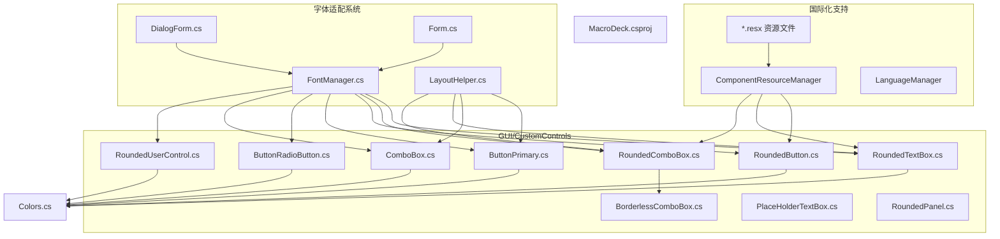

**图表来源**
- [RoundedUserControl.cs:1-87](file://src/MacroDeck/GUI/CustomControls/RoundedUserControl.cs#L1-L87)
- [LayoutHelper.cs:1-105](file://src/MacroDeck/Utils/LayoutHelper.cs#L1-L105)
- [ButtonPrimary.cs:1-269](file://src/MacroDeck/GUI/CustomControls/ButtonPrimary.cs#L1-L269)
- [ComboBox.cs:1-146](file://src/MacroDeck/GUI/CustomControls/ComboBox.cs#L1-L146)
- [RoundedButton.cs:1-263](file://src/MacroDeck/GUI/CustomControls/RoundedButton.cs#L1-L263)
- [RoundedTextBox.cs:1-332](file://src/MacroDeck/GUI/CustomControls/RoundedTextBox.cs#L1-L332)
- [RoundedComboBox.cs:1-230](file://src/MacroDeck/GUI/CustomControls/RoundedComboBox.cs#L1-L230)
- [BorderlessComboBox.cs:1-56](file://src/MacroDeck/GUI/CustomControls/BorderlessComboBox.cs#L1-L56)
- [PlaceHolderTextBox.cs:1-81](file://src/MacroDeck/GUI/CustomControls/PlaceHolderTextBox.cs#L1-L81)
- [RoundedPanel.cs:1-50](file://src/MacroDeck/GUI/CustomControls/RoundedPanel.cs#L1-L50)
- [ButtonRadioButton.cs:1-144](file://src/MacroDeck/GUI/CustomControls/ButtonRadioButton.cs#L1-L144)
- [FontManager.cs:1-227](file://src/MacroDeck/Utils/FontManager.cs#L1-L227)
- [DialogForm.cs:1-42](file://src/MacroDeck/GUI/CustomControls/DialogForm.cs#L1-L42)
- [Form.cs:1-44](file://src/MacroDeck/GUI/CustomControls/Form.cs#L1-L44)
- [Colors.cs:1-15](file://src/MacroDeck/GUI/Colors.cs#L1-L15)
- [MacroDeck.csproj:96-192](file://src/MacroDeck/MacroDeck.csproj#L96-L192)

**章节来源**
- [MacroDeck.csproj:96-192](file://src/MacroDeck/MacroDeck.csproj#L96-L192)

## 核心组件
- 圆角按钮（RoundedButton）
  - 基于 PictureBox，支持背景图、前景标签图、GIF 指示、键盘快捷键指示等复合视觉元素；通过区域裁剪实现圆角；鼠标进入/离开触发重绘与前景切换。
- 圆角文本框（RoundedTextBox）
  - 基于 UserControl，内部含 TextBox；支持占位符、图标、密码字符、自动完成、多行、对齐、最大长度等；通过 GraphicsPath 绘制圆角边框与图标。
- 圆角组合框（RoundedComboBox）
  - 基于 UserControl，内部含 BorderlessComboBox；支持图标、自动完成、下拉样式、选中项变更事件转发；通过 GraphicsPath 绘制圆角边框与图标。
- 边框无框组合框（BorderlessComboBox）
  - 内部 ComboBox 子类，重写 WndProc 移除默认边框与下拉按钮，自绘无边框矩形与自定义下拉三角。
- 占位符文本框（PlaceHolderTextBox）
  - 已标记过时，基于 TextBox 实现占位符逻辑；建议迁移到 RoundedTextBox。
- 圆角面板（RoundedPanel）
  - 基于 Panel，通过 GraphicsPath 与 Region 实现圆角边框与抗锯齿绘制。
- 主按钮（ButtonPrimary）
  - 基于 Button，支持进度条、旋转动画、悬停色、圆角、图标、文本渲染；通过 TextRenderer 绘制文本，具备字体自适应高度计算。
- 圆角单选按钮（ButtonRadioButton）
  - 基于 RadioButton，支持图标、图标对齐、圆角、悬停与选中态颜色；通过 TextRenderer 绘制文本。
- 组合框（ComboBox）
  - 已标记过时，基于 ComboBox，实现圆角绘制与手型光标；具备字体自适应高度计算。
- 圆角用户控件（RoundedUserControl）
  - 新增基类控件，提供圆角边框绘制功能，从8像素半径降低到3像素并增强抗锯齿能力。

**章节来源**
- [RoundedButton.cs:1-263](file://src/MacroDeck/GUI/CustomControls/RoundedButton.cs#L1-L263)
- [RoundedTextBox.cs:1-332](file://src/MacroDeck/GUI/CustomControls/RoundedTextBox.cs#L1-L332)
- [RoundedComboBox.cs:1-230](file://src/MacroDeck/GUI/CustomControls/RoundedComboBox.cs#L1-L230)
- [BorderlessComboBox.cs:1-56](file://src/MacroDeck/GUI/CustomControls/BorderlessComboBox.cs#L1-L56)
- [PlaceHolderTextBox.cs:1-81](file://src/MacroDeck/GUI/CustomControls/PlaceHolderTextBox.cs#L1-L81)
- [RoundedPanel.cs:1-50](file://src/MacroDeck/GUI/CustomControls/RoundedPanel.cs#L1-L50)
- [ButtonPrimary.cs:1-269](file://src/MacroDeck/GUI/CustomControls/ButtonPrimary.cs#L1-L269)
- [ButtonRadioButton.cs:1-144](file://src/MacroDeck/GUI/CustomControls/ButtonRadioButton.cs#L1-L144)
- [ComboBox.cs:1-146](file://src/MacroDeck/GUI/CustomControls/ComboBox.cs#L1-L146)
- [RoundedUserControl.cs:1-87](file://src/MacroDeck/GUI/CustomControls/RoundedUserControl.cs#L1-L87)

## 架构总览
自定义控件遵循"组合 + 重绘"的设计模式：
- 外观与主题：统一从 Colors 获取主题色，控件内部通过 OnPaint 使用 GraphicsPath、Pen、Brush、TextRenderer 完成绘制。
- 行为与事件：控件在构造或生命周期中注册鼠标、键盘、文本变化等事件，必要时转发到外部事件（如 SelectedIndexChanged）。
- 区域与裁剪：通过 GraphicsPath 生成圆角路径，设置 Control.Region，避免非圆角区域被绘制或响应输入。
- 资源与动画：对 GIF/旋转动画进行注册与注销，确保资源释放与避免重复动画。
- 国际化支持：通过 ComponentResourceManager 和资源文件实现多语言本地化，支持运行时语言切换。
- **字体管理**：通过 FontManager 实现全局字体管理，确保所有自定义控件统一应用用户字体偏好。
- **字体自适应**：通过 LayoutHelper 和控件自身的字体属性重写，实现基于字体度量的高度自适应计算。

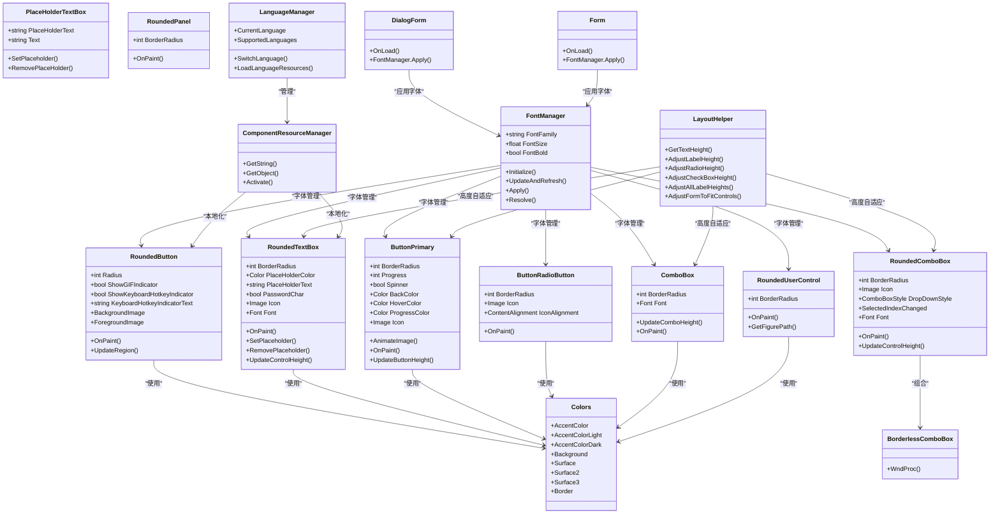

**图表来源**
- [Colors.cs:1-15](file://src/MacroDeck/GUI/Colors.cs#L1-L15)
- [FontManager.cs:1-227](file://src/MacroDeck/Utils/FontManager.cs#L1-L227)
- [LayoutHelper.cs:1-105](file://src/MacroDeck/Utils/LayoutHelper.cs#L1-L105)
- [RoundedButton.cs:1-263](file://src/MacroDeck/GUI/CustomControls/RoundedButton.cs#L1-L263)
- [RoundedTextBox.cs:1-332](file://src/MacroDeck/GUI/CustomControls/RoundedTextBox.cs#L1-L332)
- [RoundedComboBox.cs:1-230](file://src/MacroDeck/GUI/CustomControls/RoundedComboBox.cs#L1-L230)
- [BorderlessComboBox.cs:1-56](file://src/MacroDeck/GUI/CustomControls/BorderlessComboBox.cs#L1-L56)
- [PlaceHolderTextBox.cs:1-81](file://src/MacroDeck/GUI/CustomControls/PlaceHolderTextBox.cs#L1-L81)
- [RoundedPanel.cs:1-50](file://src/MacroDeck/GUI/CustomControls/RoundedPanel.cs#L1-L50)
- [ButtonPrimary.cs:1-269](file://src/MacroDeck/GUI/CustomControls/ButtonPrimary.cs#L1-L269)
- [ButtonRadioButton.cs:1-144](file://src/MacroDeck/GUI/CustomControls/ButtonRadioButton.cs#L1-L144)
- [ComboBox.cs:1-146](file://src/MacroDeck/GUI/CustomControls/ComboBox.cs#L1-L146)
- [RoundedUserControl.cs:1-87](file://src/MacroDeck/GUI/CustomControls/RoundedUserControl.cs#L1-L87)
- [DialogForm.cs:1-42](file://src/MacroDeck/GUI/CustomControls/DialogForm.cs#L1-L42)
- [Form.cs:1-44](file://src/MacroDeck/GUI/CustomControls/Form.cs#L1-L44)

## 详细组件分析

### 圆角按钮（RoundedButton）
- 设计要点
  - 支持背景图（含动画 GIF）与前景标签图分离，前景图用于显示动态标签，背景图用于播放动画。
  - 鼠标进入/离开时切换图像，避免同一图像同时驱动两套动画。
  - 通过 UpdateRegion 缓存 Region，仅在尺寸或半径变化时重建，防止 GDI 泄漏。
  - 支持 GIF 指示与键盘快捷键指示叠加绘制。
  - **双缓冲优化**：启用 OptimizedDoubleBuffer 减少重绘闪烁。
- 关键流程（绘制）
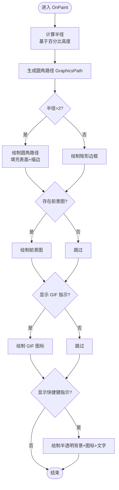

**图表来源**
- [RoundedButton.cs:188-261](file://src/MacroDeck/GUI/CustomControls/RoundedButton.cs#L188-L261)

**章节来源**
- [RoundedButton.cs:1-263](file://src/MacroDeck/GUI/CustomControls/RoundedButton.cs#L1-L263)

### 圆角文本框（RoundedTextBox）
- 设计要点
  - 通过内部 TextBox 承载输入，自身负责绘制圆角边框与图标；占位符逻辑在获得/失去焦点时切换。
  - 支持 PasswordChar、MaxCharacters、ScrollBars、TextAlign、Multiline、AutoComplete 等属性透传。
  - 图标存在时调整 Padding 与高度，保证布局一致。
  - **字体管理**：通过 Font 属性统一管理字体，确保与 FontManager 集成。
  - **高度自适应**：通过 UpdateControlHeight() 基于字体度量自动计算控件高度。
- 关键流程（占位符）
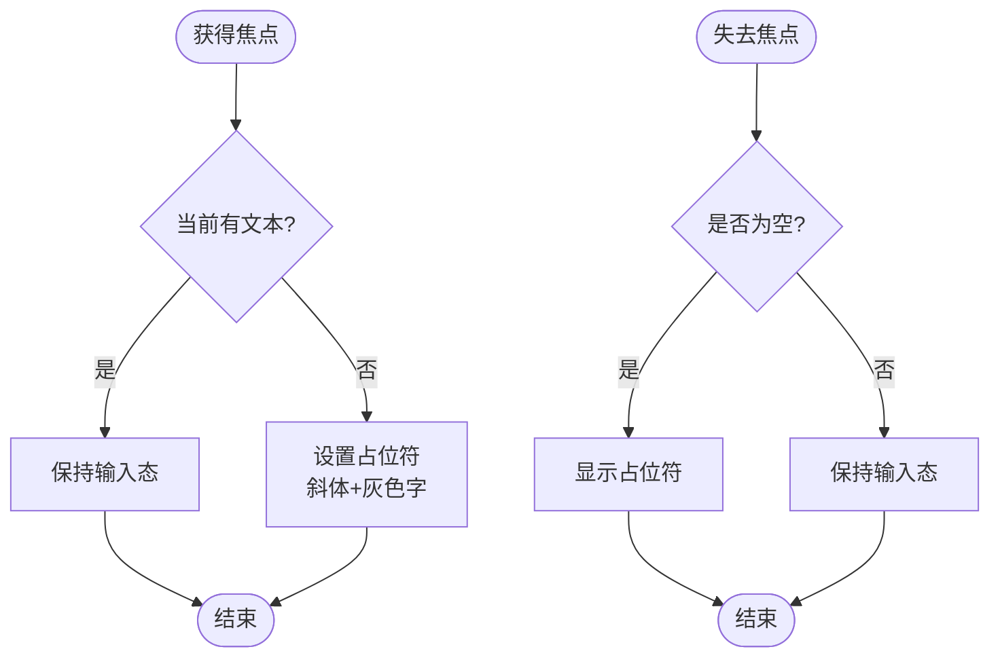

**图表来源**
- [RoundedTextBox.cs:184-212](file://src/MacroDeck/GUI/CustomControls/RoundedTextBox.cs#L184-L212)

**章节来源**
- [RoundedTextBox.cs:1-332](file://src/MacroDeck/GUI/CustomControls/RoundedTextBox.cs#L1-L332)

### 圆角组合框（RoundedComboBox）
- 设计要点
  - 内部组合 BorderlessComboBox，移除原生边框与下拉按钮，自绘圆角边框与下拉三角。
  - 支持 Icon、DropDownStyle、AutoComplete、SelectedIndexChanged 等属性与事件透传。
  - 文本变更与回车插入新项的逻辑在内部处理，确保输入体验与数据一致性。
  - **字体管理**：通过 Font 属性统一管理字体，确保与 FontManager 集成。
  - **高度自适应**：通过 UpdateControlHeight() 基于内部控件高度自动调整。
- 关键流程（回车插入）
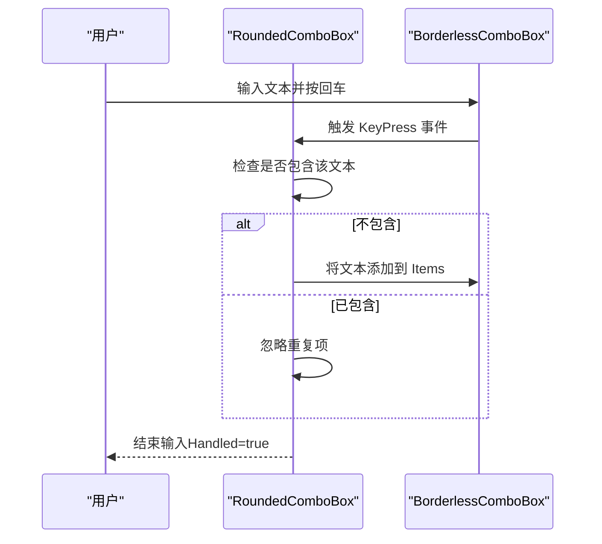

**图表来源**
- [RoundedComboBox.cs:193-206](file://src/MacroDeck/GUI/CustomControls/RoundedComboBox.cs#L193-L206)

**章节来源**
- [RoundedComboBox.cs:1-230](file://src/MacroDeck/GUI/CustomControls/RoundedComboBox.cs#L1-L230)
- [BorderlessComboBox.cs:1-56](file://src/MacroDeck/GUI/CustomControls/BorderlessComboBox.cs#L1-L56)

### 边框无框组合框（BorderlessComboBox）
- 设计要点
  - 重写 WndProc，在 WM_PAINT 阶段移除默认白边框与下拉按钮区域，绘制自定义三角形下拉按钮。
  - 根据 Enabled 状态调整描边宽度与颜色，提升禁用态辨识度。
- 关键流程（绘制）
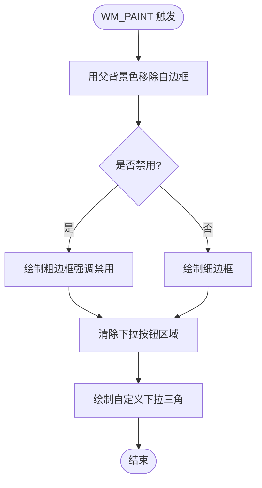

**图表来源**
- [BorderlessComboBox.cs:8-54](file://src/MacroDeck/GUI/CustomControls/BorderlessComboBox.cs#L8-L54)

**章节来源**
- [BorderlessComboBox.cs:1-56](file://src/MacroDeck/GUI/CustomControls/BorderlessComboBox.cs#L1-L56)

### 圆角面板（RoundedPanel）
- 设计要点
  - 基于 Panel，直接在 OnPaint 中绘制圆角路径与抗锯齿边框，适合作为容器承载其他控件。
  - **双缓冲优化**：启用 OptimizedDoubleBuffer 减少重绘闪烁。
- 关键流程（绘制）


**图表来源**
- [RoundedPanel.cs:29-48](file://src/MacroDeck/GUI/CustomControls/RoundedPanel.cs#L29-L48)

**章节来源**
- [RoundedPanel.cs:1-50](file://src/MacroDeck/GUI/CustomControls/RoundedPanel.cs#L1-L50)

### 主按钮（ButtonPrimary）
- 设计要点
  - 支持进度条、旋转动画、悬停色、圆角、图标与文本渲染；通过 TextRenderer 居中绘制文本。
  - 支持 UseWindowsAccentColor 控制是否使用系统强调色。
  - **字体管理**：通过 FontManager 初始化字体，确保与系统字体设置一致。
  - **字体自适应**：重写 Font 属性，基于字体度量自动重算按钮最小高度。
  - **双缓冲优化**：启用 OptimizedDoubleBuffer 和 DoubleBuffered 减少闪烁。
- 关键流程（绘制与动画）
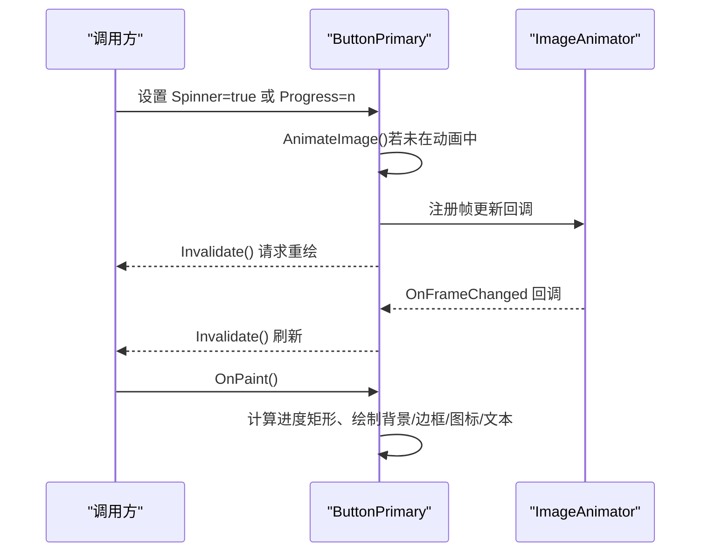

**图表来源**
- [ButtonPrimary.cs:34-54](file://src/MacroDeck/GUI/CustomControls/ButtonPrimary.cs#L34-L54)
- [ButtonPrimary.cs:173-232](file://src/MacroDeck/GUI/CustomControls/ButtonPrimary.cs#L173-L232)

**章节来源**
- [ButtonPrimary.cs:1-269](file://src/MacroDeck/GUI/CustomControls/ButtonPrimary.cs#L1-L269)

### 圆角单选按钮（ButtonRadioButton）
- 设计要点
  - 支持图标与多种对齐方式；根据 Checked/Hover 状态切换填充色；通过 TextRenderer 绘制文本。
  - **字体管理**：通过 Font 属性统一管理字体，确保与 FontManager 集成。
  - **抗锯齿优化**：启用 SmoothingMode.AntiAlias 提升绘制质量。
- 关键流程（绘制）


**图表来源**
- [ButtonRadioButton.cs:79-142](file://src/MacroDeck/GUI/CustomControls/ButtonRadioButton.cs#L79-L142)

**章节来源**
- [ButtonRadioButton.cs:1-144](file://src/MacroDeck/GUI/CustomControls/ButtonRadioButton.cs#L1-L144)

### 占位符文本框（PlaceHolderTextBox）
- 设计要点
  - 已标记过时，建议使用 RoundedTextBox；实现占位符的显示/隐藏与字体样式切换。
- 迁移建议
  - 使用 RoundedTextBox 的 PlaceHolderText/PlaceHolderColor/Icon 等属性替代。

**章节来源**
- [PlaceHolderTextBox.cs:1-81](file://src/MacroDeck/GUI/CustomControls/PlaceHolderTextBox.cs#L1-L81)

### 组合框（ComboBox）
- 设计要点
  - 已标记过时，基于 ComboBox，实现圆角绘制与手型光标；建议使用 RoundedComboBox。
  - **字体管理**：通过 Font 属性统一管理字体，确保与 FontManager 集成。
  - **字体自适应**：重写 Font 属性，基于字体度量自动重算组合框最小高度。
  - **双缓冲优化**：启用 OptimizedDoubleBuffer、AllPaintingInWmPaint、UserPaint。
- 迁移建议
  - 使用 RoundedComboBox 替代，获得更一致的外观与事件模型。

**章节来源**
- [ComboBox.cs:1-146](file://src/MacroDeck/GUI/CustomControls/ComboBox.cs#L1-L146)

### 圆角用户控件（RoundedUserControl）
- 设计要点
  - 新增基类控件，提供圆角边框绘制功能，作为其他圆角控件的基础。
  - **抗锯齿增强**：从8像素边框半径降低到3像素，显著提升边缘平滑度。
  - **双缓冲优化**：启用 OptimizedDoubleBuffer 减少重绘闪烁。
  - **边框平滑**：使用 Parent.BackColor 作为边框颜色，实现与背景的自然融合。
- 关键流程（绘制）
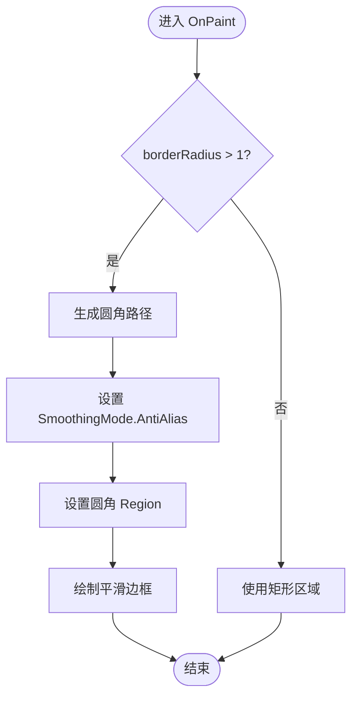

**图表来源**
- [RoundedUserControl.cs:59-85](file://src/MacroDeck/GUI/CustomControls/RoundedUserControl.cs#L59-L85)

**章节来源**
- [RoundedUserControl.cs:1-87](file://src/MacroDeck/GUI/CustomControls/RoundedUserControl.cs#L1-L87)

## 字体自适应高度计算

### 字体度量基础
Macro-Deck 通过精确的字体度量计算确保所有文本控件在不同字体设置下都能正确显示：

- **文本高度测量**：使用 TextRenderer.MeasureText("Ay", control.Font).Height 获取准确的字体高度
- **内边距计算**：在测量基础上增加1px余量，确保文字不会被裁剪
- **控件高度自适应**：根据字体度量动态调整控件高度，避免文本溢出

### ButtonPrimary 字体自适应
ButtonPrimary 通过重写 Font 属性实现智能的高度自适应：

```csharp
public override Font Font
{
    get => base.Font;
    set
    {
        base.Font = value;
        UpdateButtonHeight(); // 自动重算按钮高度
    }
}

private void UpdateButtonHeight()
{
    var textHeight = TextRenderer.MeasureText(Text.Length > 0 ? Text : "Ay", Font).Height + 1;
    var minHeight = textHeight + 12; // 上下各6px padding
    if (Height < minHeight)
    {
        Height = minHeight;
    }
}
```

### ComboBox 字体自适应
ComboBox 通过重写 Font 属性实现下拉框的高度自适应：

```csharp
public override Font Font
{
    get => base.Font;
    set
    {
        base.Font = value;
        UpdateComboHeight(); // 自动重算组合框高度
    }
}

private void UpdateComboHeight()
{
    var textHeight = TextRenderer.MeasureText("Ay", Font).Height + 1;
    var minHeight = textHeight + 8; // 上下各4px padding
    if (Height < minHeight)
    {
        Height = minHeight;
    }
}
```

### 高度自适应流程
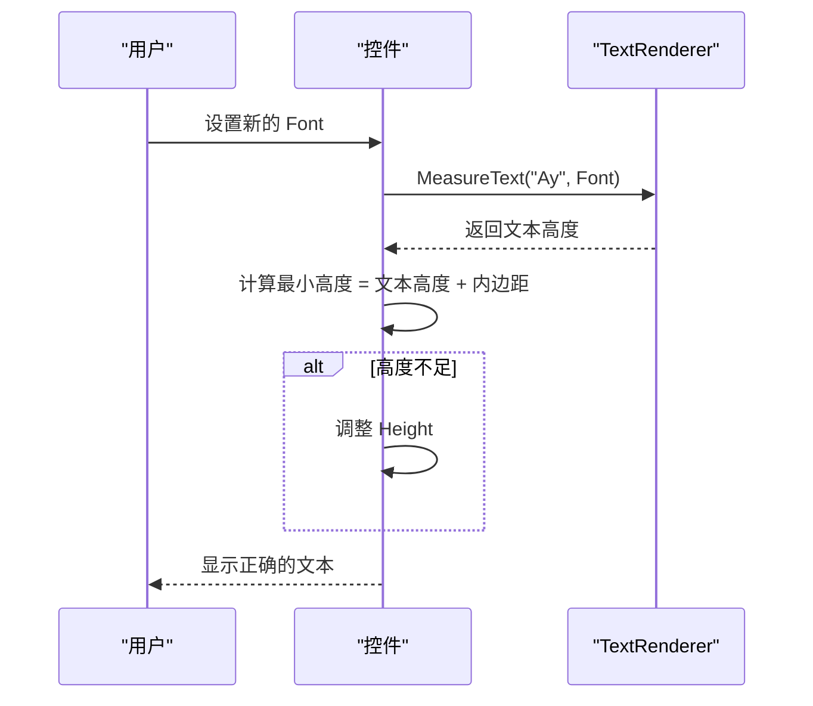

**图表来源**
- [ButtonPrimary.cs:106-133](file://src/MacroDeck/GUI/CustomControls/ButtonPrimary.cs#L106-L133)
- [ComboBox.cs:22-47](file://src/MacroDeck/GUI/CustomControls/ComboBox.cs#L22-L47)

**章节来源**
- [ButtonPrimary.cs:106-133](file://src/MacroDeck/GUI/CustomControls/ButtonPrimary.cs#L106-L133)
- [ComboBox.cs:22-47](file://src/MacroDeck/GUI/CustomControls/ComboBox.cs#L22-L47)

## 字体适配工具类

### LayoutHelper 智能布局系统
LayoutHelper.cs 提供了完整的字体适配解决方案，专门解决 Designer 硬编码 Size 的 WinForms 对话框字体自适应问题：

- **文本高度计算**：GetTextHeight() 使用 "Ay" 字符串获取准确的字体高度
- **控件高度调整**：针对 Label、RadioButton、CheckBox 提供专门的高度自适应方法
- **递归布局遍历**：AdjustAllLabelHeights() 递归遍历所有子控件进行布局调整
- **窗体重算**：AdjustFormToFitControls() 根据控件实际位置动态调整窗体大小

### 标签控件自适应
```csharp
public static void AdjustLabelHeight(Label label)
{
    var min = GetTextHeight(label) + 4; // 文本高度 + 4px padding
    if (label.Height < min) label.Height = min;
}

public static void AdjustRadioHeight(RadioButton radio)
{
    var min = GetTextHeight(radio) + 4;
    if (radio.Height < min) radio.Height = min;
}

public static void AdjustCheckBoxHeight(CheckBox checkBox)
{
    var min = GetTextHeight(checkBox) + 4;
    if (checkBox.Height < min) checkBox.Height = min;
}
```

### 递归布局调整
```csharp
public static void AdjustAllLabelHeights(Control root)
{
    AdjustRecursive(root);

    static void AdjustRecursive(Control control)
    {
        if (control.Tag as string == "no-font") return; // 跳过特殊标记的控件

        switch (control)
        {
            case Label label when !label.AutoSize:
                AdjustLabelHeight(label);
                break;
            case RadioButton radio when !radio.AutoSize:
                AdjustRadioHeight(radio);
                break;
            case CheckBox checkBox when !checkBox.AutoSize:
                AdjustCheckBoxHeight(checkBox);
                break;
        }

        foreach (Control child in control.Controls)
            AdjustRecursive(child);
    }
}
```

### 窗体重算机制
```csharp
public static void AdjustFormToFitControls(Form form, Size originalClientSize, int margin = 12)
{
    var maxRight = originalClientSize.Width - margin;
    var maxBottom = originalClientSize.Height - margin;

    foreach (Control control in form.Controls)
    {
        if (!control.Visible) continue;
        maxRight = Math.Max(maxRight, control.Right);
        maxBottom = Math.Max(maxBottom, control.Bottom);
    }

    var newWidth = Math.Max(originalClientSize.Width, maxRight + margin);
    var newHeight = Math.Max(originalClientSize.Height, maxBottom + margin);
    form.ClientSize = new Size(newWidth, newHeight);
}
```

### 使用模式
在对话框的 OnLoad 中使用 LayoutHelper 的标准流程：

```csharp
protected override void OnLoad(EventArgs e)
{
    base.OnLoad(e);
    FontManager.Apply(this); // 先应用字体
    LayoutHelper.AdjustLabelsAndButtons(this); // 调整标签和按钮
    LayoutHelper.AdjustFormSize(this, originalSize); // 调整窗体大小
}
```

**章节来源**
- [LayoutHelper.cs:1-105](file://src/MacroDeck/Utils/LayoutHelper.cs#L1-L105)

## 字体一致性改进

### FontManager 全局字体管理
Macro-Deck 通过 FontManager 实现全局字体管理，确保所有自定义控件都尊重用户的字体偏好：

- **字体配置初始化**：FontManager.Initialize() 根据配置文件初始化字体族、字号与粗体设置
- **实时字体刷新**：FontManager.UpdateAndRefresh() 支持运行时实时更新字体设置
- **控件树递归应用**：FontManager.Apply() 递归遍历控件树，统一应用字体设置
- **原始字体缓存**：使用 ConditionalWeakTable 缓存每个控件的原始字体，支持幂等重算

### 自定义控件字体集成
所有自定义控件都通过 Font 属性实现字体的一致性管理：

- **RoundedTextBox 字体管理**：重写 Font 属性，同步更新内部 TextBox 的字体
- **RoundedComboBox 字体管理**：重写 Font 属性，同步更新内部 BorderlessComboBox 的字体
- **ButtonPrimary 字体管理**：通过 FontManager.FontFamily 确保按钮文本使用统一字体
- **ButtonRadioButton 字体管理**：继承基类 Font 属性，自动应用全局字体设置
- **RoundedUserControl 字体管理**：通过 Font 属性统一管理字体，确保与 FontManager 集成

### 字体应用流程
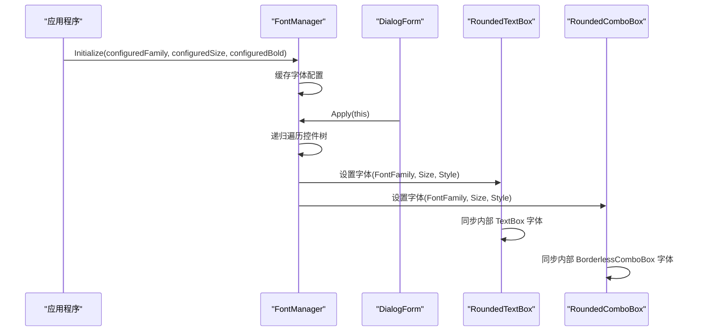

**图表来源**
- [FontManager.cs:50-89](file://src/MacroDeck/Utils/FontManager.cs#L50-L89)
- [DialogForm.cs:14-18](file://src/MacroDeck/GUI/CustomControls/DialogForm.cs#L14-L18)
- [RoundedTextBox.cs:108-117](file://src/MacroDeck/GUI/CustomControls/RoundedTextBox.cs#L108-L117)
- [RoundedComboBox.cs:85-94](file://src/MacroDeck/GUI/CustomControls/RoundedComboBox.cs#L85-L94)

### 字体配置与使用示例
- **早期字体设置**：FontManager.SetDefaultFontEarly() 在程序启动前设置默认字体
- **运行时字体更新**：FontManager.UpdateAndRefresh() 实时刷新所有已打开窗口的字体
- **控件字体应用**：在窗体 OnLoad 事件中调用 FontManager.Apply(this) 应用字体设置

**章节来源**
- [FontManager.cs:16-227](file://src/MacroDeck/Utils/FontManager.cs#L16-L227)
- [DialogForm.cs:14-18](file://src/MacroDeck/GUI/CustomControls/DialogForm.cs#L14-L18)
- [Form.cs:14-18](file://src/MacroDeck/GUI/CustomControls/Form.cs#L14-L18)
- [RoundedTextBox.cs:108-117](file://src/MacroDeck/GUI/CustomControls/RoundedTextBox.cs#L108-L117)
- [RoundedComboBox.cs:85-94](file://src/MacroDeck/GUI/CustomControls/RoundedComboBox.cs#L85-L94)

## 国际化与本地化支持

### 资源文件管理
Macro-Deck 采用标准的 .resx 资源文件实现多语言本地化，所有控件和对话框都支持动态语言切换：

- **控件级资源**：每个自定义控件都有对应的 .resx 文件，包含控件特有的标签、按钮文本和提示信息
- **对话框资源**：ActionConfigurator、DeviceConfigurator、TemplateEditor 等主要对话框都有独立的资源文件
- **插件配置资源**：SetBrightnessActionConfigView 等插件特定控件也实现了本地化支持

### 组件资源管理器集成
控件通过 ComponentResourceManager 实现资源的动态加载和语言切换：

```csharp
// 资源管理器初始化
ComponentResourceManager resources = new ComponentResourceManager(typeof(TemplateEditor));

// 动态获取本地化字符串
template.Hotkeys = resources.GetString("template.Hotkeys");
btnOk.Text = resources.GetString("Ok");
```

### 支持的语言类型
系统支持以下语言的完整本地化：
- 中文（简体）
- 英语
- 德语
- 法语
- 西班牙语
- 俄语
- 日语
- 韩语
- 其他 10 种语言

### 本地化最佳实践
- **资源键命名规范**：使用控件名+属性名的层级命名，如 "TemplateEditor.OkButton"
- **占位符支持**：模板引擎支持动态参数替换
- **文本方向适配**：支持从右到左语言的镜像布局
- **日期时间格式**：根据地区设置自动格式化

### 动态语言切换机制
```csharp
// 语言切换流程
LanguageManager.SwitchLanguage(newLanguage);
ComponentResourceManager.Activate();
RefreshAllControls();
```

**章节来源**
- [SetBrightnessActionConfigView.resx:1-60](file://src/MacroDeck/InternalPlugins/DevicePlugin/Views/SetBrightnessActionConfigView.resx#L1-L60)
- [TemplateEditor.resx:120-126](file://src/MacroDeck/GUI/Dialogs/TemplateEditor.resx#L120-L126)
- [ActionConfigurator.resx:1-60](file://src/MacroDeck/GUI/Dialogs/ActionConfigurator.resx#L1-L60)
- [DeviceConfigurator.resx:1-60](file://src/MacroDeck/GUI/Dialogs/DeviceConfigurator.resx#L1-L60)
- [IconSelector.resx:1-60](file://src/MacroDeck/GUI/Dialogs/IconSelector.resx#L1-L60)
- [CreateIconPack.resx:1-120](file://src/MacroDeck/GUI/Dialogs/CreateIconPack.resx#L1-L120)
- [UpdateAvailableDialog.resx:1-120](file://src/MacroDeck/GUI/Dialogs/UpdateAvailableDialog.resx#L1-L120)
- [LicenseItem.resx:1-60](file://src/MacroDeck/GUI/CustomControls/Settings/LicenseItem.resx#L1-L60)

## 依赖关系分析
- 主题与颜色
  - 所有圆角控件均依赖 Colors 提供的主题色，保证全局风格一致。
- 继承与组合
  - RoundedComboBox 组合 BorderlessComboBox；RoundedButton/RoundedTextBox/RoundedPanel/ButtonPrimary/ButtonRadioButton/ComboBox/RoundedUserControl 等各自继承对应基类并在 OnPaint 中实现圆角绘制。
- 事件与属性透传
  - RoundedComboBox 将内部控件的 SelectedIndexChanged、TextChanged、GotFocus/LostFocus 等事件向上转发，便于上层逻辑订阅。
- 资源与动画
  - RoundedButton 对 GIF 动画进行注册/注销；ButtonPrimary 对旋转动画进行注册/更新帧；均在 Dispose 中清理资源，避免泄漏。
- 国际化依赖
  - 所有控件通过 ComponentResourceManager 实现本地化，LanguageManager 管理语言切换。
- **字体管理依赖**
  - 所有自定义控件通过 FontManager 实现字体统一管理，DialogForm/Form 在 OnLoad 时调用 FontManager.Apply() 应用字体设置。
- **字体自适应依赖**
  - ButtonPrimary、ComboBox、RoundedTextBox、RoundedComboBox 通过字体度量实现高度自适应。
- **布局辅助依赖**
  - LayoutHelper 为所有控件提供字体适配工具类支持。

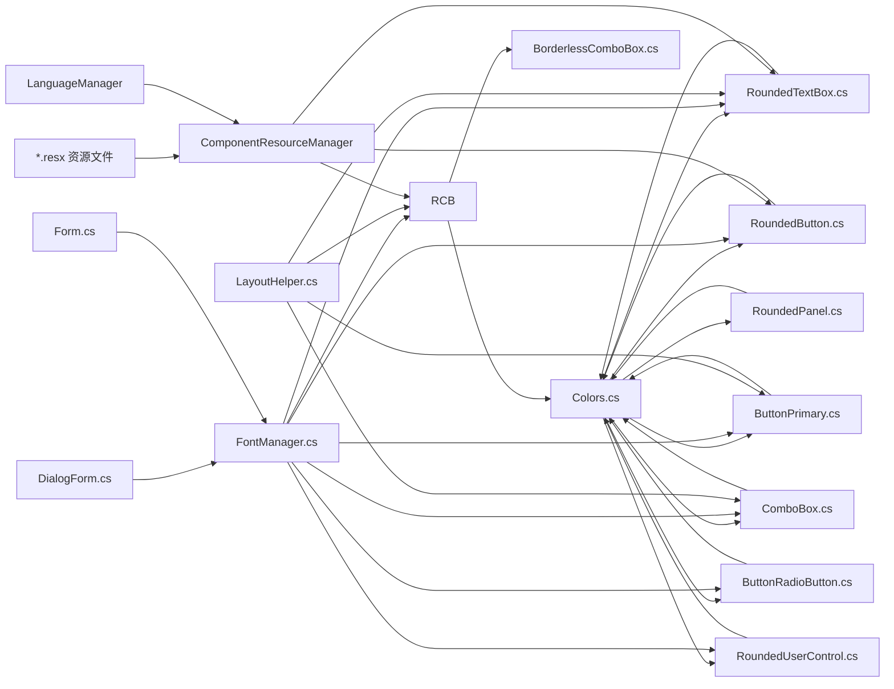

**图表来源**
- [Colors.cs:1-15](file://src/MacroDeck/GUI/Colors.cs#L1-L15)
- [FontManager.cs:1-227](file://src/MacroDeck/Utils/FontManager.cs#L1-L227)
- [LayoutHelper.cs:1-105](file://src/MacroDeck/Utils/LayoutHelper.cs#L1-L105)
- [DialogForm.cs:1-42](file://src/MacroDeck/GUI/CustomControls/DialogForm.cs#L1-L42)
- [Form.cs:1-44](file://src/MacroDeck/GUI/CustomControls/Form.cs#L1-L44)
- [RoundedButton.cs:1-263](file://src/MacroDeck/GUI/CustomControls/RoundedButton.cs#L1-L263)
- [RoundedTextBox.cs:1-332](file://src/MacroDeck/GUI/CustomControls/RoundedTextBox.cs#L1-L332)
- [RoundedComboBox.cs:1-230](file://src/MacroDeck/GUI/CustomControls/RoundedComboBox.cs#L1-L230)
- [BorderlessComboBox.cs:1-56](file://src/MacroDeck/GUI/CustomControls/BorderlessComboBox.cs#L1-L56)
- [RoundedPanel.cs:1-50](file://src/MacroDeck/GUI/CustomControls/RoundedPanel.cs#L1-L50)
- [ButtonPrimary.cs:1-269](file://src/MacroDeck/GUI/CustomControls/ButtonPrimary.cs#L1-L269)
- [ButtonRadioButton.cs:1-144](file://src/MacroDeck/GUI/CustomControls/ButtonRadioButton.cs#L1-L144)
- [ComboBox.cs:1-146](file://src/MacroDeck/GUI/CustomControls/ComboBox.cs#L1-L146)
- [RoundedUserControl.cs:1-87](file://src/MacroDeck/GUI/CustomControls/RoundedUserControl.cs#L1-L87)

**章节来源**
- [Colors.cs:1-15](file://src/MacroDeck/GUI/Colors.cs#L1-L15)
- [FontManager.cs:1-227](file://src/MacroDeck/Utils/FontManager.cs#L1-L227)
- [LayoutHelper.cs:1-105](file://src/MacroDeck/Utils/LayoutHelper.cs#L1-L105)
- [DialogForm.cs:1-42](file://src/MacroDeck/GUI/CustomControls/DialogForm.cs#L1-L42)
- [Form.cs:1-44](file://src/MacroDeck/GUI/CustomControls/Form.cs#L1-L44)
- [RoundedComboBox.cs:1-230](file://src/MacroDeck/GUI/CustomControls/RoundedComboBox.cs#L1-L230)
- [BorderlessComboBox.cs:1-56](file://src/MacroDeck/GUI/CustomControls/BorderlessComboBox.cs#L1-L56)
- [RoundedButton.cs:1-263](file://src/MacroDeck/GUI/CustomControls/RoundedButton.cs#L1-L263)
- [RoundedTextBox.cs:1-332](file://src/MacroDeck/GUI/CustomControls/RoundedTextBox.cs#L1-L332)
- [RoundedPanel.cs:1-50](file://src/MacroDeck/GUI/CustomControls/RoundedPanel.cs#L1-L50)
- [ButtonPrimary.cs:1-269](file://src/MacroDeck/GUI/CustomControls/ButtonPrimary.cs#L1-L269)
- [ButtonRadioButton.cs:1-144](file://src/MacroDeck/GUI/CustomControls/ButtonRadioButton.cs#L1-L144)
- [ComboBox.cs:1-146](file://src/MacroDeck/GUI/CustomControls/ComboBox.cs#L1-L146)
- [RoundedUserControl.cs:1-87](file://src/MacroDeck/GUI/CustomControls/RoundedUserControl.cs#L1-L87)

## 性能与内存优化
- 双缓冲与重绘
  - 多数控件开启 DoubleBuffered 或设置 OptimizedDoubleBuffer，减少闪烁与提高重绘性能。
  - **RoundedUserControl**：从8像素半径降低到3像素，显著减少绘制计算量。
  - **RoundedButton**：启用 OptimizedDoubleBuffer 和 HighQualityBicubic 插值模式。
  - **ButtonPrimary**：双重缓冲优化，避免旋转动画时的闪烁。
- 区域缓存与 GDI 泄漏防护
  - RoundedButton 在 UpdateRegion 中仅在半径或尺寸变化时重建 Region 并复用旧对象，避免频繁创建销毁导致 GDI 泄漏。
- 动画资源管理
  - RoundedButton 对 GIF 动画进行注册/注销；ButtonPrimary 对旋转动画进行注册与帧更新；在 Dispose 中清理，避免重复动画与资源占用。
- 字体与文本渲染
  - 使用 TextRenderer 进行文本绘制，减少 GDI+ 文本测量开销；合理设置 SmoothingMode 与 InterpolationMode。
  - **字体缓存优化**：FontManager 使用 ConditionalWeakTable 缓存原始字体，避免重复计算。
  - **抗锯齿优化**：所有圆角控件启用 SmoothingMode.AntiAlias 提升边缘平滑度。
- 布局与高度自适应
  - RoundedTextBox/RoundedComboBox 在加载或设计时根据字体与多行需求自适应高度，避免额外布局计算。
  - ButtonPrimary/ComboBox 通过字体度量精确计算最小高度，确保文本不被裁剪。
- 资源管理优化
  - ComponentResourceManager 支持资源缓存，避免重复加载相同语言的资源文件。
  - 语言切换时只重新激活必要的控件资源，减少内存占用。
  - **字体刷新优化**：FontManager.UpdateAndRefresh() 仅刷新已打开的窗体，避免影响未使用的控件。
- **布局辅助优化**
  - LayoutHelper 使用递归遍历而非反射，提高性能。
  - AdjustFormToFitControls() 仅在需要时调整窗体大小，避免不必要的重绘。

**章节来源**
- [RoundedButton.cs:90-115](file://src/MacroDeck/GUI/CustomControls/RoundedButton.cs#L90-L115)
- [RoundedButton.cs:150-173](file://src/MacroDeck/GUI/CustomControls/RoundedButton.cs#L150-L173)
- [ButtonPrimary.cs:126-128](file://src/MacroDeck/GUI/CustomControls/ButtonPrimary.cs#L126-L128)
- [ButtonPrimary.cs:40-53](file://src/MacroDeck/GUI/CustomControls/ButtonPrimary.cs#L40-L53)
- [RoundedTextBox.cs:228-239](file://src/MacroDeck/GUI/CustomControls/RoundedTextBox.cs#L228-L239)
- [RoundedComboBox.cs:124-142](file://src/MacroDeck/GUI/CustomControls/RoundedComboBox.cs#L124-L142)
- [RoundedUserControl.cs:19-24](file://src/MacroDeck/GUI/CustomControls/RoundedUserControl.cs#L19-L24)
- [FontManager.cs:20-227](file://src/MacroDeck/Utils/FontManager.cs#L20-L227)
- [LayoutHelper.cs:54-78](file://src/MacroDeck/Utils/LayoutHelper.cs#L54-L78)

## 可访问性与键盘导航

### 键盘交互增强
- **多语言键盘支持**：所有控件的快捷键和热键都通过资源文件本地化，支持不同语言的键盘布局
- **屏幕阅读器兼容**：ButtonPrimary/ButtonRadioButton 支持 AccessibleName/AccessibleDescription 属性设置
- **高对比度支持**：Colors 主题系统支持高对比度模式下的颜色调整
- **字体可访问性**：FontManager 支持用户调整字体大小和粗细，提升可读性
- **抗锯齿优化**：所有圆角控件启用抗锯齿，提升文本清晰度

### 无障碍功能
- **文本本地化**：所有用户可见文本都通过资源文件管理，确保屏幕阅读器正确朗读
- **焦点管理**：TabOrder 和 IsTabStop 属性在设计器中正确设置，支持键盘导航
- **状态描述**：错误状态和验证消息都有对应的本地化文本
- **字体一致性**：所有控件使用统一字体，确保屏幕阅读器正确解析文本内容
- **高度自适应**：字体变化时自动调整控件高度，确保内容完整显示

### 多语言环境适配
- **RTL 语言支持**：界面布局自动适配从右到左的语言（如阿拉伯语、希伯来语）
- **字体选择**：根据不同语言选择合适的字体族，确保字符正确显示
- **文本换行**：根据语言特性调整文本换行和对齐方式
- **字体缩放**：FontManager 支持字体大小调整，满足不同用户的视觉需求

**章节来源**
- [TemplateEditor.Designer.cs:38-84](file://src/MacroDeck/GUI/Dialogs/TemplateEditor.Designer.cs#L38-L84)
- [ActionConfigurator.Designer.cs:47-66](file://src/MacroDeck/GUI/Dialogs/ActionConfigurator.Designer.cs#L47-L66)
- [DeviceConfigurator.Designer.cs:49-69](file://src/MacroDeck/GUI/Dialogs/DeviceConfigurator.Designer.cs#L49-L69)

## 故障排查指南
- **GIF 动画不播放或闪烁**
  - 检查 BackgroundImage 是否为动画 GIF；确认已通过 GifAnimator.Register 注册并在 Dispose 中注销。
- **圆角区域不生效或点击无效**
  - 确认已设置 Region 且未被后续绘制覆盖；检查 UpdateRegion 是否被频繁重建。
- **占位符显示异常**
  - 确认 RoundedTextBox 的 Text 与 PlaceHolderText 逻辑；避免在占位符状态下修改字体样式。
- **下拉框无法输入新值**
  - 检查 RoundedComboBox 的回车插入逻辑与 Items.Contains 判断；确保未被外部拦截。
- **内存增长或卡顿**
  - 检查是否在频繁重绘中创建临时对象；确认 Dispose 中已释放 GDI 资源与取消动画注册。
- **本地化文本显示问题**
  - 检查资源文件是否正确编译；确认 ComponentResourceManager 的资源路径；验证语言包完整性。
- **语言切换失效**
  - 确认 LanguageManager 的 SwitchLanguage 方法调用；检查控件的 Activate 方法是否正确执行。
- **字体显示异常**
  - 检查 FontManager.Initialize() 是否正确调用；确认字体配置文件是否存在且格式正确。
  - 验证 FontManager.Apply() 是否在控件 OnLoad 事件中调用。
  - 检查字体是否已安装，未安装时 FontManager 会回退到默认字体。
- **字体自适应问题**
  - 确认控件的 Font 属性重写是否正常工作；检查 TextRenderer.MeasureText 的返回值。
  - 验证 UpdateButtonHeight()/UpdateComboHeight() 是否在字体变化时被调用。
- **圆角绘制质量问题**
  - 检查 SmoothingMode 是否设置为 AntiAlias；确认 borderRadius 值是否合适。
  - 验证 Parent.BackColor 是否正确用于边框颜色设置。

**章节来源**
- [RoundedButton.cs:17-39](file://src/MacroDeck/GUI/CustomControls/RoundedButton.cs#L17-L39)
- [RoundedButton.cs:96-115](file://src/MacroDeck/GUI/CustomControls/RoundedButton.cs#L96-L115)
- [RoundedTextBox.cs:184-212](file://src/MacroDeck/GUI/CustomControls/RoundedTextBox.cs#L184-L212)
- [RoundedComboBox.cs:193-206](file://src/MacroDeck/GUI/CustomControls/RoundedComboBox.cs#L193-L206)
- [FontManager.cs:50-89](file://src/MacroDeck/Utils/FontManager.cs#L50-L89)
- [ButtonPrimary.cs:106-133](file://src/MacroDeck/GUI/CustomControls/ButtonPrimary.cs#L106-L133)
- [ComboBox.cs:22-47](file://src/MacroDeck/GUI/CustomControls/ComboBox.cs#L22-L47)
- [RoundedUserControl.cs:64-84](file://src/MacroDeck/GUI/CustomControls/RoundedUserControl.cs#L64-L84)

## 结论
Macro-Deck 的自定义控件体系以"圆角 + 抗锯齿 + 主题色"为核心视觉语言，通过 GraphicsPath 与 Region 实现精确裁剪与绘制；以组合（如 RoundedComboBox + BorderlessComboBox）与事件透传实现行为扩展；以双缓冲、区域缓存与动画资源管理保障性能与稳定性。本次重大更新引入了多项重要改进：RoundedUserControl 从8像素边框半径降低到3像素并增强抗锯齿能力，ButtonPrimary 和 ComboBox 通过字体属性重写实现智能的高度自适应计算，新增的 LayoutHelper.cs 提供完整的字体适配工具类，所有自定义控件的 OnPaint 方法都重写以使用双缓冲减少闪烁并实现抗锯齿平滑。新增的字体一致性改进通过 FontManager 实现全局字体管理，确保所有自定义控件都尊重用户的字体偏好，提升了用户体验的一致性和可访问性。国际化支持通过 ComponentResourceManager 和资源文件实现了完整的多语言本地化，支持 12 种语言的动态切换。建议在上层视图中完善键盘导航与可访问性支持，并优先使用 RoundedTextBox/RoundedComboBox 等新一代控件替代过时实现，同时充分利用 FontManager 的字体管理功能、LayoutHelper 的字体适配能力和新增的抗锯齿优化功能提升用户体验。