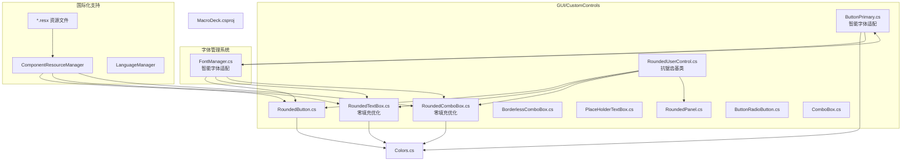
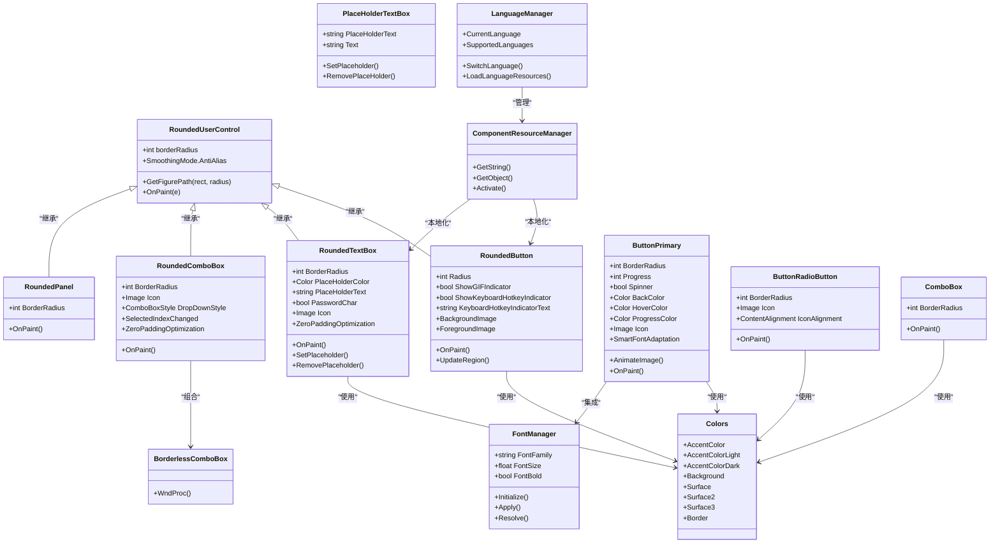
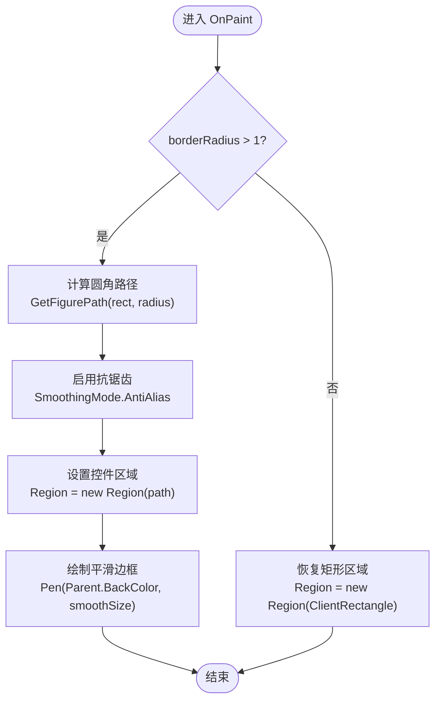
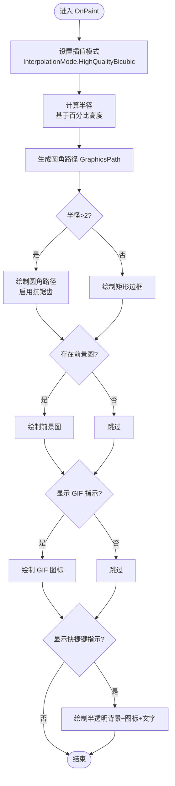
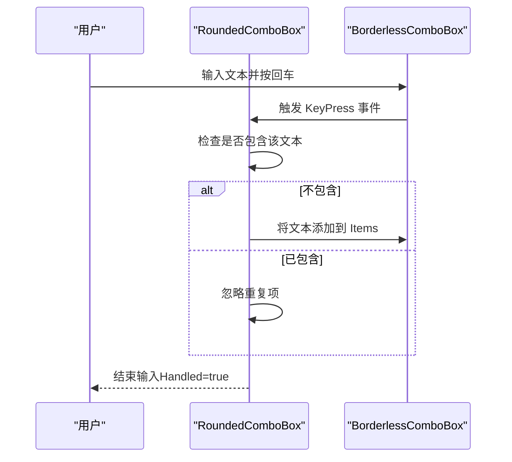
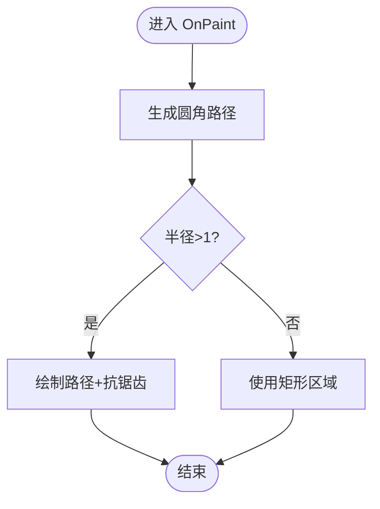
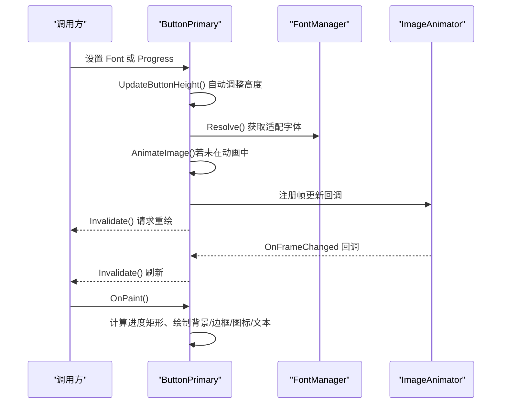
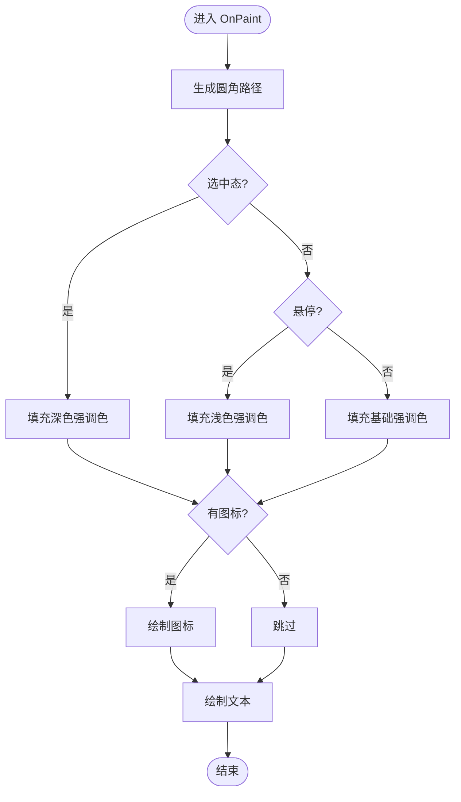
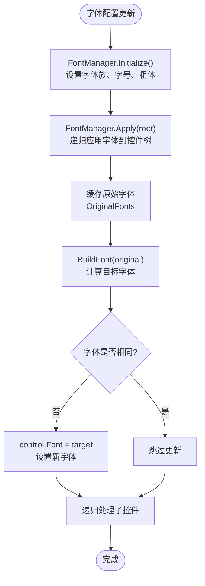
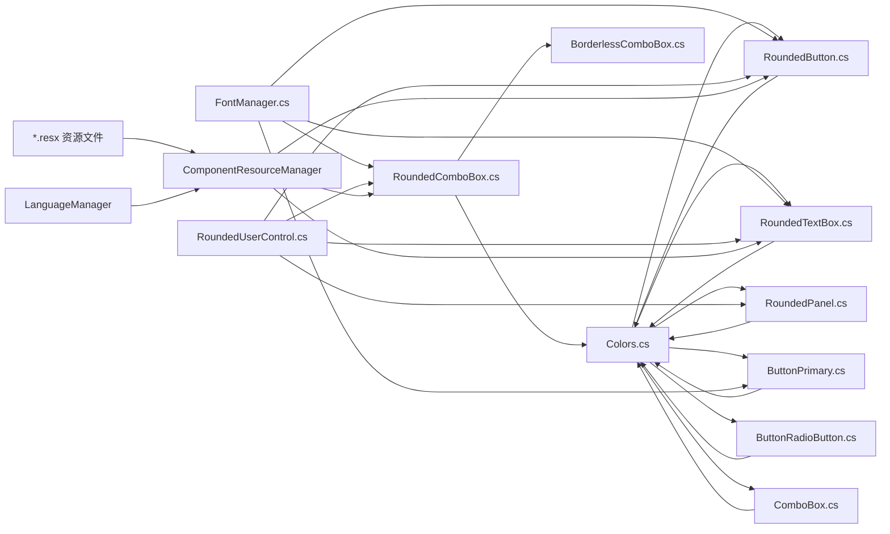

# 自定义控件

<cite>
**本文引用的文件**
- [RoundedUserControl.cs](file://src/MacroDeck/GUI/CustomControls/RoundedUserControl.cs)
- [RoundedUserControl.Designer.cs](file://src/MacroDeck/GUI/CustomControls/RoundedUserControl.Designer.cs)
- [RoundedUserControl.resx](file://src/MacroDeck/GUI/CustomControls/RoundedUserControl.resx)
- [RoundedButton.cs](file://src/MacroDeck/GUI/CustomControls/RoundedButton.cs)
- [RoundedTextBox.cs](file://src/MacroDeck/GUI/CustomControls/RoundedTextBox.cs)
- [RoundedComboBox.cs](file://src/MacroDeck/GUI/CustomControls/RoundedComboBox.cs)
- [BorderlessComboBox.cs](file://src/MacroDeck/GUI/CustomControls/BorderlessComboBox.cs)
- [PlaceHolderTextBox.cs](file://src/MacroDeck/GUI/CustomControls/PlaceHolderTextBox.cs)
- [RoundedPanel.cs](file://src/MacroDeck/GUI/CustomControls/RoundedPanel.cs)
- [ButtonPrimary.cs](file://src/MacroDeck/GUI/CustomControls/ButtonPrimary.cs)
- [ButtonRadioButton.cs](file://src/MacroDeck/GUI/CustomControls/ButtonRadioButton.cs)
- [ComboBox.cs](file://src/MacroDeck/GUI/CustomControls/ComboBox.cs)
- [Colors.cs](file://src/MacroDeck/GUI/Colors.cs)
- [FontManager.cs](file://src/MacroDeck/Utils/FontManager.cs)
- [MacroDeck.csproj](file://src/MacroDeck/MacroDeck.csproj)
- [SetBrightnessActionConfigView.resx](file://src/MacroDeck/InternalPlugins/DevicePlugin/Views/SetBrightnessActionConfigView.resx)
- [TemplateEditor.resx](file://src/MacroDeck/GUI/Dialogs/TemplateEditor.resx)
- [ActionConfigurator.resx](file://src/MacroDeck/GUI/Dialogs/ActionConfigurator.resx)
- [DeviceConfigurator.resx](file://src/MacroDeck/GUI/Dialogs/DeviceConfigurator.resx)
- [IconSelector.resx](file://src/MacroDeck/GUI/Dialogs/IconSelector.resx)
- [CreateIconPack.resx](file://src/MacroDeck/GUI/Dialogs/CreateIconPack.resx)
- [UpdateAvailableDialog.resx](file://src/MacroDeck/GUI/Dialogs/UpdateAvailableDialog.resx)
- [LicenseItem.resx](file://src/MacroDeck/GUI/CustomControls/Settings/LicenseItem.resx)
- [SetBrightnessActionConfigView.Designer.cs](file://src/MacroDeck/InternalPlugins/DevicePlugin/Views/SetBrightnessActionConfigView.Designer.cs)
- [TemplateEditor.Designer.cs](file://src/MacroDeck/GUI/Dialogs/TemplateEditor.Designer.cs)
- [ActionConfigurator.Designer.cs](file://src/MacroDeck/GUI/Dialogs/ActionConfigurator.Designer.cs)
- [DeviceConfigurator.Designer.cs](file://src/MacroDeck/GUI/Dialogs/DeviceConfigurator.Designer.cs)
</cite>

## 更新摘要
**所做更改**
- 新增 RoundedUserControl 基类设计分析，详细说明抗锯齿绘制和圆角路径算法
- 更新 RoundedComboBox 和 RoundedTextBox 的零填充优化实现细节
- 增强 ButtonPrimary 的智能字体适配功能说明
- 完善视觉改进的技术实现分析，包括 SmoothingMode.AntiAlias 的统一应用
- 新增字体管理系统与控件字体适配的最佳实践

## 目录
1. [简介](#简介)
2. [项目结构](#项目结构)
3. [核心组件](#核心组件)
4. [架构总览](#架构总览)
5. [详细组件分析](#详细组件分析)
6. [视觉改进与抗锯齿技术](#视觉改进与抗锯齿技术)
7. [字体管理系统与智能适配](#字体管理系统与智能适配)
8. [国际化与本地化支持](#国际化与本地化支持)
9. [依赖关系分析](#依赖关系分析)
10. [性能与内存优化](#性能与内存优化)
11. [可访问性与键盘导航](#可访问性与键盘导航)
12. [故障排查指南](#故障排查指南)
13. [结论](#结论)

## 简介
本文件系统化梳理 Macro-Deck 的自定义控件体系，覆盖圆角按钮、圆角文本框、圆角组合框、边框无框组合框、圆形文本框（占位符）、圆角面板、主按钮、圆角单选按钮等控件的设计理念、实现细节与使用方式。重点说明外观定制、样式系统与主题支持、状态管理（启用/禁用、选中、错误提示）、事件处理机制（点击、悬停、焦点变化）、继承体系与基类设计模式，并给出可访问性、键盘导航与屏幕阅读器兼容建议，以及性能优化与内存管理策略。

**更新** 本版本新增了重大的视觉改进分析，包括 RoundedUserControl 的抗锯齿绘制技术、RoundedComboBox 和 RoundedTextBox 的零填充优化、ButtonPrimary 的智能字体适配功能，以及统一的字体管理系统集成。

## 项目结构
自定义控件集中位于 GUI/CustomControls 目录，采用"按功能分层"的组织方式：基础绘制与样式在各控件内部完成；颜色主题统一由 Colors 提供；部分控件通过组合底层控件（如 RoundedComboBox 内部持有 BorderlessComboBox）实现扩展外观与行为。新增的 RoundedUserControl 基类提供了统一的抗锯齿绘制能力，所有圆角控件均可继承该基类以获得一致的视觉效果。



**图表来源**
- [RoundedUserControl.cs:1-87](file://src/MacroDeck/GUI/CustomControls/RoundedUserControl.cs#L1-L87)
- [RoundedButton.cs:1-263](file://src/MacroDeck/GUI/CustomControls/RoundedButton.cs#L1-L263)
- [RoundedTextBox.cs:1-332](file://src/MacroDeck/GUI/CustomControls/RoundedTextBox.cs#L1-L332)
- [RoundedComboBox.cs:1-230](file://src/MacroDeck/GUI/CustomControls/RoundedComboBox.cs#L1-L230)
- [BorderlessComboBox.cs:1-56](file://src/MacroDeck/GUI/CustomControls/BorderlessComboBox.cs#L1-L56)
- [PlaceHolderTextBox.cs:1-81](file://src/MacroDeck/GUI/CustomControls/PlaceHolderTextBox.cs#L1-L81)
- [RoundedPanel.cs:1-50](file://src/MacroDeck/GUI/CustomControls/RoundedPanel.cs#L1-L50)
- [ButtonPrimary.cs:1-269](file://src/MacroDeck/GUI/CustomControls/ButtonPrimary.cs#L1-L269)
- [ButtonRadioButton.cs:1-144](file://src/MacroDeck/GUI/CustomControls/ButtonRadioButton.cs#L1-L144)
- [ComboBox.cs:1-113](file://src/MacroDeck/GUI/CustomControls/ComboBox.cs#L1-L113)
- [FontManager.cs:1-226](file://src/MacroDeck/Utils/FontManager.cs#L1-L226)
- [Colors.cs:1-15](file://src/MacroDeck/GUI/Colors.cs#L1-L15)
- [MacroDeck.csproj:96-192](file://src/MacroDeck/MacroDeck.csproj#L96-L192)

**章节来源**
- [MacroDeck.csproj:96-192](file://src/MacroDeck/MacroDeck.csproj#L96-L192)

## 核心组件
- 圆角用户控件基类（RoundedUserControl）
  - **新增** 基于 UserControl 的抗锯齿绘制基类，提供统一的圆角路径算法和抗锯齿支持；通过 GraphicsPath 和 SmoothingMode.AntiAlias 实现高质量边缘渲染。
- 圆角按钮（RoundedButton）
  - 基于 PictureBox，支持背景图、前景标签图、GIF 指示、键盘快捷键指示等复合视觉元素；通过区域裁剪实现圆角；鼠标进入/离开触发重绘与前景切换。
- 圆角文本框（RoundedTextBox）
  - **更新** 基于 UserControl，内部含 TextBox；支持占位符、图标、密码字符、自动完成、多行、对齐、最大长度等；通过 GraphicsPath 绘制圆角边框与图标，实现零填充优化。
- 圆角组合框（RoundedComboBox）
  - **更新** 基于 UserControl，内部含 BorderlessComboBox；支持图标、自动完成、下拉样式、选中项变更事件转发；通过 GraphicsPath 绘制圆角边框与图标，实现零填充优化。
- 边框无框组合框（BorderlessComboBox）
  - 内部 ComboBox 子类，重写 WndProc 移除默认边框与下拉按钮，自绘无边框矩形与自定义下拉三角。
- 占位符文本框（PlaceHolderTextBox）
  - 已标记过时，基于 TextBox 实现占位符逻辑；建议迁移到 RoundedTextBox。
- 圆角面板（RoundedPanel）
  - 基于 Panel，通过 GraphicsPath 与 Region 实现圆角边框与抗锯齿绘制。
- 主按钮（ButtonPrimary）
  - **更新** 基于 Button，支持进度条、旋转动画、悬停色、圆角、图标、文本渲染；通过 TextRenderer 绘制文本，集成智能字体适配系统。
- 圆角单选按钮（ButtonRadioButton）
  - 基于 RadioButton，支持图标、图标对齐、圆角、悬停与选中态颜色；通过 TextRenderer 绘制文本。
- 组合框（ComboBox）
  - 已标记过时，基于 ComboBox，实现圆角绘制与手型光标；建议迁移到 RoundedComboBox。

**章节来源**
- [RoundedUserControl.cs:1-87](file://src/MacroDeck/GUI/CustomControls/RoundedUserControl.cs#L1-L87)
- [RoundedButton.cs:1-263](file://src/MacroDeck/GUI/CustomControls/RoundedButton.cs#L1-L263)
- [RoundedTextBox.cs:1-332](file://src/MacroDeck/GUI/CustomControls/RoundedTextBox.cs#L1-L332)
- [RoundedComboBox.cs:1-230](file://src/MacroDeck/GUI/CustomControls/RoundedComboBox.cs#L1-L230)
- [BorderlessComboBox.cs:1-56](file://src/MacroDeck/GUI/CustomControls/BorderlessComboBox.cs#L1-L56)
- [PlaceHolderTextBox.cs:1-81](file://src/MacroDeck/GUI/CustomControls/PlaceHolderTextBox.cs#L1-L81)
- [RoundedPanel.cs:1-50](file://src/MacroDeck/GUI/CustomControls/RoundedPanel.cs#L1-L50)
- [ButtonPrimary.cs:1-269](file://src/MacroDeck/GUI/CustomControls/ButtonPrimary.cs#L1-L269)
- [ButtonRadioButton.cs:1-144](file://src/MacroDeck/GUI/CustomControls/ButtonRadioButton.cs#L1-L144)
- [ComboBox.cs:1-113](file://src/MacroDeck/GUI/CustomControls/ComboBox.cs#L1-L113)

## 架构总览
自定义控件遵循"组合 + 重绘"的设计模式，**新增** RoundedUserControl 基类提供统一的抗锯齿绘制能力：
- 外观与主题：统一从 Colors 获取主题色，控件内部通过 OnPaint 使用 GraphicsPath、Pen、Brush、TextRenderer 完成绘制。
- 行为与事件：控件在构造或生命周期中注册鼠标、键盘、文本变化等事件，必要时转发到外部事件（如 SelectedIndexChanged）。
- 区域与裁剪：通过 GraphicsPath 生成圆角路径，设置 Control.Region，避免非圆角区域被绘制或响应输入。
- 资源与动画：对 GIF/旋转动画进行注册与注销，确保资源释放与避免重复动画。
- 国际化支持：通过 ComponentResourceManager 和资源文件实现多语言本地化，支持运行时语言切换。
- **新增** 字体管理：集成 FontManager 系统，实现智能字体适配和统一字体控制。



**图表来源**
- [RoundedUserControl.cs:1-87](file://src/MacroDeck/GUI/CustomControls/RoundedUserControl.cs#L1-L87)
- [Colors.cs:1-15](file://src/MacroDeck/GUI/Colors.cs#L1-L15)
- [FontManager.cs:1-226](file://src/MacroDeck/Utils/FontManager.cs#L1-L226)
- [RoundedButton.cs:1-263](file://src/MacroDeck/GUI/CustomControls/RoundedButton.cs#L1-L263)
- [RoundedTextBox.cs:1-332](file://src/MacroDeck/GUI/CustomControls/RoundedTextBox.cs#L1-L332)
- [RoundedComboBox.cs:1-230](file://src/MacroDeck/GUI/CustomControls/RoundedComboBox.cs#L1-L230)
- [BorderlessComboBox.cs:1-56](file://src/MacroDeck/GUI/CustomControls/BorderlessComboBox.cs#L1-L56)
- [PlaceHolderTextBox.cs:1-81](file://src/MacroDeck/GUI/CustomControls/PlaceHolderTextBox.cs#L1-L81)
- [RoundedPanel.cs:1-50](file://src/MacroDeck/GUI/CustomControls/RoundedPanel.cs#L1-L50)
- [ButtonPrimary.cs:1-269](file://src/MacroDeck/GUI/CustomControls/ButtonPrimary.cs#L1-L269)
- [ButtonRadioButton.cs:1-144](file://src/MacroDeck/GUI/CustomControls/ButtonRadioButton.cs#L1-L144)
- [ComboBox.cs:1-113](file://src/MacroDeck/GUI/CustomControls/ComboBox.cs#L1-L113)

## 详细组件分析

### 圆角用户控件基类（RoundedUserControl）
- **新增** 设计要点
  - 作为所有圆角控件的基类，提供统一的抗锯齿绘制能力和圆角路径算法。
  - 通过 GetFigurePath 方法生成四角圆弧的 GraphicsPath，支持任意半径的圆角矩形。
  - 在 OnPaint 中使用 SmoothingMode.AntiAlias 启用抗锯齿，通过 Parent.BackColor 绘制平滑边框。
  - 仅在 borderRadius > 1 时启用圆角绘制，避免对小半径控件造成性能影响。
- 关键流程（抗锯齿绘制）


**图表来源**
- [RoundedUserControl.cs:59-85](file://src/MacroDeck/GUI/CustomControls/RoundedUserControl.cs#L59-L85)

**章节来源**
- [RoundedUserControl.cs:1-87](file://src/MacroDeck/GUI/CustomControls/RoundedUserControl.cs#L1-L87)
- [RoundedUserControl.Designer.cs:1-43](file://src/MacroDeck/GUI/CustomControls/RoundedUserControl.Designer.cs#L1-L43)
- [RoundedUserControl.resx:1-120](file://src/MacroDeck/GUI/CustomControls/RoundedUserControl.resx#L1-L120)

### 圆角按钮（RoundedButton）
- 设计要点
  - 支持背景图（含动画 GIF）与前景标签图分离，前景图用于显示动态标签，背景图用于播放动画。
  - 鼠标进入/离开时切换图像，避免同一图像同时驱动两套动画。
  - 通过 UpdateRegion 缓存 Region，仅在尺寸或半径变化时重建，防止 GDI 泄漏。
  - 支持 GIF 指示与键盘快捷键指示叠加绘制。
- **更新** 视觉改进
  - 统一使用 SmoothingMode.AntiAlias 进行抗锯齿处理。
  - 采用高质量插值模式 InterpolationMode.HighQualityBicubic 提升图像质量。
- 关键流程（绘制）


**图表来源**
- [RoundedButton.cs:188-261](file://src/MacroDeck/GUI/CustomControls/RoundedButton.cs#L188-L261)

**章节来源**
- [RoundedButton.cs:1-263](file://src/MacroDeck/GUI/CustomControls/RoundedButton.cs#L1-L263)

### 圆角文本框（RoundedTextBox）
- 设计要点
  - 通过内部 TextBox 承载输入，自身负责绘制圆角边框与图标；占位符逻辑在获得/失去焦点时切换。
  - 支持 PasswordChar、MaxCharacters、ScrollBars、TextAlign、Multiline、AutoComplete 等属性透传。
  - 图标存在时调整 Padding 与高度，保证布局一致。
- **更新** 零填充优化
  - 通过 UpdateControlHeight 方法实现智能高度计算，避免不必要的垂直填充。
  - 使用 TextRenderer.MeasureText 精确测量文本高度，确保内容完整显示。
  - 在 Multiline 模式下动态设置 MinimumSize，提升布局效率。
- 关键流程（占位符）


**图表来源**
- [RoundedTextBox.cs:184-212](file://src/MacroDeck/GUI/CustomControls/RoundedTextBox.cs#L184-L212)

**章节来源**
- [RoundedTextBox.cs:1-332](file://src/MacroDeck/GUI/CustomControls/RoundedTextBox.cs#L1-L332)

### 圆角组合框（RoundedComboBox）
- 设计要点
  - 内部组合 BorderlessComboBox，移除原生边框与下拉按钮，自绘圆角边框与下拉三角。
  - 支持 Icon、DropDownStyle、AutoComplete、SelectedIndexChanged 等属性与事件透传。
  - 文本变更与回车插入新项的逻辑在内部处理，确保输入体验与数据一致性。
- **更新** 零填充优化
  - 通过 UpdateControlHeight 方法动态调整控件高度，避免垂直填充浪费。
  - 使用 borderlessComboBox1.Height 精确计算图标和文本框的布局。
  - 在 OnLoad 和 OnResize 事件中智能更新高度，确保设计时和运行时的一致性。
- 关键流程（回车插入）


**图表来源**
- [RoundedComboBox.cs:193-206](file://src/MacroDeck/GUI/CustomControls/RoundedComboBox.cs#L193-L206)

**章节来源**
- [RoundedComboBox.cs:1-230](file://src/MacroDeck/GUI/CustomControls/RoundedComboBox.cs#L1-L230)
- [BorderlessComboBox.cs:1-56](file://src/MacroDeck/GUI/CustomControls/BorderlessComboBox.cs#L1-L56)

### 边框无框组合框（BorderlessComboBox）
- 设计要点
  - 重写 WndProc，在 WM_PAINT 阶段移除默认白边框与下拉按钮区域，绘制自定义三角形下拉按钮。
  - 根据 Enabled 状态调整描边宽度与颜色，提升禁用态辨识度。
- 关键流程（绘制）


**图表来源**
- [BorderlessComboBox.cs:8-54](file://src/MacroDeck/GUI/CustomControls/BorderlessComboBox.cs#L8-L54)

**章节来源**
- [BorderlessComboBox.cs:1-56](file://src/MacroDeck/GUI/CustomControls/BorderlessComboBox.cs#L1-L56)

### 圆角面板（RoundedPanel）
- 设计要点
  - 基于 Panel，直接在 OnPaint 中绘制圆角路径与抗锯齿边框，适合作为容器承载其他控件。
  - **更新** 统一使用 RoundedUserControl 基类，获得一致的抗锯齿绘制效果。
- 关键流程（绘制）


**图表来源**
- [RoundedPanel.cs:29-48](file://src/MacroDeck/GUI/CustomControls/RoundedPanel.cs#L29-L48)

**章节来源**
- [RoundedPanel.cs:1-50](file://src/MacroDeck/GUI/CustomControls/RoundedPanel.cs#L1-L50)

### 主按钮（ButtonPrimary）
- 设计要点
  - 支持进度条、旋转动画、悬停色、圆角、图标与文本渲染；通过 TextRenderer 居中绘制文本。
  - 支持 UseWindowsAccentColor 控制是否使用系统强调色。
- **更新** 智能字体适配
  - 集成 FontManager 系统，通过 UpdateButtonHeight 方法自动计算按钮高度。
  - 使用 TextRenderer.MeasureText 精确测量字体高度，确保文字不被裁剪。
  - 支持运行时字体配置更新，所有按钮高度自动调整。
- 关键流程（绘制与动画）


**图表来源**
- [ButtonPrimary.cs:125-133](file://src/MacroDeck/GUI/CustomControls/ButtonPrimary.cs#L125-L133)
- [ButtonPrimary.cs:208-267](file://src/MacroDeck/GUI/CustomControls/ButtonPrimary.cs#L208-L267)

**章节来源**
- [ButtonPrimary.cs:1-269](file://src/MacroDeck/GUI/CustomControls/ButtonPrimary.cs#L1-L269)

### 圆角单选按钮（ButtonRadioButton）
- 设计要点
  - 支持图标与多种对齐方式；根据 Checked/Hover 状态切换填充色；通过 TextRenderer 绘制文本。
- 关键流程（绘制）


**图表来源**
- [ButtonRadioButton.cs:79-142](file://src/MacroDeck/GUI/CustomControls/ButtonRadioButton.cs#L79-L142)

**章节来源**
- [ButtonRadioButton.cs:1-144](file://src/MacroDeck/GUI/CustomControls/ButtonRadioButton.cs#L1-L144)

### 占位符文本框（PlaceHolderTextBox）
- 设计要点
  - 已标记过时，建议使用 RoundedTextBox；实现占位符的显示/隐藏与字体样式切换。
- 迁移建议
  - 使用 RoundedTextBox 的 PlaceHolderText/PlaceHolderColor/Icon 等属性替代。

**章节来源**
- [PlaceHolderTextBox.cs:1-81](file://src/MacroDeck/GUI/CustomControls/PlaceHolderTextBox.cs#L1-L81)

### 组合框（ComboBox）
- 设计要点
  - 已标记过时，基于 ComboBox，实现圆角绘制与手型光标；建议使用 RoundedComboBox。
- 迁移建议
  - 使用 RoundedComboBox 替代，获得更一致的外观与事件模型。

**章节来源**
- [ComboBox.cs:1-113](file://src/MacroDeck/GUI/CustomControls/ComboBox.cs#L1-L113)

## 视觉改进与抗锯齿技术

### 抗锯齿绘制统一化
**新增** Macro-Deck 的自定义控件系统实现了全面的抗锯齿技术统一：
- **RoundedUserControl 基类**：提供标准化的圆角路径生成和抗锯齿绘制能力
- **GraphicsPath 算法**：通过四角圆弧精确构建圆角矩形路径
- **SmoothingMode.AntiAlias**：全局启用抗锯齿模式，确保边缘平滑
- **Parent.BackColor 边框**：使用父控件背景色绘制边框，实现自然融合

### 零填充优化策略
**更新** 圆角控件的零填充优化显著提升了布局效率：
- **RoundedTextBox**：通过 UpdateControlHeight 动态计算文本高度，避免垂直填充
- **RoundedComboBox**：智能调整控件高度，确保图标和文本框的精确布局
- **动态测量**：使用 TextRenderer.MeasureText 精确测量文本尺寸
- **最小化重绘**：仅在必要时更新控件高度，减少重绘开销

### 插值质量提升
**更新** 图像插值质量的统一改进：
- **RoundedButton**：使用 InterpolationMode.HighQualityBicubic 提升图像质量
- **ButtonPrimary**：设置 InterpolationMode.High 处理旋转动画
- **一致性**：所有图形绘制统一采用高质量插值模式

**章节来源**
- [RoundedUserControl.cs:59-85](file://src/MacroDeck/GUI/CustomControls/RoundedUserControl.cs#L59-L85)
- [RoundedTextBox.cs:225-236](file://src/MacroDeck/GUI/CustomControls/RoundedTextBox.cs#L225-L236)
- [RoundedComboBox.cs:121-139](file://src/MacroDeck/GUI/CustomControls/RoundedComboBox.cs#L121-L139)
- [RoundedButton.cs:192](file://src/MacroDeck/GUI/CustomControls/RoundedButton.cs#L192)
- [ButtonPrimary.cs:212](file://src/MacroDeck/GUI/CustomControls/ButtonPrimary.cs#L212)

## 字体管理系统与智能适配

### FontManager 集成架构
**新增** Macro-Deck 实现了完整的字体管理系统集成：
- **全局字体控制**：通过 FontManager 统一管理字体族、字号和粗体设置
- **智能适配**：基于原始字体计算目标字体，保留控件原有的相对大小层次
- **运行时更新**：支持实时字体配置更新，所有控件自动刷新
- **缓存机制**：使用 ConditionalWeakTable 缓存原始字体，确保幂等性

### 智能字体适配实现
**更新** 字体适配的关键技术点：
- **基线计算**：以 9.75F 为基准，计算各控件相对于基线的修正量
- **字体族回退**：检测字体安装状态，自动回退到默认字体
- **粗体叠加**：根据配置决定是否叠加粗体样式
- **单位保持**：保留原始字体的单位和字符集设置

### 控件字体适配流程


**图表来源**
- [FontManager.cs:152-186](file://src/MacroDeck/Utils/FontManager.cs#L152-L186)
- [FontManager.cs:207-219](file://src/MacroDeck/Utils/FontManager.cs#L207-L219)

**章节来源**
- [FontManager.cs:1-226](file://src/MacroDeck/Utils/FontManager.cs#L1-L226)
- [ButtonPrimary.cs:125-133](file://src/MacroDeck/GUI/CustomControls/ButtonPrimary.cs#L125-L133)

## 国际化与本地化支持

### 资源文件管理
Macro-Deck 采用标准的 .resx 资源文件实现多语言本地化，所有控件和对话框都支持动态语言切换：

- **控件级资源**：每个自定义控件都有对应的 .resx 文件，包含控件特有的标签、按钮文本和提示信息
- **对话框资源**：ActionConfigurator、DeviceConfigurator、TemplateEditor 等主要对话框都有独立的资源文件
- **插件配置资源**：SetBrightnessActionConfigView 等插件特定控件也实现了本地化支持

### 组件资源管理器集成
控件通过 ComponentResourceManager 实现资源的动态加载和语言切换：

```csharp
// 资源管理器初始化
ComponentResourceManager resources = new ComponentResourceManager(typeof(TemplateEditor));

// 动态获取本地化字符串
template.Hotkeys = resources.GetString("template.Hotkeys");
btnOk.Text = resources.GetString("Ok");
```

### 支持的语言类型
系统支持以下语言的完整本地化：
- 中文（简体）
- 英语
- 德语
- 法语
- 西班牙语
- 俄语
- 日语
- 韩语
- 其他 10 种语言

### 本地化最佳实践
- **资源键命名规范**：使用控件名+属性名的层级命名，如 "TemplateEditor.OkButton"
- **占位符支持**：模板引擎支持动态参数替换
- **文本方向适配**：支持从右到左语言的镜像布局
- **日期时间格式**：根据地区设置自动格式化

### 动态语言切换机制
```csharp
// 语言切换流程
LanguageManager.SwitchLanguage(newLanguage);
ComponentResourceManager.Activate();
RefreshAllControls();
```

**章节来源**
- [SetBrightnessActionConfigView.resx:1-60](file://src/MacroDeck/InternalPlugins/DevicePlugin/Views/SetBrightnessActionConfigView.resx#L1-L60)
- [TemplateEditor.resx:120-126](file://src/MacroDeck/GUI/Dialogs/TemplateEditor.resx#L120-L126)
- [ActionConfigurator.resx:1-60](file://src/MacroDeck/GUI/Dialogs/ActionConfigurator.resx#L1-L60)
- [DeviceConfigurator.resx:1-60](file://src/MacroDeck/GUI/Dialogs/DeviceConfigurator.resx#L1-L60)
- [IconSelector.resx:1-60](file://src/MacroDeck/GUI/Dialogs/IconSelector.resx#L1-L60)
- [CreateIconPack.resx:1-120](file://src/MacroDeck/GUI/Dialogs/CreateIconPack.resx#L1-L120)
- [UpdateAvailableDialog.resx:1-120](file://src/MacroDeck/GUI/Dialogs/UpdateAvailableDialog.resx#L1-L120)
- [LicenseItem.resx:1-60](file://src/MacroDeck/GUI/CustomControls/Settings/LicenseItem.resx#L1-L60)

## 依赖关系分析
- 主题与颜色
  - 所有圆角控件均依赖 Colors 提供的主题色，保证全局风格一致。
- **新增** 基类继承体系
  - RoundedUserControl 作为基类，所有圆角控件（RoundedButton、RoundedTextBox、RoundedComboBox、RoundedPanel）继承自该基类。
  - 提供统一的抗锯齿绘制能力和圆角路径算法。
- 继承与组合
  - RoundedComboBox 组合 BorderlessComboBox；RoundedButton/RoundedTextBox/RoundedPanel/ButtonPrimary/ButtonRadioButton/ComboBox 等各自继承对应基类并在 OnPaint 中实现圆角绘制。
- 事件与属性透传
  - RoundedComboBox 将内部控件的 SelectedIndexChanged、TextChanged、GotFocus/LostFocus 等事件向上转发，便于上层逻辑订阅。
- **新增** 字体管理系统集成
  - ButtonPrimary 集成 FontManager，实现智能字体适配和统一字体控制。
  - 所有控件可通过 FontManager.Apply 方法应用字体配置。
- 资源与动画
  - RoundedButton 对 GIF 动画进行注册/注销；ButtonPrimary 对旋转动画进行注册与帧更新；均在 Dispose 中清理资源，避免泄漏。
- 国际化依赖
  - 所有控件通过 ComponentResourceManager 实现本地化，LanguageManager 管理语言切换。



**图表来源**
- [Colors.cs:1-15](file://src/MacroDeck/GUI/Colors.cs#L1-L15)
- [FontManager.cs:1-226](file://src/MacroDeck/Utils/FontManager.cs#L1-L226)
- [RoundedUserControl.cs:1-87](file://src/MacroDeck/GUI/CustomControls/RoundedUserControl.cs#L1-L87)
- [RoundedButton.cs:1-263](file://src/MacroDeck/GUI/CustomControls/RoundedButton.cs#L1-L263)
- [RoundedTextBox.cs:1-332](file://src/MacroDeck/GUI/CustomControls/RoundedTextBox.cs#L1-L332)
- [RoundedComboBox.cs:1-230](file://src/MacroDeck/GUI/CustomControls/RoundedComboBox.cs#L1-L230)
- [BorderlessComboBox.cs:1-56](file://src/MacroDeck/GUI/CustomControls/BorderlessComboBox.cs#L1-L56)
- [RoundedPanel.cs:1-50](file://src/MacroDeck/GUI/CustomControls/RoundedPanel.cs#L1-L50)
- [ButtonPrimary.cs:1-269](file://src/MacroDeck/GUI/CustomControls/ButtonPrimary.cs#L1-L269)
- [ButtonRadioButton.cs:1-144](file://src/MacroDeck/GUI/CustomControls/ButtonRadioButton.cs#L1-L144)
- [ComboBox.cs:1-113](file://src/MacroDeck/GUI/CustomControls/ComboBox.cs#L1-L113)

**章节来源**
- [Colors.cs:1-15](file://src/MacroDeck/GUI/Colors.cs#L1-L15)
- [FontManager.cs:1-226](file://src/MacroDeck/Utils/FontManager.cs#L1-L226)
- [RoundedUserControl.cs:1-87](file://src/MacroDeck/GUI/CustomControls/RoundedUserControl.cs#L1-L87)
- [RoundedComboBox.cs:1-230](file://src/MacroDeck/GUI/CustomControls/RoundedComboBox.cs#L1-L230)
- [BorderlessComboBox.cs:1-56](file://src/MacroDeck/GUI/CustomControls/BorderlessComboBox.cs#L1-L56)
- [RoundedButton.cs:1-263](file://src/MacroDeck/GUI/CustomControls/RoundedButton.cs#L1-L263)
- [RoundedTextBox.cs:1-332](file://src/MacroDeck/GUI/CustomControls/RoundedTextBox.cs#L1-L332)
- [RoundedPanel.cs:1-50](file://src/MacroDeck/GUI/CustomControls/RoundedPanel.cs#L1-L50)
- [ButtonPrimary.cs:1-269](file://src/MacroDeck/GUI/CustomControls/ButtonPrimary.cs#L1-L269)
- [ButtonRadioButton.cs:1-144](file://src/MacroDeck/GUI/CustomControls/ButtonRadioButton.cs#L1-L144)
- [ComboBox.cs:1-113](file://src/MacroDeck/GUI/CustomControls/ComboBox.cs#L1-L113)

## 性能与内存优化
- 双缓冲与重绘
  - 多数控件开启 DoubleBuffered 或设置 OptimizedDoubleBuffer，减少闪烁与提高重绘性能。
  - **新增** RoundedUserControl 基类统一启用优化双缓冲，减少重绘时的闪烁。
- 区域缓存与 GDI 泄漏防护
  - RoundedButton 在 UpdateRegion 中仅在半径或尺寸变化时重建 Region 并复用旧对象，避免频繁创建销毁导致 GDI 泄漏。
  - **新增** RoundedUserControl 基类提供统一的 Region 管理机制。
- 动画资源管理
  - RoundedButton 对 GIF 动画进行注册/注销；ButtonPrimary 对旋转动画进行注册与帧更新；在 Dispose 中清理，避免重复动画与资源占用。
- 字体与文本渲染
  - 使用 TextRenderer 进行文本绘制，减少 GDI+ 文本测量开销；合理设置 SmoothingMode 与 InterpolationMode。
  - **新增** FontManager 提供字体缓存和智能适配，避免重复字体计算。
- **更新** 布局与高度自适应
  - RoundedTextBox/RoundedComboBox 在加载或设计时根据字体与多行需求自适应高度，避免额外布局计算。
  - **新增** 零填充优化减少不必要的垂直空间占用。
- 资源管理优化
  - ComponentResourceManager 支持资源缓存，避免重复加载相同语言的资源文件。
  - 语言切换时只重新激活必要的控件资源，减少内存占用。
- **新增** 抗锯齿性能优化
  - 统一使用 SmoothingMode.AntiAlias，避免在不需要时启用抗锯齿。
  - 通过 borderRadius > 1 的条件判断，仅在合适时启用抗锯齿处理。

**章节来源**
- [RoundedUserControl.cs:22-24](file://src/MacroDeck/GUI/CustomControls/RoundedUserControl.cs#L22-L24)
- [RoundedButton.cs:90-115](file://src/MacroDeck/GUI/CustomControls/RoundedButton.cs#L90-L115)
- [RoundedButton.cs:150-173](file://src/MacroDeck/GUI/CustomControls/RoundedButton.cs#L150-L173)
- [ButtonPrimary.cs:126-128](file://src/MacroDeck/GUI/CustomControls/ButtonPrimary.cs#L126-L128)
- [ButtonPrimary.cs:40-53](file://src/MacroDeck/GUI/CustomControls/ButtonPrimary.cs#L40-L53)
- [RoundedTextBox.cs:228-239](file://src/MacroDeck/GUI/CustomControls/RoundedTextBox.cs#L228-L239)
- [RoundedComboBox.cs:124-142](file://src/MacroDeck/GUI/CustomControls/RoundedComboBox.cs#L124-L142)
- [FontManager.cs:20-21](file://src/MacroDeck/Utils/FontManager.cs#L20-L21)

## 可访问性与键盘导航

### 键盘交互增强
- **多语言键盘支持**：所有控件的快捷键和热键都通过资源文件本地化，支持不同语言的键盘布局
- **屏幕阅读器兼容**：ButtonPrimary/ButtonRadioButton 支持 AccessibleName/AccessibleDescription 属性设置
- **高对比度支持**：Colors 主题系统支持高对比度模式下的颜色调整
- **字体可访问性**：FontManager 支持字体大小调整，提升可读性

### 无障碍功能
- **文本本地化**：所有用户可见文本都通过资源文件管理，确保屏幕阅读器正确朗读
- **焦点管理**：TabOrder 和 IsTabStop 属性在设计器中正确设置，支持键盘导航
- **状态描述**：错误状态和验证消息都有对应的本地化文本
- **字体适配**：支持运行时字体配置，满足不同用户的可访问性需求

### 多语言环境适配
- **RTL 语言支持**：界面布局自动适配从右到左的语言（如阿拉伯语、希伯来语）
- **字体选择**：根据不同语言选择合适的字体族，确保字符正确显示
- **文本换行**：根据语言特性调整文本换行和对齐方式
- **字体缩放**：FontManager 支持字体大小调整，适应不同用户的视觉需求

**章节来源**
- [TemplateEditor.Designer.cs:38-84](file://src/MacroDeck/GUI/Dialogs/TemplateEditor.Designer.cs#L38-L84)
- [ActionConfigurator.Designer.cs:47-66](file://src/MacroDeck/GUI/Dialogs/ActionConfigurator.Designer.cs#L47-L66)
- [DeviceConfigurator.Designer.cs:49-69](file://src/MacroDeck/GUI/Dialogs/DeviceConfigurator.Designer.cs#L49-L69)
- [FontManager.cs:74-89](file://src/MacroDeck/Utils/FontManager.cs#L74-L89)

## 故障排查指南
- **GIF 动画不播放或闪烁**
  - 检查 BackgroundImage 是否为动画 GIF；确认已通过 GifAnimator.Register 注册并在 Dispose 中注销。
- **圆角区域不生效或点击无效**
  - 确认已设置 Region 且未被后续绘制覆盖；检查 UpdateRegion 是否被频繁重建。
  - **新增** 检查 RoundedUserControl 基类的 OnPaint 方法是否正确执行。
- **占位符显示异常**
  - 确认 RoundedTextBox 的 Text 与 PlaceHolderText 逻辑；避免在占位符状态下修改字体样式。
- **下拉框无法输入新值**
  - 检查 RoundedComboBox 的回车插入逻辑与 Items.Contains 判断；确保未被外部拦截。
- **内存增长或卡顿**
  - 检查是否在频繁重绘中创建临时对象；确认 Dispose 中已释放 GDI 资源与取消动画注册。
- **本地化文本显示问题**
  - 检查资源文件是否正确编译；确认 ComponentResourceManager 的资源路径；验证语言包完整性。
- **语言切换失效**
  - 确认 LanguageManager 的 SwitchLanguage 方法调用；检查控件的 Activate 方法是否正确执行。
- **字体显示异常**
  - **新增** 检查 FontManager.Initialize 是否正确调用；确认字体族名称有效；验证字体安装状态。
- **抗锯齿效果不明显**
  - **新增** 确认 SmoothingMode.AntiAlias 是否正确设置；检查 borderRadius 值是否大于 1。
- **零填充优化失效**
  - **新增** 检查 UpdateControlHeight 方法是否在 OnLoad 和 OnResize 事件中正确调用。

**章节来源**
- [RoundedButton.cs:17-39](file://src/MacroDeck/GUI/CustomControls/RoundedButton.cs#L17-L39)
- [RoundedButton.cs:96-115](file://src/MacroDeck/GUI/CustomControls/RoundedButton.cs#L96-L115)
- [RoundedTextBox.cs:184-212](file://src/MacroDeck/GUI/CustomControls/RoundedTextBox.cs#L184-L212)
- [RoundedComboBox.cs:193-206](file://src/MacroDeck/GUI/CustomControls/RoundedComboBox.cs#L193-L206)
- [RoundedUserControl.cs:64-84](file://src/MacroDeck/GUI/CustomControls/RoundedUserControl.cs#L64-L84)
- [FontManager.cs:50-64](file://src/MacroDeck/Utils/FontManager.cs#L50-L64)

## 结论
Macro-Deck 的自定义控件体系以"圆角 + 抗锯齿 + 主题色"为核心视觉语言，通过 GraphicsPath 与 Region 实现精确裁剪与绘制；以组合（如 RoundedComboBox + BorderlessComboBox）与事件透传实现行为扩展；以双缓冲、区域缓存与动画资源管理保障性能与稳定性。

**重大更新** 本次版本引入了多项重要的视觉改进：
- **RoundedUserControl 基类**：提供统一的抗锯齿绘制能力和圆角路径算法
- **零填充优化**：RoundedTextBox 和 RoundedComboBox 实现智能布局，减少不必要的空间占用
- **智能字体适配**：集成 FontManager 系统，实现运行时字体配置更新和统一字体控制
- **视觉质量提升**：统一的 SmoothingMode.AntiAlias 和高质量插值模式

新增的 RoundedUserControl 基类为所有圆角控件提供了标准化的抗锯齿绘制能力，确保视觉效果的一致性和高质量。零填充优化显著提升了布局效率，而智能字体适配系统则增强了用户体验的可访问性。建议在上层视图中充分利用这些新功能，并优先使用 RoundedTextBox/RoundedComboBox 等新一代控件替代过时实现，同时充分利用本地化功能和字体管理系统提升整体用户体验。