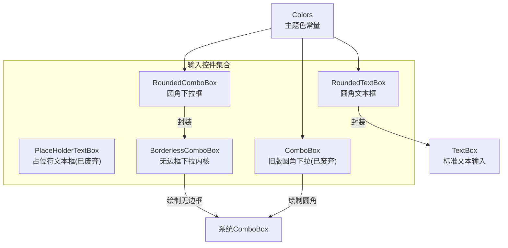
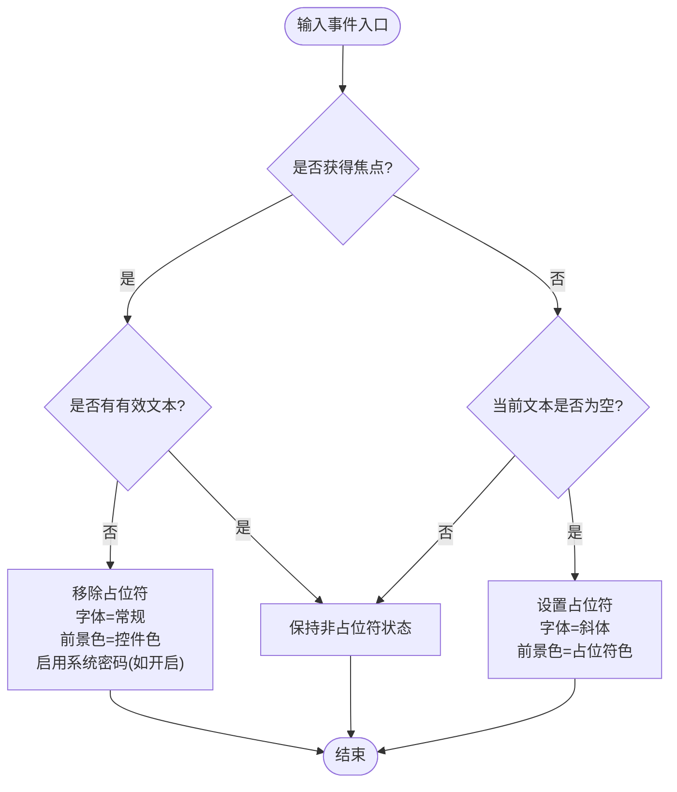
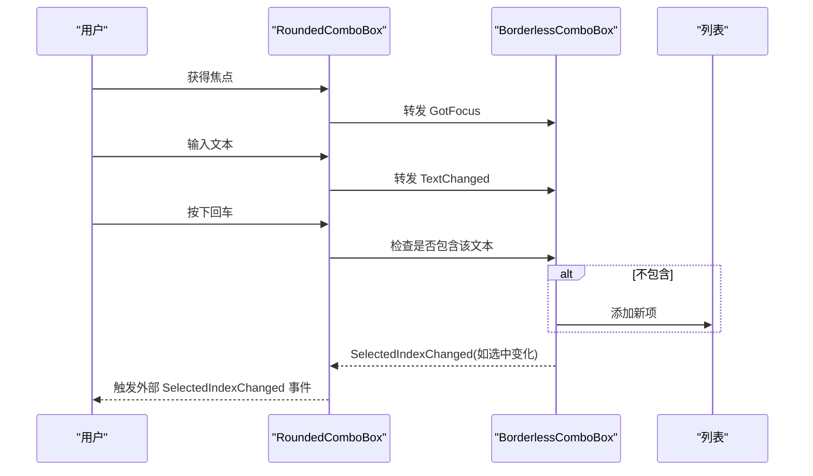
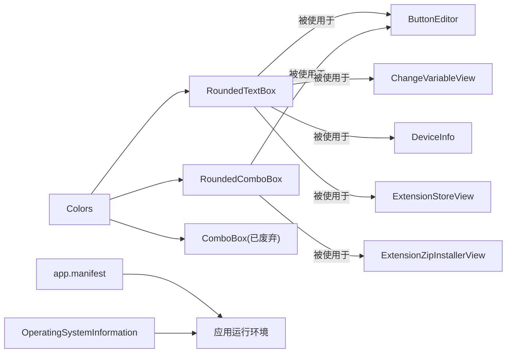

# 输入控件

<cite>
**本文引用的文件**
- [RoundedTextBox.cs](file://src/MacroDeck/GUI/CustomControls/RoundedTextBox.cs)
- [RoundedTextBox.Designer.cs](file://src/MacroDeck/GUI/CustomControls/RoundedTextBox.Designer.cs)
- [PlaceHolderTextBox.cs](file://src/MacroDeck/GUI/CustomControls/PlaceHolderTextBox.cs)
- [PlaceHolderTextBox.Designer.cs](file://src/MacroDeck/GUI/CustomControls/PlaceHolderTextBox.Designer.cs)
- [RoundedComboBox.cs](file://src/MacroDeck/GUI/CustomControls/RoundedComboBox.cs)
- [RoundedComboBox.Designer.cs](file://src/MacroDeck/GUI/CustomControls/RoundedComboBox.Designer.cs)
- [BorderlessComboBox.cs](file://src/MacroDeck/GUI/CustomControls/BorderlessComboBox.cs)
- [ComboBox.cs](file://src/MacroDeck/GUI/CustomControls/ComboBox.cs)
- [Colors.cs](file://src/MacroDeck/GUI/Colors.cs)
- [OperatingSystemInformation.cs](file://src/MacroDeck/Utils/OperatingSystemInformation.cs)
- [app.manifest](file://src/MacroDeck/app.manifest)
- [ButtonEditor.Designer.cs](file://src/MacroDeck/GUI/Dialogs/ButtonEditor.Designer.cs)
- [ChangeVariableValueActionConfigView.Designer.cs](file://src/MacroDeck/InternalPlugins/Variables/Views/ChangeVariableValueActionConfigView.Designer.cs)
- [HotkeySelector.Designer.cs](file://src/MacroDeck/GUI/Dialogs/HotkeySelector.Designer.cs)
- [DeviceInfo.Designer.cs](file://src/MacroDeck/GUI/CustomControls/DeviceInfo.Designer.cs)
- [ExtensionStoreView.Designer.cs](file://src/MacroDeck/GUI/CustomControls/ExtensionsView/ExtensionStoreView.Designer.cs)
- [ExtensionZipInstallerView.Designer.cs](file://src/MacroDeck/GUI/CustomControls/ExtensionsView/ExtensionZipInstallerView.Designer.cs)
</cite>

## 目录
1. [简介](#简介)
2. [项目结构](#项目结构)
3. [核心组件](#核心组件)
4. [架构总览](#架构总览)
5. [详细组件分析](#详细组件分析)
6. [依赖关系分析](#依赖关系分析)
7. [性能考量](#性能考量)
8. [故障排查指南](#故障排查指南)
9. [结论](#结论)
10. [附录](#附录)

## 简介
本文件系统性梳理 Macro-Deck 中的输入控件体系，重点覆盖圆角文本框、占位符文本框与下拉组合框的设计与实现。内容涵盖样式定制（边框圆角、背景色、前景色、字体、对齐）、输入验证（最大字符数、自动完成、密码模式）、交互行为（焦点管理、文本选择、复制粘贴支持、键盘导航）、占位符显示逻辑及跨平台兼容与性能优化策略。

## 项目结构
输入控件主要位于 GUI/CustomControls 命名空间下，采用“外层自绘圆角容器 + 内嵌标准控件”的组合设计：
- 圆角文本框：RoundedTextBox（UserControl 容器 + TextBox 内核）
- 占位符文本框：PlaceHolderTextBox（继承 TextBox 的旧实现，已标记过时）
- 下拉组合框：RoundedComboBox（UserControl 容器 + BorderlessComboBox 内核）



图示来源
- [RoundedTextBox.cs:5-182](file://src/MacroDeck/GUI/CustomControls/RoundedTextBox.cs#L5-L182)
- [RoundedComboBox.cs:9-107](file://src/MacroDeck/GUI/CustomControls/RoundedComboBox.cs#L9-L107)
- [BorderlessComboBox.cs:3-55](file://src/MacroDeck/GUI/CustomControls/BorderlessComboBox.cs#L3-L55)
- [ComboBox.cs:6-35](file://src/MacroDeck/GUI/CustomControls/ComboBox.cs#L6-L35)
- [Colors.cs:3-14](file://src/MacroDeck/GUI/Colors.cs#L3-L14)

章节来源
- [RoundedTextBox.cs:1-335](file://src/MacroDeck/GUI/CustomControls/RoundedTextBox.cs#L1-L335)
- [RoundedComboBox.cs:1-233](file://src/MacroDeck/GUI/CustomControls/RoundedComboBox.cs#L1-L233)
- [BorderlessComboBox.cs:1-56](file://src/MacroDeck/GUI/CustomControls/BorderlessComboBox.cs#L1-L56)
- [PlaceHolderTextBox.cs:1-81](file://src/MacroDeck/GUI/CustomControls/PlaceHolderTextBox.cs#L1-L81)
- [ComboBox.cs:1-113](file://src/MacroDeck/GUI/CustomControls/ComboBox.cs#L1-L113)
- [Colors.cs:1-15](file://src/MacroDeck/GUI/Colors.cs#L1-L15)

## 核心组件
- 圆角文本框 RoundedTextBox
  - 支持图标、多行、滚动条、只读、文本对齐、密码模式、最大字符数、自动完成、占位符文本与颜色、输入变更事件
  - 自绘圆角边框，按父背景色描边，支持图标叠加
- 占位符文本框 PlaceHolderTextBox
  - 已标记为过时，建议使用 RoundedTextBox；提供基础占位符逻辑（获得焦点移除、失焦恢复）
- 圆角下拉组合框 RoundedComboBox
  - 支持图标、自动完成、下拉风格、选中项变更事件；内部以 BorderlessComboBox 实现无边框绘制
- 旧版下拉框 ComboBox
  - 已标记为过时，提供自绘圆角与悬停态绘制

章节来源
- [RoundedTextBox.cs:5-182](file://src/MacroDeck/GUI/CustomControls/RoundedTextBox.cs#L5-L182)
- [PlaceHolderTextBox.cs:3-80](file://src/MacroDeck/GUI/CustomControls/PlaceHolderTextBox.cs#L3-L80)
- [RoundedComboBox.cs:9-107](file://src/MacroDeck/GUI/CustomControls/RoundedComboBox.cs#L9-L107)
- [ComboBox.cs:5-35](file://src/MacroDeck/GUI/CustomControls/ComboBox.cs#L5-L35)

## 架构总览
输入控件通过 UserControl 封装标准 WinForms 控件，并在 OnPaint 中绘制圆角背景与边框，同时转发标准事件（如 TextChanged、GotFocus、LostFocus）。RoundedComboBox 使用 BorderlessComboBox 作为内核，去除系统默认边框与按钮，改由自绘实现。

```mermaid
classDiagram
class RoundedTextBox {
+事件 InputChanged(sender, text)
+属性 Icon
+属性 ScrollBars
+属性 ReadOnly
+属性 TextAlignment
+属性 PasswordChar
+属性 MaxCharacters
+方法 SetAutoCompleteCustomSource()
+方法 SetAutoCompleteMode()
+方法 SetAutoCompleteSource()
+属性 Multiline
+属性 BackColor
+属性 ForeColor
+属性 Font
+属性 Text
+属性 PlaceHolderColor
+属性 PlaceHolderText
+属性 SelectionStart
+方法 Clear()
-字段 borderRadius, placeHolderColor, placeHolderText, isPlaceHolder, isPasswordChar, icon
-方法 SetPlaceholder(), RemovePlaceholder()
-方法 GetFigurePath(rect, radius)
-方法 UpdateControlHeight()
}
class PlaceHolderTextBox {
+属性 PlaceHolderText
+属性 Text
-字段 isPlaceHolder, _placeHolderText
-方法 SetPlaceholder(), RemovePlaceHolder()
}
class RoundedComboBox {
+事件 SelectedIndexChanged
+属性 Icon
+方法 FindStringExact()
+属性 Enabled
+方法 SetAutoCompleteCustomSource()
+方法 SetAutoCompleteMode()
+方法 SetAutoCompleteSource()
+属性 DropDownStyle
+属性 Items
+属性 SelectedIndex
+属性 SelectedItem
+属性 Text
+属性 Font
-字段 borderRadius, icon
-方法 GetFigurePath(rect, radius)
-方法 UpdateControlHeight()
}
class BorderlessComboBox {
-常量 WM_PAINT
-字段 buttonWidth
-方法 WndProc(ref msg)
}
class ComboBox {
+属性 BorderRadius
-字段 _borderRadius, _regionSet, _hover
-方法 GetFigurePath(rect, radius)
-方法 OnPaint(PaintEventArgs)
}
RoundedTextBox --> "封装" TextBox
RoundedComboBox --> BorderlessComboBox
BorderlessComboBox --> "继承" System_Windows_Forms_ComboBox
ComboBox --> "自绘圆角(已废弃)"
```

图示来源
- [RoundedTextBox.cs:5-334](file://src/MacroDeck/GUI/CustomControls/RoundedTextBox.cs#L5-L334)
- [PlaceHolderTextBox.cs:4-80](file://src/MacroDeck/GUI/CustomControls/PlaceHolderTextBox.cs#L4-L80)
- [RoundedComboBox.cs:9-232](file://src/MacroDeck/GUI/CustomControls/RoundedComboBox.cs#L9-L232)
- [BorderlessComboBox.cs:3-55](file://src/MacroDeck/GUI/CustomControls/BorderlessComboBox.cs#L3-L55)
- [ComboBox.cs:6-112](file://src/MacroDeck/GUI/CustomControls/ComboBox.cs#L6-L112)

## 详细组件分析

### 圆角文本框 RoundedTextBox
- 样式定制
  - 背景色/前景色/字体：通过重写 BackColor/ForeColor/Font 同步到内部 TextBox
  - 圆角半径：通过自绘路径绘制圆角边框，边框颜色取自父控件背景色
  - 图标：可设置左侧图标，动态调整内边距与图标位置
  - 对齐：委托给内部 TextBox 的水平对齐属性
- 输入验证
  - 最大字符数：直接映射到 TextBox 的 MaxLength
  - 密码模式：切换 UseSystemPasswordChar；占位符状态下禁用系统密码显示
  - 自动完成：提供三类设置方法，透传至 TextBox
- 交互行为
  - 焦点管理：GotFocus/LostFocus 时切换占位符状态；占位符时不触发 TextChanged
  - 文本选择：SelectionStart 直接委托给 TextBox
  - 复制粘贴：继承自 TextBox，原生支持
  - 键盘导航：TextBox 原生支持
- 占位符逻辑
  - 显示条件：文本为空且设置了占位符文本；字体设为斜体，前景色为占位符颜色
  - 切换时机：获得焦点移除占位符；失焦时若无输入则恢复占位符
- 性能与渲染
  - 双缓冲：构造函数启用双缓冲
  - 设计期高度适配：设计模式下测量文本高度并更新最小尺寸



图示来源
- [RoundedTextBox.cs:184-212](file://src/MacroDeck/GUI/CustomControls/RoundedTextBox.cs#L184-L212)
- [RoundedTextBox.cs:289-328](file://src/MacroDeck/GUI/CustomControls/RoundedTextBox.cs#L289-L328)

章节来源
- [RoundedTextBox.cs:5-182](file://src/MacroDeck/GUI/CustomControls/RoundedTextBox.cs#L5-L182)
- [RoundedTextBox.Designer.cs:35-71](file://src/MacroDeck/GUI/CustomControls/RoundedTextBox.Designer.cs#L35-L71)
- [RoundedTextBox.cs:214-287](file://src/MacroDeck/GUI/CustomControls/RoundedTextBox.cs#L214-L287)
- [RoundedTextBox.cs:289-334](file://src/MacroDeck/GUI/CustomControls/RoundedTextBox.cs#L289-L334)

### 占位符文本框 PlaceHolderTextBox
- 设计定位：已标记为过时，推荐使用 RoundedTextBox
- 行为特征：获得焦点时移除占位符，失焦时若无输入则恢复占位符；文本属性在占位符状态下返回空字符串

章节来源
- [PlaceHolderTextBox.cs:3-80](file://src/MacroDeck/GUI/CustomControls/PlaceHolderTextBox.cs#L3-L80)
- [PlaceHolderTextBox.Designer.cs:32-35](file://src/MacroDeck/GUI/CustomControls/PlaceHolderTextBox.Designer.cs#L32-L35)

### 圆角下拉组合框 RoundedComboBox
- 样式定制
  - 圆角与边框：自绘圆角路径，边框颜色取自父背景色
  - 图标：可设置右侧图标，动态调整内边距
  - 字体：同步到内部 BorderlessComboBox
- 功能特性
  - 下拉风格：支持 DropDownList、DropDown、Simple 等
  - 自动完成：提供三类设置方法，透传至内核
  - 选中项变更：暴露 SelectedIndexChanged 事件
- 交互行为
  - 失焦处理：若输入不在列表中则自动添加该项
  - 回车处理：回车确认输入并阻止默认回车行为
  - 鼠标与键盘：转发 Enter/GotFocus/LostFocus/KeyPress/Click/TextChanged 等事件



图示来源
- [RoundedComboBox.cs:184-231](file://src/MacroDeck/GUI/CustomControls/RoundedComboBox.cs#L184-L231)
- [BorderlessComboBox.cs:8-54](file://src/MacroDeck/GUI/CustomControls/BorderlessComboBox.cs#L8-L54)

章节来源
- [RoundedComboBox.cs:9-107](file://src/MacroDeck/GUI/CustomControls/RoundedComboBox.cs#L9-L107)
- [RoundedComboBox.Designer.cs:35-71](file://src/MacroDeck/GUI/CustomControls/RoundedComboBox.Designer.cs#L35-L71)
- [BorderlessComboBox.cs:3-55](file://src/MacroDeck/GUI/CustomControls/BorderlessComboBox.cs#L3-L55)

### 旧版下拉框 ComboBox 与无边框下拉内核 BorderlessComboBox
- 旧版圆角下拉框 ComboBox
  - 自绘圆角背景与三角形下拉箭头，支持悬停态
- 无边框下拉内核 BorderlessComboBox
  - 重写 WndProc，在 WM_PAINT 中移除系统白边框与默认下拉按钮，改用自绘矩形与三角形

章节来源
- [ComboBox.cs:5-112](file://src/MacroDeck/GUI/CustomControls/ComboBox.cs#L5-L112)
- [BorderlessComboBox.cs:8-54](file://src/MacroDeck/GUI/CustomControls/BorderlessComboBox.cs#L8-L54)

## 依赖关系分析
- 主题与配色
  - Colors 提供统一的主题色（强调色、表面色、边框色），用于控件绘制与状态色
- 平台与 DPI 兼容
  - app.manifest 声明支持 Windows Vista 至 10/11
  - OperatingSystemInformation 提供版本名称解析，便于运行时兼容性判断
- 使用分布
  - 多处对话框与视图中广泛使用 RoundedTextBox/RoundedComboBox，如按钮编辑器、变量配置、设备信息、扩展商店等



图示来源
- [Colors.cs:3-14](file://src/MacroDeck/GUI/Colors.cs#L3-L14)
- [app.manifest:25-45](file://src/MacroDeck/app.manifest#L25-L45)
- [OperatingSystemInformation.cs:3-53](file://src/MacroDeck/Utils/OperatingSystemInformation.cs#L3-L53)
- [ButtonEditor.Designer.cs:153-182](file://src/MacroDeck/GUI/Dialogs/ButtonEditor.Designer.cs#L153-L182)
- [ChangeVariableValueActionConfigView.Designer.cs:110-136](file://src/MacroDeck/InternalPlugins/Variables/Views/ChangeVariableValueActionConfigView.Designer.cs#L110-L136)
- [DeviceInfo.Designer.cs:40-48](file://src/MacroDeck/GUI/CustomControls/DeviceInfo.Designer.cs#L40-L48)
- [ExtensionStoreView.Designer.cs:40-40](file://src/MacroDeck/GUI/CustomControls/ExtensionsView/ExtensionStoreView.Designer.cs#L40-L40)
- [ExtensionZipInstallerView.Designer.cs:38-43](file://src/MacroDeck/GUI/CustomControls/ExtensionsView/ExtensionZipInstallerView.Designer.cs#L38-L43)

章节来源
- [Colors.cs:1-15](file://src/MacroDeck/GUI/Colors.cs#L1-L15)
- [app.manifest:25-52](file://src/MacroDeck/app.manifest#L25-L52)
- [OperatingSystemInformation.cs:1-54](file://src/MacroDeck/Utils/OperatingSystemInformation.cs#L1-L54)
- [ButtonEditor.Designer.cs:153-182](file://src/MacroDeck/GUI/Dialogs/ButtonEditor.Designer.cs#L153-L182)
- [ChangeVariableValueActionConfigView.Designer.cs:110-136](file://src/MacroDeck/InternalPlugins/Variables/Views/ChangeVariableValueActionConfigView.Designer.cs#L110-L136)
- [DeviceInfo.Designer.cs:40-48](file://src/MacroDeck/GUI/CustomControls/DeviceInfo.Designer.cs#L40-L48)
- [ExtensionStoreView.Designer.cs:40-40](file://src/MacroDeck/GUI/CustomControls/ExtensionsView/ExtensionStoreView.Designer.cs#L40-L40)
- [ExtensionZipInstallerView.Designer.cs:38-43](file://src/MacroDeck/GUI/CustomControls/ExtensionsView/ExtensionZipInstallerView.Designer.cs#L38-L43)

## 性能考量
- 渲染优化
  - 所有自绘控件均启用双缓冲，减少闪烁
  - 圆角绘制使用抗锯齿（SmoothingMode.AntiAlias）
- 事件转发
  - 通过事件冒泡将内部控件事件透明转发，避免重复绑定与额外开销
- 文本测量与布局
  - 设计期动态计算文本高度，确保控件尺寸合理
- 自动完成与输入验证
  - 将 MaxLength、AutoComplete 等能力直接委托给底层控件，避免重复实现

章节来源
- [RoundedTextBox.cs:102-120](file://src/MacroDeck/GUI/CustomControls/RoundedTextBox.cs#L102-L120)
- [RoundedComboBox.cs:100-107](file://src/MacroDeck/GUI/CustomControls/RoundedComboBox.cs#L100-L107)
- [ComboBox.cs:23-35](file://src/MacroDeck/GUI/CustomControls/ComboBox.cs#L23-L35)
- [RoundedTextBox.cs:228-248](file://src/MacroDeck/GUI/CustomControls/RoundedTextBox.cs#L228-L248)

## 故障排查指南
- 占位符未正确显示或切换
  - 检查是否设置了占位符文本与颜色
  - 确认未处于密码模式（密码模式下占位符不启用系统密码显示）
  - 确保未手动设置 Text 为占位符文本导致状态异常
- 文本无法输入或被清空
  - 检查是否启用了只读属性
  - 确认最大字符数设置是否过小
- 下拉框失焦后未添加新项
  - 确认 DropDownStyle 是否允许自由输入（如需支持需改为可编辑风格）
  - 检查是否存在同名项导致未添加
- DPI 或高分屏显示异常
  - 确认应用清单与系统 DPI 设置匹配
  - 如出现缩放问题，检查字体与边距设置

章节来源
- [RoundedTextBox.cs:143-166](file://src/MacroDeck/GUI/CustomControls/RoundedTextBox.cs#L143-L166)
- [RoundedTextBox.cs:184-212](file://src/MacroDeck/GUI/CustomControls/RoundedTextBox.cs#L184-L212)
- [RoundedComboBox.cs:184-206](file://src/MacroDeck/GUI/CustomControls/RoundedComboBox.cs#L184-L206)
- [app.manifest:48-52](file://src/MacroDeck/app.manifest#L48-L52)

## 结论
Macro-Deck 的输入控件体系以 RoundedTextBox 与 RoundedComboBox 为核心，结合 Colors 主题与自绘圆角技术，提供了统一、美观且易用的输入体验。占位符逻辑、自动完成与最大字符数等常见需求均已内置，开发者可通过少量属性即可完成样式与行为定制。对于历史控件（如旧版 ComboBox、PlaceHolderTextBox）建议逐步迁移至 RoundedTextBox/RoundedComboBox，以获得更好的维护性与一致性。

## 附录
- 常用属性速览
  - 圆角文本框：Icon、ScrollBars、ReadOnly、TextAlignment、PasswordChar、MaxCharacters、Multiline、PlaceHolderText、PlaceHolderColor、SelectionStart
  - 圆角下拉框：Icon、DropDownStyle、Items、SelectedIndex、SelectedItem、Text、AutoComplete* 方法
- 使用示例分布
  - 按钮编辑器、变量配置、设备信息、扩展商店安装界面等广泛使用上述控件

章节来源
- [ButtonEditor.Designer.cs:153-182](file://src/MacroDeck/GUI/Dialogs/ButtonEditor.Designer.cs#L153-L182)
- [ChangeVariableValueActionConfigView.Designer.cs:110-136](file://src/MacroDeck/InternalPlugins/Variables/Views/ChangeVariableValueActionConfigView.Designer.cs#L110-L136)
- [DeviceInfo.Designer.cs:40-48](file://src/MacroDeck/GUI/CustomControls/DeviceInfo.Designer.cs#L40-L48)
- [ExtensionStoreView.Designer.cs:40-40](file://src/MacroDeck/GUI/CustomControls/ExtensionsView/ExtensionStoreView.Designer.cs#L40-L40)
- [ExtensionZipInstallerView.Designer.cs:38-43](file://src/MacroDeck/GUI/CustomControls/ExtensionsView/ExtensionZipInstallerView.Designer.cs#L38-L43)