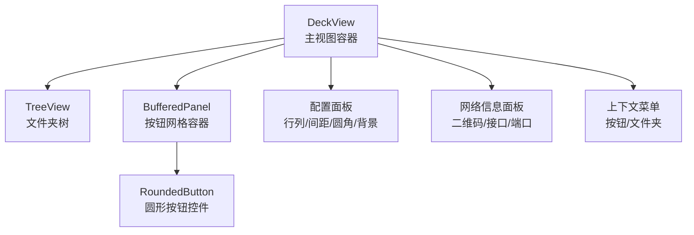
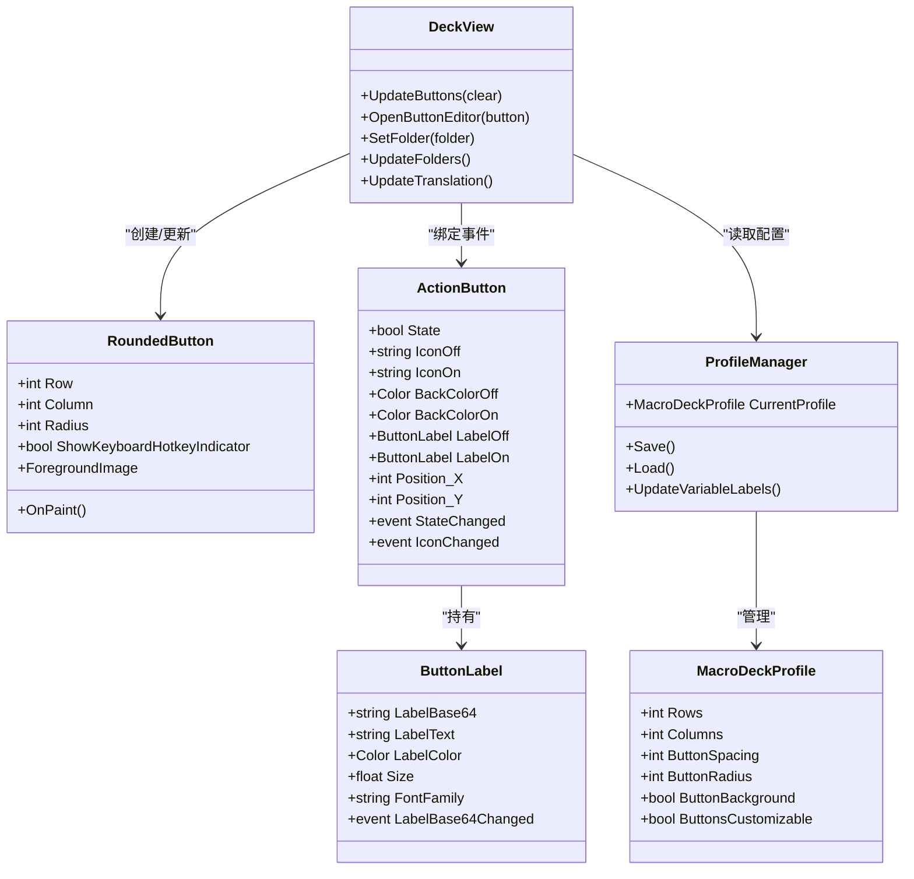
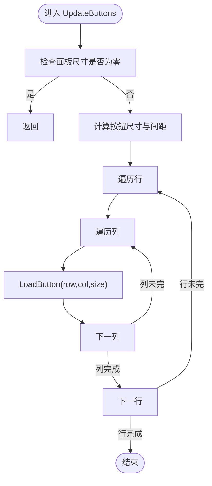
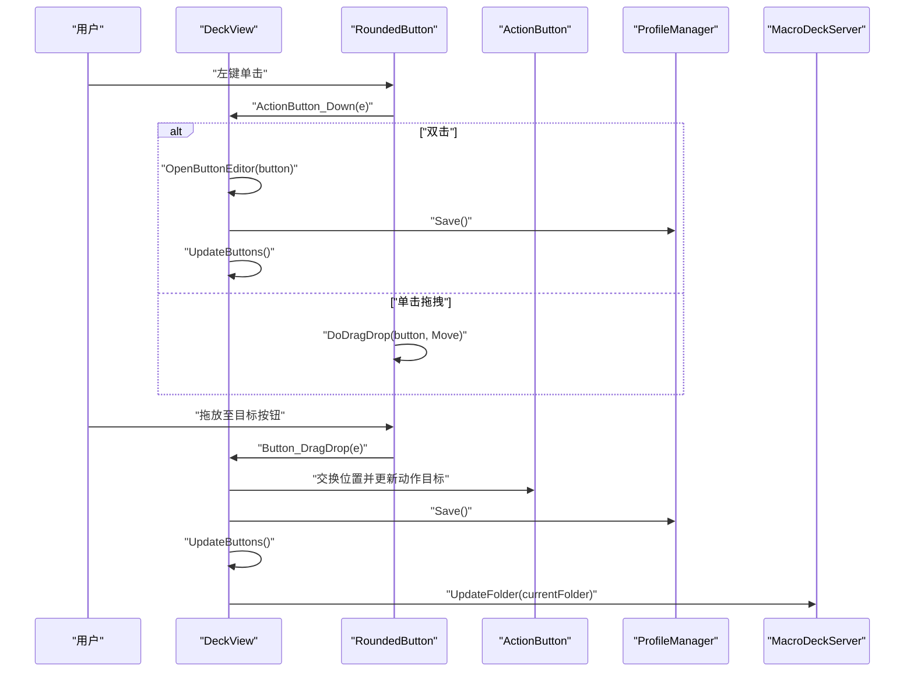
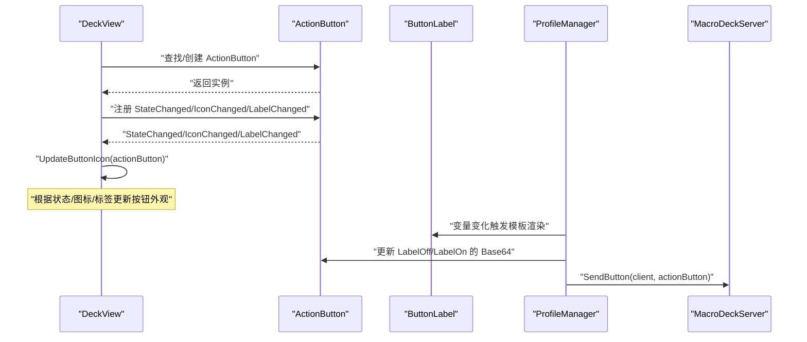
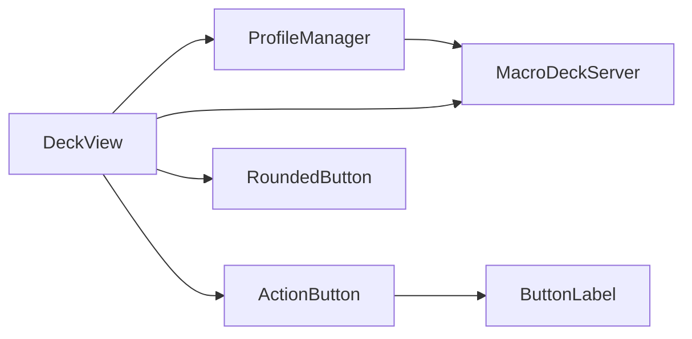

# 仪表板视图

<cite>
**本文引用的文件**
- [DeckView.cs](file://src/MacroDeck/GUI/MainWindowViews/DeckView.cs)
- [DeckView.Designer.cs](file://src/MacroDeck/GUI/MainWindowViews/DeckView.Designer.cs)
- [RoundedButton.cs](file://src/MacroDeck/GUI/CustomControls/RoundedButton.cs)
- [ActionButton.cs](file://src/MacroDeck/ActionButton/ActionButton.cs)
- [ButtonLabel.cs](file://src/MacroDeck/ActionButton/ButtonLabel.cs)
- [ProfileManager.cs](file://src/MacroDeck/Profiles/ProfileManager.cs)
- [MacroDeckProfile.cs](file://src/MacroDeck/Profiles/MacroDeckProfile.cs)
- [ButtonEditor.cs](file://src/MacroDeck/GUI/Dialogs/ButtonEditor.cs)
</cite>

## 目录
1. [简介](#简介)
2. [项目结构](#项目结构)
3. [核心组件](#核心组件)
4. [架构总览](#架构总览)
5. [详细组件分析](#详细组件分析)
6. [依赖关系分析](#依赖关系分析)
7. [性能考虑](#性能考虑)
8. [故障排除指南](#故障排除指南)
9. [结论](#结论)
10. [附录](#附录)

## 简介
本文件面向 Macro-Deck 的“仪表板视图”（DeckView），系统化阐述其核心功能、布局与交互设计、数据绑定机制、响应式与自适应布局、性能优化策略以及用户体验与可访问性支持。该视图负责在主窗口中展示按钮网格、设备状态指示与实时信息，并提供按钮编辑、右键菜单、拖拽重排等交互能力。

## 项目结构
仪表板视图位于主窗口视图层，采用 WinForms 设计，关键组成如下：
- 视图容器：DeckView（用户控件）
- 按钮网格：由 RoundedButton 组成的网格面板
- 文件夹树：左侧文件夹导航树
- 右键菜单：针对按钮与文件夹的操作菜单
- 配置面板：行数、列数、间距、圆角半径、背景开关等
- 实时信息：二维码、网络接口与端口显示

图表来源
- [DeckView.Designer.cs:55-636](file://src/MacroDeck/GUI/MainWindowViews/DeckView.Designer.cs#L55-L636)

章节来源
- [DeckView.Designer.cs:55-636](file://src/MacroDeck/GUI/MainWindowViews/DeckView.Designer.cs#L55-L636)

## 核心组件
- 按钮网格渲染与布局
  - 基于当前配置（行数、列数、间距、圆角）计算每个按钮尺寸与位置，按行列遍历生成或复用 RoundedButton 控件。
  - 在最小化窗口时跳过布局，避免负尺寸导致渲染异常。
- 设备状态与实时信息
  - 展示二维码、网络接口列表与监听端口，便于快速连接与诊断。
- 数据绑定与事件驱动
  - ActionButton 的状态变化、图标变化、标签变化均通过事件触发，视图即时更新按钮外观。
- 交互逻辑
  - 左键双击打开按钮编辑器；左键单击拖拽交换位置；右键弹出上下文菜单。
  - 支持复制/粘贴按钮配置、模拟按键事件、删除按钮等。
- 配置与持久化
  - 通过 ProfileManager 读取/写入配置，保存按钮布局与设置。

章节来源
- [DeckView.cs:143-200](file://src/MacroDeck/GUI/MainWindowViews/DeckView.cs#L143-L200)
- [DeckView.cs:279-360](file://src/MacroDeck/GUI/MainWindowViews/DeckView.cs#L279-L360)
- [DeckView.cs:467-489](file://src/MacroDeck/GUI/MainWindowViews/DeckView.cs#L467-L489)
- [DeckView.cs:729-754](file://src/MacroDeck/GUI/MainWindowViews/DeckView.cs#L729-L754)
- [ProfileManager.cs:205-220](file://src/MacroDeck/Profiles/ProfileManager.cs#L205-L220)

## 架构总览
仪表板视图采用“视图-模型-事件”的架构模式：
- 视图层：DeckView 负责 UI 渲染、事件分发与上下文菜单。
- 模型层：ActionButton 表示单个按钮的配置与状态；MacroDeckProfile 定义布局参数；ProfileManager 提供配置读写与全局事件。
- 事件层：ActionButton 的状态/图标/标签变更通过事件通知视图，视图调用更新方法刷新按钮外观。

图表来源
- [DeckView.cs:24-52](file://src/MacroDeck/GUI/MainWindowViews/DeckView.cs#L24-L52)
- [RoundedButton.cs:7-115](file://src/MacroDeck/GUI/CustomControls/RoundedButton.cs#L7-L115)
- [ActionButton.cs:10-197](file://src/MacroDeck/ActionButton/ActionButton.cs#L10-L197)
- [ButtonLabel.cs:6-61](file://src/MacroDeck/ActionButton/ButtonLabel.cs#L6-L61)
- [ProfileManager.cs:20-31](file://src/MacroDeck/Profiles/ProfileManager.cs#L20-L31)
- [MacroDeckProfile.cs:53-74](file://src/MacroDeck/Profiles/MacroDeckProfile.cs#L53-L74)

## 详细组件分析

### 按钮网格与布局
- 计算规则
  - 根据面板宽高与行列数、间距计算按钮尺寸，取 X/Y 方向最小值再减去间距，确保不溢出。
  - 按行优先顺序遍历，定位按钮位置并设置圆角半径。
- 复用与清理
  - 若已存在对应行列的按钮控件，则直接复用；否则新建并注册事件。
  - 清理时移除事件订阅并释放图像资源，避免内存泄漏。
- 最小化保护
  - 当面板尺寸为零时跳过布局，等待恢复后再更新。

图表来源
- [DeckView.cs:143-200](file://src/MacroDeck/GUI/MainWindowViews/DeckView.cs#L143-L200)
- [DeckView.cs:279-360](file://src/MacroDeck/GUI/MainWindowViews/DeckView.cs#L279-L360)

章节来源
- [DeckView.cs:143-200](file://src/MacroDeck/GUI/MainWindowViews/DeckView.cs#L143-L200)
- [DeckView.cs:279-360](file://src/MacroDeck/GUI/MainWindowViews/DeckView.cs#L279-L360)

### 设备状态指示与实时信息
- 二维码与网络信息
  - 顶部右侧显示二维码与网络接口列表及端口号，便于移动端快速连接与诊断。
- 窗口状态联动
  - 主窗体大小改变或状态变化时触发按钮重新布局，保证布局一致性。

章节来源
- [DeckView.cs:42-46](file://src/MacroDeck/GUI/MainWindowViews/DeckView.cs#L42-L46)
- [DeckView.cs:78-86](file://src/MacroDeck/GUI/MainWindowViews/DeckView.cs#L78-L86)
- [DeckView.Designer.cs:509-555](file://src/MacroDeck/GUI/MainWindowViews/DeckView.Designer.cs#L509-L555)

### 交互逻辑：点击、右键菜单与拖拽
- 左键交互
  - 单击：启动按钮拖拽（移动）。
  - 双击：打开按钮编辑器。
- 右键交互
  - 弹出按钮上下文菜单，包含编辑、复制、粘贴、删除、模拟按下/释放/长按等项。
- 拖拽重排
  - 拖放交换两个按钮的位置，同时更新按钮上的插件动作目标对象，保存并同步到设备。

图表来源
- [DeckView.cs:467-489](file://src/MacroDeck/GUI/MainWindowViews/DeckView.cs#L467-L489)
- [DeckView.cs:511-534](file://src/MacroDeck/GUI/MainWindowViews/DeckView.cs#L511-L534)
- [DeckView.cs:374-447](file://src/MacroDeck/GUI/MainWindowViews/DeckView.cs#L374-L447)

章节来源
- [DeckView.cs:467-489](file://src/MacroDeck/GUI/MainWindowViews/DeckView.cs#L467-L489)
- [DeckView.cs:511-534](file://src/MacroDeck/GUI/MainWindowViews/DeckView.cs#L511-L534)
- [DeckView.cs:374-447](file://src/MacroDeck/GUI/MainWindowViews/DeckView.cs#L374-L447)

### 数据绑定机制：按钮配置的动态加载与更新
- 动态加载
  - 从当前文件夹的 ActionButtons 列表中查找指定行列的按钮，若不存在则创建默认按钮。
- 事件绑定
  - 为按钮注册状态变化、图标变化、标签变化事件，视图收到通知后调用 UpdateButtonIcon 更新外观。
- 标签模板与变量
  - 使用模板引擎渲染标签文本，变量变化时批量更新所有涉及的按钮标签位图并下发到设备。

图表来源
- [DeckView.cs:328-354](file://src/MacroDeck/GUI/MainWindowViews/DeckView.cs#L328-L354)
- [DeckView.cs:202-276](file://src/MacroDeck/GUI/MainWindowViews/DeckView.cs#L202-L276)
- [ProfileManager.cs:156-203](file://src/MacroDeck/Profiles/ProfileManager.cs#L156-L203)
- [ButtonLabel.cs:13-22](file://src/MacroDeck/ActionButton/ButtonLabel.cs#L13-L22)

章节来源
- [DeckView.cs:328-354](file://src/MacroDeck/GUI/MainWindowViews/DeckView.cs#L328-L354)
- [DeckView.cs:202-276](file://src/MacroDeck/GUI/MainWindowViews/DeckView.cs#L202-L276)
- [ProfileManager.cs:156-203](file://src/MacroDeck/Profiles/ProfileManager.cs#L156-L203)
- [ButtonLabel.cs:13-22](file://src/MacroDeck/ActionButton/ButtonLabel.cs#L13-L22)

### 响应式设计与自适应布局
- 自适应尺寸
  - 按钮尺寸随面板尺寸变化而动态调整；最小化时跳过布局，避免负尺寸。
- 配置可定制
  - 行数、列数、间距、圆角半径、背景开关均可通过界面修改，且受设备类型限制（如某些设备不可自定义）。
- 双缓冲与绘制优化
  - 使用 BufferedPanel 承载按钮网格，减少闪烁；RoundedButton 自绘边框与圆角，避免额外控件开销。

章节来源
- [DeckView.cs:181-190](file://src/MacroDeck/GUI/MainWindowViews/DeckView.cs#L181-L190)
- [DeckView.cs:835-865](file://src/MacroDeck/GUI/MainWindowViews/DeckView.cs#L835-L865)
- [MacroDeckProfile.cs:59-73](file://src/MacroDeck/Profiles/MacroDeckProfile.cs#L59-L73)
- [DeckView.Designer.cs:137-144](file://src/MacroDeck/GUI/MainWindowViews/DeckView.Designer.cs#L137-L144)
- [RoundedButton.cs:188-261](file://src/MacroDeck/GUI/CustomControls/RoundedButton.cs#L188-L261)

### 用户体验设计原则
- 直观的编辑入口
  - 双击按钮即可打开编辑器，降低学习成本。
- 明确的状态反馈
  - 状态变化时即时更新背景色与前景标签/图标；键盘热键以视觉指示提示。
- 便捷的上下文操作
  - 右键菜单提供常用操作，启用/禁用状态随按钮是否存在而动态控制。
- 可访问性支持
  - 文本颜色对比度良好，图标与文字结合；键盘热键指示清晰可见。

章节来源
- [DeckView.cs:467-489](file://src/MacroDeck/GUI/MainWindowViews/DeckView.cs#L467-L489)
- [DeckView.cs:741-754](file://src/MacroDeck/GUI/MainWindowViews/DeckView.cs#L741-L754)
- [RoundedButton.cs:238-260](file://src/MacroDeck/GUI/CustomControls/RoundedButton.cs#L238-L260)

## 依赖关系分析
- 视图对模型的依赖
  - DeckView 依赖 ProfileManager 获取当前配置与文件夹中的 ActionButtons。
  - ActionButton 提供状态、图标、标签等属性与事件，驱动视图更新。
- 视图对控件的依赖
  - RoundedButton 自绘实现圆角、边框与前景标签叠加；支持 GIF 动画与键盘热键指示。
- 服务与通信
  - ProfileManager 负责保存与加载；MacroDeckServer 负责将按钮状态与标签下发到设备。

图表来源
- [DeckView.cs:24-52](file://src/MacroDeck/GUI/MainWindowViews/DeckView.cs#L24-L52)
- [ActionButton.cs:10-197](file://src/MacroDeck/ActionButton/ActionButton.cs#L10-L197)
- [ButtonLabel.cs:6-61](file://src/MacroDeck/ActionButton/ButtonLabel.cs#L6-L61)
- [ProfileManager.cs:20-31](file://src/MacroDeck/Profiles/ProfileManager.cs#L20-L31)

## 性能考虑
- 按钮渲染优化
  - 使用 BufferedPanel 承载按钮网格，减少重绘闪烁。
  - RoundedButton 自绘路径仅在必要时重建区域，避免频繁 GDI 资源分配。
  - 前景标签位图在替换时主动释放旧资源，防止 GDI 泄漏。
- 内存管理
  - 清理按钮时移除事件订阅并释放图像资源；最小化时跳过布局，避免无效计算。
  - GIF 动画通过统一注册/注销机制避免重复动画。
- 并行更新
  - 变量变化时使用并行处理批量更新按钮标签位图，提升大配置下的响应速度。
- I/O 与序列化
  - 配置保存加锁，避免并发写入冲突；模板渲染与位图生成在后台线程执行，避免阻塞 UI。

章节来源
- [RoundedButton.cs:96-115](file://src/MacroDeck/GUI/CustomControls/RoundedButton.cs#L96-L115)
- [DeckView.cs:166-179](file://src/MacroDeck/GUI/MainWindowViews/DeckView.cs#L166-L179)
- [DeckView.cs:181-190](file://src/MacroDeck/GUI/MainWindowViews/DeckView.cs#L181-L190)
- [ProfileManager.cs:156-203](file://src/MacroDeck/Profiles/ProfileManager.cs#L156-L203)

## 故障排除指南
- 按钮网格空白或布局错乱
  - 检查窗口是否最小化；最小化时会跳过布局，恢复后自动更新。
  - 确认面板尺寸非零，重新触发布局更新。
- 拖拽无效或位置错乱
  - 确保按钮已正确注册事件；拖拽前先单击选中按钮。
  - 检查配置保存是否成功，确认服务器已同步最新布局。
- 标签不更新或显示异常
  - 变量变化后需等待批量更新完成；可在编辑器中预览标签效果。
  - 检查模板语法与变量名是否正确。
- 图标/标签闪烁或卡顿
  - 关闭不必要的动画或降低标签复杂度；确保未同时运行多个高负载任务。

章节来源
- [DeckView.cs:153-156](file://src/MacroDeck/GUI/MainWindowViews/DeckView.cs#L153-L156)
- [DeckView.cs:374-447](file://src/MacroDeck/GUI/MainWindowViews/DeckView.cs#L374-L447)
- [ProfileManager.cs:156-203](file://src/MacroDeck/Profiles/ProfileManager.cs#L156-L203)

## 结论
仪表板视图为 Macro-Deck 提供了直观、可定制且高性能的按钮网格展示与交互体验。通过事件驱动的数据绑定、完善的上下文菜单与拖拽重排、以及针对渲染与内存的优化策略，它在保持良好用户体验的同时兼顾了扩展性与稳定性。建议在大型配置场景下关注变量更新与模板渲染的性能，合理使用缓存与异步处理以维持流畅体验。

## 附录
- 相关对话框与编辑器
  - 按钮编辑器用于配置按钮的动作、标签与热键；支持模板渲染与预览。
- 配置项说明
  - 行数/列数：决定网格规模。
  - 间距：按钮之间的像素间隔。
  - 圆角半径：按钮边框圆角程度。
  - 按钮背景：是否启用背景色覆盖。

章节来源
- [ButtonEditor.cs:141-178](file://src/MacroDeck/GUI/Dialogs/ButtonEditor.cs#L141-L178)
- [DeckView.cs:835-865](file://src/MacroDeck/GUI/MainWindowViews/DeckView.cs#L835-L865)