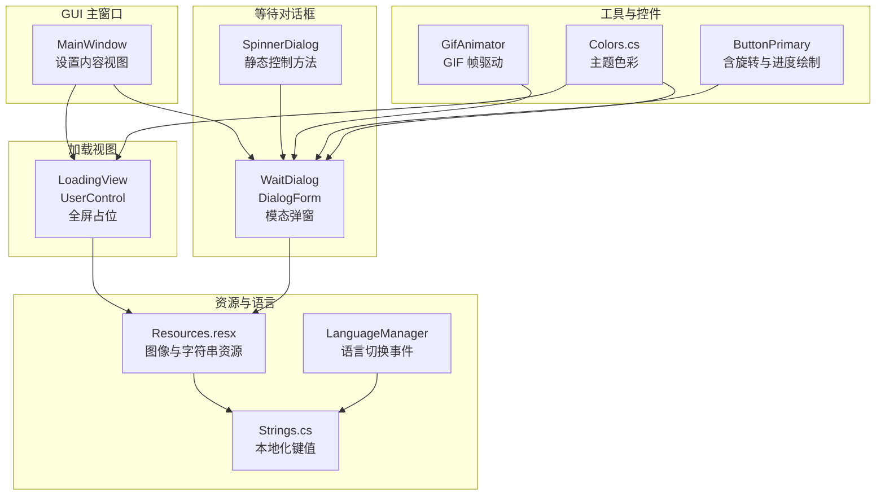
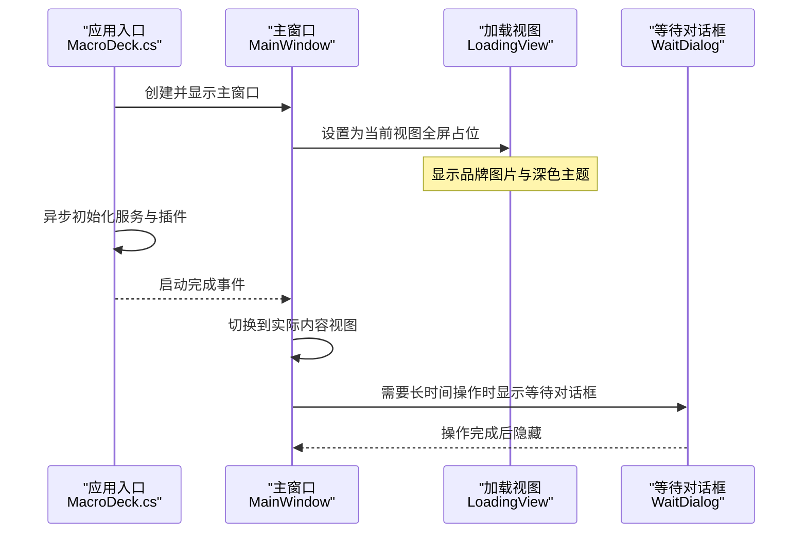
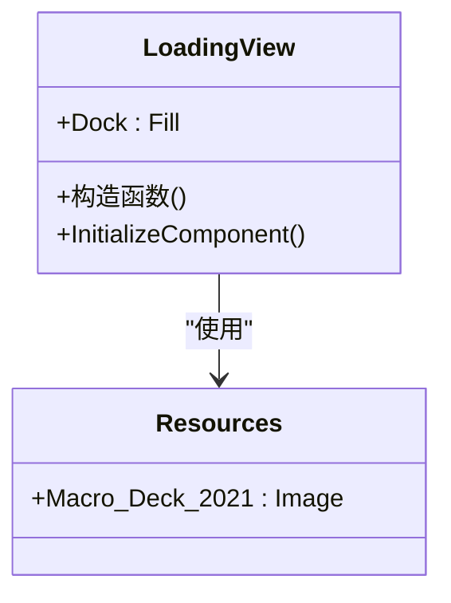
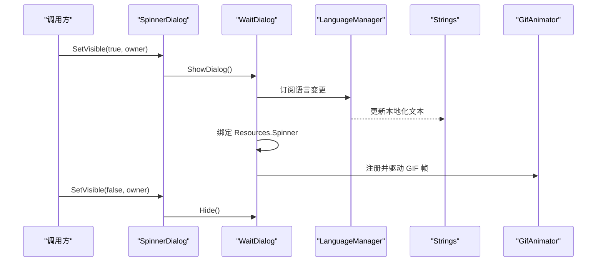
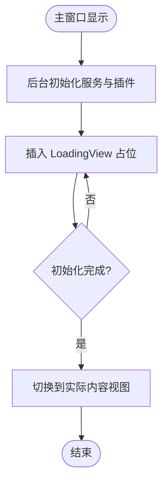
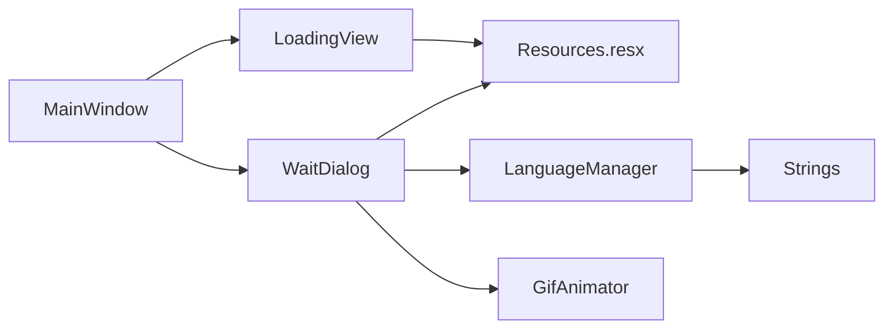

# 加载视图

<cite>
**本文引用的文件**
- [LoadingView.cs](file://src/MacroDeck/GUI/MainWindowViews/LoadingView.cs)
- [LoadingView.Designer.cs](file://src/MacroDeck/GUI/MainWindowViews/LoadingView.Designer.cs)
- [WaitDialog.cs](file://src/MacroDeck/GUI/Dialogs/WaitDialog.cs)
- [WaitDialog.Designer.cs](file://src/MacroDeck/GUI/Dialogs/WaitDialog.Designer.cs)
- [MainWindow.cs](file://src/MacroDeck/GUI/MainWindow.cs)
- [MacroDeck.cs](file://src/MacroDeck/MacroDeck.cs)
- [Resources.resx](file://src/MacroDeck/Properties/Resources.resx)
- [Strings.cs](file://src/MacroDeck/Language/Strings.cs)
- [LanguageManager.cs](file://src/MacroDeck/Language/LanguageManager.cs)
- [Colors.cs](file://src/MacroDeck/GUI/Colors.cs)
- [GifAnimator.cs](file://src/MacroDeck/Utils/GifAnimator.cs)
- [ButtonPrimary.cs](file://src/MacroDeck/GUI/CustomControls/ButtonPrimary.cs)
</cite>

## 目录
1. [简介](#简介)
2. [项目结构](#项目结构)
3. [核心组件](#核心组件)
4. [架构总览](#架构总览)
5. [详细组件分析](#详细组件分析)
6. [依赖关系分析](#依赖关系分析)
7. [性能考虑](#性能考虑)
8. [故障排查指南](#故障排查指南)
9. [结论](#结论)
10. [附录](#附录)

## 简介
本文件系统性地记录 Macro-Deck 的“加载视图”（LoadingView）与“等待对话框”（WaitDialog）的设计目标、实现机制与使用场景，覆盖以下方面：
- 设计目的：在应用启动、数据刷新与长时间操作期间向用户提供明确的加载反馈，避免界面卡顿造成的误判。
- 实现机制：加载视图以全屏占位控件呈现，等待对话框以模态弹窗展示旋转指示器与提示文本；二者均通过资源管理与多语言支持提升可用性。
- 状态管理与用户反馈：加载视图侧重静态占位与品牌元素展示；等待对话框提供动态旋转动画与本地化提示文本。
- 性能优化：采用异步初始化、资源预加载与 GIF 动画帧驱动，降低主线程阻塞。
- 使用场景：应用启动、扩展安装/更新、网络请求等长时间任务。
- 定制化与主题：颜色体系、字体与布局适配深色主题；可通过资源替换与样式扩展进行定制。
- 可访问性与体验：文本本地化、清晰的视觉反馈、避免闪烁与不必要重绘。

## 项目结构
加载视图与等待对话框位于 GUI 层，分别用于“视图级占位”和“对话框级反馈”。它们与主窗口、语言系统、资源系统协同工作。

**图表来源**
- [MainWindow.cs:19-290](file://src/MacroDeck/GUI/MainWindow.cs#L19-L290)
- [LoadingView.cs:3-10](file://src/MacroDeck/GUI/MainWindowViews/LoadingView.cs#L3-L10)
- [LoadingView.Designer.cs:32-64](file://src/MacroDeck/GUI/MainWindowViews/LoadingView.Designer.cs#L32-L64)
- [WaitDialog.cs:7-40](file://src/MacroDeck/GUI/Dialogs/WaitDialog.cs#L7-L40)
- [WaitDialog.Designer.cs:33-75](file://src/MacroDeck/GUI/Dialogs/WaitDialog.Designer.cs#L33-L75)
- [Resources.resx:199-243](file://src/MacroDeck/Properties/Resources.resx#L199-L243)
- [Strings.cs:328](file://src/MacroDeck/Language/Strings.cs#L328)
- [LanguageManager.cs:8-120](file://src/MacroDeck/Language/LanguageManager.cs#L8-L120)
- [GifAnimator.cs:34-141](file://src/MacroDeck/Utils/GifAnimator.cs#L34-L141)
- [ButtonPrimary.cs:194-233](file://src/MacroDeck/GUI/CustomControls/ButtonPrimary.cs#L194-L233)
- [Colors.cs:3-14](file://src/MacroDeck/GUI/Colors.cs#L3-L14)

**章节来源**
- [LoadingView.cs:3-10](file://src/MacroDeck/GUI/MainWindowViews/LoadingView.cs#L3-L10)
- [LoadingView.Designer.cs:32-64](file://src/MacroDeck/GUI/MainWindowViews/LoadingView.Designer.cs#L32-L64)
- [WaitDialog.cs:7-40](file://src/MacroDeck/GUI/Dialogs/WaitDialog.cs#L7-L40)
- [WaitDialog.Designer.cs:33-75](file://src/MacroDeck/GUI/Dialogs/WaitDialog.Designer.cs#L33-L75)
- [MainWindow.cs:79-116](file://src/MacroDeck/GUI/MainWindow.cs#L79-L116)
- [Resources.resx:199-243](file://src/MacroDeck/Properties/Resources.resx#L199-L243)
- [Strings.cs:328](file://src/MacroDeck/Language/Strings.cs#L328)
- [LanguageManager.cs:8-120](file://src/MacroDeck/Language/LanguageManager.cs#L8-L120)
- [GifAnimator.cs:34-141](file://src/MacroDeck/Utils/GifAnimator.cs#L34-L141)
- [ButtonPrimary.cs:194-233](file://src/MacroDeck/GUI/CustomControls/ButtonPrimary.cs#L194-L233)
- [Colors.cs:3-14](file://src/MacroDeck/GUI/Colors.cs#L3-L14)

## 核心组件
- 加载视图（LoadingView）
  - 作用：作为主窗口的内容占位控件，在应用启动或切换视图时提供统一的加载占位界面。
  - 特点：Dock 填充、深色背景、居中缩放的图片控件，承载品牌元素与视觉一致性。
- 等待对话框（WaitDialog）
  - 作用：在执行长时间任务时以模态弹窗形式显示旋转指示器与提示文本，避免用户重复触发操作。
  - 特点：静态控制类 SpinnerDialog 提供可见性切换，内部包含旋转 GIF 与本地化提示文本。
- 资源与语言
  - 资源：Resources.resx 中包含加载动图与通用旋转 GIF 等资源。
  - 语言：LanguageManager 与 Strings 提供多语言支持，确保提示文本随系统语言变化。
- 工具与控件
  - GifAnimator：对 GIF 图像进行帧驱动与定时更新，保证动画流畅。
  - ButtonPrimary：内置旋转与进度绘制逻辑，体现项目对动画与反馈的一致性设计。

**章节来源**
- [LoadingView.cs:3-10](file://src/MacroDeck/GUI/MainWindowViews/LoadingView.cs#L3-L10)
- [LoadingView.Designer.cs:32-64](file://src/MacroDeck/GUI/MainWindowViews/LoadingView.Designer.cs#L32-L64)
- [WaitDialog.cs:7-40](file://src/MacroDeck/GUI/Dialogs/WaitDialog.cs#L7-L40)
- [WaitDialog.Designer.cs:33-75](file://src/MacroDeck/GUI/Dialogs/WaitDialog.Designer.cs#L33-L75)
- [Resources.resx:199-243](file://src/MacroDeck/Properties/Resources.resx#L199-L243)
- [Strings.cs:328](file://src/MacroDeck/Language/Strings.cs#L328)
- [LanguageManager.cs:8-120](file://src/MacroDeck/Language/LanguageManager.cs#L8-L120)
- [GifAnimator.cs:34-141](file://src/MacroDeck/Utils/GifAnimator.cs#L34-L141)
- [ButtonPrimary.cs:194-233](file://src/MacroDeck/GUI/CustomControls/ButtonPrimary.cs#L194-L233)

## 架构总览
加载视图与等待对话框在应用生命周期中的交互路径如下：

**图表来源**
- [MacroDeck.cs:108-145](file://src/MacroDeck/MacroDeck.cs#L108-L145)
- [MainWindow.cs:79-116](file://src/MacroDeck/GUI/MainWindow.cs#L79-L116)
- [LoadingView.cs:3-10](file://src/MacroDeck/GUI/MainWindowViews/LoadingView.cs#L3-L10)
- [WaitDialog.cs:17-40](file://src/MacroDeck/GUI/Dialogs/WaitDialog.cs#L17-L40)

## 详细组件分析

### 加载视图（LoadingView）
- 组件定位
  - 作为主窗口内容面板的占位控件，用于在应用启动或视图切换期间提供一致的视觉反馈。
- 设计要点
  - 全屏填充：DockStyle.Fill，确保覆盖整个内容区域。
  - 视觉风格：深色背景与居中缩放的品牌图片，契合整体主题。
  - 资源绑定：使用 Resources.Macro_Deck_2021 作为背景图片。
- 适用场景
  - 应用启动初期：在后台服务初始化期间显示加载视图，避免用户感知到空白或卡顿。
  - 视图切换过渡：在切换到实际内容视图前，先显示加载视图，提升感知一致性。

**图表来源**
- [LoadingView.cs:3-10](file://src/MacroDeck/GUI/MainWindowViews/LoadingView.cs#L3-L10)
- [LoadingView.Designer.cs:32-64](file://src/MacroDeck/GUI/MainWindowViews/LoadingView.Designer.cs#L32-L64)
- [Resources.resx:199-201](file://src/MacroDeck/Properties/Resources.resx#L199-L201)

**章节来源**
- [LoadingView.cs:3-10](file://src/MacroDeck/GUI/MainWindowViews/LoadingView.cs#L3-L10)
- [LoadingView.Designer.cs:32-64](file://src/MacroDeck/GUI/MainWindowViews/LoadingView.Designer.cs#L32-L64)
- [Resources.resx:199-201](file://src/MacroDeck/Properties/Resources.resx#L199-L201)

### 等待对话框（WaitDialog）与 SpinnerDialog
- 组件定位
  - 在需要长时间操作时，以模态弹窗方式向用户传达“请稍候”的状态。
- 关键实现
  - WaitDialog：包含旋转 GIF 与提示标签，初始化时绑定本地化文本。
  - SpinnerDialog：静态类提供 SetVisible 方法，负责在主线程上下文中显示/隐藏等待对话框。
- 动画与资源
  - 使用 Resources.Spinner 作为旋转 GIF。
  - GifAnimator 对 GIF 进行动画帧驱动，确保流畅播放。
- 多语言支持
  - 通过 LanguageManager.Strings.PleaseWait 获取本地化提示文本。

**图表来源**
- [WaitDialog.cs:7-40](file://src/MacroDeck/GUI/Dialogs/WaitDialog.cs#L7-L40)
- [WaitDialog.Designer.cs:33-75](file://src/MacroDeck/GUI/Dialogs/WaitDialog.Designer.cs#L33-L75)
- [LanguageManager.cs:8-120](file://src/MacroDeck/Language/LanguageManager.cs#L8-L120)
- [Strings.cs:328](file://src/MacroDeck/Language/Strings.cs#L328)
- [GifAnimator.cs:34-141](file://src/MacroDeck/Utils/GifAnimator.cs#L34-L141)
- [Resources.resx:241-243](file://src/MacroDeck/Properties/Resources.resx#L241-L243)

**章节来源**
- [WaitDialog.cs:7-40](file://src/MacroDeck/GUI/Dialogs/WaitDialog.cs#L7-L40)
- [WaitDialog.Designer.cs:33-75](file://src/MacroDeck/GUI/Dialogs/WaitDialog.Designer.cs#L33-L75)
- [LanguageManager.cs:8-120](file://src/MacroDeck/Language/LanguageManager.cs#L8-L120)
- [Strings.cs:328](file://src/MacroDeck/Language/Strings.cs#L328)
- [GifAnimator.cs:34-141](file://src/MacroDeck/Utils/GifAnimator.cs#L34-L141)
- [Resources.resx:241-243](file://src/MacroDeck/Properties/Resources.resx#L241-L243)

### 主窗口中的加载视图使用
- 视图切换流程
  - SetView 方法负责移除旧控件、添加新视图，并根据类型选择选中按钮。
  - 在应用启动后，主窗口在显示事件中设置为 DeckView 或其他内容视图。
- 加载视图的插入时机
  - 可在后台初始化阶段插入 LoadingView，待初始化完成后移除并切换到真实视图。

**图表来源**
- [MainWindow.cs:79-116](file://src/MacroDeck/GUI/MainWindow.cs#L79-L116)
- [MacroDeck.cs:108-145](file://src/MacroDeck/MacroDeck.cs#L108-L145)

**章节来源**
- [MainWindow.cs:79-116](file://src/MacroDeck/GUI/MainWindow.cs#L79-L116)
- [MacroDeck.cs:108-145](file://src/MacroDeck/MacroDeck.cs#L108-L145)

## 依赖关系分析
- 组件耦合
  - LoadingView 与 WaitDialog 均依赖 Resources.resx 中的图像资源。
  - WaitDialog 依赖 LanguageManager 与 Strings 实现本地化。
  - GifAnimator 为 WaitDialog 的 GIF 动画提供底层支持。
- 外部集成
  - 主窗口通过 SetView 管理内容视图，形成“视图容器”模式。
  - 应用入口在后台任务中异步初始化，减少 UI 阻塞。

**图表来源**
- [LoadingView.Designer.cs:32-64](file://src/MacroDeck/GUI/MainWindowViews/LoadingView.Designer.cs#L32-L64)
- [WaitDialog.Designer.cs:33-75](file://src/MacroDeck/GUI/Dialogs/WaitDialog.Designer.cs#L33-L75)
- [Resources.resx:199-243](file://src/MacroDeck/Properties/Resources.resx#L199-L243)
- [LanguageManager.cs:8-120](file://src/MacroDeck/Language/LanguageManager.cs#L8-L120)
- [Strings.cs:328](file://src/MacroDeck/Language/Strings.cs#L328)
- [GifAnimator.cs:34-141](file://src/MacroDeck/Utils/GifAnimator.cs#L34-L141)
- [MainWindow.cs:79-116](file://src/MacroDeck/GUI/MainWindow.cs#L79-L116)

**章节来源**
- [LoadingView.Designer.cs:32-64](file://src/MacroDeck/GUI/MainWindowViews/LoadingView.Designer.cs#L32-L64)
- [WaitDialog.Designer.cs:33-75](file://src/MacroDeck/GUI/Dialogs/WaitDialog.Designer.cs#L33-L75)
- [Resources.resx:199-243](file://src/MacroDeck/Properties/Resources.resx#L199-L243)
- [LanguageManager.cs:8-120](file://src/MacroDeck/Language/LanguageManager.cs#L8-L120)
- [Strings.cs:328](file://src/MacroDeck/Language/Strings.cs#L328)
- [GifAnimator.cs:34-141](file://src/MacroDeck/Utils/GifAnimator.cs#L34-L141)
- [MainWindow.cs:79-116](file://src/MacroDeck/GUI/MainWindow.cs#L79-L116)

## 性能考虑
- 异步加载
  - 应用入口在后台线程初始化服务与插件，避免阻塞 UI 线程。
- 资源预加载
  - 将品牌图片与旋转 GIF 放入资源文件，减少运行时 IO 开销。
- 动画帧驱动
  - GifAnimator 通过定时器逐帧更新 GIF，避免每帧重复解码带来的 CPU 峰值。
- UI 刷新控制
  - WaitDialog 仅在需要时显示，避免不必要的窗口创建与销毁。
- 主题与绘制
  - 深色主题与高对比度图片提升可读性，减少过度绘制。

**章节来源**
- [MacroDeck.cs:108-145](file://src/MacroDeck/MacroDeck.cs#L108-L145)
- [GifAnimator.cs:34-141](file://src/MacroDeck/Utils/GifAnimator.cs#L34-L141)
- [Resources.resx:199-243](file://src/MacroDeck/Properties/Resources.resx#L199-L243)
- [Colors.cs:3-14](file://src/MacroDeck/GUI/Colors.cs#L3-L14)

## 故障排查指南
- 等待对话框未显示
  - 检查 SpinnerDialog.SetVisible 是否在主线程上调用。
  - 确认 WaitDialog 已正确初始化并绑定本地化文本。
- GIF 不动或闪烁
  - 确保 GifAnimator 已注册该 GIF 并启动定时器。
  - 检查图像是否为多帧 GIF，且资源文件存在。
- 文本未本地化
  - 确认 LanguageManager 已加载语言资源，且 Strings.PleaseWait 键存在。
- 视图切换异常
  - 检查 MainWindow.SetView 是否正确移除旧控件并添加新视图。

**章节来源**
- [WaitDialog.cs:17-40](file://src/MacroDeck/GUI/Dialogs/WaitDialog.cs#L17-L40)
- [WaitDialog.Designer.cs:33-75](file://src/MacroDeck/GUI/Dialogs/WaitDialog.Designer.cs#L33-L75)
- [GifAnimator.cs:34-141](file://src/MacroDeck/Utils/GifAnimator.cs#L34-L141)
- [LanguageManager.cs:8-120](file://src/MacroDeck/Language/LanguageManager.cs#L8-L120)
- [Strings.cs:328](file://src/MacroDeck/Language/Strings.cs#L328)
- [MainWindow.cs:79-116](file://src/MacroDeck/GUI/MainWindow.cs#L79-L116)

## 结论
加载视图与等待对话框共同构成了 Macro-Deck 的加载反馈体系：前者提供稳定的视觉占位，后者提供明确的动态反馈。二者结合资源与语言系统，配合异步初始化与 GIF 帧驱动，有效提升了用户体验与系统响应性。通过主题色彩与本地化支持，系统在不同环境下保持一致的可用性。

## 附录
- 定制化建议
  - 更换品牌图片：替换 Resources.Macro_Deck_2021。
  - 自定义等待文案：修改 Strings.PleaseWait 或扩展语言包。
  - 动画优化：根据设备性能调整 GifAnimator 的刷新频率。
- 主题支持
  - 使用 Colors.cs 中的颜色常量，确保与整体主题一致。
- 可访问性
  - 保持高对比度与清晰文本；为长时间任务提供可取消或进度反馈（如需扩展）。