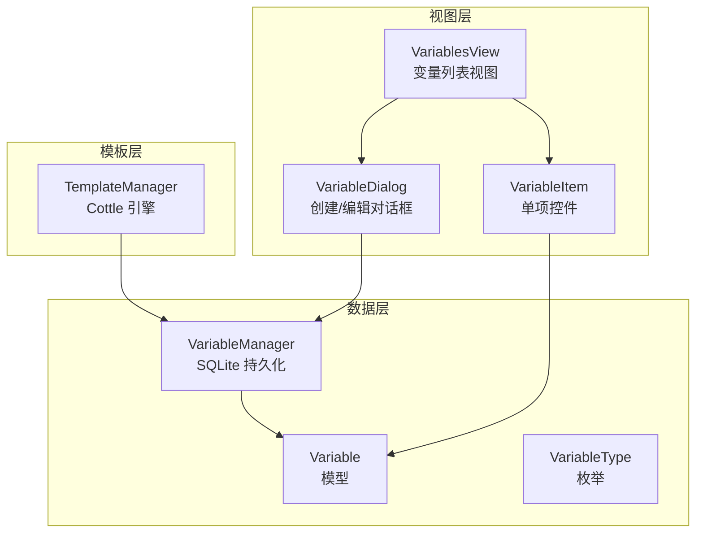
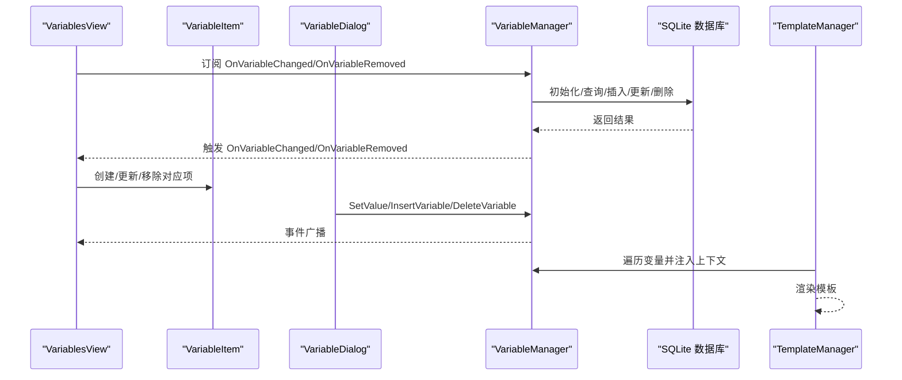
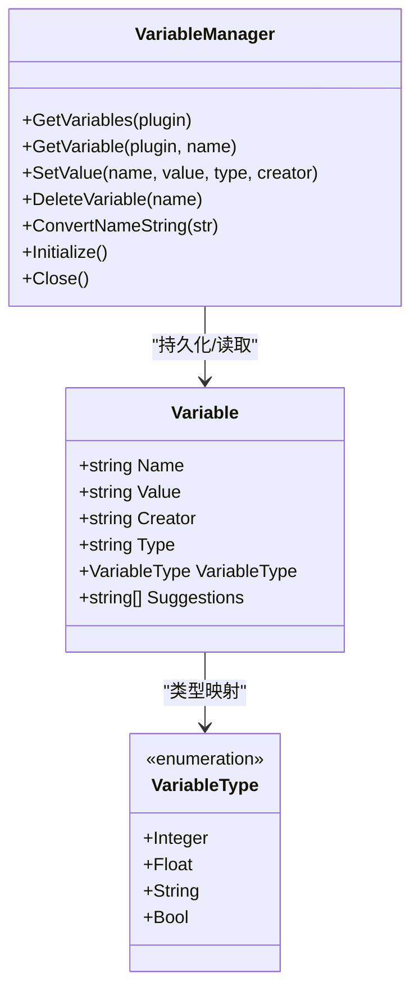
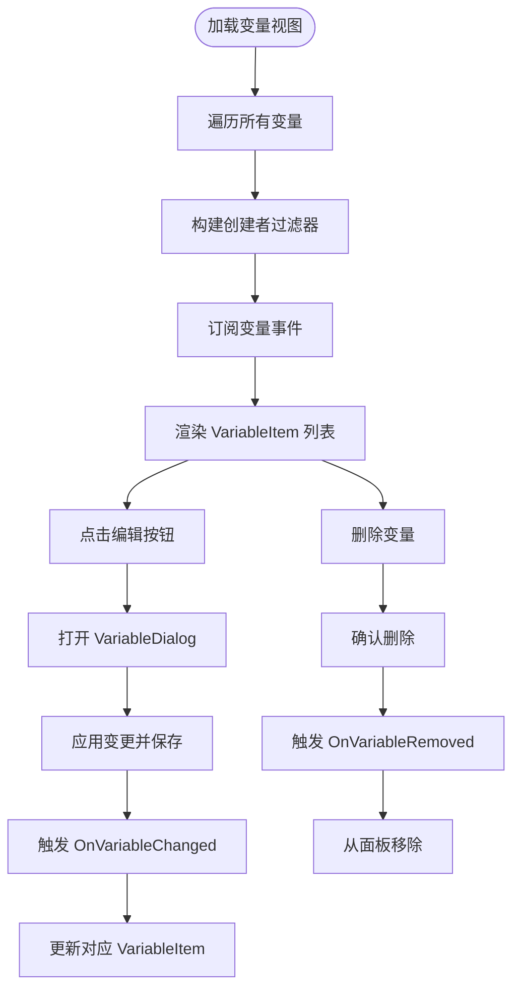
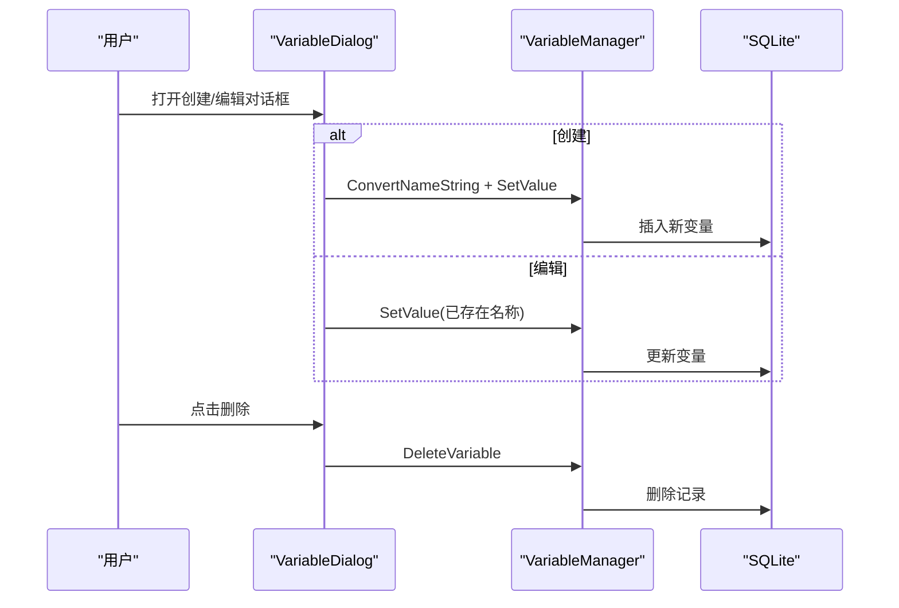
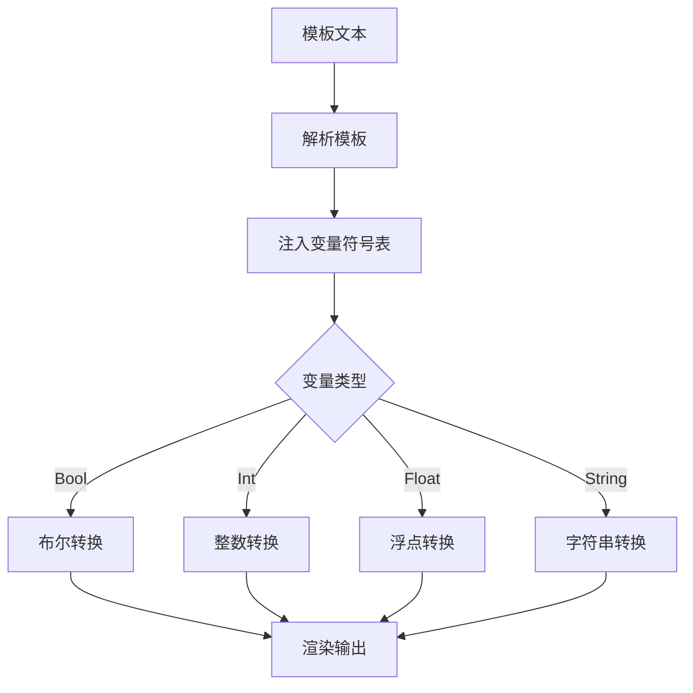
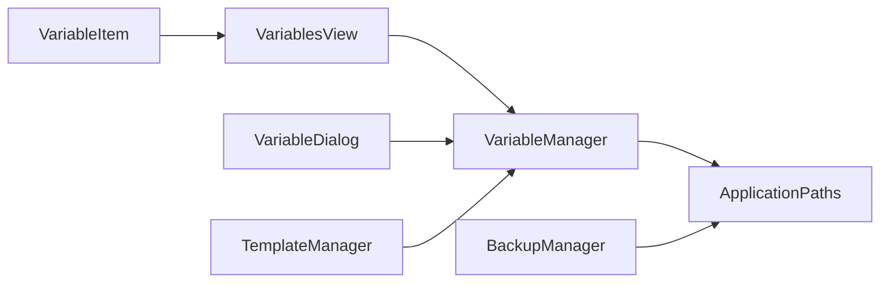

# 变量视图

<cite>
**本文档引用的文件**
- [Variable.cs](file://src/MacroDeck/Variables/Variable.cs)
- [VariableManager.cs](file://src/MacroDeck/Variables/VariableManager.cs)
- [VariableType.cs](file://src/MacroDeck/Variables/VariableType.cs)
- [VariablesView.cs](file://src/MacroDeck/GUI/MainWindowViews/VariablesView.cs)
- [VariableItem.cs](file://src/MacroDeck/GUI/CustomControls/Variables/VariableItem.cs)
- [VariableDialog.cs](file://src/MacroDeck/GUI/Dialogs/VariableDialog.cs)
- [TemplateManager.cs](file://src/MacroDeck/CottleIntegration/TemplateManager.cs)
- [VariableViewCreatorFilterModel.cs](file://src/MacroDeck/Models/VariableViewCreatorFilterModel.cs)
- [ApplicationPaths.cs](file://src/MacroDeck/StartupConfig/ApplicationPaths.cs)
- [BackupManager.cs](file://src/MacroDeck/Backup/BackupManager.cs)
- [ChangeVariableValueActionConfigModel.cs](file://src/MacroDeck/InternalPlugins/Variables/Models/ChangeVariableValueActionConfigModel.cs)
- [ReadVariableFromFileActionConfigModel.cs](file://src/MacroDeck/InternalPlugins/Variables/Models/ReadVariableFromFileActionConfigModel.cs)
- [SaveVariableToFileActionConfigModel.cs](file://src/MacroDeck/InternalPlugins/Variables/Models/SaveVariableToFileActionConfigModel.cs)
- [ChangeVariableMethod.cs](file://src/MacroDeck/InternalPlugins/Variables/Enums/ChangeVariableMethod.cs)
</cite>

## 目录
1. [简介](#简介)
2. [项目结构](#项目结构)
3. [核心组件](#核心组件)
4. [架构总览](#架构总览)
5. [详细组件分析](#详细组件分析)
6. [依赖关系分析](#依赖关系分析)
7. [性能考量](#性能考量)
8. [故障排除指南](#故障排除指南)
9. [结论](#结论)
10. [附录](#附录)

## 简介
本文件面向 Macro-Deck 的“变量视图”功能，系统性地阐述其界面设计与交互流程、变量类型管理（字符串、整数、浮点、布尔）、实时监控与状态显示、作用域与生命周期控制、批量操作与导入导出能力，以及与模板系统的集成与数据绑定机制。目标是帮助开发者与使用者全面理解变量视图的设计理念与实现细节。

## 项目结构
变量视图由三层组成：
- 数据层：变量模型与管理器，负责持久化、类型转换与事件通知
- 视图层：变量列表视图与单个变量项控件，负责展示与交互
- 模板层：模板引擎集成，负责变量在模板中的动态渲染

图表来源
- [VariablesView.cs:10-171](file://src/MacroDeck/GUI/MainWindowViews/VariablesView.cs#L10-L171)
- [VariableItem.cs:6-38](file://src/MacroDeck/GUI/CustomControls/Variables/VariableItem.cs#L6-L38)
- [VariableDialog.cs:8-142](file://src/MacroDeck/GUI/Dialogs/VariableDialog.cs#L8-L142)
- [VariableManager.cs:10-249](file://src/MacroDeck/Variables/VariableManager.cs#L10-L249)
- [Variable.cs:5-16](file://src/MacroDeck/Variables/Variable.cs#L5-L16)
- [VariableType.cs:3-9](file://src/MacroDeck/Variables/VariableType.cs#L3-L9)
- [TemplateManager.cs:8-181](file://src/MacroDeck/CottleIntegration/TemplateManager.cs#L8-L181)

章节来源
- [VariablesView.cs:10-171](file://src/MacroDeck/GUI/MainWindowViews/VariablesView.cs#L10-L171)
- [VariableItem.cs:6-38](file://src/MacroDeck/GUI/CustomControls/Variables/VariableItem.cs#L6-L38)
- [VariableDialog.cs:8-142](file://src/MacroDeck/GUI/Dialogs/VariableDialog.cs#L8-L142)
- [VariableManager.cs:10-249](file://src/MacroDeck/Variables/VariableManager.cs#L10-L249)
- [Variable.cs:5-16](file://src/MacroDeck/Variables/Variable.cs#L5-L16)
- [VariableType.cs:3-9](file://src/MacroDeck/Variables/VariableType.cs#L3-L9)
- [TemplateManager.cs:8-181](file://src/MacroDeck/CottleIntegration/TemplateManager.cs#L8-L181)

## 核心组件
- 变量模型：包含名称、值、类型、创建者等字段，提供类型解析与建议值集合
- 变量管理器：负责数据库初始化、增删改查、类型转换、事件广播与命名规范化
- 视图组件：变量列表视图、单项控件、创建/编辑对话框
- 模板管理器：将变量注入模板上下文，支持布尔/数值/字符串类型转换与自定义函数

章节来源
- [Variable.cs:5-16](file://src/MacroDeck/Variables/Variable.cs#L5-L16)
- [VariableManager.cs:10-249](file://src/MacroDeck/Variables/VariableManager.cs#L10-L249)
- [VariablesView.cs:10-171](file://src/MacroDeck/GUI/MainWindowViews/VariablesView.cs#L10-L171)
- [VariableItem.cs:6-38](file://src/MacroDeck/GUI/CustomControls/Variables/VariableItem.cs#L6-L38)
- [VariableDialog.cs:8-142](file://src/MacroDeck/GUI/Dialogs/VariableDialog.cs#L8-L142)
- [TemplateManager.cs:8-181](file://src/MacroDeck/CottleIntegration/TemplateManager.cs#L8-L181)

## 架构总览
变量视图采用“事件驱动 + 即时刷新”的模式：管理器在变量变更或删除时触发事件，视图订阅事件并即时更新 UI；模板系统通过模板管理器将变量注入上下文，实现动态渲染。

图表来源
- [VariablesView.cs:89-141](file://src/MacroDeck/GUI/MainWindowViews/VariablesView.cs#L89-L141)
- [VariableManager.cs:44-196](file://src/MacroDeck/Variables/VariableManager.cs#L44-L196)
- [VariableDialog.cs:46-94](file://src/MacroDeck/GUI/Dialogs/VariableDialog.cs#L46-L94)
- [TemplateManager.cs:59-88](file://src/MacroDeck/CottleIntegration/TemplateManager.cs#L59-L88)

## 详细组件分析

### 变量模型与类型管理
- 字段与属性
  - 名称：主键，用于唯一标识
  - 值：字符串存储，具体类型由类型字段决定
  - 类型：枚举字符串，映射到 VariableType
  - 创建者：标识变量来源（如用户或插件）
  - 建议值：用于输入辅助
- 类型枚举
  - 支持 Integer、Float、String、Bool 四种类型
- 类型转换
  - 管理器在设置值时根据类型进行解析与格式化，确保一致性

图表来源
- [Variable.cs:5-16](file://src/MacroDeck/Variables/Variable.cs#L5-L16)
- [VariableType.cs:3-9](file://src/MacroDeck/Variables/VariableType.cs#L3-L9)
- [VariableManager.cs:29-196](file://src/MacroDeck/Variables/VariableManager.cs#L29-L196)

章节来源
- [Variable.cs:5-16](file://src/MacroDeck/Variables/Variable.cs#L5-L16)
- [VariableType.cs:3-9](file://src/MacroDeck/Variables/VariableType.cs#L3-L9)
- [VariableManager.cs:54-138](file://src/MacroDeck/Variables/VariableManager.cs#L54-L138)

### 变量列表视图与交互
- 列表展示
  - 加载所有变量并按创建者分组显示
  - 支持创建者过滤器，勾选/取消勾选可隐藏/显示对应变量
- 实时监控
  - 订阅变量变更与删除事件，自动更新 UI
- 编辑与删除
  - 点击编辑按钮打开对话框，支持修改类型与值
  - 删除变量时弹出确认提示

图表来源
- [VariablesView.cs:31-171](file://src/MacroDeck/GUI/MainWindowViews/VariablesView.cs#L31-L171)
- [VariableItem.cs:27-36](file://src/MacroDeck/GUI/CustomControls/Variables/VariableItem.cs#L27-L36)
- [VariableDialog.cs:46-141](file://src/MacroDeck/GUI/Dialogs/VariableDialog.cs#L46-L141)

章节来源
- [VariablesView.cs:31-171](file://src/MacroDeck/GUI/MainWindowViews/VariablesView.cs#L31-L171)
- [VariableItem.cs:16-36](file://src/MacroDeck/GUI/CustomControls/Variables/VariableItem.cs#L16-L36)
- [VariableDialog.cs:15-141](file://src/MacroDeck/GUI/Dialogs/VariableDialog.cs#L15-L141)

### 创建/编辑/删除流程
- 创建流程
  - 打开对话框，默认启用名称输入
  - 输入名称并选择类型，根据类型预置默认值
  - 点击确定后调用管理器写入数据库
- 编辑流程
  - 打开对话框时禁用名称输入（防止重名）
  - 修改类型与值后保存
- 删除流程
  - 点击删除按钮，弹出确认对话框
  - 确认后调用管理器删除并关闭对话框

图表来源
- [VariableDialog.cs:15-94](file://src/MacroDeck/GUI/Dialogs/VariableDialog.cs#L15-L94)
- [VariableManager.cs:44-196](file://src/MacroDeck/Variables/VariableManager.cs#L44-L196)

章节来源
- [VariableDialog.cs:15-141](file://src/MacroDeck/GUI/Dialogs/VariableDialog.cs#L15-L141)
- [VariableManager.cs:44-196](file://src/MacroDeck/Variables/VariableManager.cs#L44-L196)

### 变量类型处理与转换
- 布尔值：支持 true/false 与大小写变体
- 整数/浮点：根据当前区域设置解析小数点
- 字符串：直接存储
- 转换失败时采用安全默认值（false/0/0.0/空字符串）

章节来源
- [VariableManager.cs:80-124](file://src/MacroDeck/Variables/VariableManager.cs#L80-L124)

### 实时监控与状态显示
- 事件驱动：管理器在值变化或删除时触发事件
- UI 响应：视图订阅事件，动态更新或移除对应项
- 状态可见性：通过创建者过滤器控制变量项的可见性

章节来源
- [VariablesView.cs:93-141](file://src/MacroDeck/GUI/MainWindowViews/VariablesView.cs#L93-L141)
- [VariableManager.cs:16-17](file://src/MacroDeck/Variables/VariableManager.cs#L16-L17)

### 作用域管理与生命周期
- 作用域：变量通过 Creator 字段区分来源（如用户或插件）
- 生命周期：
  - 初始化：管理器在启动时连接数据库并创建表
  - 运行期：通过事件驱动更新 UI
  - 关闭：管理器关闭数据库连接
- 文件位置：变量数据库位于应用数据目录下的 variables.db

章节来源
- [VariableManager.cs:204-223](file://src/MacroDeck/Variables/VariableManager.cs#L204-L223)
- [ApplicationPaths.cs:58](file://src/MacroDeck/StartupConfig/ApplicationPaths.cs#L58)

### 批量操作与导入导出
- 导入导出：通过备份管理器对变量数据库文件进行备份与恢复
  - 备份：包含变量数据库文件
  - 恢复：可选择性恢复变量数据库
- 批量操作：当前 UI 未提供多选批量编辑，但可通过模板与动作插件间接批量处理

章节来源
- [BackupManager.cs:117-130](file://src/MacroDeck/Backup/BackupManager.cs#L117-L130)

### 模板引用与动态渲染
- 模板集成：模板管理器将变量注入 Cottle 上下文，支持布尔/数值/字符串类型转换
- 自定义函数：提供时间戳、计时器等常用函数
- 动态渲染：模板中可直接使用变量名作为键访问值

图表来源
- [TemplateManager.cs:59-124](file://src/MacroDeck/CottleIntegration/TemplateManager.cs#L59-L124)

章节来源
- [TemplateManager.cs:59-124](file://src/MacroDeck/CottleIntegration/TemplateManager.cs#L59-L124)

### 与模板系统的数据绑定机制
- 绑定方式：模板管理器遍历所有变量，按类型转换后加入符号表
- 使用场景：在动作配置、按钮标签、通知内容等模板中引用变量
- 辅助工具：模板编辑器提供变量快捷插入与语法提示

章节来源
- [TemplateManager.cs:90-124](file://src/MacroDeck/CottleIntegration/TemplateManager.cs#L90-L124)

## 依赖关系分析
- 变量视图依赖于变量管理器提供的事件与数据源
- 模板管理器依赖变量管理器提供的变量集合
- 应用路径配置决定变量数据库文件位置
- 备份管理器提供变量数据库的导入导出能力

图表来源
- [VariablesView.cs:10-171](file://src/MacroDeck/GUI/MainWindowViews/VariablesView.cs#L10-L171)
- [VariableManager.cs:10-249](file://src/MacroDeck/Variables/VariableManager.cs#L10-L249)
- [TemplateManager.cs:8-181](file://src/MacroDeck/CottleIntegration/TemplateManager.cs#L8-L181)
- [ApplicationPaths.cs:6-61](file://src/MacroDeck/StartupConfig/ApplicationPaths.cs#L6-L61)
- [BackupManager.cs:16-200](file://src/MacroDeck/Backup/BackupManager.cs#L16-L200)

章节来源
- [VariablesView.cs:10-171](file://src/MacroDeck/GUI/MainWindowViews/VariablesView.cs#L10-L171)
- [VariableManager.cs:10-249](file://src/MacroDeck/Variables/VariableManager.cs#L10-L249)
- [TemplateManager.cs:8-181](file://src/MacroDeck/CottleIntegration/TemplateManager.cs#L8-L181)
- [ApplicationPaths.cs:6-61](file://src/MacroDeck/StartupConfig/ApplicationPaths.cs#L6-L61)
- [BackupManager.cs:16-200](file://src/MacroDeck/Backup/BackupManager.cs#L16-L200)

## 性能考量
- 数据库访问：变量列表查询与更新均通过 SQLite 进行，建议避免频繁大规模写入
- UI 刷新：事件驱动更新，仅影响受影响项，整体开销较小
- 类型转换：在设置值时进行解析与格式化，注意异常日志记录以定位问题
- 模板渲染：变量注入与渲染在内存中完成，模板复杂度直接影响性能

## 故障排除指南
- 变量无法保存
  - 检查名称是否为空或已被占用
  - 确认类型与值匹配（例如布尔值必须为 true/false）
- 变量不显示
  - 检查创建者过滤器是否勾选了该来源
  - 确认管理器事件订阅是否正常
- 模板渲染错误
  - 查看模板管理器捕获的异常信息
  - 确认变量名与类型是否正确
- 备份/恢复失败
  - 检查备份管理器日志与文件权限
  - 确认变量数据库文件是否存在且可读写

章节来源
- [VariableDialog.cs:55-94](file://src/MacroDeck/GUI/Dialogs/VariableDialog.cs#L55-L94)
- [VariablesView.cs:93-141](file://src/MacroDeck/GUI/MainWindowViews/VariablesView.cs#L93-L141)
- [TemplateManager.cs:76-88](file://src/MacroDeck/CottleIntegration/TemplateManager.cs#L76-L88)
- [BackupManager.cs:117-130](file://src/MacroDeck/Backup/BackupManager.cs#L117-L130)

## 结论
变量视图通过清晰的数据模型、事件驱动的 UI 更新与完善的模板集成，提供了直观、可靠的变量管理体验。其作用域与生命周期控制明确，配合备份系统实现了便捷的导入导出能力。未来可在批量操作与更丰富的类型支持方面进一步扩展。

## 附录
- 变量动作配置模型
  - 变量值变更动作：支持计数加减、设置、切换等方法
  - 读取/保存变量到文件：支持文件路径与变量名配置
- 变量命名规范
  - 管理器提供名称规范化函数，统一转为小写并替换特殊字符

章节来源
- [ChangeVariableValueActionConfigModel.cs:8-29](file://src/MacroDeck/InternalPlugins/Variables/Models/ChangeVariableValueActionConfigModel.cs#L8-L29)
- [ReadVariableFromFileActionConfigModel.cs:6-22](file://src/MacroDeck/InternalPlugins/Variables/Models/ReadVariableFromFileActionConfigModel.cs#L6-L22)
- [SaveVariableToFileActionConfigModel.cs:6-22](file://src/MacroDeck/InternalPlugins/Variables/Models/SaveVariableToFileActionConfigModel.cs#L6-L22)
- [ChangeVariableMethod.cs:3-9](file://src/MacroDeck/InternalPlugins/Variables/Enums/ChangeVariableMethod.cs#L3-L9)
- [VariableManager.cs:225-247](file://src/MacroDeck/Variables/VariableManager.cs#L225-L247)