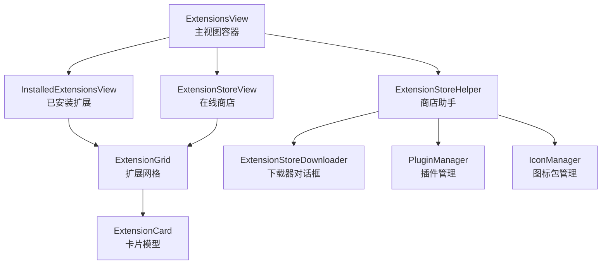
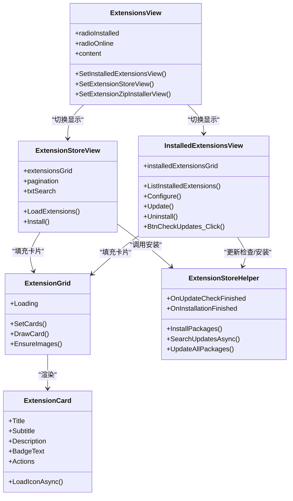
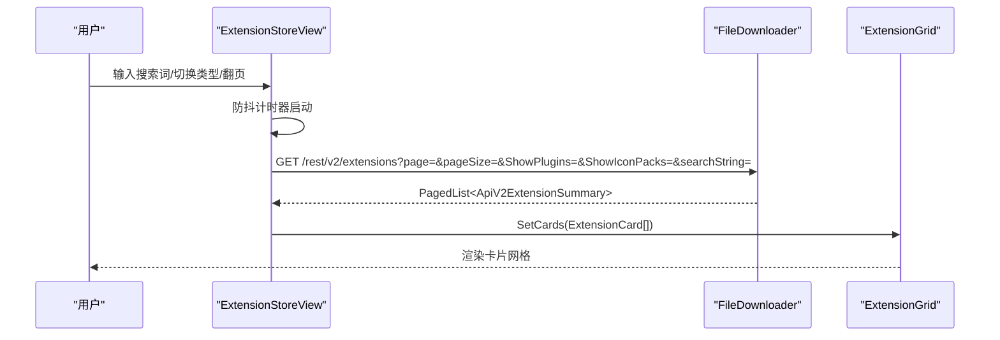
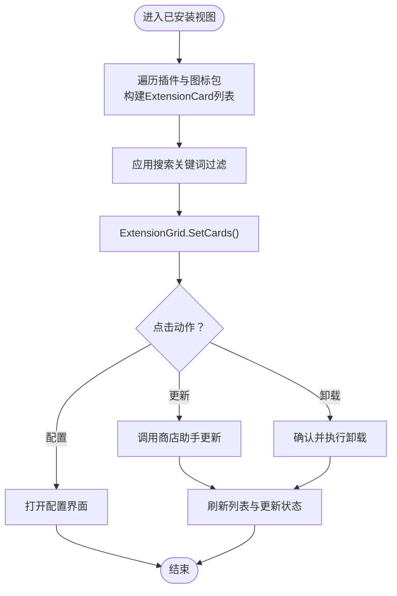
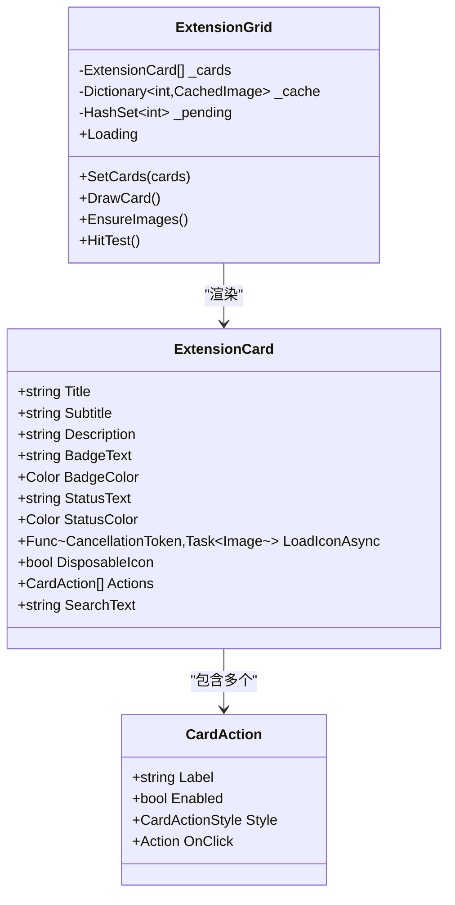
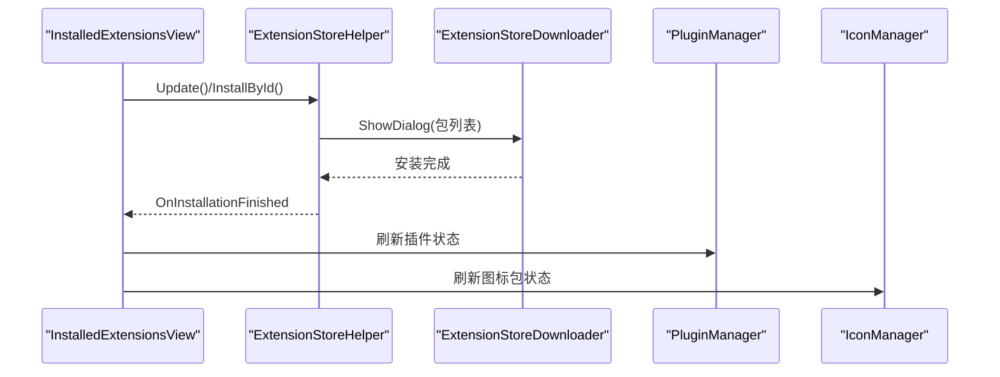
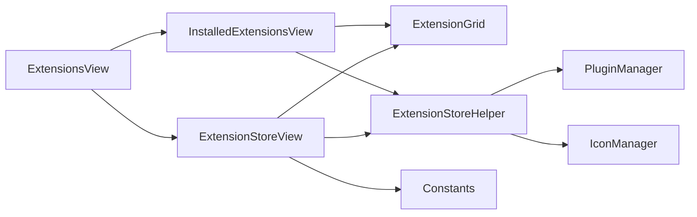

# 扩展视图

<cite>
**本文引用的文件**
- [ExtensionsView.cs](file://src/MacroDeck/GUI/MainWindowViews/ExtensionsView.cs)
- [ExtensionStoreView.cs](file://src/MacroDeck/GUI/CustomControls/ExtensionsView/ExtensionStoreView.cs)
- [InstalledExtensionsView.cs](file://src/MacroDeck/GUI/CustomControls/ExtensionsView/InstalledExtensionsView.cs)
- [ExtensionGrid.cs](file://src/MacroDeck/GUI/CustomControls/ExtensionsView/ExtensionGrid.cs)
- [ExtensionCard.cs](file://src/MacroDeck/GUI/CustomControls/ExtensionsView/ExtensionCard.cs)
- [ExtensionStoreHelper.cs](file://src/MacroDeck/ExtensionStore/ExtensionStoreHelper.cs)
- [IMacroDeckExtension.cs](file://src/MacroDeck/Extension/IMacroDeckExtension.cs)
- [PluginExtension.cs](file://src/MacroDeck/Extension/PluginExtension.cs)
- [IconPackExtension.cs](file://src/MacroDeck/Extension/IconPackExtension.cs)
- [ApiV2Extension.cs](file://src/MacroDeck/Models/ApiV2Extension.cs)
- [ApiV2ExtensionSummary.cs](file://src/MacroDeck/Models/ApiV2ExtensionSummary.cs)
- [ExtensionStoreExtensionModel.cs](file://src/MacroDeck/Models/ExtensionStoreExtensionModel.cs)
- [Constants.cs](file://src/MacroDeck/Constants.cs)
</cite>

## 目录
1. [简介](#简介)
2. [项目结构](#项目结构)
3. [核心组件](#核心组件)
4. [架构总览](#架构总览)
5. [详细组件分析](#详细组件分析)
6. [依赖关系分析](#依赖关系分析)
7. [性能考量](#性能考量)
8. [故障排查指南](#故障排查指南)
9. [结论](#结论)
10. [附录](#附录)

## 简介
本文件面向 Macro-Deck 的“扩展视图”功能，系统性阐述其功能架构与用户界面设计，覆盖以下方面：
- 扩展列表展示：在线商店与已安装扩展的卡片式网格布局
- 搜索与过滤：输入防抖、关键词匹配与本地筛选
- 分类与导航：插件与图标包的类型筛选与分页
- 扩展商店集成：在线获取、版本检查与自动更新
- 已安装扩展管理：启用/禁用、卸载、配置与更新
- 安装流程与依赖处理：下载器对话框与安装事件回调
- 评分与评价：模型字段定义（仓库链接、社区支持标识）
- 安全与签名：校验字段（MD5）与 API 版本约束
- 视图间交互与数据共享：事件驱动与状态同步

## 项目结构
扩展视图由主视图容器与两个子视图构成，配合通用网格控件与扩展模型共同完成展示与交互。

图表来源
- [ExtensionsView.cs:12-97](file://src/MacroDeck/GUI/MainWindowViews/ExtensionsView.cs#L12-L97)
- [ExtensionStoreView.cs:14-232](file://src/MacroDeck/GUI/CustomControls/ExtensionsView/ExtensionStoreView.cs#L14-L232)
- [InstalledExtensionsView.cs:12-382](file://src/MacroDeck/GUI/CustomControls/ExtensionsView/InstalledExtensionsView.cs#L12-L382)
- [ExtensionGrid.cs:13-506](file://src/MacroDeck/GUI/CustomControls/ExtensionsView/ExtensionGrid.cs#L13-L506)
- [ExtensionCard.cs:25-60](file://src/MacroDeck/GUI/CustomControls/ExtensionsView/ExtensionCard.cs#L25-L60)
- [ExtensionStoreHelper.cs:17-194](file://src/MacroDeck/ExtensionStore/ExtensionStoreHelper.cs#L17-L194)

章节来源
- [ExtensionsView.cs:6-97](file://src/MacroDeck/GUI/MainWindowViews/ExtensionsView.cs#L6-L97)
- [ExtensionStoreView.cs:26-37](file://src/MacroDeck/GUI/CustomControls/ExtensionsView/ExtensionStoreView.cs#L26-L37)
- [InstalledExtensionsView.cs:19-25](file://src/MacroDeck/GUI/CustomControls/ExtensionsView/InstalledExtensionsView.cs#L19-L25)

## 核心组件
- 主视图容器：负责切换“在线商店”和“已安装扩展”视图，绑定语言资源与事件转发
- 在线商店视图：拉取扩展列表、搜索过滤、类型筛选、分页、安装入口
- 已安装扩展视图：聚合插件与图标包、状态标注、配置/更新/卸载操作、更新检查
- 扩展网格：虚拟化绘制、图标异步解码缓存、命中测试与点击分发
- 商店助手：统一安装入口、更新检查、批量更新、通知推送
- 扩展模型：在线与离线数据结构、扩展元信息与校验字段

章节来源
- [ExtensionStoreView.cs:66-109](file://src/MacroDeck/GUI/CustomControls/ExtensionsView/ExtensionStoreView.cs#L66-L109)
- [InstalledExtensionsView.cs:37-78](file://src/MacroDeck/GUI/CustomControls/ExtensionsView/InstalledExtensionsView.cs#L37-L78)
- [ExtensionGrid.cs:93-135](file://src/MacroDeck/GUI/CustomControls/ExtensionsView/ExtensionGrid.cs#L93-L135)
- [ExtensionStoreHelper.cs:48-64](file://src/MacroDeck/ExtensionStore/ExtensionStoreHelper.cs#L48-L64)
- [ApiV2ExtensionSummary.cs:5-14](file://src/MacroDeck/Models/ApiV2ExtensionSummary.cs#L5-L14)

## 架构总览
扩展视图采用“视图容器 + 子视图 + 公共网格 + 商店助手”的分层设计，通过事件在视图间传递请求与结果，避免直接耦合。

图表来源
- [ExtensionsView.cs:22-96](file://src/MacroDeck/GUI/MainWindowViews/ExtensionsView.cs#L22-L96)
- [ExtensionStoreView.cs:66-109](file://src/MacroDeck/GUI/CustomControls/ExtensionsView/ExtensionStoreView.cs#L66-L109)
- [InstalledExtensionsView.cs:37-78](file://src/MacroDeck/GUI/CustomControls/ExtensionsView/InstalledExtensionsView.cs#L37-L78)
- [ExtensionGrid.cs:93-182](file://src/MacroDeck/GUI/CustomControls/ExtensionsView/ExtensionGrid.cs#L93-L182)
- [ExtensionCard.cs:25-60](file://src/MacroDeck/GUI/CustomControls/ExtensionsView/ExtensionCard.cs#L25-L60)
- [ExtensionStoreHelper.cs:48-131](file://src/MacroDeck/ExtensionStore/ExtensionStoreHelper.cs#L48-L131)

## 详细组件分析

### 在线扩展商店视图
- 数据加载与分页：基于常量中的商店 API 基地址，按页拉取扩展摘要列表，设置分页控件并构建卡片
- 搜索与过滤：输入文本经防抖后触发请求；支持按插件/图标包类型筛选
- 卡片构建：根据扩展类型设置徽标颜色与标签；判断是否已安装并提供安装或打开仓库链接动作
- 图标加载：使用缓存与缩略图生成，降低内存占用

图表来源
- [ExtensionStoreView.cs:45-109](file://src/MacroDeck/GUI/CustomControls/ExtensionsView/ExtensionStoreView.cs#L45-L109)
- [Constants.cs:5](file://src/MacroDeck/Constants.cs#L5)

章节来源
- [ExtensionStoreView.cs:66-109](file://src/MacroDeck/GUI/CustomControls/ExtensionsView/ExtensionStoreView.cs#L66-L109)
- [ExtensionStoreView.cs:111-157](file://src/MacroDeck/GUI/CustomControls/ExtensionsView/ExtensionStoreView.cs#L111-L157)
- [ExtensionStoreView.cs:191-214](file://src/MacroDeck/GUI/CustomControls/ExtensionsView/ExtensionStoreView.cs#L191-L214)

### 已安装扩展视图
- 列表聚合：遍历已加载与未加载插件、扩展管理器中的图标包，构建卡片并标注状态（启用/禁用/待重启/可更新）
- 过滤与搜索：对标题与作者进行小写匹配，支持实时过滤
- 动作按钮：根据可配置性显示“配置”，根据可更新性显示“更新”，始终提供“卸载”
- 更新检查：触发全局更新检查，支持一键全部更新；安装完成后刷新列表

图表来源
- [InstalledExtensionsView.cs:37-78](file://src/MacroDeck/GUI/CustomControls/ExtensionsView/InstalledExtensionsView.cs#L37-L78)
- [InstalledExtensionsView.cs:289-302](file://src/MacroDeck/GUI/CustomControls/ExtensionsView/InstalledExtensionsView.cs#L289-L302)
- [InstalledExtensionsView.cs:147-176](file://src/MacroDeck/GUI/CustomControls/ExtensionsView/InstalledExtensionsView.cs#L147-L176)
- [InstalledExtensionsView.cs:213-226](file://src/MacroDeck/GUI/CustomControls/ExtensionsView/InstalledExtensionsView.cs#L213-L226)
- [InstalledExtensionsView.cs:228-282](file://src/MacroDeck/GUI/CustomControls/ExtensionsView/InstalledExtensionsView.cs#L228-L282)

章节来源
- [InstalledExtensionsView.cs:37-78](file://src/MacroDeck/GUI/CustomControls/ExtensionsView/InstalledExtensionsView.cs#L37-L78)
- [InstalledExtensionsView.cs:289-302](file://src/MacroDeck/GUI/CustomControls/ExtensionsView/InstalledExtensionsView.cs#L289-L302)
- [InstalledExtensionsView.cs:368-381](file://src/MacroDeck/GUI/CustomControls/ExtensionsView/InstalledExtensionsView.cs#L368-L381)

### 扩展网格与卡片
- 虚拟化绘制：仅绘制可见区域卡片，计算行列与滚动范围，减少重绘开销
- 异步图标解码：后台任务解码图像，带生成号与过期清理，避免 UI 卡顿
- 命中测试：按钮与链接区域精确判定，悬停高亮与点击回调
- 卡片模型：统一承载标题、副标题、描述、徽标、状态、图标加载委托与动作集合

图表来源
- [ExtensionGrid.cs:13-182](file://src/MacroDeck/GUI/CustomControls/ExtensionsView/ExtensionGrid.cs#L13-L182)
- [ExtensionGrid.cs:338-423](file://src/MacroDeck/GUI/CustomControls/ExtensionsView/ExtensionGrid.cs#L338-L423)
- [ExtensionCard.cs:25-60](file://src/MacroDeck/GUI/CustomControls/ExtensionsView/ExtensionCard.cs#L25-L60)
- [ExtensionCard.cs:13-19](file://src/MacroDeck/GUI/CustomControls/ExtensionsView/ExtensionCard.cs#L13-L19)

章节来源
- [ExtensionGrid.cs:93-135](file://src/MacroDeck/GUI/CustomControls/ExtensionsView/ExtensionGrid.cs#L93-L135)
- [ExtensionGrid.cs:193-269](file://src/MacroDeck/GUI/CustomControls/ExtensionsView/ExtensionGrid.cs#L193-L269)
- [ExtensionGrid.cs:436-470](file://src/MacroDeck/GUI/CustomControls/ExtensionsView/ExtensionGrid.cs#L436-L470)

### 商店助手与安装流程
- 统一安装入口：接收包 ID 列表，弹出下载器对话框，安装完成后触发完成事件
- 更新检查：并发检查插件与图标包可用更新，推送系统通知并允许一键更新
- 批量更新：收集待更新包，统一走安装流程

图表来源
- [InstalledExtensionsView.cs:213-226](file://src/MacroDeck/GUI/CustomControls/ExtensionsView/InstalledExtensionsView.cs#L213-L226)
- [ExtensionStoreHelper.cs:48-64](file://src/MacroDeck/ExtensionStore/ExtensionStoreHelper.cs#L48-L64)
- [ExtensionStoreHelper.cs:71-131](file://src/MacroDeck/ExtensionStore/ExtensionStoreHelper.cs#L71-L131)
- [ExtensionStoreHelper.cs:133-160](file://src/MacroDeck/ExtensionStore/ExtensionStoreHelper.cs#L133-L160)

章节来源
- [ExtensionStoreHelper.cs:48-64](file://src/MacroDeck/ExtensionStore/ExtensionStoreHelper.cs#L48-L64)
- [ExtensionStoreHelper.cs:71-131](file://src/MacroDeck/ExtensionStore/ExtensionStoreHelper.cs#L71-L131)
- [ExtensionStoreHelper.cs:133-160](file://src/MacroDeck/ExtensionStore/ExtensionStoreHelper.cs#L133-L160)

### 扩展类型与接口
- 接口抽象：统一扩展类型、显示名、可配置性与卸载行为
- 插件扩展：封装插件对象，暴露可配置性
- 图标包扩展：封装图标包对象，当前不可配置

章节来源
- [IMacroDeckExtension.cs:5-12](file://src/MacroDeck/Extension/IMacroDeckExtension.cs#L5-L12)
- [PluginExtension.cs:7-23](file://src/MacroDeck/Extension/PluginExtension.cs#L7-L23)
- [IconPackExtension.cs:7-22](file://src/MacroDeck/Extension/IconPackExtension.cs#L7-L22)

### 在线商店数据模型
- 扩展详情与摘要：包含包 ID、类型、名称、作者、描述、仓库链接等
- 扩展清单模型：用于扩展商店返回的包级元信息与校验字段（如 MD5）

章节来源
- [ApiV2Extension.cs:5-16](file://src/MacroDeck/Models/ApiV2Extension.cs#L5-L16)
- [ApiV2ExtensionSummary.cs:5-14](file://src/MacroDeck/Models/ApiV2ExtensionSummary.cs#L5-L14)
- [ExtensionStoreExtensionModel.cs:6-27](file://src/MacroDeck/Models/ExtensionStoreExtensionModel.cs#L6-L27)

## 依赖关系分析
- 视图容器与子视图：通过事件在“在线/已安装”之间切换，避免强耦合
- 商店助手与管理器：与插件管理器、图标包管理器协作，统一更新与安装流程
- 网格与卡片：解耦渲染与数据，通过委托异步加载图标，提升性能
- 外部服务：通过常量中的商店 API 基地址访问扩展商店服务

图表来源
- [ExtensionsView.cs:22-96](file://src/MacroDeck/GUI/MainWindowViews/ExtensionsView.cs#L22-L96)
- [ExtensionStoreView.cs:66-109](file://src/MacroDeck/GUI/CustomControls/ExtensionsView/ExtensionStoreView.cs#L66-L109)
- [InstalledExtensionsView.cs:330-352](file://src/MacroDeck/GUI/CustomControls/ExtensionsView/InstalledExtensionsView.cs#L330-L352)
- [ExtensionStoreHelper.cs:81-131](file://src/MacroDeck/ExtensionStore/ExtensionStoreHelper.cs#L81-L131)
- [Constants.cs:5](file://src/MacroDeck/Constants.cs#L5)

章节来源
- [ExtensionsView.cs:22-96](file://src/MacroDeck/GUI/MainWindowViews/ExtensionsView.cs#L22-L96)
- [ExtensionStoreHelper.cs:81-131](file://src/MacroDeck/ExtensionStore/ExtensionStoreHelper.cs#L81-L131)

## 性能考量
- 虚拟化与缓存：网格仅绘制可见卡片，图标解码在后台线程执行并缓存，超出可视范围外的图像及时释放
- 防抖搜索：输入防抖降低网络请求频率，避免频繁刷新
- 并发更新：更新检查并发遍历插件与图标包，缩短等待时间
- 内存控制：生成号与过期清理确保缓存不会无限增长

章节来源
- [ExtensionGrid.cs:137-182](file://src/MacroDeck/GUI/CustomControls/ExtensionsView/ExtensionGrid.cs#L137-L182)
- [ExtensionGrid.cs:338-423](file://src/MacroDeck/GUI/CustomControls/ExtensionsView/ExtensionGrid.cs#L338-L423)
- [ExtensionStoreView.cs:45-64](file://src/MacroDeck/GUI/CustomControls/ExtensionsView/ExtensionStoreView.cs#L45-L64)
- [ExtensionStoreHelper.cs:81-131](file://src/MacroDeck/ExtensionStore/ExtensionStoreHelper.cs#L81-L131)

## 故障排查指南
- 加载失败：在线商店加载异常会记录日志，建议检查网络与商店 API 地址连通性
- 搜索无响应：确认防抖计时器是否被重复启动，检查取消令牌是否正确传递
- 卸载后未生效：确认卸载流程结束后是否调用了刷新逻辑与更新标签
- 更新通知不出现：检查更新检查是否处于运行中，以及通知是否被移除或覆盖
- 图标不显示：检查图标缓存与缩略图生成逻辑，确认异步解码回调是否成功

章节来源
- [ExtensionStoreView.cs:101-108](file://src/MacroDeck/GUI/CustomControls/ExtensionsView/ExtensionStoreView.cs#L101-L108)
- [InstalledExtensionsView.cs:334-352](file://src/MacroDeck/GUI/CustomControls/ExtensionsView/InstalledExtensionsView.cs#L334-L352)
- [ExtensionGrid.cs:370-423](file://src/MacroDeck/GUI/CustomControls/ExtensionsView/ExtensionGrid.cs#L370-L423)

## 结论
扩展视图以清晰的分层与事件驱动实现了在线商店与已安装扩展的统一管理，结合虚拟化网格与异步图标解码，在保证良好用户体验的同时兼顾性能与可维护性。商店助手集中处理安装与更新流程，简化了视图间的耦合。未来可在安全校验与评分评价方面进一步完善模型与 UI 展示。

## 附录
- 评分与评价：模型中包含仓库链接与社区支持标识字段，可用于引导用户前往对应平台查看评价与反馈
- 安全与签名：模型包含 MD5 校验字段，可作为安装包完整性验证的基础

章节来源
- [ApiV2Extension.cs:12-15](file://src/MacroDeck/Models/ApiV2Extension.cs#L12-L15)
- [ExtensionStoreExtensionModel.cs:24](file://src/MacroDeck/Models/ExtensionStoreExtensionModel.cs#L24)