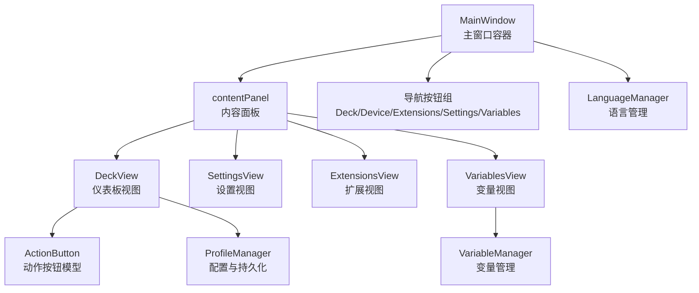
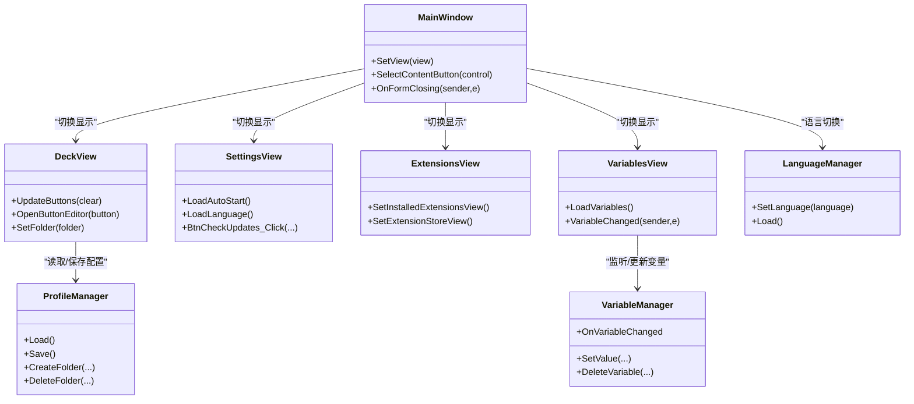
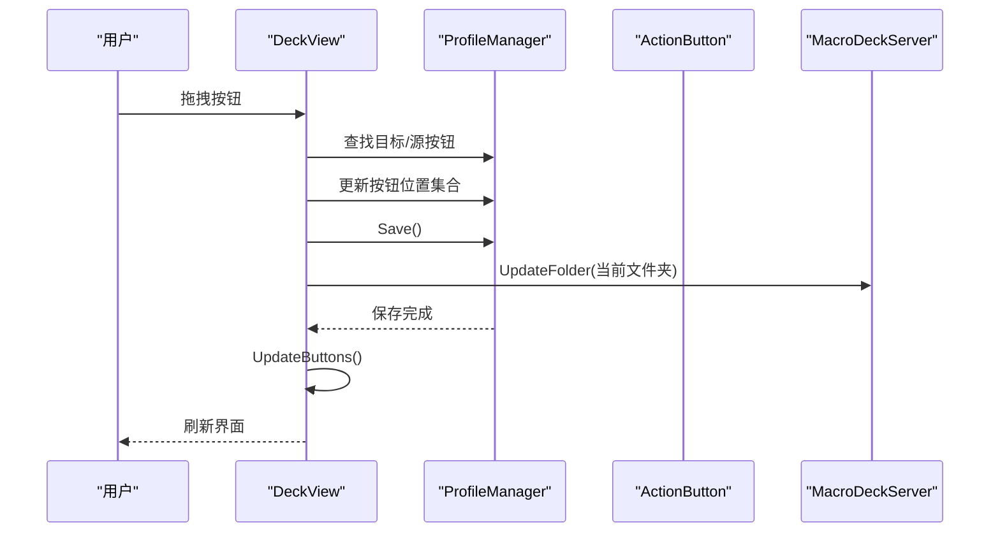
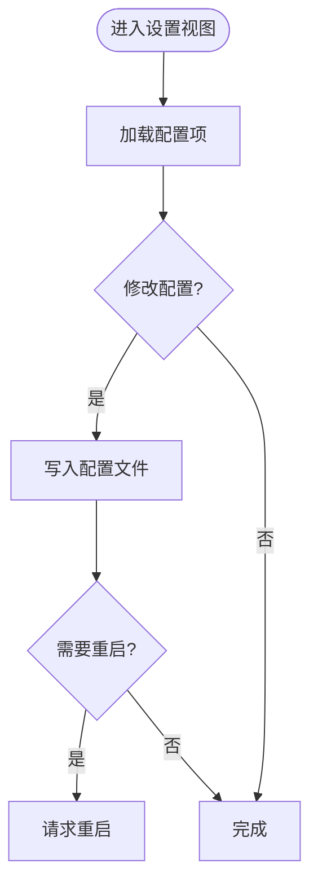
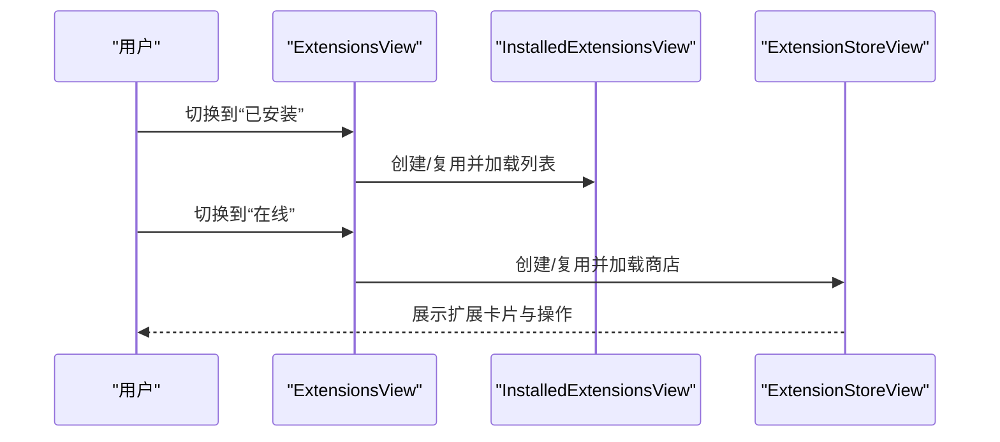
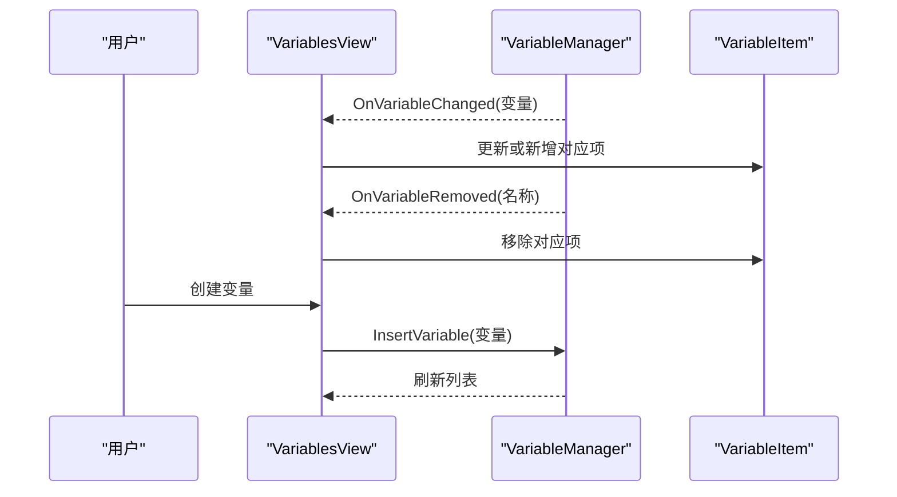
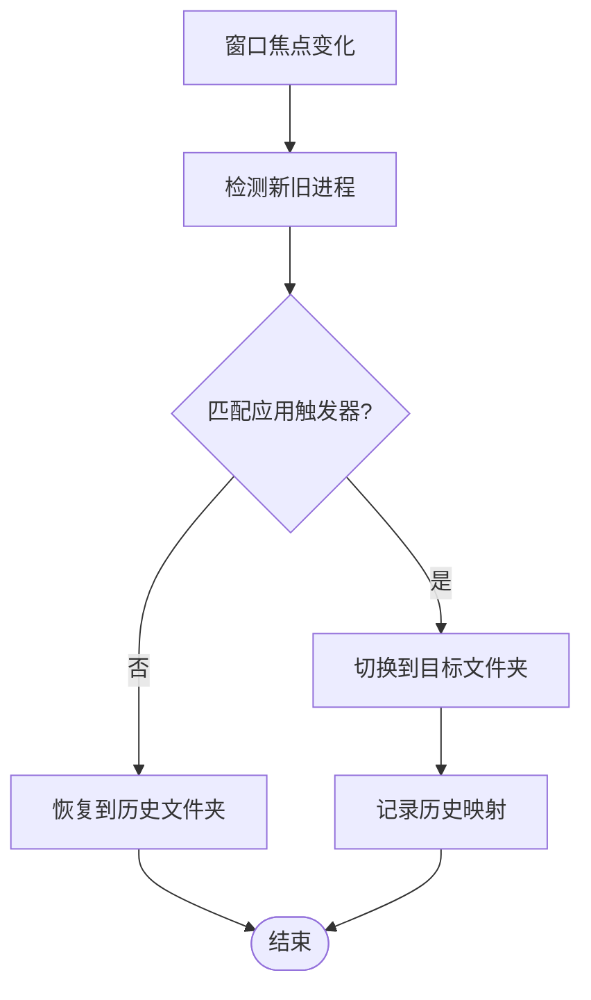
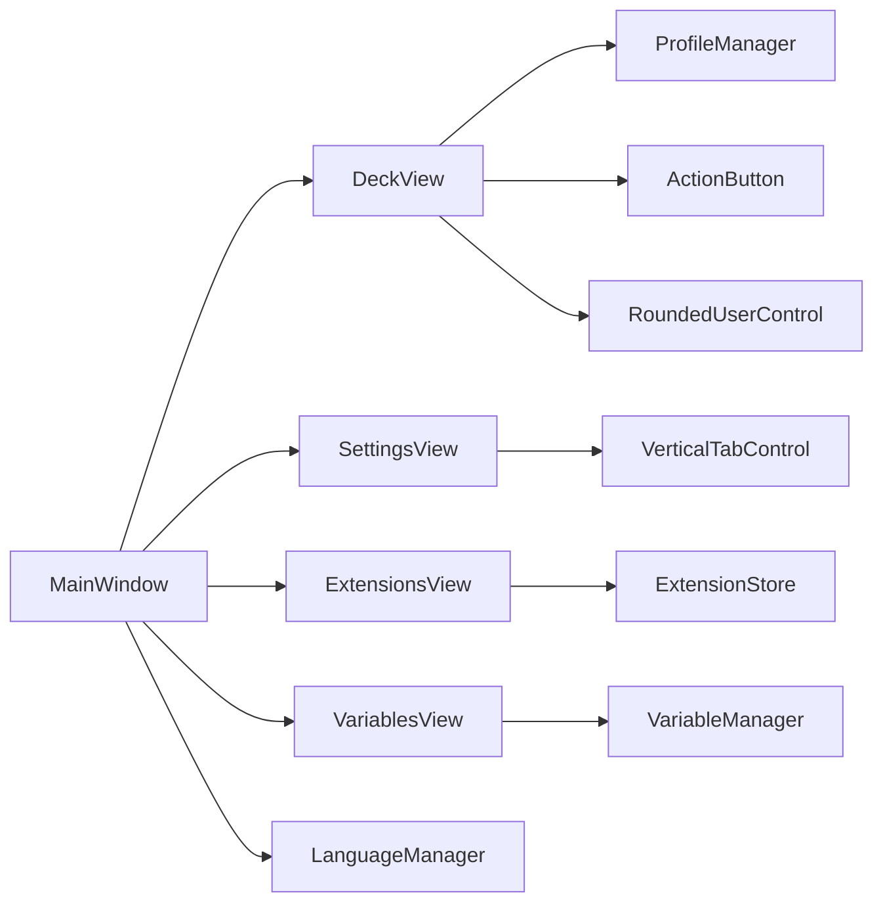

# 视图管理系统

<cite>
**本文档引用的文件**
- [MainWindow.cs](file://src/MacroDeck/GUI/MainWindow.cs)
- [DeckView.cs](file://src/MacroDeck/GUI/MainWindowViews/DeckView.cs)
- [SettingsView.cs](file://src/MacroDeck/GUI/MainWindowViews/SettingsView.cs)
- [ExtensionsView.cs](file://src/MacroDeck/GUI/MainWindowViews/ExtensionsView.cs)
- [VariablesView.cs](file://src/MacroDeck/GUI/MainWindowViews/VariablesView.cs)
- [LanguageManager.cs](file://src/MacroDeck/Language/LanguageManager.cs)
- [VariableManager.cs](file://src/MacroDeck/Variables/VariableManager.cs)
- [ProfileManager.cs](file://src/MacroDeck/Profiles/ProfileManager.cs)
- [RoundedUserControl.cs](file://src/MacroDeck/GUI/CustomControls/RoundedUserControl.cs)
- [VerticalTabControl.cs](file://src/MacroDeck/GUI/CustomControls/VerticalTabControl.cs)
- [ActionButton.cs](file://src/MacroDeck/ActionButton/ActionButton.cs)
- [ExtensionStoreView.cs](file://src/MacroDeck/GUI/CustomControls/ExtensionsView/ExtensionStoreView.cs)
- [InstalledExtensionsView.cs](file://src/MacroDeck/GUI/CustomControls/ExtensionsView/InstalledExtensionsView.cs)
</cite>

## 目录
1. [简介](#简介)
2. [项目结构](#项目结构)
3. [核心组件](#核心组件)
4. [架构总览](#架构总览)
5. [详细组件分析](#详细组件分析)
6. [依赖关系分析](#依赖关系分析)
7. [性能考虑](#性能考虑)
8. [故障排除指南](#故障排除指南)
9. [结论](#结论)

## 简介
本文件系统性梳理 Macro-Deck 的视图管理系统，覆盖视图容器、页面切换与状态持久化；详解仪表板视图、设置视图、扩展视图与变量视图的实现；记录视图间导航逻辑（含路由、参数传递与历史记录）；解释数据绑定与更新机制（实时同步与状态变更通知）；给出视图生命周期管理（初始化、激活、停用、销毁）；提供性能优化与内存管理建议；并说明国际化与本地化实现。

## 项目结构
视图系统采用“主窗口容器 + 多个视图控件”的模式：
- 主窗口负责内容面板的视图切换与全局交互
- 各视图以 UserControl 形式存在，按需实例化与复用
- 自定义控件提供统一的视觉与交互体验（圆角、垂直标签页等）

图表来源
- [MainWindow.cs:79-116](file://src/MacroDeck/GUI/MainWindow.cs#L79-L116)
- [DeckView.cs:36-52](file://src/MacroDeck/GUI/MainWindowViews/DeckView.cs#L36-L52)
- [SettingsView.cs:21-35](file://src/MacroDeck/GUI/MainWindowViews/SettingsView.cs#L21-L35)
- [ExtensionsView.cs:12-19](file://src/MacroDeck/GUI/MainWindowViews/ExtensionsView.cs#L12-L19)
- [VariablesView.cs:12-17](file://src/MacroDeck/GUI/MainWindowViews/VariablesView.cs#L12-L17)

章节来源
- [MainWindow.cs:39-145](file://src/MacroDeck/GUI/MainWindow.cs#L39-L145)
- [DeckView.cs:36-52](file://src/MacroDeck/GUI/MainWindowViews/DeckView.cs#L36-L52)

## 核心组件
- 视图容器与导航
  - MainWindow 提供 SetView 方法与导航按钮事件，负责在 contentPanel 中切换视图，并维护选中状态高亮
  - 支持延迟实例化与复用：如 DeckView 的懒加载与缓存
- 视图层
  - 仪表板视图：树形目录浏览、按钮网格布局、拖拽交换、热键指示、QR 与网络信息展示
  - 设置视图：垂直标签页、自动启动、错误上报、语言选择、端口与 SSL 配置、备份与更新检查
  - 扩展视图：在线商店与已安装扩展双视图切换，搜索与分页
  - 变量视图：变量列表、创建、过滤器、实时更新
- 数据与状态
  - ProfileManager 负责配置文件的加载、保存与迁移，维护当前配置与历史切换
  - VariableManager 提供变量的增删改查与变更通知
  - LanguageManager 提供多语言资源与切换事件

章节来源
- [MainWindow.cs:79-116](file://src/MacroDeck/GUI/MainWindow.cs#L79-L116)
- [DeckView.cs:110-200](file://src/MacroDeck/GUI/MainWindowViews/DeckView.cs#L110-L200)
- [SettingsView.cs:73-89](file://src/MacroDeck/GUI/MainWindowViews/SettingsView.cs#L73-L89)
- [ExtensionsView.cs:22-65](file://src/MacroDeck/GUI/MainWindowViews/ExtensionsView.cs#L22-L65)
- [VariablesView.cs:89-141](file://src/MacroDeck/GUI/MainWindowViews/VariablesView.cs#L89-L141)
- [ProfileManager.cs:205-311](file://src/MacroDeck/Profiles/ProfileManager.cs#L205-L311)
- [VariableManager.cs:10-28](file://src/MacroDeck/Variables/VariableManager.cs#L10-L28)
- [LanguageManager.cs:95-109](file://src/MacroDeck/Language/LanguageManager.cs#L95-L109)

## 架构总览
视图系统遵循“容器-视图-模型”分层：
- 容器层：MainWindow 统一调度与渲染
- 视图层：各视图封装自身业务与 UI 逻辑
- 模型层：ProfileManager/VariableManager/LanguageManager 提供数据与状态服务

图表来源
- [MainWindow.cs:79-116](file://src/MacroDeck/GUI/MainWindow.cs#L79-L116)
- [DeckView.cs:143-200](file://src/MacroDeck/GUI/MainWindowViews/DeckView.cs#L143-L200)
- [SettingsView.cs:73-89](file://src/MacroDeck/GUI/MainWindowViews/SettingsView.cs#L73-L89)
- [ExtensionsView.cs:52-65](file://src/MacroDeck/GUI/MainWindowViews/ExtensionsView.cs#L52-L65)
- [VariablesView.cs:89-141](file://src/MacroDeck/GUI/MainWindowViews/VariablesView.cs#L89-L141)
- [ProfileManager.cs:205-311](file://src/MacroDeck/Profiles/ProfileManager.cs#L205-L311)
- [VariableManager.cs:10-28](file://src/MacroDeck/Variables/VariableManager.cs#L10-L28)
- [LanguageManager.cs:95-109](file://src/MacroDeck/Language/LanguageManager.cs#L95-L109)

## 详细组件分析

### 仪表板视图（DeckView）
- 页面结构与布局
  - 树形目录浏览：递归构建节点，支持展开/折叠与右键菜单
  - 按钮网格：根据行、列、间距计算按钮尺寸与位置，动态生成圆角按钮
- 交互与行为
  - 拖拽交换：支持按钮间互换位置，异步保存并广播到设备
  - 右键菜单：编辑、复制、粘贴、删除、模拟按键
  - 热键指示：根据按键组合显示提示
- 实时更新
  - 监听按钮状态、图标与标签变化，即时刷新 UI
  - 响应窗口大小变化与状态栏切换，重新布局
- 性能与内存
  - 使用双缓冲绘制与延迟加载，避免最小化时的无效布局
  - Dispose 时移除事件订阅与释放背景图资源

图表来源
- [DeckView.cs:374-447](file://src/MacroDeck/GUI/MainWindowViews/DeckView.cs#L374-L447)
- [DeckView.cs:143-200](file://src/MacroDeck/GUI/MainWindowViews/DeckView.cs#L143-L200)
- [ProfileManager.cs:313-380](file://src/MacroDeck/Profiles/ProfileManager.cs#L313-L380)

章节来源
- [DeckView.cs:110-200](file://src/MacroDeck/GUI/MainWindowViews/DeckView.cs#L110-L200)
- [DeckView.cs:279-360](file://src/MacroDeck/GUI/MainWindowViews/DeckView.cs#L279-L360)
- [DeckView.cs:467-534](file://src/MacroDeck/GUI/MainWindowViews/DeckView.cs#L467-L534)
- [DeckView.cs:547-578](file://src/MacroDeck/GUI/MainWindowViews/DeckView.cs#L547-L578)

### 设置视图（SettingsView）
- 功能模块
  - 通用：自动启动、错误上报、语言选择
  - 连接：端口、SSL、ADB 开关与自动启动
  - 更新：自动检查、版本通道、更新检查
  - 备份：创建备份、列出备份项
- 交互与持久化
  - 修改即保存至配置文件，必要时请求重启
  - 异步检查更新，失败日志记录

图表来源
- [SettingsView.cs:73-89](file://src/MacroDeck/GUI/MainWindowViews/SettingsView.cs#L73-L89)
- [SettingsView.cs:200-210](file://src/MacroDeck/GUI/MainWindowViews/SettingsView.cs#L200-L210)
- [SettingsView.cs:224-262](file://src/MacroDeck/GUI/MainWindowViews/SettingsView.cs#L224-L262)

章节来源
- [SettingsView.cs:21-35](file://src/MacroDeck/GUI/MainWindowViews/SettingsView.cs#L21-L35)
- [SettingsView.cs:91-102](file://src/MacroDeck/GUI/MainWindowViews/SettingsView.cs#L91-L102)
- [SettingsView.cs:104-123](file://src/MacroDeck/GUI/MainWindowViews/SettingsView.cs#L104-L123)
- [SettingsView.cs:200-210](file://src/MacroDeck/GUI/MainWindowViews/SettingsView.cs#L200-L210)

### 扩展视图（ExtensionsView）
- 双视图模式
  - 已安装视图：插件与图标包列表，支持配置、更新、卸载
  - 在线商店视图：分页、搜索、安装
- 导航与参数
  - 单选框切换视图，内部通过 contentPanel 替换子控件
  - 通过事件解耦视图间的跳转（如从商店返回已安装）

图表来源
- [ExtensionsView.cs:22-65](file://src/MacroDeck/GUI/MainWindowViews/ExtensionsView.cs#L22-L65)
- [InstalledExtensionsView.cs:37-78](file://src/MacroDeck/GUI/CustomControls/ExtensionsView/InstalledExtensionsView.cs#L37-L78)
- [ExtensionStoreView.cs:66-109](file://src/MacroDeck/GUI/CustomControls/ExtensionsView/ExtensionStoreView.cs#L66-L109)

章节来源
- [ExtensionsView.cs:12-19](file://src/MacroDeck/GUI/MainWindowViews/ExtensionsView.cs#L12-L19)
- [ExtensionsView.cs:52-65](file://src/MacroDeck/GUI/MainWindowViews/ExtensionsView.cs#L52-L65)
- [InstalledExtensionsView.cs:37-78](file://src/MacroDeck/GUI/CustomControls/ExtensionsView/InstalledExtensionsView.cs#L37-L78)
- [ExtensionStoreView.cs:66-109](file://src/MacroDeck/GUI/CustomControls/ExtensionsView/ExtensionStoreView.cs#L66-L109)

### 变量视图（VariablesView）
- 列表与筛选
  - 加载变量列表，按创建者生成过滤器复选框
  - 支持动态隐藏/显示变量项
- 实时更新
  - 订阅 VariableManager.OnVariableChanged/Removed，增量更新 UI
- 交互
  - 创建新变量对话框，插入后刷新列表

图表来源
- [VariablesView.cs:89-141](file://src/MacroDeck/GUI/MainWindowViews/VariablesView.cs#L89-L141)
- [VariableManager.cs:16-18](file://src/MacroDeck/Variables/VariableManager.cs#L16-L18)

章节来源
- [VariablesView.cs:19-29](file://src/MacroDeck/GUI/MainWindowViews/VariablesView.cs#L19-L29)
- [VariablesView.cs:89-141](file://src/MacroDeck/GUI/MainWindowViews/VariablesView.cs#L89-L141)
- [VariableManager.cs:10-28](file://src/MacroDeck/Variables/VariableManager.cs#L10-L28)

### 导航逻辑与历史记录
- 路由与参数
  - MainWindow 通过按钮事件触发 SetView 切换视图，不使用传统 URL 路由
  - 参数传递通过构造函数或属性注入（如 SettingsView(page)）
- 历史记录
  - ProfileManager 维护客户端与进程焦点切换的历史映射，用于恢复先前文件夹
  - 通过并发字典跟踪切换前后的文件夹与进程名

图表来源
- [ProfileManager.cs:62-125](file://src/MacroDeck/Profiles/ProfileManager.cs#L62-L125)

章节来源
- [MainWindow.cs:206-238](file://src/MacroDeck/GUI/MainWindow.cs#L206-L238)
- [ProfileManager.cs:33-35](file://src/MacroDeck/Profiles/ProfileManager.cs#L33-L35)

### 数据绑定与更新机制
- 实时数据同步
  - ActionButton 状态变化触发服务器更新与事件通知
  - 变量值变化通过模板渲染更新按钮标签位图
- 状态变更通知
  - LanguageManager 暴露 LanguageChanged 事件，视图收到后调用 UpdateTranslation
  - VariableManager 暴露 OnVariableChanged/Removed 事件，变量视图响应更新

章节来源
- [ActionButton.cs:111-128](file://src/MacroDeck/ActionButton/ActionButton.cs#L111-L128)
- [ProfileManager.cs:127-203](file://src/MacroDeck/Profiles/ProfileManager.cs#L127-L203)
- [LanguageManager.cs:12-12](file://src/MacroDeck/Language/LanguageManager.cs#L12-L12)
- [VariablesView.cs:93-95](file://src/MacroDeck/GUI/MainWindowViews/VariablesView.cs#L93-L95)

### 生命周期管理
- 初始化
  - MainWindow 构造时加载翻译、注册事件、创建 DeckView
  - 各视图在 Load 或首次访问时加载数据
- 激活/停用
  - SetView 时移除非当前视图控件，保留 DeckView 以便快速刷新
- 销毁
  - 关闭窗体时遍历 contentPanel 控件并 Dispose
  - ActionButton 在 Dispose 中移除热键与事件订阅

章节来源
- [MainWindow.cs:39-49](file://src/MacroDeck/GUI/MainWindow.cs#L39-L49)
- [MainWindow.cs:118-145](file://src/MacroDeck/GUI/MainWindow.cs#L118-L145)
- [MainWindow.cs:227-233](file://src/MacroDeck/GUI/MainWindow.cs#L227-L233)
- [ActionButton.cs:43-78](file://src/MacroDeck/ActionButton/ActionButton.cs#L43-L78)

### 国际化与本地化
- 语言资源
  - LanguageManager 从嵌入资源加载多语言 JSON，暴露 Strings 与 Languages
  - 支持导出默认语言与动态切换
- 视图适配
  - 各视图在构造或 Load 时调用 UpdateTranslation 更新文本
  - SettingsView 通过下拉框选择语言并立即生效

章节来源
- [LanguageManager.cs:20-70](file://src/MacroDeck/Language/LanguageManager.cs#L20-L70)
- [LanguageManager.cs:95-109](file://src/MacroDeck/Language/LanguageManager.cs#L95-L109)
- [SettingsView.cs:21-35](file://src/MacroDeck/GUI/MainWindowViews/SettingsView.cs#L21-L35)
- [SettingsView.cs:270-276](file://src/MacroDeck/GUI/MainWindowViews/SettingsView.cs#L270-L276)

## 依赖关系分析
- 视图对模型的依赖
  - DeckView 依赖 ProfileManager 与 ActionButton
  - VariablesView 依赖 VariableManager
  - ExtensionsView 依赖 ExtensionStore 与插件/图标包管理
- 视图对容器的依赖
  - 所有视图通过 MainWindow 的 SetView 进行切换
- 自定义控件的作用
  - RoundedUserControl 提供圆角绘制与双缓冲
  - VerticalTabControl 提供垂直标签页与通知点

图表来源
- [MainWindow.cs:79-116](file://src/MacroDeck/GUI/MainWindow.cs#L79-L116)
- [DeckView.cs:36-52](file://src/MacroDeck/GUI/MainWindowViews/DeckView.cs#L36-L52)
- [SettingsView.cs:21-35](file://src/MacroDeck/GUI/MainWindowViews/SettingsView.cs#L21-L35)
- [ExtensionsView.cs:12-19](file://src/MacroDeck/GUI/MainWindowViews/ExtensionsView.cs#L12-L19)
- [VariablesView.cs:12-17](file://src/MacroDeck/GUI/MainWindowViews/VariablesView.cs#L12-L17)
- [RoundedUserControl.cs:16-49](file://src/MacroDeck/GUI/CustomControls/RoundedUserControl.cs#L16-L49)
- [VerticalTabControl.cs:59-155](file://src/MacroDeck/GUI/CustomControls/VerticalTabControl.cs#L59-L155)

章节来源
- [RoundedUserControl.cs:16-49](file://src/MacroDeck/GUI/CustomControls/RoundedUserControl.cs#L16-L49)
- [VerticalTabControl.cs:59-155](file://src/MacroDeck/GUI/CustomControls/VerticalTabControl.cs#L59-L155)

## 性能考虑
- 渲染优化
  - 使用双缓冲绘制（RoundedUserControl、VerticalTabControl），减少闪烁
  - DeckView 对最小化窗口进行短路，避免负尺寸导致的布局异常
- 异步与取消
  - 扩展商店加载使用 CancellationTokenSource 取消上一次请求，降低抖动
- 内存管理
  - 视图切换时及时 Dispose 非当前视图控件
  - ActionButton 在 Dispose 中移除事件订阅与热键，防止泄漏
- 持久化锁
  - ProfileManager.Save 使用锁保护，避免并发写冲突

章节来源
- [RoundedUserControl.cs:12-13](file://src/MacroDeck/GUI/CustomControls/RoundedUserControl.cs#L12-L13)
- [VerticalTabControl.cs:14-18](file://src/MacroDeck/GUI/CustomControls/VerticalTabControl.cs#L14-L18)
- [DeckView.cs:153-156](file://src/MacroDeck/GUI/MainWindowViews/DeckView.cs#L153-L156)
- [ExtensionStoreView.cs:71-73](file://src/MacroDeck/GUI/CustomControls/ExtensionsView/ExtensionStoreView.cs#L71-L73)
- [MainWindow.cs:227-233](file://src/MacroDeck/GUI/MainWindow.cs#L227-L233)
- [ActionButton.cs:54-56](file://src/MacroDeck/ActionButton/ActionButton.cs#L54-L56)
- [ProfileManager.cs:320-321](file://src/MacroDeck/Profiles/ProfileManager.cs#L320-L321)

## 故障排除指南
- 视图未显示或空白
  - 检查 DeckView.UpdateButtons 是否被最小化短路
  - 确认 contentPanel 中仅保留一个视图控件
- 按钮无响应或状态不同步
  - 确认 ActionButton 事件订阅是否正确添加/移除
  - 检查 VariableManager.OnVariableChanged 是否触发
- 语言切换无效
  - 确认 LanguageManager.SetLanguage 已调用并触发 LanguageChanged
  - 检查各视图是否调用 UpdateTranslation

章节来源
- [DeckView.cs:153-156](file://src/MacroDeck/GUI/MainWindowViews/DeckView.cs#L153-L156)
- [MainWindow.cs:86-94](file://src/MacroDeck/GUI/MainWindow.cs#L86-L94)
- [ActionButton.cs:32-38](file://src/MacroDeck/ActionButton/ActionButton.cs#L32-L38)
- [VariableManager.cs:16-18](file://src/MacroDeck/Variables/VariableManager.cs#L16-L18)
- [LanguageManager.cs:108-108](file://src/MacroDeck/Language/LanguageManager.cs#L108-L108)

## 结论
Macro-Deck 的视图管理系统以 MainWindow 为核心容器，通过视图控件实现功能解耦；结合 ProfileManager/VariableManager/LanguageManager 提供数据与状态服务，形成清晰的分层架构。系统在渲染、异步与内存方面具备良好实践，同时通过事件驱动实现数据的实时同步与状态通知。扩展视图与变量视图分别覆盖生态与数据两大关键领域，配合导航与历史记录机制，构成完整的桌面端控制台体验。