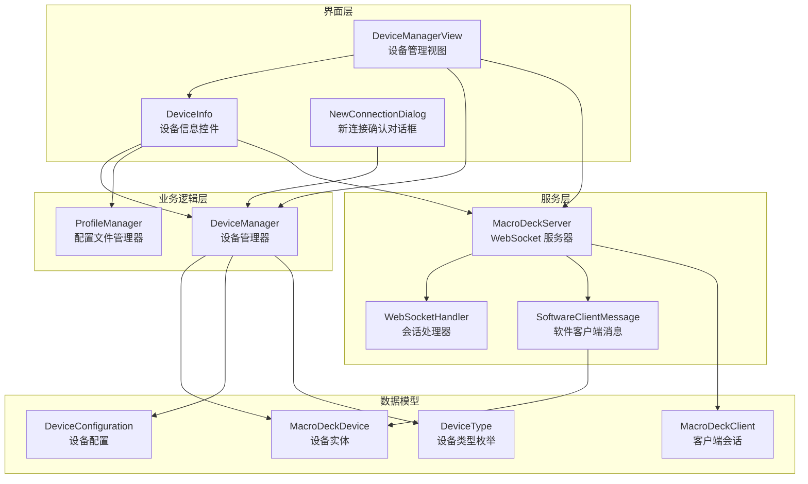
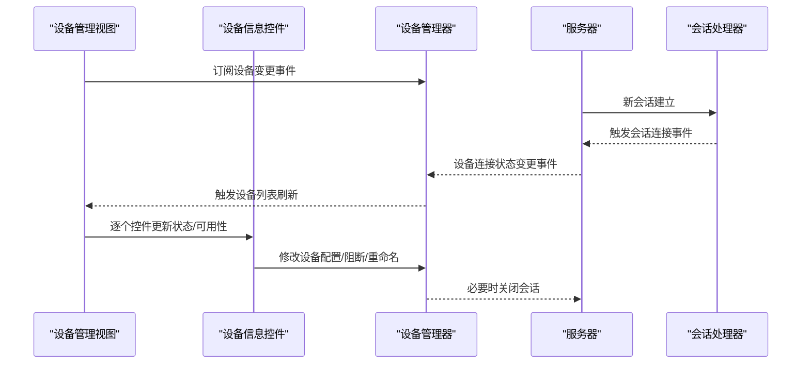
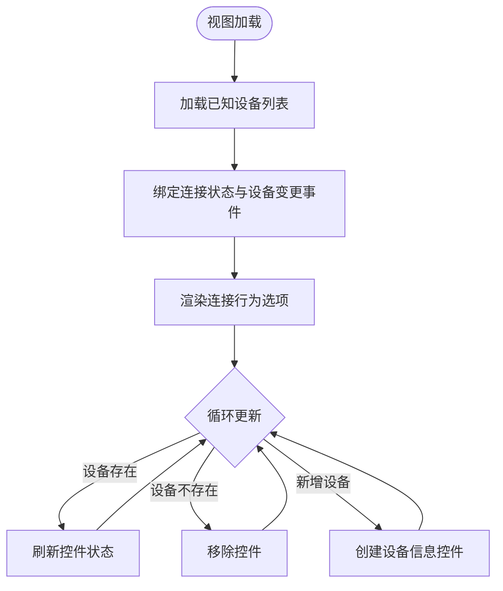
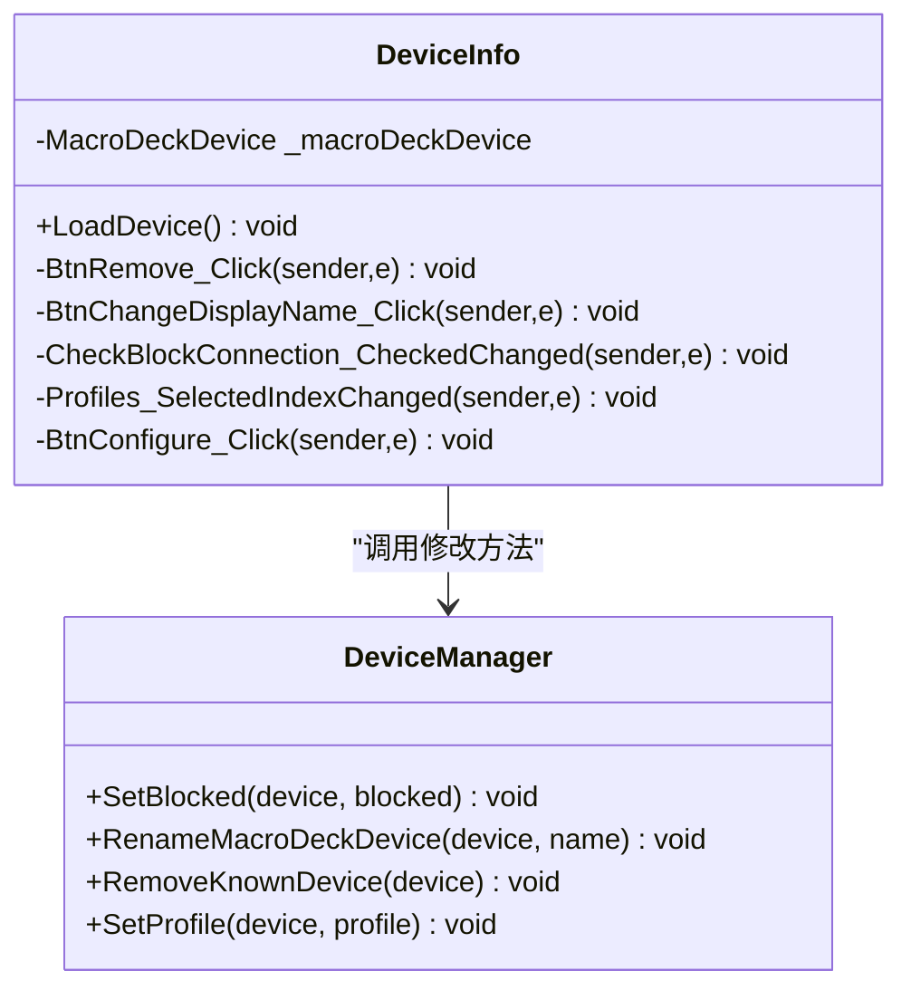
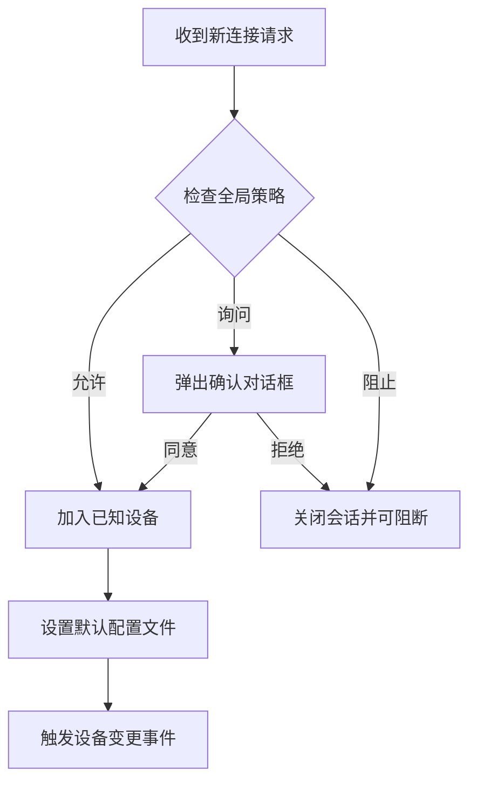
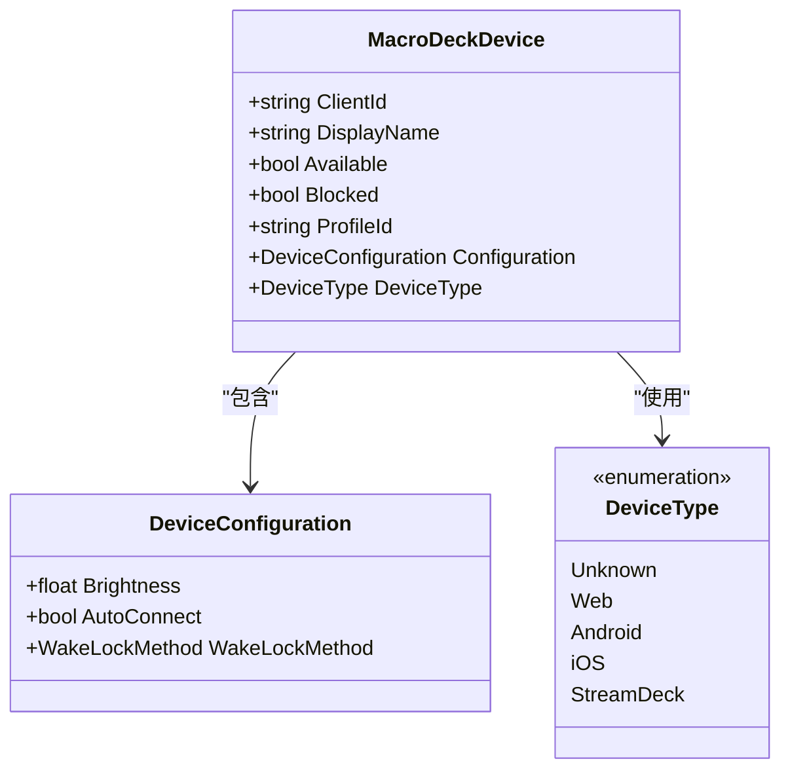
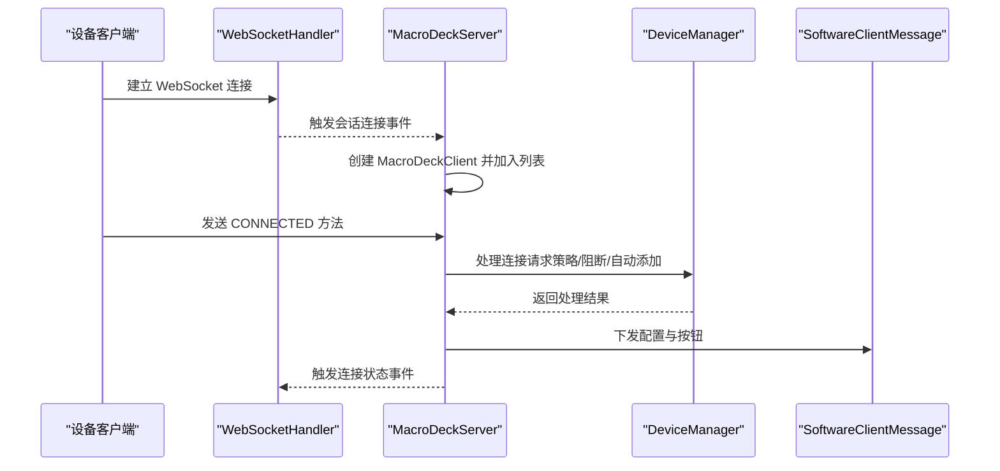
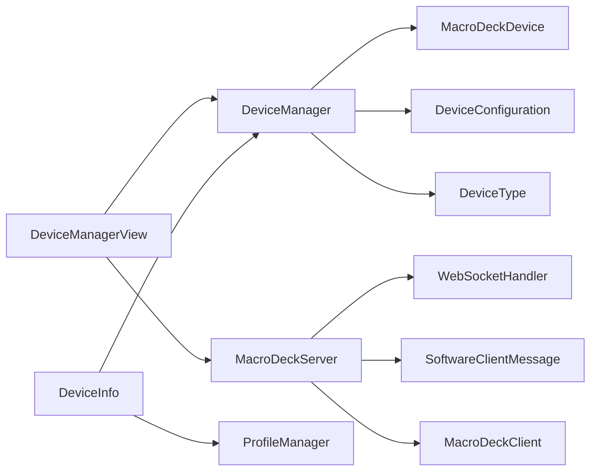

# 设备管理视图

<cite>
**本文档引用的文件**
- [DeviceManagerView.cs](file://src/MacroDeck/GUI/MainWindowViews/DeviceManagerView.cs)
- [DeviceManagerView.Designer.cs](file://src/MacroDeck/GUI/MainWindowViews/DeviceManagerView.Designer.cs)
- [DeviceManager.cs](file://src/MacroDeck/Device/DeviceManager.cs)
- [MacroDeckDevice.cs](file://src/MacroDeck/Device/MacroDeckDevice.cs)
- [DeviceConfiguration.cs](file://src/MacroDeck/Device/DeviceConfiguration.cs)
- [DeviceType.cs](file://src/MacroDeck/Device/DeviceType.cs)
- [DeviceInfo.cs](file://src/MacroDeck/GUI/CustomControls/DeviceInfo.cs)
- [NewConnectionDialog.cs](file://src/MacroDeck/GUI/Dialogs/NewConnectionDialog.cs)
- [MacroDeckServer.cs](file://src/MacroDeck/Server/MacroDeckServer.cs)
- [MacroDeckClient.cs](file://src/MacroDeck/Server/MacroDeckClient.cs)
- [SoftwareClientMessage.cs](file://src/MacroDeck/Server/DeviceMessage/SoftwareClientMessage.cs)
- [WebSocketHandler.cs](file://src/MacroDeck/WebSocketHandler.cs)
- [ProfileManager.cs](file://src/MacroDeck/Profiles/ProfileManager.cs)
</cite>

## 目录
1. [简介](#简介)
2. [项目结构](#项目结构)
3. [核心组件](#核心组件)
4. [架构总览](#架构总览)
5. [详细组件分析](#详细组件分析)
6. [依赖关系分析](#依赖关系分析)
7. [性能考虑](#性能考虑)
8. [故障排除指南](#故障排除指南)
9. [结论](#结论)
10. [附录](#附录)

## 简介
本文件面向 Macro-Deck 的“设备管理视图”，系统性阐述其架构设计与功能实现，覆盖以下主题：
- 设备列表展示与实时状态更新
- 连接状态监控与异常处理
- 设备配置管理（名称、类型、参数）
- 设备发现与连接机制（自动扫描与手动添加）
- 批量操作与配置导入导出能力
- 与服务器系统的集成与通信协议

该视图通过事件驱动的方式刷新设备列表，结合设备管理器持久化策略与服务器端 WebSocket 会话状态，实现从“已知设备”到“在线设备”的双向同步。

## 项目结构
设备管理视图位于主窗口的多视图之一，采用 WinForms 控件组合与自定义控件 DeviceInfo 呈现每个设备项；设备数据模型由 DeviceManager 统一管理，服务器侧通过 WebSocketHandler 与 MacroDeckServer 协调连接生命周期与消息分发。

图表来源
- [DeviceManagerView.cs:1-86](file://src/MacroDeck/GUI/MainWindowViews/DeviceManagerView.cs#L1-L86)
- [DeviceManager.cs:1-278](file://src/MacroDeck/Device/DeviceManager.cs#L1-L278)
- [MacroDeckServer.cs:1-376](file://src/MacroDeck/Server/MacroDeckServer.cs#L1-L376)
- [WebSocketHandler.cs:1-92](file://src/MacroDeck/WebSocketHandler.cs#L1-L92)
- [SoftwareClientMessage.cs:1-194](file://src/MacroDeck/Server/DeviceMessage/SoftwareClientMessage.cs#L1-L194)
- [MacroDeckDevice.cs:1-34](file://src/MacroDeck/Device/MacroDeckDevice.cs#L1-L34)
- [MacroDeckClient.cs:1-53](file://src/MacroDeck/Server/MacroDeckClient.cs#L1-L53)
- [DeviceConfiguration.cs:1-16](file://src/MacroDeck/Device/DeviceConfiguration.cs#L1-L16)
- [DeviceType.cs:1-11](file://src/MacroDeck/Device/DeviceType.cs#L1-L11)
- [ProfileManager.cs:1-640](file://src/MacroDeck/Profiles/ProfileManager.cs#L1-L640)

章节来源
- [DeviceManagerView.cs:1-86](file://src/MacroDeck/GUI/MainWindowViews/DeviceManagerView.cs#L1-L86)
- [DeviceManagerView.Designer.cs:64-168](file://src/MacroDeck/GUI/MainWindowViews/DeviceManagerView.Designer.cs#L64-L168)

## 核心组件
- 设备管理视图 DeviceManagerView：负责加载设备列表、绑定连接状态变更事件、渲染行为选项（允许全部/询问/阻止）。
- 设备信息控件 DeviceInfo：单个设备卡片，支持重命名、阻断连接、选择配置文件、打开设备配置对话框等。
- 设备管理器 DeviceManager：维护“已知设备”集合，提供增删改查、连接请求处理、阻断与自动连接策略、持久化。
- 宏命令设备 MacroDeckDevice：设备实体，包含标识、显示名、可用性判断、阻断标记、配置对象、设备类型等。
- 服务器端 MacroDeckServer：启动 WebSocket 服务器，处理连接建立、断开、消息路由、按钮事件转发、配置下发。
- 会话处理器 WebSocketHandler：统一管理 WebSocket 会话的建立、消息广播、断开清理。
- 软件客户端消息 SoftwareClientMessage：向设备端发送配置、按钮状态更新等消息。
- 配置文件管理器 ProfileManager：管理配置文件集合与当前选中配置，影响设备默认配置与按钮布局。

章节来源
- [DeviceManagerView.cs:1-86](file://src/MacroDeck/GUI/MainWindowViews/DeviceManagerView.cs#L1-L86)
- [DeviceInfo.cs:1-123](file://src/MacroDeck/GUI/CustomControls/DeviceInfo.cs#L1-L123)
- [DeviceManager.cs:1-278](file://src/MacroDeck/Device/DeviceManager.cs#L1-L278)
- [MacroDeckDevice.cs:1-34](file://src/MacroDeck/Device/MacroDeckDevice.cs#L1-L34)
- [MacroDeckServer.cs:1-376](file://src/MacroDeck/Server/MacroDeckServer.cs#L1-L376)
- [WebSocketHandler.cs:1-92](file://src/MacroDeck/WebSocketHandler.cs#L1-L92)
- [SoftwareClientMessage.cs:1-194](file://src/MacroDeck/Server/DeviceMessage/SoftwareClientMessage.cs#L1-L194)
- [ProfileManager.cs:1-640](file://src/MacroDeck/Profiles/ProfileManager.cs#L1-L640)

## 架构总览
设备管理视图通过事件订阅实现“所见即所得”的实时更新：当服务器端设备连接状态变化或本地设备集合变化时，视图触发重新加载，确保 UI 与实际状态一致。

图表来源
- [DeviceManagerView.cs:23-43](file://src/MacroDeck/GUI/MainWindowViews/DeviceManagerView.cs#L23-L43)
- [DeviceManager.cs:185-238](file://src/MacroDeck/Device/DeviceManager.cs#L185-L238)
- [MacroDeckServer.cs:74-110](file://src/MacroDeck/Server/MacroDeckServer.cs#L74-L110)
- [WebSocketHandler.cs:37-49](file://src/MacroDeck/WebSocketHandler.cs#L37-L49)

## 详细组件分析

### 设备管理视图 DeviceManagerView
职责与流程
- 初始化：设置标题与标签文本，绑定语言资源。
- 加载设备：首次加载与事件回调时重建设备列表，移除不存在的控件，新增缺失的控件，刷新现有控件。
- 实时更新：订阅服务器连接状态与设备集合变更事件，触发刷新。
- 行为选项：根据配置切换“允许全部新连接/询问/阻止”，并持久化到主配置文件。

图表来源
- [DeviceManagerView.cs:23-77](file://src/MacroDeck/GUI/MainWindowViews/DeviceManagerView.cs#L23-L77)

章节来源
- [DeviceManagerView.cs:1-86](file://src/MacroDeck/GUI/MainWindowViews/DeviceManagerView.cs#L1-L86)
- [DeviceManagerView.Designer.cs:64-168](file://src/MacroDeck/GUI/MainWindowViews/DeviceManagerView.Designer.cs#L64-L168)

### 设备信息控件 DeviceInfo
职责与交互
- 渲染设备信息：显示 ID、状态（在线/离线）、名称、配置文件下拉框、阻断开关。
- 操作入口：删除设备（必要时关闭会话）、重命名设备、阻断连接、选择配置文件、打开设备配置对话框。
- 可用性控制：根据设备类型与在线状态决定控件可见性与可编辑性。

图表来源
- [DeviceInfo.cs:1-123](file://src/MacroDeck/GUI/CustomControls/DeviceInfo.cs#L1-L123)
- [DeviceManager.cs:131-171](file://src/MacroDeck/Device/DeviceManager.cs#L131-L171)

章节来源
- [DeviceInfo.cs:1-123](file://src/MacroDeck/GUI/CustomControls/DeviceInfo.cs#L1-L123)

### 设备管理器 DeviceManager
职责与策略
- 数据持久化：以 JSON 文件存储“已知设备”列表，带临时文件写入与原子替换，避免损坏。
- 设备集合管理：增删改查、去重（按 ClientId）、校验显示名唯一性。
- 连接请求处理：根据全局行为策略（允许/询问/阻止）决定是否接受新设备；询问模式弹出对话框，支持自动添加与阻断。
- 在线状态联动：阻断在线设备时主动关闭会话；设置配置文件时同步至服务器端。

图表来源
- [DeviceManager.cs:185-238](file://src/MacroDeck/Device/DeviceManager.cs#L185-L238)
- [NewConnectionDialog.cs:1-71](file://src/MacroDeck/GUI/Dialogs/NewConnectionDialog.cs#L1-L71)

章节来源
- [DeviceManager.cs:1-278](file://src/MacroDeck/Device/DeviceManager.cs#L1-L278)
- [NewConnectionDialog.cs:1-71](file://src/MacroDeck/GUI/Dialogs/NewConnectionDialog.cs#L1-L71)

### 宏命令设备 MacroDeckDevice 与设备配置 DeviceConfiguration
- 可用性判断：通过服务器端会话是否存在与可用性判断设备在线状态。
- 配置项：亮度、自动连接、唤醒锁策略（始终/连接时/从不）。
- 类型：支持未知、Web、Android、iOS、StreamDeck 等类型。

图表来源
- [MacroDeckDevice.cs:1-34](file://src/MacroDeck/Device/MacroDeckDevice.cs#L1-L34)
- [DeviceConfiguration.cs:1-16](file://src/MacroDeck/Device/DeviceConfiguration.cs#L1-L16)
- [DeviceType.cs:1-11](file://src/MacroDeck/Device/DeviceType.cs#L1-L11)

章节来源
- [MacroDeckDevice.cs:1-34](file://src/MacroDeck/Device/MacroDeckDevice.cs#L1-L34)
- [DeviceConfiguration.cs:1-16](file://src/MacroDeck/Device/DeviceConfiguration.cs#L1-L16)
- [DeviceType.cs:1-11](file://src/MacroDeck/Device/DeviceType.cs#L1-L11)

### 服务器与通信协议
- WebSocket 启动：服务器初始化时加载已知设备，启动异步 WebSocket 服务，注册会话连接/断开/消息事件。
- 连接生命周期：新会话接入后创建客户端实例，根据策略与配置决定是否接受；断开会话时清理并通知。
- 消息处理：解析客户端上报的方法名（如 CONNECTED、BUTTON_PRESS 等），执行相应动作（设置 ClientId、设备类型、下发配置与按钮）。
- 设备消息：软件客户端消息类负责发送配置、按钮全量与增量更新，支持并发发送与状态同步。

图表来源
- [MacroDeckServer.cs:34-55](file://src/MacroDeck/Server/MacroDeckServer.cs#L34-L55)
- [MacroDeckServer.cs:141-200](file://src/MacroDeck/Server/MacroDeckServer.cs#L141-L200)
- [SoftwareClientMessage.cs:14-23](file://src/MacroDeck/Server/DeviceMessage/SoftwareClientMessage.cs#L14-L23)
- [WebSocketHandler.cs:37-49](file://src/MacroDeck/WebSocketHandler.cs#L37-L49)

章节来源
- [MacroDeckServer.cs:1-376](file://src/MacroDeck/Server/MacroDeckServer.cs#L1-L376)
- [WebSocketHandler.cs:1-92](file://src/MacroDeck/WebSocketHandler.cs#L1-L92)
- [SoftwareClientMessage.cs:1-194](file://src/MacroDeck/Server/DeviceMessage/SoftwareClientMessage.cs#L1-L194)

### 配置文件与批量操作
- 配置文件管理：ProfileManager 负责加载/保存配置文件集合，维护当前选中配置，支持创建/删除/迁移旧数据库。
- 批量操作：通过设备管理器对多个设备进行阻断、重命名、设置配置文件等操作；服务器端可对同一文件夹下的按钮进行批量更新。

章节来源
- [ProfileManager.cs:205-380](file://src/MacroDeck/Profiles/ProfileManager.cs#L205-L380)
- [DeviceManager.cs:117-129](file://src/MacroDeck/Device/DeviceManager.cs#L117-L129)

## 依赖关系分析
- 视图层依赖设备管理器与服务器事件，确保 UI 与后端状态一致。
- 设备管理器依赖配置文件路径与序列化工具，保证数据持久化安全。
- 服务器端依赖会话处理器与消息分发器，实现设备间通信。
- 设备配置与类型枚举被设备实体与消息类广泛使用。

图表来源
- [DeviceManagerView.cs:1-86](file://src/MacroDeck/GUI/MainWindowViews/DeviceManagerView.cs#L1-L86)
- [DeviceManager.cs:1-278](file://src/MacroDeck/Device/DeviceManager.cs#L1-L278)
- [MacroDeckServer.cs:1-376](file://src/MacroDeck/Server/MacroDeckServer.cs#L1-L376)
- [DeviceInfo.cs:1-123](file://src/MacroDeck/GUI/CustomControls/DeviceInfo.cs#L1-L123)
- [ProfileManager.cs:1-640](file://src/MacroDeck/Profiles/ProfileManager.cs#L1-L640)

章节来源
- [DeviceManagerView.cs:1-86](file://src/MacroDeck/GUI/MainWindowViews/DeviceManagerView.cs#L1-L86)
- [DeviceManager.cs:1-278](file://src/MacroDeck/Device/DeviceManager.cs#L1-L278)
- [MacroDeckServer.cs:1-376](file://src/MacroDeck/Server/MacroDeckServer.cs#L1-L376)

## 性能考虑
- 列表渲染优化：在 UI 线程中批量更新控件，避免频繁创建销毁控件；仅对存在但未匹配的控件执行移除。
- 并发消息发送：软件客户端消息类使用并发集合与并行处理按钮列表，提升批量更新效率。
- 序列化与持久化：采用临时文件写入与原子替换，减少文件损坏风险；加锁保护保存过程。
- 事件驱动刷新：通过事件而非轮询更新，降低 CPU 占用。

章节来源
- [DeviceManagerView.cs:45-77](file://src/MacroDeck/GUI/MainWindowViews/DeviceManagerView.cs#L45-L77)
- [SoftwareClientMessage.cs:25-97](file://src/MacroDeck/Server/DeviceMessage/SoftwareClientMessage.cs#L25-L97)
- [DeviceManager.cs:53-81](file://src/MacroDeck/Device/DeviceManager.cs#L53-L81)

## 故障排除指南
常见问题与处理
- 设备无法连接
  - 检查服务器启动日志与证书生成；确认防火墙放行端口。
  - 查看连接行为策略是否为“阻止全部”。
- 设备显示离线
  - 确认 WebSocket 会话仍存在于处理器中；查看设备是否被阻断。
  - 若设备类型变更，需在连接成功后同步类型信息。
- 重命名失败
  - 显示名重复时会弹出提示；请使用唯一名称。
- 配置未生效
  - 确认设备处于在线状态；服务器会根据设备配置下发参数。

章节来源
- [MacroDeckServer.cs:34-55](file://src/MacroDeck/Server/MacroDeckServer.cs#L34-L55)
- [WebSocketHandler.cs:76-91](file://src/MacroDeck/WebSocketHandler.cs#L76-L91)
- [DeviceInfo.cs:90-101](file://src/MacroDeck/GUI/CustomControls/DeviceInfo.cs#L90-L101)
- [SoftwareClientMessage.cs:99-122](file://src/MacroDeck/Server/DeviceMessage/SoftwareClientMessage.cs#L99-L122)

## 结论
设备管理视图通过清晰的事件驱动与模块化设计，实现了设备列表的实时展示、连接状态的可靠监控以及设备配置的灵活管理。配合服务器端的 WebSocket 通信与设备消息分发机制，系统在易用性与扩展性之间取得了良好平衡。建议后续增强：
- 支持设备自动扫描与手动添加的可视化引导
- 提供设备配置导入导出的批处理工具
- 增强连接行为策略的细粒度控制与审计日志

## 附录
- 术语
  - 已知设备：本地持久化的设备清单，包含设备标识、显示名、阻断标记、配置与默认配置文件。
  - 在线设备：服务器端存在的会话，且会话处于可用状态。
  - 设备类型：区分软件客户端与硬件设备类型，用于消息适配与功能启用。
- 通信协议要点
  - 方法名：CONNECTED、BUTTON_PRESS、BUTTON_RELEASE、GET_BUTTONS 等
  - 字段：Client-Id、Device-Type、Token、API 版本号等