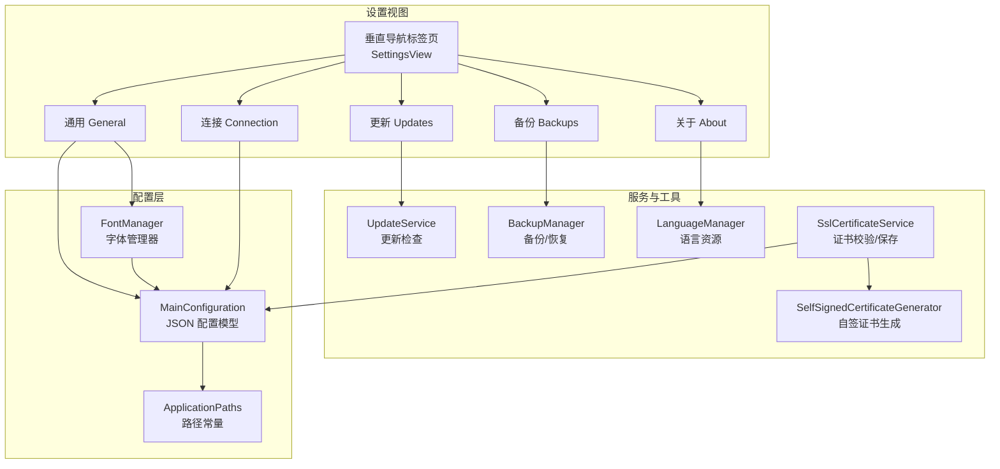
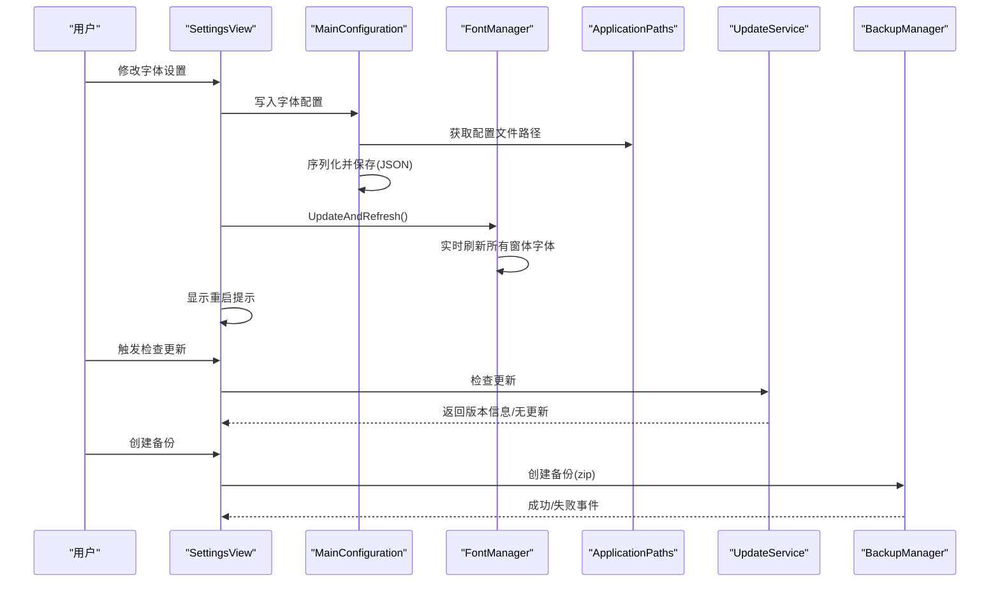
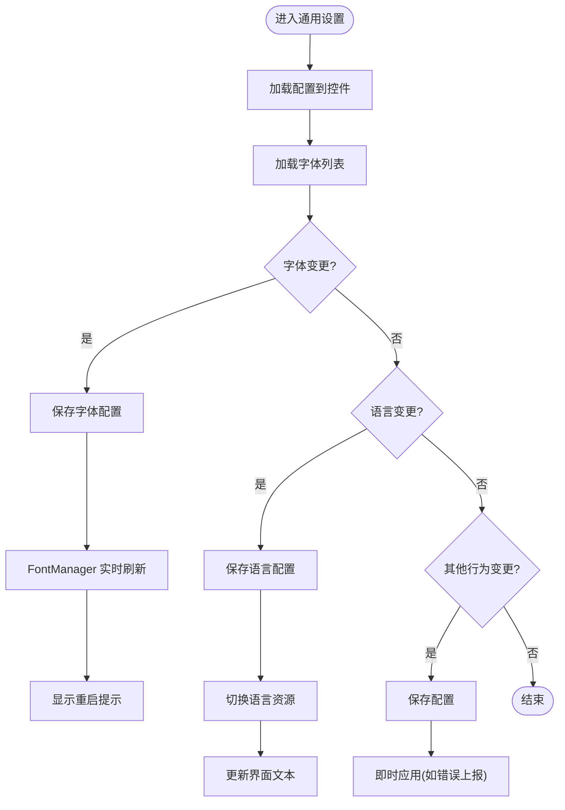
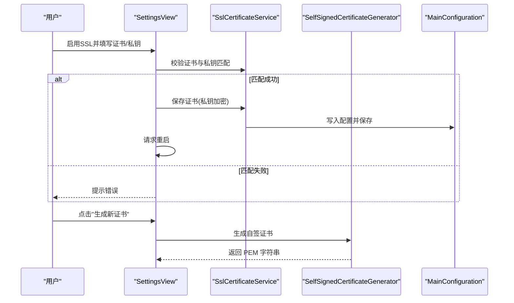
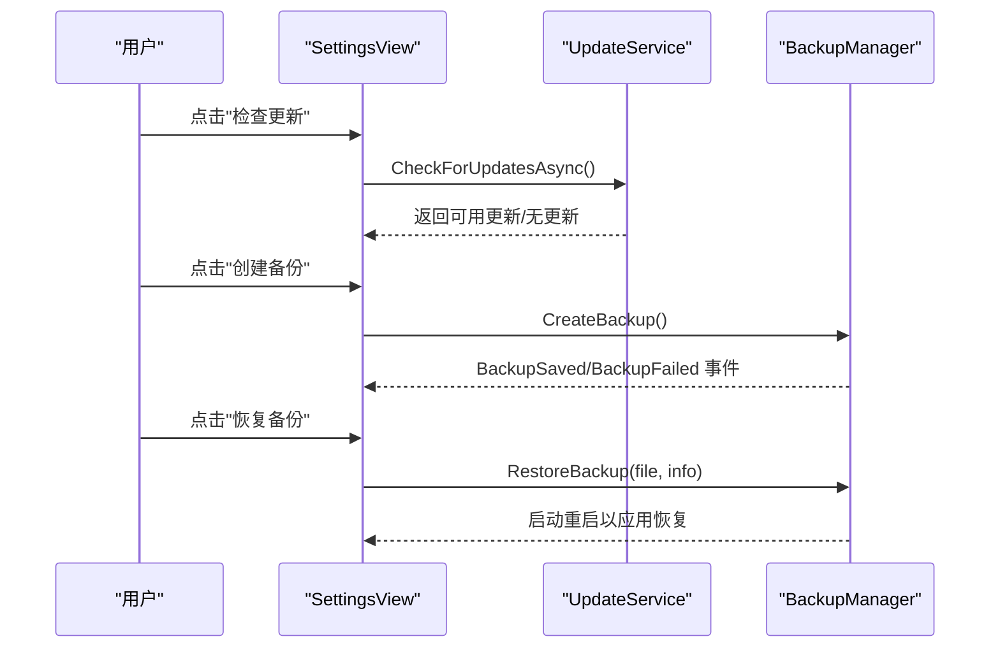
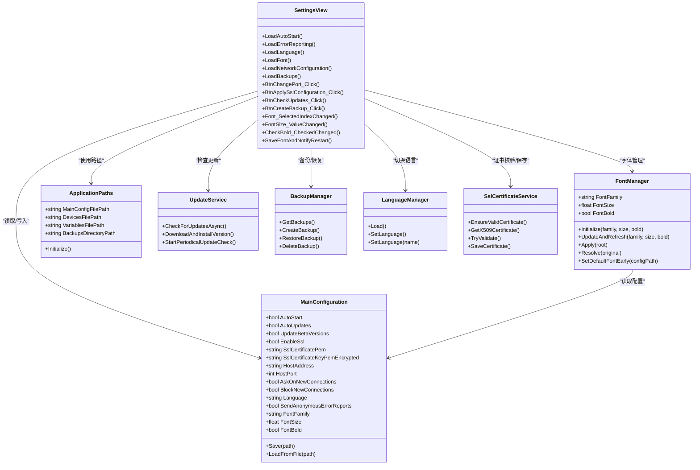

# 设置视图

<cite>
**本文引用的文件**
- [SettingsView.cs](file://src/MacroDeck/GUI/MainWindowViews/SettingsView.cs)
- [SettingsView.Designer.cs](file://src/MacroDeck/GUI/MainWindowViews/SettingsView.Designer.cs)
- [MainConfiguration.cs](file://src/MacroDeck/Configuration/MainConfiguration.cs)
- [FontManager.cs](file://src/MacroDeck/Utils/FontManager.cs)
- [BackupManager.cs](file://src/MacroDeck/Backup/BackupManager.cs)
- [BackupItem.cs](file://src/MacroDeck/GUI/CustomControls/Settings/BackupItem.cs)
- [LanguageManager.cs](file://src/MacroDeck/Language/LanguageManager.cs)
- [SslCertificateService.cs](file://src/MacroDeck/Services/SslCertificateService.cs)
- [SelfSignedCertificateGenerator.cs](file://src/MacroDeck/Utils/SelfSignedCertificateGenerator.cs)
- [ApplicationPaths.cs](file://src/MacroDeck/StartupConfig/ApplicationPaths.cs)
- [UpdateService.cs](file://src/MacroDeck/Services/UpdateService.cs)
- [Resources.resx](file://src/MacroDeck/Properties/Resources.resx)
</cite>

## 更新摘要
**变更内容**
- 新增字体管理系统集成：完整的字体选择器实现，支持系统字体列表获取和实时预览
- 更新字体配置架构：从简单的字体名称扩展为包含字体族、字号和粗体的完整配置
- 增强字体管理功能：支持运行时字体刷新、重启提示和部分元素重启生效机制
- 完善字体验证机制：系统字体检测、降级回退和错误处理

## 目录
1. [简介](#简介)
2. [项目结构](#项目结构)
3. [核心组件](#核心组件)
4. [架构总览](#架构总览)
5. [详细组件分析](#详细组件分析)
6. [依赖关系分析](#依赖关系分析)
7. [性能考量](#性能考量)
8. [故障排查指南](#故障排查指南)
9. [结论](#结论)
10. [附录](#附录)

## 简介
本文件面向 Macro-Deck 的"设置视图"，系统性梳理其整体架构与功能模块，覆盖系统设置、设备配置与用户偏好设置三大类。重点说明以下方面：
- 设置分类与实现：通用设置（启动、行为、语言、字体）、网络设置（端口、SSL、ADB）、更新与备份、关于信息。
- 数据验证与保存机制：配置文件读写、错误处理、重启触发策略。
- 实时预览与即时生效：部分设置的即时应用与重启提示。
- 设置重置与导入导出：备份与恢复流程、数据范围与限制。
- 国际化支持与多语言适配：语言资源加载、动态切换与界面文本更新。

**更新** 新增字体管理系统集成，提供完整的字体选择器功能，支持系统字体列表获取、实时预览和重启提示。

## 项目结构
设置视图位于主窗口的多标签页视图中，采用垂直导航标签页组织不同设置类别，各设置项通过 WinForms 控件绑定到全局配置对象，并在变更时持久化到 JSON 配置文件。新增的字体管理系统通过 FontManager 组件提供全局字体控制能力。

**图表来源**
- [SettingsView.cs:17-478](file://src/MacroDeck/GUI/MainWindowViews/SettingsView.cs#L17-L478)
- [SettingsView.Designer.cs:37-800](file://src/MacroDeck/GUI/MainWindowViews/SettingsView.Designer.cs#L37-L800)
- [MainConfiguration.cs:9-145](file://src/MacroDeck/Configuration/MainConfiguration.cs#L9-L145)
- [FontManager.cs:16-227](file://src/MacroDeck/Utils/FontManager.cs#L16-L227)

**章节来源**
- [SettingsView.cs:17-478](file://src/MacroDeck/GUI/MainWindowViews/SettingsView.cs#L17-L478)
- [SettingsView.Designer.cs:37-800](file://src/MacroDeck/GUI/MainWindowViews/SettingsView.Designer.cs#L37-L800)

## 核心组件
- 设置视图容器：承载多个设置标签页，负责加载与刷新界面文本、绑定事件、触发保存与重启。
- 主配置模型：集中存储所有可序列化的设置项，提供保存与从文件加载能力。
- 路径管理：统一管理用户数据目录、配置文件、备份目录等路径。
- 更新服务：周期性或手动检查更新，支持 Beta 版本通道。
- 备份管理：创建、列出、删除、恢复备份；恢复过程通过临时目录与重启实现。
- 语言管理：加载内置语言资源，动态切换当前语言并广播变更。
- SSL 证书服务：校验 PEM 证书与私钥匹配、加密保存私钥、必要时生成自签证书。
- **新增** 字体管理器：提供全局字体控制、实时预览和重启提示功能。

**章节来源**
- [MainConfiguration.cs:9-145](file://src/MacroDeck/Configuration/MainConfiguration.cs#L9-L145)
- [FontManager.cs:16-227](file://src/MacroDeck/Utils/FontManager.cs#L16-L227)
- [ApplicationPaths.cs:6-143](file://src/MacroDeck/StartupConfig/ApplicationPaths.cs#L6-L143)
- [UpdateService.cs:15-175](file://src/MacroDeck/Services/UpdateService.cs#L15-L175)
- [BackupManager.cs:16-380](file://src/MacroDeck/Backup/BackupManager.cs#L16-L380)
- [LanguageManager.cs:8-121](file://src/MacroDeck/Language/LanguageManager.cs#L8-L121)
- [SslCertificateService.cs:8-91](file://src/MacroDeck/Services/SslCertificateService.cs#L8-L91)

## 架构总览
设置视图通过事件驱动的方式与配置层交互，关键流程如下：
- 初始化：加载配置到控件，注册翻译更新事件。
- 用户操作：控件值变更触发配置写入与相关服务调用。
- 持久化：配置写入 JSON 文件；备份/恢复通过文件系统与压缩包完成。
- 生效策略：部分设置即时生效（如错误上报开关），部分需要重启（端口、SSL、字体）。

**更新** 字体设置变更时，通过 FontManager 实时刷新界面字体，并显示重启提示。

**图表来源**
- [SettingsView.cs:321-366](file://src/MacroDeck/GUI/MainWindowViews/SettingsView.cs#L321-L366)
- [FontManager.cs:74-89](file://src/MacroDeck/Utils/FontManager.cs#L74-L89)
- [MainConfiguration.cs:114-143](file://src/MacroDeck/Configuration/MainConfiguration.cs#L114-L143)
- [UpdateService.cs:51-85](file://src/MacroDeck/Services/UpdateService.cs#L51-L85)
- [BackupManager.cs:270-305](file://src/MacroDeck/Backup/BackupManager.cs#L270-L305)

## 详细组件分析

### 通用设置（启动、行为、语言、字体）
- 启动项：写入/删除 Windows 注册表 Run 键，变更即刻生效。
- 行为：自动启动随 Windows、匿名错误上报开关，变更后立即保存。
- 语言：选择语言后保存配置并动态切换语言资源，随后重新翻译界面文本。
- **新增** 字体：从系统 InstalledFontCollection 获取字体列表，支持字体族、字号和粗体设置，变更后实时预览并显示重启提示。

**图表来源**
- [SettingsView.cs:118-145](file://src/MacroDeck/GUI/MainWindowViews/SettingsView.cs#L118-L145)
- [SettingsView.cs:321-366](file://src/MacroDeck/GUI/MainWindowViews/SettingsView.cs#L321-L366)
- [FontManager.cs:74-89](file://src/MacroDeck/Utils/FontManager.cs#L74-L89)
- [SettingsView.cs:313-319](file://src/MacroDeck/GUI/MainWindowViews/SettingsView.cs#L313-L319)
- [LanguageManager.cs:95-119](file://src/MacroDeck/Language/LanguageManager.cs#L95-L119)

**章节来源**
- [SettingsView.cs:118-145](file://src/MacroDeck/GUI/MainWindowViews/SettingsView.cs#L118-L145)
- [SettingsView.cs:321-366](file://src/MacroDeck/GUI/MainWindowViews/SettingsView.cs#L321-L366)
- [FontManager.cs:16-227](file://src/MacroDeck/Utils/FontManager.cs#L16-L227)
- [SettingsView.cs:313-319](file://src/MacroDeck/GUI/MainWindowViews/SettingsView.cs#L313-L319)
- [SettingsView.cs:105-116](file://src/MacroDeck/GUI/MainWindowViews/SettingsView.cs#L105-L116)
- [SettingsView.cs:270-276](file://src/MacroDeck/GUI/MainWindowViews/SettingsView.cs#L270-L276)
- [LanguageManager.cs:20-70](file://src/MacroDeck/Language/LanguageManager.cs#L20-L70)

### 网络设置（端口、SSL、ADB）
- 端口：修改端口后保存配置并请求应用重启以使新端口生效。
- SSL：启用 SSL 时需提供有效的 PEM 证书与私钥；支持校验匹配、保存加密私钥、生成自签证书；变更后请求重启。
- ADB：启用 ADB 服务器与自动唤醒客户端选项，变更即时保存。

**图表来源**
- [SettingsView.cs:419-459](file://src/MacroDeck/GUI/MainWindowViews/SettingsView.cs#L419-L459)
- [SslCertificateService.cs:56-89](file://src/MacroDeck/Services/SslCertificateService.cs#L56-L89)
- [SelfSignedCertificateGenerator.cs:11-64](file://src/MacroDeck/Utils/SelfSignedCertificateGenerator.cs#L11-L64)

**章节来源**
- [SettingsView.cs:243-253](file://src/MacroDeck/GUI/MainWindowViews/SettingsView.cs#L243-L253)
- [SettingsView.cs:419-459](file://src/MacroDeck/GUI/MainWindowViews/SettingsView.cs#L419-L459)
- [SettingsView.cs:154-166](file://src/MacroDeck/GUI/MainWindowViews/SettingsView.cs#L154-L166)
- [SettingsView.cs:200-210](file://src/MacroDeck/GUI/MainWindowViews/SettingsView.cs#L200-L210)
- [SslCertificateService.cs:12-29](file://src/MacroDeck/Services/SslCertificateService.cs#L12-L29)

### 更新与备份
- 自动检查更新：根据当前版本与平台标识向更新服务查询，支持 Beta 通道；手动检查更新按钮触发异步检查。
- 备份：创建压缩包包含核心配置与数据目录；列出备份项；删除备份；恢复备份通过临时目录与重启实现。

**图表来源**
- [SettingsView.cs:267-305](file://src/MacroDeck/GUI/MainWindowViews/SettingsView.cs#L267-L305)
- [SettingsView.cs:396-400](file://src/MacroDeck/GUI/MainWindowViews/SettingsView.cs#L396-L400)
- [UpdateService.cs:51-85](file://src/MacroDeck/Services/UpdateService.cs#L51-L85)
- [BackupManager.cs:224-267](file://src/MacroDeck/Backup/BackupManager.cs#L224-L267)

**章节来源**
- [SettingsView.cs:267-305](file://src/MacroDeck/GUI/MainWindowViews/SettingsView.cs#L267-L305)
- [SettingsView.cs:396-400](file://src/MacroDeck/GUI/MainWindowViews/SettingsView.cs#L396-L400)
- [SettingsView.cs:147-153](file://src/MacroDeck/GUI/MainWindowViews/SettingsView.cs#L147-L153)
- [SettingsView.cs:224-262](file://src/MacroDeck/GUI/MainWindowViews/SettingsView.cs#L224-L262)
- [BackupManager.cs:270-305](file://src/MacroDeck/Backup/BackupManager.cs#L270-L305)

### 关于与第三方许可
- 显示当前版本、插件 API 版本、WebSocket API 版本、已安装插件数量、运行时信息。
- 打开第三方许可对话框查看许可证列表。

**章节来源**
- [SettingsView.cs:86-103](file://src/MacroDeck/GUI/MainWindowViews/SettingsView.cs#L86-L103)
- [SettingsView.cs:407-417](file://src/MacroDeck/GUI/MainWindowViews/SettingsView.cs#L407-L417)

## 依赖关系分析
设置视图与配置、服务、工具之间的耦合关系如下：

**图表来源**
- [SettingsView.cs:18-478](file://src/MacroDeck/GUI/MainWindowViews/SettingsView.cs#L18-L478)
- [MainConfiguration.cs:14-145](file://src/MacroDeck/Configuration/MainConfiguration.cs#L14-L145)
- [FontManager.cs:16-227](file://src/MacroDeck/Utils/FontManager.cs#L16-L227)
- [ApplicationPaths.cs:6-143](file://src/MacroDeck/StartupConfig/ApplicationPaths.cs#L6-L143)
- [UpdateService.cs:15-175](file://src/MacroDeck/Services/UpdateService.cs#L15-L175)
- [BackupManager.cs:16-380](file://src/MacroDeck/Backup/BackupManager.cs#L16-L380)
- [LanguageManager.cs:8-121](file://src/MacroDeck/Language/LanguageManager.cs#L8-L121)
- [SslCertificateService.cs:8-91](file://src/MacroDeck/Services/SslCertificateService.cs#L8-L91)

**章节来源**
- [SettingsView.cs:18-478](file://src/MacroDeck/GUI/MainWindowViews/SettingsView.cs#L18-L478)
- [MainConfiguration.cs:14-145](file://src/MacroDeck/Configuration/MainConfiguration.cs#L14-L145)

## 性能考量
- 异步更新检查：使用信号量限制并发检查，避免重复请求。
- 备份创建：在临时目录构建后再写入最终 zip，减少磁盘碎片与锁竞争。
- 语言资源：通过资源清单加载语言 JSON，避免频繁 IO；切换语言时仅替换当前字符串集合并广播事件。
- SSL 证书：私钥加密存储，仅在需要时解密；生成自签证书时使用一次性内存对象，降低磁盘写入。
- **新增** 字体管理：使用条件弱表缓存控件原始字体，支持幂等重算和实时刷新；字体检测使用 InstalledFontCollection，避免重复扫描。

## 故障排查指南
- 更新检查失败：确认网络连通；查看日志输出；重试或关闭 Beta 通道。
- SSL 配置无效：确保 PEM 证书与私钥匹配；若为空则生成自签证书；保存后必须重启。
- 备份失败：检查备份目录权限与磁盘空间；查看异常消息；重试或清理临时文件。
- 语言切换无效：确认语言资源加载成功；检查配置文件是否正确写入；重新初始化界面翻译。
- 端口变更未生效：确认已请求重启；检查防火墙与端口占用。
- **新增** 字体设置问题：确认字体已安装；检查字体列表加载；查看重启提示；某些元素需要重启才能完全生效。

**章节来源**
- [SettingsView.cs:243-253](file://src/MacroDeck/GUI/MainWindowViews/SettingsView.cs#L243-L253)
- [SettingsView.cs:419-459](file://src/MacroDeck/GUI/MainWindowViews/SettingsView.cs#L419-L459)
- [BackupManager.cs:296-300](file://src/MacroDeck/Backup/BackupManager.cs#L296-L300)
- [LanguageManager.cs:30-67](file://src/MacroDeck/Language/LanguageManager.cs#L30-L67)
- [SslCertificateService.cs:56-81](file://src/MacroDeck/Services/SslCertificateService.cs#L56-L81)

## 结论
设置视图通过清晰的分层设计与事件驱动机制，实现了对系统设置、网络配置、更新与备份的完整覆盖。配置持久化采用 JSON 文件，结合路径管理与服务层扩展，保证了跨平台与可维护性。语言与 SSL 等关键功能具备完善的验证与错误处理，确保用户体验与安全性。

**更新** 新增的字体管理系统提供了完整的字体控制能力，支持系统字体列表获取、实时预览和重启提示，进一步提升了用户的界面定制体验。

## 附录

### 设置项与数据验证要点
- 启动项：写入注册表，异常静默处理。
- 错误上报：同步 Sentry 开关与配置。
- 语言：名称匹配内置语言集合，切换后广播事件。
- 端口：数值范围限制（最大 65535），变更后请求重启。
- SSL：证书与私钥 PEM 校验，私钥加密保存，必要时生成自签证书。
- ADB：布尔开关，变更即时保存。
- 更新：Beta 通道可选，手动检查返回可用版本或无更新。
- 备份：创建/删除/恢复均通过事件通知 UI，恢复后重启应用。
- **新增** 字体：从系统 InstalledFontCollection 获取字体列表，支持实时预览和重启提示。

**章节来源**
- [MainConfiguration.cs:18-104](file://src/MacroDeck/Configuration/MainConfiguration.cs#L18-L104)
- [SettingsView.cs:243-253](file://src/MacroDeck/GUI/MainWindowViews/SettingsView.cs#L243-L253)
- [SettingsView.cs:419-459](file://src/MacroDeck/GUI/MainWindowViews/SettingsView.cs#L419-L459)
- [FontManager.cs:221-225](file://src/MacroDeck/Utils/FontManager.cs#L221-L225)
- [SslCertificateService.cs:56-89](file://src/MacroDeck/Services/SslCertificateService.cs#L56-L89)
- [UpdateService.cs:51-85](file://src/MacroDeck/Services/UpdateService.cs#L51-L85)
- [BackupManager.cs:270-305](file://src/MacroDeck/Backup/BackupManager.cs#L270-L305)

### 国际化与多语言适配
- 语言资源：从程序集资源加载 JSON 语言文件，按语言名排序。
- 动态切换：设置语言后替换当前字符串集合并触发界面文本更新。
- 图标与资源：界面图标与图片资源通过资源清单引用。
- **新增** 字体字符串：包含 Font、Size、Bold 和 FontPartialRestartHint 等本地化字符串。

**章节来源**
- [LanguageManager.cs:20-70](file://src/MacroDeck/Language/LanguageManager.cs#L20-L70)
- [LanguageManager.cs:95-119](file://src/MacroDeck/Language/LanguageManager.cs#L95-L119)
- [Strings.cs:439-442](file://src/MacroDeck/Language/Strings.cs#L439-L442)
- [Resources.resx:121-283](file://src/MacroDeck/Properties/Resources.resx#L121-L283)

### 字体管理系统详细说明
- **字体获取**：使用 System.Drawing.Text.InstalledFontCollection 获取系统已安装字体列表。
- **实时预览**：通过 FontManager.UpdateAndRefresh 方法实时刷新所有已打开窗体的字体。
- **配置存储**：MainConfiguration 中包含 FontFamily、FontSize 和 FontBold 三个配置项。
- **重启提示**：字体变更后显示 FontPartialRestartHint 提示，说明部分元素需要重启才能完全生效。
- **降级机制**：如果配置的字体未安装，自动回退到默认字体 Tahoma 并记录警告日志。
- **性能优化**：使用 ConditionalWeakTable 缓存控件原始字体，支持幂等重算和多次刷新。

**章节来源**
- [FontManager.cs:16-227](file://src/MacroDeck/Utils/FontManager.cs#L16-L227)
- [MainConfiguration.cs:97-104](file://src/MacroDeck/Configuration/MainConfiguration.cs#L97-L104)
- [SettingsView.cs:118-145](file://src/MacroDeck/GUI/MainWindowViews/SettingsView.cs#L118-L145)
- [SettingsView.cs:355-366](file://src/MacroDeck/GUI/MainWindowViews/SettingsView.cs#L355-L366)
- [Strings.cs:439-442](file://src/MacroDeck/Language/Strings.cs#L439-L442)