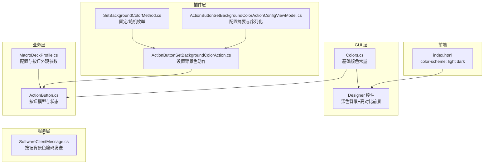
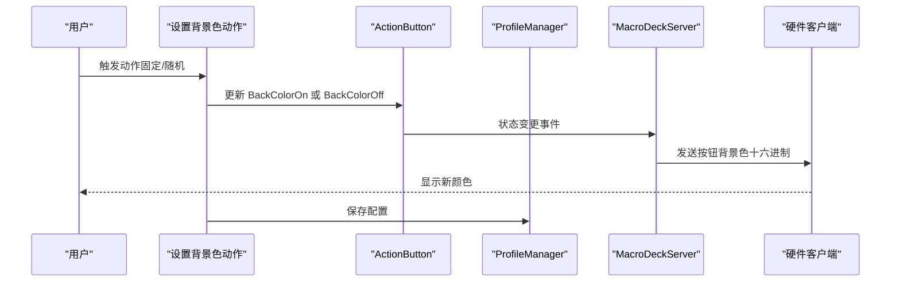
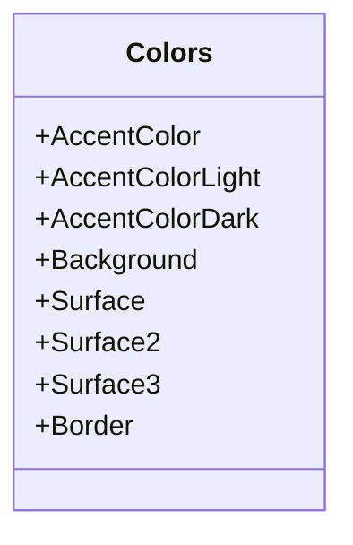
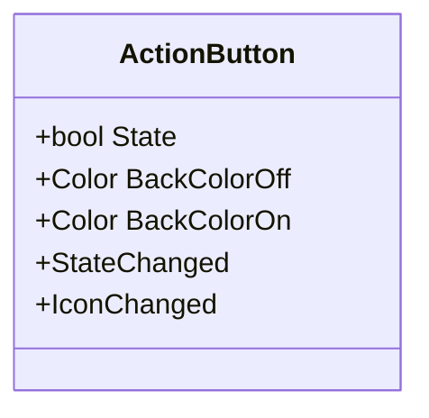
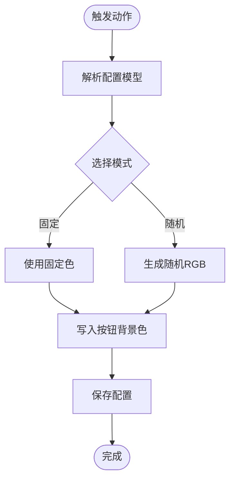
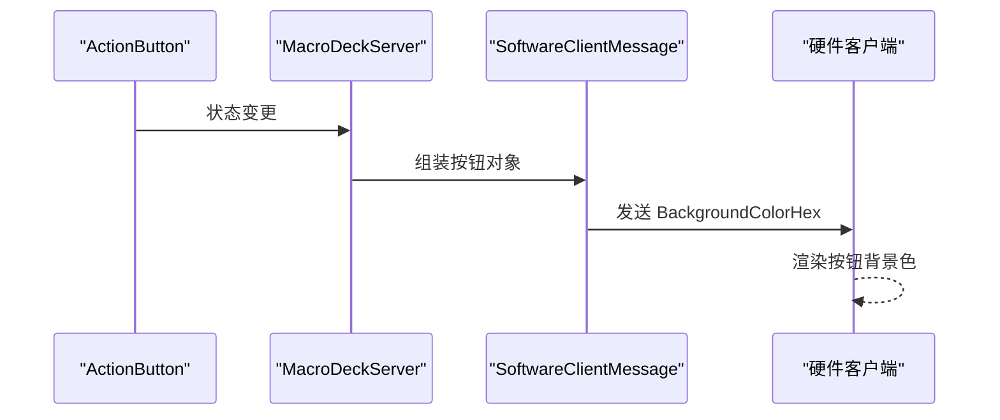
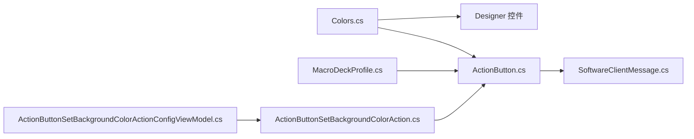

# 颜色主题系统

<cite>
**本文引用的文件**
- [Colors.cs](file://src/MacroDeck/GUI/Colors.cs)
- [ActionButton.cs](file://src/MacroDeck/ActionButton/ActionButton.cs)
- [ActionButtonSetBackgroundColorAction.cs](file://src/MacroDeck/InternalPlugins/ActionButtonPlugin/Actions/ActionButtonSetBackgroundColorAction.cs)
- [SetBackgroundColorMethod.cs](file://src/MacroDeck/InternalPlugins/ActionButtonPlugin/Enums/SetBackgroundColorMethod.cs)
- [ActionButtonSetBackgroundColorActionConfigViewModel.cs](file://src/MacroDeck/InternalPlugins/ActionButtonPlugin/ViewModels/ActionButtonSetBackgroundColorActionConfigViewModel.cs)
- [MacroDeckProfile.cs](file://src/MacroDeck/Profiles/MacroDeckProfile.cs)
- [SoftwareClientMessage.cs](file://src/MacroDeck/Server/DeviceMessage/SoftwareClientMessage.cs)
- [index.html](file://src/MacroDeck/wwwroot/client/index.html)
- [MainConfiguration.cs](file://src/MacroDeck/Configuration/MainConfiguration.cs)
- [ButtonEditor.Designer.cs](file://src/MacroDeck/GUI/Dialogs/ButtonEditor.Designer.cs)
- [ActionConfigControl.Designer.cs](file://src/MacroDeck/GUI/CustomControls/ActionConfigControl.Designer.cs)
</cite>

## 目录
1. [简介](#简介)
2. [项目结构](#项目结构)
3. [核心组件](#核心组件)
4. [架构总览](#架构总览)
5. [详细组件分析](#详细组件分析)
6. [依赖关系分析](#依赖关系分析)
7. [性能考量](#性能考量)
8. [故障排查指南](#故障排查指南)
9. [结论](#结论)
10. [附录](#附录)

## 简介
本文件系统化梳理 Macro-Deck 的颜色主题体系，覆盖颜色定义、主题切换与动态应用、预设方案与使用规范、可访问性标准、扩展机制与第三方主题支持，以及在不同控件与场景中的应用规则。当前代码库中颜色主题以深色为主基调，通过统一的颜色常量与按钮级背景色配置实现一致的视觉体验，并通过插件动作实现运行时动态变色。

## 项目结构
颜色主题系统主要分布在以下模块：
- GUI 基础颜色常量：集中于 GUI 层的 Colors 类，提供主色调、表面层、边框等基础色值。
- 控件与界面：大量自定义控件在 Designer 文件中直接使用深色系背景与高对比前景色，确保在深色主题下具备良好可读性。
- 按钮与设备通信：ActionButton 提供独立的 On/Off 背景色属性；服务端消息将按钮背景色编码为十六进制发送至硬件客户端。
- 插件与动作：内置“设置背景色”动作允许固定色或随机色两种方式动态修改按钮背景色。
- 主题与配置：前端 HTML 中声明 color-scheme 支持浅色/深色；全局配置类提供应用级设置入口（如自动启动、语言等）。

图表来源
- [Colors.cs:1-15](file://src/MacroDeck/GUI/Colors.cs#L1-L15)
- [ActionButton.cs:151-181](file://src/MacroDeck/ActionButton/ActionButton.cs#L151-L181)
- [MacroDeckProfile.cs:52-57](file://src/MacroDeck/Profiles/MacroDeckProfile.cs#L52-L57)
- [SoftwareClientMessage.cs:75-86](file://src/MacroDeck/Server/DeviceMessage/SoftwareClientMessage.cs#L75-L86)
- [ActionButtonSetBackgroundColorAction.cs:20-49](file://src/MacroDeck/InternalPlugins/ActionButtonPlugin/Actions/ActionButtonSetBackgroundColorAction.cs#L20-L49)
- [SetBackgroundColorMethod.cs:1-7](file://src/MacroDeck/InternalPlugins/ActionButtonPlugin/Enums/SetBackgroundColorMethod.cs#L1-L7)
- [ActionButtonSetBackgroundColorActionConfigViewModel.cs:56-66](file://src/MacroDeck/InternalPlugins/ActionButtonPlugin/ViewModels/ActionButtonSetBackgroundColorActionConfigViewModel.cs#L56-L66)
- [index.html:10-27](file://src/MacroDeck/wwwroot/client/index.html#L10-L27)

章节来源
- [Colors.cs:1-15](file://src/MacroDeck/GUI/Colors.cs#L1-L15)
- [ActionButton.cs:151-181](file://src/MacroDeck/ActionButton/ActionButton.cs#L151-L181)
- [MacroDeckProfile.cs:52-57](file://src/MacroDeck/Profiles/MacroDeckProfile.cs#L52-L57)
- [SoftwareClientMessage.cs:75-86](file://src/MacroDeck/Server/DeviceMessage/SoftwareClientMessage.cs#L75-L86)
- [ActionButtonSetBackgroundColorAction.cs:20-49](file://src/MacroDeck/InternalPlugins/ActionButtonPlugin/Actions/ActionButtonSetBackgroundColorAction.cs#L20-L49)
- [SetBackgroundColorMethod.cs:1-7](file://src/MacroDeck/InternalPlugins/ActionButtonPlugin/Enums/SetBackgroundColorMethod.cs#L1-L7)
- [ActionButtonSetBackgroundColorActionConfigViewModel.cs:56-66](file://src/MacroDeck/InternalPlugins/ActionButtonPlugin/ViewModels/ActionButtonSetBackgroundColorActionConfigViewModel.cs#L56-L66)
- [index.html:10-27](file://src/MacroDeck/wwwroot/client/index.html#L10-L27)

## 核心组件
- 基础颜色常量（Colors）
  - 主色调：AccentColor 及其 Light/Dark 变体，用于强调元素与交互反馈。
  - 表面层：Background、Surface、Surface2、Surface3，用于容器、面板与分层背景。
  - 边框：Border，用于分割线与容器描边。
- 按钮背景色（ActionButton）
  - BackColorOff/BackColorOn：分别控制按钮“未激活/激活”状态下的背景色。
  - 默认值采用较深灰，保证在深色主题下具备足够对比度。
- 动态变色动作（ActionButtonSetBackgroundColorAction）
  - 支持固定色与随机色两种模式，触发后更新对应状态的按钮背景色。
  - 配置摘要显示固定色的十六进制表示或“随机”文本。
- 设备消息（SoftwareClientMessage）
  - 将按钮背景色编码为十六进制字符串发送到硬件客户端，确保跨平台一致显示。

章节来源
- [Colors.cs:5-13](file://src/MacroDeck/GUI/Colors.cs#L5-L13)
- [ActionButton.cs:151-181](file://src/MacroDeck/ActionButton/ActionButton.cs#L151-L181)
- [ActionButtonSetBackgroundColorAction.cs:20-49](file://src/MacroDeck/InternalPlugins/ActionButtonPlugin/Actions/ActionButtonSetBackgroundColorAction.cs#L20-L49)
- [ActionButtonSetBackgroundColorActionConfigViewModel.cs:56-66](file://src/MacroDeck/InternalPlugins/ActionButtonPlugin/ViewModels/ActionButtonSetBackgroundColorActionConfigViewModel.cs#L56-L66)
- [SoftwareClientMessage.cs:75-86](file://src/MacroDeck/Server/DeviceMessage/SoftwareClientMessage.cs#L75-L86)

## 架构总览
颜色主题系统采用“集中式基础色 + 分层容器色 + 按钮状态色”的分层设计，结合插件动作实现运行时动态变色，并通过服务端消息将最终颜色传递给硬件客户端。

图表来源
- [ActionButtonSetBackgroundColorAction.cs:20-49](file://src/MacroDeck/InternalPlugins/ActionButtonPlugin/Actions/ActionButtonSetBackgroundColorAction.cs#L20-L49)
- [ActionButton.cs:151-181](file://src/MacroDeck/ActionButton/ActionButton.cs#L151-L181)
- [SoftwareClientMessage.cs:75-86](file://src/MacroDeck/Server/DeviceMessage/SoftwareClientMessage.cs#L75-L86)

## 详细组件分析

### 组件一：基础颜色常量（Colors）
- 定位：GUI 层统一颜色定义，避免硬编码颜色值。
- 使用：作为控件默认配色、主题变量的基础来源。
- 建议：新增颜色时遵循明暗对比与无障碍对比度要求。

图表来源
- [Colors.cs:3-14](file://src/MacroDeck/GUI/Colors.cs#L3-L14)

章节来源
- [Colors.cs:3-14](file://src/MacroDeck/GUI/Colors.cs#L3-L14)

### 组件二：按钮背景色（ActionButton）
- 定位：按钮级状态颜色管理，支持 On/Off 不同背景色。
- 数据流：状态变更触发服务器更新，随后由消息层编码发送。
- 复杂度：O(1) 写入与事件通知，无额外计算开销。

图表来源
- [ActionButton.cs:114-181](file://src/MacroDeck/ActionButton/ActionButton.cs#L114-L181)

章节来源
- [ActionButton.cs:114-181](file://src/MacroDeck/ActionButton/ActionButton.cs#L114-L181)

### 组件三：动态变色动作（ActionButtonSetBackgroundColorAction）
- 功能：根据配置选择固定色或随机色，更新按钮背景色并持久化。
- 流程：解析配置 -> 计算目标颜色 -> 写入按钮状态色 -> 保存配置。
- 可扩展：可通过新增枚举值扩展更多变色策略（如渐变、脉冲等）。

图表来源
- [ActionButtonSetBackgroundColorAction.cs:20-49](file://src/MacroDeck/InternalPlugins/ActionButtonPlugin/Actions/ActionButtonSetBackgroundColorAction.cs#L20-L49)
- [SetBackgroundColorMethod.cs:3-7](file://src/MacroDeck/InternalPlugins/ActionButtonPlugin/Enums/SetBackgroundColorMethod.cs#L3-L7)
- [ActionButtonSetBackgroundColorActionConfigViewModel.cs:56-66](file://src/MacroDeck/InternalPlugins/ActionButtonPlugin/ViewModels/ActionButtonSetBackgroundColorActionConfigViewModel.cs#L56-L66)

章节来源
- [ActionButtonSetBackgroundColorAction.cs:20-49](file://src/MacroDeck/InternalPlugins/ActionButtonPlugin/Actions/ActionButtonSetBackgroundColorAction.cs#L20-L49)
- [SetBackgroundColorMethod.cs:3-7](file://src/MacroDeck/InternalPlugins/ActionButtonPlugin/Enums/SetBackgroundColorMethod.cs#L3-L7)
- [ActionButtonSetBackgroundColorActionConfigViewModel.cs:56-66](file://src/MacroDeck/InternalPlugins/ActionButtonPlugin/ViewModels/ActionButtonSetBackgroundColorActionConfigViewModel.cs#L56-L66)

### 组件四：设备消息与颜色传输（SoftwareClientMessage）
- 责任：将按钮背景色转换为十六进制字符串，随按钮数据一起发送。
- 关键点：确保十六进制格式与硬件客户端解析一致。

图表来源
- [ActionButton.cs:151-181](file://src/MacroDeck/ActionButton/ActionButton.cs#L151-L181)
- [SoftwareClientMessage.cs:75-86](file://src/MacroDeck/Server/DeviceMessage/SoftwareClientMessage.cs#L75-L86)

章节来源
- [ActionButton.cs:151-181](file://src/MacroDeck/ActionButton/ActionButton.cs#L151-L181)
- [SoftwareClientMessage.cs:75-86](file://src/MacroDeck/Server/DeviceMessage/SoftwareClientMessage.cs#L75-L86)

### 组件五：界面与控件颜色应用
- 控件默认：大量 Designer 文件使用深色背景与白色/高对比前景色，保证在深色主题下清晰可读。
- 编辑器：按钮编辑器等对话框同样采用深色背景与高对比文字，提升可读性与一致性。

章节来源
- [ButtonEditor.Designer.cs:443-472](file://src/MacroDeck/GUI/Dialogs/ButtonEditor.Designer.cs#L443-L472)
- [ActionConfigControl.Designer.cs:41-43](file://src/MacroDeck/GUI/CustomControls/ActionConfigControl.Designer.cs#L41-L43)

## 依赖关系分析
- Colors 为 GUI 控件与插件动作提供统一颜色来源。
- ActionButton 依赖 Profile 参数决定按钮外观（半径、间距等），但颜色由自身属性控制。
- SoftwareClientMessage 依赖 ActionButton 的颜色属性进行编码传输。
- 插件动作依赖 ActionButton 的颜色属性与 Profile 的保存流程。

图表来源
- [Colors.cs:3-14](file://src/MacroDeck/GUI/Colors.cs#L3-L14)
- [ActionButton.cs:151-181](file://src/MacroDeck/ActionButton/ActionButton.cs#L151-L181)
- [MacroDeckProfile.cs:52-57](file://src/MacroDeck/Profiles/MacroDeckProfile.cs#L52-L57)
- [SoftwareClientMessage.cs:75-86](file://src/MacroDeck/Server/DeviceMessage/SoftwareClientMessage.cs#L75-L86)
- [ActionButtonSetBackgroundColorAction.cs:20-49](file://src/MacroDeck/InternalPlugins/ActionButtonPlugin/Actions/ActionButtonSetBackgroundColorAction.cs#L20-L49)
- [ActionButtonSetBackgroundColorActionConfigViewModel.cs:56-66](file://src/MacroDeck/InternalPlugins/ActionButtonPlugin/ViewModels/ActionButtonSetBackgroundColorActionConfigViewModel.cs#L56-L66)

章节来源
- [Colors.cs:3-14](file://src/MacroDeck/GUI/Colors.cs#L3-L14)
- [ActionButton.cs:151-181](file://src/MacroDeck/ActionButton/ActionButton.cs#L151-L181)
- [MacroDeckProfile.cs:52-57](file://src/MacroDeck/Profiles/MacroDeckProfile.cs#L52-L57)
- [SoftwareClientMessage.cs:75-86](file://src/MacroDeck/Server/DeviceMessage/SoftwareClientMessage.cs#L75-L86)
- [ActionButtonSetBackgroundColorAction.cs:20-49](file://src/MacroDeck/InternalPlugins/ActionButtonPlugin/Actions/ActionButtonSetBackgroundColorAction.cs#L20-L49)
- [ActionButtonSetBackgroundColorActionConfigViewModel.cs:56-66](file://src/MacroDeck/InternalPlugins/ActionButtonPlugin/ViewModels/ActionButtonSetBackgroundColorActionConfigViewModel.cs#L56-L66)

## 性能考量
- 颜色计算：固定色与随机色均为 O(1)，对性能影响极小。
- 事件传播：按钮状态变更仅在必要时触发服务器更新，避免冗余网络传输。
- 序列化：十六进制编码简单高效，适合实时传输。

## 故障排查指南
- 颜色不生效
  - 检查插件动作是否正确触发并写入 BackColorOn/Off。
  - 确认 Profile 是否保存成功。
- 颜色异常或不可读
  - 检查控件前景色与背景色对比度，确保满足可访问性要求。
  - 在 Designer 中核对控件背景与文字颜色设置。
- 硬件端颜色不一致
  - 检查消息层是否正确发送十六进制颜色值。
  - 确认硬件客户端对十六进制格式的解析逻辑。

章节来源
- [ActionButtonSetBackgroundColorAction.cs:20-49](file://src/MacroDeck/InternalPlugins/ActionButtonPlugin/Actions/ActionButtonSetBackgroundColorAction.cs#L20-L49)
- [ActionButtonSetBackgroundColorActionConfigViewModel.cs:56-66](file://src/MacroDeck/InternalPlugins/ActionButtonPlugin/ViewModels/ActionButtonSetBackgroundColorActionConfigViewModel.cs#L56-L66)
- [SoftwareClientMessage.cs:75-86](file://src/MacroDeck/Server/DeviceMessage/SoftwareClientMessage.cs#L75-L86)

## 结论
Macro-Deck 的颜色主题系统以 Colors 为核心，结合 ActionButton 的状态色与插件动作的动态能力，实现了从静态深色主题到运行时个性化变色的完整闭环。通过统一的颜色常量与明确的数据流，系统在保持一致性的同时提供了良好的扩展性。建议后续引入更完善的可访问性校验与浅色主题支持，进一步增强用户体验。

## 附录

### 预定义颜色方案与使用规范
- 主色调（AccentColor/AccentColorLight/AccentColorDark）
  - 用途：强调按钮、选中状态、进度条、链接等。
  - 规范：优先使用 Light/Dark 变体以获得不同明暗层次。
- 表面层（Background/Surface/Surface2/Surface3）
  - 用途：页面背景、卡片容器、分隔面板、边框。
  - 规范：相邻层级使用递增的表面色，避免视觉重叠。
- 边框（Border）
  - 用途：容器描边、分割线、焦点轮廓。
  - 规范：与表面色对比度至少达到 AA 级别。

章节来源
- [Colors.cs:5-13](file://src/MacroDeck/GUI/Colors.cs#L5-L13)

### 可访问性标准
- 对比度
  - 文本与背景：至少 4.5:1（AA），图标与背景：至少 3:1（AA）。
  - 强调内容与背景：至少 3:1（AAA）。
- 色盲友好
  - 避免仅用红/绿区分信息；提供形状或纹理补充。
  - 为关键状态提供多模态提示（声音/震动）。
- 视觉障碍支持
  - 提供高对比度模式与缩放选项。
  - 保证键盘可达与屏幕阅读器友好。

### 主题系统实现要点
- 浅色/深色主题切换
  - 前端：通过 HTML meta 标签声明 color-scheme 支持。
  - 后端：根据系统偏好或用户设置动态调整颜色常量映射。
- 自定义颜色配置
  - 允许用户在配置文件中覆盖基础色值，或通过插件动作临时修改。
- 品牌色彩集成
  - 将品牌主色映射到 AccentColor 及其变体，确保品牌一致性。

章节来源
- [index.html:10-10](file://src/MacroDeck/wwwroot/client/index.html#L10-L10)
- [MainConfiguration.cs:72-72](file://src/MacroDeck/Configuration/MainConfiguration.cs#L72-L72)

### 扩展机制与第三方主题支持
- 插件扩展
  - 新增颜色枚举或配置项，通过 ViewModel 生成配置摘要。
  - 在动作中实现新的变色策略（如渐变、闪烁）。
- 第三方主题
  - 提供颜色常量接口与配置文件模板，便于导入外部主题包。
  - 保留默认 Colors 作为回退方案，确保兼容性。

章节来源
- [SetBackgroundColorMethod.cs:3-7](file://src/MacroDeck/InternalPlugins/ActionButtonPlugin/Enums/SetBackgroundColorMethod.cs#L3-L7)
- [ActionButtonSetBackgroundColorActionConfigViewModel.cs:56-66](file://src/MacroDeck/InternalPlugins/ActionButtonPlugin/ViewModels/ActionButtonSetBackgroundColorActionConfigViewModel.cs#L56-L66)

### 颜色在不同控件与场景的应用规则
- 设置页与对话框
  - 使用深色背景与高对比前景，保证长时间操作的舒适性。
- 按钮与表单
  - 主要按钮使用 AccentColor；次要按钮使用 Surface2；禁用状态使用降低饱和度的颜色。
- 状态指示
  - 成功/错误/警告使用语义化颜色，配合图标与文案双重提示。
- 设备端渲染
  - 严格按十六进制格式传输颜色，避免解析错误导致的显示异常。

章节来源
- [ButtonEditor.Designer.cs:443-472](file://src/MacroDeck/GUI/Dialogs/ButtonEditor.Designer.cs#L443-L472)
- [ActionConfigControl.Designer.cs:41-43](file://src/MacroDeck/GUI/CustomControls/ActionConfigControl.Designer.cs#L41-L43)
- [SoftwareClientMessage.cs:75-86](file://src/MacroDeck/Server/DeviceMessage/SoftwareClientMessage.cs#L75-L86)