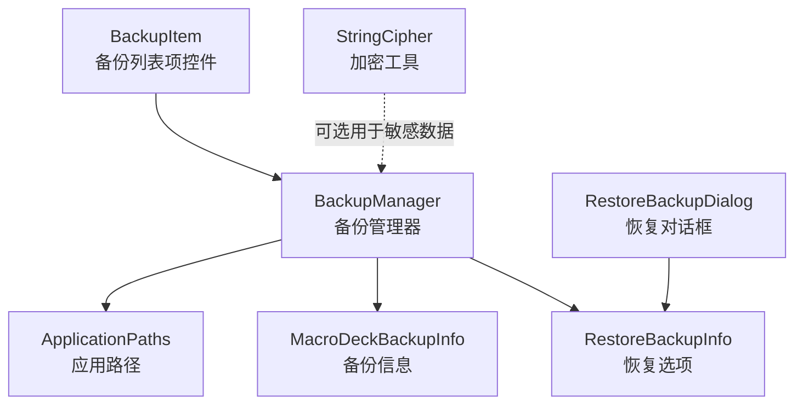
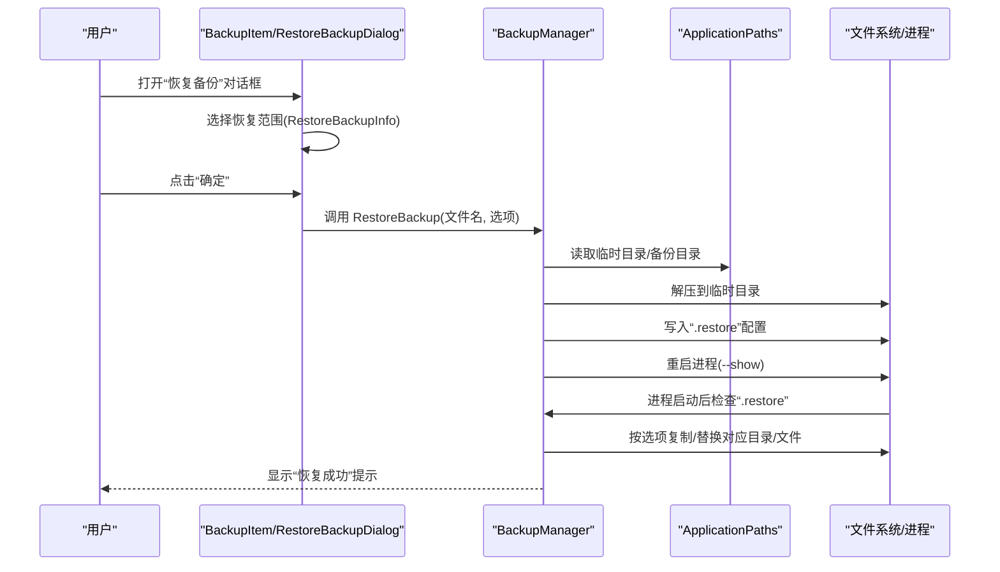
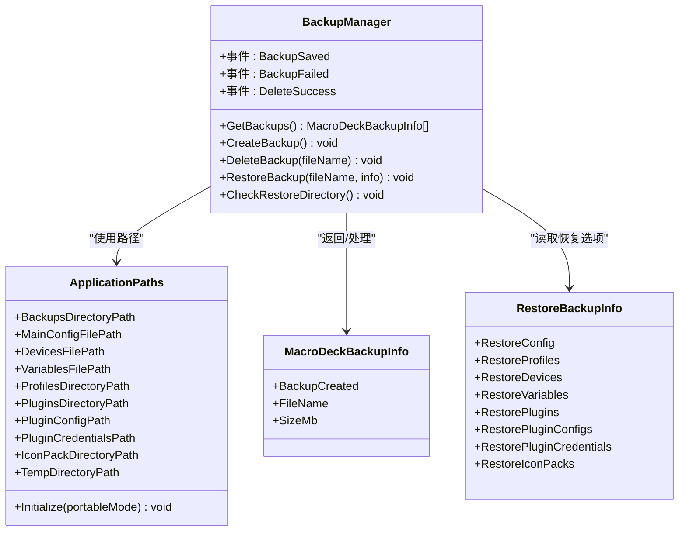

# 备份和恢复

<cite>
**本文引用的文件**
- [BackupManager.cs](file://src/MacroDeck/Backup/BackupManager.cs)
- [MacroDeckBackupInfo.cs](file://src/MacroDeck/Backup/MacroDeckBackupInfo.cs)
- [RestoreBackupInfo.cs](file://src/MacroDeck/Backup/RestoreBackupInfo.cs)
- [ApplicationPaths.cs](file://src/MacroDeck/StartupConfig/ApplicationPaths.cs)
- [BackupItem.cs](file://src/MacroDeck/GUI/CustomControls/Settings/BackupItem.cs)
- [RestoreBackupDialog.cs](file://src/MacroDeck/GUI/Dialogs/RestoreBackupDialog.cs)
- [StringCipher.cs](file://src/MacroDeck/Utils/StringCipher.cs)
</cite>

## 目录
1. 引言
2. 项目结构
3. 核心组件
4. 架构总览
5. 组件详解
6. 依赖关系分析
7. 性能考量
8. 故障排查指南
9. 结论
10. 附录

## 引言
本文件面向 Macro-Deck 的备份与恢复系统，系统性阐述备份机制设计、恢复流程与数据保护策略；详细说明 BackupManager 的实现与备份文件格式；记录备份内容范围（配置、按钮设置、插件配置与用户数据）；解释自动与手动触发机制；给出备份文件存储位置、命名规则与版本管理建议；提供恢复流程步骤与数据完整性检查方法；说明备份与配置管理系统的集成关系；并讨论备份数据的安全性与隐私保护措施。最后提供面向用户的备份策略建议与面向管理员的批量备份与恢复指导。

## 项目结构
备份与恢复功能主要由以下模块组成：
- 后端管理器：BackupManager 负责备份创建、删除、恢复调度与目录清理
- 数据模型：MacroDeckBackupInfo 用于展示备份列表项；RestoreBackupInfo 描述恢复时的选择项
- 路径与环境：ApplicationPaths 定义应用数据目录、备份目录、临时目录等
- GUI 集成：BackupItem 列表项负责单个备份的查看、恢复与删除；RestoreBackupDialog 提供恢复选择界面
- 安全工具：StringCipher 提供对称加密能力（可用于敏感插件凭据或变量的保护）

图表来源
- [BackupManager.cs:16-380](file://src/MacroDeck/Backup/BackupManager.cs#L16-L380)
- [ApplicationPaths.cs:6-143](file://src/MacroDeck/StartupConfig/ApplicationPaths.cs#L6-L143)
- [MacroDeckBackupInfo.cs:3-9](file://src/MacroDeck/Backup/MacroDeckBackupInfo.cs#L3-L9)
- [RestoreBackupInfo.cs:3-14](file://src/MacroDeck/Backup/RestoreBackupInfo.cs#L3-L14)
- [BackupItem.cs:8-62](file://src/MacroDeck/GUI/CustomControls/Settings/BackupItem.cs#L8-L62)
- [RestoreBackupDialog.cs:7-52](file://src/MacroDeck/GUI/Dialogs/RestoreBackupDialog.cs#L7-L52)
- [StringCipher.cs:7-100](file://src/MacroDeck/Utils/StringCipher.cs#L7-L100)

章节来源
- [BackupManager.cs:27-41](file://src/MacroDeck/Backup/BackupManager.cs#L27-L41)
- [ApplicationPaths.cs:43-61](file://src/MacroDeck/StartupConfig/ApplicationPaths.cs#L43-L61)

## 核心组件
- BackupManager：提供备份列表枚举、备份创建、备份删除、恢复调度与自动恢复执行逻辑
- MacroDeckBackupInfo：封装备份文件名、创建时间与大小
- RestoreBackupInfo：封装恢复时的可选项（配置、资料、设备、变量、插件、插件配置、插件凭据、图标包）
- ApplicationPaths：定义用户数据根目录、各子目录与关键文件路径
- BackupItem：在设置界面中展示备份条目并触发恢复或删除
- RestoreBackupDialog：弹窗选择恢复范围
- StringCipher：提供对称加解密能力（可用于敏感数据保护）

章节来源
- [BackupManager.cs:16-380](file://src/MacroDeck/Backup/BackupManager.cs#L16-L380)
- [MacroDeckBackupInfo.cs:3-9](file://src/MacroDeck/Backup/MacroDeckBackupInfo.cs#L3-L9)
- [RestoreBackupInfo.cs:3-14](file://src/MacroDeck/Backup/RestoreBackupInfo.cs#L3-L14)
- [ApplicationPaths.cs:6-143](file://src/MacroDeck/StartupConfig/ApplicationPaths.cs#L6-L143)
- [BackupItem.cs:8-62](file://src/MacroDeck/GUI/CustomControls/Settings/BackupItem.cs#L8-L62)
- [RestoreBackupDialog.cs:7-52](file://src/MacroDeck/GUI/Dialogs/RestoreBackupDialog.cs#L7-L52)
- [StringCipher.cs:7-100](file://src/MacroDeck/Utils/StringCipher.cs#L7-L100)

## 架构总览
备份与恢复的整体架构围绕 BackupManager 展开，通过 ApplicationPaths 获取数据目录与备份目录，使用压缩归档（ZIP）打包备份内容，并在恢复阶段通过临时目录解压后按用户选择逐项覆盖目标位置。GUI 控件负责交互与参数传递。

图表来源
- [BackupItem.cs:29-48](file://src/MacroDeck/GUI/CustomControls/Settings/BackupItem.cs#L29-L48)
- [RestoreBackupDialog.cs:26-44](file://src/MacroDeck/GUI/Dialogs/RestoreBackupDialog.cs#L26-L44)
- [BackupManager.cs:224-267](file://src/MacroDeck/Backup/BackupManager.cs#L224-L267)
- [BackupManager.cs:43-222](file://src/MacroDeck/Backup/BackupManager.cs#L43-L222)
- [ApplicationPaths.cs:43-61](file://src/MacroDeck/StartupConfig/ApplicationPaths.cs#L43-L61)

## 组件详解

### BackupManager 实现与流程
- 备份列表：扫描备份目录，返回包含创建时间、文件名与大小的列表，并按时间倒序排列
- 创建备份：生成带时间戳的 ZIP 文件名，先复制核心文件到临时目录，再将临时目录内容打包至最终备份目录；支持并发状态防重
- 删除备份：直接删除指定备份文件
- 恢复调度：将备份解压到临时目录，写入“.restore”配置文件，然后重启进程
- 自动恢复：进程启动后检测“.restore”，根据配置逐项复制/替换目标目录或文件，完成后提示用户

```mermaid
flowchart TD
Start(["开始"]) --> CheckRestore[".restore 检查"]
CheckRestore --> HasRestore{"存在且有效？"}
HasRestore --> |否| End(["结束"])
HasRestore --> |是| ReadCfg["读取 .restore 选项"]
ReadCfg --> CopyCfg{"包含配置？"}
CopyCfg --> |是| DoCfg["复制配置文件"]
CopyCfg --> |否| Next1["继续"]
DoCfg --> Next1
Next1 --> CopyProfiles{"包含资料？"}
CopyProfiles --> |是| DoProfiles["删除并复制资料目录"]
CopyProfiles --> |否| Next2["继续"]
DoProfiles --> Next2
Next2 --> CopyDevices{"包含设备？"}
CopyDevices --> |是| DoDevices["复制设备文件"]
CopyDevices --> |否| Next3["继续"]
DoDevices --> Next3
Next3 --> CopyVars{"包含变量？"}
CopyVars --> |是| DoVars["复制变量文件"]
CopyVars --> |否| Next4["继续"]
DoVars --> Next4
Next4 --> CopyPlugins{"包含插件？"}
CopyPlugins --> |是| DoPlugins["删除并复制插件目录"]
CopyPlugins --> |否| Next5["继续"]
DoPlugins --> Next5
Next5 --> CopyPluginCfgs{"包含插件配置？"}
CopyPluginCfgs --> |是| DoPluginCfgs["删除并复制插件配置目录"]
CopyPluginCfgs --> |否| Next6["继续"]
DoPluginCfgs --> Next6
Next6 --> CopyPluginCreds{"包含插件凭据？"}
CopyPluginCreds --> |是| DoPluginCreds["删除并复制插件凭据目录"]
CopyPluginCreds --> |否| Next7["继续"]
DoPluginCreds --> Next7
Next7 --> CopyIcons{"包含图标包？"}
CopyIcons --> |是| DoIcons["删除并复制图标包目录"]
CopyIcons --> |否| End
DoIcons --> End
```

图表来源
- [BackupManager.cs:43-222](file://src/MacroDeck/Backup/BackupManager.cs#L43-L222)

章节来源
- [BackupManager.cs:27-41](file://src/MacroDeck/Backup/BackupManager.cs#L27-L41)
- [BackupManager.cs:270-305](file://src/MacroDeck/Backup/BackupManager.cs#L270-L305)
- [BackupManager.cs:307-361](file://src/MacroDeck/Backup/BackupManager.cs#L307-L361)
- [BackupManager.cs:363-378](file://src/MacroDeck/Backup/BackupManager.cs#L363-L378)
- [BackupManager.cs:224-267](file://src/MacroDeck/Backup/BackupManager.cs#L224-L267)
- [BackupManager.cs:43-222](file://src/MacroDeck/Backup/BackupManager.cs#L43-L222)

### 备份文件格式与存储位置
- 文件格式：ZIP 压缩包，内含备份的核心配置文件与用户数据目录
- 存储位置：由 ApplicationPaths.BackupsDirectoryPath 指定，默认位于用户数据目录下的“backups”
- 文件命名：以“backup_YY-MM-DD_HH-mm-ss.zip”命名，便于按时间排序与识别
- 版本管理：建议保留最近 N 份备份；可通过外部策略定期清理旧备份

章节来源
- [BackupManager.cs:278-291](file://src/MacroDeck/Backup/BackupManager.cs#L278-L291)
- [BackupManager.cs:309-361](file://src/MacroDeck/Backup/BackupManager.cs#L309-L361)
- [ApplicationPaths.cs:54](file://src/MacroDeck/StartupConfig/ApplicationPaths.cs#L54)

### 备份内容范围
- 核心配置文件：主配置、设备配置、变量文件
- 用户资料：资料目录（profiles）
- 插件生态：插件目录、插件配置目录、插件凭据目录
- 图标包：图标包目录
- 以上内容均通过 ZIP 归档并在恢复时按需覆盖

章节来源
- [BackupManager.cs:285-290](file://src/MacroDeck/Backup/BackupManager.cs#L285-L290)
- [BackupManager.cs:316-360](file://src/MacroDeck/Backup/BackupManager.cs#L316-L360)
- [ApplicationPaths.cs:48-60](file://src/MacroDeck/StartupConfig/ApplicationPaths.cs#L48-L60)

### 触发机制：自动与手动
- 手动触发：通过设置界面的备份列表项触发恢复；或通过备份管理器接口调用创建/删除
- 自动触发：恢复流程会写入“.restore”并重启进程，启动后自动执行恢复操作

章节来源
- [BackupItem.cs:29-48](file://src/MacroDeck/GUI/CustomControls/Settings/BackupItem.cs#L29-L48)
- [BackupManager.cs:224-267](file://src/MacroDeck/Backup/BackupManager.cs#L224-L267)
- [BackupManager.cs:43-222](file://src/MacroDeck/Backup/BackupManager.cs#L43-L222)

### 恢复流程与数据完整性
- 步骤
  1) 选择备份并打开恢复对话框，勾选需要恢复的范围
  2) 管理器将备份解压到临时目录并写入“.restore”
  3) 重启进程，自动检查“.restore”并按选项复制/替换
  4) 成功后弹出提示
- 数据完整性
  - 恢复前会删除目标目录（如资料、插件、图标包），确保覆盖最新状态
  - 对于文件类（配置、设备、变量），采用覆盖复制
  - 日志记录失败原因，便于排查

章节来源
- [RestoreBackupDialog.cs:26-44](file://src/MacroDeck/GUI/Dialogs/RestoreBackupDialog.cs#L26-L44)
- [BackupManager.cs:224-267](file://src/MacroDeck/Backup/BackupManager.cs#L224-L267)
- [BackupManager.cs:43-222](file://src/MacroDeck/Backup/BackupManager.cs#L43-L222)

### 与配置管理系统的集成
- ApplicationPaths 将所有关键路径集中初始化与校验，确保备份/恢复时定位准确
- 备份内容与路径一一对应，避免遗漏关键数据

章节来源
- [ApplicationPaths.cs:36-102](file://src/MacroDeck/StartupConfig/ApplicationPaths.cs#L36-L102)
- [BackupManager.cs:285-290](file://src/MacroDeck/Backup/BackupManager.cs#L285-L290)
- [BackupManager.cs:316-360](file://src/MacroDeck/Backup/BackupManager.cs#L316-L360)

### 安全性与隐私保护
- 加密工具：StringCipher 提供基于 PBKDF2 的对称加解密，可用于敏感数据（如插件凭据、变量值）的本地保护
- 使用建议：对包含敏感信息的备份进行额外加密（例如在外部存储介质上二次加密），并限制访问权限
- 最佳实践：不在公共或共享环境中存放明文备份；定期轮换口令；最小化敏感数据暴露面

章节来源
- [StringCipher.cs:16-67](file://src/MacroDeck/Utils/StringCipher.cs#L16-L67)

## 依赖关系分析
- BackupManager 依赖 ApplicationPaths 提供的路径集合
- GUI 控件通过 BackupManager 与 RestoreBackupInfo 协作完成交互
- 恢复流程依赖进程重启与“.restore”配置文件作为触发信号

图表来源
- [BackupManager.cs:16-380](file://src/MacroDeck/Backup/BackupManager.cs#L16-L380)
- [ApplicationPaths.cs:6-143](file://src/MacroDeck/StartupConfig/ApplicationPaths.cs#L6-L143)
- [MacroDeckBackupInfo.cs:3-9](file://src/MacroDeck/Backup/MacroDeckBackupInfo.cs#L3-L9)
- [RestoreBackupInfo.cs:3-14](file://src/MacroDeck/Backup/RestoreBackupInfo.cs#L3-L14)

章节来源
- [BackupManager.cs:16-380](file://src/MacroDeck/Backup/BackupManager.cs#L16-L380)
- [ApplicationPaths.cs:6-143](file://src/MacroDeck/StartupConfig/ApplicationPaths.cs#L6-L143)

## 性能考量
- 备份创建：ZIP 压缩与多目录遍历可能产生 I/O 开销，建议在系统空闲时段执行
- 恢复过程：大目录（如资料、插件、图标包）的复制/删除操作耗时较长，建议提前评估磁盘空间与性能
- 并发控制：管理器内置“正在备份”标志位，避免重复触发导致资源竞争

## 故障排查指南
- 备份失败
  - 现象：触发创建后未生成 ZIP 或抛出异常
  - 排查：检查备份目录写权限、磁盘空间；查看日志输出；确认路径初始化是否正确
- 恢复失败
  - 现象：重启后“.restore”未生效或部分数据未恢复
  - 排查：确认“.restore”文件是否存在且可读；检查目标目录权限；查看日志错误堆栈
- 权限问题
  - 现象：无法删除/覆盖目标目录或文件
  - 排查：以管理员身份运行；关闭占用目标文件的应用程序；检查文件属性与只读标记
- 存储空间不足
  - 现象：备份/恢复过程中断
  - 排查：清理临时目录与旧备份；释放目标目录空间

章节来源
- [BackupManager.cs:296-300](file://src/MacroDeck/Backup/BackupManager.cs#L296-L300)
- [BackupManager.cs:263-266](file://src/MacroDeck/Backup/BackupManager.cs#L263-L266)
- [ApplicationPaths.cs:104-141](file://src/MacroDeck/StartupConfig/ApplicationPaths.cs#L104-L141)

## 结论
Macro-Deck 的备份与恢复系统以 BackupManager 为核心，结合 ApplicationPaths 的统一路径管理与 GUI 的交互界面，实现了对配置、资料、插件生态与图标包的完整备份与按需恢复。通过 ZIP 归档与“.restore”触发机制，系统在保证易用性的同时兼顾了灵活性。配合 StringCipher 的对称加密能力，可在本地层面进一步提升敏感数据的安全性。建议用户制定定期备份策略，管理员建立批量备份与恢复流程，确保业务连续性与数据安全。

## 附录

### 备份策略建议（用户）
- 定期备份：建议每日或每周执行一次全量备份
- 分层备份：重要变更前后立即备份
- 测试验证：定期抽取备份进行恢复演练，验证完整性
- 存储隔离：将备份存放在不同介质或位置，避免单点故障

### 批量备份与恢复（管理员）
- 批量备份
  - 在维护窗口批量创建备份，避免影响在线服务
  - 使用脚本遍历目标主机，统一执行备份命令
- 批量恢复
  - 准备标准化的“.restore”配置，减少人工干预
  - 先在测试环境验证恢复流程，再推广到生产
- 监控与告警
  - 记录每次备份/恢复的日志与结果
  - 设置失败告警，及时响应异常