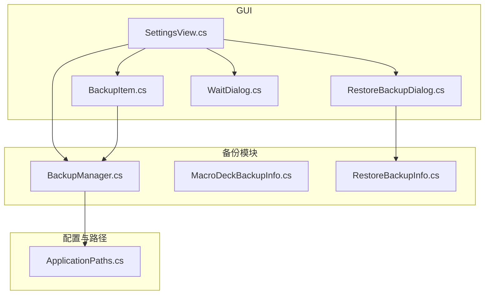
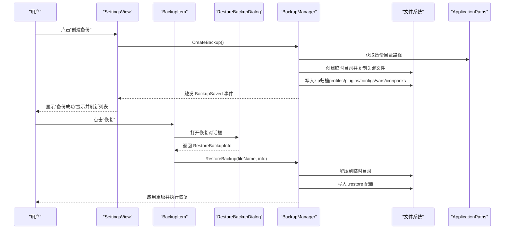
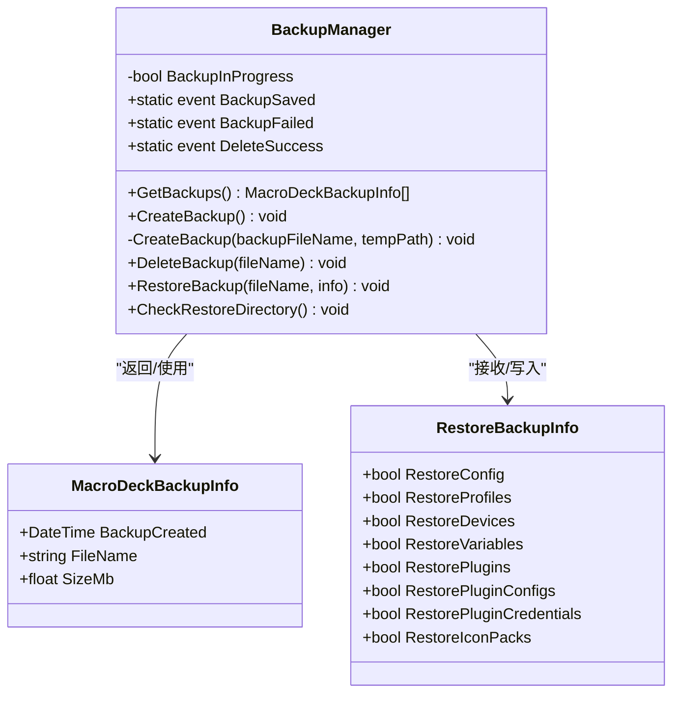
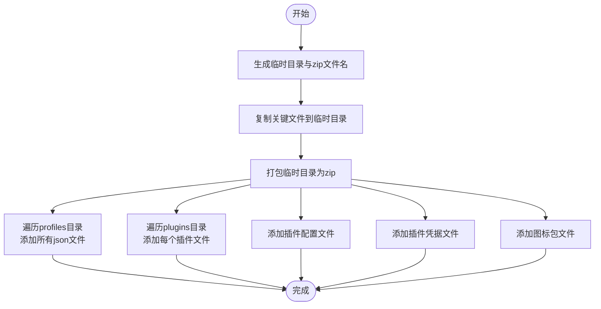
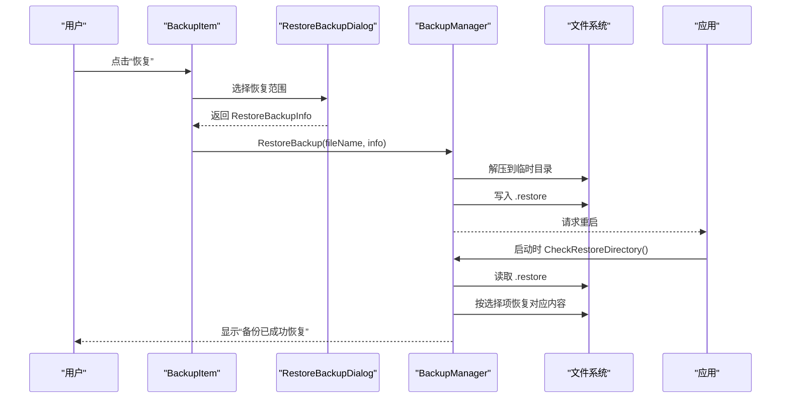
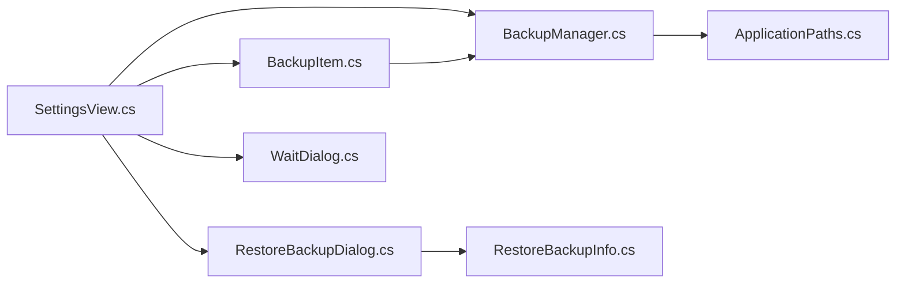

# 备份机制

<cite>
**本文引用的文件列表**
- [BackupManager.cs](file://src/MacroDeck/Backup/BackupManager.cs)
- [MacroDeckBackupInfo.cs](file://src/MacroDeck/Backup/MacroDeckBackupInfo.cs)
- [RestoreBackupInfo.cs](file://src/MacroDeck/Backup/RestoreBackupInfo.cs)
- [ApplicationPaths.cs](file://src/MacroDeck/StartupConfig/ApplicationPaths.cs)
- [SettingsView.cs](file://src/MacroDeck/GUI/MainWindowViews/SettingsView.cs)
- [BackupItem.cs](file://src/MacroDeck/GUI/CustomControls/Settings/BackupItem.cs)
- [RestoreBackupDialog.cs](file://src/MacroDeck/GUI/Dialogs/RestoreBackupDialog.cs)
- [WaitDialog.cs](file://src/MacroDeck/GUI/Dialogs/WaitDialog.cs)
</cite>

## 目录
1. [简介](#简介)
2. [项目结构](#项目结构)
3. [核心组件](#核心组件)
4. [架构总览](#架构总览)
5. [详细组件分析](#详细组件分析)
6. [依赖关系分析](#依赖关系分析)
7. [性能考量](#性能考量)
8. [故障排查指南](#故障排查指南)
9. [结论](#结论)

## 简介
本文件系统性阐述 Macro-Deck 的备份与恢复机制，重点围绕 BackupManager 类的功能与实现进行深入解析。内容覆盖：
- 备份触发机制（手动与自动）
- 备份文件创建流程（压缩算法、文件组织结构、存储格式）
- 备份内容范围（配置、按钮设置、插件配置、设备信息、变量数据、图标包等）
- 命名规则、时间戳格式与版本管理
- 错误处理与异常情况
- 进度跟踪与用户反馈
- 性能优化建议与最佳实践

## 项目结构
备份相关代码主要位于以下模块：
- Backup：备份与恢复逻辑
- StartupConfig：应用路径与目录初始化
- GUI：设置界面、备份项控件、恢复对话框、等待对话框
- Utils：目录复制工具（用于恢复时的目录级复制）

图表来源
- [BackupManager.cs:1-380](file://src/MacroDeck/Backup/BackupManager.cs#L1-L380)
- [ApplicationPaths.cs:1-143](file://src/MacroDeck/StartupConfig/ApplicationPaths.cs#L1-L143)
- [SettingsView.cs:1-388](file://src/MacroDeck/GUI/MainWindowViews/SettingsView.cs#L1-L388)
- [BackupItem.cs:1-62](file://src/MacroDeck/GUI/CustomControls/Settings/BackupItem.cs#L1-L62)
- [RestoreBackupDialog.cs:1-34](file://src/MacroDeck/GUI/Dialogs/RestoreBackupDialog.cs#L1-L34)
- [WaitDialog.cs:1-40](file://src/MacroDeck/GUI/Dialogs/WaitDialog.cs#L1-L40)

章节来源
- [BackupManager.cs:1-380](file://src/MacroDeck/Backup/BackupManager.cs#L1-L380)
- [ApplicationPaths.cs:1-143](file://src/MacroDeck/StartupConfig/ApplicationPaths.cs#L1-L143)
- [SettingsView.cs:1-388](file://src/MacroDeck/GUI/MainWindowViews/SettingsView.cs#L1-L388)
- [BackupItem.cs:1-62](file://src/MacroDeck/GUI/CustomControls/Settings/BackupItem.cs#L1-L62)
- [RestoreBackupDialog.cs:1-34](file://src/MacroDeck/GUI/Dialogs/RestoreBackupDialog.cs#L1-L34)
- [WaitDialog.cs:1-40](file://src/MacroDeck/GUI/Dialogs/WaitDialog.cs#L1-L40)

## 核心组件
- BackupManager：备份与恢复的核心类，负责备份创建、删除、恢复检查、事件发布与日志记录。
- MacroDeckBackupInfo：备份条目元数据模型（创建时间、文件名、大小）。
- RestoreBackupInfo：恢复时的选择模型（是否恢复配置、配置文件、设备、变量、插件、插件配置、插件凭据、图标包）。
- ApplicationPaths：应用路径与目录初始化，定义备份、临时、插件、图标包、配置、设备、变量、日志、资料夹等路径。
- SettingsView：设置界面，绑定备份事件、触发备份创建、加载备份列表。
- BackupItem：单个备份项控件，支持恢复与删除。
- RestoreBackupDialog：选择恢复范围的对话框。
- WaitDialog/SpinnerDialog：后台任务执行期间的等待提示。

章节来源
- [BackupManager.cs:16-380](file://src/MacroDeck/Backup/BackupManager.cs#L16-L380)
- [MacroDeckBackupInfo.cs:3-8](file://src/MacroDeck/Backup/MacroDeckBackupInfo.cs#L3-L8)
- [RestoreBackupInfo.cs:3-13](file://src/MacroDeck/Backup/RestoreBackupInfo.cs#L3-L13)
- [ApplicationPaths.cs:6-102](file://src/MacroDeck/StartupConfig/ApplicationPaths.cs#L6-L102)
- [SettingsView.cs:32-315](file://src/MacroDeck/GUI/MainWindowViews/SettingsView.cs#L32-L315)
- [BackupItem.cs:8-62](file://src/MacroDeck/GUI/CustomControls/Settings/BackupItem.cs#L8-L62)
- [RestoreBackupDialog.cs:7-34](file://src/MacroDeck/GUI/Dialogs/RestoreBackupDialog.cs#L7-L34)
- [WaitDialog.cs:17-40](file://src/MacroDeck/GUI/Dialogs/WaitDialog.cs#L17-L40)

## 架构总览
备份与恢复的整体流程如下：
- 手动备份：用户在设置界面点击“创建备份”，触发 BackupManager.CreateBackup；该方法生成 zip 文件并写入备份目录。
- 恢复备份：用户在备份项中选择“恢复”，弹出恢复对话框选择恢复范围，BackupManager.RestoreBackup 解压到临时目录并在重启后执行恢复。
- 自动备份：当前仓库未发现自动备份的定时器或计划任务实现；自动备份属于扩展建议，见“性能考量”与“最佳实践”。

图表来源
- [SettingsView.cs:306-310](file://src/MacroDeck/GUI/MainWindowViews/SettingsView.cs#L306-L310)
- [BackupItem.cs:29-47](file://src/MacroDeck/GUI/CustomControls/Settings/BackupItem.cs#L29-L47)
- [RestoreBackupDialog.cs:26-34](file://src/MacroDeck/GUI/Dialogs/RestoreBackupDialog.cs#L26-L34)
- [BackupManager.cs:270-305](file://src/MacroDeck/Backup/BackupManager.cs#L270-L305)
- [BackupManager.cs:224-267](file://src/MacroDeck/Backup/BackupManager.cs#L224-L267)

## 详细组件分析

### BackupManager 类
- 职责
  - 列举备份：扫描备份目录，返回排序后的备份列表。
  - 创建备份：生成带时间戳的 zip 文件，包含配置、设备、变量、配置文件、插件、插件配置、插件凭据、图标包等。
  - 删除备份：删除指定备份文件。
  - 恢复备份：解压到临时目录，写入恢复配置，重启应用以执行恢复。
  - 恢复检查：启动时检查临时目录是否存在恢复标记，存在则按选择项恢复对应内容。
  - 事件与日志：发布备份保存、失败、删除成功事件；使用日志记录关键操作与异常。

- 关键实现要点
  - 并发控制：通过静态标志位防止重复创建。
  - 命名规则：以“backup_yy-MM-dd_HH-mm-ss.zip”命名，确保唯一性与可读性。
  - 存储格式：zip 归档，内部目录结构与实际应用路径一致，便于恢复时直接复制。
  - 恢复范围：通过 RestoreBackupInfo 控制恢复配置、配置文件、设备、变量、插件、插件配置、插件凭据、图标包。
  - 错误处理：捕获异常并记录日志，向 UI 发送失败事件；恢复时逐项尝试，不影响其他项恢复。

图表来源
- [BackupManager.cs:16-380](file://src/MacroDeck/Backup/BackupManager.cs#L16-L380)
- [MacroDeckBackupInfo.cs:3-8](file://src/MacroDeck/Backup/MacroDeckBackupInfo.cs#L3-L8)
- [RestoreBackupInfo.cs:3-13](file://src/MacroDeck/Backup/RestoreBackupInfo.cs#L3-L13)

章节来源
- [BackupManager.cs:27-41](file://src/MacroDeck/Backup/BackupManager.cs#L27-L41)
- [BackupManager.cs:270-305](file://src/MacroDeck/Backup/BackupManager.cs#L270-L305)
- [BackupManager.cs:307-361](file://src/MacroDeck/Backup/BackupManager.cs#L307-L361)
- [BackupManager.cs:224-267](file://src/MacroDeck/Backup/BackupManager.cs#L224-L267)
- [BackupManager.cs:43-222](file://src/MacroDeck/Backup/BackupManager.cs#L43-L222)

### 备份文件创建流程
- 步骤
  - 生成临时目录与 zip 文件名（带时间戳）。
  - 复制关键文件到临时目录：主配置、设备、变量。
  - 将临时目录中的文件打包为 zip。
  - 递归添加 profiles 目录下的所有 json 文件。
  - 递归添加 plugins 目录下每个插件的文件。
  - 添加插件配置与插件凭据目录下的文件。
  - 添加图标包目录下每个图标包的文件。
- 压缩算法：使用 .NET System.IO.Compression.ZipFile。
- 组织结构：zip 内部保留目录层级，便于恢复时直接复制。
- 存储格式：zip 文件，扩展名为 .zip。

图表来源
- [BackupManager.cs:281-291](file://src/MacroDeck/Backup/BackupManager.cs#L281-L291)
- [BackupManager.cs:309-361](file://src/MacroDeck/Backup/BackupManager.cs#L309-L361)

章节来源
- [BackupManager.cs:270-305](file://src/MacroDeck/Backup/BackupManager.cs#L270-L305)
- [BackupManager.cs:307-361](file://src/MacroDeck/Backup/BackupManager.cs#L307-L361)

### 备份内容范围
- 配置文件：主配置、设备、变量。
- 插件配置：插件配置目录下的文件。
- 插件凭据：插件凭据目录下的文件。
- 图标包：图标包目录下的所有文件。
- 按钮设置：profiles 目录下的所有 json 文件，包含按钮与配置。
- 设备信息：设备文件。
- 变量数据：变量数据库文件。

章节来源
- [BackupManager.cs:285-290](file://src/MacroDeck/Backup/BackupManager.cs#L285-L290)
- [BackupManager.cs:317-322](file://src/MacroDeck/Backup/BackupManager.cs#L317-L322)
- [BackupManager.cs:324-335](file://src/MacroDeck/Backup/BackupManager.cs#L324-L335)
- [BackupManager.cs:337-342](file://src/MacroDeck/Backup/BackupManager.cs#L337-L342)
- [BackupManager.cs:344-349](file://src/MacroDeck/Backup/BackupManager.cs#L344-L349)
- [BackupManager.cs:352-360](file://src/MacroDeck/Backup/BackupManager.cs#L352-L360)

### 备份文件命名规则、时间戳格式与版本管理
- 命名规则：backup_yy-MM-dd_HH-mm-ss.zip。
- 时间戳格式：年-月-日_时-分-秒。
- 版本管理：当前实现未包含版本号字段；可通过在 zip 内嵌入版本信息或在文件名中加入版本号进行扩展。

章节来源
- [BackupManager.cs:278](file://src/MacroDeck/Backup/BackupManager.cs#L278)

### 备份触发机制
- 手动备份
  - 设置界面按钮触发 BackupManager.CreateBackup。
  - 后台线程执行，UI 显示旋转指示器，完成后发送事件并刷新列表。
- 自动备份
  - 当前仓库未发现自动备份的定时器或计划任务实现。
  - 如需实现，可在应用启动或空闲时调度任务，结合 BackupManager.CreateBackup。

章节来源
- [SettingsView.cs:306-310](file://src/MacroDeck/GUI/MainWindowViews/SettingsView.cs#L306-L310)
- [BackupManager.cs:270-305](file://src/MacroDeck/Backup/BackupManager.cs#L270-L305)

### 恢复机制
- 交互流程
  - 用户在备份项中点击“恢复”，打开恢复对话框选择恢复范围。
  - BackupManager.RestoreBackup 解压到临时目录，写入 .restore 配置，重启应用。
  - 应用启动后调用 CheckRestoreDirectory，根据 .restore 逐项恢复。
- 恢复范围
  - 配置、配置文件、设备、变量、插件、插件配置、插件凭据、图标包。
- 错误处理
  - 每个恢复步骤均 try/catch，失败记录日志但不中断后续步骤。

图表来源
- [BackupItem.cs:29-47](file://src/MacroDeck/GUI/CustomControls/Settings/BackupItem.cs#L29-L47)
- [RestoreBackupDialog.cs:26-34](file://src/MacroDeck/GUI/Dialogs/RestoreBackupDialog.cs#L26-L34)
- [BackupManager.cs:224-267](file://src/MacroDeck/Backup/BackupManager.cs#L224-L267)
- [BackupManager.cs:43-222](file://src/MacroDeck/Backup/BackupManager.cs#L43-L222)

章节来源
- [BackupItem.cs:29-47](file://src/MacroDeck/GUI/CustomControls/Settings/BackupItem.cs#L29-L47)
- [RestoreBackupDialog.cs:26-34](file://src/MacroDeck/GUI/Dialogs/RestoreBackupDialog.cs#L26-L34)
- [BackupManager.cs:224-267](file://src/MacroDeck/Backup/BackupManager.cs#L224-L267)
- [BackupManager.cs:43-222](file://src/MacroDeck/Backup/BackupManager.cs#L43-L222)

### 错误处理与异常情况
- 备份创建失败：捕获异常并记录日志，发布 BackupFailed 事件，UI 显示失败消息。
- 备份删除失败：捕获异常并记录日志。
- 恢复失败：逐项恢复，失败记录日志但继续执行其他项。
- 路径不存在：ApplicationPaths.Initialize 会创建缺失目录，避免运行时异常。

章节来源
- [BackupManager.cs:296-300](file://src/MacroDeck/Backup/BackupManager.cs#L296-L300)
- [BackupManager.cs:370-377](file://src/MacroDeck/Backup/BackupManager.cs#L370-L377)
- [BackupManager.cs:75-78](file://src/MacroDeck/Backup/BackupManager.cs#L75-L78)
- [ApplicationPaths.cs:64-102](file://src/MacroDeck/StartupConfig/ApplicationPaths.cs#L64-L102)

### 进度跟踪与用户反馈
- 手动备份：设置界面按钮显示旋转指示器，备份完成后弹窗提示“备份成功”，并刷新备份列表。
- 恢复备份：恢复对话框确认后，后台执行恢复，等待对话框显示“请稍候”，完成后提示“备份已成功恢复”。

章节来源
- [SettingsView.cs:278-304](file://src/MacroDeck/GUI/MainWindowViews/SettingsView.cs#L278-L304)
- [BackupItem.cs:40-46](file://src/MacroDeck/GUI/CustomControls/Settings/BackupItem.cs#L40-L46)
- [WaitDialog.cs:17-40](file://src/MacroDeck/GUI/Dialogs/WaitDialog.cs#L17-L40)

## 依赖关系分析
- BackupManager 依赖 ApplicationPaths 提供的路径常量与目录初始化。
- SettingsView 作为 UI 入口，订阅 BackupManager 的事件并驱动备份创建与列表刷新。
- BackupItem 与 RestoreBackupDialog 协作，收集恢复范围并触发恢复。
- WaitDialog/SpinnerDialog 提供后台任务期间的用户反馈。

图表来源
- [SettingsView.cs:32-35](file://src/MacroDeck/GUI/MainWindowViews/SettingsView.cs#L32-L35)
- [BackupItem.cs:29-47](file://src/MacroDeck/GUI/CustomControls/Settings/BackupItem.cs#L29-L47)
- [RestoreBackupDialog.cs:26-34](file://src/MacroDeck/GUI/Dialogs/RestoreBackupDialog.cs#L26-L34)
- [BackupManager.cs:16-380](file://src/MacroDeck/Backup/BackupManager.cs#L16-L380)
- [ApplicationPaths.cs:6-102](file://src/MacroDeck/StartupConfig/ApplicationPaths.cs#L6-L102)
- [WaitDialog.cs:17-40](file://src/MacroDeck/GUI/Dialogs/WaitDialog.cs#L17-L40)

章节来源
- [SettingsView.cs:32-35](file://src/MacroDeck/GUI/MainWindowViews/SettingsView.cs#L32-L35)
- [BackupManager.cs:16-380](file://src/MacroDeck/Backup/BackupManager.cs#L16-L380)
- [ApplicationPaths.cs:6-102](file://src/MacroDeck/StartupConfig/ApplicationPaths.cs#L6-L102)

## 性能考量
- 压缩与 IO
  - 使用 ZipFile.Open 创建 zip，适合中小规模数据；大规模数据可考虑分块压缩或增量备份策略。
  - 复制文件采用 File.Copy，建议在磁盘空间充足时进行，避免频繁 IO。
- 目录遍历
  - profiles、plugins、iconpacks 等目录遍历可能产生大量小文件 IO；建议在备份前统计文件数量与大小，必要时提供进度回调。
- 并发与阻塞
  - 备份与恢复在后台线程执行，UI 保持响应；如需进度反馈，可在 UI 层增加进度条或状态栏更新。
- 自动备份建议
  - 若实现自动备份，建议：
    - 在应用空闲时段执行（如 CPU/IO 空闲检测）。
    - 限制最大备份数量，定期清理旧备份。
    - 支持增量备份（仅备份变更文件），减少 IO 与存储占用。
    - 引入版本号或元数据文件，便于恢复时校验完整性。

## 故障排查指南
- 备份失败
  - 检查备份目录权限与磁盘空间。
  - 查看日志输出，定位具体异常位置。
  - 确认关键文件（配置、设备、变量）可读。
- 恢复失败
  - 确认 .restore 文件存在且可读。
  - 检查目标路径权限，确保可覆盖写入。
  - 分别尝试仅恢复部分范围，定位失败项。
- UI 无响应
  - 确认后台线程未被阻塞，必要时增加进度反馈。
  - 检查事件订阅是否正确，确保 UI 能收到 BackupSaved/BackupFailed/DeleteSuccess 事件。

章节来源
- [BackupManager.cs:296-300](file://src/MacroDeck/Backup/BackupManager.cs#L296-L300)
- [BackupManager.cs:370-377](file://src/MacroDeck/Backup/BackupManager.cs#L370-L377)
- [BackupManager.cs:75-78](file://src/MacroDeck/Backup/BackupManager.cs#L75-L78)
- [SettingsView.cs:278-304](file://src/MacroDeck/GUI/MainWindowViews/SettingsView.cs#L278-L304)

## 结论
Macro-Deck 的备份机制以 BackupManager 为核心，提供了完整的备份创建、删除、恢复与检查能力。其设计简洁可靠，覆盖了配置、按钮设置、插件、设备、变量与图标包等关键数据。当前实现以手动触发为主，自动备份可通过扩展实现。建议在生产环境中引入版本管理、增量备份与进度反馈，以进一步提升可靠性与用户体验。