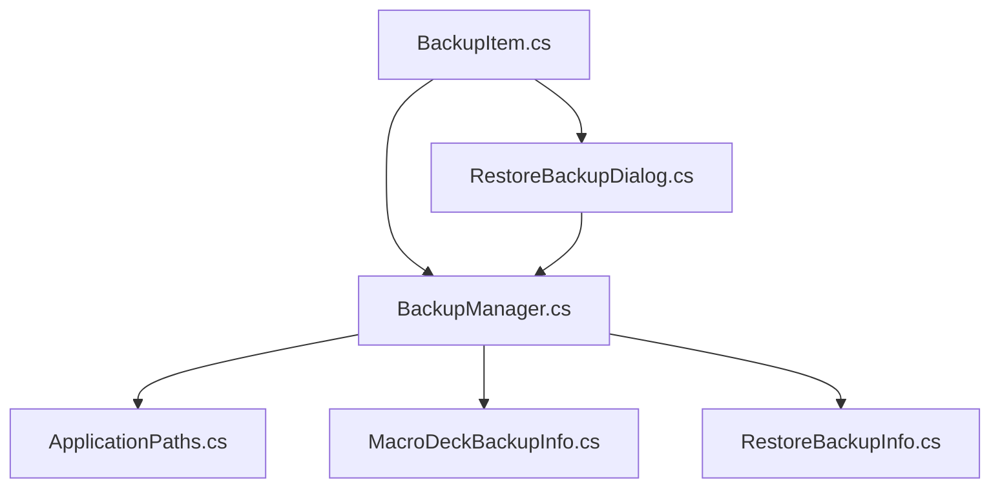
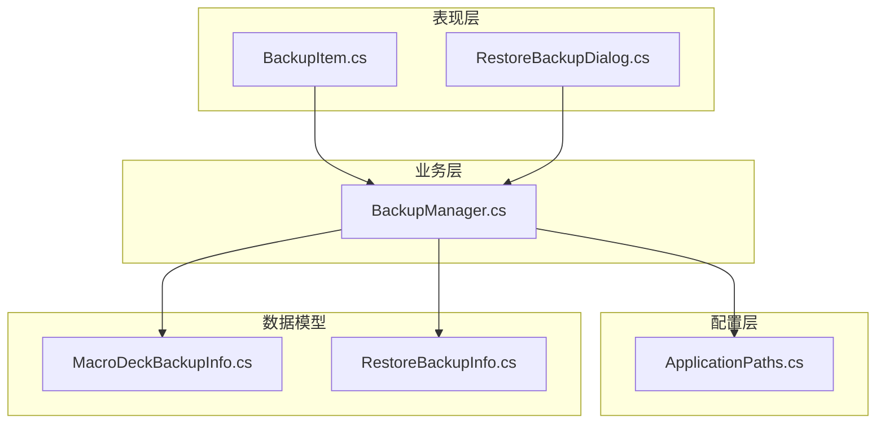
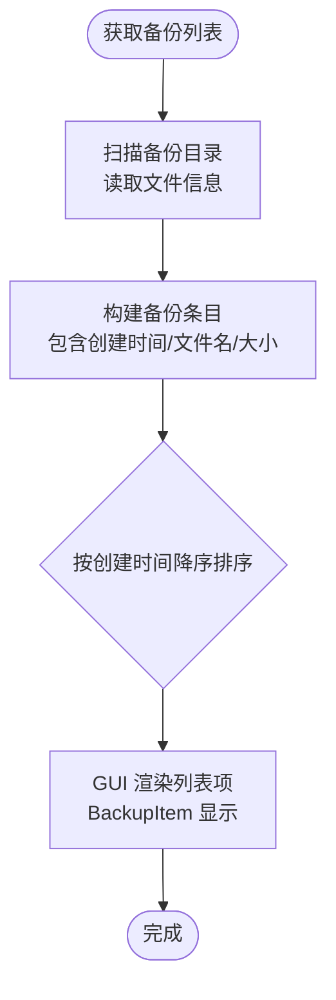
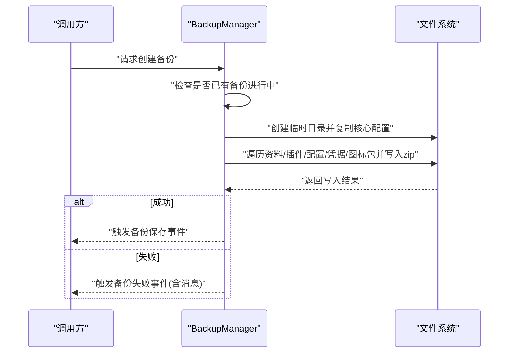
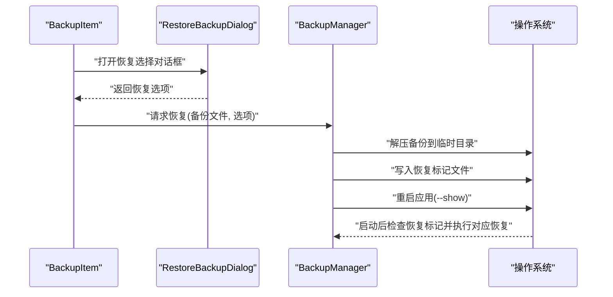
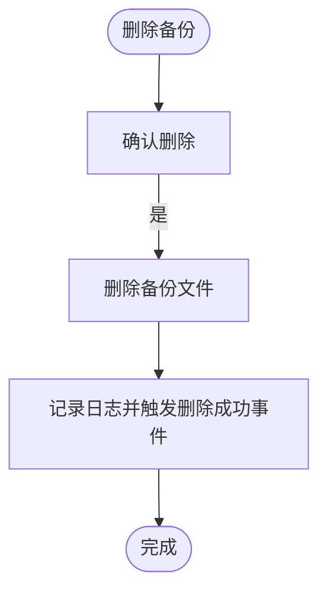
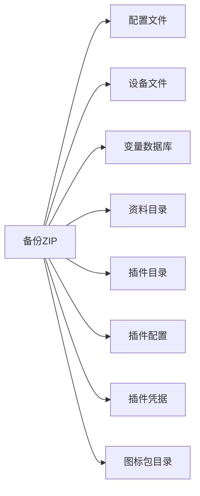

# 备份管理

<cite>
**本文引用的文件**
- [BackupManager.cs](file://src/MacroDeck/Backup/BackupManager.cs)
- [MacroDeckBackupInfo.cs](file://src/MacroDeck/Backup/MacroDeckBackupInfo.cs)
- [RestoreBackupInfo.cs](file://src/MacroDeck/Backup/RestoreBackupInfo.cs)
- [ApplicationPaths.cs](file://src/MacroDeck/StartupConfig/ApplicationPaths.cs)
- [BackupItem.cs](file://src/MacroDeck/GUI/CustomControls/Settings/BackupItem.cs)
- [BackupItem.Designer.cs](file://src/MacroDeck/GUI/CustomControls/Settings/BackupItem.Designer.cs)
- [RestoreBackupDialog.cs](file://src/MacroDeck/GUI/Dialogs/RestoreBackupDialog.cs)
- [RestoreBackupDialog.Designer.cs](file://src/MacroDeck/GUI/Dialogs/RestoreBackupDialog.Designer.cs)
</cite>

## 目录
1. [简介](#简介)
2. [项目结构](#项目结构)
3. [核心组件](#核心组件)
4. [架构总览](#架构总览)
5. [详细组件分析](#详细组件分析)
6. [依赖关系分析](#依赖关系分析)
7. [性能与存储优化](#性能与存储优化)
8. [故障排查指南](#故障排查指南)
9. [结论](#结论)
10. [附录](#附录)

## 简介
本文件系统性阐述 Macro-Deck 的备份管理功能，覆盖备份文件的组织与管理、备份列表的展示与排序、删除与清理策略、空间管理与磁盘优化、搜索与过滤能力、备份历史与版本控制、导入导出流程、可定制的备份策略与频率配置建议、以及压缩与存储优化技术。文档以代码为依据，结合可视化图示帮助不同背景的读者理解与使用。

## 项目结构
备份管理相关模块主要分布在以下位置：
- 备份核心逻辑：BackupManager.cs
- 备份元数据模型：MacroDeckBackupInfo.cs
- 恢复选择模型：RestoreBackupInfo.cs
- 应用路径与目录：ApplicationPaths.cs
- GUI 列表项控件：BackupItem.cs 及其设计器
- 恢复对话框：RestoreBackupDialog.cs 及其设计器

**图表来源**
- [BackupManager.cs:1-380](file://src/MacroDeck/Backup/BackupManager.cs#L1-L380)
- [ApplicationPaths.cs:1-143](file://src/MacroDeck/StartupConfig/ApplicationPaths.cs#L1-L143)
- [MacroDeckBackupInfo.cs:1-9](file://src/MacroDeck/Backup/MacroDeckBackupInfo.cs#L1-L9)
- [RestoreBackupInfo.cs:1-14](file://src/MacroDeck/Backup/RestoreBackupInfo.cs#L1-L14)
- [BackupItem.cs:1-62](file://src/MacroDeck/GUI/CustomControls/Settings/BackupItem.cs#L1-L62)
- [RestoreBackupDialog.cs:1-52](file://src/MacroDeck/GUI/Dialogs/RestoreBackupDialog.cs#L1-L52)

**章节来源**
- [BackupManager.cs:1-380](file://src/MacroDeck/Backup/BackupManager.cs#L1-L380)
- [ApplicationPaths.cs:1-143](file://src/MacroDeck/StartupConfig/ApplicationPaths.cs#L1-L143)

## 核心组件
- BackupManager：负责备份创建、恢复、删除、备份列表读取与恢复检查；内部使用压缩归档存放备份文件。
- MacroDeckBackupInfo：备份条目的元数据（创建时间、文件名、大小）。
- RestoreBackupInfo：恢复时的选择项（配置、资料、设备、变量、插件、插件配置、插件凭据、图标包等）。
- ApplicationPaths：应用路径初始化与校验，包括备份目录、临时目录、配置文件路径等。
- BackupItem：设置界面中的单个备份条目控件，支持查看名称、日期、大小，触发恢复与删除。
- RestoreBackupDialog：恢复前的交互式选择对话框，收集用户希望恢复的数据类别。

**章节来源**
- [BackupManager.cs:16-380](file://src/MacroDeck/Backup/BackupManager.cs#L16-L380)
- [MacroDeckBackupInfo.cs:3-8](file://src/MacroDeck/Backup/MacroDeckBackupInfo.cs#L3-L8)
- [RestoreBackupInfo.cs:3-13](file://src/MacroDeck/Backup/RestoreBackupInfo.cs#L3-L13)
- [ApplicationPaths.cs:6-61](file://src/MacroDeck/StartupConfig/ApplicationPaths.cs#L6-L61)
- [BackupItem.cs:8-62](file://src/MacroDeck/GUI/CustomControls/Settings/BackupItem.cs#L8-L62)
- [RestoreBackupDialog.cs:7-52](file://src/MacroDeck/GUI/Dialogs/RestoreBackupDialog.cs#L7-L52)

## 架构总览
备份管理采用“集中式管理器 + 路径配置 + GUI 控件”的分层设计：
- 管理器层：BackupManager 统一处理备份生命周期与恢复流程。
- 配置层：ApplicationPaths 提供跨平台/便携模式下的目录布局与校验。
- 表现层：BackupItem 展示备份列表，RestoreBackupDialog 收集恢复选项。

**图表来源**
- [BackupManager.cs:16-380](file://src/MacroDeck/Backup/BackupManager.cs#L16-L380)
- [ApplicationPaths.cs:6-61](file://src/MacroDeck/StartupConfig/ApplicationPaths.cs#L6-L61)
- [MacroDeckBackupInfo.cs:3-8](file://src/MacroDeck/Backup/MacroDeckBackupInfo.cs#L3-L8)
- [RestoreBackupInfo.cs:3-13](file://src/MacroDeck/Backup/RestoreBackupInfo.cs#L3-L13)
- [BackupItem.cs:8-62](file://src/MacroDeck/GUI/CustomControls/Settings/BackupItem.cs#L8-L62)
- [RestoreBackupDialog.cs:7-52](file://src/MacroDeck/GUI/Dialogs/RestoreBackupDialog.cs#L7-L52)

## 详细组件分析

### 备份列表与排序
- 列表来源：遍历备份目录，读取每个 zip 文件的创建时间、文件名与大小，封装为备份条目。
- 排序规则：按创建时间降序排列，最近的备份排在最前。
- 展示控件：BackupItem 负责渲染文件名、日期与大小；支持触发恢复与删除操作。

**图表来源**
- [BackupManager.cs:27-41](file://src/MacroDeck/Backup/BackupManager.cs#L27-L41)
- [BackupItem.cs:18-27](file://src/MacroDeck/GUI/CustomControls/Settings/BackupItem.cs#L18-L27)

**章节来源**
- [BackupManager.cs:27-41](file://src/MacroDeck/Backup/BackupManager.cs#L27-L41)
- [BackupItem.cs:18-27](file://src/MacroDeck/GUI/CustomControls/Settings/BackupItem.cs#L18-L27)

### 备份创建与压缩
- 创建流程：生成带时间戳的 zip 文件名，先复制核心配置到临时目录，再将资料、插件、插件配置、插件凭据、图标包等逐项写入 zip。
- 并发保护：通过内部状态避免并发重复创建。
- 成功/失败事件：成功触发保存事件，失败触发失败事件并携带错误消息。

**图表来源**
- [BackupManager.cs:270-305](file://src/MacroDeck/Backup/BackupManager.cs#L270-L305)
- [BackupManager.cs:307-361](file://src/MacroDeck/Backup/BackupManager.cs#L307-L361)

**章节来源**
- [BackupManager.cs:270-305](file://src/MacroDeck/Backup/BackupManager.cs#L270-L305)
- [BackupManager.cs:307-361](file://src/MacroDeck/Backup/BackupManager.cs#L307-L361)

### 备份恢复与选择
- 恢复流程：解压目标备份至临时恢复目录，写入恢复选项文件，重启应用以执行恢复步骤。
- 恢复检查：启动时检测恢复标记文件，按选项逐一恢复配置、资料、设备、变量、插件、插件配置、插件凭据、图标包。
- 用户交互：RestoreBackupDialog 提供勾选项，BackupItem 触发恢复对话框。

**图表来源**
- [BackupItem.cs:29-48](file://src/MacroDeck/GUI/CustomControls/Settings/BackupItem.cs#L29-L48)
- [RestoreBackupDialog.cs:26-44](file://src/MacroDeck/GUI/Dialogs/RestoreBackupDialog.cs#L26-L44)
- [BackupManager.cs:224-267](file://src/MacroDeck/Backup/BackupManager.cs#L224-L267)
- [BackupManager.cs:43-222](file://src/MacroDeck/Backup/BackupManager.cs#L43-L222)

**章节来源**
- [BackupItem.cs:29-48](file://src/MacroDeck/GUI/CustomControls/Settings/BackupItem.cs#L29-L48)
- [RestoreBackupDialog.cs:26-44](file://src/MacroDeck/GUI/Dialogs/RestoreBackupDialog.cs#L26-L44)
- [BackupManager.cs:224-267](file://src/MacroDeck/Backup/BackupManager.cs#L224-L267)
- [BackupManager.cs:43-222](file://src/MacroDeck/Backup/BackupManager.cs#L43-L222)

### 备份删除与清理
- 删除操作：直接删除备份文件，触发删除成功事件。
- 临时目录清理：ApplicationPaths 提供临时目录清理方法，定期清理可减少磁盘占用。
- 恢复后清理：恢复流程会清空临时恢复目录残留。

**图表来源**
- [BackupItem.cs:50-60](file://src/MacroDeck/GUI/CustomControls/Settings/BackupItem.cs#L50-L60)
- [BackupManager.cs:363-378](file://src/MacroDeck/Backup/BackupManager.cs#L363-L378)
- [ApplicationPaths.cs:104-141](file://src/MacroDeck/StartupConfig/ApplicationPaths.cs#L104-L141)

**章节来源**
- [BackupItem.cs:50-60](file://src/MacroDeck/GUI/CustomControls/Settings/BackupItem.cs#L50-L60)
- [BackupManager.cs:363-378](file://src/MacroDeck/Backup/BackupManager.cs#L363-L378)
- [ApplicationPaths.cs:104-141](file://src/MacroDeck/StartupConfig/ApplicationPaths.cs#L104-L141)

### 备份文件组织与存储
- 存储格式：zip 压缩归档，包含核心配置与多类数据子目录。
- 数据范围：配置文件、设备文件、变量数据库、资料目录、插件目录、插件配置、插件凭据、图标包目录。
- 目录布局：由 ApplicationPaths 统一管理，支持便携模式与标准模式。

**图表来源**
- [BackupManager.cs:309-361](file://src/MacroDeck/Backup/BackupManager.cs#L309-L361)
- [ApplicationPaths.cs:43-61](file://src/MacroDeck/StartupConfig/ApplicationPaths.cs#L43-L61)

**章节来源**
- [BackupManager.cs:309-361](file://src/MacroDeck/Backup/BackupManager.cs#L309-L361)
- [ApplicationPaths.cs:43-61](file://src/MacroDeck/StartupConfig/ApplicationPaths.cs#L43-L61)

### 搜索与过滤
- 当前实现：备份列表按创建时间排序，未见专门的搜索或过滤 UI 逻辑。
- 建议：可在 GUI 层增加文本过滤输入框，对文件名或日期进行筛选，并重新绑定列表控件。

**章节来源**
- [BackupManager.cs:27-41](file://src/MacroDeck/Backup/BackupManager.cs#L27-L41)
- [BackupItem.cs:18-27](file://src/MacroDeck/GUI/CustomControls/Settings/BackupItem.cs#L18-L27)

### 备份历史与版本控制
- 历史记录：按时间顺序列出多个备份，便于回溯。
- 版本控制：当前未实现语义化的版本号或差异比较，仅以时间戳区分。

**章节来源**
- [BackupManager.cs:27-41](file://src/MacroDeck/Backup/BackupManager.cs#L27-L41)

### 导入与导出
- 导出：备份创建即为导出行为，生成 zip 文件。
- 导入：恢复流程即为导入行为，从 zip 中提取并替换对应数据。

**章节来源**
- [BackupManager.cs:270-305](file://src/MacroDeck/Backup/BackupManager.cs#L270-L305)
- [BackupManager.cs:224-267](file://src/MacroDeck/Backup/BackupManager.cs#L224-L267)

### 自定义配置与自动化
- 自定义配置：可通过修改备份创建与恢复选项实现策略定制（如仅备份特定数据类别）。
- 自动化：当前未内置定时任务或自动备份调度；建议在外部计划任务或服务中调用备份创建接口。

**章节来源**
- [RestoreBackupDialog.cs:26-44](file://src/MacroDeck/GUI/Dialogs/RestoreBackupDialog.cs#L26-L44)
- [BackupManager.cs:270-305](file://src/MacroDeck/Backup/BackupManager.cs#L270-L305)

## 依赖关系分析
- BackupManager 依赖 ApplicationPaths 获取备份目录与各数据路径。
- GUI 控件 BackupItem 与 RestoreBackupDialog 通过 BackupManager 协调备份与恢复。
- 模型类 MacroDeckBackupInfo 与 RestoreBackupInfo 作为数据载体被管理器与 GUI 使用。

```mermaid
classDiagram
class BackupManager {
+GetBackups() MacroDeckBackupInfo[]
+CreateBackup() void
+RestoreBackup(backupFileName, restoreInfo) void
+DeleteBackup(fileName) void
+CheckRestoreDirectory() void
}
class ApplicationPaths {
+BackupsDirectoryPath string
+MainConfigFilePath string
+DevicesFilePath string
+VariablesFilePath string
+ProfilesDirectoryPath string
+PluginsDirectoryPath string
+PluginConfigPath string
+PluginCredentialsPath string
+IconPackDirectoryPath string
+CleanUpTempDirectory() void
}
class MacroDeckBackupInfo {
+BackupCreated DateTime
+FileName string
+SizeMb float
}
class RestoreBackupInfo {
+RestoreConfig bool
+RestoreProfiles bool
+RestoreDevices bool
+RestoreVariables bool
+RestorePlugins bool
+RestorePluginConfigs bool
+RestorePluginCredentials bool
+RestoreIconPacks bool
}
class BackupItem {
+Load() void
+BtnRestore_Click() void
+btnDelete_Click() void
}
class RestoreBackupDialog {
+RestoreBackupInfo RestoreBackupInfo
+ShowDialog() DialogResult
}
BackupManager --> ApplicationPaths : "使用路径"
BackupManager --> MacroDeckBackupInfo : "读取/写入"
BackupManager --> RestoreBackupInfo : "读取"
BackupItem --> BackupManager : "调用"
RestoreBackupDialog --> BackupManager : "调用"
```

**图表来源**
- [BackupManager.cs:16-380](file://src/MacroDeck/Backup/BackupManager.cs#L16-L380)
- [ApplicationPaths.cs:6-61](file://src/MacroDeck/StartupConfig/ApplicationPaths.cs#L6-L61)
- [MacroDeckBackupInfo.cs:3-8](file://src/MacroDeck/Backup/MacroDeckBackupInfo.cs#L3-L8)
- [RestoreBackupInfo.cs:3-13](file://src/MacroDeck/Backup/RestoreBackupInfo.cs#L3-L13)
- [BackupItem.cs:8-62](file://src/MacroDeck/GUI/CustomControls/Settings/BackupItem.cs#L8-L62)
- [RestoreBackupDialog.cs:7-52](file://src/MacroDeck/GUI/Dialogs/RestoreBackupDialog.cs#L7-L52)

**章节来源**
- [BackupManager.cs:16-380](file://src/MacroDeck/Backup/BackupManager.cs#L16-L380)
- [ApplicationPaths.cs:6-61](file://src/MacroDeck/StartupConfig/ApplicationPaths.cs#L6-L61)
- [MacroDeckBackupInfo.cs:3-8](file://src/MacroDeck/Backup/MacroDeckBackupInfo.cs#L3-L8)
- [RestoreBackupInfo.cs:3-13](file://src/MacroDeck/Backup/RestoreBackupInfo.cs#L3-L13)
- [BackupItem.cs:8-62](file://src/MacroDeck/GUI/CustomControls/Settings/BackupItem.cs#L8-L62)
- [RestoreBackupDialog.cs:7-52](file://src/MacroDeck/GUI/Dialogs/RestoreBackupDialog.cs#L7-L52)

## 性能与存储优化
- 压缩策略：使用 zip 归档统一存储，减少碎片与提高传输效率。
- 写入优化：先复制核心配置到临时目录，再批量写入 zip，降低锁竞争。
- 磁盘清理：定期调用临时目录清理方法，避免残留文件占用空间。
- I/O 注意：恢复时对大量目录进行复制，建议在空闲时段执行，避免影响系统性能。

**章节来源**
- [BackupManager.cs:309-361](file://src/MacroDeck/Backup/BackupManager.cs#L309-L361)
- [ApplicationPaths.cs:104-141](file://src/MacroDeck/StartupConfig/ApplicationPaths.cs#L104-L141)

## 故障排查指南
- 备份失败：检查备份创建过程中的异常消息，关注日志输出。
- 恢复失败：确认恢复选项与目标路径权限，检查临时恢复目录是否存在且可写。
- 删除失败：确认文件是否存在、是否被占用，检查权限与杀软拦截。
- 目录缺失：确保 ApplicationPaths 初始化已创建所需目录，必要时手动重建。

**章节来源**
- [BackupManager.cs:296-300](file://src/MacroDeck/Backup/BackupManager.cs#L296-L300)
- [BackupManager.cs:373-377](file://src/MacroDeck/Backup/BackupManager.cs#L373-L377)
- [ApplicationPaths.cs:64-102](file://src/MacroDeck/StartupConfig/ApplicationPaths.cs#L64-L102)

## 结论
Macro-Deck 的备份管理以简洁可靠为核心：通过 zip 归档统一存储关键数据，提供直观的列表展示与恢复选择，具备基本的删除与清理能力。当前未内置搜索过滤、版本控制与自动化调度，但可通过扩展 GUI 与外部计划任务实现更完善的备份策略。建议在生产环境中配合定期清理与验证流程，确保备份可用性与磁盘空间健康。

## 附录
- 关键路径与文件
  - 备份目录：由 ApplicationPaths 提供，位于用户数据目录下的 backups 子目录。
  - 临时目录：用于备份创建与恢复的中间文件存放。
  - 核心文件：配置、设备、变量数据库、资料目录、插件、插件配置、插件凭据、图标包目录均纳入备份范围。

**章节来源**
- [ApplicationPaths.cs:43-61](file://src/MacroDeck/StartupConfig/ApplicationPaths.cs#L43-L61)
- [BackupManager.cs:309-361](file://src/MacroDeck/Backup/BackupManager.cs#L309-L361)