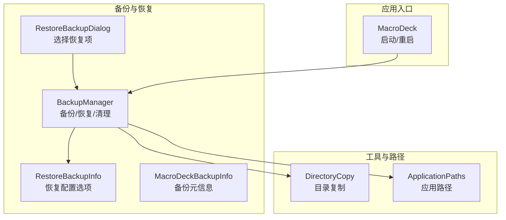
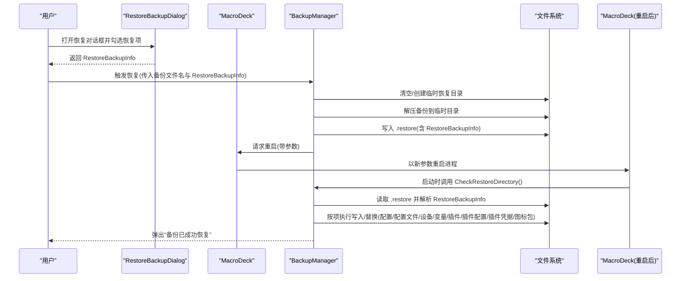
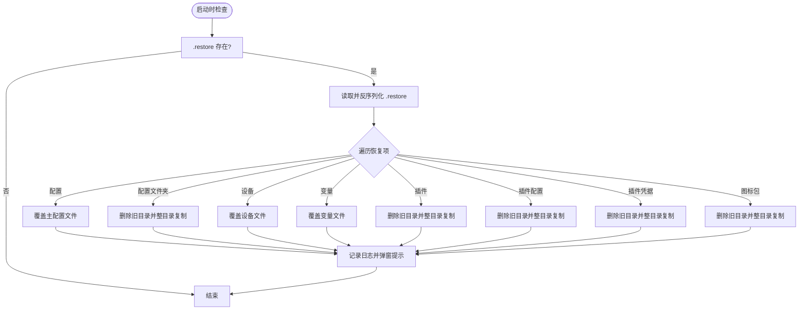
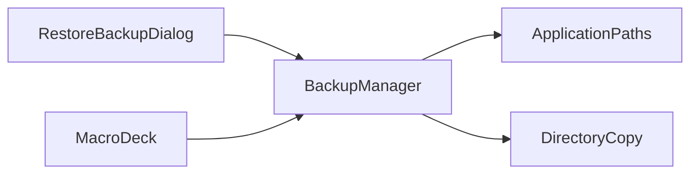

# 恢复流程

<cite>
**本文引用的文件**
- [src\MacroDeck\Backup\RestoreBackupInfo.cs](file://src\MacroDeck\Backup\RestoreBackupInfo.cs)
- [src\MacroDeck\Backup\MacroDeckBackupInfo.cs](file://src\MacroDeck\Backup\MacroDeckBackupInfo.cs)
- [src\MacroDeck\Backup\BackupManager.cs](file://src\MacroDeck\Backup\BackupManager.cs)
- [src\MacroDeck\GUI\Dialogs\RestoreBackupDialog.cs](file://src\MacroDeck\GUI\Dialogs\RestoreBackupDialog.cs)
- [src\MacroDeck\Utils\DirectoryCopy.cs](file://src\MacroDeck\Utils\DirectoryCopy.cs)
- [src\MacroDeck\StartupConfig\ApplicationPaths.cs](file://src\MacroDeck\StartupConfig\ApplicationPaths.cs)
- [src\MacroDeck\MacroDeck.cs](file://src\MacroDeck\MacroDeck.cs)
</cite>

## 目录
1. [简介](#简介)
2. [项目结构](#项目结构)
3. [核心组件](#核心组件)
4. [架构总览](#架构总览)
5. [详细组件分析](#详细组件分析)
6. [依赖关系分析](#依赖关系分析)
7. [性能考量](#性能考量)
8. [故障排查指南](#故障排查指南)
9. [结论](#结论)
10. [附录](#附录)

## 简介
本文件系统性阐述 Macro-Deck 的“恢复流程”完整生命周期，覆盖从选择备份文件、解压与解析恢复配置、到按类型逐项写入目标位置的全过程。文档重点说明：
- 恢复配置对象 RestoreBackupInfo 的可用选项及可单独恢复的数据范围
- 恢复前的备份策略与数据保护建议
- 恢复过程中的数据校验与完整性保障
- 各数据类型的恢复顺序与相互依赖关系
- 失败时的回滚与错误恢复机制
- 用户交互与进度反馈
- 最佳实践与注意事项

## 项目结构
围绕“恢复流程”的关键代码分布在以下模块：
- 配置与模型：RestoreBackupInfo、MacroDeckBackupInfo
- 管理器：BackupManager（负责备份与恢复）
- GUI 对话框：RestoreBackupDialog（用于选择恢复项）
- 工具类：DirectoryCopy（目录复制）
- 路径管理：ApplicationPaths（定义各数据目录与文件路径）
- 应用入口：MacroDeck（启动时触发恢复检查）

**图表来源**
- [src\MacroDeck\Backup\RestoreBackupInfo.cs:1-14](file://src\MacroDeck\Backup\RestoreBackupInfo.cs#L1-L14)
- [src\MacroDeck\Backup\MacroDeckBackupInfo.cs:1-9](file://src\MacroDeck\Backup\MacroDeckBackupInfo.cs#L1-L9)
- [src\MacroDeck\Backup\BackupManager.cs:1-380](file://src\MacroDeck\Backup\BackupManager.cs#L1-L380)
- [src\MacroDeck\GUI\Dialogs\RestoreBackupDialog.cs:1-52](file://src\MacroDeck\GUI\Dialogs\RestoreBackupDialog.cs#L1-L52)
- [src\MacroDeck\Utils\DirectoryCopy.cs:1-42](file://src\MacroDeck\Utils\DirectoryCopy.cs#L1-L42)
- [src\MacroDeck\StartupConfig\ApplicationPaths.cs:1-143](file://src\MacroDeck\StartupConfig\ApplicationPaths.cs#L1-L143)
- [src\MacroDeck\MacroDeck.cs:1-340](file://src\MacroDeck\MacroDeck.cs#L1-L340)

**章节来源**
- [src\MacroDeck\Backup\RestoreBackupInfo.cs:1-14](file://src\MacroDeck\Backup\RestoreBackupInfo.cs#L1-L14)
- [src\MacroDeck\Backup\MacroDeckBackupInfo.cs:1-9](file://src\MacroDeck\Backup\MacroDeckBackupInfo.cs#L1-L9)
- [src\MacroDeck\Backup\BackupManager.cs:1-380](file://src\MacroDeck\Backup\BackupManager.cs#L1-L380)
- [src\MacroDeck\GUI\Dialogs\RestoreBackupDialog.cs:1-52](file://src\MacroDeck\GUI\Dialogs\RestoreBackupDialog.cs#L1-L52)
- [src\MacroDeck\Utils\DirectoryCopy.cs:1-42](file://src\MacroDeck\Utils\DirectoryCopy.cs#L1-L42)
- [src\MacroDeck\StartupConfig\ApplicationPaths.cs:1-143](file://src\MacroDeck\StartupConfig\ApplicationPaths.cs#L1-L143)
- [src\MacroDeck\MacroDeck.cs:1-340](file://src\MacroDeck\MacroDeck.cs#L1-L340)

## 核心组件
- RestoreBackupInfo：定义可选恢复的数据类别开关，支持配置、配置文件、设备、变量、插件、插件配置、插件凭据、图标包等。
- BackupManager：实现备份创建、删除；核心恢复逻辑在启动阶段扫描临时恢复目录并执行对应写入；同时提供恢复入口以解压备份并写入恢复配置。
- RestoreBackupDialog：提供图形化界面供用户勾选需要恢复的数据项，并生成 RestoreBackupInfo。
- DirectoryCopy：递归复制目录树，用于整目录替换。
- ApplicationPaths：集中管理所有数据目录与文件路径，确保恢复写入目标正确。
- MacroDeck：应用启动时调用 BackupManager 检查恢复目录，完成恢复后提示用户。

**章节来源**
- [src\MacroDeck\Backup\RestoreBackupInfo.cs:1-14](file://src\MacroDeck\Backup\RestoreBackupInfo.cs#L1-L14)
- [src\MacroDeck\Backup\BackupManager.cs:43-222](file://src\MacroDeck\Backup\BackupManager.cs#L43-L222)
- [src\MacroDeck\GUI\Dialogs\RestoreBackupDialog.cs:26-44](file://src\MacroDeck\GUI\Dialogs\RestoreBackupDialog.cs#L26-L44)
- [src\MacroDeck\Utils\DirectoryCopy.cs:7-40](file://src\MacroDeck\Utils\DirectoryCopy.cs#L7-L40)
- [src\MacroDeck\StartupConfig\ApplicationPaths.cs:43-61](file://src\MacroDeck\StartupConfig\ApplicationPaths.cs#L43-L61)
- [src\MacroDeck\MacroDeck.cs:90-92](file://src\MacroDeck\MacroDeck.cs#L90-L92)

## 架构总览
下图展示“恢复流程”的端到端架构：用户通过对话框选择恢复项，BackupManager 解压备份并写入恢复配置，应用重启后在启动阶段检测恢复目录并执行实际写入，最后弹出成功提示。

**图表来源**
- [src\MacroDeck\GUI\Dialogs\RestoreBackupDialog.cs:26-44](file://src\MacroDeck\GUI\Dialogs\RestoreBackupDialog.cs#L26-L44)
- [src\MacroDeck\Backup\BackupManager.cs:224-267](file://src\MacroDeck\Backup\BackupManager.cs#L224-L267)
- [src\MacroDeck\Backup\BackupManager.cs:43-222](file://src\MacroDeck\Backup\BackupManager.cs#L43-L222)
- [src\MacroDeck\MacroDeck.cs:261-278](file://src\MacroDeck\MacroDeck.cs#L261-L278)

## 详细组件分析

### 组件一：RestoreBackupInfo（恢复配置）
- 字段含义（可单独恢复）：
  - RestoreConfig：是否恢复主配置文件
  - RestoreProfiles：是否恢复配置文件夹（JSON/数据库文件）
  - RestoreDevices：是否恢复设备列表文件
  - RestoreVariables：是否恢复变量存储文件
  - RestorePlugins：是否恢复插件目录
  - RestorePluginConfigs：是否恢复插件配置目录
  - RestorePluginCredentials：是否恢复插件凭据目录
  - RestoreIconPacks：是否恢复图标包目录
- 默认值均为 false，需显式勾选才会执行对应恢复。

**章节来源**
- [src\MacroDeck\Backup\RestoreBackupInfo.cs:3-13](file://src\MacroDeck\Backup\RestoreBackupInfo.cs#L3-L13)

### 组件二：BackupManager（备份与恢复）
- 恢复入口：
  - 接收备份文件名与 RestoreBackupInfo
  - 清理或创建临时恢复目录
  - 解压备份至临时目录
  - 将 RestoreBackupInfo 序列化为 .restore 文件
  - 请求应用重启
- 启动时恢复检查：
  - 若存在 .restore 文件，则读取并反序列化为 RestoreBackupInfo
  - 逐项判断并执行写入/替换：
    - 配置文件：直接覆盖主配置文件
    - 配置文件夹：先删除旧目录，再整目录复制
    - 设备/变量：文件级覆盖
    - 插件/插件配置/插件凭据/图标包：目录级复制
  - 成功后弹窗提示

**图表来源**
- [src\MacroDeck\Backup\BackupManager.cs:43-222](file://src\MacroDeck\Backup\BackupManager.cs#L43-L222)

**章节来源**
- [src\MacroDeck\Backup\BackupManager.cs:224-267](file://src\MacroDeck\Backup\BackupManager.cs#L224-L267)
- [src\MacroDeck\Backup\BackupManager.cs:43-222](file://src\MacroDeck\Backup\BackupManager.cs#L43-L222)

### 组件三：RestoreBackupDialog（用户交互）
- 提供多选项勾选，映射到 RestoreBackupInfo
- 点击“恢复”后返回该配置给调用方

**章节来源**
- [src\MacroDeck\GUI\Dialogs\RestoreBackupDialog.cs:26-44](file://src\MacroDeck\GUI\Dialogs\RestoreBackupDialog.cs#L26-L44)

### 组件四：DirectoryCopy（目录复制）
- 支持递归复制目录树，用于整目录替换
- 在恢复中被用于配置文件夹、插件、插件配置、插件凭据、图标包等目录的替换

**章节来源**
- [src\MacroDeck\Utils\DirectoryCopy.cs:7-40](file://src\MacroDeck\Utils\DirectoryCopy.cs#L7-L40)

### 组件五：ApplicationPaths（路径管理）
- 定义主配置文件、设备文件、变量文件、配置文件夹、插件目录、插件配置目录、插件凭据目录、图标包目录、备份目录、临时目录等
- 恢复时根据这些路径定位源与目标

**章节来源**
- [src\MacroDeck\StartupConfig\ApplicationPaths.cs:43-61](file://src\MacroDeck\StartupConfig\ApplicationPaths.cs#L43-L61)

### 组件六：MacroDeck（启动与重启）
- 启动时调用 BackupManager.CheckRestoreDirectory() 执行恢复
- 提供 RestartMacroDeck 方法用于重启应用（携带参数）

**章节来源**
- [src\MacroDeck\MacroDeck.cs:90-92](file://src\MacroDeck\MacroDeck.cs#L90-L92)
- [src\MacroDeck\MacroDeck.cs:261-278](file://src\MacroDeck\MacroDeck.cs#L261-L278)

## 依赖关系分析
- 恢复流程的关键依赖链：
  - RestoreBackupDialog → BackupManager（传递 RestoreBackupInfo）
  - BackupManager → ApplicationPaths（定位源/目标路径）
  - BackupManager → DirectoryCopy（目录复制）
  - MacroDeck → BackupManager（启动时触发恢复检查）
- 恢复顺序与依赖：
  - 配置文件优先于配置文件夹（避免冲突）
  - 插件相关目录（插件、插件配置、插件凭据）通常在同一层级，按需分别恢复
  - 图标包与变量文件独立，不互相依赖

**图表来源**
- [src\MacroDeck\GUI\Dialogs\RestoreBackupDialog.cs:26-44](file://src\MacroDeck\GUI\Dialogs\RestoreBackupDialog.cs#L26-L44)
- [src\MacroDeck\Backup\BackupManager.cs:224-267](file://src\MacroDeck\Backup\BackupManager.cs#L224-L267)
- [src\MacroDeck\Utils\DirectoryCopy.cs:7-40](file://src\MacroDeck\Utils\DirectoryCopy.cs#L7-L40)
- [src\MacroDeck\StartupConfig\ApplicationPaths.cs:43-61](file://src\MacroDeck\StartupConfig\ApplicationPaths.cs#L43-L61)
- [src\MacroDeck\MacroDeck.cs:90-92](file://src\MacroDeck\MacroDeck.cs#L90-L92)

**章节来源**
- [src\MacroDeck\GUI\Dialogs\RestoreBackupDialog.cs:26-44](file://src\MacroDeck\GUI\Dialogs\RestoreBackupDialog.cs#L26-L44)
- [src\MacroDeck\Backup\BackupManager.cs:224-267](file://src\MacroDeck\Backup\BackupManager.cs#L224-L267)
- [src\MacroDeck\Utils\DirectoryCopy.cs:7-40](file://src\MacroDeck\Utils\DirectoryCopy.cs#L7-L40)
- [src\MacroDeck\StartupConfig\ApplicationPaths.cs:43-61](file://src\MacroDeck\StartupConfig\ApplicationPaths.cs#L43-L61)
- [src\MacroDeck\MacroDeck.cs:90-92](file://src\MacroDeck\MacroDeck.cs#L90-L92)

## 性能考量
- 目录复制采用递归方式，对大型插件/图标包目录可能产生较长时间的 IO 开销
- 建议仅勾选必要数据进行恢复，避免不必要的大目录覆盖
- 变量文件与配置文件夹的覆盖会涉及大量小文件读写，注意磁盘性能与空间

[本节为通用建议，无需特定文件引用]

## 故障排查指南
- 恢复未生效
  - 检查是否存在 .restore 文件以及其内容是否正确
  - 确认目标路径存在且具备写权限
- 恢复异常或中断
  - 查看应用日志，定位具体异常点（如文件访问失败、目录不存在）
  - 重新执行恢复流程，确保备份文件完整
- 数据损坏或不一致
  - 使用备份管理器列出备份，选择更早时间点的备份重试
  - 如插件导致问题，可仅恢复非插件类数据，随后单独处理插件
- 回滚策略
  - 当前实现未内置自动回滚；可在恢复前手动备份当前状态（使用备份管理器创建备份），若恢复失败则再次使用该备份进行恢复

**章节来源**
- [src\MacroDeck\Backup\BackupManager.cs:11-25](file://src\MacroDeck\Backup\BackupManager.cs#L11-L25)
- [src\MacroDeck\Backup\BackupManager.cs:270-305](file://src\MacroDeck\Backup\BackupManager.cs#L270-L305)
- [src\MacroDeck\Backup\BackupManager.cs:363-378](file://src\MacroDeck\Backup\BackupManager.cs#L363-L378)

## 结论
Macro-Deck 的恢复流程通过“用户选择 + 解压 + 写入 + 重启检查”的闭环实现，具备细粒度的数据项控制能力。为确保安全与可追溯，建议在恢复前进行完整备份，并在恢复后验证关键数据（配置、设备、变量、插件）是否正常加载。

[本节为总结性内容，无需特定文件引用]

## 附录

### 恢复配置选项一览（RestoreBackupInfo）
- RestoreConfig：主配置文件
- RestoreProfiles：配置文件夹
- RestoreDevices：设备列表文件
- RestoreVariables：变量存储文件
- RestorePlugins：插件目录
- RestorePluginConfigs：插件配置目录
- RestorePluginCredentials：插件凭据目录
- RestoreIconPacks：图标包目录

**章节来源**
- [src\MacroDeck\Backup\RestoreBackupInfo.cs:5-12](file://src\MacroDeck\Backup\RestoreBackupInfo.cs#L5-L12)

### 恢复顺序与依赖建议
- 优先恢复配置文件，确保后续加载依赖正确
- 其次恢复配置文件夹与变量文件
- 最后恢复插件相关目录，避免运行时冲突
- 图标包与设备文件可按需独立恢复

**章节来源**
- [src\MacroDeck\Backup\BackupManager.cs:65-217](file://src\MacroDeck\Backup\BackupManager.cs#L65-L217)

### 恢复前备份策略
- 使用备份管理器创建完整备份，保留多个时间点的快照
- 恢复前确认备份文件可正常解压与读取
- 对关键数据（配置、变量、设备）单独记录当前状态

**章节来源**
- [src\MacroDeck\Backup\BackupManager.cs:270-305](file://src\MacroDeck\Backup\BackupManager.cs#L270-L305)

### 用户交互与进度提示
- 恢复完成后弹窗提示“备份已成功恢复”
- 恢复失败时通过日志记录错误原因

**章节来源**
- [src\MacroDeck\Backup\BackupManager.cs:219-222](file://src\MacroDeck\Backup\BackupManager.cs#L219-L222)

### 最佳实践与注意事项
- 仅勾选必要的恢复项，减少覆盖范围
- 恢复前关闭可能占用目标文件的应用或服务
- 恢复后重启应用以确保新配置生效
- 若恢复后出现异常，使用最近一次备份进行回滚

**章节来源**
- [src\MacroDeck\Backup\BackupManager.cs:224-267](file://src\MacroDeck\Backup\BackupManager.cs#L224-L267)
- [src\MacroDeck\MacroDeck.cs:261-278](file://src\MacroDeck\MacroDeck.cs#L261-L278)