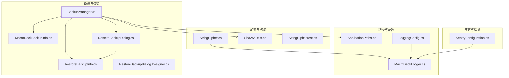
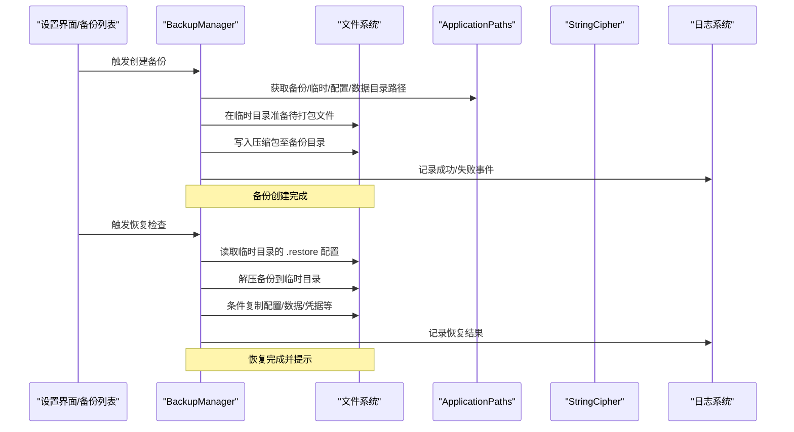
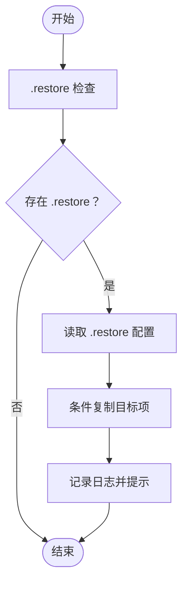
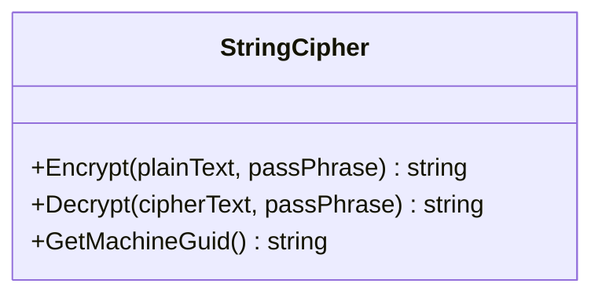
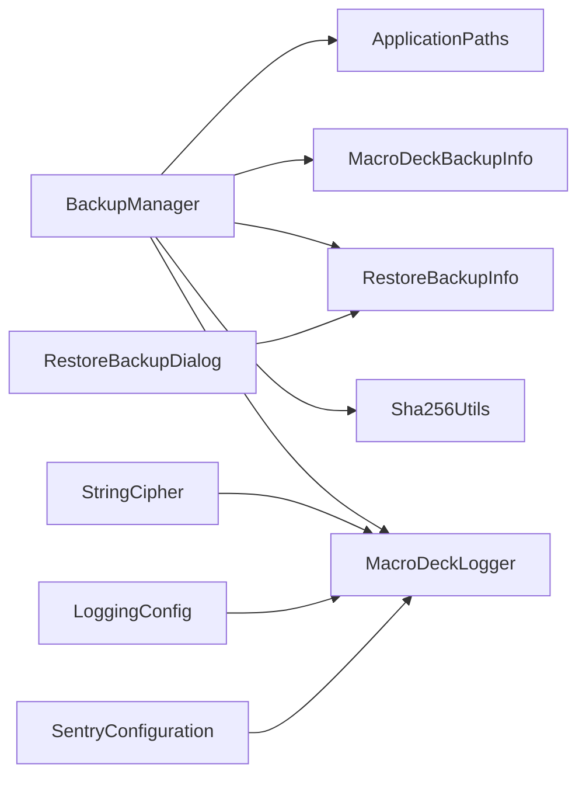

# 数据保护

<cite>
**本文引用的文件**
- [BackupManager.cs](file://src/MacroDeck/Backup/BackupManager.cs)
- [MacroDeckBackupInfo.cs](file://src/MacroDeck/Backup/MacroDeckBackupInfo.cs)
- [RestoreBackupInfo.cs](file://src/MacroDeck/Backup/RestoreBackupInfo.cs)
- [ApplicationPaths.cs](file://src/MacroDeck/StartupConfig/ApplicationPaths.cs)
- [StringCipher.cs](file://src/MacroDeck/Utils/StringCipher.cs)
- [Sha256Utils.cs](file://src/MacroDeck/Utils/Sha256Utils.cs)
- [RestoreBackupDialog.cs](file://src/MacroDeck/GUI/Dialogs/RestoreBackupDialog.cs)
- [RestoreBackupDialog.Designer.cs](file://src/MacroDeck/GUI/Dialogs/RestoreBackupDialog.Designer.cs)
- [MacroDeckLogger.cs](file://src/MacroDeck/Logging/MacroDeckLogger.cs)
- [LoggingConfig.cs](file://src/MacroDeck/StartupConfig/LoggingConfig.cs)
- [SentryConfiguration.cs](file://src/MacroDeck/Logging/SentryConfiguration.cs)
- [StringCipherTest.cs](file://tests/MacroDeck.Tests/StringCipherTest.cs)
</cite>

## 目录
1. [简介](#简介)
2. [项目结构](#项目结构)
3. [核心组件](#核心组件)
4. [架构总览](#架构总览)
5. [详细组件分析](#详细组件分析)
6. [依赖关系分析](#依赖关系分析)
7. [性能考量](#性能考量)
8. [故障排查指南](#故障排查指南)
9. [结论](#结论)
10. [附录](#附录)

## 简介
本文件聚焦于 Macro-Deck 的备份数据保护机制，系统性阐述备份数据在创建、存储、恢复与传输全生命周期中的安全性设计与实现要点。重点覆盖以下方面：
- 备份数据的完整性校验与可追溯性
- 敏感数据（凭据与密码）的加密处理策略
- 访问控制与权限管理现状与改进建议
- 数据传输过程中的安全保护
- 存储安全与物理保护建议
- 数据泄露防护与隐私保护策略
- 审计与追踪机制现状与增强方案
- 备份数据生命周期管理与自动清理策略

## 项目结构
围绕备份与安全相关的关键目录与文件如下图所示：

**图表来源**
- [BackupManager.cs:1-380](file://src/MacroDeck/Backup/BackupManager.cs#L1-L380)
- [ApplicationPaths.cs:1-143](file://src/MacroDeck/StartupConfig/ApplicationPaths.cs#L1-L143)
- [StringCipher.cs:1-100](file://src/MacroDeck/Utils/StringCipher.cs#L1-L100)
- [Sha256Utils.cs:1-39](file://src/MacroDeck/Utils/Sha256Utils.cs#L1-L39)
- [RestoreBackupDialog.cs:33-51](file://src/MacroDeck/GUI/Dialogs/RestoreBackupDialog.cs#L33-L51)
- [RestoreBackupDialog.Designer.cs:96-121](file://src/MacroDeck/GUI/Dialogs/RestoreBackupDialog.Designer.cs#L96-L121)
- [MacroDeckLogger.cs:1-361](file://src/MacroDeck/Logging/MacroDeckLogger.cs#L1-L361)
- [LoggingConfig.cs:1-56](file://src/MacroDeck/StartupConfig/LoggingConfig.cs#L1-L56)
- [SentryConfiguration.cs:110-137](file://src/MacroDeck/Logging/SentryConfiguration.cs#L110-L137)
- [StringCipherTest.cs:1-27](file://tests/MacroDeck.Tests/StringCipherTest.cs#L1-L27)

**章节来源**
- [BackupManager.cs:1-380](file://src/MacroDeck/Backup/BackupManager.cs#L1-L380)
- [ApplicationPaths.cs:1-143](file://src/MacroDeck/StartupConfig/ApplicationPaths.cs#L1-L143)

## 核心组件
- 备份管理器：负责备份创建、恢复检查、删除与事件通知；备份内容涵盖配置、设备、变量、插件、插件配置、插件凭据与图标包等。
- 路径管理器：集中定义用户数据目录、备份目录、临时目录、凭据与配置目录等，确保备份与恢复操作的路径一致性。
- 加密工具：提供基于口令派生的对称加密与解密能力，用于敏感凭据的本地保护。
- 校验工具：提供 SHA-256 哈希计算能力，可用于备份文件完整性校验。
- 恢复对话框：提供选择性恢复项的 UI，支持按需恢复插件凭据等敏感数据。
- 日志与遥测：统一的日志框架与可选的错误上报配置，便于审计与问题定位。

**章节来源**
- [BackupManager.cs:27-380](file://src/MacroDeck/Backup/BackupManager.cs#L27-L380)
- [ApplicationPaths.cs:43-102](file://src/MacroDeck/StartupConfig/ApplicationPaths.cs#L43-L102)
- [StringCipher.cs:16-67](file://src/MacroDeck/Utils/StringCipher.cs#L16-L67)
- [Sha256Utils.cs:8-37](file://src/MacroDeck/Utils/Sha256Utils.cs#L8-L37)
- [RestoreBackupDialog.cs:33-51](file://src/MacroDeck/GUI/Dialogs/RestoreBackupDialog.cs#L33-L51)
- [MacroDeckLogger.cs:64-77](file://src/MacroDeck/Logging/MacroDeckLogger.cs#L64-L77)

## 架构总览
下图展示备份创建与恢复的端到端流程及关键安全交互点：

**图表来源**
- [BackupManager.cs:270-380](file://src/MacroDeck/Backup/BackupManager.cs#L270-L380)
- [ApplicationPaths.cs:43-102](file://src/MacroDeck/StartupConfig/ApplicationPaths.cs#L43-L102)
- [MacroDeckLogger.cs:64-77](file://src/MacroDeck/Logging/MacroDeckLogger.cs#L64-L77)

## 详细组件分析

### 备份管理器（BackupManager）
- 备份创建
  - 将主配置、设备、变量等核心文件复制到临时目录后打包为 zip。
  - 扫描插件目录、插件配置与凭据目录、图标包目录，逐文件加入压缩包。
  - 使用事件通知创建结果，便于 UI 更新。
- 恢复检查与执行
  - 检查临时目录是否存在 .restore 文件以触发恢复流程。
  - 依据恢复配置决定是否复制配置、资料、设备、变量、插件、插件配置、插件凭据与图标包。
  - 恢复完成后弹出提示并记录日志。
- 删除备份
  - 提供删除接口并记录日志。

**图表来源**
- [BackupManager.cs:43-222](file://src/MacroDeck/Backup/BackupManager.cs#L43-L222)

**章节来源**
- [BackupManager.cs:27-380](file://src/MacroDeck/Backup/BackupManager.cs#L27-L380)

### 路径管理器（ApplicationPaths）
- 统一初始化用户数据目录与子目录（含备份、临时、凭据、配置、插件、图标包、日志、资料等）。
- 启动时自动创建缺失目录，保证备份与恢复的可用性。
- 清理临时目录的辅助方法，避免残留文件影响后续流程。

**章节来源**
- [ApplicationPaths.cs:43-141](file://src/MacroDeck/StartupConfig/ApplicationPaths.cs#L43-L141)

### 加密工具（StringCipher）
- 对称加密算法采用基于口令派生的密钥生成与 CBC 模式，每次加密随机盐与 IV，确保相同明文多次加密结果不同。
- 提供机器级唯一标识（MachineGuid）作为口令派生的一部分，提升跨主机迁移场景下的安全性。
- 单元测试验证加解密正确性与输出差异性。

**图表来源**
- [StringCipher.cs:16-98](file://src/MacroDeck/Utils/StringCipher.cs#L16-L98)
- [StringCipherTest.cs:16-26](file://tests/MacroDeck.Tests/StringCipherTest.cs#L16-L26)

**章节来源**
- [StringCipher.cs:16-98](file://src/MacroDeck/Utils/StringCipher.cs#L16-L98)
- [StringCipherTest.cs:1-27](file://tests/MacroDeck.Tests/StringCipherTest.cs#L1-L27)

### 完整性校验与数字签名
- 已实现
  - SHA-256 哈希计算工具，可用于对备份文件进行完整性校验。
- 建议增强
  - 引入数字签名（如 RSA-SHA256）对备份文件进行签名，并在恢复前验证签名有效性，防止篡改与伪造。
  - 在备份元数据中嵌入哈希值与签名信息，形成“哈希+签名”的双重保障。

**章节来源**
- [Sha256Utils.cs:8-37](file://src/MacroDeck/Utils/Sha256Utils.cs#L8-L37)

### 恢复选择与敏感数据保护
- 恢复对话框提供多项选择，包括“插件凭据”等敏感项，允许用户按需恢复。
- 当前未见对敏感数据的额外加密保护（例如仅在特定口令下解密），建议在恢复阶段对插件凭据等敏感文件进行二次加密保护或口令确认。

**章节来源**
- [RestoreBackupDialog.cs:33-51](file://src/MacroDeck/GUI/Dialogs/RestoreBackupDialog.cs#L33-L51)
- [RestoreBackupDialog.Designer.cs:96-121](file://src/MacroDeck/GUI/Dialogs/RestoreBackupDialog.Designer.cs#L96-L121)

### 访问控制与权限管理
- 现状
  - 备份与恢复依赖应用内 UI 与后台逻辑，未发现显式的外部访问控制（如 API 密钥、OAuth）。
  - 凭据与配置位于用户目录的专用子目录，具备基础隔离。
- 建议
  - 在备份/恢复 API 层引入最小权限原则与会话令牌校验。
  - 对敏感目录（凭据、插件凭据）增加文件系统权限限制（仅当前用户可读写）。

**章节来源**
- [ApplicationPaths.cs:52-58](file://src/MacroDeck/StartupConfig/ApplicationPaths.cs#L52-L58)

### 数据传输安全
- 现状
  - 备份/恢复主要在本地文件系统进行，未涉及网络传输。
- 建议
  - 若未来扩展远程备份/恢复，应使用 TLS 通道与服务端证书校验。
  - 对传输中的敏感字段（如口令、令牌）进行加密或脱敏处理。

[本节为概念性建议，不直接分析具体文件]

### 存储安全与物理保护
- 建议
  - 将备份文件存放于受操作系统保护的用户目录或专用磁盘分区。
  - 对备份文件设置只读属性或归档属性，降低误删风险。
  - 结合系统 BitLocker 或第三方加密存储，进一步强化物理介质保护。

[本节为通用建议，不直接分析具体文件]

### 泄露防护与隐私保护
- 日志脱敏
  - 日志系统提供对用户路径与账户名的脱敏处理，减少敏感信息泄露风险。
- 建议
  - 在备份元数据中避免记录完整路径与敏感字段。
  - 对导出/导入流程增加用户确认与最小化数据暴露。

**章节来源**
- [SentryConfiguration.cs:118-136](file://src/MacroDeck/Logging/SentryConfiguration.cs#L118-L136)

### 审计与追踪
- 日志体系
  - 统一使用 Serilog，支持级别切换、滚动文件与可选的遥测上报。
  - 关键事件（备份创建/失败、恢复执行/失败、删除）均记录日志。
- 建议
  - 为每个备份文件生成唯一标识并在日志中关联。
  - 增加审计事件（如“备份已创建/删除/恢复”）的结构化字段，便于检索与合规审计。

**章节来源**
- [MacroDeckLogger.cs:64-77](file://src/MacroDeck/Logging/MacroDeckLogger.cs#L64-L77)
- [LoggingConfig.cs:21-49](file://src/MacroDeck/StartupConfig/LoggingConfig.cs#L21-L49)

### 生命周期管理与自动清理
- 日志清理
  - 提供按时间阈值清理旧日志文件的机制，避免日志占用空间无限增长。
- 建议
  - 为备份文件引入保留策略（如最多保留 N 个最近版本）与定期清理任务。
  - 对临时目录的清理增加幂等与异常容错，避免残留影响后续流程。

**章节来源**
- [MacroDeckLogger.cs:318-331](file://src/MacroDeck/Logging/MacroDeckLogger.cs#L318-L331)
- [ApplicationPaths.cs:104-141](file://src/MacroDeck/StartupConfig/ApplicationPaths.cs#L104-L141)

## 依赖关系分析

**图表来源**
- [BackupManager.cs:1-380](file://src/MacroDeck/Backup/BackupManager.cs#L1-L380)
- [ApplicationPaths.cs:1-143](file://src/MacroDeck/StartupConfig/ApplicationPaths.cs#L1-L143)
- [StringCipher.cs:1-100](file://src/MacroDeck/Utils/StringCipher.cs#L1-L100)
- [Sha256Utils.cs:1-39](file://src/MacroDeck/Utils/Sha256Utils.cs#L1-L39)
- [RestoreBackupDialog.cs:33-51](file://src/MacroDeck/GUI/Dialogs/RestoreBackupDialog.cs#L33-L51)
- [MacroDeckLogger.cs:1-361](file://src/MacroDeck/Logging/MacroDeckLogger.cs#L1-L361)
- [LoggingConfig.cs:1-56](file://src/MacroDeck/StartupConfig/LoggingConfig.cs#L1-L56)
- [SentryConfiguration.cs:110-137](file://src/MacroDeck/Logging/SentryConfiguration.cs#L110-L137)

**章节来源**
- [BackupManager.cs:1-380](file://src/MacroDeck/Backup/BackupManager.cs#L1-L380)
- [ApplicationPaths.cs:1-143](file://src/MacroDeck/StartupConfig/ApplicationPaths.cs#L1-L143)

## 性能考量
- 备份压缩
  - 使用 ZIP 压缩可显著降低存储占用，但会带来 CPU 开销；建议在资源紧张环境下调整压缩级别或启用增量备份策略。
- I/O 优化
  - 批量复制与解压时注意磁盘吞吐，避免与系统其他高 I/O 操作并发冲突。
- 日志滚动
  - 合理设置日志文件大小上限与滚动周期，平衡可观测性与磁盘占用。

[本节提供一般性指导，不直接分析具体文件]

## 故障排查指南
- 备份失败
  - 查看日志中“备份创建失败”相关条目，定位异常原因（如权限不足、磁盘空间不足、文件被占用）。
- 恢复失败
  - 检查临时目录是否存在 .restore 文件以及目标目录权限；查看日志中“备份（某模块）恢复失败”条目。
- 完整性问题
  - 使用 SHA-256 工具重新计算哈希并与记录对比，确认文件是否被篡改或损坏。
- 加密相关
  - 若使用了口令派生加密，请确认口令一致且 MachineGuid 未变更导致解密失败。

**章节来源**
- [BackupManager.cs:296-300](file://src/MacroDeck/Backup/BackupManager.cs#L296-L300)
- [MacroDeckLogger.cs:64-77](file://src/MacroDeck/Logging/MacroDeckLogger.cs#L64-L77)
- [Sha256Utils.cs:8-37](file://src/MacroDeck/Utils/Sha256Utils.cs#L8-L37)

## 结论
Macro-Deck 的备份系统在路径管理、事件驱动与日志记录方面具备良好基础，能够满足本地备份与恢复需求。针对敏感数据保护、完整性与抗篡改能力、访问控制与传输安全等方面，建议逐步引入数字签名、细粒度权限控制、TLS 传输与更严格的凭据保护策略，以构建端到端的数据保护闭环。

[本节为总结性内容，不直接分析具体文件]

## 附录
- 备份对象清单（来自备份管理器）
  - 主配置文件
  - 设备配置文件
  - 变量数据库
  - 插件目录
  - 插件配置目录
  - 插件凭据目录
  - 图标包目录
- 恢复选项清单（来自恢复对话框）
  - 配置、资料、设备、变量、插件、插件配置、插件凭据、图标包

**章节来源**
- [BackupManager.cs:307-361](file://src/MacroDeck/Backup/BackupManager.cs#L307-L361)
- [RestoreBackupDialog.cs:33-51](file://src/MacroDeck/GUI/Dialogs/RestoreBackupDialog.cs#L33-L51)