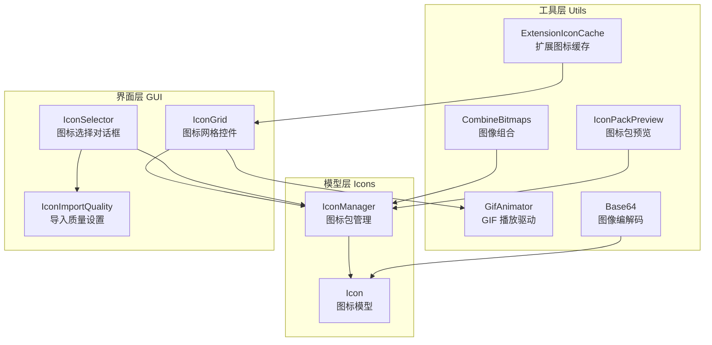
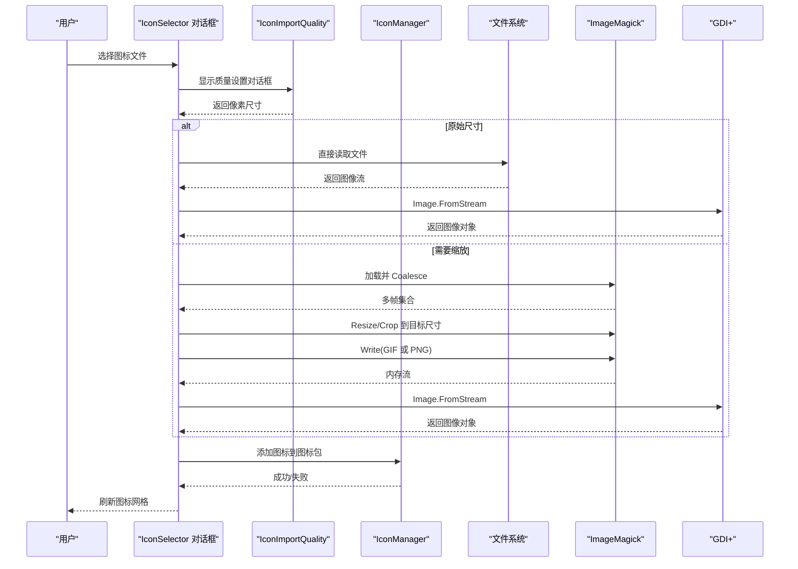
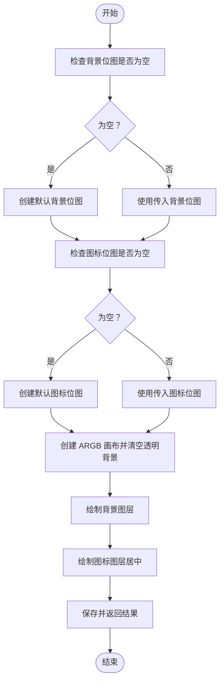
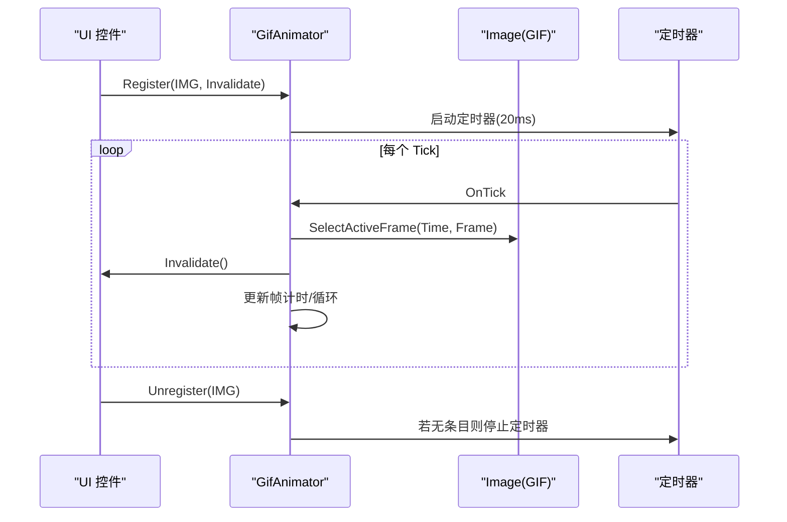
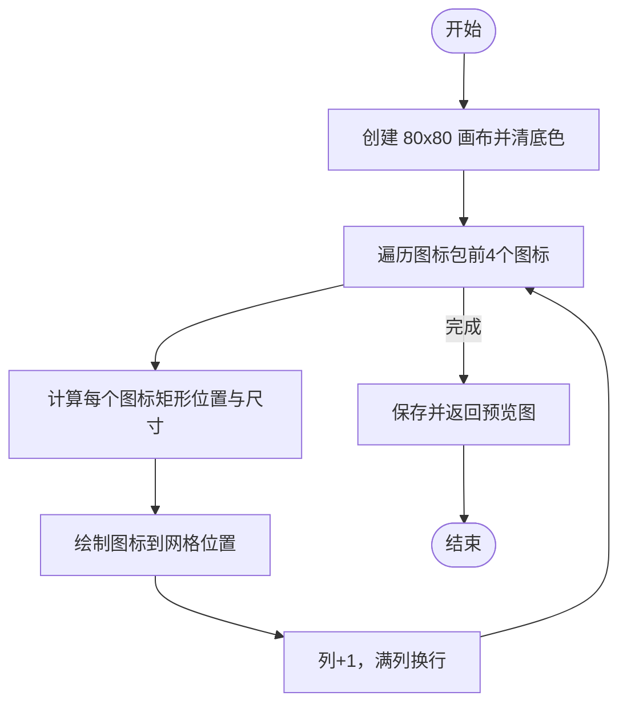
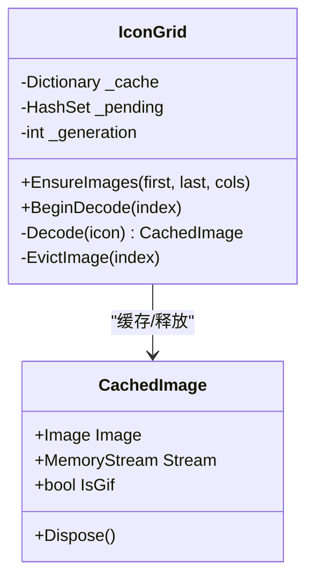
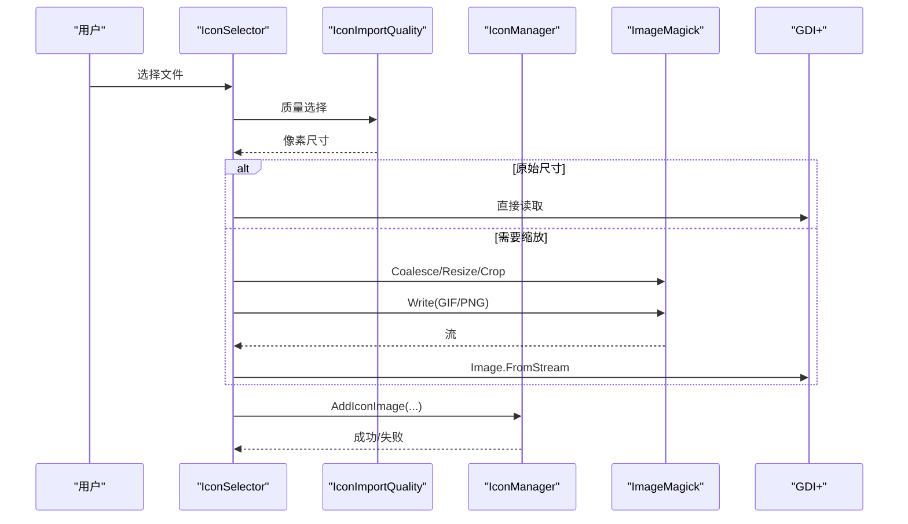
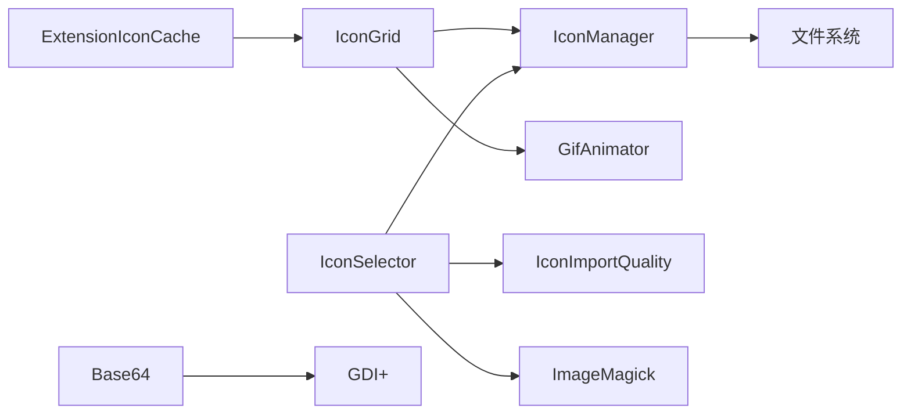

# 图像处理工具

<cite>
**本文引用的文件**
- [CombineBitmaps.cs](file://src/MacroDeck/Utils/CombineBitmaps.cs)
- [GifAnimator.cs](file://src/MacroDeck/Utils/GifAnimator.cs)
- [IconPackPreview.cs](file://src/MacroDeck/Utils/IconPackPreview.cs)
- [IconManager.cs](file://src/MacroDeck/Icons/IconManager.cs)
- [Icon.cs](file://src/MacroDeck/Icons/Icon.cs)
- [IconGrid.cs](file://src/MacroDeck/GUI/CustomControls/IconGrid.cs)
- [IconSelector.cs](file://src/MacroDeck/GUI/Dialogs/IconSelector.cs)
- [IconImportQuality.cs](file://src/MacroDeck/GUI/Dialogs/IconImportQuality.cs)
- [Base64.cs](file://src/MacroDeck/Utils/Base64.cs)
- [ExtensionIconCache.cs](file://src/MacroDeck/Utils/ExtensionIconCache.cs)
</cite>

## 目录
1. [简介](#简介)
2. [项目结构](#项目结构)
3. [核心组件](#核心组件)
4. [架构总览](#架构总览)
5. [组件详解](#组件详解)
6. [依赖关系分析](#依赖关系分析)
7. [性能与内存优化](#性能与内存优化)
8. [故障排查指南](#故障排查指南)
9. [结论](#结论)
10. [附录：使用示例与配置项](#附录使用示例与配置项)

## 简介
本文件系统性梳理 Macro-Deck 中的图像处理工具链，覆盖以下关键能力：
- 图像组合：背景与图标的合成、批量位图叠加
- 图标预览：图标包网格预览生成（含抗锯齿与裁切）
- GIF 动画：基于帧延迟的播放驱动、逐帧切换与 UI 定时器协同
- 图像导入与格式转换：多格式解码（借助 ImageMagick）、缩放与重编码（PNG/GIF）
- 压缩与内存管理：按需解码、缓存与释放策略、静态图缩放与 GIF 帧保持
- 错误处理与异常：空值保护、格式不可读回退、GIF 播放异常清理
- 扩展开发：如何接入新图像处理算法、如何在现有管线中插入自定义处理步骤

## 项目结构
与图像处理相关的核心代码分布在以下模块：
- Utils：通用图像工具（组合、GIF 动画、预览、Base64 编解码、扩展图标缓存）
- Icons：图标模型与图标包管理（加载、保存、导出、删除）
- GUI/Dialogs：图标选择与导入对话框（质量选择、格式转换、GIF 处理）
- GUI/CustomControls：图标网格控件（按需解码、GIF 注册、内存回收）

图表来源
- [CombineBitmaps.cs:1-75](file://src/MacroDeck/Utils/CombineBitmaps.cs#L1-L75)
- [GifAnimator.cs:1-191](file://src/MacroDeck/Utils/GifAnimator.cs#L1-L191)
- [IconPackPreview.cs:1-58](file://src/MacroDeck/Utils/IconPackPreview.cs#L1-L58)
- [IconManager.cs:1-404](file://src/MacroDeck/Icons/IconManager.cs#L1-L404)
- [Icon.cs:1-74](file://src/MacroDeck/Icons/Icon.cs#L1-L74)
- [IconGrid.cs:179-308](file://src/MacroDeck/GUI/CustomControls/IconGrid.cs#L179-L308)
- [IconSelector.cs:139-234](file://src/MacroDeck/GUI/Dialogs/IconSelector.cs#L139-L234)
- [IconImportQuality.cs:1-54](file://src/MacroDeck/GUI/Dialogs/IconImportQuality.cs#L1-L54)
- [Base64.cs:1-168](file://src/MacroDeck/Utils/Base64.cs#L1-L168)
- [ExtensionIconCache.cs:1-55](file://src/MacroDeck/Utils/ExtensionIconCache.cs#L1-L55)

章节来源
- [CombineBitmaps.cs:1-75](file://src/MacroDeck/Utils/CombineBitmaps.cs#L1-L75)
- [GifAnimator.cs:1-191](file://src/MacroDeck/Utils/GifAnimator.cs#L1-L191)
- [IconPackPreview.cs:1-58](file://src/MacroDeck/Utils/IconPackPreview.cs#L1-L58)
- [IconManager.cs:1-404](file://src/MacroDeck/Icons/IconManager.cs#L1-L404)
- [Icon.cs:1-74](file://src/MacroDeck/Icons/Icon.cs#L1-L74)
- [IconGrid.cs:179-308](file://src/MacroDeck/GUI/CustomControls/IconGrid.cs#L179-L308)
- [IconSelector.cs:139-234](file://src/MacroDeck/GUI/Dialogs/IconSelector.cs#L139-L234)
- [IconImportQuality.cs:1-54](file://src/MacroDeck/GUI/Dialogs/IconImportQuality.cs#L1-L54)
- [Base64.cs:1-168](file://src/MacroDeck/Utils/Base64.cs#L1-L168)
- [ExtensionIconCache.cs:1-55](file://src/MacroDeck/Utils/ExtensionIconCache.cs#L1-L55)

## 核心组件
- 图像组合（CombineBitmaps）：支持将多个位图叠加到固定尺寸画布上；支持背景与前景图层合成，使用高质量插值与透明背景
- GIF 动画（GifAnimator）：单定时器驱动多张 GIF 的逐帧播放，尊重每帧延迟并进行“近零延迟”修正，提供注册/注销接口
- 图标预览（IconPackPreview）：生成图标包网格预览图（4 张小图标拼版），设置抗锯齿与填充背景色
- 图标管理（IconManager）：加载/保存/导出图标包、添加/删除图标、生成预览、安装 ZIP 包
- 图标模型（Icon）：按需从磁盘加载原图或缩略图、计算 Base64 字符串、提供十六进制区域 Base64
- 图标网格（IconGrid）：按需解码图标、静态图缩放、GIF 注册播放、可视范围外释放缓存
- 导入流程（IconSelector + IconImportQuality）：质量选择、ImageMagick 解码、缩放/裁剪、GIF/PNG 重编码
- 编解码工具（Base64）：图像转 Base64、Base64 转图像、按区域二值化 Base64
- 扩展图标缓存（ExtensionIconCache）：进程内 LRU 缓存扩展商店图标字节，避免重复下载

章节来源
- [CombineBitmaps.cs:8-73](file://src/MacroDeck/Utils/CombineBitmaps.cs#L8-L73)
- [GifAnimator.cs:36-189](file://src/MacroDeck/Utils/GifAnimator.cs#L36-L189)
- [IconPackPreview.cs:8-56](file://src/MacroDeck/Utils/IconPackPreview.cs#L8-L56)
- [IconManager.cs:151-197](file://src/MacroDeck/Icons/IconManager.cs#L151-L197)
- [Icon.cs:23-72](file://src/MacroDeck/Icons/Icon.cs#L23-L72)
- [IconGrid.cs:270-294](file://src/MacroDeck/GUI/CustomControls/IconGrid.cs#L270-L294)
- [IconSelector.cs:185-234](file://src/MacroDeck/GUI/Dialogs/IconSelector.cs#L185-L234)
- [IconImportQuality.cs:8-53](file://src/MacroDeck/GUI/Dialogs/IconImportQuality.cs#L8-L53)
- [Base64.cs:9-167](file://src/MacroDeck/Utils/Base64.cs#L9-L167)
- [ExtensionIconCache.cs:17-54](file://src/MacroDeck/Utils/ExtensionIconCache.cs#L17-L54)

## 架构总览
下图展示从用户导入到最终显示的完整流程，包括格式检测、质量选择、解码/缩放、GIF 处理与缓存。

图表来源
- [IconSelector.cs:185-234](file://src/MacroDeck/GUI/Dialogs/IconSelector.cs#L185-L234)
- [IconImportQuality.cs:29-53](file://src/MacroDeck/GUI/Dialogs/IconImportQuality.cs#L29-L53)
- [IconManager.cs:151-197](file://src/MacroDeck/Icons/IconManager.cs#L151-L197)

## 组件详解

### 图像组合（CombineBitmaps）
- 功能要点
  - 批量叠加：将多个位图绘制到固定画布，用于快速拼合
  - 背景与图标合成：创建 ARGB 画布，先清透明背景，再绘制背景与前景图层，居中对齐
  - 插值与抗锯齿：使用高质量插值模式保证边缘平滑
- 性能与内存
  - 固定画布尺寸，避免频繁分配
  - 使用 using 确保资源及时释放
- 典型用途
  - 快速生成占位图或预览图
  - 将背景与前景元素合成统一尺寸输出

图表来源
- [CombineBitmaps.cs:23-73](file://src/MacroDeck/Utils/CombineBitmaps.cs#L23-L73)

章节来源
- [CombineBitmaps.cs:8-73](file://src/MacroDeck/Utils/CombineBitmaps.cs#L8-L73)

### GIF 动画（GifAnimator）
- 功能要点
  - 单定时器驱动：共享 UI 定时器，按固定步长推进各 GIF 的帧指针
  - 帧延迟解析：从 EXIF 属性中读取每帧延迟，近零延迟修正为 100ms
  - 注册/注销：按图像对象注册回调，自动启停定时器
  - 异常容错：图像被释放时自动清理条目，避免悬挂引用
- 性能与内存
  - 仅在需要时启动定时器，避免空转
  - 通过索引访问避免锁竞争
- 典型用途
  - 在图标网格中播放 GIF 动画
  - 在预览图中展示动态效果

图表来源
- [GifAnimator.cs:58-151](file://src/MacroDeck/Utils/GifAnimator.cs#L58-L151)

章节来源
- [GifAnimator.cs:36-189](file://src/MacroDeck/Utils/GifAnimator.cs#L36-L189)

### 图标预览（IconPackPreview）
- 功能要点
  - 生成 80x80 预览图，最多放置 4 张图标，2 行 2 列
  - 设置抗锯齿插值，填充深色背景
  - 仅尝试绘制前 4 张图标，异常吞吐不中断
- 性能与内存
  - 固定画布尺寸，避免大图开销
  - 使用 using 确保画布与资源释放
- 典型用途
  - 图标包列表展示、扩展商店预览

图表来源
- [IconPackPreview.cs:8-56](file://src/MacroDeck/Utils/IconPackPreview.cs#L8-L56)

章节来源
- [IconPackPreview.cs:8-56](file://src/MacroDeck/Utils/IconPackPreview.cs#L8-L56)

### 图标网格（IconGrid）与按需解码
- 功能要点
  - 可见范围外释放缓存，避免内存膨胀
  - 静态图缩放到单元格大小，GIF 保持原始帧以供播放
  - 解码线程池异步执行，UI 线程更新缓存与触发重绘
  - 发现 GIF 自动注册到播放器
- 性能与内存
  - LRU 风格的可见窗口缓存，超出范围主动释放
  - 避免一次性加载所有图标，降低峰值内存
- 典型用途
  - 大型图标包浏览、滚动加载

图表来源
- [IconGrid.cs:194-308](file://src/MacroDeck/GUI/CustomControls/IconGrid.cs#L194-L308)

章节来源
- [IconGrid.cs:194-308](file://src/MacroDeck/GUI/CustomControls/IconGrid.cs#L194-L308)

### 图标管理（IconManager）与导入流程
- 功能要点
  - 支持从 ZIP 安装图标包，校验清单类型
  - 导入时根据质量设置决定是否缩放与重编码
  - GIF 导入可选择转换为静态 PNG 以降低内存占用
  - 提供导出、删除、生成预览等操作
- 性能与内存
  - 导出时按需生成预览并写入扩展图标文件
  - 静态图缩放后立即释放源图，避免长期持有
- 典型用途
  - 批量导入、安装扩展图标包、导出分享

图表来源
- [IconSelector.cs:185-234](file://src/MacroDeck/GUI/Dialogs/IconSelector.cs#L185-L234)
- [IconImportQuality.cs:29-53](file://src/MacroDeck/GUI/Dialogs/IconImportQuality.cs#L29-L53)
- [IconManager.cs:151-197](file://src/MacroDeck/Icons/IconManager.cs#L151-L197)

章节来源
- [IconSelector.cs:139-234](file://src/MacroDeck/GUI/Dialogs/IconSelector.cs#L139-L234)
- [IconImportQuality.cs:8-53](file://src/MacroDeck/GUI/Dialogs/IconImportQuality.cs#L8-L53)
- [IconManager.cs:151-197](file://src/MacroDeck/Icons/IconManager.cs#L151-L197)

### 编解码与格式转换（Base64 + GDI+）
- 功能要点
  - 图像转 Base64：非 GIF 图像会复制为 PNG 以避免 GDI+ 错误
  - Base64 转图像：安全解码，去除空白字符并补齐长度
  - 区域二值化 Base64：按指定区域提取像素并转为 1/0 位块，再 Base64 输出
- 性能与内存
  - 使用内存流避免多次 IO
  - 异常捕获兜底，避免崩溃
- 典型用途
  - 图标数据传输、嵌入式显示、二值化处理

章节来源
- [Base64.cs:9-167](file://src/MacroDeck/Utils/Base64.cs#L9-L167)

### 扩展图标缓存（ExtensionIconCache）
- 功能要点
  - 进程内 LRU 缓存扩展商店图标字节，避免重复下载
  - 最大容量限制，超过阈值淘汰最久未使用项
- 性能与内存
  - 以字节为单位缓存，解码权在消费者，避免长期持有 Image
- 典型用途
  - 商店页面快速重用图标，减少网络与解码开销

章节来源
- [ExtensionIconCache.cs:17-54](file://src/MacroDeck/Utils/ExtensionIconCache.cs#L17-L54)

## 依赖关系分析
- 组件耦合
  - IconGrid 依赖 IconManager 获取图标元数据，依赖 GifAnimator 播放 GIF
  - IconSelector 依赖 IconImportQuality 与 IconManager，内部使用 ImageMagick 进行格式解码与缩放
  - IconManager 依赖文件系统与 JSON 序列化，间接影响图标包生命周期
- 外部依赖
  - ImageMagick：多格式解码、GIF Coalesce、缩放与重编码
  - GDI+：基础图像读写与显示
- 循环依赖
  - 未发现直接循环依赖；工具层与界面层通过清晰接口交互

图表来源
- [IconGrid.cs:250-253](file://src/MacroDeck/GUI/CustomControls/IconGrid.cs#L250-L253)
- [IconSelector.cs:185-234](file://src/MacroDeck/GUI/Dialogs/IconSelector.cs#L185-L234)
- [IconManager.cs:151-197](file://src/MacroDeck/Icons/IconManager.cs#L151-L197)
- [Base64.cs:129-152](file://src/MacroDeck/Utils/Base64.cs#L129-L152)
- [ExtensionIconCache.cs:32-52](file://src/MacroDeck/Utils/ExtensionIconCache.cs#L32-L52)

章节来源
- [IconGrid.cs:250-253](file://src/MacroDeck/GUI/CustomControls/IconGrid.cs#L250-L253)
- [IconSelector.cs:185-234](file://src/MacroDeck/GUI/Dialogs/IconSelector.cs#L185-L234)
- [IconManager.cs:151-197](file://src/MacroDeck/Icons/IconManager.cs#L151-L197)
- [Base64.cs:129-152](file://src/MacroDeck/Utils/Base64.cs#L129-L152)
- [ExtensionIconCache.cs:32-52](file://src/MacroDeck/Utils/ExtensionIconCache.cs#L32-L52)

## 性能与内存优化
- 按需解码与缩放
  - 静态图标在网格中仅保留缩略图，大幅降低内存占用
  - GIF 保持原始帧与流，确保播放但避免重复解码
- 可视范围缓存
  - 可见区域外主动释放缓存，防止内存持续增长
- 定时器节流
  - GIF 播放使用固定步长（20ms），避免高频刷新
- 格式与质量控制
  - 导入时提供质量预设，推荐对 GIF 使用低/最低质量以降低内存与加载时间
- 资源释放
  - 所有使用 using 的图形对象与流均在作用域结束时释放
  - 注销 GIF 时同步停止播放并释放底层流

章节来源
- [IconGrid.cs:194-214](file://src/MacroDeck/GUI/CustomControls/IconGrid.cs#L194-L214)
- [IconGrid.cs:270-294](file://src/MacroDeck/GUI/CustomControls/IconGrid.cs#L270-L294)
- [IconSelector.cs:185-234](file://src/MacroDeck/GUI/Dialogs/IconSelector.cs#L185-L234)
- [IconImportQuality.cs:142-143](file://src/MacroDeck/GUI/Dialogs/IconImportQuality.cs#L142-L143)

## 故障排查指南
- 导入图片报错或无法识别
  - 现象：GDI+ 不支持的格式导致读取失败
  - 处理：回退至 ImageMagick 解码；确认文件路径与权限
  - 参考
    - [IconSelector.cs:189-199](file://src/MacroDeck/GUI/Dialogs/IconSelector.cs#L189-L199)
- GIF 播放异常或卡顿
  - 现象：帧延迟过短或无效
  - 处理：GifAnimator 已将近零延迟修正为 100ms；若仍异常，检查图像属性与帧数
  - 参考
    - [GifAnimator.cs:178-186](file://src/MacroDeck/Utils/GifAnimator.cs#L178-L186)
- 内存占用过高
  - 现象：大量大尺寸静态图或高分辨率 GIF
  - 处理：使用质量预设降低尺寸；确认网格缓存已释放不可见项
  - 参考
    - [IconGrid.cs:206-214](file://src/MacroDeck/GUI/CustomControls/IconGrid.cs#L206-L214)
    - [IconImportQuality.cs:142-143](file://src/MacroDeck/GUI/Dialogs/IconImportQuality.cs#L142-L143)
- 图标 Base64 转换失败
  - 现象：字符串格式不合法或为空
  - 处理：自动补齐长度并捕获异常，返回空值
  - 参考
    - [Base64.cs:107-127](file://src/MacroDeck/Utils/Base64.cs#L107-L127)
- 图标包安装失败
  - 现象：ZIP 缺少清单或类型不符
  - 处理：检查清单字段与包类型；查看日志定位具体错误
  - 参考
    - [IconManager.cs:331-342](file://src/MacroDeck/Icons/IconManager.cs#L331-L342)

## 结论
Macro-Deck 的图像处理工具链围绕“按需解码、轻量缓存、统一播放”的设计原则构建，既满足了丰富的图像格式支持与高质量显示，又通过严格的资源释放与内存边界控制保障了运行稳定性。GIF 播放、图标预览与组合工具形成闭环，配合导入流程的质量控制，为用户提供了高效且可控的图标管理体验。

## 附录：使用示例与配置项
- 图像组合
  - 场景：将背景与图标合成到固定画布
  - 关键点：透明背景清空、高质量插值、居中绘制
  - 参考
    - [CombineBitmaps.cs:23-73](file://src/MacroDeck/Utils/CombineBitmaps.cs#L23-L73)
- 图标预览
  - 场景：生成图标包网格预览图
  - 关键点：抗锯齿插值、深色背景、最多 4 张
  - 参考
    - [IconPackPreview.cs:8-56](file://src/MacroDeck/Utils/IconPackPreview.cs#L8-L56)
- GIF 动画
  - 场景：在 UI 中播放 GIF
  - 关键点：注册/注销、帧延迟修正、定时器节流
  - 参考
    - [GifAnimator.cs:58-151](file://src/MacroDeck/Utils/GifAnimator.cs#L58-L151)
- 导入与格式转换
  - 场景：多格式导入、缩放、GIF 转静态
  - 关键点：质量预设、ImageMagick 解码、GIF/PNG 重编码
  - 参考
    - [IconSelector.cs:185-234](file://src/MacroDeck/GUI/Dialogs/IconSelector.cs#L185-L234)
    - [IconImportQuality.cs:29-53](file://src/MacroDeck/GUI/Dialogs/IconImportQuality.cs#L29-L53)
- 编解码与二值化
  - 场景：图像转 Base64、区域二值化
  - 关键点：非 GIF 转 PNG 避免 GDI+ 错误、异常兜底
  - 参考
    - [Base64.cs:129-167](file://src/MacroDeck/Utils/Base64.cs#L129-L167)
- 扩展图标缓存
  - 场景：商店图标复用
  - 关键点：LRU 限制、字节级缓存
  - 参考
    - [ExtensionIconCache.cs:32-54](file://src/MacroDeck/Utils/ExtensionIconCache.cs#L32-L54)