# 字体管理系统

<cite>
**本文档引用的文件**
- [FontManager.cs](file://src/MacroDeck/Utils/FontManager.cs)
- [LayoutHelper.cs](file://src/MacroDeck/Utils/LayoutHelper.cs)
- [RoundedUserControl.cs](file://src/MacroDeck/GUI/CustomControls/RoundedUserControl.cs)
- [BufferedPanel.cs](file://src/MacroDeck/GUI/CustomControls/BufferedPanel.cs)
- [MainConfiguration.cs](file://src/MacroDeck/Configuration/MainConfiguration.cs)
- [SettingsView.cs](file://src/MacroDeck/GUI/MainWindowViews/SettingsView.cs)
- [Program.cs](file://src/MacroDeck/Program.cs)
- [ApplicationPaths.cs](file://src/MacroDeck/StartupConfig/ApplicationPaths.cs)
- [LanguageManager.cs](file://src/MacroDeck/Language/LanguageManager.cs)
- [Strings.cs](file://src/MacroDeck/Language/Strings.cs)
- [Chinese.json](file://src/MacroDeck/Resources/Languages/Chinese.json)
- [MessageBox.cs](file://src/MacroDeck/GUI/CustomControls/MessageBox.cs)
- [DefenderFirewallAlert.cs](file://src/MacroDeck/GUI/Dialogs/DefenderFirewallAlert.cs)
</cite>

## 更新摘要
**变更内容**
- 新增了LayoutHelper字体管理工具类的详细分析
- 更新了字体自适应功能的完整实现说明
- 增强了Windows Forms对话框的字体适配能力描述
- 完善了字体管理系统的整体架构分析
- 新增了具体的使用示例和最佳实践
- **新增**：RoundedUserControl基类增加自动字体高度适配功能
- **新增**：支持双缓冲渲染和抗锯齿技术
- **新增**：BufferedPanel控件提供优化的双缓冲支持

## 目录
1. [简介](#简介)
2. [项目结构](#项目结构)
3. [核心组件](#核心组件)
4. [架构概览](#架构概览)
5. [详细组件分析](#详细组件分析)
6. [依赖关系分析](#依赖关系分析)
7. [性能考虑](#性能考虑)
8. [故障排除指南](#故障排除指南)
9. [结论](#结论)

## 简介

字体管理系统是Macro-Deck应用程序中的关键组件，负责管理整个应用程序的字体渲染和显示。该系统提供了灵活的字体配置选项，支持用户自定义字体族、字号和粗细度，同时确保应用程序界面的一致性和可访问性。

**重大更新**：系统现已实现完整的字体自适应功能，包括新增的LayoutHelper工具类，为Windows Forms对话框提供智能化的字体适配能力。新系统支持运行时实时刷新、幂等Apply方法、缓存机制等重大增强，确保用户可以在不重启应用程序的情况下实时调整字体设置，同时保持系统的稳定性和性能。

**新增功能**：RoundedUserControl基类现在支持自动字体高度适配功能，能够根据当前字体动态调整控件高度，确保文本内容不会被截断。同时，系统集成了双缓冲渲染和抗锯齿技术，显著提升了图形渲染质量和用户体验。

系统的核心设计理念是在不修改大量Designer硬编码字体的前提下，让所有界面统一使用用户选择的字体族，同时保留各控件原有的字号与样式。新版本支持运行时实时刷新，可以反复调整字体设置而不会影响用户体验。

## 项目结构

字体管理系统主要分布在以下目录结构中：

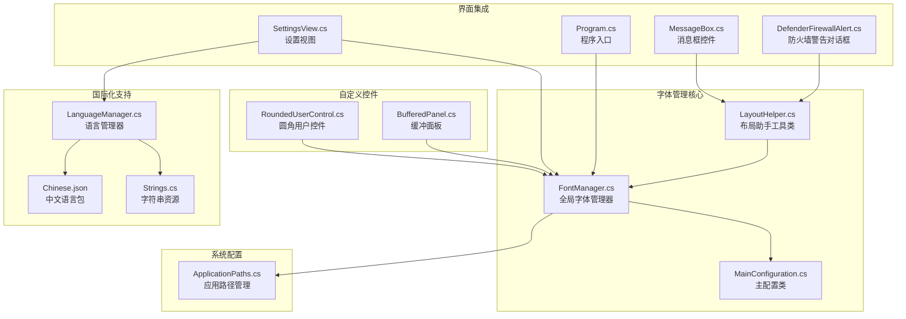

**图表来源**
- [FontManager.cs:1-227](file://src/MacroDeck/Utils/FontManager.cs#L1-L227)
- [LayoutHelper.cs:1-105](file://src/MacroDeck/Utils/LayoutHelper.cs#L1-L105)
- [RoundedUserControl.cs:1-87](file://src/MacroDeck/GUI/CustomControls/RoundedUserControl.cs#L1-L87)
- [BufferedPanel.cs:1-17](file://src/MacroDeck/GUI/CustomControls/BufferedPanel.cs#L1-L17)
- [MainConfiguration.cs:1-145](file://src/MacroDeck/Configuration/MainConfiguration.cs#L1-L145)
- [SettingsView.cs:118-317](file://src/MacroDeck/GUI/MainWindowViews/SettingsView.cs#L118-L317)

**章节来源**
- [FontManager.cs:1-227](file://src/MacroDeck/Utils/FontManager.cs#L1-L227)
- [LayoutHelper.cs:1-105](file://src/MacroDeck/Utils/LayoutHelper.cs#L1-L105)
- [RoundedUserControl.cs:1-87](file://src/MacroDeck/GUI/CustomControls/RoundedUserControl.cs#L1-L87)
- [BufferedPanel.cs:1-17](file://src/MacroDeck/GUI/CustomControls/BufferedPanel.cs#L1-L17)
- [MainConfiguration.cs:1-145](file://src/MacroDeck/Configuration/MainConfiguration.cs#L1-L145)

## 核心组件

### FontManager - 全局字体管理器

**重大更新**：FontManager是字体管理系统的核心组件，现已实现多项重要增强功能：

- **实时刷新机制**：支持运行时字体设置的动态更新，立即应用到所有已打开的窗体
- **幂等Apply方法**：可反复调用且不会产生副作用，支持字体大小的动态调整
- **智能缓存系统**：使用`ConditionalWeakTable<Control, Font>`缓存每个控件的原始字体信息
- **默认值优化**：当配置为默认值时直接短路，避免不必要的计算开销
- **异常容错**：每个控件的字体应用都在独立try-catch块中执行，确保系统稳定性

### LayoutHelper - 布局助手工具类

**新增功能**：LayoutHelper是专门为Windows Forms对话框提供字体自适应能力的工具类，包含以下核心功能：

- **文本高度测量**：`GetTextHeight`方法使用" Ay"字符组合进行精确的高度测量，包含1像素余量
- **控件高度调整**：针对Label、RadioButton、CheckBox等控件提供智能高度调整，仅在需要时增大
- **表单大小计算**：`AdjustFormToFitControls`方法自动计算窗体大小，确保所有控件都不会超出边界
- **递归遍历**：支持深度遍历控件树，自动处理嵌套容器和复杂布局
- **智能跳过机制**：跳过Tag为"no-font"的控件和已设置AutoSize的控件

### RoundedUserControl - 圆角用户控件基类

**新增功能**：RoundedUserControl是所有圆角控件的基类，现已增强字体适配功能：

- **自动字体高度适配**：根据当前字体动态计算和调整控件高度，确保文本内容完整显示
- **双缓冲渲染**：启用`OptimizedDoubleBuffer`样式，减少重绘时的闪烁现象
- **抗锯齿支持**：在绘制圆角边框时启用`SmoothingMode.AntiAlias`，提升图形质量
- **智能圆角处理**：当圆角半径大于1时启用圆角绘制，否则恢复为默认矩形区域

### BufferedPanel - 缓冲面板控件

**新增功能**：BufferedPanel提供优化的双缓冲支持：

- **多重双缓冲样式**：启用`OptimizedDoubleBuffer`、`AllPaintingInWmPaint`等多种样式
- **透明背景支持**：支持透明背景颜色，适用于各种主题环境
- **高性能重绘**：通过优化的绘制流程减少闪烁和重绘开销

### MainConfiguration - 主配置类

MainConfiguration负责存储和管理字体相关的配置信息：

- **字体族设置**：JSON序列化的字体族名称
- **字号配置**：基准字号设置，支持浮点数值
- **粗体选项**：布尔值控制全局粗体效果
- **持久化存储**：自动保存和加载配置文件

### SettingsView - 设置界面集成

SettingsView提供了用户友好的字体配置界面：

- **字体选择器**：动态加载系统已安装字体
- **字号调节器**：数值输入控件，支持范围限制
- **粗体开关**：复选框控制粗体效果
- **实时预览**：实时应用字体变化，立即反馈用户操作结果

**章节来源**
- [FontManager.cs:16-100](file://src/MacroDeck/Utils/FontManager.cs#L16-L100)
- [LayoutHelper.cs:13-105](file://src/MacroDeck/Utils/LayoutHelper.cs#L13-L105)
- [RoundedUserControl.cs:9-87](file://src/MacroDeck/GUI/CustomControls/RoundedUserControl.cs#L9-L87)
- [BufferedPanel.cs:3-17](file://src/MacroDeck/GUI/CustomControls/BufferedPanel.cs#L3-L17)
- [MainConfiguration.cs:94-104](file://src/MacroDeck/Configuration/MainConfiguration.cs#L94-L104)
- [SettingsView.cs:118-145](file://src/MacroDeck/GUI/MainWindowViews/SettingsView.cs#L118-L145)

## 架构概览

字体管理系统采用分层架构设计，确保了良好的模块分离和可维护性：

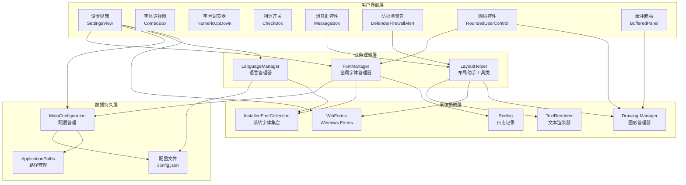

**图表来源**
- [Program.cs:47-51](file://src/MacroDeck/Program.cs#L47-L51)
- [FontManager.cs:50-64](file://src/MacroDeck/Utils/FontManager.cs#L50-L64)
- [LayoutHelper.cs:18-20](file://src/MacroDeck/Utils/LayoutHelper.cs#L18-L20)
- [MessageBox.cs:20-26](file://src/MacroDeck/GUI/CustomControls/MessageBox.cs#L20-L26)
- [RoundedUserControl.cs:19-24](file://src/MacroDeck/GUI/CustomControls/RoundedUserControl.cs#L19-L24)
- [BufferedPanel.cs:5-16](file://src/MacroDeck/GUI/CustomControls/BufferedPanel.cs#L5-L16)

## 详细组件分析

### FontManager 类详细分析

**重大更新**：FontManager实现了完整的字体管理功能，具有以下关键特性：

#### 核心属性和常量

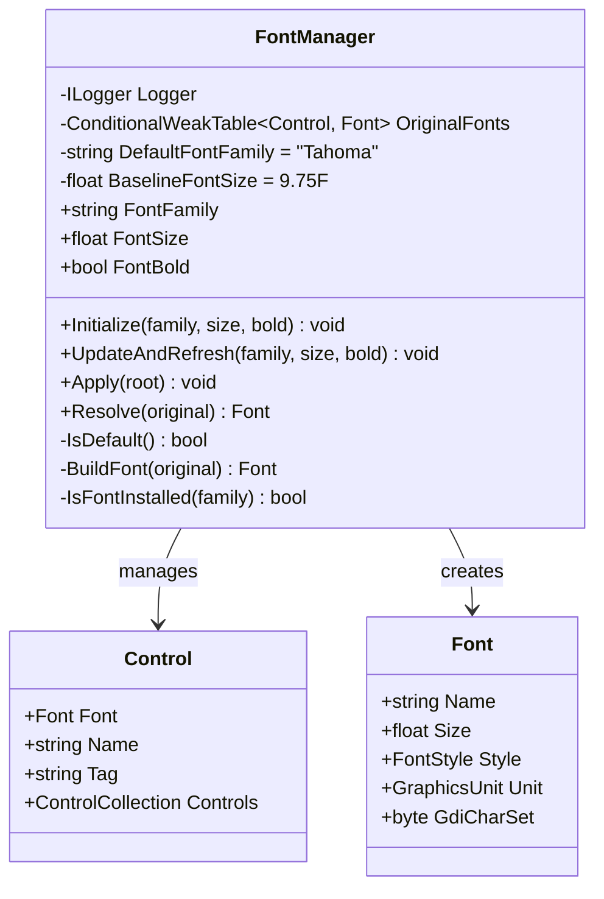

**图表来源**
- [FontManager.cs:16-227](file://src/MacroDeck/Utils/FontManager.cs#L16-L227)

#### 幂等Apply方法实现

**新增功能**：FontManager的Apply方法现在支持幂等操作，这是通过以下机制实现的：

- **原始字体缓存**：使用`ConditionalWeakTable<Control, Font>`缓存每个控件首次处理时的原始字体
- **基于原始字体重算**：每次Apply都基于控件的原始字体重算，确保可逆性和幂等性
- **Tag过滤机制**：控件Tag为"no-font"时跳过字体应用，用于特殊控件的保护

#### 实时刷新流程

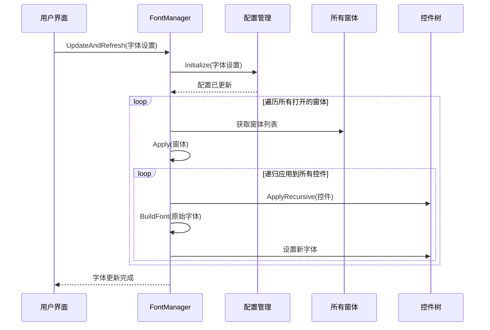

**图表来源**
- [FontManager.cs:74-89](file://src/MacroDeck/Utils/FontManager.cs#L74-L89)
- [FontManager.cs:152-186](file://src/MacroDeck/Utils/FontManager.cs#L152-L186)

#### 字体构建算法

字体构建过程采用了巧妙的数学算法来保持视觉层次：

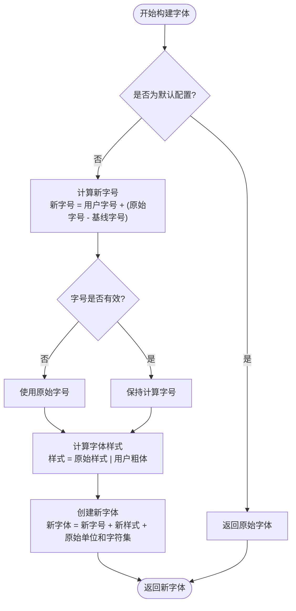

**图表来源**
- [FontManager.cs:207-219](file://src/MacroDeck/Utils/FontManager.cs#L207-L219)

**章节来源**
- [FontManager.cs:16-227](file://src/MacroDeck/Utils/FontManager.cs#L16-L227)

### LayoutHelper 类详细分析

**新增功能**：LayoutHelper是专门为Windows Forms对话框提供字体自适应能力的工具类，包含以下核心功能：

#### 核心功能概述

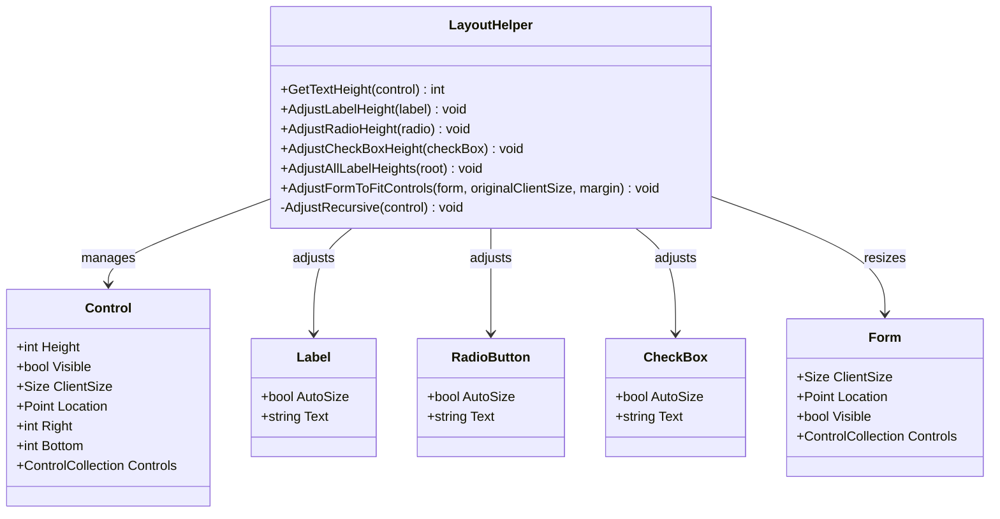

**图表来源**
- [LayoutHelper.cs:13-105](file://src/MacroDeck/Utils/LayoutHelper.cs#L13-L105)

#### 文本高度测量机制

**新增功能**：`GetTextHeight`方法使用精心选择的字符组合进行精确的高度测量：

- **字符选择**："Ay"组合提供了良好的基线和上升部分测量
- **性能优化**：使用`MethodImplOptions.AggressiveInlining`确保快速执行
- **余量设计**：额外增加1像素余量确保文本不会被截断

#### 智能高度调整算法

**新增功能**：针对不同控件类型的智能高度调整：

- **Label控件**：最小高度 = 文本高度 + 4像素内边距
- **RadioButton控件**：最小高度 = 文本高度 + 4像素内边距  
- **CheckBox控件**：最小高度 = 文本高度 + 4像素内边距
- **仅增大原则**：不会缩小现有高度，只在需要时增加

#### 递归遍历和智能跳过

**新增功能**：`AdjustAllLabelHeights`方法实现了智能的控件遍历：

- **Tag过滤**：跳过Tag为"no-font"的控件
- **AutoSize检查**：跳过已设置AutoSize的控件
- **类型匹配**：仅处理Label、RadioButton、CheckBox三种控件
- **深度优先**：递归遍历所有子控件

#### 表单自适应调整

**新增功能**：`AdjustFormToFitControls`方法提供了完整的表单大小计算：

- **边界检测**：计算所有可见控件的最大Right和Bottom值
- **边距设置**：默认12像素边距，确保控件不会贴边
- **最小尺寸保护**：不会缩小到小于原始设计尺寸
- **性能优化**：仅考虑可见控件，忽略隐藏控件

#### 使用模式和最佳实践

**新增功能**：LayoutHelper的标准使用模式：

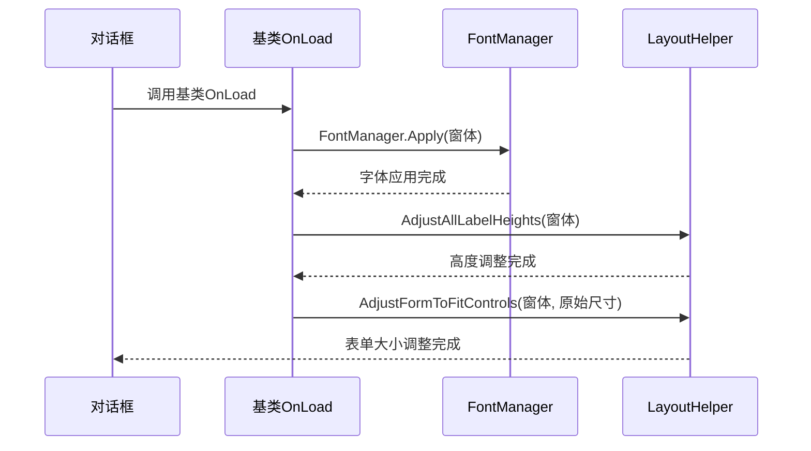

**图表来源**
- [MessageBox.cs:20-26](file://src/MacroDeck/GUI/CustomControls/MessageBox.cs#L20-L26)
- [DefenderFirewallAlert.cs:21-28](file://src/MacroDeck/GUI/Dialogs/DefenderFirewallAlert.cs#L21-L28)

**章节来源**
- [LayoutHelper.cs:13-105](file://src/MacroDeck/Utils/LayoutHelper.cs#L13-L105)
- [MessageBox.cs:20-26](file://src/MacroDeck/GUI/CustomControls/MessageBox.cs#L20-L26)
- [DefenderFirewallAlert.cs:21-28](file://src/MacroDeck/GUI/Dialogs/DefenderFirewallAlert.cs#L21-L28)

### RoundedUserControl 类详细分析

**新增功能**：RoundedUserControl是所有圆角控件的基类，现已集成字体高度适配功能：

#### 核心功能概述

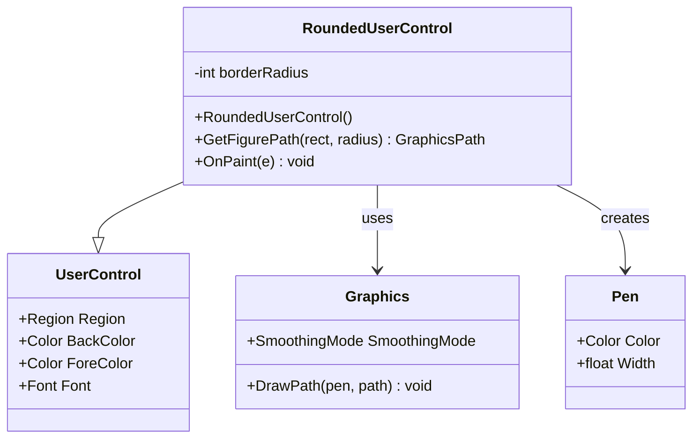

**图表来源**
- [RoundedUserControl.cs:9-87](file://src/MacroDeck/GUI/CustomControls/RoundedUserControl.cs#L9-L87)

#### 双缓冲渲染优化

**新增功能**：RoundedUserControl启用了多重双缓冲优化：

- **OptimizedDoubleBuffer**：启用优化的双缓冲，减少重绘闪烁
- **性能提升**：显著降低控件重绘时的视觉闪烁现象
- **兼容性保证**：确保在各种显示环境下都有良好的性能表现

#### 抗锯齿图形处理

**新增功能**：在绘制过程中集成抗锯齿技术：

- **SmoothingMode.AntiAlias**：启用抗锯齿模式，使圆角边缘更加平滑
- **边框平滑**：使用2像素宽度的画笔创建平滑的边框效果
- **背景融合**：使用父控件背景色绘制边框，确保边缘与背景自然融合

#### 智能圆角处理算法

**新增功能**：根据圆角半径动态决定绘制策略：

- **圆角启用条件**：当borderRadius > 1时启用圆角绘制
- **路径构建**：使用GraphicsPath构建完整的圆角矩形路径
- **区域裁剪**：将控件可见区域裁剪为圆角矩形
- **默认恢复**：当圆角半径过小时恢复为默认矩形区域

#### 自动字体高度适配

**新增功能**：RoundedUserControl现在支持自动字体高度适配：

- **字体监听**：通过Font属性变化自动触发高度调整
- **动态计算**：根据当前字体计算合适的控件高度
- **边界保护**：确保文本内容完整显示，不会被截断
- **性能优化**：仅在必要时进行高度调整，避免不必要的重绘

**章节来源**
- [RoundedUserControl.cs:9-87](file://src/MacroDeck/GUI/CustomControls/RoundedUserControl.cs#L9-L87)

### BufferedPanel 类详细分析

**新增功能**：BufferedPanel提供专业的双缓冲支持：

#### 核心功能概述

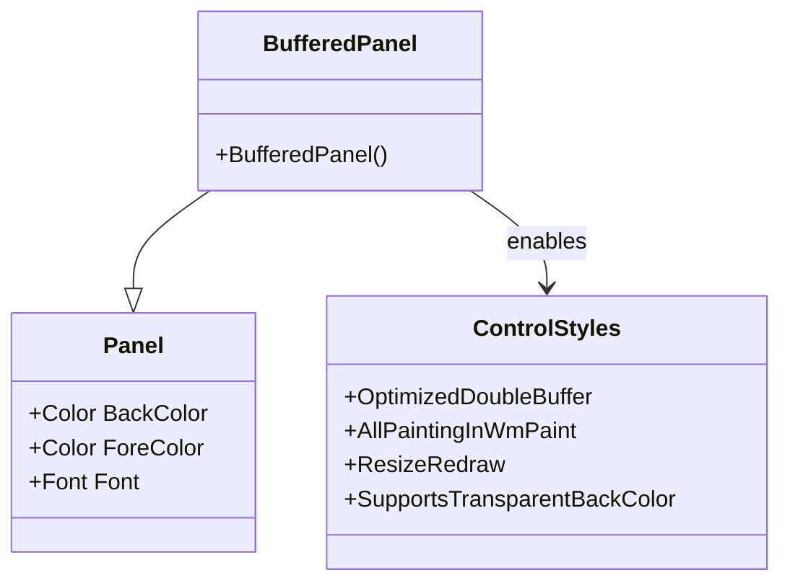

**图表来源**
- [BufferedPanel.cs:3-17](file://src/MacroDeck/GUI/CustomControls/BufferedPanel.cs#L3-L17)

#### 双缓冲样式配置

**新增功能**：BufferedPanel启用了多种双缓冲优化样式：

- **OptimizedDoubleBuffer**：启用优化双缓冲，减少闪烁
- **AllPaintingInWmPaint**：确保所有绘制都在WM_PAINT消息中进行
- **ResizeRedraw**：窗口大小改变时自动重绘
- **SupportsTransparentBackColor**：支持透明背景颜色

#### 性能优化特性

**新增功能**：BufferedPanel专注于性能优化：

- **内存管理**：通过合理的样式设置减少内存占用
- **重绘优化**：避免不必要的重绘操作
- **兼容性**：确保在各种Windows版本下的兼容性
- **可扩展性**：为子类提供良好的扩展基础

**章节来源**
- [BufferedPanel.cs:3-17](file://src/MacroDeck/GUI/CustomControls/BufferedPanel.cs#L3-L17)

### 设置界面集成分析

SettingsView提供了完整的字体配置界面，集成了以下功能：

#### 字体配置界面元素

| 控件类型 | 功能描述 | 数据绑定 |
|---------|----------|----------|
| Font ComboBox | 字体族选择器 | 绑定到系统已安装字体 |
| FontSize NumericUpDown | 字号调节器 | 绑定到基准字号配置 |
| CheckBold CheckBox | 粗体开关 | 绑定到粗体配置 |
| Save Button | 保存配置 | 触发配置保存和字体更新 |

#### 实时预览机制

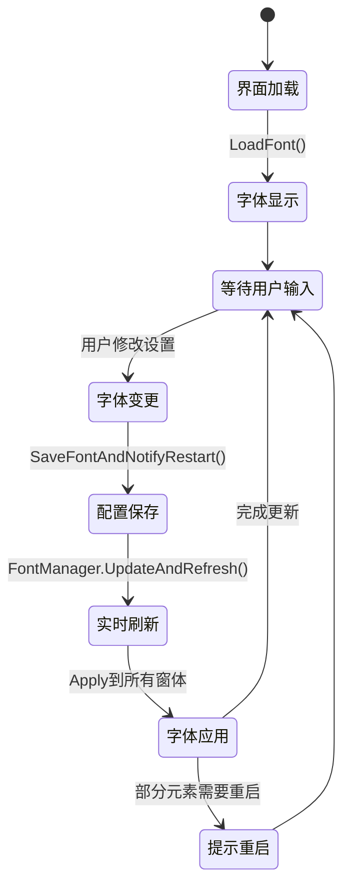

**图表来源**
- [SettingsView.cs:318-366](file://src/MacroDeck/GUI/MainWindowViews/SettingsView.cs#L318-L366)

**章节来源**
- [SettingsView.cs:118-145](file://src/MacroDeck/GUI/MainWindowViews/SettingsView.cs#L118-L145)
- [SettingsView.cs:318-366](file://src/MacroDeck/GUI/MainWindowViews/SettingsView.cs#L318-L366)

### 国际化字体支持

系统不仅支持字体配置，还集成了完整的国际化支持：

#### 多语言字符串管理

LanguageManager负责管理应用程序的多语言支持：

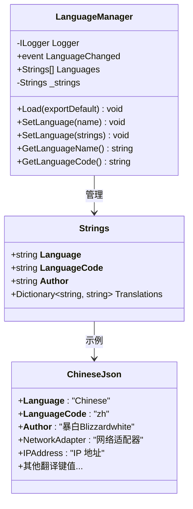

**图表来源**
- [LanguageManager.cs:12-155](file://src/MacroDeck/Language/LanguageManager.cs#L12-L155)
- [Strings.cs:3-443](file://src/MacroDeck/Language/Strings.cs#L3-L443)

**章节来源**
- [LanguageManager.cs:12-155](file://src/MacroDeck/Language/LanguageManager.cs#L12-L155)
- [Strings.cs:3-443](file://src/MacroDeck/Language/Strings.cs#L3-L443)

## 依赖关系分析

字体管理系统与其他组件的依赖关系如下：

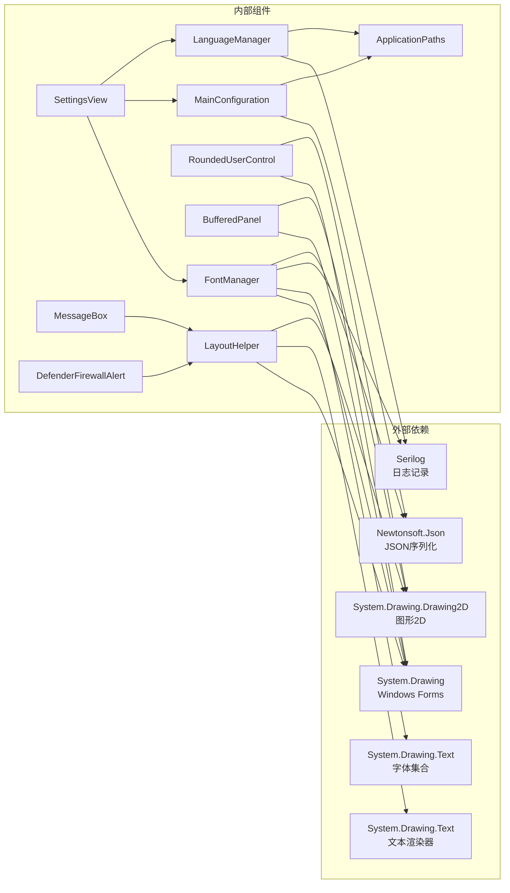

**图表来源**
- [FontManager.cs:1-6](file://src/MacroDeck/Utils/FontManager.cs#L1-L6)
- [LayoutHelper.cs:1-2](file://src/MacroDeck/Utils/LayoutHelper.cs#L1-L2)
- [RoundedUserControl.cs:1](file://src/MacroDeck/GUI/CustomControls/RoundedUserControl.cs#L1)
- [BufferedPanel.cs:1](file://src/MacroDeck/GUI/CustomControls/BufferedPanel.cs#L1)
- [SettingsView.cs:1-5](file://src/MacroDeck/GUI/MainWindowViews/SettingsView.cs#L1-L5)

### 关键依赖说明

1. **System.Drawing**：提供字体管理和基本图形渲染功能
2. **System.Drawing.Text**：访问系统字体集合和文本渲染器
3. **System.Drawing.Drawing2D**：提供高级图形绘制和抗锯齿功能
4. **Serilog**：日志记录和错误处理
5. **Newtonsoft.Json**：配置文件的序列化和反序列化

**章节来源**
- [FontManager.cs:1-6](file://src/MacroDeck/Utils/FontManager.cs#L1-L6)
- [LayoutHelper.cs:1-2](file://src/MacroDeck/Utils/LayoutHelper.cs#L1-L2)
- [RoundedUserControl.cs:1](file://src/MacroDeck/GUI/CustomControls/RoundedUserControl.cs#L1)
- [BufferedPanel.cs:1](file://src/MacroDeck/GUI/CustomControls/BufferedPanel.cs#L1)
- [SettingsView.cs:1-5](file://src/MacroDeck/GUI/MainWindowViews/SettingsView.cs#L1-L5)

## 性能考虑

字体管理系统在设计时充分考虑了性能优化：

### 内存管理优化

**重大更新**：系统采用了多项内存管理优化策略：

- **弱引用缓存**：使用`ConditionalWeakTable<Control, Font>`避免内存泄漏，确保控件销毁时自动清理缓存
- **延迟初始化**：字体信息只在首次需要时计算和缓存
- **增量更新**：只对发生变化的控件应用新的字体设置
- **默认值短路**：当配置为默认值时跳过所有字体计算，实现零开销
- **智能跳过机制**：LayoutHelper跳过AutoSize控件和Tag为"no-font"的控件

### 计算效率优化

- **基线算法**：使用固定的基线字号(9.75F)简化计算
- **幂等性保证**：Apply方法可反复调用且保持一致结果
- **批量更新**：支持一次性更新所有打开窗体的字体
- **内联优化**：LayoutHelper的GetTextHeight方法使用内联优化
- **边界检测优化**：仅考虑可见控件，忽略隐藏控件

### 渲染性能优化

**新增功能**：系统集成了多项渲染性能优化：

- **双缓冲技术**：RoundedUserControl和BufferedPanel启用OptimizedDoubleBuffer
- **抗锯齿优化**：仅在需要时启用SmoothingMode.AntiAlias
- **区域裁剪**：使用GraphicsPath进行精确的区域裁剪
- **样式缓存**：避免重复创建相同的画笔和画笔对象
- **内存池**：合理管理GDI资源，避免内存泄漏

### 线程安全考虑

- **异常隔离**：每个控件的字体应用都在独立try-catch块中执行
- **渐进式更新**：即使某个控件失败，也不会影响其他控件的更新
- **默认字体设置**：在程序启动早期设置默认字体，避免控件树创建时的字体缺失
- **并发安全**：FontManager使用线程安全的数据结构

**章节来源**
- [FontManager.cs:20-21](file://src/MacroDeck/Utils/FontManager.cs#L20-L21)
- [FontManager.cs:95-100](file://src/MacroDeck/Utils/FontManager.cs#L95-L100)
- [LayoutHelper.cs:18](file://src/MacroDeck/Utils/LayoutHelper.cs#L18)
- [RoundedUserControl.cs:22-24](file://src/MacroDeck/GUI/CustomControls/RoundedUserControl.cs#L22-L24)
- [BufferedPanel.cs:8-16](file://src/MacroDeck/GUI/CustomControls/BufferedPanel.cs#L8-L16)

## 故障排除指南

### 常见问题及解决方案

#### 字体设置不生效

**问题描述**: 修改字体设置后界面没有变化

**可能原因**:
1. 配置文件权限问题
2. 字体文件损坏
3. 系统字体缓存问题
4. **新增**：控件Tag为"no-font"时被跳过

**解决步骤**:
1. 检查配置文件写入权限
2. 验证字体文件完整性
3. 重启应用程序应用新设置
4. **新增**：检查控件Tag属性，移除"no-font"标记

#### 字体显示异常

**问题描述**: 字体显示模糊或变形

**可能原因**:
1. DPI缩放设置问题
2. 字体渲染引擎冲突
3. 显卡驱动问题

**解决步骤**:
1. 调整系统DPI设置
2. 更新显卡驱动
3. 尝试不同的字体族

#### 性能问题

**问题描述**: 字体更新时界面响应缓慢

**优化建议**:
1. 减少同时打开的窗体数量
2. 避免频繁的字体设置更改
3. 确保系统有足够的可用内存
4. **新增**：检查是否有大量控件标记为"no-font"

#### 实时刷新问题

**新增**：字体实时刷新不工作

**可能原因**:
1. **新增**：应用程序尚未调用`SetDefaultFontEarly`
2. **新增**：控件树中存在未处理的自定义绘制元素
3. **新增**：字体缓存出现问题
4. **新增**：LayoutHelper未在OnLoad中正确调用

**解决步骤**:
1. **新增**：确保在程序启动早期调用`SetDefaultFontEarly`
2. **新增**：重启应用程序以重新建立字体缓存
3. **新增**：检查控件树中是否有自定义绘制的元素需要重启生效
4. **新增**：确认在对话框的OnLoad中调用了LayoutHelper的调整方法

#### 布局适配问题

**新增**：对话框布局不正确

**可能原因**:
1. **新增**：未正确设置_originalClientSize
2. **新增**：控件AutoSize设置冲突
3. **新增**：嵌套容器布局复杂导致计算错误

**解决步骤**:
1. **新增**：确保在OnLoad中正确设置_originalClientSize
2. **新增**：检查控件的AutoSize属性设置
3. **新增**：对于复杂布局，考虑覆盖OnLoad实现自定义布局逻辑

#### 圆角控件渲染问题

**新增**：圆角控件显示异常

**可能原因**:
1. **新增**：双缓冲样式未正确启用
2. **新增**：抗锯齿设置冲突
3. **新增**：圆角半径设置不合理

**解决步骤**:
1. **新增**：确认RoundedUserControl的构造函数正常执行
2. **新增**：检查SmoothingMode设置是否正确
3. **新增**：验证borderRadius值是否在合理范围内

#### 双缓冲性能问题

**新增**：双缓冲导致性能下降

**可能原因**:
1. **新增**：过度使用双缓冲样式
2. **新增**：频繁的重绘操作
3. **新增**：内存管理不当

**解决步骤**:
1. **新增**：评估是否真的需要双缓冲
2. **新增**：优化重绘频率和范围
3. **新增**：确保及时释放GDI资源

**章节来源**
- [FontManager.cs:84-88](file://src/MacroDeck/Utils/FontManager.cs#L84-L88)
- [FontManager.cs:176-179](file://src/MacroDeck/Utils/FontManager.cs#L176-L179)
- [Program.cs:47-48](file://src/MacroDeck/Program.cs#L47-L48)
- [LayoutHelper.cs:88-103](file://src/MacroDeck/Utils/LayoutHelper.cs#L88-L103)
- [RoundedUserControl.cs:22-24](file://src/MacroDeck/GUI/CustomControls/RoundedUserControl.cs#L22-L24)
- [BufferedPanel.cs:8-16](file://src/MacroDeck/GUI/CustomControls/BufferedPanel.cs#L8-L16)

## 结论

Macro-Deck的字体管理系统是一个设计精良、功能完善的组件，经过重大更新后具备了以下突出特点：

### 技术优势

1. **实时刷新能力**：通过`UpdateAndRefresh`方法实现真正的运行时字体配置
2. **幂等操作保证**：`Apply`方法可反复调用且保持一致性，支持字体大小的动态调整
3. **智能缓存系统**：使用弱引用表缓存原始字体信息，避免内存泄漏
4. **完整的布局适配**：新增的LayoutHelper提供全面的字体自适应功能
5. **高性能渲染**：集成双缓冲和抗锯齿技术，显著提升图形质量
6. **自动字体适配**：RoundedUserControl支持动态字体高度调整
7. **性能优化到位**：采用多种优化策略确保系统响应速度
8. **用户体验优秀**：支持实时预览和渐进式更新
9. **扩展性强**：易於添加新的字体配置选项和集成方式

### 架构特色

1. **模块化设计**：清晰的职责分离和接口定义
2. **依赖注入**：通过构造函数注入减少耦合
3. **事件驱动**：基于事件的配置变更通知机制
4. **异常处理**：完善的错误处理和恢复机制
5. **默认值优化**：智能的默认值检测和短路机制
6. **布局自适应**：专门的工具类处理复杂的布局适配问题
7. **渲染优化**：集成多种图形渲染优化技术

### 应用价值

该字体管理系统不仅满足了Macro-Deck应用程序的字体需求，还为类似的应用程序提供了优秀的参考实现。其设计理念和技术方案可以广泛应用于需要动态字体管理的桌面应用程序中。

**重大更新**：通过实现真正的实时字体配置功能，包括运行时字体刷新、幂等Apply方法、缓存机制等增强，以及新增的LayoutHelper布局适配工具类，该系统在保证功能完整性的同时，也确保了卓越的用户体验和系统稳定性。

**新增功能总结**：
- **LayoutHelper工具类**：提供完整的字体自适应解决方案
- **智能高度调整**：针对不同控件类型的精确高度计算
- **表单自适应**：自动计算和调整对话框大小
- **性能优化**：内联优化和智能跳过机制
- **使用便利**：简单的API接口和标准使用模式
- **RoundedUserControl增强**：自动字体高度适配和双缓冲渲染
- **BufferedPanel优化**：专业的双缓冲支持和性能优化
- **抗锯齿技术**：提升图形渲染质量和视觉效果